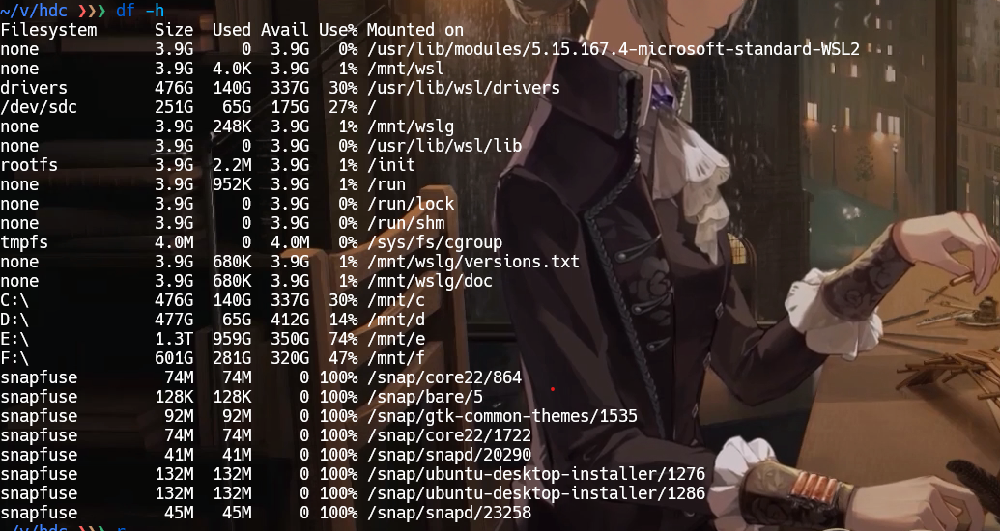

> https://github.com/crazyguitar/cppcheatsheet?tab=readme-ov-file

# Shell

## Shell 脚本基础语法

### 1. **脚本结构与执行**

   - 脚本首行 `#!/bin/bash`。
   - 赋予执行权限：`chmod +x script.sh`。
   - 运行脚本：`./script.sh` 或 `bash script.sh`。

### 2. **变量与数据类型**

   - 变量定义：`var=value`（**无空格**）。
   - 变量引用：`$var` 或 `${var}`。
   - 特殊变量：`$0`（脚本名）、`$1`（参数 1）、`$?`（退出码）、`$$`（进程 ID）。

### 3. **引号与字符串**

   - 单引号 `'`（原样输出）、双引号 `"`（解析变量）、反引号 `` ` ``（执行命令）。
   - 字符串拼接：`str="Hello, ${name}!"`。

### 4. **条件判断**

   - `if-then-elif-else-fi` 结构。
   - 条件表达式：

 ```bash
 if [ "$a" -eq "$b" ]; then  # 数值比较
 if [[ "$str" == "pattern" ]]; then  # 字符串匹配（推荐双中括号）
```

**常见的条件判断操作符：**

- **整数比较**：
    
    - `-eq` : 等于（equal）
    - `-ne` : 不等于（not equal）
    - `-gt` : 大于（greater than）
    - `-lt` : 小于（less than）
    - `-ge` : 大于或等于（greater than or equal）
    - `-le` : 小于或等于（less than or equal）
- **字符串比较**：
    - === : 等于
    - `!=` : 不等于
    - `<`, `>` : 比较字符串的字典序（需使用 `[[ … ]]`）
- **文件测试**：
    - `-e` : 文件存在
    - `-f` : 普通文件存在
    - `-d` : 目录存在
    - `-r` : 文件可读
    - `-w` : 文件可写
    - `-x` : 文件可执行

### 5. **循环结构**

   - `for` 循环：

 ```bash
     for i in {1..5}; do
         echo $i
     done
 ```

   - `while` 循环：

```bash
     while read line; do
         echo $line
     done < file.txt
```

- `&&` 若前一条语句（退出状态码零）成功，执行第二条，否则调整。
- `||` 若第一条失败（退出状态码非零），执行第二条，否则跳过。
- `;` 分隔符，无论是否成功执行

### 6. **函数**

   - 定义函数：

```bash
     function greet() {
         echo "Hello, $1!"
     }
     greet "Alice"  # 调用函数
 ```

### 7. **输入输出重定向**

   - 标准输入（`<`）、标准输出（`>`）、追加（`>>`）、错误输出（`2>`）。
   - 管道符 `|`：`cat file.txt | grep "error"`。

---

## Shell 脚本核心技能

### **1. 文件与目录操作**

| 命令       | 用途         | 核心功能                     |
|------------|--------------|----------------------------|
| `ls`       | **查看**     | 列出目录内容                 |
| `cd`       | **跳转**     | 切换工作目录                 |
| `cp`       | **复制**     | 复制文件或目录               |
| `mv`       | **移动**     | 移动/重命名文件或目录         |
| `rm`       | **删除**     | 删除文件或目录               |
| `mkdir`    | **创建**     | 新建目录                     |
| `touch`    | **新建**     | 创建空文件或更新文件时间戳     |
| `find`     | **搜索**     | 按条件递归查找文件            |
| `chmod`    | **权限**     | 修改文件权限                 |

`cat more less` 用于显示，`cat` 只展示最后布满屏幕的内容，`more` 逐行显示，`less` 支持上下滚动。

#### **`basename` 命令的基本用法**

1. **提取文件名**

```bash
basename /path/to/file.txt
# 输出: file.txt
```

  1. **删除后缀（可选参数）**

```bash
basename /path/to/file.txt .txt
# 输出: file
```

- **注意**：后缀必须匹配文件的完整后缀（如 `.tar.gz` 需要完整指定）。
 1. **处理目录路径**

```bash
basename /home/user/docs/
# 输出: docs
```

1. **相关选项**

- `-a`：处理多个参数（适用于 GNU 版本的 basename）。

```bash
basename -a /path/to/file1.txt /path/to/file2.txt
# 输出:
# file1.txt
# file2.txt
```

- `-s suffix`：指定要删除的后缀（等效于直接在参数后添加后缀）。

#### **相关命令：`dirname`**

`dirname` 与 `basename` 互补，用于提取文件路径中的目录部分：

```bash
dirname /path/to/file.txt
# 输出: /path/to

dirname /home/user/docs/
# 输出: /home/user
```

#### **`realpath`**

获取文件的绝对路径，解析符号链接：

```bash
realpath ../relative/path/file.txt
# 输出: /absolute/path/to/file.txt
```

#### **参数替换（Shell 内置）**

使用 `${var%pattern}` 和 `${var##pattern}` 提取路径部分：

```bash
path="/path/to/file.txt"

# 等效于 basename
echo "${path##*/}"  # 输出: file.txt

# 等效于 dirname
echo "${path%/*}"   # 输出: /path/to
```

#### **场景示例**

 1. **批量处理文件**

```bash
for file in /data/*.log; do
  base=$(basename "$file" .log)
  echo "处理文件: $base"
  # 执行操作: mv "$file" "${base}.bak"
done
```

 1. **脚本中获取自身名称**

```bash
#!/bin/bash
script_name=$(basename "$0")
echo "当前脚本: $script_name"
```

### **总结**

|命令|功能描述|示例|
|---|---|---|
|`basename`|从路径中提取文件名|`basename /a/b/c.txt → c.txt`|
|`dirname`|从路径中提取目录名|`dirname /a/b/c.txt → /a/b`|
|`realpath`|获取文件的绝对路径（解析符号链接）|`realpath ./file → /full/path`|

---

### **2. 文本处理与查看**

| 命令       | 用途         | 核心功能                     |
|------------|--------------|----------------------------|
| `cat`      | **合并**     | 显示/拼接文件内容             |
| `grep`     | **过滤**     | 按模式匹配文本行              |
| `sed`      | **替换**     | 流式文本编辑（替换/删除）|
| `awk`      | **解析**     | 结构化文本数据处理            |
| `head`     | **截取**     | 显示文件头部内容              |
| `tail`     | **追踪**     | 显示文件尾部或实时追加内容      |
| `wc`       | **统计**     | 计算行数、词数、字节数         |
| `sort`     | **排序**     | 对文本行排序                 |
| `uniq`     | **去重**     | 去除重复相邻行                |

---

### **3. 系统与进程管理**

| 命令       | 用途         | 核心功能                     |
|------------|--------------|----------------------------|
| `ps`       | **查看**     | 显示当前进程状态              |
| `top`      | **监控**     | 动态显示系统资源占用           |
| `kill`     | **终止**     | 发送信号终止进程              |
| `df`       | **容量**     | 查看磁盘空间使用情况           |
| `du`       | **统计**     | 计算目录/文件占用空间          |
| `free`     | **内存**     | 显示内存和交换分区使用量        |
| `uname`    | **信息**     | 查看系统内核版本信息           |
| `shutdown` | **关机**     | 关机或重启系统               |

---

### **4. 网络与通信**

| 命令       | 用途         | 核心功能                     |
|------------|--------------|----------------------------|
| `ping`     | **连通**     | 测试网络连通性               |
| `curl`     | **传输**     | 支持多协议的数据下载/上传      |
| `wget`     | **下载**     | 递归下载网络资源              |
| `ssh`      | **远程**     | 安全登录远程服务器            |
| `scp`      | **传输**     | 安全复制文件到远程主机         |
| `netstat`  | **状态**     | 显示网络连接和端口监听状态      |
| `ifconfig` | **配置**     | 查看/配置网络接口信息          |
| `traceroute`| **路由**    | 追踪数据包传输路径            |

---

### **5. 压缩与归档**

| 命令       | 用途         | 核心功能                     |
|------------|--------------|----------------------------|
| `tar`      | **打包**     | 归档文件（可结合压缩算法）|
| `gzip`     | **压缩**     | 使用 GZIP 算法压缩文件         |
| `zip`      | **封装**     | 创建 ZIP 格式压缩包           |
| `unzip`    | **解压**     | 解压 ZIP 文件                |
| `rsync`    | **同步**     | 增量备份和文件同步工具         |

---

### **6. 用户与权限**

| 命令       | 用途         | 核心功能                     |
|------------|--------------|----------------------------|
| `sudo`     | **提权**     | 以超级用户权限执行命令         |
| `useradd`  | **创建**     | 添加新用户账户               |
| `passwd`   | **密码**     | 修改用户密码                |
| `chown`    | **归属**     | 修改文件所有者               |
| `groups`   | **组别**     | 查看用户所属组               |

---

### **7. 开发与调试**

| 命令       | 用途         | 核心功能                     |
|------------|--------------|----------------------------|
| `gdb`      | **调试**     | GNU 调试器分析程序运行       |
| `make`     | **构建**     | 自动化编译管理工具           |
| `git`      | **版本**     | 代码版本控制工具             |
| `strace`   | **追踪**     | 跟踪程序系统调用和信号        |
| `diff`     | **对比**     | 比较文件差异                |

---

### **8.高级技巧**

   - **调试脚本**：
     - `set -x`（开启调试）、`set +x`（关闭调试）。
   - **错误处理**：
     - `set -e`（脚本遇到错误立即退出）、`trap`（捕获信号）。
   - **性能优化**：
     - 避免频繁启动子进程（如用 Shell 内置功能替代 `awk`）。
   - **正则表达式**：
     - 学习基础正则表达式（BRE）和扩展正则表达式（ERE）。
   - **进程管理**：
     - `&`（后台运行）、`wait`（等待子进程）、`nohup`（脱离终端运行）。

---

## 常用工具

### `ln`

`ln` 主要用于在两个文件中创建链接，链接又分为 `Hard Links` (硬链接) 和 `Symbolic Links` (符号链接或软链接)，其中默认为创建**硬链接**，使用 `-s` 参数指定创建软链接。

- 硬链接主要是增加一个文件的链接数，只要该文件的链接数不为 `0` ，该文件就不会被物理删除，所以删除一个具有多个硬链接数的文件，必须删除所有它的硬链接才可删除。
- 软链接简单来说是为文件创建了一个类似快捷方式的东西，通过该链接可以访问文件，修改文件，但不会增加该文件的链接数，删除一个软链接并不会删除源文件，即使源文件被删除，软链接也存在，当重新创建一个同名的源文件，该软链接则指向新创建的文件。
- 硬链接只可链接两个文件，不可链接目录，而软链接可链接目录，所以软链接是非常灵活的。

### `chmod`

永远更改一个文件的权限，主要有 **读取** 、 **写入** 、 **执行** ，三种权限，其中 **所有者** 、 **用户组** 、 **其他** 各占三个。`r=read` ， `w=write` ， `x=execute`

```shell
chmod +x filename        ### 为 user ，group ，others 添加执行权限
chmod -x filename        ### 取消 user ， group ，others 的执行权限
chmod ugo=rwx filename   ### 设置 user ，group ，others 具有 读取、写入、执行权限
```

### Tar

`tar` 主要用于创建归档文件，和解压归档文件，其本身是没有压缩功能的，但可以调用 `gzip` 、 `bzip2` 进行压缩处理。

参数解释：

- `-c` 创建归档
- `-x` 解压归档
- `-v` 显示处理过程
- `-f` 目标文件，其后必须紧跟 目标文件
- `-j` 调用 `bzip2` 进行解压缩
- `-z` 调用 `gzip` 进行解压缩
- `-t` 列出归档中的文件

```shell
tar -cvf filename.tar .       ### 将当前目录所有文件归档，但不压缩，注意后面有个 ’.‘ ，不可省略，代表当前目录的意思` 
tar -xvf filename.tar         ### 解压 filename.tar 到当前文件夹`
tar -cvjf filename.tar.bz2 .  ### 使用 bzip2 压缩`
tar -xvjf  filename.tar.bz2   ### 解压 filename.tar.bz2 到当前文件夹`
tar -cvzf filename.tar.gz     ### 使用 gzip  压缩`
tar -xvzf filename.tar.gz     ### 解压 filename.tar.gz 到当前文件夹`
tar -tf   filename            ### 只查看 filename 归档中的文件，不解压`
```

### Df

在 windows wsl 2 下 `df -h`：



1. **Filesystem**: 显示文件系统的类型或挂载来源。
2. **Size**: 文件系统的总大小。
3. **Used**: 已使用的磁盘空间。
4. **Avail**: 可用的磁盘空间。
5. **Use%**: 已使用的磁盘空间百分比。
6. **Mounted on**: 文件系统挂载的路径。
一些关键条目的解释：

- **none**: 表示这是一个内存文件系统，不占用实际的磁盘空间。例如，`/usr/lib/modules/5.15.167.4-microsoft-standard-WSL2` 和 `/mnt/wsl` 等都是内存文件系统，它们用于特定的系统功能，如模块存储和 WSL 的挂载点。
- **drivers**: 这是 WSL 的一个特殊文件系统，用于存储和管理 WSL 的驱动程序。
- **/dev/sdc**: 这通常是连接到您计算机的物理磁盘设备。在这个例子中，它显示为根文件系统 `/`，意味着您的 WSL 环境的主目录。
- **none**: 再次出现，表示其他内存文件系统，用于不同的系统功能。
- **tmpfs**: 这是一个临时文件存储系统，通常用于存放临时文件，它存在于内存中，所以速度很快，但在系统重启后会丢失数据。
- **C:\ D:\ E:\ F:\ **: 这些是您的 Windows 驱动器在 WSL 中的挂载点。例如，`C:\` 挂载在 `/mnt/c`，这意味着您可以通过 WSL 访问 C 盘的内容。
- **snapfuse**: 这是用于挂载 Snap 包的文件系统。Snap 是 Ubuntu 和其他 Linux 发行版中用于软件分发的系统。例如，`/snap/core22/864` 是一个特定的 Snap 包实例。
- **rootfs**: 这是 WSL 的根文件系统，类似于 Linux 系统中的 `/`。
- **run**: 这是一个临时文件系统，用于存放运行时数据，包括锁文件和会话特定的数据。

请注意，`snapfuse` 下的文件系统显示 100% 使用率，这可能是因为 Snap 包的挂载点没有正确释放空间，或者 Snap 包本身存在问题。如果这些 Snap 包不再需要，可以考虑卸载它们以释放空间。

`/dev/sdc` 显示为 251G，这很可能是您的 WSL2 分配的磁盘空间大小。对于 `/dev/sdc`，已使用的空间是 65G，这意味着在您的 WSL2 环境中，已经有 65GB 的空间被使用。

### **man**

> [!man man]
> man - an interface to the system reference manuals

A key preceded by a caret indicates the Ctrl key; thus `^K` is `ctrl-K`.

`CR` 代表回车键

## Shell 例子

### 统计代码行数

```shell
find . | grep '\.c$\|\.h$' | xargs wc -l
```

`find` 是搜索目录中的文件。`find .` 实际能够列出当前目录下的所有文件. 如果在文件很多的地方键入 `find .`, 将会看到过多的文件, 此时可以按 `CTRL + c` 退出。

我们的 `grep` 有一个参数, 它能够匹配以 `.c` 或 `.h` 结束的文件

## 列出一个 C 语言项目中所有被包含过的头文件

**如何列出一个 C 语言项目中所有被包含过的头文件?** 这个例子比刚才的稍微复杂一些, 但在 Windows 下你几乎无法通过 GUI 工具高效地做到它. 在 Linux 中, 我们只需要通过一行命令就可以做到了:

```
find . -name "*.[ch]" | xargs grep "#include" | sort | uniq
```

# 正则表达式

Regular Expression 正则表达式是通过一些特殊字元的排列组合，用来“搜索/取代/删除”，也即再字串上的表达式。他是一种字符串处理的标准，需要支持的工具，如 vi, sed, awk。

## 元字符和特性

### 字符匹配

- 普通字符：普通字符按照字面意义进行匹配，例如匹配字母 "a" 将匹配到文本中的 "a" 字符。
- 元字符：元字符具有特殊的含义。

### 元字符

`\s` 是所有空白字符，包括换行，`\S` 是所有非空白字符，不包括换行。`\d` 匹配任意数字字符，`\w` 匹配任意字母数字字符，`.` 匹配任意字符（除了换行符）等。

### 量词、限定符

- `*`：匹配前面的模式零次或多次。
- `+`：匹配前面的模式一次或多次。`*` 和 `+` 限定符都是贪婪的，因为它们会尽可能多的匹配文字，只有在它们的后面加上一个 `?` 就可以实现非贪婪或最小匹配。
- `?`：匹配前面的模式零次或一次。
- `{n}`：匹配前面的模式恰好 n 次。
- `{n,}`：匹配前面的模式至少 n 次。
- `{n,m}`：匹配前面的模式至少 n 次且不超过 m 次。

### 字符类

- `[ ]`：匹配括号内的任意一个字符。例如，`[abc]` 匹配字符 "a"、"b" 或 "c"。
- `[^ ]`：匹配除了括号内的字符以外的任意一个字符。例如，`[^abc]` 匹配除了字符 "a"、"b" 或 "c" 以外的任意字符。

### 边界匹配

- `^`：匹配字符串的开头。
- `$`：匹配字符串的结尾。
- `\b`：匹配单词边界。
- `\B`：匹配非单词边界。

### 分组和捕获

- `( )`：用于分组和捕获子表达式。标记一个子表达式的开始和结束位置。
- `(?: )`：用于分组但不捕获子表达式。

### 特殊字符

- `\`：转义字符，用于匹配特殊字符本身。
- `.`：匹配任意字符（除了换行符 `\n、\r`）。
- `|`：用于指定多个模式的选择。

例子：`^[a-zA-Z0-9_-]{3,15}$`。匹配任意字母、数字、`_-` 字符，3 到 15 次。

# Shell

| 语法 | 作用 |

| ------------ | --------------------------------------------- |

| `$val` | 引用变量 `val` 的值。 |

| `${val}` | 与 `$val` 相同，但明确界定变量名边界（用于避免歧义，如 `${val}123`）。 |

| `$(command)` | 执行命令并将结果替换到当前位置（命令替换）。 |

| 赋值加引号 | 仅在值包含空格或特殊字符时需要。 |

## **1. `date +%s` 的含义**

`date` 是 Linux/macOS 系统中用于显示或设置系统时间的命令，`+%s` 是 `date` 的格式化选项，表示**将当前时间转换为 Unix 时间戳**（即从 1970 年 1 月 1 日 00:00:00 UTC 到当前时刻的秒数）。

### **示例**

```bash

$ date +%s

1689253200 # 输出当前时间戳（会随执行时间变化）

```

### **在脚本中的作用**

在你的脚本中，`date +%s` 用于生成唯一的日志目录名（如 `log_1689253200`），确保每次运行脚本时创建的日志目录不会冲突。

## **2. `2>&1` 的含义**

`2>&1` 是 Shell 中的**重定向符号**，用于将**标准错误输出（stderr）合并到标准输出（stdout）**。具体解释：

- **`1`**：代表标准输出（stdout），是命令的正常输出。

- **`2`**：代表标准错误（stderr），是命令执行过程中的错误信息。

- **`>`**：重定向操作符，用于将输出导向到文件或其他位置。

- **`&1`**：表示 “指向标准输出的位置”。

- **作用**：将错误信息和正常输出合并，方便统一处理（如写入同一个日志文件）。

### **示例对比**

```bash

# 仅将标准输出重定向到文件（错误信息仍会显示在终端）

ls /nonexistent > output.txt

  

# 将标准输出和标准错误都重定向到文件

ls /nonexistent > output.txt 2>&1

  

# 执行命令，正常输出写入 log.txt，错误输出单独写入 error.txt

make > log.txt 2> error.txt

```

- **示例**：

```bash

# 执行 make 并将所有输出（正常日志+错误）写入 build.log

make -j16 > build.log 2>&1

```

- `> build.log`：将 `stdout` 写入 `build.log`。

- `2>&1`：将 `stderr` 重定向到 `stdout`（因此也会写入 `build.log`）。

## **1. `mkdir -p` 的含义**

`mkdir` 是用于创建目录的命令，`-p` 是其常用选项，作用是 **“递归创建目录，且忽略已存在的目录（不报错）”**。

### 具体作用

- **递归创建多级目录**：比如 `mkdir -p a/b/c`，会一次性创建 `a`、`a/b`、`a/b/c` 三级目录（如果它们不存在）。

- **避免 “目录已存在” 错误**：如果目录已经存在，`mkdir -p` 不会像普通 `mkdir` 那样报错（普通 `mkdir` 会提示 `File exists`）。

### 示例

```bash

# 假设当前没有任何目录

mkdir -p build/block_1 # 成功创建 build 和 build/block_1

mkdir -p build/block_1 # 再次执行不报错（因为目录已存在）

```

在你之前的脚本中，`mkdir -p "$LOG_DIR"` 和 `mkdir -p "$BUILD_SUBDIR"` 就是为了确保日志目录和编译子目录能被正确创建，即使上级目录不存在或目录已存在也不会中断脚本。

## `find -name -o`：文件搜索与条件逻辑

`find` 是 Shell 中用于搜索文件 / 目录的命令，`-name` 和 `-o` 是其核心参数。

### 1. 基本语法

```bash

find [搜索路径] [搜索条件]

```

### 2. 参数解释

- **`-name "pattern"`**：按文件名匹配搜索（支持通配符 `*`、`?` 等），区分大小写。

- 示例：`find ./src -name "*.cpp"` → 在 `./src` 目录下搜索所有 `.cpp` 后缀的文件。

- **`-o`**：逻辑 “或”（OR）运算符，用于连接多个搜索条件，满足任意一个条件即匹配。

- 注意：`find` 中默认条件是 “与”（AND），`-o` 显式指定 “或”。

### 3. 常见用法

```bash

# 搜索 ./src 目录下的 .cpp 文件 或 .c 文件（-o 连接两个 -name 条件）

find ./src -name "*.cpp" -o -name "*.c"

  

# 搜索 ./include 目录下的 .h 或 .hpp 文件，且排除 ./include/old 子目录

find ./include -path "./include/old" -prune -o -name "*.h" -o -name "*.hpp"

```

### 4. 注意事项

- 多个 `-o` 条件需要用括号包裹（需转义 ``\(` `\)``），否则可能逻辑错误：

正确：`find . \( -name "*.h" -o -name "*.cpp" \) -print`

- `-iname` 是 `-name` 的不区分大小写版本（如 `-iname "*.CPP"` 会匹配 `.cpp` `.CPP` 等）。
