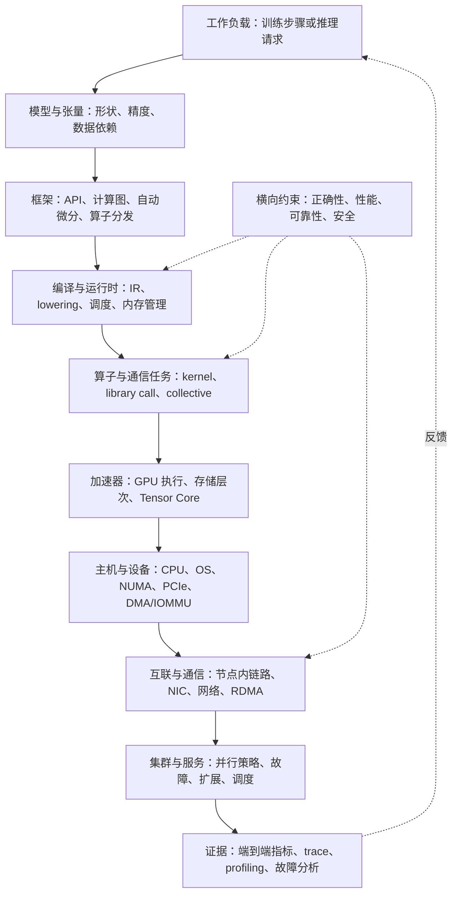
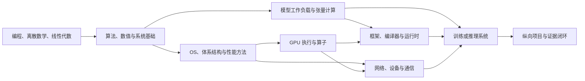

# AI Infra 导向的计算机知识体系与学习路径

本文以 AI Infrastructure（AI Infra）为主轴，帮助已有零散 CS、GPU、通信和系统笔记的读者判断：一个训练或推理工作负载如何穿过框架、编译器／运行时、算子、加速器、主机、互联与集群；为解释这条路径，需要先补哪些基础；怎样留下可核查的正确性与性能证据。本页负责跨学科的知识组织与学习取舍，[[02-AISystem/AI-sys-review|AI System 知识体系与项目导航]]负责更细的 AI Systems 专题和源码／项目入口。现有 `01-ComputerScience`、`02-AISystem`、`03-Algorithm` 和 `04-IntegratedCircuit` 目录保持各自内容归属。

这里的层级、阶段和投入深度是基于本仓库方向的学习设计，不是官方课程标准，也不把笔记数量等同于已掌握能力。历史课程与本科知识域仍在第六至八节保留作查漏对照。技术接口和性能结论要按具体版本、硬件、拓扑及工作负载复核；[CUDA 编程模型](https://docs.nvidia.com/cuda/cuda-programming-guide/01-introduction/programming-model.html)和 [NCCL 集合通信](https://docs.nvidia.com/deeplearning/nccl/user-guide/docs/usage.html)是两个可核对的官方入口。

## 一、从工作负载到集群的知识地图

地图的纵向维度是一次计算的实现路径，而非学科目录或同级技术列表。训练与推理是两类工作负载：前者尤其需要反向传播、状态更新与跨设备同步；后者尤其关注请求调度、Prefill／Decode、KV Cache、延迟和吞吐。它们共用框架、算子、设备和通信栈，只是在负载和优化目标上不同。

| 执行层 | 关键对象及其类型 | 本阶段应回答的问题 | 本库入口 |
| --- | --- | --- | --- |
| 工作负载与模型 | Transformer、MoE、Attention 是模型／计算结构；张量形状和精度是负载约束 | 哪些算子和状态占主要计算、内存与通信？训练和推理的依赖有什么不同？ | [[02-AISystem/algorithm-and-model/algorithm-and-model\|算法与模型]]、[[../02-AISystem/Acceleration/Acceleration\|推理]] |
| 框架与计算图 | Tensor API、autograd、dispatcher 是接口与机制；PyTorch 是实现 | 用户代码何时变成设备任务？依赖、同步和错误在哪里暴露？ | [[02-AISystem/Framework/Framework\|框架]] |
| 编译器与运行时 | IR 是表示，lowering 是转换，scheduler／allocator 是执行机制 | 一个算子怎样被映射为 kernel 或 library call？优化改变了什么语义与代价？ | [[01-ComputerScience/Compiler/Compiler\|编译基础]]、[[02-AISystem/AI-compiler/AI-compiler\|AI 编译器]] |
| 算子与并行计算 | GEMM、reduction、Attention 是计算；tiling、fusion、vectorization 是方法 | 算术量、访存量、通信量与数值误差如何共同约束算法？ | [[03-Algorithm/basic-algorithm/basic-algorithm\|算法基础]]、[[02-AISystem/hpc-basics/hpc-basics\|HPC 基础]] |
| GPU 与体系结构 | CUDA 是编程平台；SM、cache、HBM、Tensor Core 是硬件资源 | 线程与数据如何映射到资源？瓶颈来自计算、访存还是同步？ | [[02-AISystem/GPU/GPU\|GPU]]、[[01-ComputerScience/Architecture/Architecture\|体系结构]] |
| 主机、OS 与设备 | 进程、虚拟地址、驱动、DMA 映射是系统抽象与机制 | CPU 怎样提交工作，GPU/NIC 怎样访问内存，完成结果何时可见？ | [[01-ComputerScience/system-basics/system-basics\|系统基础]]、[[01-ComputerScience/operating-system/operating-system\|OS]]、[[02-AISystem/cluster-and-hardware/cluster-and-hardware\|集群硬件]] |
| 通信与互联 | collective 是通信语义，NCCL 是库，RDMA 是访问机制，PCIe/NVLink/网络是互联 | 谁提交、谁传输、数据走哪条路径、何时可重用缓冲区？ | [[01-ComputerScience/Network/Network\|网络]]、[[02-AISystem/Distributed/Distributed\|分布式通信]] |
| 集群与服务 | DP/TP/PP/EP 是并行策略；训练／推理框架实现编排 | 扩展后瓶颈、慢节点、超时、重试和资源失效怎样改变系统结果？ | [[02-AISystem/Distributed/Parallelism/Parallelism\|并行策略]]、[[../02-AISystem/Acceleration/Acceleration\|推理系统]] |

这张图回答“东西在系统中处于哪一层”；性能调查通常反向进行，从端到端指标定位等待或数据移动，再沿对应的设备、运行时和上层负载回溯。模型算法、运行时和硬件并非可互换的选项，不能把“改模型”“改 kernel”“换网络”混成同一类优化。

## 二、横向基础与学习深度

纵向执行栈无法表示数学、算法、正确性和性能方法等共同基础。下表把学科放到它们服务的问题旁边；“深入／定向／概览”描述本轮的学习深度，遇到具体项目可调整。对主线建议投入主要时间，对定向支撑只补直接依赖，对概览领域完成代表性验证后按需加深。

| 深度 | 基础学科与能力 | 直接服务的系统问题 | 最小可验证产出 |
| --- | --- | --- | --- |
| 深入 | C/C++、Linux、系统编程与 OS | 编译链接、内存、线程、I/O、设备和缓冲区生命周期 | 能从一段程序追踪提交、执行、同步与资源释放，并解释失败边界 |
| 深入 | 体系结构、GPU 与服务器拓扑 | ISA、缓存、局部性、NUMA、PCIe、GPU/NIC 数据路径 | 画出实际或指定硬件拓扑，给出每一跳的作用和可能限制 |
| 深入 | 算法、数值计算与性能工程 | GEMM／Attention／归约的工作量、精度、布局、访存、通信与加速比 | 正确性测试、复杂度／流量估算、baseline、测量和因果解释 |
| 深入 | 并行、网络通信与分布式系统 | 同步、collective、RDMA、扩展、局部故障与一致性 | 对一次计算通信过程给出参与者、数据、完成语义、故障及扩展证据 |
| 定向 | 线性代数、概率、微积分与离散证明 | 张量、梯度、误差、概率推断、复杂度及不变量 | 能推导相关形状和代价，知道何时需补数值分析或证明 |
| 定向 | ML 工作负载、框架和编译运行时 | 工作负载怎样改变算子、内存规划和并行策略 | 固定版本追踪模型 API 到一次 kernel／通信调用路径 |
| 定向 | 数据管理、软件工程、可靠性与安全 | checkpoint、持久化、可复现测试、故障恢复和权限 | 记录数据生命周期、测试条件、版本、信任边界及故障处理 |
| 概览 | 计算理论、通用数据库引擎、图形学、HCI 与其他平台 | 维持本科视野；编译器、渲染或产品项目出现时进入相应专题 | 能讲清核心模型并完成代表性题目或小任务，随后决定是否深入 |

这里的排序只适用于本仓库目前的 AI Infra 目标。安全、正确性和软件工程属于贯穿约束，即使单列为“定向”也必须在每个项目中满足基本要求。纯计算理论、通用 Web／移动开发和渲染可降低首轮投入，但形式语言对于编译器前端、数据库恢复对于训练状态、HCI 对服务界面仍可能是直接前置。

## 三、连接关系与关键边界

先修顺序应从概念依赖推出：编程与离散数学进入算法；C 和机器级程序进入体系结构与 OS；线性代数、概率和微积分进入模型计算；OS、并发和网络进入设备通信；GPU 执行和数据路径进入多 GPU 算法。框架／编译分支与硬件／通信分支可在共同基础之后交错，最终在训练或推理的纵向案例汇合。这里的箭头表示具备所需概念与能力，不要求先完成整门课程。

| 常见混放 | 各自是什么 | 对学习顺序的影响 |
| --- | --- | --- |
| ISA、微架构、SoC、GPU | ISA 是软件可见接口；微架构是实现；SoC 是系统集成；GPU 是一类并行处理器 | 用基本组成建立资源模型，按实际项目深入 RISC-V／RTL 或 GPU；不必先完成 SoC 设计 |
| cache、虚拟内存、DMA 映射 | cache 处理局部性，虚拟内存组织地址空间，DMA 映射建立设备可用地址 | 先区分 CPU VA、物理地址、I/O 地址与 GPU 地址，再分析跨设备数据路径 |
| TCP、socket、RDMA、NCCL | TCP 是协议，socket 是接口，RDMA 是机制，NCCL 是 GPU 通信库 | 先建立网络与接口模型，再追踪通信库的算法、transport 和完成语义 |
| 并发、并行、分布式 | 并发描述活动组织，并行描述同时执行，分布式还涉及独立故障 | 同步正确性、加速比与故障一致性需要不同证据 |
| 算法复杂度、Roofline、profiler | 渐近分析描述规模变化；性能模型给出资源上界；profiler 提供具体实现的观测 | 不用单次测量代替复杂度分析，也不用理论峰值当成实测性能 |
| 模型、算子、kernel、指令 | 模型定义计算与依赖，算子描述操作，kernel 是具体设备实现，指令是更低层执行对象 | 优化先确认正确性与工作负载，再定位该改哪一层 |

贯穿所有层的四个问题是：**正确性**（数据依赖、顺序、可见性、完成语义与数值误差）、**性能**（延迟、吞吐、带宽、占用与重叠）、**可靠性**（故障、重试、恢复和可观测性）、**成本／约束**（内存、网络、能耗和工程复杂度）。改变一层时先声明哪个目标提升、哪些条件固定、什么证据能推翻假设。详细通信分类和硬件路径见 [[02-AISystem/AI-sys-review#三、关键跨层连接|AI System 跨层连接]]。

## 四、按依赖推进的学习路径

先用已有笔记做诊断：找一段熟悉的张量计算，写出 shape、工作量和数据移动；再说明源码到机器执行、CPU 到 GPU 提交、GPU 到 NIC 传输的路径，标出哪些位置只会复述术语、尚不能独立解释。把结果记为“能独立解释／需要提示／未知”，并附推导、代码或测量。已掌握的前置可跳过重复教材；没有实验设备的部分记录模型和未验证假设。

| 阶段 | 前置与本轮重点 | 阶段产出／进入下一阶段的依据 |
| --- | --- | --- |
| 0. 定位起点 | 编程、Linux、离散证明、线性代数、C／内存、网络、并行的抽样诊断 | 一张缺口表：能解释的执行路径、缺失的直接前置、可用设备与每周预算 |
| 1. 程序与单机系统 | 用 C/C++ 和 Linux 建立编译链接、地址空间、缓存、线程、I/O、性能测量；算法与数值数学作为并行支线 | 能追踪一个程序从源码到系统调用；完成基准程序、正确性测试和一次瓶颈解释 |
| 2. 并行计算与 GPU | CPU 并行、向量化、局部性、CUDA execution／memory model、kernel、数据布局与数值误差 | 一个算子从 CPU baseline 到并行／GPU 版本的正确性、性能和机制对照；无 GPU 时先完成 CPU 与模型部分 |
| 3. 框架、编译与运行时 | 张量／算子 API、autograd、图、dispatcher、IR/lowering、allocator、stream/event；用真实调用路径检验理解 | 固定版本追踪一条从模型 API 到 kernel 或 library call 的符号与数据路径 |
| 4. 主机、设备与通信 | NUMA、PCIe、DMA/IOMMU、GPU/NIC、网络、RDMA、collective、ordering／visibility／completion | 画出生产—传输—消费路径，区分控制、数据和同步路径；给出消息大小与拓扑条件 |
| 5. 训练／推理和集群 | DP/TP/PP/EP、通信计算重叠、局部故障；Prefill／Decode、KV Cache、量化与服务调度按项目选择 | 分解一次 step 或请求的计算、等待、显存与通信；用对照数据说明扩展或优化效果 |
| 6. 纵向案例与补缺 | 从 NCCL、NVSHMEM、DeepEP、Megatron、vLLM 或 GPU 服务器中选一个版本固定的对象；回查薄弱基础 | 提交工作负载定义、调用链、硬件路径、正确性与性能证据、故障边界和未验证条件 |

阶段 2 的 GPU 与阶段 3 的框架分支可交错；阶段 4 的网络基础可在阶段 1 后开始，RDMA 和 collective 要等内存、同步与设备模型清晰。数学和算法按工作负载持续补齐，不作为“学完数学才允许碰系统”的闸门。每次只推进一项主要实现任务和一条前置支线。建议从一个真实问题进入，例如单算子慢、多卡扩展差、推理延迟高或通信结果不稳定，再沿第三节的依赖图取用材料。

学习证据按三层记录：**解释**是能给出对象、机制及边界，**应用**是能独立完成变式题目或小实现，**综合**是能固定条件跨层定位问题并说明取舍。主线目标是“应用＋纵向综合”，支撑领域达到服务问题所需的应用，概览领域达到解释和代表性验证。每个项目至少保存输入规模／负载、软件版本、硬件或模拟条件、正确性检查、baseline、测量与推论；阅读链接和“进行中”索引不算完成证据。

## 五、现有知识库的取用方式

目前的笔记分布反映了材料积累，不代表个人掌握深度。先按执行层和问题定位下表入口，再进入专题正文；本页不复制 GPU、RDMA、NCCL 等专题的机制细节，也不重排文件目录。

| 问题或能力 | 基础入口 | 深入入口与使用时机 |
| --- | --- | --- |
| 编程、构建、调试与系统调用 | [[01-ComputerScience/Programming/Programming\|编程]]、[[00-ToolKit/Development/Development\|工具]]、[[01-ComputerScience/system-basics/system-basics\|系统基础]] | [[01-ComputerScience/operating-system/operating-system\|OS]]；追踪执行或内存异常时进入 |
| 算法、矩阵与数值代价 | [[03-Algorithm/basic-algorithm/basic-algorithm\|基础算法]]、[[02-AISystem/algorithm-and-model/矩阵论基础\|矩阵基础]] | [[02-AISystem/algorithm-and-model/algorithm-and-model\|模型]]；确定 shape、计算图和误差要求时进入 |
| 体系结构和设备拓扑 | [[01-ComputerScience/Architecture/Architecture\|体系结构]]、[[01-ComputerScience/SoC/SoC\|SoC]] | [[02-AISystem/cluster-and-hardware/cluster-and-hardware\|GPU 服务器]]；分析 NUMA、PCIe、GPU/NIC 位置时进入 |
| 并行、GPU 与性能 | [[02-AISystem/hpc-basics/hpc-basics\|并行基础]]、[[02-AISystem/GPU/GPU\|GPU]] | [[02-AISystem/GPU/Operator/Operator\|算子]]、[[../02-AISystem/Acceleration/Acceleration\|推理]]；做正确性和性能对照时进入 |
| 框架与编译 | [[01-ComputerScience/Compiler/Compiler\|编译基础]]、[[02-AISystem/Framework/Framework\|框架]] | [[02-AISystem/AI-compiler/AI-compiler\|AI 编译器]]；遇到 IR、lowering 和后端路径时进入 |
| 网络、通信与分布式 | [[01-ComputerScience/Network/Network\|网络]]、[[02-AISystem/Distributed/Distributed\|分布式]] | [[02-AISystem/Distributed/RDMA/RDMA\|RDMA]]、[[02-AISystem/Distributed/NCCL/NCCL\|NCCL]]、[[02-AISystem/Distributed/NVSHMEM/NVSHMEM\|NVSHMEM]]；确认语义、传输路径与同步时进入 |
| 专业项目与横向复盘 | [[02-AISystem/AI-sys-review\|AI System 总图]] | 选训练／推理或服务器案例，联结正确性、性能、可靠性与成本，并记录未验证边界 |

## 六、本科知识域对照

以下保留上一版的本科知识域覆盖表，用来查漏和选择方向，不作为 AI Infra 的执行层级或线性课程表。括号中的缩写对应 CS2023 知识域；计算理论在表后单列。

| 组织维度 | 知识域 | 本科阶段应建立的核心模型 | 与其他知识的直接联系 |
| --- | --- | --- | --- |
| 数学与推理 | 数学与统计（MSF） | 逻辑、集合、关系、归纳与证明；计数、图、概率统计；线性代数与微积分基础 | 离散数学支撑算法、形式语言与正确性；线性代数和概率支撑 AI、图形与数据分析 |
| 数学与推理 | 算法基础（AL） | ADT、数据结构、复杂度与摊还分析；分治、贪心、动态规划、图算法；问题归约 | 连接数学证明与程序实现；为索引、编译器分析、搜索和调度提供方法 |
| 程序表达 | 软件开发基础（SDF） | 变量、控制流、函数、递归、数据抽象、模块、调试与测试 | 是后续实现工作的共同前置；语言数量不代表能力层级 |
| 程序表达 | 编程语言基础（FPL） | 作用域、绑定、类型、求值、闭包、可变状态、范式与语义；解释和编译 | 向下连接运行时、ABI、ISA，向上支撑 API 设计和程序正确性 |
| 系统实现 | 系统基础（SF） | 数据表示、机器级程序、编译链接、存储层次、异常控制流、基本性能模型 | 从程序员视角把语言、硬件与 OS 接起来，是系统课程的桥梁 |
| 系统实现 | 体系结构与组成（AR） | 数字逻辑、ISA、数据通路、流水线、缓存、并行性与性能权衡 | ISA 是软硬件接口；微架构实现 ISA；组成知识支撑 OS 与硬件设计 |
| 系统实现 | 操作系统（OS） | 进程线程、调度、同步、虚拟内存、文件系统、持久化和 I/O | 用硬件机制实现资源管理、隔离与抽象，支撑数据库和网络服务 |
| 系统实现 | 网络与通信（NC） | 分层、寻址、转发与路由、可靠传输、流量与拥塞控制、应用协议 | 协议规定端点与网络行为；socket 是应用使用网络的一类接口 |
| 系统实现 | 并行与分布式计算（PDC） | 任务分解、同步、负载均衡；消息传递、局部故障、复制与一致性 | 并行计算关注协作与加速；分布式系统还必须处理独立故障和通信不确定性 |
| 数据与应用 | 数据管理（DM） | 数据建模、关系代数、SQL、约束与规范化；索引、查询执行、事务和恢复 | 由数据结构、OS 存储与并发机制实现，进一步连接分布式数据系统 |
| 数据与应用 | 人工智能（AI） | 搜索、知识表示与推理、不确定性、决策、机器学习与评估 | 依赖算法、逻辑、概率与线性代数；深度学习和 LLM 是其中的后续方向 |
| 数据与应用 | 图形与交互技术（GIT） | 几何变换、采样、光栅化、可见性、光照与基本渲染 | 连接线性代数、几何、数值计算与 GPU；与 HCI 的研究问题不同 |
| 数据与应用 | 特定平台开发（SPD） | 选择 Web、移动或嵌入式等一个平台，理解其 API、生命周期和资源约束 | 用一项平台实践应用共同基础；不要求同时学习所有框架和平台 |
| 工程与责任 | 软件工程（SE） | 需求、规格、设计、模块边界、版本协作、测试、交付、维护和演化 | 贯穿程序从构想到长期维护的生命周期；工具链只是实现手段 |
| 工程与责任 | 安全（SEC） | 威胁模型、信任边界、认证授权、内存安全、密码学用途、网络与应用安全 | 是跨语言、OS、网络、数据和人的属性，不能缩减为密码算法或攻防工具 |
| 工程与责任 | 人机交互（HCI） | 用户与任务、原型、交互反馈、可用性评估和无障碍 | 连接需求分析、界面实现和真实使用效果；界面美观不能代替可用性证据 |
| 工程与责任 | 社会、伦理与职业（SEP） | 隐私、知识产权、可访问性、公平、环境影响、专业责任和技术沟通 | 应随项目讨论具体利益相关者、风险及取舍，贯穿设计与评估 |

**计算理论需要单独安排。** 学习形式语言、有限自动机、上下文无关文法、图灵机、可判定性、可计算性以及 P、NP 与归约，分别回答“如何描述计算”“哪些问题能够求解”“求解需要多少资源”。它与算法设计相连，但不能被刷题、语言语法或编译工具使用替代。微积分可与编程并行学习；常规算法和 OS 入门不必等全部连续数学完成。

## 七、课程与教材入口

原有课程和教材链接按学科保留，供完成第四节的具体阶段时选用。表中的“本轮”是原先的本科覆盖建议；AI Infra 主线以本页第一至五节的能力目标为准。课程学期与入口核对时间沿用上一版记录（2026-09-19）；公开主页可访问不代表视频、评分服务和 lab 环境都公开。

| 模块 | 主资料或课程 | 本轮选读范围与使用方式 |
| --- | --- | --- |
| 程序设计 | [Composing Programs 第 2 版](https://composingprograms.com/pages/) | 函数、递归、数据抽象和程序组织；已有编程基础可按诊断跳读，使用现有 C/C++ 笔记补系统语言能力 |
| 离散数学 | [MIT 6.042J，2015](https://ocw.mit.edu/courses/6-042j-mathematics-for-computer-science-spring-2015/) | 逻辑与证明、集合关系、图、计数和离散概率；以题目与推导为主 |
| 线性代数 | [MIT 18.06SC，2011](https://ocw.mit.edu/courses/18-06sc-linear-algebra-fall-2011/) | 向量空间、线性变换、正交投影、特征值与分解；结合矩阵笔记复习 |
| 微积分 | [MIT 18.01SC，2010](https://ocw.mit.edu/courses/18-01sc-single-variable-calculus-fall-2010/pages/syllabus/) | 极限、导数、积分与近似；进入多变量优化时另补偏导、梯度和链式法则，单变量课程不覆盖这些全部内容 |
| 概率统计 | [MIT 18.05，2022](https://ocw.mit.edu/courses/18-05-introduction-to-probability-and-statistics-spring-2022/) | 条件概率、随机变量、分布、估计与检验；连续分布部分按课程要求补积分基础 |
| 数据结构与算法 | [MIT 6.006，2011](https://ocw.mit.edu/courses/6-006-introduction-to-algorithms-fall-2011/pages/syllabus/)，实现薄弱时先用 [CS 61B，2018](https://sp18.datastructur.es/) | 6.006 需要编程与离散数学基础；用 61B 补实现短板，不必把两门相同主题完整重复 |
| 系统基础 | [CMU 15-213／CSAPP](https://www.cs.cmu.edu/~213/)＋现有 NJU 笔记 | 表示、机器级程序、链接、存储、异常和系统级 I/O；CSAPP 与 NJU 选一条主线，另一条补解释 |
| 组成原理 | [Berkeley CS 61C 课程讲义](https://notes.cs61c.org/) | 重点补数字逻辑、RISC-V、数据通路、流水线；C、缓存和虚拟内存按已有证据跳过重复内容 |
| 操作系统 | [OSTEP 作者网站](https://pages.cs.wisc.edu/~remzi/OSTEP/) | 按虚拟化、并发、持久化组织；首轮用练习和小程序验证，再决定是否进入完整 xv6／rCore |
| 计算机网络 | [Kurose／Ross 作者课程与配套资源](https://gaia.cs.umass.edu/kurose_ross/online_lectures.htm) | 应用、传输、网络和链路的基本模型；结合抓包、协议状态分析与 socket 程序 |
| 数据管理 | [CMU 15-445，2024 秋](https://15445.courses.cs.cmu.edu/fall2024/) | 从数据模型与 SQL 到索引、查询、事务和恢复；引擎项目需要相应的系统编程能力 |
| 软件构造与工程实践 | [MIT 6.031，2022 春](https://web.mit.edu/6.031/www/sp22/) | 规格、测试、ADT、不变量、代码评审与并发；使用 TypeScript，需补相应语法；需求与维护能力在综合项目中补齐 |
| 计算理论 | [Stanford CS103](https://web.stanford.edu/class/cs103/) | 已会离散证明则重点看自动机、可计算性、复杂性与归约；不能只记结论而省去证明训练 |
| 编程语言与编译器 | [UW CSE341，2019 春](https://courses.cs.washington.edu/courses/cse341/19sp/)；编译部分接 [Stanford CS143](https://web.stanford.edu/class/cs143/) | 先学作用域、闭包、类型和求值，再接词法、语法、语义检查、IR 与代码生成；首轮项目只选解释器或编译器前端之一 |
| AI 基础 | [Berkeley CS188，2024 春](https://inst.eecs.berkeley.edu/~cs188/archive/sp24/) | 搜索、逻辑、概率推理与决策，再连接基础学习；现有机器学习笔记用于相应部分 |
| 图形学 | [Berkeley CS184，2026 夏](https://cs184.eecs.berkeley.edu/su26/) | 先变换、采样和光栅化，再理解渲染；选一个基础作业，不要求首轮完成全部渲染工程 |
| 并行与分布式 | [Stanford CS149，2024 秋](https://gfxcourses.stanford.edu/cs149/fall24)；分布式参考 [MIT 6.5840](https://pdos.csail.mit.edu/6.824/) | 首轮选并行模型、同步、通信与故障案例；6.5840 的完整论文／lab 路线作为后续加深，不是共同基础的起点 |
| 安全 | [Berkeley CS161 教材](https://textbook.cs161.org/) | 安全原则、内存安全、密码学用途、Web 与网络安全；对应项目里的威胁模型和验证 |
| HCI | [Stanford CS147，2024 秋](https://hci.stanford.edu/courses/cs147/2024/au/) | 用户任务、原型、可用性与无障碍；把一次设计—观察—修订用于自己的平台项目 |
| 职业责任与平台实践 | [CS2023 知识域目录](https://csed.acm.org/knowledge-areas/)作覆盖检查；复用现有平台资料 | 对项目补利益相关者、隐私、许可证、影响与沟通记录；平台技术按项目需求选择，不额外增加框架清单 |

## 八、既有笔记与扩展资料

以下保留原有笔记、书目和资料发现入口，按主题查阅；它们不构成另一套必修清单。上一版核对了第七节的主资料，本节其余历史链接未逐一复核。原 CS 61C 2024 秋主页和 CS144 主页在上一轮浏览时无法读取，历史地址仍保留供查找。

### 1. 编程与算法

| 子领域/知识点 | 当前笔记 | 参考资料 | 建议证据 |
| --- | --- | --- | --- |
| C、内存、调试 | [[01-ComputerScience/Programming/C]]、[[01-ComputerScience/Programming/程序执行的内存分配]] | CSAPP、CMU 15213 | 可调试的小型系统程序与内存分析 |
| C++、STL、现代特性 | [[01-ComputerScience/Programming/modern-cpp/现代C++]]、[[01-ComputerScience/Programming/modern-cpp/system-review/系统梳理]] | [现代 C++ 教程](https://changkun.de/modern-cpp/zh-cn/00-preface/) | C++ 项目、测试、构建和错误复盘 |
| 并发编程 | [[01-ComputerScience/Programming/concurrent-programming/并发编程]]、[[01-ComputerScience/Programming/concurrent-programming/并发编程核心]] | 《Linux 多线程服务端编程》、C++ 并发资料 | 竞态复现、同步修复、基准对比 |
| 数据结构与算法 | [[03-Algorithm/basic-algorithm/算法入门]]、[[03-Algorithm/basic-algorithm/basic-algorithm]] | [Hello 算法](https://www.hello-algo.com/)、[CS 61B](https://sp18.datastructur.es/)、[LeetCode](https://leetcode.cn/)、[代码随想录](https://programmercarl.com/)、[CodeTop](https://codetop.cc/home) | 能解释复杂度并在项目中正确使用 |
| Rust/Go/Python/Web | [[01-ComputerScience/Programming/Rust]]、[[01-ComputerScience/Programming/golang]]、[[01-ComputerScience/Programming/Python]]、[[01-ComputerScience/Programming/web/web]] | [Rust 中文书](https://rustwiki.org/zh-CN/book/title-page.html)、[Go 语言圣经](https://golang-china.github.io/gopl-zh/)、[TypeScript 手册](https://typescript.bootcss.com/)、[ES6](https://es6.ruanyifeng.com/) | 一个可运行工具或服务及 README/测试 |

### 2. 系统基础与体系结构

| 子领域/知识点 | 当前笔记 | 参考资料 | 建议证据 |
| --- | --- | --- | --- |
| 表示、编译、汇编、链接 | [[01-ComputerScience/system-basics/ch1-program-representation-linking/一-程序的表示-转换与链接]]、[[01-ComputerScience/system-basics/ch1-program-representation-linking/程序的链接]] | 《深入理解计算机系统》、[CMU 15-213](https://www.cs.cmu.edu/~213/) | gcc/clang、objdump、readelf 实验 |
| 执行、内存、缓存 | [[01-ComputerScience/system-basics/ch2-program-execution-memory/二-程序的执行和存储访问]]、[[01-ComputerScience/system-basics/ch2-program-execution-memory/层次存储结构]] | 《计算机系统基础》、CSAPP | 汇编、缓存或内存访问测量 |
| 异常、中断、IO | [[01-ComputerScience/system-basics/ch3-exceptions-interrupts-io/三-异常-中断和输入-输出]]、[[01-ComputerScience/system-basics/ch3-exceptions-interrupts-io/8.IO操作的实现]] | [[01-ComputerScience/system-basics/nju-系统基础]] | 系统调用、缺页、IO 路径说明 |
| 组成、ISA、流水线、缓存 | [[01-ComputerScience/Architecture/Architecture]]、[[01-ComputerScience/Architecture/book-cs-organization-riscv/book-cs-organization-riscv]] | 《计算机组成与设计》、[CS 61C](https://cs61c.org/fa24/)、[ETH DDCA](https://csdiy.wiki/%E4%BD%93%E7%B3%BB%E7%BB%9F%E7%BB%93%E6%9E%84/DDCA/) | 数据通路图、模拟器或性能解释 |
| 超标量与性能 | [[01-ComputerScience/Architecture/book-super-scalar-processor/book-super-scalar-processor]]、[[01-ComputerScience/Architecture/Simulator]] | CSAPP、体系结构课程 | profiling、CPI/缓存/分支数据 |

### 3. 操作系统与 IO

| 子领域/知识点 | 当前笔记 | 参考资料 | 建议证据 |
| --- | --- | --- | --- |
| 进程、线程、调度 | [[01-ComputerScience/operating-system/进程与线程]]、[[01-ComputerScience/operating-system/OSTEP/Concurrency]] | 《操作系统导论》、[MIT 6.S081](https://pdos.csail.mit.edu/6.S081/2021/schedule.html)、[CS 162](https://cs162.org/) | xv6/rCore lab 或并发 bug 复盘 |
| 虚拟内存、地址空间 | [[01-ComputerScience/operating-system/虚拟内存]]、[[01-ComputerScience/operating-system/虚拟地址空间]] | OSTEP、[rCore Tutorial](https://rcore-os.cn/rCore-Tutorial-Book-v3/)、[Writing an OS in Rust](https://os.phil-opp.com/) | 地址转换、page fault、映射实验 |
| IO、文件、内核 | [[01-ComputerScience/operating-system/IO]]、[[01-ComputerScience/operating-system/操作系统核心]]、[[01-ComputerScience/operating-system/rCore]] | [LearningOS](https://github.com/LearningOS)、[JYY OS](https://jyywiki.cn/OS/2023/index.html) | 系统调用/文件系统/阻塞行为验证 |

### 4. 网络、高性能、分布式与存储

| 子领域/知识点 | 当前笔记 | 参考资料 | 建议证据 |
| --- | --- | --- | --- |
| TCP/IP 与网络基础 | [[01-ComputerScience/Network/计算机网络概述]] | 《计算机网络：自顶向下方法》、[CS 144](https://cs144.github.io/)、[中科大课程视频](https://www.bilibili.com/video/BV1JV411t7ow/) | socket/可靠传输实验、抓包记录 |
| 网络服务端 | [[01-ComputerScience/Network/高性能网络]]、[[01-ComputerScience/Programming/web/网络编程]] | 《Unix 网络编程》《Linux 高性能服务器编程》《TCP/IP 网络编程》 | 并发 TCP 服务、压测和故障复盘 |
| RDMA/DPDK/OVS/驱动 | [[01-ComputerScience/Network/高性能网络]] | RDMA、DPDK、OVS、网卡驱动和 FPGA 网卡资料 | 记录协议、拓扑、驱动、拥塞/流控与 TCP 对比 |
| 分布式与 Raft | [[02-AISystem/Distributed/Distributed]]；现有入口偏并行通信，故障模型、复制与共识仍需单独补齐 | [MIT 6.5840](https://pdos.csail.mit.edu/6.824/schedule.html) | Raft/KV 项目、故障注入、一致性分析 |
| 数据库与存储 | 当前以待建设子领域为主 | [CMU 15-445](https://15445.courses.cs.cmu.edu/)、NVMe/SPDK、事务、纠删码、对象存储 | workload、恢复、持久化和事务测试 |

### 5. 编译器、并行/GPU、AI 与 SoC

| 子领域/知识点 | 当前笔记 | 参考资料 | 建议证据 |
| --- | --- | --- | --- |
| 编译器基础与 LLVM | [[01-ComputerScience/Compiler/Compiler]]、[[01-ComputerScience/Compiler/LLVM简介]] | [北大编译实践](https://pku-minic.github.io/online-doc/)、[CS143](https://web.stanford.edu/class/cs143/)、[KAIST CS420](https://github.com/kaist-cp/cs420)、[LLVM Tutorial](https://llvm.org/docs/tutorial/)、龙书 | 解释器、IR、LLVM pass 或后端实验 |
| 并行计算与 GPU | [[01-ComputerScience/Architecture/AI-Spatial-Architecture]] | [Stanford CS149](https://gfxcourses.stanford.edu/cs149/fall24)、CUDA、FlashAttention、算子优化 | kernel、正确性测试、profiling 与优化数据 |
| AI 基础与 LLM 工程 | [[02-AISystem/algorithm-and-model/机器学习基础]]；LLM 工程作为后续方向 | [李宏毅 ML](https://speech.ee.ntu.edu.tw/~hylee/ml/2023-spring.php)、[LLM Cookbook](https://datawhalechina.github.io/llm-cookbook/) | 可运行实验、版本、数据和限制 |
| SoC/RISC-V/嵌入式 | [[01-ComputerScience/SoC/SoC]]、[[01-ComputerScience/SoC/ysyx/ysyx]]、[[01-ComputerScience/SoC/riscv/riscv]]、[[01-ComputerScience/SoC/Embedded/Embedded]] | AMBA 协议族、NoC 互连架构，以及 Chipyard、PCIe、STM32、PULP、RVFPGA 仓库资料 | RTL/仿真、波形、测试、工具链和硬件限制 |

### 6. 综合入口与选择规则

| 用途 | 入口 |
| --- | --- |
| 综合路线与课程发现 | [JYY Reading List](https://jyywiki.cn/Reading_List.md)、[CS 自学指南](https://csdiy.wiki/)、[HackWay](https://hackway.org/)、[LearnCS](https://www.learncs.site/) |
| NJU 系统/程序课程 | [NJU 程序构造](http://www.why.ink:8080/CPL/2023/)、[NJU OS ICS Wiki](https://njuics-wiki.github.io/ics-wiki/) |
| 资源使用 | 每个项目优先选一个主教材/课程、一个实现或 lab、一个可运行产出；同类资料只在解释不同或项目需要时并列。 |
| 学习记录 | 记录触发问题、知识点、现有笔记、参考资料、产出证据和未解决问题；不把阅读链接当作完成。 |

## 九、学习记录与后续更新

本页尚未汇集可用于判定个人掌握程度的诊断和完成证据；这不表示没有学过已有资料。前文的产出、实验和项目均为学习安排，本轮只重组知识架构与路径，尚未执行学习任务。

| 记录字段 | 应记录的内容 |
| --- | --- |
| 触发问题与模块 | 当前要解释什么现象或解决什么问题，对应哪个知识域／阶段 |
| 起点与资料 | 已具备的前置、仍不清楚的概念、主教材及版本／课程学期 |
| 独立产出 | 习题推导、代码版本、测试或实验结果的实际位置；注明使用过的提示与帮助 |
| 结论与关系 | 核心机制、适用边界、反例，以及它与已知概念的直接连接 |
| 状态与下一步 | 待诊断、补前置、学习中、待验证或达到本轮标准；下一项具体问题 |

学习状态以证据变化更新，主题索引中的“进行中”只描述材料维护情况。新的知识笔记应由实际问题和内容触发，并链接回此处相应模块；阶段安排和资源选择集中在本页维护，避免在多个目录各保存一份互相冲突的总计划。
