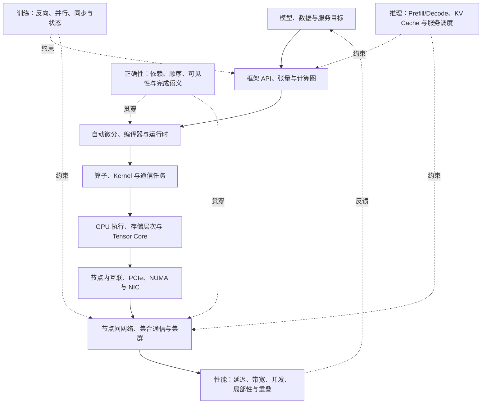
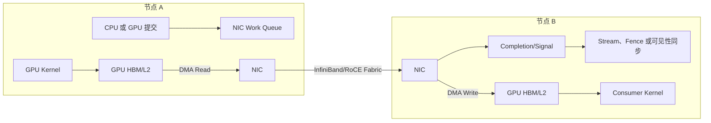
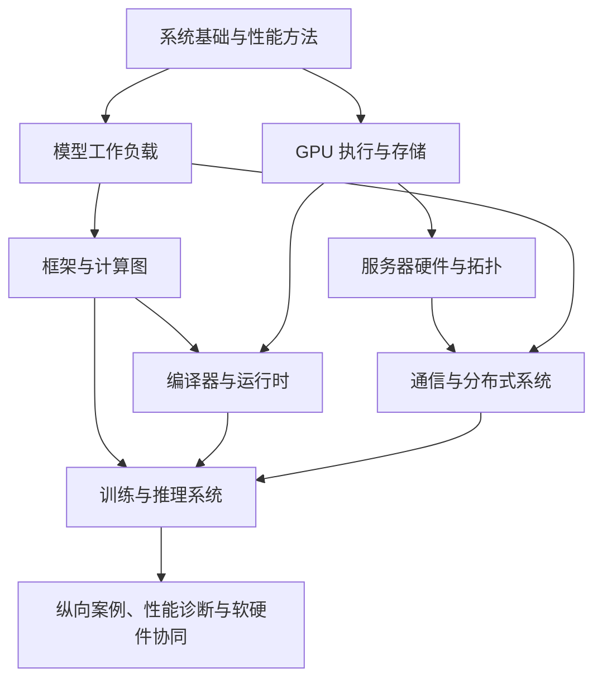

# AI System 知识体系与项目导航

> 本文是 `02-AISystem` 的顶层知识地图，用于定位概念、连接主题笔记、规划学习路径和选择项目证据。它不代替各专题的机制解释、源码分析或实验记录。

## 定位与使用方式

AI System 研究的不是孤立的模型、GPU 或通信库，而是模型工作负载如何通过框架、编译器、运行时、算子、加速器和集群转化为可执行系统，并在性能、正确性、可扩展性和可运维性之间取舍。实际学习时不必从头到尾线性阅读：先从项目问题定位所属知识域，再沿“工作负载 → 机制 → 实现 → 硬件路径 → 可观测证据”补齐直接依赖。

| 内容角色 | 路径 | 用法 |
| --- | --- | --- |
| 顶层导航 | 本文、[[02-AISystem]] | 定位知识域、跨层关系和学习顺序 |
| 主干知识笔记 | `algorithm-and-model/`、`Framework/`、`GPU/`、`Distributed/`、`Inference/` 等 | 保存机制、源码、实验与可持续更新的结论 |
| 课程与复习材料 | `Review/` | 提供另一种讲解、课程结构或资料索引；不自动视为最新实现事实 |
| 能力和面试视图 | `job-interview/` | 检查概念覆盖和表达能力，不代替实验与源码证据 |

## 一、总体系统栈

纵向系统栈回答“一个模型怎样最终在硬件和集群上执行”。训练和推理不是独立于该栈的另两层，而是使用同一系统栈、但工作负载和优化目标不同的两类场景。

学习时需另外保留四个横向维度，它们不应被错当成系统栈中的单独层级。

| 横向维度 | 核心问题 | 典型证据 |
| --- | --- | --- |
| 正确性 | 数据依赖、同步、ordering、visibility、completion 和 buffer ownership 是否成立？ | 内存模型、API 语义、对照实验 |
| 性能 | 时间花在计算、访存、提交、通信、等待还是拥塞？ | timeline、hardware counter、microbenchmark |
| 可扩展性 | 更多 GPU/节点带来了多少有效吞吐，成本如何增长？ | strong/weak scaling、通信量、效率曲线 |
| 可运维性 | 如何发现慢节点、路由问题、资源泄漏和故障？ | 日志、拓扑、健康检查、超时与恢复测试 |

## 二、知识域地图

### A. 系统基础与性能方法

这一域提供后续各层共用的语言：并发、存储、I/O、通信与性能建模。目标不是背诵名词，而是能把一个性能现象分解成可测量的假设。

| 子域 | 核心问题 | 主干笔记 | 掌握证据 |
| --- | --- | --- | --- |
| 执行与并发 | 任务如何分解、调度、同步和并行？ | [[hpc-basics/并行计算基础理论]]、[[GPU/CPU和GPU的并行与并发]] | 能解释同步开销并运行小型并行程序 |
| 存储与 I/O | Cache、局部性、带宽、向量化和 I/O 如何限制执行？ | [[hpc-basics/向量化]]、[[hpc-basics/IO]]、[[GPU/CUDA-Programming-Guide/2-2存储模型]] | 区分 compute-bound、memory-bound 和 I/O-bound |
| 通信性能 | latency、bandwidth、message rate 和扩展效率如何联系？ | [[hpc-basics/通信]]、[[Distributed/distributed-basics/通信开销计算]] | 记录消息尺寸、并发度与结果 |
| 性能分析 | 如何建立 baseline、定位瓶颈并证伪优化假设？ | [[GPU/Operator/性能分析]]、[[Review/AI-infra]] | 给出 profiler 或 counter 证据，而非只报加速比 |

### B. 模型、数据与工作负载

模型结构决定算子图、中间张量、状态量和通信需求。AI System 需要理解这些结构对计算、存储、带宽和调度的影响，但不把模型精度比较作为本地图的主线。

| 子域 | 系统关注点 | 主干笔记 | Review 入口 |
| --- | --- | --- | --- |
| Transformer | Tensor shape、Embedding、Attention、FFN 和数据流 | [[algorithm-and-model/Model/transformer]]、[[algorithm-and-model/LLM/LLM架构概述]] | [[Review/ZOMI-infra/6-algorithm-data/1-basic/Transformer]] |
| Attention 与长序列 | MHA/MQA/GQA/MLA、KV 复用、显存与带宽 | [[algorithm-and-model/LLM/modern-llm/注意力]]、[[Acceleration/Attention]]、[[Acceleration/kv-cache]] | [[Review/ZOMI-infra/6-algorithm-data/1-basic/4-attention]] |
| MoE 与路由 | expert、router、负载均衡、dispatch/combine 与 EP | [[algorithm-and-model/MoE/MoE]]、[[algorithm-and-model/MoE/EP]]、[[algorithm-and-model/MoE/DeepSeek-MoE]] | [[Review/ZOMI-infra/6-algorithm-data/2-MoE/Overview]]、[[Review/a-visual-guide/MOE]] |
| 数据与规模 | Tokenizer、参数量、Scaling Law、训练数据 | [[algorithm-and-model/LLM/modern-llm/分词]]、[[algorithm-and-model/LLM/内存消耗]] | [[Review/ZOMI-infra/6-algorithm-data/1-basic/7-parameter]]、[[Review/ZOMI-infra/0-summary/1-scaling-law/pretraining-scaling]] |

### C. 框架、编程接口与计算图

框架层把用户表达的模型转化为张量操作、依赖关系和设备任务。这里需区分 API 语义、图表示、算子分发、设备后端和运行时调度，不把它们都简化为“PyTorch 内部”。

| 子域 | 核心问题 | 主干笔记 | 掌握证据 |
| --- | --- | --- | --- |
| 张量与算子 | dtype、shape、layout、operator 和 dispatcher 如何组成编程接口？ | [[Framework/Pytorch/张量抽象]]、[[Framework/Pytorch/Pytorch]] | 从 Python/C++ API 追踪到设备算子 |
| 自动微分与计算图 | 前向、反向和控制流如何表示依赖？ | [[Review/openMLsys]] | 绘制小模型的前向/反向图 |
| 设备后端 | CPU/CUDA 算子、线性代数库和设备分发如何衔接？ | [[Framework/Pytorch/Pytorch-Lib/device-backend/Overview]]、[[Framework/Pytorch/Pytorch-Lib/device-backend/CUDA-backend]] | 固定版本记录后端调用路径 |
| 框架运行时 | allocator、stream、event、异步执行和同步如何工作？ | [[Framework/Pytorch/Pytorch-Lib/device-backend/device-backend]] | 用 timeline 或源码解释任务调度 |

### D. AI 编译器与运行时优化

编译器层处理“算法表达怎样逐步变成特定硬件上的可执行计划”。前端、IR、Lowering、Codegen、内存规划、autotuning 和运行时是相互衔接的对象，不是同一类优化的多个名称。

| 子域 | 核心问题 | 笔记入口 | 掌握证据 |
| --- | --- | --- | --- |
| 前端与 IR | 类型、shape、图和自动微分如何进入编译流程？ | [[AI-compiler/AI-compiler]]、[[AI-compiler/TVM]]、[[Review/openMLsys]] | 画出一段模型到 IR 的转换 |
| Lowering 与 Codegen | 高层算子如何转为 kernel、library call 或指令？ | [[AI-compiler/ai编译器]]、[[AI-compiler/LLVM]] | 记录一条从图到代码的 lowering 链 |
| 内存与调度 | buffer planning、fusion、layout 和 execution schedule 如何协同？ | [[Review/AI-infra]]、[[Acceleration/fused-operators/算子融合]] | 比较优化前后图、kernel 和内存峰值 |
| 自动优化 | specialization、autotuning 和 cost model 如何选择实现？ | [[GPU/Operator/性能分析]]、[[Review/Sys4AI]] | 记录搜索空间、约束、结果和适用边界 |

### E. 算子、GPU 执行与存储层次

GPU 不只是“更快的计算设备”。算子性能由线程映射、指令和管线、存储层次、数据布局、同步以及专用计算单元共同决定。

| 子域 | 核心概念 | 主干笔记 | 掌握证据 |
| --- | --- | --- | --- |
| CUDA 执行模型 | grid、block、warp、SM、kernel、stream/event | [[GPU/CUDA-Programming-Guide/2-1执行模型]]、[[GPU/PMPP/1-Fundamental-Concepts/4-compute-architecture-and-scheduling]] | 解释向量加法或归约的线程映射 |
| 存储和局部性 | register、shared memory、L1/L2、HBM、coalescing、bank conflict | [[GPU/CUDA-Programming-Guide/2-2存储模型]]、[[GPU/PMPP/1-Fundamental-Concepts/5-memory-architecture-and-data-locality]] | 用 profiler 对比两种访存方案 |
| Tensor Core 与矩阵 | MMA、WMMA、GEMM、CuTe、layout | [[GPU/tensor-core/tensor-core]]、[[GPU/tensor-core/MMA]]、[[GPU/tensor-core/CuTe/cutlass与GEMM]] | 构建 GEMM baseline 并说明优化来源 |
| 算子优化 | tiling、fusion、pipeline、量化、稀疏 | [[GPU/Operator/典型算法分析]]、[[Acceleration/fused-operators/算子融合]]、[[Acceleration/Quantization/00-低精度量化知识地图]] | 同时说明数学等价性、局部性和硬件映射 |
| PTX 与底层原语 | data movement、conversion、synchronization、special register | [[GPU/ISA/PTX]]、[[GPU/CUDA-Programming-Guide/3-2指令集]] | 只在需要时从高层 kernel 下钻至 PTX |

### F. 服务器硬件、内存和拓扑

这一域回答“软件看到的设备和内存对象如何对应真实硬件路径”。它从 CPU socket、NUMA、PCIe 根复合体、BAR/MMIO、DMA/IOMMU 和驱动对象，逐步连到 GPU、NIC、NVLink/NVSwitch 与集群 fabric。

| 子域 | 主干笔记 | 需要回答的问题 |
| --- | --- | --- |
| 服务器与 NUMA | [[cluster-and-hardware/00-Overview-GPU服务器：从物理硬件到Linux设备系统]]、[[cluster-and-hardware/01-物理服务器、NUMA与PCIe根层次]] | GPU、NIC 和 CPU 属于哪个 socket/NUMA node？ |
| PCIe 与设备资源 | [[cluster-and-hardware/02-PCIe拓扑与BDF：从设备地址追踪上游]]、[[cluster-and-hardware/04-配置空间、BAR与MMIO：从设备身份到地址资源]] | 设备如何被枚举、映射并与上游 switch/root 关联？ |
| DMA、IOMMU 与通知 | [[cluster-and-hardware/05-DMA与IOMMU：设备如何访问内存]]、[[cluster-and-hardware/06-MSI与MSI-X：从数据完成到中断通知]] | 设备为何能访问某段内存，完成怎样被发现？ |
| 驱动与设备可见性 | [[cluster-and-hardware/08-Linux设备模型、驱动与sysfs：把BDF映射到内核对象]]、[[cluster-and-hardware/09-KMD、用户态驱动与设备可见性：从内核绑定到GPU通信]] | 物理设备怎样成为用户空间可用的对象？ |
| GPU 互联与排障 | [[cluster-and-hardware/10-NVLink与NVSwitch、RDMA、NUMA和NCCL：从拓扑到通信路径]]、[[cluster-and-hardware/11-GPU服务器综合排障：从现象到证据链与最小验证]] | 通信经过哪些链路，如何证明路径和瓶颈？ |

### G. 通信、分布式训练与集群

这一域要严格区分通信语义、集合算法、通信库、transport、设备接口和物理互联。例如 AllReduce 是通信语义，Ring 是算法，NCCL 是通信库，RDMA verbs 是低层设备接口，InfiniBand/RoCE 是网络承载，它们不是并列的互斥选项。

| 子域 | 核心问题 | 主干笔记 | Review 入口 |
| --- | --- | --- | --- |
| 分布式基础 | rank、process group、P2P、collective 和通信成本如何建模？ | [[Distributed/distributed-basics/分布式基础]]、[[Distributed/distributed-basics/集合通信]]、[[hpc-basics/MPI]] | [[Review/ZOMI-infra/2-store-communication/1-collective-communication/Overview]] |
| 通信库 | MPI、NCCL、NVSHMEM 和专用库分别提供什么抽象？ | [[Distributed/NCCL/NCCL]]、[[Distributed/NVSHMEM/NVSHMEM]]、[[Distributed/DeepEP/DeepEP]] | [[Review/ZOMI-infra/2-store-communication/2-comm-lib/Overview]] |
| RDMA 与 GPU-aware 网络 | MR/QP/CQ、DMA、GDR 和 IBGDA 如何组成路径？ | [[Distributed/RDMA/RDMA]]、[[Distributed/NVSHMEM/00-learning-path]]、[[Distributed/NVSHMEM/c01-host-rdma-to-gpudirect-and-ibgda]] | [[Review/ZOMI-infra/2-store-communication/RDMA-intro]] |
| 并行策略 | DP/TP/PP/EP/SP/CP 分别切分什么，产生哪些通信？ | [[Distributed/Parallelism/LLM并行策略]]、[[Distributed/Parallelism/LLM并行划分基础]] | [[Review/llm-distributed-training/4-并行策略]] |
| 训练运行时 | 参数/梯度/优化器状态、ZeRO、overlap、checkpoint 如何管理？ | [[Distributed/distributed-training/distributed-training]]、[[Distributed/distributed-training/分布式overlap]]、[[Distributed/distributed-training/DeepSpeed]] | [[Review/llm-distributed-training/6-运行时]]、[[Review/ZOMI-infra/4-train/4-train]] |
| 集群与扩展 | scale-up/scale-out、网络拓扑、rail、拥塞与故障域如何影响效率？ | [[Distributed/distributed-basics/scale规模扩展]]、[[cluster-and-hardware/集群架构]] | [[Review/ZOMI-infra/2-store-communication/scaleup-and-out]] |

### H. 推理系统与服务

推理系统的主要矛盾由训练时的“大吞吐和反向状态”转向“请求动态性、首 token 延迟、每 token 延迟、KV Cache 容量与服务调度”。底层仍使用相同的算子、GPU、通信和集群机制，但消息尺寸、批处理和延迟目标不同。

| 子域 | 核心问题 | 主干笔记 | 掌握证据 |
| --- | --- | --- | --- |
| 推理流程 | Prefill、Decode、Sampling 和 batch 怎样构成请求生命周期？ | [[Acceleration/Acceleration]]、[[Acceleration/解码]] | 按 batch、输入/输出长度测量 latency/throughput |
| KV Cache | 状态怎样组织、分页、复用、传输和淘汰？ | [[Acceleration/kv-cache]]、[[Framework/vLLM/框架分析]] | 解释序列长度、batch 与显存峰值的关系 |
| 低精度与算子 | 量化、稀疏、fusion、Flash/Paged Attention 如何改变路径？ | [[Acceleration/Quantization/00-低精度量化知识地图]]、[[Acceleration/fused-operators/融合算子]] | 比较质量、存储、带宽和速度代价 |
| 服务运行时 | continuous batching、调度、资源隔离和 PD 分离如何工作？ | [[Framework/vLLM/vLLM]]、[[Acceleration/推理加速方法论]] | 进行端到端服务基准，而非只测单 kernel |
| 分布式推理 | TP/PP/EP、KV transfer、prefill/decode 分离如何映射至网络？ | [[Distributed/Parallelism/LLM推理并行优化的必备知识]] | 说明通信对象、频率、尺寸和尾延迟需求 |

### I. 纵向案例与工程证据

纵向案例用来检验能否把多个知识域连成因果链。它们不应只记录架构图或营销性能数字，而应固定版本、工作负载、硬件环境和证据边界。

| 案例 | 连接的知识域 | 主干笔记 | 建议产出 |
| --- | --- | --- | --- |
| DeepEP | MoE 路由、All-to-All、NVLink/RDMA、GPU-driven communication | [[Distributed/DeepEP/DeepEP]]、[[Distributed/DeepEP/DeepEP-Lib/Overview]] | dispatch/combine 的调用链、数据路径和基准 |
| NCCL | collective、algorithm/protocol/transport、topology | [[Distributed/NCCL/NCCL]]、[[Distributed/NCCL/NCCL-lib/Overview]] | 从 API 追踪到 channel、transport 和拓扑选择 |
| NVSHMEM/IBGDA | PGAS、one-sided、ordering、GPU-initiated networking | [[Distributed/NVSHMEM/00-learning-path]]、[[Distributed/NVSHMEM/d00-ibgda-implementation-overview]] | 生产者—传输—消费者正确性证明与实验 |
| Megatron/MoE | TP/PP/EP、模型层与通信调度 | [[Framework/Megatron/Megatron]]、[[Framework/Megatron/Megatron-Lib/MoE/MoE]] | 固定 commit 的并行组、调用链与通信量 |
| vLLM | KV Cache、paged attention、batching、服务调度 | [[Framework/vLLM/框架分析]]、[[Framework/vLLM/nanovllm]] | 请求 timeline、显存模型和端到端延迟 |
| GPU 服务器 | PCIe/NUMA、GPU/NIC affinity、NVLink、RDMA、NCCL | [[cluster-and-hardware/10-NVLink与NVSwitch、RDMA、NUMA和NCCL：从拓扑到通信路径]] | 拓扑图、候选数据路径和最小验证链 |

## 三、关键跨层连接

### 工作负载到通信模式

上层并行方式决定交换什么张量、参与者是谁以及何时交换；通信 primitive 再映射到通信库、transport 和硬件拓扑。下表是常见映射，不表示所有框架都采用同一实现。

| 并行或服务方式 | 主要数据对象 | 常见通信 | 主要系统矛盾 |
| --- | --- | --- | --- |
| Data Parallel | gradient、parameter shard | AllReduce，或 ReduceScatter + AllGather | 大消息带宽、分桶与反向重叠 |
| Tensor Parallel | activation、partial result | AllReduce、AllGather、ReduceScatter | 高频通信、拓扑局部性与同步暴露 |
| Pipeline Parallel | stage activation/gradient | P2P Send/Recv | pipeline bubble 与 micro-batch 调度 |
| Expert Parallel | token、expert output | All-to-All、dispatch/combine | 不规则流量、负载均衡与跨节点 token 数 |
| Sequence/Context Parallel | sequence shard、attention 中间量 | AllGather、ReduceScatter、Ring/P2P | 长序列显存与通信计算重叠 |
| Prefill/Decode 分离 | KV cache、请求状态 | P2P 或专用 KV transfer | TTFT、KV 体量、网络尾延迟与调度 |

### 通信概念的分类边界

| 维度 | 回答的问题 | 代表概念 |
| --- | --- | --- |
| 通信语义 | 应用想表达什么参与关系？ | collective、P2P、one-sided、PGAS |
| 通信算法 | 参与者和数据块如何组织？ | ring、tree、recursive doubling、pairwise、hierarchical |
| 协议与运行策略 | 数据怎样分块、流水和同步？ | LL/LL128/Simple、channel、chunk、pipeline |
| 通信库 | 谁把上层语义实现为执行计划？ | MPI、NCCL、NVSHMEM、DeepEP、UCX/UCC |
| Transport/设备接口 | 进程、CPU 或 GPU 用什么机制提交传输？ | P2P、SHM、NET、RDMA verbs、IBGDA |
| 物理互联 | 字节最终通过什么硬件？ | NVLink、NVSwitch、PCIe、NIC、InfiniBand、Ethernet |

| 软件或机制 | 对象类型 | 核心职责 | 不应误认为 |
| --- | --- | --- | --- |
| CUDA | GPU 编程平台与运行时体系 | kernel、stream/event、内存和设备管理 | 通用网络通信库 |
| NCCL | GPU 通信库 | 多 GPU collective 和 P2P | 网络协议或固定算法 |
| NVSHMEM | GPU PGAS/通信库 | device-side one-sided、atomic、signal、collective | GPUDirect RDMA 的同义词 |
| DeepEP | MoE 专用通信库 | token dispatch/combine | 通用 collective 标准 |
| RDMA verbs | 低层设备接口/API | 创建 QP/CQ/MR，提交并获取完成 | 具体物理网络 |
| GPUDirect RDMA | NIC–GPU memory 访问机制 | 让 NIC 直接 DMA GPU memory | GPU 必然直接提交网络操作 |
| IBGDA | GPU-driven 网络机制 | 让 GPU 更直接地驱动 NIC 工作队列 | 所有 GDR 部署的默认控制路径 |

### GPU 跨节点通信的三条路径

分析一次 GPU-to-GPU 通信时，必须分开数据路径、控制路径和同步路径。“数据不经 CPU memory”不等于“CPU 不参与提交和进度管理”。

对这条路径至少要回答：源数据何时就绪；GPU memory 是否正确注册与映射；由 CPU 还是 GPU 提交工作；是否退化为 host staging；数据是否跨 PCIe switch 或 CPU socket；local completion、remote completion 和 buffer 可复用是否同时；消费者需要什么 fence、signal 或 scope；瓶颈位于提交、DMA、链路、拥塞、同步还是 overlap。

### 内存正确性与通信完成

| 概念 | 回答的问题 | 常见误区 |
| --- | --- | --- |
| Atomicity | 单次操作是否不可分割？ | 原子操作不自动建立所有访问的全局顺序 |
| Ordering | 多个操作以什么顺序被观察？ | 程序书写顺序不必然等于系统可见顺序 |
| Visibility | 写入何时能被另一执行者观察？ | DMA completion 不必然等于目标 kernel 已可安全读取 |
| Completion | 操作在本地或远端完成到什么程度？ | local、remote、stream completion 不是同一语义 |
| Scope | 保证覆盖哪些参与者？ | block、device、system scope 不能互换 |
| Coherence | 多份缓存副本如何保持一致？ | coherence 不等于完整的 consistency model |

对应主干笔记：[[Distributed/NVSHMEM/b02-completeness-ordering-and-visibility]]、[[Distributed/NVSHMEM/b04-data-publishing-and-buffer-ownership]]、[[Distributed/NVSHMEM/d04-ibgda-atomics-signals-and-ordering]]。

### 从指标到性能因果

单次传输可先用 `T ≈ α + n/β` 建立直觉，其中 `α` 是固定启动成本，`β` 是有效带宽，`n` 是消息字节数。集合通信还需加入算法轮次、链路字节量、拓扑竞争和同步等待；MoE 还可能首先受 token 分布与 expert load imbalance 限制。

| 分析层次 | 关键指标 | 主要决定因素 |
| --- | --- | --- |
| 单次传输 | latency、bandwidth、message rate | 消息大小、提交路径、DMA、协议开销 |
| Collective | algorithm/bus bandwidth、算法步数 | rank 数、算法、chunk/channel、拓扑 |
| 节点拓扑 | hop、oversubscription、P2P 能力 | NVLink/PCIe、NUMA、NIC affinity |
| 集群网络 | bisection bandwidth、拥塞、rail 利用 | 网络拓扑、路由、并发流量 |
| 应用端到端 | exposed communication、overlap、step time | 计算图依赖、分桶、调度、负载均衡 |

分析顺序应是“工作负载 → timeline → topology → counters/logs → 假设 → 对照实验”。先确认通信是否暴露在关键路径，再判断瓶颈位于软件提交、设备、链路、路由、同步还是负载不均。

## 四、学习依赖与阶段产出

下面的顺序表示概念依赖，不要求将前一阶段全部学完才能进入后一阶段。框架—编译器分支与硬件—通信分支可在共同基础之后并行，最终在训练、推理和纵向案例中汇合。

| 阶段 | 学习范围 | 最小产出/停止条件 |
| --- | --- | --- |
| 1. 系统与性能基础 | 并发、内存层次、I/O、latency/bandwidth、baseline | 能对一个小程序分解时间并提出可验证瓶颈假设 |
| 2. GPU 执行与算子 | CUDA execution/memory model、profiling、GEMM/Attention | 完成 baseline—优化版—profiler—机制解释闭环 |
| 3. 框架与编译 | tensor/operator、autograd、graph、backend、IR/lowering | 从模型 API 追踪至一个设备 kernel 或 library call |
| 4. 硬件拓扑与正确性 | NUMA/PCIe/GPU/NIC、DMA/IOMMU、ordering/visibility/completion | 绘制真实节点拓扑和生产—传输—消费同步关系 |
| 5. 通信与分布式训练 | collective、NCCL/NVSHMEM、RDMA、DP/TP/PP/EP、overlap | 计算通信量，解释算法—transport—拓扑映射并完成扩展基准 |
| 6. 推理系统 | Prefill/Decode、KV Cache、quantization、batching、PD 分离 | 记录 TTFT/TPOT/throughput/显存并解释其负载条件 |
| 7. 纵向案例 | DeepEP、NCCL、NVSHMEM、Megatron、vLLM 或 GPU 服务器 | 固定版本和环境，交付调用链、数据路径、性能证据与未验证边界 |

## 五、项目驱动的取用规则

| 项目问题 | 首先定位 | 再补关联域 | 最小证据 |
| --- | --- | --- | --- |
| 单算子慢或 GPU 利用率低 | E 算子/GPU | A 性能方法、C 框架、D 编译器 | baseline、优化版、profiler、因果解释 |
| 多卡训练扩展差 | G 通信/训练 | F 拓扑、B 工作负载、A 性能方法 | step 分解、通信量、拓扑、集合通信基准、策略对比 |
| 推理延迟或显存不足 | H 推理 | B 模型、C 运行时、E 算子 | 负载定义、KV Cache/调度解释、端到端基准 |
| 框架调用路径不清楚 | C 框架 | D 编译、E 设备后端 | 固定 commit 的符号链、数据/控制流与架构图 |
| GPU 通信不稳定或低于预期 | F 硬件拓扑、G 通信 | A 性能方法、E GPU 内存 | `nvidia-smi topo`、PCIe/NUMA/NIC 路径、通信库日志、microbenchmark |
| 新论文或新系统难以判断 | I 纵向案例 | A–H 中的直接依赖 | 一手来源、适用条件、代价、边界和待验证问题 |

## 六、参考资料池

资料池用于发现和回查，不代表必须顺序读完。对 API、硬件能力、默认算法和性能结论，应绑定具体版本、型号和工作负载。

### 课程、教材与系统综述

| 用途 | 资料 |
| --- | --- |
| 机器学习系统教材 | [openMLsys](https://openmlsys.github.io/)、[MLSys Book](https://www.mlsysbook.ai/) |
| AI System 课程 | [UC Berkeley AI Systems](https://ucbrise.github.io/cs294-ai-sys-sp22/)、[CSE 599W](http://dlsys.cs.washington.edu/)、[Deep Learning Systems](https://dlsyscourse.org/)、[ML Compilation](https://mlc.ai/) |
| 系统实现 | [AISystem](https://github.com/chenzomi12/AISystem)、[Microsoft AI-System](https://github.com/microsoft/AI-System)、[Stanford MLSys Seminar](https://www.youtube.com/playlist?list=PLSrTvUm384I9PV10koj_cqit9OfbJXEkq) |
| 编译器 | [Dive into Deep Learning Compiler](https://tvm.d2l.ai/)、[MLC course](https://mlc.ai/)、[中科院智能计算系统课程](https://novel.ict.ac.cn/aics/) |

### 模型、LLM 与推理

| 用途 | 资料 |
| --- | --- |
| LLM 基础与实践 | [CS336](https://cs336.stanford.edu/)、[Happy-LLM](https://github.com/datawhalechina/happy-llm)、[LLM Architecture Comparison](https://magazine.sebastianraschka.com/p/the-big-llm-architecture-comparison) |
| 模型结构与部署 | [Llama2 流程](https://zhuanlan.zhihu.com/p/651248009)、[大模型部署工程](https://zhuanlan.zhihu.com/c_1905912040196931924)、[byhand.ai](https://www.byhand.ai/)、[Scientific Spaces](https://spaces.ac.cn/) |
| 推理与服务 | [SGLang PD Disaggregation](https://docs.sglang.io/advanced_features/pd_disaggregation.html)、[SGLang Multi-Modal Encoder DP](https://docs.sglang.io/advanced_features/dp_for_multi_modal_encoder.html)、[从零实现 vLLM](https://zhuanlan.zhihu.com/c_1930254288103403625) |

### CUDA、GPU 与硬件

| 用途 | 资料 |
| --- | --- |
| CUDA 编程模型 | [CUDA Documentation](https://docs.nvidia.com/cuda/index.html)、[CUDA Programming Guide](https://docs.nvidia.com/cuda/cuda-programming-guide/index.html) |
| 性能分析 | [GPU Performance Background](https://docs.nvidia.com/deeplearning/performance/dl-performance-gpu-background/index.html#gpu-perf)、[Nsight Compute Profiling Guide](https://docs.nvidia.com/nsight-compute/ProfilingGuide/index.html) |
| PTX 与底层编程 | [PTX ISA](https://docs.nvidia.com/cuda/parallel-thread-execution/index.html)、[Inline PTX Assembly](https://docs.nvidia.com/cuda/inline-ptx-assembly/index.html) |
| GPU 架构与拓扑 | [NVIDIA GPU 架构专栏](https://www.zhihu.com/column/c_1717573833584947201)、[GPU Topology 与互联](https://zhuanlan.zhihu.com/p/692947173)、[arXiv:1903.04611](https://arxiv.org/pdf/1903.04611) |
| NUMA 与紧耦合 CPU–GPU | [浅解 NUMA](https://zhuanlan.zhihu.com/p/67558970)、[每个程序员都应该知道的 NUMA](https://zhuanlan.zhihu.com/p/336365600)、[Grace Hopper Architecture](https://developer.nvidia.com/blog/nvidia-grace-hopper-superchip-architecture-in-depth/)、[Grace Hopper 产品页](https://www.nvidia.com/en-us/data-center/grace-hopper-superchip/)、[GH200 资料](https://dam-cdn.nvd.orangelogic.com/AssetLink/h125m07nuew832vthbov0q6b2rs8ta0q.pdf) |
| AI 硬件课程 | [Eyeriss Tutorial](https://eyeriss.mit.edu/tutorial-previous.html)、[Hardware Architecture for Deep Learning](https://csg.csail.mit.edu/6.5930/index.html)、[TinyML and Efficient Deep Learning Computing](https://hanlab.mit.edu/courses/2024-fall-65940) |

面向H100 的CUDA教程，介绍了很多重要特性： https://cudacourseh100.github.io/index.html#top

### 内存模型、RDMA 与 GPU 通信

| 用途                          | 资料                                                                                                                                                                                                                                                                                                                                                                                                                                                                                                                                                                                                                                |
| --------------------------- | --------------------------------------------------------------------------------------------------------------------------------------------------------------------------------------------------------------------------------------------------------------------------------------------------------------------------------------------------------------------------------------------------------------------------------------------------------------------------------------------------------------------------------------------------------------------------------------------------------------------------------- |
| C++ 并发与内存模型                 | [C++11 内存模型](https://zhuanlan.zhihu.com/p/18297976883)、[现代 C++ 内存模型](https://zhuanlan.zhihu.com/p/382372072)、[C++ 并发编程 PDF](https://www.tsingfun.com/statics/pdf.js/web/viewer.html?file=https://www.tsingfun.com/uploadfile/2020/0821/C++%E5%B9%B6%E5%8F%91%E7%BC%96%E7%A8%8B%EF%BC%88%E4%B8%AD%E6%96%87%E7%89%88%EF%BC%89.pdf)、[Modern C++ Concurrent Programming Tutorial](https://mq-b.github.io/ModernCpp-ConcurrentProgramming-Tutorial/)、[paul.pub C++ 并发](https://paul.pub/cpp-concurrency/)                                                                                                                              |
| GPU memory consistency      | [GPU 内存一致性辅助解读 1](https://zhuanlan.zhihu.com/p/6842963374)、[辅助解读 2](https://zhuanlan.zhihu.com/p/1953830251802103855)、[Go 内存一致模型](https://golang.design/under-the-hood/zh-cn/part3concurrency/ch11sync/mem/)                                                                                                                                                                                                                                                                                                                                                                                                                      |
| RDMA 与 GPU-aware networking | [RDMA 专栏](https://www.zhihu.com/column/c_1710765963216084992) [(99+ 封私信 / 81 条消息) RDMA杂谈 - 知乎](https://www.zhihu.com/column/c_1231181516811390976) 、[GPU 通信技术综述](https://zhuanlan.zhihu.com/p/684116871)、[GPU 通信架构](https://zhuanlan.zhihu.com/p/680262016)、[GPUDirect RDMA](https://docs.nvidia.com/cuda/gpudirect-rdma/)                                                                                                                                                                                                                                                                                                        |
| GPU-driven networking       | [NVSHMEM and GPUDirect Async](https://developer.nvidia.com/blog/improving-network-performance-of-hpc-systems-using-nvidia-magnum-io-nvshmem-and-gpudirect-async/)、[IBGDA 辅助解读 1](https://zhuanlan.zhihu.com/p/26082845081)、[辅助解读 2](https://zhuanlan.zhihu.com/p/1947601727634273716)                                                                                                                                                                                                                                                                                                                                             |
| NCCL                        | [NCCL GitHub](https://github.com/NVIDIA/nccl)、[NCCL User Guide](https://docs.nvidia.com/deeplearning/nccl/user-guide/docs/index.html)、[NCCL 源码解读](https://zhuanlan.zhihu.com/p/1967342182349399705)、[Demystifying NCCL](https://arxiv.org/html/2507.04786v1)、[NCCL EP](https://arxiv.org/abs/2603.13606)、[Chapel NCCL Integration](https://chapel-lang.org/chapelcon/2025/chapelcon2025_sosuke_hosokawa.pdf)、[NCCL Tuning](https://ieeexplore.ieee.org/document/11105972)、[NCCL/NVSHMEM 讲义](https://juser.fz-juelich.de/record/1019178/files/02-NCCL_NVSHMEM.pdf)                                                                 |
| NVSHMEM 与 DeepEP            | [NVSHMEM API Documentation](https://docs.nvidia.com/nvshmem/api/index.html)、[NVSHMEM 源码辅助解读 1](https://zhuanlan.zhihu.com/p/1952325639211315297)、[辅助解读 2](https://zhuanlan.zhihu.com/p/1940533543823480659)、[DeepEP GitHub](https://github.com/deepseek-ai/DeepEP)、[TensorRT-LLM Expert Parallelism](https://github.com/NVIDIA/TensorRT-LLM/blob/main/docs/source/blogs/tech_blog/blog04_Scaling_Expert_Parallelism_in_TensorRT-LLM.md)、[One-Sided AlltoAll over NVLink](https://github.com/NVIDIA/TensorRT-LLM/blob/main/docs/source/blogs/tech_blog/blog18_Optimizing_MoE_Communication_with_One_Sided_AlltoAll_Over_NVLink.md) |
| 软硬件协同案例                     | [Insights into DeepSeek-V3](https://arxiv.org/html/2505.09343v1#S3)                                                                                                                                                                                                                                                                                                                                                                                                                                                                                                                                                               |

### 补充索引与待核查材料

| 用途 | 资料 |
| --- | --- |
| 并行与互联综合 | [并行计算课程与资料](https://goodcucumber.github.io/x40paraguide/x40.html) |
| CUDA 实践 | [CUDA 博客合集](https://github.com/caiwanxianhust/CUDA-BLOG)、[CUDA 视频课程](https://www.youtube.com/watch?v=Sdjn9FOkhnA&list=PL5B692fm6--vWLhYPqLcEu6RF3hXjEyJr&index=1) |
| AI 加速器实验 | [AAML2024](https://nycu-caslab.github.io/AAML2024/index.html)、[Computer Organization](https://nycu-caslab.github.io/CO2024/index.html)、[CFU Playground](https://cfu-playground.readthedocs.io/en/latest/index.html) |
| 推理与分布式社区 | [vLLM/PD 资料](https://www.zhihu.com/people/52-34-86-1/posts)、[LLM 推理框架](https://zhuanlan.zhihu.com/c_1916901019268391457)、[分布式训练专题](https://www.cnblogs.com/sunstrikes/collections/17032)、[AI 纵贯线](https://www.zhihu.com/column/c_1777819405453787137) |

原材料中的 oneflow NCCL 微信专辑、大模型推理互联通信直播回放与内部 ISCA 2025 笔记尚无可核查链接或文件路径，暂作为待补条目，不使用其支撑具体技术结论。

## 七、当前结构缺口与维护规则

当前仓库在 GPU、分布式通信、量化和硬件拓扑方面已有较细的主干；相比之下，框架运行时、AI 编译器端到端 lowering、分布式推理的 KV 传输与调度、以及集群可观测性/故障恢复仍是薄弱连接。这些是基于现有笔记密度得出的结构性判断，不表示相关内容完全缺失。

后续维护遵循以下边界：

1. 本文只保留稳定分层、跨层关系、关键入口和学习依赖，不继续粘贴整篇课程摘录或源码细节。
2. `Review/` 中的课程材料可作为解释和索引，当其与主干笔记重复时，主干笔记承担综合结论，Review 保留来源上下文。
3. 新增概念先判断其是语义、接口、机制、实现、组件、协议还是应用，再放入对应层级，避免把不同维度的名词当作并列分类。
4. 一个概念只在本文保留一个主位置，其他章节通过关系或链接引用，不重复铺开相同解释。
5. 阅读、摘录或运行成功都不等于掌握。主张至少需要官方文档/源码、固定版本和实验中的一种证据支持；性能结论还要说明工作负载和硬件环境。

面对一个新系统，最终应能连续回答：工作负载产生了什么计算、状态和通信依赖；框架与编译器如何表示并调度它们；关键算子和通信如何映射到 GPU、内存、互联和网络；正确性由哪些 ordering、visibility、completion 和 ownership 规则保证；瓶颈位于计算、访存、提交、链路、拥塞、同步、调度还是负载不均；最后用哪些 timeline、topology、counter、log、源码和对照实验验证这些判断。
