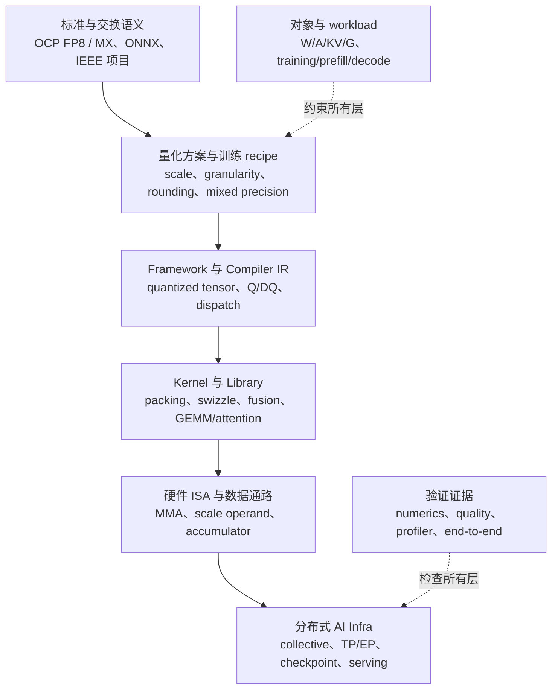

# 低精度 AI Infra 前沿与资料索引

本文是本系列第一阶段的收束，也是后续持续更新的导航页。它不再逐项教学某一种量化算法，而是回答三个系统问题：截至 2026-09，低精度 AI Infra 的技术栈已经发展到哪里；标准、硬件、框架和论文分别在解决什么问题；接下来最值得深入的研究方向是什么。

快速变化的能力均绑定到本文实际核查的版本或发布日期。表中的“支持”只说明对应来源公开了该能力，不保证所有 SKU、shape、模型、driver 和 framework 组合都能进入高性能路径；论文中的准确率或加速结果也不外推为工业系统的普遍结论。

## 一张图定位整个前沿

低精度技术正在从“为每个 Tensor 选一个 dtype”演化为跨层协同的数据合同。标准定义数值语义，recipe 决定如何生成表示，IR 与 framework 携带逻辑对象，Kernel 和 ISA 消费特定 layout，分布式 runtime 再决定表示能否跨设备传递。任何一层缺失，格式都可能只能被存储而不能高效计算。

这张图不是单向软件栈。硬件支持会反向塑造 format 和 recipe，模型中的 outlier 与训练稳定性会反向影响 block size、rounding 和高精度保留策略，通信拓扑又会决定 scale 是否能与 codes 一起传输。前沿工作的核心越来越接近 format–algorithm–kernel–system co-design。

## 先建立证据层级

低精度领域名称相似、版本变化快，最可靠的阅读方式是先判断资料属于哪一层，再决定它能证明什么。

| 证据层 | 典型材料 | 能证明什么 | 不能直接推出什么 |
| --- | --- | --- | --- |
| 正式标准／开放规范 | OCP FP8、OCP MX、ONNX operator | 编码、基本运算、graph语义或交换要求 | 某GPU一定原生执行、某模型一定无损 |
| 标准项目／草案 | IEEE P3109 Active PAR | 行业正在尝试统一的问题范围 | 已经形成可依赖的最终标准 |
| ISA／架构文档 | PTX、CDNA ISA、厂商白皮书 | operand、instruction、accumulator与代际能力 | framework必然dispatch到该指令 |
| Library／framework文档 | CUTLASS、Transformer Engine、torchao、TensorRT-LLM | 某版本公开的recipe、Kernel和API覆盖 | 所有shape都有加速、prototype已经稳定 |
| 源码与issue | implementation、test、tracker | 当前真实数据路径、限制与正在开发的能力 | 未合并路线图已经可用 |
| 论文 | GPTQ、KIVI、QuaRot、NVFP4 training | 在给定模型、数据和硬件上的方法与证据 | 标准定义、跨系统普遍收益 |
| 本地实验 | reference、benchmark、profiler | 当前环境是否数值正确且真正获益 | 其他版本、拓扑与模型的结果 |

下文使用“事实”描述来源直接支持的能力；使用“趋势判断”归纳多个来源共同指向的方向；仍缺乏统一规范或广泛验证的内容明确列为开放问题。

## 标准与 IR：从 scalar dtype 走向复合 Tensor 表示

### 已经形成的规范基线

OCP 8-bit Floating Point Specification 固定了 E4M3 与 E5M2 的开放数值基线；OCP Microscaling Formats v1.0 则把 element type、32-element scaling block 与 E8M0 shared scale组合成 MXFP8、MXFP6、MXFP4 和 MXINT8。MX v1.0 明确规定 binary interchange 与基本运算，但不规定物理 memory layout，因此相同 MX 数值 Tensor可以拥有不同 GPU prepack。

ONNX `QuantizeLinear` version 28 已能表达 per-tensor、per-axis 与 blocked quantization，并覆盖 INT、FP8、FP4、FP6 及 E8M0 scale 等类型。它把 scale shape、axis、block size 和 Q/DQ 数学带入 graph，却仍不承诺 nibble order、scale swizzle 或目标 Kernel。

MLIR Quant dialect也已经提供 sub-channel/blockwise quantized type，用 expressed type、stored type、block sizes、scale 和 zero-point描述逻辑映射，再由 lowering pass把它变成更底层表示。当前文档明确指出具体 rounding 与 lowering可由转换 pipeline决定，这正说明“IR能够描述 block scheme”与“跨backend具有完全一致 numerics”仍是两件事。

### 仍在形成的统一层

IEEE P3109 的公开状态是 Active PAR，目标是定义面向机器学习的二进制算术和数据格式，并与 IEEE 754-2019 对齐。它是值得跟踪的标准化方向，但在本文快照时不能当作已经批准的正式标准。

当前最明显的标准缺口不再只是 scalar bit encoding，而是复合 Tensor schema：scale方向、层次化 scale、rowwise/columnwise副本、rounding、overflow、metadata layout、accumulator与通信表示常分散在 framework、recipe和ISA文档中。趋势判断是，未来互操作性需要把“element dtype”升级为“data + metadata + partition + compute contract”的一等类型；现有 ONNX blocked quantization 和 MLIR sub-channel type已经向这一方向推进，但还没有覆盖所有 MX/NVFP4 运行时布局语义。

| 层次 | 当前代表 | 成熟度判断 | 阅读重点 |
| --- | --- | --- | --- |
| Scalar FP semantics | IEEE 754、OCP FP8 | 稳定／已发布 | 特殊值、bias、rounding、variant兼容性 |
| Microscaling numerics | OCP MX v1.0 | 已发布 | element、E8M0、block 32、conversion与dot product |
| Graph quantization | ONNX QuantizeLinear 28 | 已发布但backend实现各异 | scale shape、axis、block_size、Q/DQ placement |
| Compiler type | MLIR Quant sub-channel | 主线能力持续演进 | expressed/stored type、block type、lowering responsibility |
| ML arithmetic standard | IEEE P3109 | Active PAR，不是最终标准 | 是否统一更小浮点、异常与算术要求 |
| Kernel layout | PTX/CUTLASS、ROCm library合同 | 厂商／代际特定 | scale vector、tile、swizzle、alignment |

## 硬件版图：更窄 element、更细 scale、更宽 accumulator

硬件发展的共同方向可以概括为：把低位 element 与 scale metadata 一起送入矩阵 datapath，并继续使用更宽 accumulator保护长 reduction。不同平台的公开能力并不对称，因此跨厂商比较应按 element、scale、instruction、accumulator和library五个字段进行，而不是只比较“支持4-bit”。

| 平台／代际 | 本文核查到的低精度重点 | 系统含义 | 版本边界 |
| --- | --- | --- | --- |
| NVIDIA Hopper | 原生 FP8 E4M3/E5M2 Tensor Core 路径；软件管理current/delayed/block scaling | FP8训练与推理栈已形成较完整recipe、library和framework闭环 | 具体shape和recipe按CUDA、TE与GPU SKU核查 |
| NVIDIA Blackwell | MXFP8/MXFP6/MXFP4、NVFP4及block-scaled MMA；scale成为显式operand | 4/6/8-bit复合格式进入原生matrix mainloop，layout与scale swizzle更重要 | SM100/103/120支持组合并不完全相同 |
| NVIDIA Rubin preview | CUTLASS 4.8.0公开preliminary dense/block-scaled GEMM支持 | 说明下一代仍沿 mixed/block-scaled方向演进 | 这是library preview，不等于最终产品性能承诺 |
| AMD CDNA3 / MI300 | FP8、INT8等Matrix Core/MFMA路径 | FP8不再是单一厂商生态，framework需要处理variant与backend差异 | 以目标ROCm、hipBLASLt与SKU为准 |
| AMD CDNA4 / MI350 | 官方白皮书列出MXFP8、MXFP6、MXFP4硬件支持 | OCP MX获得跨厂商原生执行基础，数值标准与物理ISA仍分层 | layout、instruction和library接口不同于NVIDIA |
| Intel Gaudi 2/3 | 官方文档公开FP8训练/推理与MME路径；Gaudi 2 TE使用E4M3/E5M2策略 | 同名FP8仍可能具有不同max/NaN/Inf语义，porting需核对variant | 以Gaudi Software 1.24文档为本文快照 |
| Google Cloud TPU v6e | 官方规格列出BF16与INT8 MXU能力；Cloud TPU文档强调BF16 multiply、FP32 accumulate | 说明低精度路线并非都围绕FP8/FP4，编译器驱动的BF16/INT8仍是重要分支 | 不从该文档推断未公开的FP8/MX能力 |

这里最重要的不是代际清单，而是三条结构性变化。第一，scale 从一次性 Tensor 常量变成高频 operand；第二，format支持越来越依赖特定 tile、orientation 和 metadata layout；第三，理论 matrix throughput提高后，quantize、layout transform、HBM、SMEM、network和small-shape利用率更容易成为瓶颈。

因此“硬件支持MXFP4”至少要拆成六个问题：是否有对应 element与scale encoding，是否有native matrix instruction，accumulator是什么，哪些operand/layout合法，library是否提供目标shape Kernel，以及framework是否实际dispatch到它。[[09-GPU低精度执行机制]] 已给出这套验证方法。

## 软件栈：recipe 正在成为比 dtype 更重要的接口

现代框架不再只暴露 `float8` 或 `int4`，而是逐步把 scale timing、granularity、format、orientation 和高精度fallback组合成 recipe。相同 element dtype可以对应 tensorwise current scaling、delayed scaling、blockwise FP8、MXFP8或分层NVFP4；它们的数值和系统成本完全不同。

| 软件层 | 当前公开能力 | 在统一模型中的位置 | 使用时最需核查 |
| --- | --- | --- | --- |
| Transformer Engine 2.19 | FP8 current/delayed/block scaling、MXFP8、NVFP4；Blackwell上支持后两者 | training recipe、quantizer、fused Transformer modules | supported device、row/column副本、distributed scale、quantize overhead |
| TensorRT current docs | INT8、FP8、MXFP8、INT4、NVFP4等Q/DQ scheme | inference graph与optimized Kernel | block size、dynamic activation要求、explicit quantization与hardware |
| TensorRT-LLM 1.1.0 | 多种FP8、NVFP4/MXFP4、AWQ/GPTQ和FP8 KV cache组合，并给出硬件矩阵 | LLM build/runtime与model support | model列与hardware列都需命中，点号不是通用支持 |
| torchao 0.17 | float8与INT4等稳定/近稳定workflow；MXFP8/MXFP4/NVFP4含prototype路径 | PyTorch quantized Tensor、training/inference workflow、compile integration | 文档的stable/prototype/planned状态与依赖版本 |
| CUTLASS 4.8.0 | FP8、INT4/8、MXFP4/6/8、NVFP4和mixed block-scaled GEMM抽象 | Kernel template、layout与MMA映射 | architecture、tile、alignment、scale layout和preview状态 |
| ONNX / MLIR | blocked Q/DQ与sub-channel type | graph/IR层的逻辑scheme | backend能否无损lower到目标复合格式 |
| NCCL 2.31.2 | datatype列表含FP8 E4M3/E5M2；collective与reduction接口 | 原生低精度transport/reduction | dtype不携带per-block scale；reduction accumulator和版本 |
| DeepEP current main | MoE dispatch/combine，支持FP8 data与scale tuple | Expert Parallel自定义通信路径 | dispatch/combine精度不必相同，需固定commit、拓扑和shape |

两个状态标签尤其不能忽略。其一，framework中的 dtype/API存在不等于高性能 Kernel覆盖；其二，prototype表示接口、checkpoint兼容性和performance contract仍可能改变。torchao 0.17 的workflow页面明确把部分MX/NVFP4路径标为prototype，而Transformer Engine也把特定fine-grained attention配置标为experimental。这些标签本身就是工程事实，不应在知识笔记中被删掉。

Transformer Engine 的性能页面还区分 autocast与pre-quantized benchmark：前者包含每步quantization与scale生成，后者只测已量化operand的GEMM。这个区分应成为所有低精度benchmark的默认报告方式，否则raw Kernel峰值很容易被误写成训练step或serving吞吐。

## 当前最重要的七条技术方向

### 1. FP8 从“新格式”进入系统化 mixed-precision recipe

FP8的前沿已不再是证明8-bit浮点可用，而是选择current/delayed/block scaling，处理transpose副本、distributed amax和不同operation的精度边界。训练系统通常只让Linear/GEMM进入FP8，softmax、normalization、部分attention reduction和master state继续使用BF16/FP32。也就是说，成熟方向是operation-aware mixed precision，而不是全图统一FP8。

这一分支仍有工程空间：减少amax reduction和cast pass，把quantize与layout transform融合，令FSDP/TP/EP通信直接携带合适的低精度表示，并在恢复精度与通信量之间选择不同forward/backward合同。

### 2. FP4训练从可行性证明走向长周期稳定性

4-bit训练比4-bit weight-only inference困难得多，因为activation与gradient动态变化，误差会跨step累积。2025年的《FP4 All the Way》研究predominantly FP4 weights、activations和gradients；《Pretraining Large Language Models with NVFP4》进一步公开了12B模型、10T token训练，并组合Random Hadamard Transform、2D quantization、stochastic rounding与selective high-precision layers。

这些结果证明“FP4可参与训练”已获得更强实验支持，但不能简化成“裸E2M1足以替代BF16”。真正的recipe包含层次化scale、outlier变换、随机舍入、敏感层保留以及可能的末期高精度阶段。前沿问题正从format位宽转向训练噪声、学习率衰减阶段、optimizer state、长token horizon和故障恢复。

### 3. 格式专用算法正在替代通用量化直觉

传统GPTQ、AWQ、SmoothQuant等方法最初并非围绕MXFP4/NVFP4的scale语义设计。OCP MX的power-of-two E8M0 scale、NVFP4的16-element E4M3 local scale和全局FP32 scale，会改变outlier处理与误差传播。2024年的microscaling PTQ工作研究了SmoothQuant、AWQ和GPTQ与MX格式的组合；2025年的MR-GPTQ研究则直接针对MXFP4/NVFP4引入block rotation与format-specific优化。

趋势判断是，未来不会只有“算法支持4-bit”这一标签，而会出现更多format-aware PTQ/QAT：优化目标显式包含scale quantization、block orientation、hardware-valid group和fused transform成本。一个在INT4上有效的channel rescaling方法，不应未经验证就假定对32-element E8M0 MXFP4同样有效。

### 4. Rotation、outlier migration 与 mixed precision共同处理难量化通道

LLM activation outlier推动了从LLM.int8()的高精度旁路、SmoothQuant的跨权重/activation迁移，到QuaRot的正交旋转。rotation并未增加codebook，而是利用函数不变性改变分布，使低位mapping更容易。它也可能与GPTQ、MX/NVFP4以及online Hadamard transform组合。

前沿权衡是：离线可折叠到weight的变换几乎没有运行时成本；作用于activation的online transform则会消耗算力、寄存器与launch。只有变换能够与GEMM、RMSNorm、projection或communication融合时，算法精度收益才可能转化为系统收益。

### 5. KV cache成为独立于weight的量化主战场

长上下文和大batch serving使KV cache同时占用容量与HBM bandwidth。KIVI从K/V分布差异出发，对key采用per-channel、value采用per-token策略，说明KV不能沿用weight group量化模板。后续系统还必须解决page layout、append、residual高精度窗口、RoPE位置、GQA/MQA head组织和attention内联decode。

KV前沿不只是追求2-bit/4-bit质量，还包括quantized page能否被FlashAttention/PagedAttention直接消费、scale是否和page header共同缓存、prefill与decode是否采用不同scheme，以及压缩后释放的显存能否通过更大batch转化为真实吞吐。

### 6. MoE推动“量化计算 + 量化通信”形成一条连续路径

MoE token dispatch、permutation、all-to-all、grouped GEMM与combine天然串成跨设备流水线。如果通信使用FP8/MXFP8，而专家计算也消费同一表示，系统可以避免中间dequantize–requantize。DeepEP已经展示FP8 dispatch与scale tuple；torchao的MXFP8 MoE工作则把all-to-all、token shuffle和scaled grouped GEMM作为连续building blocks。

这里的关键不是所有阶段强制同精度。dispatch可以低精度传输，combine/reduction为保护累积使用BF16/FP32；forward与backward也可采用不同格式。[[10-分布式AI中的低精度数据路径]] 中的collective algebra仍然成立：codes与local scales不能像普通线性Tensor一样直接做未定义的sum。

### 7. 自动混合精度正在从dtype policy走向系统级搜索

真实模型的不同层、不同operation和不同阶段敏感度不同。近期工业recipe会让expert GEMM、dense Linear、attention projection、KV cache、communication和optimizer state使用不同格式，并保留少数敏感层为BF16/FP32。选择空间同时包含质量、memory、Kernel覆盖、fusion、network和shape效率，已经超出手写“某层用INT4”的简单策略。

下一阶段可能形成hardware-aware auto-quantization：以允许的Kernel和format作为约束，以端到端latency、memory和任务质量作为多目标函数，自动分配每个operator的scheme。这里的困难不只是搜索算法，还包括稳定的cost model、跨版本Kernel数据库、可复现calibration以及checkpoint/runtime schema。

## 研究问题索引：按“解决什么”而不是按年份阅读

下表不是论文排行榜，而是从问题到代表性一手材料的入口。算法机制的详细教学见 [[06-PTQ、QAT与LLM量化算法]]；本表只定位其研究角色。

| 问题 | 代表资料 | 核心贡献 | 阅读时保留的边界 |
| --- | --- | --- | --- |
| 8-bit activation outlier | [LLM.int8()](https://arxiv.org/abs/2208.07339) | outlier feature分离与mixed-precision decomposition | 算法路径不等于当前最佳Kernel |
| W8A8迁移难度 | [SmoothQuant](https://arxiv.org/abs/2211.10438) | 用等价缩放把activation难度迁移到weight | scale融合与backend覆盖决定实效 |
| Weight reconstruction | [GPTQ](https://arxiv.org/abs/2210.17323) | 二阶近似下逐块误差补偿 | checkpoint格式和Kernel是另一层 |
| Activation-aware weight PTQ | [AWQ](https://arxiv.org/abs/2306.00978) | 保护activation显著的weight channels | 原始目标主要是weight-only INT4 |
| 4-bit finetuning storage | [QLoRA](https://arxiv.org/abs/2305.14314) | NF4、double quantization与LoRA | NF4 codebook不等于MXFP4/NVFP4 |
| FP8训练系统 | [FP8-LM](https://arxiv.org/abs/2310.18313) | 把FP8扩展到gradient、optimizer与distributed training | 结果绑定论文实现与实验环境 |
| Microscaling PTQ | [PTQ with Microscaling Formats](https://arxiv.org/abs/2405.07135) | 研究SmoothQuant/AWQ/GPTQ与MX格式组合 | 论文配置不替代OCP规范与native Kernel |
| Rotation-based end-to-end 4-bit | [QuaRot](https://arxiv.org/abs/2404.00456) | 用正交旋转消除hidden outlier | online rotation需要系统成本核算 |
| KV cache 2-bit | [KIVI](https://arxiv.org/abs/2402.02750) | K per-channel、V per-token的非对称策略 | 模型、attention实现与page layout会影响复现 |
| 4-bit训练recipe | [FP4 All the Way](https://arxiv.org/abs/2505.19115) | 研究FP4 block、scale和rounding并验证FQT | 论文结果不代表所有硬件原生执行该recipe |
| 长周期NVFP4预训练 | [Pretraining LLMs with NVFP4](https://arxiv.org/abs/2509.25149) | RHT、2D quantization、stochastic rounding、敏感层保留 | 厂商recipe，不是OCP MXFP4标准 |
| FP4 format-aware PTQ | [Bridging the Gap for Microscaling FP4](https://arxiv.org/abs/2509.23202) | 分析MXFP4/NVFP4误差并提出MR-GPTQ | 加速和质量结论绑定论文Kernel与模型 |

还可以沿两条旁支继续扩展。一条是2–3 bit extreme compression，包括QuIP/QuIP#、AQLM、SpQR等非均匀、lattice、多codebook或稀疏异常值方案；另一条是从训练开始改变模型参数空间的binary/ternary网络。它们与标准MXFP4不是同一分支：前者通常需要专用decode与codebook，后者改变训练目标和模型架构，不能仅按“bit更低”排在同一线性序列上。

## 工程资料索引：按栈定位问题

| 想核查的问题 | 首选资料 | 为什么先看它 |
| --- | --- | --- |
| E4M3/E5M2 bit含义 | OCP FP8 specification | 开放数值基线，避免被单个API变体混淆 |
| MXFP4/6/8与E8M0 | OCP MX v1.0 | 规定element、scale、block与basic operation |
| Graph如何表达blocked quantization | ONNX QuantizeLinear 28 | 明确axis、block_size和scale shape |
| Compiler如何携带block scheme | MLIR Quant dialect | 区分expressed/stored type并观察lowering边界 |
| NVIDIA block-scaled instruction/layout | PTX ISA、cuBLAS、CUTLASS 4.8 | 从MMA operand追到scale vector与Kernel实现 |
| NVIDIA训练recipe | Transformer Engine 2.19 | current/delayed/MXFP8/NVFP4及分布式处理 |
| AMD原生MX能力 | CDNA4 whitepaper、CDNA4 ISA、ROCm precision/library docs | 区分OCP数值兼容与AMD执行合同 |
| Intel Gaudi FP8变体 | Gaudi 1.24 architecture、FP8 TE与debug文档 | 核对E4M3 max、NaN/Inf及自动scale差异 |
| PyTorch稳定与原型状态 | torchao 0.17 Workflows | 同时给出hardware、dtype、training/QAT/inference状态 |
| LLM deployment覆盖 | TensorRT-LLM 1.1 Quantization | 联合检查model、scheme与hardware矩阵 |
| 原生collective dtype | NCCL 2.31.2 Types、Device Reduce | 检查FP8 dtype与reduction accumulator，不误当完整scheme |
| MoE低精度通信 | DeepEP、torchao MoE training源码与文档 | 追踪data+scale、dispatch、shuffle、grouped GEMM与combine |

版本快速变化时，应优先固定“文档版本 + repository commit + GPU SKU + driver/runtime + model shape”。只收藏无版本的博客截图，几个月后很难判断某项限制究竟已经解除，还是从未适用于自己的硬件。

## 尚未解决的核心问题

### 复合格式互操作性

OCP MX解决了数值block的开放定义，但checkpoint container、row/column orientation、hierarchical scale、hardware swizzle和mixed-format GEMM schema仍缺少统一端到端合同。跨厂商的“都支持MXFP4”不保证prepacked bytes可交换；跨framework的同名NVFP4也要核对global scale与block layout。

### 4-bit训练的普适性

现有研究已经覆盖更长token horizon和更大模型，但不同architecture、optimizer、data curriculum、learning-rate tail、multimodal或RL训练是否需要相同recipe仍是开放问题。尤其需要区分“绝大多数Linear使用FP4”与“所有state和operation都以4 bit保存/计算”。

### Accuracy、robustness 与任务覆盖

平均perplexity或少量zero-shot benchmark不足以描述quantization影响。reasoning、代码、长上下文、tool use、multilingual、calibration shift和安全行为可能有不同敏感度。低精度评估需要从weight reconstruction扩展到任务分层、长序列稳定性与异常输入。

### Quantization cost是否真正被摊薄

更细block会增加amax、scale生成、metadata traffic和layout transform。Static weight可以离线摊薄，dynamic activation、gradient与communication buffer则每步支付。Kernel峰值越来越高后，quantizer本身可能成为新的roofline瓶颈。

### 低精度collective的代数与标准化

NCCL有FP8 datatype不等于支持任意per-block scaled Tensor的sum。shared scale、local scale、error feedback、reduction accumulator与scale synchronization仍需要algorithm/runtime共同定义。MoE All-to-All较容易搬运codes+metadata，Data Parallel AllReduce则必须保持线性归约语义。

### 自动选择与可解释回退

系统需要知道某个operator为什么选择BF16、FP8、MXFP8或FP4，以及fallback发生在quality、shape、alignment还是Kernel coverage。没有可解释dispatch和profiling，自动混合精度很容易产生“模型能跑但没有加速”的静默失败。

## 从本系列继续深入的四条路线

| 路线 | 已有基础 | 下一步实践 | 掌握标准 |
| --- | --- | --- | --- |
| 推理量化与serving | 02、03、05、06、07、08、11 | 选一个Linear/KV workload，对比BF16、INT4、FP8与MX/NVFP4的logical/runtime bytes、quality和profiler | 能解释端到端收益来自weight、KV、compute还是batch提升 |
| 低精度训练 | 01、04、05、09、12 | 复现FP8 current/delayed scaling小模型，再研究MXFP8/NVFP4 recipe | 能区分storage、multiply、accumulate、master state与distributed precision |
| Kernel与硬件 | 04、07、08、09、11 | 从CUTLASS/PTX或ROCm样例追踪data/scale layout、MMA与epilogue | 能证明目标instruction被使用并定位decode/scale瓶颈 |
| 分布式与MoE | 05、08、10、12 | 追踪一次quantized dispatch或all-gather的codes、scales、layout与overlap | 能判断collective代数是否合法并量化network/SM/HBM权衡 |

无论选择哪条路线，都建议保留同一个baseline顺序：高精度reference → 简单RTN或官方recipe → 数值误差 → logical/physical bytes → Kernel dispatch → profiler → 模型质量 → 端到端系统指标。这样能避免在多个算法、框架和硬件变量同时变化时失去因果归因。

## 小结

截至本文快照，FP8已经从单一硬件格式发展为带current、delayed与block scaling的系统化mixed-precision栈；MXFP8/6/4与NVFP4则推动scale metadata进入原生矩阵datapath。NVIDIA Blackwell和AMD CDNA4为block-scaled窄格式提供了硬件基础，framework开始把这些能力扩展到training、inference、MoE和distributed communication；与此同时，FP4训练、format-aware PTQ、KV cache量化与自动mixed precision仍是快速演进的研究与工程交界区。

最稳定的长期判断不是押注某个格式名称，而是继续使用本系列的统一框架：

$$
\text{Scheme}
=
\text{Partition}
+\text{Statistics}
+\text{Codebook}
+\text{Mapping}
+\text{Metadata}
+\text{Storage}
+\text{Compute/Communication Contract}.
$$

新格式、新GPU或新论文都可以沿这条数据合同定位。只要明确它改变了哪一层、增加了什么metadata、依赖什么Kernel、在哪个workload上验证，就能把快速变化的前沿纳入稳定知识体系，而不需要每次重建整套概念。

## 来源与版本边界

### 标准与 IR

- [OCP 8-bit Floating Point Specification v1.0](https://www.opencompute.org/documents/ocp-8-bit-floating-point-specification-ofp8-revision-1-0-2023-06-20-pdf) 与 [OCP Microscaling Formats v1.0](https://www.opencompute.org/documents/ocp-microscaling-formats-mx-v1-0-spec-final-pdf)：FP8与MX数值语义基线。
- [IEEE P3109 project page](https://standards.ieee.org/ieee/3109/11165/)：本文核查时状态为Active PAR，不能表述为已批准标准。
- [ONNX QuantizeLinear 28](https://onnx.ai/onnx/operators/onnx__QuantizeLinear.html)：blocked quantization、axis、block_size、scale shape及当前低位类型。
- [MLIR Quant dialect](https://mlir.llvm.org/docs/Dialects/QuantDialect/)：per-layer、per-axis与sub-channel/blockwise quantized type及lowering边界。

### 硬件、Kernel 与框架

- [NVIDIA CUTLASS 4.8.0 Overview](https://docs.nvidia.com/cutlass/latest/overview.html)、[CUTLASS block-scaled primitives](https://docs.nvidia.com/cutlass/latest/media/docs/pythonDSL/primitives.html) 与 [Transformer Engine 2.19 low-precision training](https://docs.nvidia.com/deeplearning/transformer-engine/features/low_precision_training/index.html)：NVIDIA FP8/MX/NVFP4 recipe、Kernel与当前preview边界。
- [TensorRT Quantization Schemes](https://docs.nvidia.com/deeplearning/tensorrt/latest/inference-library/quantized-types-schemes.html) 与 [TensorRT-LLM 1.1.0 Quantization](https://nvidia.github.io/TensorRT-LLM/1.1.0/features/quantization.html)：inference Q/DQ、block约束、model/hardware支持矩阵。
- [AMD CDNA4 Architecture Whitepaper](https://www.amd.com/content/dam/amd/en/documents/instinct-tech-docs/white-papers/amd-cdna-4-architecture-whitepaper.pdf) 与 [CDNA4 ISA](https://www.amd.com/content/dam/amd/en/documents/instinct-tech-docs/instruction-set-architectures/amd-instinct-cdna4-instruction-set-architecture.pdf)：CDNA4 Matrix Core与MXFP8/6/4能力。
- [Intel Gaudi Architecture 1.24](https://docs.habana.ai/en/latest/Gaudi_Overview/Gaudi_Architecture.html)、[Gaudi FP8 Training](https://docs.habana.ai/en/latest/PyTorch/PyTorch_FP8_Training/index.html) 与 [Gaudi dtype troubleshooting](https://docs.habana.ai/en/latest/PyTorch/Reference/Debugging_Guide/Model_Troubleshooting.html)：Gaudi 2/3矩阵结构、FP8 recipe与variant差异。
- [Google Cloud TPU v6e](https://docs.cloud.google.com/tpu/docs/v6e) 与 [Cloud TPU architecture](https://docs.cloud.google.com/tpu/docs/system-architecture-tpu-vm)：BF16/INT8能力、MXU和accumulation背景；本文不据此推断未公开格式。
- [torchao 0.17 Workflows](https://docs.pytorch.org/ao/stable/workflows/index.html)、[Inference Workflows](https://docs.pytorch.org/ao/stable/workflows/inference.html) 与 [Quantized Training](https://docs.pytorch.org/ao/stable/workflows/training.html)：stable/prototype/planned状态、跨NVIDIA/AMD/Intel路径与MoE方向。
- [NCCL 2.31.2 Types](https://docs.nvidia.com/deeplearning/nccl/user-guide/docs/nccl4py/types.html)、[NCCL Device Reduce 2.30.7](https://docs.nvidia.com/deeplearning/nccl/archives/nccl_2307/user-guide/docs/api/device_reducecopy.html) 与 [DeepEP](https://github.com/deepseek-ai/DeepEP)：FP8 collective dtype/reduction和MoE低精度dispatch实现。

### 研究资料

- 本文“研究问题索引”中的论文链接均指向论文一手页面；它们用于描述研究方法与作者报告的实验，不作为格式标准或跨环境性能保证。

本文没有运行量化模型、GPU Kernel、训练、benchmark、反汇编或profiler。硬件和软件状态是截至2026-09-16对上述公开资料的快照；任何部署结论都应重新固定GPU SKU、driver、CUDA/ROCm/Gaudi software、library、framework、commit、shape和model，并以本地数值测试与端到端profiling为准。
