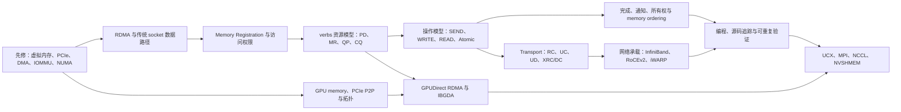

# RDMA

RDMA（Remote Direct Memory Access）主题位于服务器硬件、操作系统内存管理、网络 transport 与分布式通信库的交叉处。本目录以“数据如何移动、权限如何建立、工作如何提交、完成如何判断”为主线；[[02-AISystem/Distributed/RDMA/RDMA原理|RDMA 原理与知识地图]]负责总览，已有的 NVSHMEM 教学笔记承载资源、请求与源码级细节，避免在多个目录重复解释同一套 verbs 对象。

## 主题基线

| 范围 | 仓库已有覆盖 | 定位与重复关系 | 当前缺口 |
| --- | --- | --- | --- |
| 总体概念 | 本目录原有入口、[[02-AISystem/Distributed/distributed-basics/分布式互联技术总览\|分布式互联技术总览]]、[[02-AISystem/Review/ZOMI-infra/2-store-communication/RDMA-intro\|RDMA-intro]] | 后两篇覆盖面较广且存在重复，适合作为背景材料，不作为本主题的规范性主线 | 缺少能区分机制、接口、transport、网络承载和上层通信库的统一地图；由“RDMA 原理与知识地图”补齐 |
| verbs 通信模型 | [[02-AISystem/Distributed/NVSHMEM/a01-rdma-communication-model\|A01 从零开始理解 RDMA 通信模型]] | 已系统覆盖 Context、PD、MR、QP、CQ、SEND/RECV、READ/WRITE 和完成语义 | 总纲只保留对象关系，不复制教学细节 |
| 资源、注册与建连 | [[02-AISystem/Distributed/NVSHMEM/a02-rdma-resources-and-memory-registration\|A02 RDMA 资源、内存注册与建连生命周期]] | 已覆盖资源生命周期、权限、RC QP 状态和 RDMA CM | Memory Window、ODP、DMA-BUF 等高级内存注册机制尚未形成独立主题 |
| 请求、完成与缓冲区协议 | [[02-AISystem/Distributed/NVSHMEM/a03-rdma-requests-and-buffer-protocol\|A03 RDMA 请求、完成与缓冲区协议]] | 已覆盖 WR/WQE、SGE、CQE/WC、inline、signaled 与所有权边界 | 跨 CPU/GPU 的 memory ordering、fence 与可见性仍需按平台和版本继续整理 |
| 实现与源码案例 | [[02-AISystem/Distributed/NVSHMEM/a04-rping-full-rdma-flow\|A04 从 rping 源码追踪一轮完整 RDMA 通信]]、[[02-AISystem/Distributed/RDMA/RDMA-编程\|RDMA 编程]] | A04 有固定源码基线和证据边界，适合作为实现入口；“RDMA 编程”包含较多历史摘录、重复章节和厂商特性材料，应按来源逐段核验后再引用 | 缺少一个最小 verbs 程序的固定版本、构建环境和可重复运行记录 |
| 网络承载 | “分布式互联技术总览”介绍 InfiniBand、RoCE 与 iWARP | 已有横向介绍，但 RDMA transport、网络承载与拥塞控制有时混在同一层 | InfiniBand/RoCEv2 报文、路由、可靠性、PFC/ECN/DCQCN 尚缺官方来源驱动的专门笔记 |
| GPU 与高层通信 | [[02-AISystem/Distributed/NVSHMEM/c01-host-rdma-to-gpudirect-and-ibgda\|从 host RDMA 到 GPUDirect RDMA 与 IBGDA]]、[[02-AISystem/cluster-and-hardware/10-NVLink与NVSwitch、RDMA、NUMA和NCCL：从拓扑到通信路径\|从拓扑到通信路径]] | 已分别覆盖控制/数据路径拆分和拓扑排障；不在 RDMA 总纲重复展开 | UCX transport selection、NCCL NET plugin 与底层 verbs 的固定版本映射仍需源码证据 |
| 验证方法 | [[02-AISystem/Distributed/RDMA/RDMA模拟编程\|RDMA 模拟编程]]目前只有 Soft-RDMA 提示，已有笔记散布了 `rdma`、`ibv_*`、perftest 与 NCCL 工具 | 验证入口尚未形成可复现流程 | 需要补齐环境、命令、预期结果、失败分层和实验记录；在真正执行前不标记为已验证 |

以上“已有覆盖”来自当前仓库内容；“缺口”是基于现有笔记结构得出的整理判断，不表示相关技术在外部资料中不存在。

## 知识骨架

这张图表达知识依赖而不是软件调用栈。PCIe/DMA/虚拟内存是理解 MR 和 GPUDirect RDMA 的先修；verbs 对象是理解具体操作的基础；完成语义与应用层同步协议必须在性能调优之前掌握；UCX、NCCL 和 NVSHMEM 是对底层能力的组合或再抽象，不能与 QP、RoCE 等概念并列为同一层。

## 八阶段学习规划

此处记录**实际学习顺序**；上面的知识骨架和[[02-AISystem/Distributed/RDMA/RDMA原理|原理笔记]]记录概念之间的依赖，两者不必逐项同名。先完成主机数据路径、MR 和 verbs 的assets/执行模型，再用实验建立基线，最后进入 GPU、UCX 与 NCCL。表中的程序、日志和性能结果是待完成的实践产物，不表示已经在本仓库执行或验证。

| 阶段 | 核心问题与重点 | 理解产物 | 实践产物与现有入口 |
| --- | --- | --- | --- |
| 1. 服务器数据路径 | PCIe、DMA、IOMMU、NUMA：设备怎样访问 DRAM？ | 画出 CPU、DRAM、PCIe、RNIC、IOMMU 的地址和数据路径，区分 VA、PA 与 DMA address | 重画 Linux 文档中的地址图；读[[02-AISystem/Distributed/RDMA/Dynamic-DMA-mapping-Guide-英中对照\|Dynamic DMA mapping Guide 英中对照]]与[[02-AISystem/cluster-and-hardware/10-NVLink与NVSwitch、RDMA、NUMA和NCCL：从拓扑到通信路径\|拓扑与通信路径]]。 |
| 2. RDMA 总体模型 | socket 与 RDMA 有何区别？kernel bypass 的 slow path、fast path 分别做什么？ | 能沿控制、数据、权限、完成四条路径解释一次操作，并指出 CPU 与内核仍参与何处 | 结合[[02-AISystem/Distributed/RDMA/RDMA原理\|RDMA 原理]]与[[02-AISystem/Distributed/NVSHMEM/a01-rdma-communication-model\|A01]]画一次 RDMA Write。 |
| 3. Memory Registration | 普通应用虚拟地址为什么不能直接交给 RNIC？MR、`lkey/rkey`、权限与映射有什么关系？ | 能解释 VA、PA、IOVA、MR 的边界，以及 `ibv_reg_mr()` 的输入、结果和生命周期 | 查 `ibv_reg_mr()` 手册，对照[[02-AISystem/Distributed/NVSHMEM/a02-rdma-resources-and-memory-registration\|A02]]追踪注册与注销。 |
| 4. verbs 资源模型 | Context、PD、MR、QP、CQ 由谁创建、引用谁、何时销毁？ | 画出资源依赖图，并能说明 QP 建连所需控制面信息 | 在可用环境中写最小资源初始化程序；用[[02-AISystem/Distributed/NVSHMEM/a04-rping-full-rdma-flow\|A04 rping 源码追踪]]核对对象关系。 |
| 5. verbs 执行模型 | `ibv_post_send()` 之后，WR、SGE、WQE、doorbell、RNIC 与 CQE 怎样衔接？ | 能区分 Send/Recv、Write、Read 的寻址、接收准备与完成语义 | 在可用环境中跑通三类操作；用[[02-AISystem/Distributed/NVSHMEM/a03-rdma-requests-and-buffer-protocol\|A03]]检查 buffer 所有权和通知。 |
| 6. Transport 与 Fabric | RC 等 transport 怎样运行于 InfiniBand/RoCE？网络拥塞与主机队列问题怎样区分？ | 能区分可靠性/连接语义、网络承载、PFC/ECN、路由及拥塞控制 | 用 perftest 记录固定环境基线，再逐一改变消息大小、queue depth、outstanding requests、QP 数量和 NUMA 绑定；参考[[02-AISystem/Distributed/distributed-basics/分布式互联技术总览\|互联技术总览]]。 |
| 7. GPU RDMA | GPU memory 何时能成为 RNIC 的访问目标？PCIe root complex 和 GPU–NIC locality 有何影响？ | 能区分 host staging、GPUDirect RDMA、谁提交工作以及数据实际经过哪里 | 在具备 GPU/RNIC 的机器上结合拓扑工具检查路径；参考[[02-AISystem/Distributed/NVSHMEM/c01-host-rdma-to-gpudirect-and-ibgda\|C01]]与[[02-AISystem/cluster-and-hardware/10-NVLink与NVSwitch、RDMA、NUMA和NCCL：从拓扑到通信路径\|拓扑与通信路径]]。 |
| 8. UCX 与 NCCL | 上层库最终选择了哪条底层路径，依据是什么？ | 能从 collective/消息语义追到 transport、verbs/RNIC 与 host/GPU memory | 在相应环境中用 `ucx_info`、UCX/NCCL debug log 与拓扑信息反推实际路径，不把配置意图当成执行证据。 |

推进每个主题时使用“**概念 → API → 代码 → 实验 → 系统映射**”循环，最终留下位置图、真实数据路径、关键对象/API 和一项可核查的验证。没有对应硬件时，可先完成图、API 与源码追踪，把运行结果标为待验证。业余学习可参考每阶段约一周，但以达成标志而非周数决定是否进入下一阶段。前六阶段是主干；DC、XRC、SRQ、ODP、DevX 等高级主题按遇到的实际问题再查。

### 官方资料如何分工

| 资料角色 | 优先级与入口 | 使用方法 |
| --- | --- | --- |
| DMA 与用户态/内核边界 | P0：[Linux Dynamic DMA Mapping Guide](https://docs.kernel.org/6.2/core-api/dma-api-howto.html)、[Userspace verbs access](https://docs.kernel.org/7.1/infiniband/user_verbs.html) | 前者重点读地址与映射；后者篇幅短，可完整阅读 slow/fast path 和资源管理。 |
| 标准 verbs API 与连接管理 | P0：[rdma-core/libibverbs](https://github.com/linux-rdma/rdma-core)、[libibverbs 文档](https://github.com/linux-rdma/rdma-core/blob/master/Documentation/libibverbs.md)；P1：[librdmacm 手册](https://github.com/linux-rdma/rdma-core/blob/master/librdmacm/man/rdma_cm.7) | 按 Context、MR、QP、CQ、WR 逐个查 man page；verbs 程序跑通后再深入 RDMA CM。 |
| 程序流程与可重复实验 | P1：[NVIDIA RDMA Aware Networks Programming User Manual](https://docs.nvidia.com/rdma-aware-networks-programming-user-manual-1-7.pdf)、[linux-rdma/perftest](https://github.com/linux-rdma/perftest) | 手册用于串起示例，perftest 用于改变单一变量并记录硬件、版本、拓扑与原始结果；合成基准不直接代表应用性能。 |
| GPU、RNIC 与 RoCE 网络 | P1：[GPUDirect RDMA](https://docs.nvidia.com/cuda/gpudirect-rdma/)；P2：[Cumulus QoS/ECN](https://docs.nvidia.com/networking-ethernet-software/cumulus-linux/Layer-1-and-Switch-Ports/Quality-of-Service/) | 有相应硬件或 Fabric 问题时，结合真实 PCIe/GPU/NIC 与交换机配置阅读。 |
| 高层通信系统 | P2：[OpenUCX 文档](https://github.com/openucx/ucx/blob/master/docs/source/index.rst)、[NCCL User Guide](https://docs.nvidia.com/deeplearning/nccl/user-guide/docs/) | 先看架构与使用，再从日志、源码和拓扑核对 UCT/UCP 或 NCCL 选择的实际路径。 |

以上优先级来自本次提供的学习规划，是阅读安排，不是资料权威性排序。InfiniBand Architecture Specification 适合作为后续查证细节的规范参考；入门阶段先用 DMA 文档、verbs 手册和最小程序建立可验证的执行模型。

## 边界与使用原则

- 本主题首先解释 RDMA 的通用执行模型；特定 RNIC 的 WQE 格式、BlueFlame、DevX、DCI/DCT 等属于 provider 或设备扩展，不能直接推广为所有实现的共同语义。
- InfiniBand、RoCE 与 iWARP 是承载 RDMA 的不同网络技术；RC、UC、UD 是 transport service 类型；verbs 是编程接口与对象模型。这三组概念属于不同分类维度。
- “zero-copy”“kernel bypass”和“远端 CPU 不参与”都带适用条件。控制面、资源管理、错误处理和应用同步仍可能依赖 CPU 与内核。
- 性能结论必须记录硬件、firmware、driver、rdma-core、网络配置、消息规模和拓扑。没有实际实验时只记录机制假设，不记录带宽或延迟结论。
