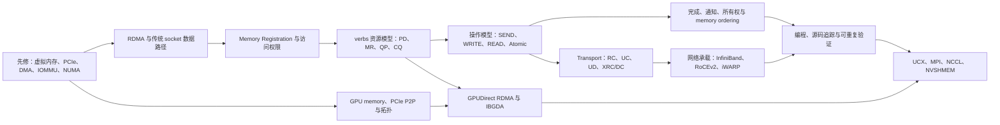

# RDMA

RDMA（Remote Direct Memory Access）主题位于服务器硬件、操作系统内存管理、网络 transport 与分布式通信库的交叉处。本目录以“数据如何移动、权限如何建立、工作如何提交、完成如何判断”为主线；[[02-AISystem/Distributed/RDMA/RDMA原理|RDMA 原理与知识地图]]负责总览，已有的 NVSHMEM 教学笔记承载资源、请求与源码级细节，避免在多个目录重复解释同一套 verbs 对象。

## 主题基线

| 范围 | 仓库已有覆盖 | 定位与重复关系 | 当前缺口 |
| --- | --- | --- | --- |
| 总体概念 | 本目录原有入口、[[02-AISystem/Distributed/分布式基础/分布式互联技术总览|分布式互联技术总览]]、[[02-AISystem/AI-sys-review/ZOMI-infra/2-store-communication/RDMA-intro|RDMA-intro]] | 后两篇覆盖面较广且存在重复，适合作为背景材料，不作为本主题的规范性主线 | 缺少能区分机制、接口、transport、网络承载和上层通信库的统一地图；由“RDMA 原理与知识地图”补齐 |
| verbs 通信模型 | [[02-AISystem/Distributed/NVSHMEM/a01-rdma-communication-model|A01 从零开始理解 RDMA 通信模型]] | 已系统覆盖 Context、PD、MR、QP、CQ、SEND/RECV、READ/WRITE 和完成语义 | 总纲只保留对象关系，不复制教学细节 |
| 资源、注册与建连 | [[02-AISystem/Distributed/NVSHMEM/a02-rdma-resources-and-memory-registration|A02 RDMA 资源、内存注册与建连生命周期]] | 已覆盖资源生命周期、权限、RC QP 状态和 RDMA CM | Memory Window、ODP、DMA-BUF 等高级内存注册机制尚未形成独立主题 |
| 请求、完成与缓冲区协议 | [[02-AISystem/Distributed/NVSHMEM/a03-rdma-requests-and-buffer-protocol|A03 RDMA 请求、完成与缓冲区协议]] | 已覆盖 WR/WQE、SGE、CQE/WC、inline、signaled 与所有权边界 | 跨 CPU/GPU 的 memory ordering、fence 与可见性仍需按平台和版本继续整理 |
| 实现与源码案例 | [[02-AISystem/Distributed/NVSHMEM/a04-rping-full-rdma-flow|A04 从 rping 源码追踪一轮完整 RDMA 通信]]、[[02-AISystem/Distributed/RDMA/RDMA-编程|RDMA 编程]] | A04 有固定源码基线和证据边界，适合作为实现入口；“RDMA 编程”包含较多历史摘录、重复章节和厂商特性材料，应按来源逐段核验后再引用 | 缺少一个最小 verbs 程序的固定版本、构建环境和可重复运行记录 |
| 网络承载 | “分布式互联技术总览”介绍 InfiniBand、RoCE 与 iWARP | 已有横向介绍，但 RDMA transport、网络承载与拥塞控制有时混在同一层 | InfiniBand/RoCEv2 报文、路由、可靠性、PFC/ECN/DCQCN 尚缺官方来源驱动的专门笔记 |
| GPU 与高层通信 | [[02-AISystem/AI-sys-review/GPU通信与互联/04-RDMA与GPU网络|RDMA 与 GPU 网络]]、[[02-AISystem/Distributed/NVSHMEM/c01-host-rdma-to-gpudirect-and-ibgda|从 host RDMA 到 GPUDirect RDMA 与 IBGDA]]、[[02-AISystem/cluster-and-hardware/10-NVLink与NVSwitch、RDMA、NUMA和NCCL：从拓扑到通信路径|从拓扑到通信路径]] | 已分别覆盖 GPU 网络资料导航、控制/数据路径拆分和拓扑排障；不在 RDMA 总纲重复展开 | UCX transport selection、NCCL NET plugin 与底层 verbs 的固定版本映射仍需源码证据 |
| 验证方法 | [[02-AISystem/Distributed/RDMA/RDMA模拟编程|RDMA 模拟编程]]目前只有 Soft-RDMA 提示，已有笔记散布了 `rdma`、`ibv_*`、perftest 与 NCCL 工具 | 验证入口尚未形成可复现流程 | 需要补齐环境、命令、预期结果、失败分层和实验记录；在真正执行前不标记为已验证 |

以上“已有覆盖”来自当前仓库内容；“缺口”是基于现有笔记结构得出的整理判断，不表示相关技术在外部资料中不存在。

## 知识骨架

这张图表达知识依赖而不是软件调用栈。PCIe/DMA/虚拟内存是理解 MR 和 GPUDirect RDMA 的先修；verbs 对象是理解具体操作的基础；完成语义与应用层同步协议必须在性能调优之前掌握；UCX、NCCL 和 NVSHMEM 是对底层能力的组合或再抽象，不能与 QP、RoCE 等概念并列为同一层。

## 推荐学习路径

| 阶段 | 核心问题 | 首选材料 | 掌握标准 |
| --- | --- | --- | --- |
| 1. 数据搬运基础 | PCIe 设备怎样访问主机内存，地址转换和 NUMA 怎样影响路径？ | [[02-AISystem/cluster-and-hardware/10-NVLink与NVSwitch、RDMA、NUMA和NCCL：从拓扑到通信路径|从拓扑到通信路径]] | 能画出 CPU、DRAM、GPU、RNIC、PCIe Root Complex 与 IOMMU 的关系 |
| 2. 核心心智模型 | RDMA 相比 socket 改变了谁搬数据、谁提交工作、谁处理远端请求？ | [[02-AISystem/Distributed/RDMA/RDMA原理|RDMA 原理与知识地图]]、[[02-AISystem/Distributed/NVSHMEM/a01-rdma-communication-model|A01]] | 能分别画出控制路径、数据路径、权限路径和完成路径 |
| 3. 资源与权限 | 普通 buffer 为什么不能直接交给 RNIC？ | [[02-AISystem/Distributed/NVSHMEM/a02-rdma-resources-and-memory-registration|A02]] | 能解释 PD、MR、`lkey/rkey`、地址范围、访问标志和资源生命周期 |
| 4. 操作与正确性 | SEND/RECV、WRITE、READ 怎样寻址，completion 能证明什么？ | [[02-AISystem/Distributed/NVSHMEM/a03-rdma-requests-and-buffer-protocol|A03]] | 能区分 post、local completion、remote arrival、notification 与 remote consumption |
| 5. 实现与验证 | 抽象对象怎样映射到 API、状态机和实际执行？ | [[02-AISystem/Distributed/NVSHMEM/a04-rping-full-rdma-flow|A04]]、[[02-AISystem/Distributed/RDMA/RDMA-编程|RDMA 编程]]、[[02-AISystem/Distributed/RDMA/RDMA模拟编程|RDMA 模拟编程]] | 能用固定版本源码解释一轮通信，并用工具区分资源、链路和性能问题；未运行的实验保持“待验证” |
| 6. Fabric 与扩展性 | RC 等 transport 如何运行在 IB/RoCE 上，连接和拥塞怎样扩展？ | [[02-AISystem/Distributed/分布式基础/分布式互联技术总览|分布式互联技术总览]]，后续需补专门笔记 | 能区分 transport 语义、网络承载、流控、拥塞控制和路由 |
| 7. GPU 与通信系统 | GPU memory 怎样成为 RDMA operand，上层库如何选择路径？ | [[02-AISystem/AI-sys-review/GPU通信与互联/04-RDMA与GPU网络|RDMA 与 GPU 网络]]、[[02-AISystem/Distributed/NVSHMEM/c01-host-rdma-to-gpudirect-and-ibgda|C01]] | 能区分 host staging、host-posted GDR、CPU proxy、IBGDA、UCX 与 NCCL 的职责 |

## 边界与使用原则

- 本主题首先解释 RDMA 的通用执行模型；特定 RNIC 的 WQE 格式、BlueFlame、DevX、DCI/DCT 等属于 provider 或设备扩展，不能直接推广为所有实现的共同语义。
- InfiniBand、RoCE 与 iWARP 是承载 RDMA 的不同网络技术；RC、UC、UD 是 transport service 类型；verbs 是编程接口与对象模型。这三组概念属于不同分类维度。
- “zero-copy”“kernel bypass”和“远端 CPU 不参与”都带适用条件。控制面、资源管理、错误处理和应用同步仍可能依赖 CPU 与内核。
- 性能结论必须记录硬件、firmware、driver、rdma-core、网络配置、消息规模和拓扑。没有实际实验时只记录机制假设，不记录带宽或延迟结论。
