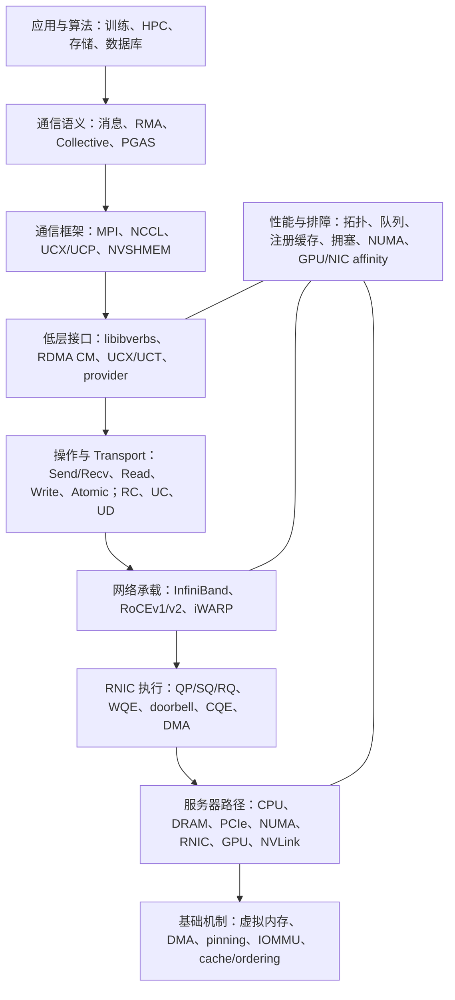
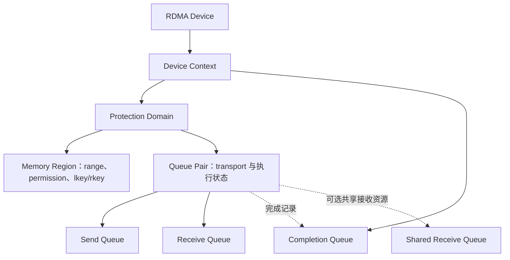
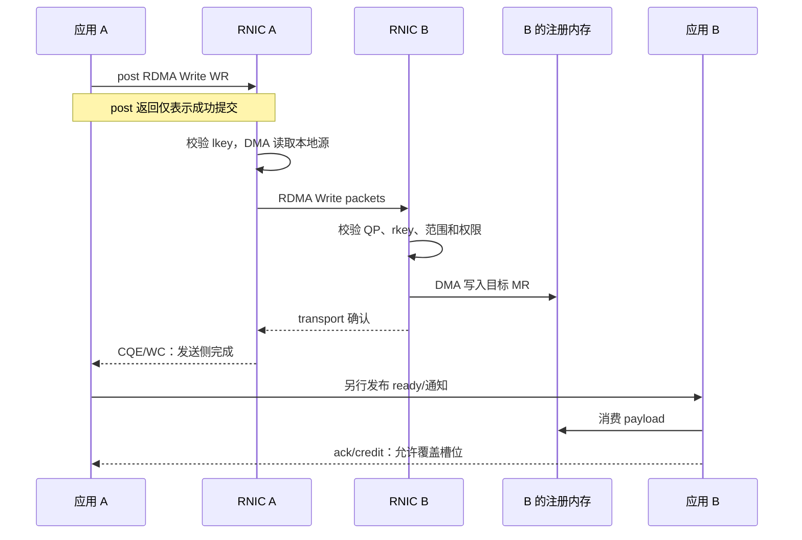

# RDMA 原理与知识地图

RDMA（Remote Direct Memory Access）不是单一网络协议，而是一套围绕受保护内存、用户态工作队列、RNIC 执行和远端内存操作建立的通信模型。它要解决的核心问题是：在预先完成资源创建、内存授权和连接协商之后，让 RNIC 负责高频数据搬运，减少 CPU、内核协议栈和中间缓冲复制对稳态数据路径的参与。

理解 RDMA 时需要同时保持三个视角：**系统分层**回答概念位于哪里，**执行路径**回答通信意图怎样变成硬件数据搬运，**资源与权限模型**回答 RNIC 为什么能够安全访问本地和远端内存。遇到新概念时，还应继续追问它属于资源、接口、机制、协议还是应用，以及它处于控制、数据、权限还是同步路径。这样才能把 NCCL、UCX、NVSHMEM、IBGDA 和具体性能问题放回同一张坐标系，而不是把它们当成并列术语。

本文是 RDMA 主题的总纲，负责概念分层、依赖和边界，不替代 verbs API 教程、网络规范或性能实验。资源与请求的细节分别进入 [[02-AISystem/Distributed/NVSHMEM/a01-rdma-communication-model|RDMA 通信模型]]、[[02-AISystem/Distributed/NVSHMEM/a02-rdma-resources-and-memory-registration|资源、内存注册与建连]]和[[02-AISystem/Distributed/NVSHMEM/a03-rdma-requests-and-buffer-protocol|请求、完成与缓冲区协议]]。

## RDMA 在系统中的位置



这是一张抽象关系图，不表示每个软件栈都严格逐层调用，也不表示 QP、WQE 等对象在概念上“高于”PCIe。纵向箭头表达从应用语义到物理执行所依赖的抽象层，性能与排障则横跨接口、fabric 和硬件路径。UCX 可以同时组合 verbs、共享内存、TCP 和 GPU transport；NCCL 也可能直接使用网络插件而不经过 UCX。稳定的分类边界如下。

| 概念 | 实体类型 | 回答的问题 |
| --- | --- | --- |
| RDMA | 通信与远端内存访问机制 | 如何让设备在受保护内存之间直接搬运数据？ |
| verbs / `libibverbs` | 编程接口与对象模型 | 应用如何创建资源并向设备提交操作？ |
| PD、MR、QP、CQ | verbs 资源对象 | 权限、内存、执行端点和完成结果如何表示？ |
| RC、UC、UD | Transport service | 连接、可靠性和顺序采用什么语义？ |
| InfiniBand、RoCE、iWARP | 网络承载 | RDMA 操作通过什么网络协议跨机器传输？ |
| RNIC/HCA | 硬件执行者 | 谁消费工作队列、执行 DMA 和网络协议？ |
| UCX、MPI、NCCL、NVSHMEM | 上层通信系统 | 如何向应用提供消息、RMA、PGAS 或 collective 语义？ |

因此，“InfiniBand 和 RoCE 如何选择”与“RDMA 和 socket 模型有何差异”都是有效问题；“RDMA 和 InfiniBand 哪个更快”则混合了机制与承载层。

### 用坐标系定位新概念

同一概念经常同时占据多个坐标。例如 `rkey` 在系统分层上属于 verbs 资源模型，在功能上属于权限路径，在一次 Write 中又是远端 RNIC 的校验输入。定位时可以依次回答以下问题：

```text
它位于哪一层？
它是资源、接口、机制、协议、实现还是应用？
它参与控制、数据、权限还是同步路径？
它依赖什么，上层又怎样使用它？
```

| 概念 | 主分类 | 路径位置 | 直接关系 |
| --- | --- | --- | --- |
| `rkey` | MR 的远端访问凭据 | 权限路径 | 由 MR 产生，随远端地址交给请求者，由目标 RNIC 校验 |
| Doorbell | 队列通知机制 | 控制/提交路径 | 位于 WQE 发布之后、RNIC 消费之前 |
| RC | Transport service | 数据路径 | 规定连接、可靠性、顺序和重传语义 |
| RoCEv2 | 网络承载 | 数据路径 | 在 UDP/IP/Ethernet 上承载 RDMA transport packet |
| GPUDirect RDMA | NIC–GPU DMA 能力 | 数据路径与权限路径 | 让注册的 GPU memory 成为 RNIC operand，不决定谁提交 WQE |
| UCX | 通信框架 | 上层选择与控制路径 | UCP 组合协议，UCT 对接具体 transport 和设备能力 |
| NCCL | GPU collective 库 | 应用语义与路径选择 | 把 collective 切分为通道和传输任务，再选择节点内外后端 |

## 四项基础机制

DMA、zero-copy、kernel bypass 和 memory registration 经常一起出现，但并不是同义词。

| 机制 | 核心问题 | 在 RDMA 中的作用 |
| --- | --- | --- |
| DMA | 谁搬数据 | RNIC 直接读写已映射的主机或 GPU 内存，而非由 CPU 执行逐字节复制 |
| Zero-copy | 是否需要额外数据复制 | 尽量避免应用缓冲区与内核中间缓冲区之间的复制 |
| Kernel bypass | 每次操作是否需要进入内核 | 应用在用户态构造并提交工作；内核仍负责设备、权限和资源控制 |
| Memory Registration | RNIC 是否有权且能够访问这段内存 | 建立地址范围、DMA 映射和访问权限，并产生本地或远端访问凭据 |

四者形成的是因果链而不是同义词：Memory Registration 先建立可访问区域与权限，kernel bypass 让应用低开销地提交操作，DMA 由 RNIC 完成实际搬运，zero-copy 则是尽量避免软件中间副本的数据路径结果。即使实现了 zero-copy，字节仍然会经过内存系统、PCIe、RNIC、网络和远端内存；NIC cache、网络分包和 PCIe transaction 也不会消失。

### 与传统 socket 的模型差异

| 比较维度 | 传统 TCP/socket 心智模型 | RDMA 心智模型 |
| --- | --- | --- |
| 应用提交内容 | 字节流或消息缓冲区 | 描述内存、操作、标志和目标的 Work Request |
| 接收位置 | 接收程序通过 `recv()` 等接口提供 | SEND/RECV 由接收方提供；WRITE/READ 由发起方给出远端地址 |
| 内核参与 | 通常由内核 socket/TCP 栈推进收发 | 内核主要参与资源建立、授权和异常处理，稳态快路径可绕过内核 |
| 主要搬运者 | CPU、内核和 NIC 共同参与，取决于具体 offload | RNIC DMA engine 在已注册内存之间搬运 payload |
| 远端 CPU | 需要推进传统接收路径 | 普通 RDMA READ/WRITE 不要求远端 CPU 逐请求执行接收代码 |
| 保护方式 | 进程地址空间、socket 和内核缓冲区 | PD、MR、地址范围、访问标志与 `lkey/rkey` |
| 完成判断 | 常被 API 抽象为写入或读取字节 | 必须区分提交、本地完成、远端到达、通知和消费完成 |

这个对比描述的是控制模型，而不是断言所有 TCP 实现都必然多次复制。现代网络栈可以通过 TSO/GRO、`sendfile`、busy polling 等方式优化数据路径；RDMA 的结构性差异仍在于应用围绕已注册内存和硬件工作队列表达通信。

经典 MR 注册常伴随页固定和 DMA 映射，但“注册必然等于永久锁页”不是跨实现成立的定义；ODP、DMA-BUF MR 等机制会改变页驻留与映射方式。稳定结论是：MR 把一段内存变成 RNIC 可识别、可校验并受生命周期约束的访问对象。[rdma-core 的 `ibv_reg_mr(3)`](https://github.com/linux-rdma/rdma-core/blob/master/libibverbs/man/ibv_reg_mr.3)规定，本地 SGE 使用 `lkey`，远端 RDMA 或 Atomic 请求使用 `rkey`。

## 资源与权限模型



Context 表示进程打开的设备入口；PD 建立资源保护边界；MR 描述 RNIC 可以访问的内存；QP 是带 transport 状态的通信执行端点；CQ 保存完成记录。一个 QP 的 SQ 可以提交 SEND、RDMA WRITE、RDMA READ、Atomic 等工作，RQ 则为需要接收工作项的消息或通知提供缓冲资源。官方 [`ibv_create_qp(3)`](https://github.com/linux-rdma/rdma-core/blob/master/libibverbs/man/ibv_create_qp.3)把 PD、发送/接收 CQ、SRQ、队列容量和 QP transport type 关联到同一个 QP。

| 对象 | 它解决的问题 | 主要关系 | 不应误解为 |
| --- | --- | --- | --- |
| Device Context | 本进程使用哪块 RDMA 设备 | PD、CQ、QP 等资源最终从它派生 | 网络连接 |
| PD | 哪些 QP 与 MR 处于同一保护边界 | 约束 QP 对 MR 的合法使用 | 数据缓冲区 |
| MR | RNIC 可访问的范围、映射、权限和 key | 产生 `lkey/rkey`，依赖底层 buffer 生命周期 | 内存本身 |
| QP | 承载工作和 transport 状态的本地端点 | 包含 SQ/RQ，关联 CQ、PD 和对端路径 | 两端合成的单一 connection 对象 |
| SQ/RQ | 主动请求与预贴接收请求的工作队列 | 保存 WQE，不保存业务 payload 本身 | 消息数据队列 |
| WR | 应用构造的工作描述 | 由 provider 转换或编码为 WQE | 已经执行的硬件请求 |
| SGE | 本地内存片段的地址、长度和 `lkey` | 一个 WR 可以引用一个或多个 SGE | 远端地址信息 |
| WQE | RNIC 实际消费的设备工作项 | 位于 SQ、RQ 或相关工作队列 | Work Completion |
| CQ/CQE/WC | 保存并向软件报告完成结果 | QP 产生 CQE，poll 接口返回 WC | payload 队列或远端消费证明 |
| RDMA CM | 地址、路由和连接事件管理 | 帮助建立通信端点 | 业务消息协议 |

### Memory Registration 为什么不可省略

应用指针属于进程虚拟地址空间，而 RNIC 是独立 PCIe 设备。要让设备安全访问该内存，至少必须同时解决四个约束：虚拟地址怎样对应到设备可 DMA 的页面或设备内存；请求执行期间映射和底层对象怎样保持有效；哪些 QP 可以使用这份授权；以及允许本地写、远端读、远端写还是 Atomic。MR 因而不只是“把地址告诉网卡”，而是地址转换、范围、权限与生命周期的契约。

`lkey` 随本地 SGE 提交，用于校验 RNIC 对本地 operand 的访问；`rkey` 可以通过受保护的控制面交给远端请求者，用于校验远端 READ、WRITE 或 Atomic。知道地址但没有匹配 `rkey` 不够，拥有 `rkey` 但地址和长度越界也不够；MR 注销或底层 buffer 失效后，旧地址和 key 都不能继续使用。经典注册成本较高，因此工程实现常复用长期注册的 memory pool 或 registration cache，但具体收益必须结合 MR 数量、页表、NUMA 和 RNIC cache 行为验证。

“知道远端地址”不等于“拥有访问能力”。一次远端访问至少同时受以下条件约束：QP 与路径可达、QP 状态允许该操作、MR 地址和长度覆盖目标、访问标志允许远端操作、`rkey` 有效，以及资源在请求完成前没有被销毁。PD、MR 权限、地址范围、key 与 QP 状态共同构成访问控制；`rkey` 只是其中一项。

## 执行模型：一次 RDMA Write 的完整因果链

一次典型操作可压缩为：

```text
应用通信意图
→ Work Request（WR）
→ provider 生成设备工作描述（WQE）
→ 写入 QP 的工作队列并 ring doorbell
→ RNIC 校验 key、执行 DMA 和网络传输
→ 产生 Completion Queue Entry（CQE）
→ 应用取得 Work Completion（WC）
```

WR 是软件 API 层的请求，WQE 是更接近设备的队列表示；CQE 是设备写入的完成记录，WC 是 `ibv_poll_cq()` 等接口返回给软件的结果。不同 provider 的 WQE/CQE 格式可以不同，因此不能用某个厂商的描述符布局定义通用 verbs 语义。

假设主机 A 要把本地 `src` 写到主机 B 的 `dst`。B 先分配并注册 `dst`，创建 PD、CQ 和 QP，并通过 TCP、RDMA CM 消息或其他 bootstrap 通道把 `remote_addr + rkey + length` 安全交给 A。A 的本地 `src` 也必须是 RNIC 可以合法访问的 operand。One-sided 省去的是稳态每次 Write 对远端 `recv()` 的依赖，不是初始化、授权和业务协议。

| 阶段 | 发生的事情 | 此时能得出的结论 |
| --- | --- | --- |
| 1. 资源准备 | 两端创建 PD/CQ/QP，注册本地源和远端目标 MR，RC QP 进入可通信状态 | 资源和权限已具备，不代表已经传输数据 |
| 2. 元数据交换 | B 向 A 提供远端地址、`rkey`、长度和业务槽位信息 | A 获得本轮远端寻址能力 |
| 3. 构造并 post WR | A 设置 opcode、本地 SGE、远端地址、`rkey` 和标志，provider 发布 WQE 并通知 RNIC | `ibv_post_send()` 成功只表示请求已提交到 SQ |
| 4. 本地 DMA | RNIC A 校验 `lkey`，经 PCIe 读取 `src` | NUMA、IOMMU 与 PCIe 路径开始影响访问成本 |
| 5. 网络传输 | RNIC 按 transport 分包，经 InfiniBand、RoCE 或 iWARP 发送；RC 负责相应顺序、确认和重传 | 网络传输可靠不等于业务协议完成 |
| 6. 远端放置 | RNIC B 校验 QP、`rkey`、范围和 `REMOTE_WRITE` 权限，再 DMA 写入 `dst` | 远端内存被更新，但应用未必得到通知 |
| 7. 完成与消费 | RNIC A 生成 CQE，A poll 得到 WC；A/B 再用 Immediate、SEND、flag 或 ack 协调远端消费和槽位复用 | 本地完成、远端通知、远端消费和缓冲区回收是不同事件 |



### 四条横向路径

| 路径 | 核心问题 | 典型概念 |
| --- | --- | --- |
| 控制路径 | 谁发现设备、建立连接、交换地址并提交工作？ | 内核驱动、RDMA CM、TCP bootstrap、QP state、WR、doorbell |
| 数据路径 | 字节实际经过哪些设备、链路和内存？ | DRAM/GPU HBM、PCIe、RNIC、RC、InfiniBand/RoCE、远端内存 |
| 权限路径 | RNIC 为什么有权访问该地址范围？ | IOMMU/DMA mapping、PD、MR、access flags、`lkey/rkey`、QP |
| 同步路径 | 谁在何时知道数据可用，何时可以复用缓冲区？ | CQE/WC、Immediate、SEND、flag、sequence number、fence、ack/credit |

RDMA CM 可帮助完成地址解析、路由解析和连接事件管理，但不会替应用设计 payload 格式、内存所有权或消费确认协议；其接口边界可查阅 [rdma-core `rdma_cm(7)`](https://github.com/linux-rdma/rdma-core/blob/master/librdmacm/man/rdma_cm.7)。控制面使用 TCP 而数据面使用 RDMA 并不矛盾。

以后分析任意 RDMA 路径，可以依次追问：谁发起操作，本地数据在哪里，远端地址和 key 从哪里来，请求进入哪条队列，谁敲 doorbell，RNIC DMA 哪段内存，完成出现在哪里，远端如何得到 ready 通知，以及谁证明目标槽位可以安全复用。

## 操作语义：Two-sided 与 One-sided

| 维度 | SEND/RECV | RDMA WRITE | RDMA READ | Atomic |
| --- | --- | --- | --- | --- |
| 通信模型 | Two-sided | One-sided | One-sided | One-sided |
| 数据方向 | Sender → Receiver | Local → Remote | Remote → Local | 对远端小对象执行原子更新，部分操作返回旧值 |
| 目标位置 | 由接收方预贴的 Receive SGE 决定 | 发起方指定远端地址和 `rkey` | 发起方指定远端地址和 `rkey` | 发起方指定远端原子对象和 `rkey` |
| 对端是否需要 post receive | 需要 | 不需要 | 不需要 | 不需要 |
| 远端地址/`rkey` | 应用通常不直接指定 | 需要 | 需要 | 需要 |
| 常见完成位置 | 发送方有发送 WC，接收方有接收 WC | 通常只有发起方发送 WC | 发起方等待 READ WC | 发起方等待 Atomic WC |
| 典型用途 | 消息、RPC、控制通知 | 数据发布、大块传输 | 主动拉取远端数据 | 计数器、锁和协调元数据 |
| 主要同步问题 | Receive credit 是否足够 | 对端怎样知道新数据可以使用 | 读取期间远端数据是否稳定 | 原子范围怎样映射到完整业务一致性 |

One-sided 只表示远端 CPU 不必为每次数据操作同步执行 `recv()`，不表示双方无需事先交换元数据，也不表示发起方可以直接解引用远端指针。SEND/RECV 的放置权主要在接收方；WRITE/READ 的远端寻址权主要在发起方。

完成语义必须单独判断。`ibv_post_send()` 成功通常只说明请求已提交，而不是数据已经到达。发送侧 CQE 表示操作达到了 transport 和 opcode 定义的完成条件，也不自动证明远端应用已经消费数据。普通 RDMA WRITE 默认不会给远端应用生成一条等价于 RECV 的消息，因此系统常用 WRITE WITH IMM、WRITE + SEND、sequence number、ring index 或独立 control QP 建立通知和所有权协议。

WRITE WITH IMM 是介于纯 one-sided 数据放置与 two-sided 通知之间的重要形式：payload 仍由发送方给出的远端地址放置，但远端会获得携带 immediate value 的接收完成；该通知仍需要消耗远端预贴的 Receive Request。操作与 transport 的可用组合也不同，例如 READ 和常见 Atomic 主要建立在 RC 等支持相应语义的 transport 上，UD 则提供不可靠数据报，不能把所有 opcode 与所有 QP type 任意组合。

## Transport 与网络承载

| Transport | 连接语义 | 可靠性 | 位置与典型用途 |
| --- | --- | --- | --- |
| RC | Connected | 可靠、有序 | READ/WRITE 的常见基础；需要维护较多 per-QP 状态 |
| UC | Connected | 不可靠 | 较少使用的特定场景 |
| UD | Datagram | 不可靠 | 消息式通信和低连接状态场景，不提供普通 RC 式的一侧 READ/WRITE 语义 |
| XRC/DC | 扩展连接机制 | 依实现提供可靠能力 | 降低大规模通信中的连接状态成本；能力和 API 具有 provider/设备依赖 |

上述 transport 仍需网络承载：InfiniBand 使用完整的 IB fabric；RoCE 在 Ethernet 上传输 RDMA，RoCEv2 可通过 UDP/IP 路由；iWARP 在 TCP/IP 上实现 RDMA。RoCE 网络的实际性能还依赖拥塞控制、队列、QoS、ECMP、PFC/ECN 配置和流量模式，不能从“链路支持 RoCE”直接推出端到端性能。

## GPU 与上层通信系统

进入 GPU 集群后，最常见的错误是把通信库、编程模型、网络承载和 DMA 能力混成一层。下面的定位表只描述主职责；真实系统可能跨越多层并组合多个后端。

| 技术 | 所在层次 | 主要职责 | 不直接保证什么 |
| --- | --- | --- | --- |
| GPUDirect RDMA | PCIe 与内存访问能力 | 允许 RNIC 直接 DMA 已注册 GPU memory | GPU 自己提交 WQE，或 GPU kernel 自动获得正确可见性 |
| `libibverbs` | 低层用户态接口 | 创建 MR/QP/CQ，提交 verbs 并取得完成 | 自动选择 collective 算法或业务协议 |
| UCX/UCT | 低层 transport 抽象 | 统一 verbs、共享内存、CUDA/ROCm 等设备能力 | 提供完整 MPI/NCCL 应用语义 |
| UCX/UCP | 通信协议层 | 实现 tag matching、RMA、rendezvous、分片、multi-rail 与路径选择 | 固定只使用 RDMA；它也可选择 TCP、共享内存等路径 |
| MPI | 并行编程模型与 API | 提供消息、collective 和 RMA 等通用 HPC 语义 | 必然直接调用 verbs |
| NCCL | GPU collective/点对点库 | 根据拓扑组织 ring/tree、channel、protocol 和网络后端 | 所有跨节点流量必然使用 GPUDirect RDMA |
| NVSHMEM | GPU PGAS/one-sided API | 以 symmetric memory、PE 和 put/get/atomic 表达通信 | 某个 device API 必然由 GPU 直接提交 NIC 工作 |
| IBGDA/GDAKI | GPU-initiated 网络提交路径 | 减少 device API 到 CPU proxy 的稳态提交依赖 | 消除 MR、key、completion 和应用同步要求 |

普通跨节点 GPU 通信可能使用 GPU HBM → Host DRAM → RNIC 的 staging 路径。GPUDirect RDMA 的目标是让 RNIC 直接 DMA GPU memory，因此改变的是本地内存目标和 PCIe 数据路径，而不是引入新的网络协议。它是否可用取决于 GPU/NIC 支持、peer-memory 或 DMA-BUF 映射、驱动、IOMMU/ACS 和 PCIe 拓扑，详见[[02-AISystem/cluster-and-hardware/10-NVLink与NVSwitch、RDMA、NUMA和NCCL：从拓扑到通信路径|从拓扑到通信路径]]。

GPUDirect RDMA 也不等于 GPU 直接提交 NIC 工作。CPU 可以调用 verbs，把注册的 GPU memory 作为 SGE；数据路径已经是 GDR，但控制路径仍由 CPU 发起。IBGDA/GDAKI 等机制进一步改变工作请求的提交与推进路径。两者的区别见[[02-AISystem/Distributed/NVSHMEM/c01-host-rdma-to-gpudirect-and-ibgda|从 host RDMA 到 GPUDirect RDMA 与 IBGDA]]。

GPU memory 还引入额外的可见性边界。NVIDIA [GPUDirect RDMA 文档](https://docs.nvidia.com/cuda/gpudirect-rdma/)明确把 synchronization and memory ordering 作为独立主题；网络写入已经完成并不保证并发 GPU kernel 自动观察到符合应用预期的完整顺序，必须使用对应平台和 API 定义的同步机制。

在更高层，UCX 的 UCT 抽象共享内存、verbs、CUDA/ROCm 等底层 transport，UCP 在其上实现 tag matching、RMA、rendezvous、transport selection 与 multi-rail 等协议；该边界来自 [OpenUCX 官方架构说明](https://github.com/openucx/ucx/blob/master/docs/source/faq.md)。NCCL 则提供 topology-aware 的 GPU collective primitives，并依据可见拓扑和后端能力选择节点内外路径；其定位见 [NCCL 官方文档](https://docs.nvidia.com/deeplearning/nccl/)。NVSHMEM 向 GPU 程序提供 symmetric memory 上的 one-sided put/get/atomic 等 PGAS 能力，具体 transport 和 GPU-initiated 支持应按所用版本查阅 [NVSHMEM 官方文档](https://docs.nvidia.com/nvshmem/api/latest/introduction.html)。这些库可能利用 RDMA，但它们提供的抽象不等同于 RDMA 本身。

一次典型的跨节点 GPU collective 可以粗略分解为：训练框架提出 collective → NCCL 选择算法并切分 chunk/channel → network plugin 或 transport 构造网络任务 → RNIC 通过 InfiniBand/RoCE 搬运数据 → 远端 GPU 或 host buffer 接收。GPUDirect RDMA 决定 RNIC 能否直接访问 CUDA buffer；IBGDA 等机制决定 GPU 是否进一步承担 NIC 工作提交。前者属于 payload 数据路径，后者主要改变控制与提交路径。

## 性能问题的分层定位

RDMA 性能问题不等于网络问题。端到端带宽或延迟可能受应用批量策略、MR 注册、队列深度、PCIe、NUMA、RNIC cache、fabric 拥塞或 GPU 同步限制。排障时应先提出路径假设，再为每一层选择证据。

| 层次 | 典型变量 | 观察入口 |
| --- | --- | --- |
| 应用与算法 | 消息大小、并发度、batching、collective 算法、同步频率 | 应用 profiler、NCCL/通信库日志 |
| 中间件 | eager/rendezvous、lane、multi-rail、transport selection | `ucx_info -d`、UCX trace、NCCL NET 日志 |
| verbs 请求 | inline、signaled frequency、SGE 数量、WR/doorbell batching | 程序统计、provider counter、源码路径 |
| QP/CQ | QP 数量、queue depth、CQ polling/moderation、RNR/credit | `rdma resource`、CQ/WC 错误与设备计数器 |
| Memory | registration cache、MR 数量/大小、页映射、NUMA locality | 注册日志、`numactl -H`、进程内存与设备统计 |
| PCIe | 链路代际与宽度、switch/Root Complex、ACS/IOMMU | `lspci -tv`、`lspci -vv`、sysfs |
| RNIC | firmware、队列/cache、offload、端口能力 | `ibv_devinfo`、厂商遥测 |
| Network Fabric | MTU、拥塞、ECN/PFC、路由、丢包、oversubscription | 交换机与端口计数器、fabric telemetry |
| GPU | GDR、GPU–NIC locality、peer mapping、stream synchronization | `nvidia-smi topo -m`、CUDA/NCCL 日志 |
| 端到端基线 | 单向/双向带宽、延迟、消息率 | `ib_write_bw`、`ib_read_bw`、`ib_send_bw` |

表中的工具只能支持特定层的判断。例如 `nvidia-smi topo -m` 能显示软件观察到的 GPU–NIC 邻近关系，但不能单独证明 GPUDirect RDMA 已启用；`ib_write_bw` 能给出给定环境下的 verbs 基线，也不能直接预测 NCCL collective 的实际性能。

## 验证方法：每个结论对应哪一层证据

| 要验证的结论 | 工具或证据 | 能证明什么 | 不能单独证明什么 |
| --- | --- | --- | --- |
| 系统发现 RDMA 设备 | `ibv_devices`、`ibv_devinfo`、`rdma link` | userspace/内核可见的设备、端口与能力 | 实际业务一定选用了该设备 |
| 资源已经创建 | `rdma resource`、程序日志 | QP、CQ、MR 等资源存在及部分属性 | 数据路径正确或性能达标 |
| IB/RoCE 设备与 netdev 对应 | `ibdev2netdev`、BDF 与 sysfs | RDMA 端口、网络接口和 PCIe 设备的映射 | 网络无拥塞或端到端无丢包 |
| verbs 基础性能 | `ib_write_bw`、`ib_read_bw`、`ib_send_bw` | 给定消息规模、QP 和环境下的端到端测量 | NCCL/UCX 应用一定达到相同性能 |
| GPU–NIC 拓扑 | `nvidia-smi topo -m`、`lspci -tv`、`numactl -H` | 软件观察到的 PCIe/NUMA 邻近关系 | GPUDirect RDMA 已实际启用 |
| UCX/NCCL 实际选路 | `ucx_info -d`、UCX 日志、`NCCL_DEBUG=INFO` | 可用 transport 及运行时选择线索 | 底层物理链路一定健康或达到额定带宽 |

验证记录应至少保存硬件、firmware、driver、rdma-core/UCX/NCCL 版本，网络类型与配置，拓扑，命令，消息规模，并发度，原始结果和失败日志。当前 [[02-AISystem/Distributed/RDMA/RDMA模拟编程|RDMA 模拟编程]]尚未形成可复现实验，因此本知识地图只给出验证设计，不声称已经运行这些测试。

## 边界与常见误区

1. **RDMA 不等于 InfiniBand。** 前者是通信机制，后者是承载该机制的一类网络体系。
2. **Kernel bypass 不等于没有内核。** 初始化、权限、内存映射、设备驱动和错误处理仍依赖内核控制面。
3. **One-sided 不等于无需双方协商。** 远端地址、`rkey`、长度、对象生命周期和业务协议仍需通过控制面建立。
4. **CQE 不等于远端业务处理完成。** transport completion、远端内存到达、软件通知和消费确认是不同事件。
5. **GPUDirect RDMA 不等于 IBGDA，也不等于 NVLink P2P。** 三者分别描述 NIC–GPU 数据路径、GPU 发起 NIC 工作的控制路径，以及节点内 GPU peer path。
6. **“零拷贝”不是无条件绝对事实。** eager/bcopy、协议分片、GPU staging、加密或实现回退都可能引入中间缓冲。
7. **RDMA 性能低不必然是网络问题。** MR cache、queue depth、polling、PCIe 链路、NUMA、GPU–NIC 拓扑和应用同步都可能成为瓶颈。

## 依赖驱动的学习路线

学习顺序不能简单倒置。直接从 NCCL 或 NVSHMEM 源码开始，会遇到大量 channel、transport、proxy 和 endpoint，却不清楚下面执行的是哪种内存访问；只停留在 verbs API，又难以把 QP 操作映射回现代 GPU 通信。合理顺序应从设备访问内存开始，先建立一次 RDMA Write 的完整因果链，再扩展到 fabric、性能和高层通信系统。

```mermaid
flowchart LR
    A[1. 虚拟内存、PCIe、DMA、IOMMU、NUMA]
    B[2. Socket 与 RDMA 数据路径]
    C[3. MR、pinning、IOVA、lkey/rkey]
    D[4. PD、QP、CQ、WR、WQE、SGE]
    E[5. SEND、WRITE、READ、Atomic 与同步]
    F[6. QP 生命周期与 RNIC 快路径]
    G[7. IB、RoCE、iWARP 与 Fabric]
    H[8. 性能、验证与故障分层]
    I[9. UCX、MPI、NCCL、NVSHMEM 与 GPU 网络]
    A --> B --> C --> D --> E --> F --> G --> H --> I
```



| 阶段 | 核心问题 | 达成标志 | 现有入口 |
| --- | --- | --- | --- |
| 1. 内存与 DMA | 设备怎样从虚拟地址到可 DMA 页面，PCIe/IOMMU/NUMA 怎样改变路径？ | 能画出 RNIC 访问主机内存的物理路径 | [[02-AISystem/cluster-and-hardware/10-NVLink与NVSwitch、RDMA、NUMA和NCCL：从拓扑到通信路径|拓扑与通信路径]] |
| 2. RDMA 基本模型 | DMA、zero-copy、kernel bypass 和 one-sided 各解决什么？ | 能完整解释一次 RDMA Write | 本文、[[02-AISystem/Distributed/NVSHMEM/a01-rdma-communication-model|A01]] |
| 3. 资源与注册 | 普通 pointer 为什么不能直接交给 RNIC？ | 能解释 PD、MR、key、权限和生命周期 | [[02-AISystem/Distributed/NVSHMEM/a02-rdma-resources-and-memory-registration|A02]] |
| 4. 对象与操作 | WR/WQE、CQE/WC 和 SEND/READ/WRITE/Atomic 怎样关联？ | 能读懂最小 verbs 程序并判断谁提供地址 | [[02-AISystem/Distributed/NVSHMEM/a01-rdma-communication-model|A01]]、[[02-AISystem/Distributed/NVSHMEM/a03-rdma-requests-and-buffer-protocol|A03]] |
| 5. 建连与生命周期 | QP 状态、RDMA CM、控制面交换与销毁依赖是什么？ | 能追踪 QP 从创建到退出 | [[02-AISystem/Distributed/NVSHMEM/a02-rdma-resources-and-memory-registration|A02]] |
| 6. RNIC 快路径 | post、doorbell、DMA、packet、ACK、CQE 与 polling 怎样串联？ | 能从 API 调用追到设备队列和完成 | [[02-AISystem/Distributed/NVSHMEM/a03-rdma-requests-and-buffer-protocol|A03]]、[[02-AISystem/Distributed/NVSHMEM/a04-rping-full-rdma-flow|A04]] |
| 7. 网络与部署 | RC 等 transport 怎样运行在 IB/RoCE/iWARP 上？ | 能区分 host、RNIC 和 fabric 问题 | [[02-AISystem/Distributed/distributed-basics/分布式互联技术总览|分布式互联技术总览]] |
| 8. 性能与验证 | 如何建立分层基线而不是直接调整参数？ | 能保存环境、拓扑、命令、原始结果和适用条件 | [[02-AISystem/Distributed/RDMA/RDMA模拟编程|RDMA 模拟编程]]、本文验证表 |
| 9. GPU 与上层系统 | 高层通信怎样映射到 RDMA、GDR 或 GPU-initiated 路径？ | 能区分 collective、transport、DMA target 和 work submitter | [[02-AISystem/Distributed/NVSHMEM/c01-host-rdma-to-gpudirect-and-ibgda|C01]]、[[02-AISystem/AI-sys-review/GPU通信与互联/04-RDMA与GPU网络|RDMA 与 GPU 网络]] |

## 进阶主题及其依赖

| 进阶主题 | 先修依赖 | 主要问题 |
| --- | --- | --- |
| ODP、Memory Window、DMA-BUF MR | MR、IOMMU、页生命周期 | 如何降低注册成本或动态管理授权？ |
| SRQ、XRC、DC | QP/RQ、RC/UD、连接状态 | 如何降低大规模集群的 QP 与 receive resource 成本？ |
| Inline、unsignaled、doorbell batching、CQ moderation | WR/WQE、completion、PCIe MMIO | 如何减少每条消息的提交和完成开销？ |
| RoCE 拥塞控制 | RoCEv2、交换机队列、ECN/PFC | 如何在 Ethernet fabric 上维持吞吐、尾延迟与公平性？ |
| Memory ordering 与持久化语义 | completion、CPU/GPU memory model | 数据到达、可见、有序和持久化分别在何时成立？ |
| UCX/NCCL/NVSHMEM 源码路径 | verbs、GPU topology、上层通信语义 | 高层操作最终选择了什么协议、transport 和设备路径？ |
| 安全与多租户隔离 | PD/MR/key、SR-IOV/IOMMU | 授权如何撤销，key 泄露、设备虚拟化和故障域怎样处理？ |

## 最终心智模型

整个 RDMA 领域最终可以压缩成四个连续问题：内存怎样获得访问资格，应用怎样把工作交给硬件，数据怎样跨服务器移动，上层系统怎样组合这些能力。对应的四条主链分别是：

```text
访问资格：virtual memory → pinning/DMA mapping → MR → lkey/rkey → PD/QP 权限
工作提交：application → WR → WQE → SQ/RQ → doorbell → RNIC → CQE/WC
数据移动：local memory/GPU → PCIe DMA → RNIC → fabric → remote RNIC → remote memory/GPU
上层组合：MPI/NCCL/NVSHMEM → UCX/plugin/provider → verbs/device capability → RNIC execution
```

这四条链不是互相替代的解释，而是同一次通信的不同投影。只有同时回答“谁提交、谁搬运、凭什么访问、谁确认完成”，才能判断某项优化究竟改变了数据路径、控制路径、权限管理还是同步协议。

## 来源与证据边界

本页的结构首先来自仓库现有 RDMA、NVSHMEM 与 GPU 通信笔记，并以官方接口文档校正对象关系和适用边界。通用 verbs 结论主要参考 [linux-rdma/rdma-core](https://github.com/linux-rdma/rdma-core)；GPU 路径参考 [CUDA GPUDirect RDMA](https://docs.nvidia.com/cuda/gpudirect-rdma/)；中间件定位参考 [OpenUCX](https://github.com/openucx/ucx) 与 [NCCL](https://docs.nvidia.com/deeplearning/nccl/) 官方文档。原有补充材料 [RDMA 技术架构深度解析](https://johng.cn/ai/rdma) 可用于辅助阅读，但涉及 API、硬件能力、性能数字或当前版本行为时，应以对应版本的官方文档、源码和实测为准。

文中“性能可能受某层影响”属于诊断假设，不是本仓库已经完成的实验结论；“当前缺口”和学习顺序属于知识组织判断，也不代表所有读者必须按同一路径学习。
