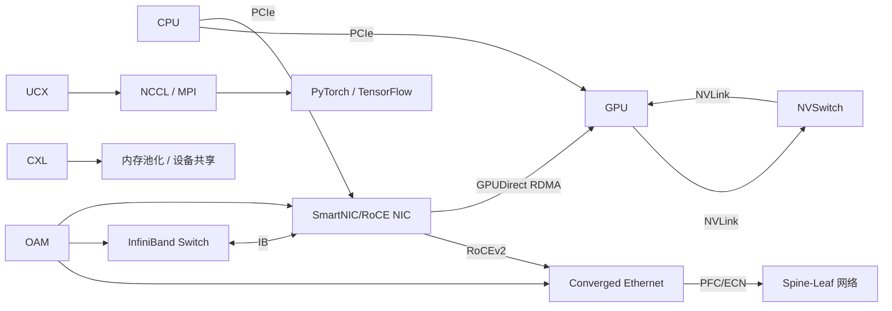

[(99+ 封私信 / 81 条消息) 大模型训练、推理与AI云平台 - 知乎](https://www.zhihu.com/column/c_1491039346714746880)

https://zhuanlan.zhihu.com/p/1889608936518313253
https://www.zhihu.com/people/han-gu-tao-ke/posts

https://www.zhihu.com/people/void-73-73/posts

NCCL

https://zhuanlan.zhihu.com/p/699178659

[面向智算的高速互联协议对比：UB 2.0 vs. CXL 3.0 vs. NVLink 5.0](https://mp.weixin.qq.com/s/QHPQYB3pnla51Iu28zX60g)

[AI网络架构洞察：2028年的Scale-Up和Scale-Out网络](https://mp.weixin.qq.com/s/Rk4LZ6r6nxK9L90NpZxYXQ)

# HPC 关键网络互联技术

在 **高性能计算（HPC）、云计算、AI 训练** 场景中，所有关键的**网络与互联技术**

我们将从**物理层到应用层**，按“**层级结构 + 功能分类**”进行组织，并清晰地解释各项技术之间的**关联与演进逻辑**。

---

## 🧱 一、整体架构层级图（从内到外）

```
+---------------------------------------------------------+
|                    应用层（Application）                  |
|  AI训练（PyTorch DDP, Horovod）、HPC MPI、存储系统等     |
+----------------------+----------------------------------+
                       |
           +-----------v------------+     +------------------+
           |     通信框架/库层       |<--->| RDMA 编程接口     |
           | (UCX, libibverbs, MPI)  |     | (Verbs, RDMA CM)  |
           +-----------+------------+     +------------------+
                       |
        +--------------v---------------+  +------------------+
        |     传输协议层（Transport）   |  | TCP/IP, UDP      |
        | RDMA (RoCEv2, InfiniBand)     |  | iWARP, SCTP       |
        +--------------+---------------+  +------------------+
                       |
        +--------------v---------------+
        |     网络层（Network Layer）   |
        | IP Routing (RoCEv2), IB Subnet|
        +--------------+---------------+
                       |
        +--------------v---------------+
        |  数据链路层（Data Link Layer）|
        | Ethernet (PFC/ECN), InfiniBand |
        | (Reliable/Unreliable VCs)      |
        +--------------+---------------+
                       |
        +--------------v---------------+
        |     物理层（Physical Layer）  |
        |  Cable, Optical, DAC, AOC     |
        +--------------+---------------+
                       |
        +--------------v---------------+
        |      互连总线（Internal Bus） |
        | PCIe, NVLink, CXL, UCIe       |
        +------------------------------+
```

下面我们按**功能模块 + 层级**详细展开。

---

## 📌 二、分层详解：HPC/AI/云计算中的网络与互联技术

---

### 🔹 1. **内部互连总线（On-Node Interconnects）**

这是**单台服务器内部**的高速互联技术，决定 CPU、GPU、内存、加速器之间的通信效率。

#### ✅ 1.1 **PCIe（Peripheral Component Interconnect Express）**

- **作用**：通用高速串行总线，连接 CPU 与外设（GPU、SSD、网卡）。
- **版本演进**：
  - PCIe 3.0 → 4.0 → 5.0 → 6.0
  - 带宽翻倍：x16 插槽，PCIe 5.0 ≈ 64 GB/s 双向
- **局限**：共享总线结构，带宽有限，不适合 GPU 间高频通信。

#### ✅ 1.2 **NVLink（NVIDIA）**

- **作用**：NVIDIA 开发的**GPU 间高速互联技术**，远超 PCIe 带宽。
- **特点**：
  - 点对点直连，带宽可达 900 GB/s（NVLink 4.0）
  - 支持 GPU 内存共享（如 NVSwitch 架构）
- **应用场景**：DGX 服务器、AI 大模型训练
- **与 PCIe 关系**：NVLink 是 PCIe 的**高性能替代/补充**，用于 GPU 集群内部。

#### ✅ 1.3 **CXL（Compute Express Link）**

- **作用**：基于 PCIe 物理层的**缓存一致性互联协议**，支持内存池化、设备共享。
- **三种模式**：
  - CXL.io（类似 PCIe）
  - CXL.cache（CPU 可缓存设备内存）
  - CXL.mem（设备可访问主机内存）
- **目标**：实现 CPU 与加速器（GPU/FPGA/智能网卡）的**内存统一视图**
- **应用场景**：云计算资源池化、AI 推理、内存扩展

#### ✅ 1.4 **UCIe（Universal Chiplet Interconnect Express）**

- **作用**：芯片级互联标准，用于封装内多个“芯粒（Chiplet）”之间的高速通信。
- **目标**：打破单芯片尺寸限制，构建异构计算系统
- **与 PCIe/NVLink 关系**：更底层，用于芯片封装内部，不直接暴露给用户。

> 🔗 **关联总结**：
> - PCIe 是通用基础
> - NVLink 专为 GPU 加速
> - CXL 实现内存一致性
> - UCIe 是芯片级互联

---

### 🔹 2. **远程直接内存访问（RDMA）技术栈**

这是**跨节点通信**的核心技术，实现低延迟、高吞吐、低 CPU 开销。

#### ✅ 2.1 **RDMA（Remote Direct Memory Access）**

- **本质**：一种通信语义，允许**网卡直接读写远程内存**，无需 CPU 和内核参与。
- **优势**：
  - 微秒级延迟
  - 零拷贝
  - CPU 开销极低（<5%）
- **依赖**：需要专用硬件（支持 RDMA 的网卡）和网络协议。

#### ✅ 2.2 **RDMA 的三种实现方式**

| 协议                  | 全称                               | 基于网络     | 特点                           |
| ------------------- | -------------------------------- | -------- | ---------------------------- |
| **InfiniBand (IB)** | 原生 RDMA 协议                       | 专用 IB 网络 | 原生支持 RDMA、QoS、拥塞控制，性能最强      |
| **RoCE**            | RDMA over Converged Ethernet     | 以太网      | RoCEv1（二层）、RoCEv2（UDP/IP 三层） |
| **iWARP**           | Internet Wide Area RDMA Protocol | 以太网      | 基于 TCP，兼容性好，但延迟较高，较少用        |

> 🔗 **RoCEv2 是当前主流**：在标准以太网上实现 RDMA，结合 PFC/ECN 实现无损网络。

---

### 🔹 3. **网络协议与传输层技术**

#### ✅ 3.1 **Converged Ethernet（融合以太网）**

- **定义**：支持多种流量（数据、存储、RDMA）的以太网。
- **关键技术**：
  - **PFC（Priority Flow Control）**：基于优先级的流控，防止 RoCE 丢包
  - **ECN（Explicit Congestion Notification）**：拥塞通知，用于 RoCE 拥塞控制
  - **DCB（Data Center Bridging）**：IEEE 标准套件，支持 PFC、ECN 等
- **目标**：让以太网具备“无损”特性，支持 RoCE

#### ✅ 3.2 **RoCEv2（RDMA Over UDP/IP）**

- **封装方式**：InfiniBand 帧 → UDP → IP → Ethernet
- **端口**：UDP 4791
- **优势**：支持跨子网路由，适合大规模部署
- **依赖**：必须部署 PFC + ECN + DCQCN（拥塞控制算法）

#### ✅ 3.3 **InfiniBand（IB）协议栈**

- **原生支持**：RDMA、多路径、服务质量（SL）、子网管理（SM）
- **传输类型**：
  - RC（可靠连接）
  - UC（不可靠连接）
  - UD（不可靠数据报）
- **优势**：协议简单、延迟极低、拥塞控制完善
- **劣势**：生态封闭、成本高、需专用交换机

---

### 🔹 4. **GPU 直连与加速技术（GPU Direct）**

#### ✅ 4.1 **GPUDirect RDMA（GDR）**

- **作用**：允许 RDMA 网卡（如 Mellanox）**直接访问 GPU 显存**，避免 CPU 和系统内存中转。
- **流程**：
  1. GPU 显存注册为“可直接访问”
  2. RDMA 网卡通过 PCIe 直接读写显存
- **效果**：减少两次内存拷贝，延迟降低 30%+，带宽提升

#### ✅ 4.2 **GPUDirect Storage（GDS）**

- **作用**：GPU 直接访问 NVMe SSD，用于 AI 数据加载
- **依赖**：支持 GPUDirect 的 SSD 和驱动

#### ✅ 4.3 **NVSwitch / NVLink Switching (NVLS)**

- **作用**：通过 NVSwitch 芯片，实现多 GPU 全互连（全连接拓扑）
- **应用场景**：NVIDIA DGX A100/H100，8 GPU 全互联，带宽高达 600 GB/s

> 🔗 **GDR + NVLink + RoCE/IB = 完整的 GPU-to-GPU over Network 方案**

---

### 🔹 5. **通信编程接口与运行时库**

#### ✅ 5.1 **Verbs API（libibverbs）**

- **作用**：InfiniBand/RoCE 的底层编程接口
- **特点**：复杂但性能极致，常用于高性能 MPI 实现

#### ✅ 5.2 **UCX（Unified Communication X）**

- **作用**：开源通信框架，统一支持：
  - RDMA（IB/RoCE）
  - TCP/IP
  - shared memory
  - CUDA IPC
- **优势**：自动选择最优路径，广泛用于 AI 框架（如 PyTorch、Horovod）

#### ✅ 5.3 **MPI（Message Passing Interface）**

- **作用**：HPC 标准通信库，支持点对点、集合通信（AllReduce、Broadcast）
- **实现**：
  - OpenMPI、MVAPICH2、Intel MPI
  - 后端可使用 IB、RoCE、TCP

#### ✅ 5.4 **NCCL（NVIDIA Collective Communications Library）**

- **作用**：专为 NVIDIA GPU 设计的集合通信库，优化 AllReduce、AllGather 等操作
- **特点**：
  - 自动使用 NVLink、PCIe、RoCE/IB 多路径
  - 支持 Ring、Tree 等通信拓扑
- **应用**：PyTorch DDP、TensorFlow MirroredStrategy

---

### 🔹 6. **网络运维与管理（OAM）**

#### ✅ 6.1 **OAM（Operations, Administration & Maintenance）**

- **作用**：监控、诊断、维护 RDMA/IB/RoCE 网络
- **工具**：
  - `ibstat`, `iblinkinfo`（InfiniBand）
  - `rdma` 命令（RoCE）
  - `ethtool -S`（以太网统计）
- **功能**：
  - 链路质量检测
  - 丢包、重传、拥塞监控
  - QoS 配置

#### ✅ 6.2 **Telemetry & Observability**

- 如 NVIDIA UFM、Mellanox Onyx、Prometheus + Grafana
- 实时监控 RoCE 拥塞、PFC pause 帧、ECN 标记等

---

### 🔹 7. **前沿与补充技术**

#### ✅ 7.1 **OCS（Optical Circuit Switching）**

- **作用**：光电路交换，用于动态重构数据中心拓扑
- **优势**：低延迟、高带宽、节能
- **应用**：AI 训练中动态调整通信拓扑

#### ✅ 7.2 **DPU / SmartNIC**

- **作用**：卸载网络、存储、安全任务
- **支持**：RoCE、GDR、CXL、OVS 加速
- **厂商**：NVIDIA (BlueField), Intel (IPU), AWS (Nitro)

#### ✅ 7.3 **SR-IOV / VFIO**

- **虚拟化技术**：让虚拟机直接访问网卡硬件，降低虚拟化开销
- **用于**：云环境中提供高性能 RDMA 服务

---

## 🔄 三、技术关联与生态图谱



---

## ✅ 四、典型场景技术选型建议

| 场景 | 推荐技术组合 |
|------|---------------|
| **AI 大模型训练（千卡级）** | RoCEv2 + PFC/ECN + NVLink + NCCL + UCX + GDR |
| **超算中心 / HPC** | InfiniBand + MPI + Slurm + IB Subnet Manager |
| **云服务商高性能实例** | RoCE + DPU + SR-IOV + CXL 内存扩展 |
| **AI 推理 / 低延迟交易** | CXL + PCIe 5.0 + RoCE + 用户态协议栈 |
| **前沿研究 / 动态拓扑** | OCS + RoCE + 可编程交换机 |

---

## 📚 总结：核心逻辑链

> **目标：降低通信开销，提升计算效率**

1. **单节点内**：用 **PCIe → NVLink → CXL** 提升 GPU/内存互联带宽
2. **跨节点通信**：用 **RDMA（RoCE/IB）** 替代 TCP，实现零拷贝、低延迟
3. **GPU 直连**：用 **GDR** 避免内存拷贝
4. **通信优化**：用 **NCCL/UCX/MPI** 实现高效集合通信
5. **网络保障**：用 **PFC/ECN/OAM** 构建无损以太网
6. **未来趋势**：**CXL、DPU、OCS、UCIe** 推动“内存池化”和“解耦架构”

https://mp.weixin.qq.com/s/klvPhCv1boETZOqDkBiP2g

https://www.chaspark.com/#/hotspots/1188900699634163712

# GPU 通信方式概述

GPU 中涉及的各种通信方式和技术可以大致分为**硬件互连（物理层）**、**网络通信协议**和**软件通信库/编程模型**三大类。

---

## 一、 硬件互连（物理连接）

这些是 GPU 之间或 GPU 与 CPU 之间进行高速数据传输的物理通道。

1. **PCIe (Peripheral Component Interconnect Express)**
    
    - **作用**：这是最通用的计算机内部总线标准，用于连接 CPU、GPU、网卡、SSD 等高速外设。在 GPU 计算中，它负责连接 CPU 内存和 GPU 显存。
    - **特点**：
        - **通用性强**：几乎所有服务器和 PC 都支持。
        - **带宽有限**：相比专用互联技术，带宽较低（例如 PCIe 4.0 x16 ≈ 32 GB/s，PCIe 5.0 x16 ≈ 64 GB/s）。
        - **延迟较高**：相比 NVLink 等，延迟更高。
        - **拓扑**：通常是树状结构，CPU 是根节点，GPU 挂在 CPU 的 PCIe 控制器下。多 GPU 之间的通信通常需要经过 CPU 内存中转（Host Memory Relay），效率较低。
    - **应用场景**：单 GPU 与 CPU 通信、多 GPU 训练中跨节点通信（通过网卡）、成本敏感或通用性要求高的场景。
2. **NVLink (NVIDIA)**
    
    - **作用**：NVIDIA 开发的高速、高带宽、低延迟的专用互连技术，用于直接连接 GPU 与 GPU、GPU 与 CPU（特定平台如 Grace Hopper）。
    - **特点**：
        - **高带宽**：远超 PCIe（例如 NVLink 4.0 可达 50 GB/s per link，多链路聚合带宽极高）。
        - **低延迟**：比 PCIe 低得多。
        - **直接 GPU-to-GPU**：允许 GPU 显存之间直接访问（P2P, Peer-to-Peer），无需经过 CPU 内存，极大提升多 GPU 通信效率。
        - **可扩展性**：支持复杂的拓扑（如全连接、环形、Mesh）。
    - **应用场景**：高性能计算（HPC）、大规模 AI 模型训练（如 LLM），特别是在单个服务器内多 GPU（如 8 卡 DGX）的场景下，是提升训练速度的关键。
3. **Infinity Fabric (AMD)**
    
    - **作用**：AMD 开发的片上/片间互连架构，类似于 Intel 的 UPI 和 NVIDIA 的 NVLink。在 AMD GPU（特别是 Instinct 系列）和 CPU（EPYC）中用于实现高速互联。
    - **特点**：
        - **统一架构**：不仅用于 CPU-GPU、GPU-GPU 互联，也用于 CPU 核心、内存控制器、I/O 等内部组件的连接。
        - **高带宽低延迟**：提供比 PCIe 更高的带宽和更低的延迟。
        - **Coherent**：支持缓存一致性，简化编程模型。
    - **应用场景**：AMD Instinct GPU（如 MI200, MI300 系列）的多 GPU 系统，实现类似 NVLink 的高效通信。

---

## 二、 网络通信协议（跨节点通信）

当训练或计算任务需要跨越多个服务器（节点）时，节点间的 GPU 需要通过网络进行通信。

4. **以太网 (Ethernet)**
    
    - **作用**：最广泛使用的局域网技术。
    - **特点**：
        - **普及度高**：基础设施成熟，成本相对较低。
        - **带宽和延迟**：传统 TCP/IP 以太网开销大，延迟高，不适合高性能计算。但现代高速以太网（25G, 100G, 200G, 400G）结合**RoCE**可以达到高性能。
    - **应用场景**：通用网络通信，结合 RoCE 用于高性能计算。
5. **InfiniBand (IB)**
    
    - **作用**：专为高性能计算和数据中心设计的网络互连技术。
    - **特点**：
        - **超高带宽**：支持极高的数据传输速率（HDR 200G, NDR 400G）。
        - **超低延迟**：硬件级的低延迟通信。
        - **高消息率**：每秒可处理大量小消息。
        - **支持 RDMA**：原生支持远程直接内存访问，绕过操作系统内核，降低 CPU 开销和延迟。
        - **拥塞控制**：先进的拥塞控制机制。
    - **应用场景**：顶级 HPC 集群、AI 超算中心（如 NVIDIA DGX SuperPOD）、对网络性能要求极高的场景。
6. **RoCE (RDMA over Converged Ethernet)**
    
    - **作用**：在标准以太网上实现 RDMA 功能的技术。分为 RoCE v1（链路层）和 RoCE v2（网络层，基于 UDP/IP）。
    - **特点**：
        - **利用现有以太网**：可以在标准以太网基础设施上实现类似 InfiniBand 的 RDMA 性能。
        - **高性能**：提供低延迟、高带宽、低 CPU 开销的通信。
        - **成本**：相比 InfiniBand，通常成本更低，更易于部署和管理。
        - **要求**：需要支持 RoCE 的网卡（如 Mellanox ConnectX 系列）和交换机（最好支持 PFC/ECN 等流控以实现无损网络）。
    - **应用场景**：追求高性能但希望利用以太网生态和降低成本的数据中心、AI 集群。
7. **GDR (GPU Direct RDMA)**
    
    - **作用**：**不是独立的通信协议，而是一项关键技术**。它允许支持 RDMA 的网络适配器（如 InfiniBand HCA 或 RoCE 网卡）**直接访问 GPU 的显存**，而无需将数据先拷贝到 CPU 内存。
    - **特点**：
        - **消除数据拷贝**：避免了 CPU 内存作为中转站的瓶颈，显著降低延迟和 CPU 开销。
        - **提升吞吐量**：直接访问显存，提高有效带宽。
        - **依赖**：需要 GPU 驱动、网卡驱动和网络协议（IB/RoCE）的协同支持。
    - **应用场景**：所有使用 InfiniBand 或 RoCE 进行跨节点 GPU 通信的高性能 AI/HPC 应用，是实现高效 AllReduce 等操作的基础。

---

## 三、 软件通信库与编程模型

这些是构建在底层硬件和协议之上的软件层，为开发者提供高效的通信原语和编程接口。

8. **IPC (Inter-Process Communication)**
    
    - **作用**：广义上指进程间通信机制。在 GPU 上下文中，特指**同一台机器内，不同进程中的 GPU 上下文之间**的通信。
    - **技术**：NVIDIA 提供了**CUDA IPC** API，允许一个进程将 GPU 内存句柄（handle）传递给另一个进程，后者可以直接映射并访问该内存。
    - **特点**：高效，低开销，适用于同一节点内多进程协作（如多进程数据加载、模型并行）。
    - **注意**：这里的 IPC 通常指 CUDA IPC，而不是通用的管道、消息队列等。
9. **NCCL (NVIDIA Collective Communications Library)**
    
    - **作用**：NVIDIA 开发的**库**，专门用于优化多 GPU、多节点环境下的**集体通信操作**。
    - **核心操作**：`AllReduce`, `AllGather`, `ReduceScatter`, `Broadcast`, `Reduce` 等。这些是分布式训练（如数据并行）的核心。
    - **特点**：
        - **高度优化**：自动选择最优算法和通信路径（利用 PCIe, NVLink, IB/RoCE）。
        - **透明性**：对开发者屏蔽底层复杂性。
        - **高性能**：针对 NVIDIA GPU 和互联技术深度优化。
        - **广泛支持**：被 PyTorch, TensorFlow 等主流框架集成。
    - **应用场景**：几乎所有使用 NVIDIA GPU 进行分布式训练的应用。
10. **NVSHMEM / SHMEM**
    
    - **作用**：**编程模型和库**。`SHMEM` 是一个并行编程模型，`NVSHMEM` 是 NVIDIA 基于 SHMEM 标准为 GPU 优化的实现。
    - **特点**：
        - **PGAS (Partitioned Global Address Space)**：提供全局地址空间视图，允许一个 PE（Processing Element，通常是一个 GPU 或 GPU 上的一个线程块）直接读写另一个 PE 的内存（显存）。
        - **低开销**：设计目标是提供极低开销的点对点和集体通信。
        - **灵活性**：适合实现复杂的并行算法（如图计算、不规则通信模式）。
        - **对比 NCCL**：NCCL 专注于高效的集体操作；NVSHMEM 提供更底层的、灵活的点对点和同步原语，适合需要精细控制通信的场景。
    - **应用场景**：高性能计算、需要细粒度通信控制的分布式应用。

---

## 总结与关系图

- **物理层**：`PCIe`, `NVLink`, `Infinity Fabric` 负责**单节点内**的高速互联。
- **网络层**：`以太网`, `InfiniBand`, `RoCE` 负责**跨节点**的连接。`GDR` 是关键使能技术，让网络直接访问 GPU 显存。
- **软件层**：
    - `IPC` 用于单节点内多进程 GPU 通信。
    - `NCCL` 是最常用的集体通信库，利用底层所有互连技术（NVLink, IB, RoCE + GDR）实现高效通信。
    - `NVSHMEM` 提供更灵活的 PGAS 编程模型和底层通信原语。

**简单来说**：现代大规模 AI 训练通常在一个节点内使用 **NVLink** 连接多块 GPU，在多个节点之间使用 **InfiniBand** 或 **RoCE** 网络，并通过 **GDR** 实现网络到 GPU 显存的直接访问，最终由 **NCCL** 库来执行高效的集体通信操作（如 AllReduce），整个程序遵循 **SPMD** 范式。

# 通信硬件支持

要理解 `NVLink`、`RDMA`、`InfiniBand` 以及它们与 `MPI`、`NCCL` 在多 GPU 通信中的关联，需要从**硬件互连**和**软件通信库**两个层面梳理：

## 一、基础概念：NVLink、RDMA、InfiniBand

三者均属于**底层硬件 / 协议技术**，用于解决 “不同设备（GPU/CPU）或不同节点（服务器）之间如何高效传输数据” 的问题。

### 1. NVLink

- **定义**：NVIDIA 推出的**专有高速互连技术**，用于 GPU 之间、GPU 与 CPU 之间的直接连接（替代或补充传统的 PCIe 总线）。
- **特点**：
- 高带宽（单链路带宽可达 50+ GB/s，远高于 PCIe 4.0 的 32 GB/s）、低延迟。
- 支持多 GPU 直接通信（如同一服务器内的 8 张 A100 GPU 可通过 NVLink 形成全连接拓扑）。
- **适用场景**：同一服务器内的多 GPU 通信（如单机 8 卡训练、多卡协同计算）。

### 2. RDMA（Remote Direct Memory Access，远程直接内存访问）

- **定义**：一种**网络传输协议**，允许一台计算机直接访问另一台计算机的内存，无需经过 CPU 干预（传统网络传输需要 CPU 处理数据拷贝和协议解析）。
- **特点**：
- 极低延迟（跳过 CPU 中间环节）、高带宽、低 CPU 占用。
- 需硬件支持（如 InfiniBand 网卡、RoCE 协议的以太网网卡）。
- **适用场景**：跨服务器（节点）的数据传输（如集群中不同机器的 GPU/CPU 通信）。

### 3. InfiniBand

- **定义**：一种**高性能网络技术**（物理层 + 协议层），是 RDMA 最典型的载体（支持 RDMA 协议），常用于超算集群和数据中心。
- **特点**：
- 支持 RDMA 传输，单端口带宽可达 400+ Gb/s，延迟低至微秒级。
- 采用 “通道适配器”（HCA，Host Channel Adapter）替代传统网卡，直接与内存交互。
- **适用场景**：跨节点（服务器）的高速通信，是大规模 GPU 集群（如多机多卡训练）的核心网络技术。

## 二、与 MPI、NCCL 的关联：软件库如何利用底层硬件

`MPI` 和 `NCCL` 是**软件层的通信库**，它们本身不直接实现硬件传输，而是通过调用底层硬件 / 协议（NVLink、RDMA/InfiniBand 等）提供的接口，实现多 GPU / 多节点的高效通信。

### 1. MPI（Message Passing Interface）

- **定位**：通用的并行计算通信标准，支持 CPU 之间、GPU 之间、跨节点的消息传递，适用于几乎所有并行计算场景（不限于 GPU）。
- **与底层技术的关联**：
- 当跨节点通信时，MPI 可通过 `MPI_RDMA` 接口利用 InfiniBand 的 RDMA 功能，实现高效数据传输。
- 在单节点多 GPU 场景，MPI 可通过 PCIe 或 NVLink 实现 GPU 间通信（但对 GPU 协同的优化不如 NCCL 深入）。
- **典型用途**：科学计算、分布式仿真等通用并行任务，也可用于多机多卡 GPU 通信（如深度学习中的分布式训练）。

### 2. NCCL（NVIDIA Collective Communications Library）

- **定位**：NVIDIA 专为 GPU 设计的**集合通信库**（支持 all-reduce、broadcast、reduce 等集合操作），深度优化了 GPU 间的协同通信。
- **与底层技术的关联**：
- **单节点内**：优先使用 NVLink（若有）进行多 GPU 通信，若无则降级到 PCIe，充分利用高带宽互连。
- **跨节点**：通过 `NCCL Net` 接口适配 InfiniBand（利用 RDMA）或以太网（如 RoCE），将 GPU 数据直接通过网络传输（无需 CPU 中转）。
- **典型用途**：深度学习分布式训练（如 PyTorch、TensorFlow 的多卡通信后端），比 MPI 更适合 GPU 密集型场景。

## 三、总结：从底层到上层的通信栈

多 GPU 通信的完整链路是：

```plaintext
应用层（如分布式训练框架） → 通信库（MPI/NCCL） → 底层技术（NVLink/RDMA/InfiniBand） → 硬件（GPU/网卡）
```

- **NVLink**：解决 “单机多 GPU 内部” 的高速互连，被 NCCL 优先采用。
- **RDMA/InfiniBand**：解决 “跨节点（服务器）” 的高速通信，MPI 和 NCCL 均会利用其降低延迟和提升带宽。
- **MPI**：通用通信标准，适配多种底层技术，适用范围广。
- **NCCL**：GPU 专用库，对 NVLink 和 RDMA/InfiniBand 的优化更极致，在深度学习等 GPU 场景性能更优。

简言之，底层技术（NVLink、InfiniBand+RDMA）是 “高速公路”，MPI 和 NCCL 是 “高效跑车”，前者决定通信的物理上限，后者决定软件层的利用效率。

# MPI/NCCL/NVSHMEM

MPI、NCCL 和 NVSHMEM 是三种不同的通信库，分别针对不同的应用场景和硬件架构进行优化。以下是它们的核心区别总结：

---

## 对比

| **特性**     | **MPI**                                   | **NCCL**                              | **NVSHMEM**                        |
| ---------- | ----------------------------------------- | ------------------------------------- | ---------------------------------- |
| **通信模型**   | **基于 CPU 的同步通信**                          | **基于 GPU 的集合通信**                      | **异步、GPU 发起的通信**                   |
| **数据传输路径** | 需要 CPU 参与（GPU <-> CPU <-> Network）        | 尽量绕过 CPU（GPU <-> GPU via NVLink/PCIe） | 直接 GPU 到 GPU（通过 NVLink/NVSwitch）   |
| **同步机制**   | 显式同步（如 `MPI_Barrier`）                     | 自动同步（集合操作内部处理）                        | 异步通信（减少 CPU-GPU 同步开销）              |
| **编程复杂度**  | 高（需手动管理同步和内存拷贝）                           | 中（集合操作封装复杂性）                          | 低（对称内存访问简化编程）                      |
| **硬件依赖**   | 通用（支持多种网络和硬件）                             | NVIDIA GPU + NVLink/PCIe              | NVIDIA GPU + NVLink/NVSwitch       |
| **带宽**     | 受限于 CPU 和网络（如 InfiniBand）                 | 最大化 GPU 间带宽（NVLink）                   | 接近 NVLink 峰值（500GB/s+）             |
| **延迟**     | 较高（需 CPU 拷贝）                              | 低（直接 GPU 通信）                          | 极低（异步通信 + 对称内存）                    |
| **扩展性**    | 支持大规模分布式系统                                | 适合单节点多 GPU 和多节点 GPU                   | 适合 NVLink/NVSwitch 集群              |
| **接口语言**   | C/C++/Fortran/Python                      | C/C++                                 | C/C++                              |
| **API 类型** | 点对点 + 集合通信（如 `MPI_Send`, `MPI_AllReduce`） | 集合通信（如 `ncclAllReduce`）               | 对称内存访问（如 `shmem_get`, `shmem_put`） |
| **与框架兼容性** | 通用（支持 PyTorch/TensorFlow）                 | 深度集成（PyTorch/TensorFlow）              | 专为 GPU 集群优化（需适配）                   |

- **MPI** 是 **通用通信标准**，适合所有并行计算场景，但需要 CPU 参与。
- **NCCL** 是 **GPU 专用通信库**，专为深度学习优化，利用 NVLink/P2P 提升性能。
- **NVSHMEM** 是 **GPU 高性能通信库**，通过异步和对称内存访问，进一步降低延迟和 CPU 开销。

在实际应用中，选择哪个库取决于硬件架构（如是否支持 NVLink）和任务类型（科学计算 vs 深度学习）。

---

## 典型工作流程

- **MPI**：

  ```c
  // 示例：跨节点的 AllReduce
  MPI_Init(&argc, &argv);
  MPI_Comm_rank(MPI_COMM_WORLD, &rank);
  MPI_Allreduce(sendbuf, recvbuf, count, MPI_FLOAT, MPI_SUM, MPI_COMM_WORLD);
  MPI_Finalize();
  ```

  - **缺点**：需将数据从 GPU 显存拷贝到 CPU 内存，再通过网络传输。
- **NCCL**：

  ```cpp
  // 示例：多 GPU AllReduce
  ncclInit(&comm);
  ncclAllReduce(sendbuff, recvbuff, count, ncclFloat, ncclSum, comm, stream);
  cudaStreamSynchronize(stream);
  ```

  - **优点**：直接在 GPU 间通信（NVLink/P2P），无需 CPU 参与。
- **NVSHMEM**：

  ```c
  // 示例：对称内存访问
  int *data = shmem_malloc(size);  // 全局共享内存
  shmem_int_put(data, local_data, size, target_pe);  // GPU 到 GPU 直接传输
  shmem_quiet();  // 异步完成检查
  ```

  - **优点**：无需 CPU 同步，GPU 可直接读写其他 GPU 的内存。

- **实际应用中的协同**
	  - **MPI + NCCL**：在分布式训练中，MPI 负责节点间通信（如 TCP/IP/InfiniBand），NCCL 负责节点内 GPU 通信（如 AllReduce）。
	  - **NVSHMEM + NCCL**：在 NVLink 集群中，NVSHMEM 可替代 NCCL 实现更高效的节点内通信，而 NCCL 仍用于节点间通信（如 RoCE/IB）。

---

# 单卡 NCCL

即使只有单张 GPU，仍然可以学习和使用 NCCL（NVIDIA Collective Communications Library）的核心编程逻辑和 API，只是无法真正体验多 GPU 间的通信场景。以下是具体说明和学习建议：

1. 单卡环境下 NCCL 的可用性

- **支持运行**：NCCL 可以在单卡环境中安装和运行，其库本身不强制要求多 GPU。
- **限制**：单卡无法进行跨 GPU 的通信（如 `ncclAllReduce`、`ncclBroadcast` 等操作本质上是 “自通信”，数据不会离开当前 GPU），但这并不影响对 NCCL 编程模型、API 用法和初始化流程的学习。

2. 单卡学习 NCCL 的核心目标

虽然无法测试多 GPU 通信性能，但可以掌握 NCCL 的核心知识点：

- **初始化流程**：如何创建 `ncclComm_t` 通信器、初始化 NCCL 环境（`ncclInitRank`）。
- **API 用法**：学习 `ncclAllReduce`、`ncclBcast`、`ncclReduce` 等核心通信函数的参数含义和调用方式。
- **错误处理**：理解 NCCL 的错误码（如 `ncclSuccess`、`ncclInvalidArgument`）及调试方法。
- **与 CUDA 的配合**：如何在 CUDA 核函数与 NCCL 通信之间同步（如 `cudaStreamSynchronize`）。

如果想模拟多 GPU 通信（如 2 个 “虚拟 GPU”），可以在单卡上通过**多进程**实现（利用同一 GPU 的不同内存区域模拟多卡）：

- 使用 `mpirun` 或 `pthread` 创建多个进程，每个进程绑定到同一 GPU 的不同流。
- 进程间通过 NCCL 通信器交换数据（实际仍在单卡内存中传输，但代码逻辑与多卡一致）。
