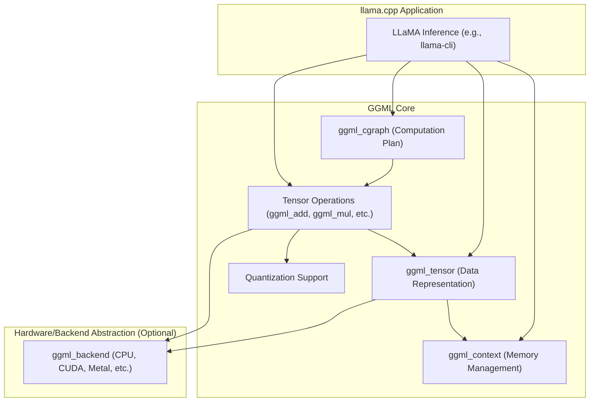
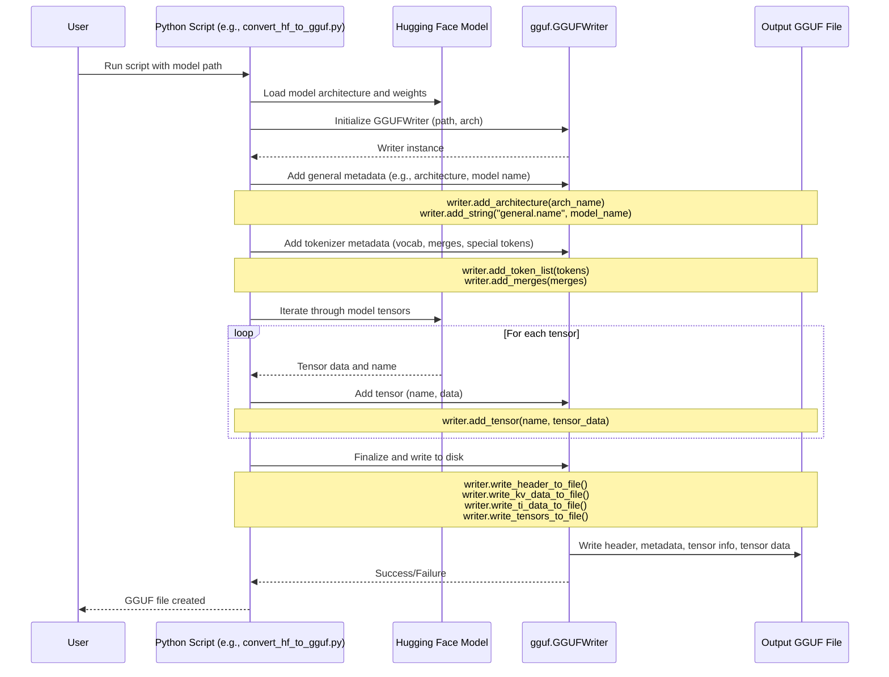

# 张量库

## GGML

GGML 张量库是一个为机器学习任务设计的极简 C 语言库。它提供了一套张量操作、自动微分和基础优化算法。GGML 旨在简化各种机器学习模型的实现，包括线性回归、支持向量机和神经网络。

### 核心概念

该库围绕**计算图**的概念构建。用户使用可用的张量操作定义一个函数，这个定义在内部表示为一个图，其中每个操作都是一个节点。然后，这个图可以用来计算函数的值及其相对于输入变量的梯度。

**主要特点：**

- **内存管理：** GGML 要求用户预先分配一个内存缓冲区。然后在此缓冲区内分配张量。这种方法避免了运行时内存分配的开销。
- **延迟计算：** 操作定义了图的结构，但不会立即执行计算。实际的计算发生在调用 `ggml_graph_compute_with_ctx()`（或类似函数）时。
- **输入变量：** 可以使用 `ggml_set_param()` 将张量标记为输入变量。这对于自动微分和优化至关重要。
- **多维张量：** 支持最多 4 维张量。
- **数据类型：** 主要关注 FP16 和 FP32，并可能扩展到其他类型。
- **前向和后向传播：** 每个张量操作都有相应的前向（计算输出）和后向（计算梯度的伴随）计算函数。

### ggml_tensor 结构

GGML 中的基本数据结构是 `struct ggml_tensor`。它包含有关张量的信息，包括：

- **维度 (`ne`)**：每个维度中元素的数量。
- **步幅 (`nb`)**：在每个维度中跳转到下一个元素所需的字节数。这允许非连续的内存布局，对于转置等操作很有用。
- **数据类型 (`type`)**：张量元素的数据类型（例如 `GGML_TYPE_F32`、`GGML_TYPE_F16`）。
- **数据指针 (`data`)**：一个指向内存中实际张量数据的 `void*` 指针。
- **源张量 (`src[0]`, `src[1]`)**：指向用于计算当前张量的输入张量的指针。这构成了计算图中的连接。
- **操作 (`op`)**：产生此张量的操作。

```c
    // n-dimensional tensor
    struct ggml_tensor {
        enum ggml_type type;
        struct ggml_backend_buffer * buffer;
        int64_t ne[GGML_MAX_DIMS]; // number of elements
        size_t  nb[GGML_MAX_DIMS]; // stride in bytes:
                                   // nb[0] = ggml_type_size(type)
                                   // nb[1] = nb[0]   * (ne[0] / ggml_blck_size(type)) + padding
                                   // nb[i] = nb[i-1] * ne[i-1]
        // compute data
        enum ggml_op op;
        // op params - allocated as int32_t for alignment
        int32_t op_params[GGML_MAX_OP_PARAMS / sizeof(int32_t)];
        int32_t flags;
        struct ggml_tensor * src[GGML_MAX_SRC];
        // source tensor and offset for views
        struct ggml_tensor * view_src;
        size_t               view_offs;
        void * data;
        char name[GGML_MAX_NAME];
        void * extra; // extra things e.g. for ggml-cuda.cu
        char padding[8];
    };

```

张量以行主序存储。

### 初始化和上下文

在执行任何张量操作之前，必须初始化一个 GGML 上下文。此上下文管理所有张量和图对象的内存分配。

```c
// ggml/include/ggml.h
// Relevant parts of ggml_init_params and function declaration
struct ggml_init_params {
    size_t mem_size;   // Size of the memory buffer to allocate
    void * mem_buffer; // Optional: pre-allocated buffer, if NULL, ggml_init will allocate
    // ... other fields ...
};

// Initialize a GGML context
// Memory allocation for the context and the main memory buffer happens here
struct ggml_context * ggml_init(struct ggml_init_params params);
```

### 定义计算图

计算图是通过创建张量并对其应用操作来构建的。

**张量创建：** 像 `ggml_new_tensor_1d`、`ggml_new_tensor_2d` 等函数用于在已初始化的上下文中分配新张量。

```c
// ggml/include/ggml.h
// Example tensor creation functions
struct ggml_tensor * ggml_new_tensor_1d(
        struct ggml_context * ctx,
        enum   ggml_type      type,
        int64_t ne0);

struct ggml_tensor * ggml_new_tensor_2d(
        struct ggml_context * ctx,
        enum   ggml_type      type,
        int64_t ne0,
        int64_t ne1);
// ... and so on for 3D, 4D
```

**张量操作：** GGML 提供了多种张量操作（例如 `ggml_add`、`ggml_mul`、`ggml_relu`）。每个操作接受一个或多个输入张量，并返回一个新的输出张量。

```c
// ggml/include/ggml.h
// Example tensor operations
struct ggml_tensor * ggml_add(
        struct ggml_context * ctx,
        struct ggml_tensor  * a,
        struct ggml_tensor  * b);

struct ggml_tensor * ggml_mul(
        struct ggml_context * ctx,
        struct ggml_tensor  * a,
        struct ggml_tensor  * b);
```

**示例：定义 f(x) = a*x^2 + b**

```c
// From: ggml/include/ggml.h (lines 38-50) - Conceptual example
#include "ggml.h"

// Assuming ctx is an initialized ggml_context

// Define input variable x
struct ggml_tensor * x = ggml_new_tensor_1d(ctx, GGML_TYPE_F32, 1);
ggml_set_param(ctx, x); // Mark x as an input variable for autograd/optimization

// Define parameters a and b (could also be inputs or constants)
struct ggml_tensor * a = ggml_new_tensor_1d(ctx, GGML_TYPE_F32, 1);
struct ggml_tensor * b = ggml_new_tensor_1d(ctx, GGML_TYPE_F32, 1);

// Define the computation:
// x2 = x * x
struct ggml_tensor * x2 = ggml_mul(ctx, x, x);
// f = (a * x2) + b
struct ggml_tensor * f_output = ggml_add(ctx, ggml_mul(ctx, a, x2), b);

// f_output now represents the result of the function f(x)
// No actual computation has happened yet, only the graph is defined.
```

### 执行计算图

一旦定义了图，就可以执行计算。

1. **创建一个 `ggml_cgraph`（计算图）对象：** 此结构包含计算计划。

	```c
	// ggml/include/ggml.h

struct ggml_cgraph * ggml_new_graph(struct ggml_context * ctx); // Creates an empty graph

// For more complex graphs, there's also ggml_new_graph_custom

	```

	
2. **构建前向传播：** `ggml_build_forward_expand(gf, f)` 从输出张量 `f` 向后遍历到其所有输入，将所有必要的节点添加到 `ggml_cgraph` 对象 `gf` 中。

    ```c
    // ggml/include/ggml.h

void ggml_build_forward_expand(struct ggml_cgraph * cgraph, struct ggml_tensor * tensor);

    ```

    
3. **设置输入值：** 使用像 `ggml_set_f32()` 这样的函数为输入张量和参数赋值。

```c
// ggml/include/ggml.h
// Example for setting a single f32 value in a 1D tensor
void ggml_set_f32_1d(struct ggml_tensor * tensor, int i, float value);
// Simpler alias for 1D tensor with 1 element:
void ggml_set_f32(struct ggml_tensor * tensor, float value);
```

4. **计算图：** `ggml_graph_compute_with_ctx()` 执行图中的操作。

    ```c
    // ggml/include/ggml.h

// Computes the graph.

// The ggml_context contains the memory buffer and other context.

// The ggml_cgraph contains the computation plan.

// n_threads specifies the number of threads for parallel execution.

void ggml_graph_compute_with_ctx(

        struct ggml_context * ctx,

        struct ggml_cgraph  * cgraph,

        int                   n_threads);

    ```

    
    （注意：较旧的 `ggml_graph_compute` 函数（它接受 `ggml_compute_params`）正在被逐步淘汰或由 `ggml_graph_compute_with_ctx` 内部使用）。
    
5. **检索结果：** 使用像 `ggml_get_f32_1d()` 这样的函数从输出张量中获取计算值。

  ```c
  // ggml/include/ggml.h
float ggml_get_f32_1d(const struct ggml_tensor * tensor, int i);
  ```

**示例：计算 x = 2.0 时的 f(x)**

```c
// From: ggml/include/ggml.h (lines 55-70) - Conceptual example
// ... (graph definition from previous example) ...

// Create a computation graph object
struct ggml_cgraph * gf = ggml_new_graph(ctx); // In newer versions, you might use ggml_build_forward directly

// Build the forward pass for the tensor 'f_output'
ggml_build_forward_expand(gf, f_output);

// Set input variable and parameter values
ggml_set_f32(x, 2.0f); // x = 2.0
ggml_set_f32(a, 3.0f); // a = 3.0
ggml_set_f32(b, 4.0f); // b = 4.0

// Execute the graph (e.g., using 4 threads)
int n_threads = 4;
ggml_graph_compute_with_ctx(ctx, gf, n_threads);

// Get the result
float result = ggml_get_f32_1d(f_output, 0);
printf("f(2.0) = %f\\n", result); // Expected: 3.0 * (2.0*2.0) + 4.0 = 16.0
```

### 自动微分

GGML 支持自动微分，这对于训练机器学习模型至关重要。通过使用 `ggml_set_param()` 将张量标记为参数，该库可以计算梯度。

该过程通常包括：

1. 定义前向传播（如上所示）。
2. 使用 `ggml_build_backward_expand()` 构建后向传播。
3. 在现在包含后向操作的图上运行 `ggml_graph_compute_with_ctx()`。
4. 梯度将存储在参数张量的 `.grad` 字段中。

（自动微分的详细解释非常广泛，并且依赖于对 `ggml_build_backward_expand` 以及梯度如何累积的理解，这超出了 `ggml.h` 引言注释的直接内容，但它是一个核心功能。）

### 日志记录

GGML 提供了一个简单的日志记录机制。

- `ggml_log_callback_default`：默认回调函数，将消息打印到 `stderr`。
    - 来源：`ggml/src/ggml.c`，行 `221-225`
- `ggml_log_set()`：允许设置自定义日志记录回调和用户数据。
    - （声明应在 `ggml.h` 中，实现在 `ggml.c` 中）
- `ggml_log_internal()`：库内部用于记录消息。
    - 来源：`ggml/src/ggml.c`，行 `213-218`

```c
// ggml/src/ggml.c (lines 221-225)
void ggml_log_callback_default(enum ggml_log_level level, const char * text, void * user_data) {
    (void) level;
    (void) user_data;
    fputs(text, stderr);
    fflush(stderr);
}

// ggml/include/ggml.h (Conceptual - actual declaration might vary slightly)
// typedef void (*ggml_log_callback)(enum ggml_log_level level, const char * text, void * user_data);
// void ggml_log_set(ggml_log_callback log_callback, void * user_data);
```

### 在 llama.cpp 架构中的作用

GGML 作为 `llama.cpp` 的基础张量计算库。`llama.cpp`（以及其他基于此框架的模型）的核心推理逻辑依赖 GGML 实现以下功能：

1. **模型加载：** 将模型权重表示为 GGML 张量。
2. **计算图定义：** 将神经网络架构（Transformer 层、注意力机制等）定义为 GGML 计算图。
3. **推理执行：** 通过此图执行前向传播以生成词元预测。
4. **量化：** GGML 包含对各种量化方案（例如 Q4_K_M、Q8_0）的广泛支持。张量操作经过优化以处理这些量化类型，从而减少内存占用并可能加快推理速度。量化函数本身（如 `quantize_row_q4_0_reference`）通常位于 `ggml-quants.h` 和 `ggml-quants.c` 中，但由核心 GGML 操作使用。
    - 量化参考：`ggml/src/ggml.c` (第 12 行) 包含了 `ggml-quants.h`。



此图显示主 `llama.cpp` 应用程序使用 GGML 的上下文、张量结构、计算图和操作。这些 GGML 组件反过来可以利用不同的后端（默认为 CPU，或者如果特定 GGML 构建启用并支持，则通过 CUDA/Metal 等专用硬件）。量化是集成到张量操作中的一个关键特性。

### 设置和使用

GGML 通常作为像 `llama.cpp` 这样的大型项目的一部分进行编译。通常不会将 GGML 作为独立库进行单独“安装”，尽管它可以这样构建。

**通用工作流程：**

1. **包含 `ggml.h`**：` #include "ggml.h"`
2. **初始化 `ggml_context`**： `struct ggml_init_params params = { /* ... */ }; struct ggml_context * ctx = ggml_init(params);`
3. **定义张量和图**：使用 `ggml_new_tensor_*` 和操作函数。
4. **创建和构建 `ggml_cgraph`**：`struct ggml_cgraph * cgraph = ggml_new_graph(ctx); ggml_build_forward_expand(cgraph, output_tensor);`
5. **设置输入数据**。
6. **计算图**：

    ```c
    ggml_graph_compute_with_ctx(ctx, cgraph, num_threads);
    ```

7. **检索结果**。
8. **释放上下文**：

    ```c
    ggml_free(ctx);
    ```

`ggml/include/ggml.h`（第 7-100 行）中的引言注释为理解此工作流程提供了一个良好的起点和示例。

### 高级功能（简要概述）

- **优化算法：** GGML 包含基础优化器（例如 ADAM、L-BFGS），可与计算出的梯度一起用于模型训练。
- **后端支持：** GGML 有一个不断发展的后端系统 (`ggml-backend.h`)，以支持在不同硬件上进行计算，如 CPU、GPU (CUDA、Metal、OpenCL、SYCL、Vulkan) 和专用加速器。核心的 `ggml.c` 和 `ggml.h` 定义了通用的张量操作，而特定于后端的实现则在合适的后端激活时处理实际计算。
    - 参考：`ggml/src/ggml.c` (第 7 行) 包含了 `ggml-backend.h`。
- **线程化：** 计算图可以使用多个线程并行执行，在 `ggml_graph_compute_with_ctx` 中指定。
    - 参考：`ggml/src/ggml.c` (第 8 行) 包含了 `ggml-threading.h`。

本概述主要关注 `ggml.h` 所描述的 GGML 基础方面以及 `ggml.c` 中显而易见的一般结构。要深入了解特定操作、量化方法或后端实现，则需要检查它们各自的源文件。

## GGUF

 [GGUF格式](https://zhuanlan.zhihu.com/p/28063135048)

## 文件结构

GGUF 文件具有明确定义的结构，使其易于解析和管理。

**说明：**
1. **头部 (Header)：**
    - **魔数 (Magic Number)：** 一个常量字符串 "GGUF"，用于标识文件类型。
        - 来源：[gguf.hL30](https://github.com/ggml-org/llama.cpp/blob/master/ggml/include/gguf.h#L30)
    - **版本 (Version)：** 一个无符号 32 位整数，指示 GGUF 格式版本。当前版本为 3。
        - 来源：[gguf.hL31](https://github.com/ggml-org/llama.cpp/blob/master/ggml/include/gguf.h#L31)
    - **张量数量 (Tensor Count)：** 一个 64 位整数，指定文件中存储的张量数量。
    - **元数据键值对数量 (Metadata KV Count)：** 一个 64 位整数，指定元数据部分中键值对的数量。
2. **元数据键值对 (Metadata Key-Value Pairs)：**
    - 此部分存储关于模型的各种信息。每个条目包括：
        - **键 (Key)：** 标识元数据字段的字符串（例如 `general.architecture`、`tokenizer.ggml.tokens`）。
        - **值类型 (Value Type)：** 一个枚举 (`gguf_type`)，指示值的数据类型（例如 `GGUF_TYPE_UINT32`、`GGUF_TYPE_STRING`、`GGUF_TYPE_ARRAY`）。
            - 来源：[gguf.hL40-L54](https://github.com/ggml-org/llama.cpp/blob/master/ggml/include/gguf.h#L40-L54)
        - **值数据 (Value Data)：** 实际的元数据值，根据其类型序列化。数组有额外的类型和长度字段。
3. **张量信息部分 (Tensor Info Section)：**
    - 对于模型中的每个张量，此部分提供：
        - **张量名称 (Tensor Name)：** 标识张量的字符串（例如 `blk.0.attn_norm.weight`）。
        - **维度数量 (Number of Dimensions)：** 一个 32 位无符号整数。
        - **维度 (Dimensions)：** 一个 64 位整数数组，表示每个维度的大小。
        - **张量类型 (Tensor Type)：** 一个枚举 (`ggml_type`)，指示张量的数据类型和量化方式（例如 `GGML_TYPE_F32`、`GGML_TYPE_Q4_K_M`）。
        - **数据块内偏移量 (Offset in Data Block)：** 一个 64 位无符号整数，指定此张量数据在张量数据块内的起始位置。
4. **张量数据块 (Tensor Data Block)：**
    - 这是一个可选部分，包含所有张量的原始二进制数据。数据通常对齐到特定边界（默认为 32 字节，可由 `general.alignment` 元数据键覆盖）。
        - 来源：[gguf.hL33](https://github.com/ggml-org/llama.cpp/blob/master/ggml/include/gguf.h#L33)

此结构在头文件 `ggml/include/gguf.h` 中定义，并在 `ggml/src/gguf.cpp` 中实现。`gguf-py/gguf/` 中的 Python 工具提供了读写 GGUF 文件的实用程序。

## GGUF 管理的核心组件

### 1. C/C++ 实现 (`ggml/src/gguf.cpp`, `ggml/include/gguf.h`)

这是在底层处理 GGUF 文件的核心库。

- **目的：** 提供读写 GGUF 文件、访问元数据以及检索张量信息和数据的功能。
- **关键结构：**
    - `struct gguf_context`：表示一个已打开的 GGUF 文件，持有其元数据和张量信息。
        - 来源：[gguf.hL58](https://github.com/ggml-org/llama.cpp/blob/master/ggml/include/gguf.h#L58), [gguf.cppL186-L193](https://github.com/ggml-org/llama.cpp/blob/master/ggml/src/gguf.cpp#L186-L193)
    - `enum gguf_type`：定义元数据值的可能数据类型。
        - 来源：[gguf.hL40-L54](https://github.com/ggml-org/llama.cpp/blob/master/ggml/include/gguf.h#L40-L54)
    - `struct gguf_kv`：表示元数据中的一个键值对。
        - 来源：[gguf.cppL100-L166](https://github.com/ggml-org/llama.cpp/blob/master/ggml/src/gguf.cpp#L100-L166)
    - `struct gguf_tensor_info`：持有关于张量的信息，包括其 `ggml_tensor` 结构和偏移量。
        - 来源：[gguf.cppL179-L182](https://github.com/ggml-org/llama.cpp/blob/master/ggml/src/gguf.cpp#L179-L182)
- **关键函数：**
    - `gguf_init_from_file()`：加载 GGUF 文件并初始化一个 `gguf_context`。
        - 来源：[gguf.hL65](https://github.com/ggml-org/llama.cpp/blob/master/ggml/include/gguf.h#L65)
    - `gguf_free()`：释放与 `gguf_context` 关联的资源。
        - 来源：[gguf.hL68](https://github.com/ggml-org/llama.cpp/blob/master/ggml/include/gguf.h#L68)
    - `gguf_get_n_kv()`、`gguf_find_key()`、`gguf_get_key()`：访问元数据键的函数。
        - 来源：[gguf.hL74-L76](https://github.com/ggml-org/llama.cpp/blob/master/ggml/include/gguf.h#L74-L76)
    - `gguf_get_val_u32()`、`gguf_get_val_str()` 等：检索特定类型元数据值的函数。
        - 来源：[gguf.hL81-L93](https://github.com/ggml-org/llama.cpp/blob/master/ggml/include/gguf.h#L81-L93)
    - `gguf_get_n_tensors()`、`gguf_find_tensor()`、`gguf_get_tensor_name()`、`gguf_get_tensor_type()`：访问张量信息的函数。
        - 来源：[gguf.hL100-L104](https://github.com/ggml-org/llama.cpp/blob/master/ggml/include/gguf.h#L100-L104)

### 2. Python GGUF 库 (`gguf-py/gguf/`)

该库为处理 GGUF 文件提供了 Python 绑定和实用工具。它对于转换脚本和模型操作工具至关重要。

- **目的：** 允许 Python 开发者轻松读取、写入和修改 GGUF 文件。
- **关键模块和类：**
    - `gguf_writer.py`：包含用于创建 GGUF 文件的 `GGUFWriter` 类。
        - **`GGUFWriter` 类：**
            - 管理将元数据和张量数据写入一个或多个 GGUF 文件（分片）的过程。
            - 处理数据对齐和字节序。
            - 提供诸如 `add_architecture()`、`add_tensor()`、`add_string()`、`write_header_to_file()`、`write_kv_data_to_file()`、`write_ti_data_to_file()`、`write_tensors_to_file()` 等方法。
            - 来源：[gguf_writer.pyL44](https://github.com/ggml-org/llama.cpp/blob/master/gguf-py/gguf/gguf_writer.py#L44)
    - `gguf_reader.py`：包含用于读取 GGUF 文件的 `GGUFReader` 类。
        - **`GGUFReader` 类：**
            - 使用内存映射高效解析 GGUF 文件。
            - 提供对元数据字段和张量信息的访问。
            - 可以加载张量数据。
            - 来源：[gguf_reader.pyL101](https://github.com/ggml-org/llama.cpp/blob/master/gguf-py/gguf/gguf_reader.py#L101)
    - `constants.py`：定义 GGUF 格式中使用的常量，如魔数、版本和类型枚举（例如 `GGMLQuantizationType`、`GGUFValueType`）。这些通常与 `ggml/include/gguf.h` 中的定义相呼应。
        - 来源：[constants.py](https://github.com/ggml-org/llama.cpp/blob/master/gguf-py/gguf/constants.py)
    - `gguf.py`：此文件主要用作 `gguf` Python 包的兼容层或入口点，确保导入 `gguf.gguf` 按预期工作。它重新导出 `gguf-py/gguf` 目录中其他模块的主要功能。
        - 来源：[gguf.py](https://github.com/ggml-org/llama.cpp/blob/master/gguf-py/gguf/gguf.py)

### 3. 转换脚本

诸如 `convert_hf_to_gguf.py` 和 `convert_lora_to_gguf.py` 之类的脚本利用 `gguf-py` 库将模型从其他格式（例如 Hugging Face Transformers）转换为 GGUF。

- **`convert_lora_to_gguf.py`：**
    - **目的：** 将 LoRA (Low-Rank Adaptation) 适配器权重转换为 GGUF 格式。LoRA 适配器是用于微调较大大模型的少量权重。此脚本允许将这些 LoRA 权重应用于 GGUF 模型或将其存储为单独的 GGUF LoRA 文件。
    - **功能：**
        
        1. 加载 LoRA 权重（通常来自 `.safetensors` 或 PyTorch `.bin` 文件）。
        2. 加载基础 GGUF 模型（可选，用于直接应用 LoRA）。
        3. 使用 `GGUFWriter` 创建新的 GGUF 文件。
        4. 添加特定的 LoRA 相关元数据（例如 `lora.rank`、`lora.alpha`）。
        5. 将 LoRA 张量（A 和 B 矩阵）写入 GGUF 文件。
        
        - 来源：[convert_lora_to_gguf.py](https://github.com/ggml-org/llama.cpp/blob/master/convert_lora_to_gguf.py)
        - 添加 LoRA 元数据的示例：[convert_lora_to_gguf.pyL286-L290](https://github.com/ggml-org/llama.cpp/blob/master/convert_lora_to_gguf.py#L286-L290)（近似，取决于添加元数据的确切代码结构）
        - 添加张量的示例：[convert_lora_to_gguf.pyL300-L315](https://github.com/ggml-org/llama.cpp/blob/master/convert_lora_to_gguf.py#L300-L315)（近似，取决于张量迭代和 `add_tensor` 调用）

## 工作流程：将模型转换为 GGUF

将模型（例如，从 Hugging Face 格式）转换为 GGUF 的过程通常涉及以下步骤，主要由使用 `GGUFWriter` 的 Python 脚本编排：



**步骤：**

1. **加载源模型：** 转换脚本从其原始格式（例如，来自 Hugging Face 的 PyTorch 张量和配置文件）加载模型。
    - 相关脚本：`convert_hf_to_gguf.py`、`convert_lora_to_gguf.py`
2. **初始化 `GGUFWriter`：** 创建一个 `GGUFWriter` 实例，指定输出路径和模型架构。
    - 来源：[gguf_writer.pyL66](https://github.com/ggml-org/llama.cpp/blob/master/gguf-py/gguf/gguf_writer.py#L66)
3. **添加元数据：**
    - **通用元数据：** 架构、模型名称、量化版本、文件类型等。
        - 示例：`writer.add_architecture(self.arch)`
        - 来源：[gguf_writer.pyL145](https://github.com/ggml-org/llama.cpp/blob/master/gguf-py/gguf/gguf_writer.py#L145) (针对 `add_architecture`)
    - **分词器元数据：** 词汇表、合并项（用于 BPE 分词器）、特殊标记 ID 等。
        - 示例：`writer.add_token_list(self.tokens)`
    - **模型特定超参数：** 层数、嵌入维度、注意力头数等。
        - 示例：`writer.add_uint32(Keys.Llama.BLOCK_COUNT, self.hparams.n_layer)`
4. **添加张量：** 源模型中的每个张量都被添加到 `GGUFWriter`。写入器存储张量名称、数据（作为 NumPy 数组）并确定其类型。
    - 示例：`writer.add_tensor(name, tensor_data)`
    - 来源：[gguf_writer.pyL304](https://github.com/ggml-org/llama.cpp/blob/master/gguf-py/gguf/gguf_writer.py#L304)
5. **写入文件：** `GGUFWriter` 编排将所有收集到的信息以正确的 GGUF 结构写入输出文件：
    - `write_header_to_file()`：写入魔数、版本、张量数量和键值对数量。
        - 来源：[gguf_writer.pyL360](https://github.com/ggml-org/llama.cpp/blob/master/gguf-py/gguf/gguf_writer.py#L360)
    - `write_kv_data_to_file()`：写入元数据键值对。
        - 来源：[gguf_writer.pyL400](https://github.com/ggml-org/llama.cpp/blob/master/gguf-py/gguf/gguf_writer.py#L400)
    - `write_ti_data_to_file()`：写入张量信息（名称、形状、类型、偏移量）。
        - 来源：[gguf_writer.pyL467](https://github.com/ggml-org/llama.cpp/blob/master/gguf-py/gguf/gguf_writer.py#L467)
    - `write_tensors_to_file()`：写入实际的张量数据，确保正确对齐。
        - 来源：[gguf_writer.pyL510](https://github.com/ggml-org/llama.cpp/blob/master/gguf-py/gguf/gguf_writer.py#L510)

## 用法

### 创建 GGUF 文件

通常使用转换脚本完成：

```python
# Convert a Hugging Face model to GGUF
python convert_hf_to_gguf.py ./models/my_hf_model/ --outfile ./models/my_model.gguf

# Convert LoRA weights to GGUF
python convert_lora_to_gguf.py --lora-file ./models/my_lora.safetensors --model-file ./models/base_model.gguf --out-file ./models/lora_adapted_model.gguf
```

### 读取 GGUF 文件 (Python 示例)

```python
from gguf import GGUFReader, GGMLQuantizationType

# Path to your GGUF file
gguf_path = "./models/my_model.gguf"

reader = GGUFReader(gguf_path, 'r')

print(f"GGUF Version: {reader.fields['GGUF.version'].data[0]}")
print(f"Tensor count: {len(reader.tensors)}")
print(f"KV count: {len(reader.fields)}")

# Print all metadata keys
# for key, field in reader.fields.items():
# print(f"Metadata: {key} = {field.contents()}")

# Example: Get architecture
arch_field = reader.fields.get('general.architecture')
if arch_field:
    print(f"Architecture: {arch_field.contents()}")

# Example: Get a specific tensor's info
tensor_name_to_find = "output.weight" # Or any other tensor name
found_tensor = None
for tensor in reader.tensors:
    if tensor.name == tensor_name_to_find:
        found_tensor = tensor
        break

if found_tensor:
    print(f"Tensor Name: {found_tensor.name}")
    print(f"  Shape: {found_tensor.shape}")
    print(f"  Type: {found_tensor.tensor_type.name}") # GGMLQuantizationType enum
    print(f"  Num Bytes: {found_tensor.n_bytes}")
    # To load tensor data (careful with large tensors):
    # tensor_data = found_tensor.data
    # print(f"  Data (first few elements): {tensor_data.flatten()[:5]}")
else:
    print(f"Tensor '{tensor_name_to_find}' not found.")

# Example: Get vocabulary if present
vocab_key_prefix = "tokenizer.ggml."
tokens_field = reader.fields.get(vocab_key_prefix + "tokens")
if tokens_field:
    tokens = tokens_field.contents()
    print(f"Vocabulary size: {len(tokens)}")
    # print(f"First 5 tokens: {tokens[:5]}")
```

- 此示例使用 `gguf-py/gguf/gguf_reader.py` 中的 `GGUFReader`。
- 访问 `reader.fields` 获取元数据：[gguf_reader.pyL134](https://github.com/ggml-org/llama.cpp/blob/master/gguf-py/gguf/gguf_reader.py#L134)
- 访问 `reader.tensors` 获取张量信息：[gguf_reader.pyL135](https://github.com/ggml-org/llama.cpp/blob/master/gguf-py/gguf/gguf_reader.py#L135)

## 在 `llama.cpp` 架构中的作用

GGUF 是 `llama.cpp` 中模型持久化和分发的基石。

mermaid

1. **模型加载：** 当 `llama.cpp`（例如，通过 `llama-cli` 或 `server`）加载模型时，它使用 C 级别的 `gguf_init_from_file()` 函数。此函数解析 GGUF 头部、元数据和张量信息。张量数据通常为了效率而进行内存映射。
    - 来源：`src/llama.cpp` 中的 `llama_load_model_from_file()` 调用 `gguf_init_from_file()`。
2. **模型执行：** 从 GGUF 读取的元数据（例如，层数、嵌入维度、注意力头数、词汇表）用于配置 `llama_model` 和 `llama_context` 结构。张量权重直接由 GGML 计算图用于推理。
3. **量化：** `llama-quantize` 工具读取现有的 GGUF 模型（通常是 F16 或 F32 精度），对其张量应用指定的量化算法，然后写入一个新的 GGUF 文件，其中包含量化后的权重和更新的元数据（例如，张量类型将反映新的量化方式，如 Q4_K_M）。这也依赖于 C 级别的 GGUF 读/写能力。

GGUF 确保运行模型所需的所有必要信息都是自包含的，使得模型在支持 `llama.cpp` 的不同设置中具有可移植性且易于使用。
