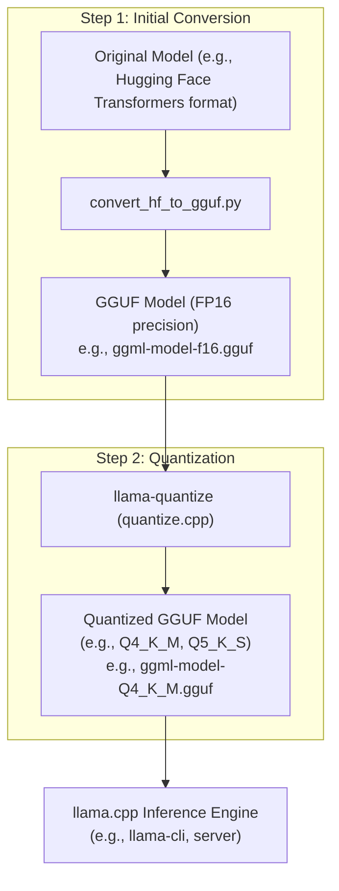
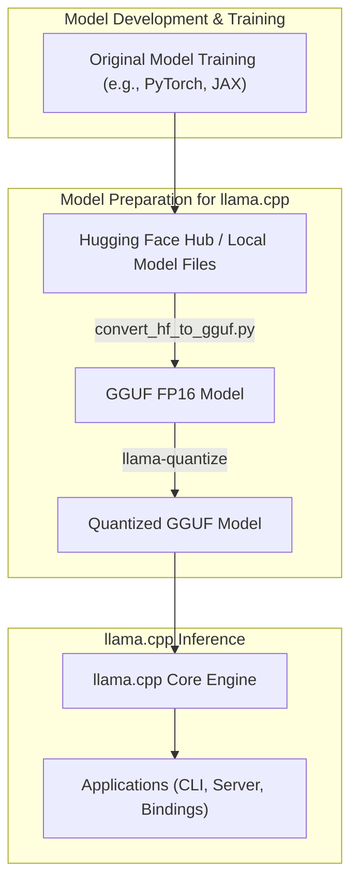

# 量化

`llama.cpp` 中的量化是一个将模型的权重（有时也包括激活值）的精度从较高精度（例如，32 位或 16 位浮点数）降低到较低精度整数（例如，4 位、5 位、8 位）的过程。这显著减小了模型的文件大小和内存占用，使得较大的模型能够在资源有限的设备上运行，并且通常能带来更快的推理速度。

## 目的与功能

`llama.cpp` 中量化的主要目标是：

1. **减小模型体积**：较低精度的权重需要更少的存储空间，使模型更易于分发和存储。
2. **提高内存效率**：量化后的模型在推理过程中消耗更少的 RAM，从而能够在内存有限的硬件上运行更大的模型。
3. **加快推理速度**：在某些硬件（尤其是 CPU）上，对低精度数字的运算速度可能更快。

量化过程通常包括将模型从标准格式（如 Hugging Face Transformers）转换为 GGUF 格式（首先是 FP16 精度），然后应用特定的量化算法进一步降低权重的精度。

## 量化工作流程

为 `llama.cpp` 量化模型的通用工作流程包括两个主要步骤：

1. **转换为 GGUF FP16**：原始模型权重（例如，来自 Hugging Face Hub）被转换为具有 FP16（16 位浮点）精度的 GGUF 格式。这通常使用 `convert_hf_to_gguf.py` 脚本完成。
2. **应用量化**：然后，FP16 GGUF 模型由 `llama-quantize` 工具（从 `tools/quantize/quantize.cpp` 编译而来）处理，以应用所需的量化方法（例如，Q4_K_M、Q5_K_S 等），从而生成一个更小的、量化后的 GGUF 模型。



## 关键组件

### 1. `convert_hf_to_gguf.py`

- **目的**：此 Python 脚本负责将预训练模型（通常来自 Hugging Face `transformers` 格式，如 PyTorch `.bin` 或 SafeTensors 文件）转换为 GGUF 格式。它最初将权重转换为 FP16 或 FP32 精度。该脚本处理架构转换、词汇表和张量到 GGUF 标准的映射。
- **功能**：
    - 从本地路径或 Hugging Face Hub 加载模型。
    - 处理 tokenizer 数据和模型权重。
    - 将模型结构和张量写入 GGUF 文件。
- **使用示例**：

    ```bash
    python3 convert_hf_to_gguf.py ./models/mymodel/ --outfile ./models/mymodel/ggml-model-f16.gguf --outtype f16
    ```

    此命令将位于 `./models/mymodel/` 的模型转换为 FP16 GGUF 文件。

### 2. `llama-quantize` (来自 `tools/quantize/quantize.cpp`)

- **目的**：此命令行工具接收一个现有的 GGUF 模型（通常是 FP32 或 FP16 版本），并使用支持的各种量化类型之一将其转换为量化后的 GGUF 模型。
    
- **功能**：
    
    - 读取输入的 GGUF 文件。
    - 遍历模型中的张量。
    - 对符合条件的张量（通常是权重张量）应用指定的量化算法。
    - 将量化后的张量和模型元数据写入新的输出 GGUF 文件。
    - 它也可以用于复制 GGUF 文件，这在旧版本 GGUF 文件类型不再受支持时，用于更新文件类型版本非常有用。
- **核心逻辑**：主要的量化逻辑位于 `llama_model_quantize_internal` 函数内部（尽管此特定函数名称可能会演变，但原理保持不变）。它涉及将张量数据映射到较低比特表示，通常使用诸如 k-quants 之类的技术，这些技术将权重块分组并应用缩放因子。

    实际的量化是通过 `ggml` 库中的 `ggml_quantize_chunk` 或类似函数进行的，`llama-quantize` 会调用这些函数。

- **使用示例**：

    ```bash
    ./llama-quantize ./models/mymodel/ggml-model-f16.gguf ./models/mymodel/ggml-model-Q4_K_M.gguf Q4_K_M
    ```

    此命令使用 `Q4_K_M` 方法量化 `ggml-model-f16.gguf` 并将其另存为 `ggml-model-Q4_K_M.gguf`。

    要将 GGUF 文件更新到最新版本而不更改其量化类型（在格式规范发生变化时很有用）：

    ```bash
    ./llama-quantize ./models/mymodel/ggml-model-Q4_K_M.gguf ./models/mymodel/ggml-model-Q4_K_M-v2.gguf COPY
    ```

来源：[quantize.cpp](https://github.com/ggml-org/llama.cpp/blob/master/tools/quantize/quantize.cpp), [README.md](https://github.com/ggml-org/llama.cpp/blob/master/tools/quantize/README.md)

## 支持的量化方法

`llama.cpp` 支持多种量化方法，主要是 "k-quants" 以及最近的 "i-quants"。这些方法在模型大小、困惑度（质量）和推理速度之间提供了不同的权衡。

一些常见的量化类型包括：

- **Q2_K**：使用 k-quants 的 2 位量化。模型体积非常小。
- **Q3_K_S, Q3_K_M, Q3_K_L**：具有小、中、大分块大小的 3 位 k-quants。
- **Q4_0, Q4_1**：较旧的 4 位量化方法。
- **Q4_K_S, Q4_K_M**：4 位 k-quants，广泛用于实现良好平衡。
- **Q5_0, Q5_1**：较旧的 5 位量化方法。
- **Q5_K_S, Q5_K_M**：5 位 k-quants。
- **Q6_K**：6 位 k-quants，提供更接近 FP16 的更高质量。
- **Q8_0**：8 位量化，通常用于最小化质量损失。
- **IQ 类型 (例如, IQ2_XS, IQ3_XXS)**：基于重要性矩阵的量化，旨在在极低比特率下获得更好的质量。

量化方法的选择取决于具体模型以及在大小、速度和准确性之间期望的平衡。`tools/quantize/README.md` 文件通常包含各种方法的困惑度得分和文件大小的更新表。

### 重要性矩阵 (imatrix)

一些高级量化方法（尤其是 i-quants 和较新的 k-quant 策略）可以利用“重要性矩阵”。该矩阵在校准数据上预先计算，有助于识别哪些权重对模型性能更为关键，从而允许以更高精度量化它们或在量化过程中保护它们。`llama-imatrix` 工具用于计算此矩阵，然后 `llama-quantize` 可以使用它。

来源：[README.md](https://github.com/ggml-org/llama.cpp/blob/master/tools/quantize/README.md) (用于表格和方法列表), [quantize.cpp](https://github.com/ggml-org/llama.cpp/blob/master/tools/quantize/quantize.cpp) (量化类型处理和 imatrix 逻辑所在的大致行数)。

## 内存/磁盘需求

量化显著减少了所需的磁盘空间和 RAM。下表（可能已过时，请始终参考存储库中最新的 `README.md`）提供了一个大致概念：

|模型|原始大小 (FP16)|量化后大小 (Q4_0)|
|---|---|---|
|7B|13 GB|3.9 GB|
|13B|24 GB|7.8 GB|
|30B|60 GB|19.5 GB|
|65B|120 GB|38.5 GB|

Llama 2 7B 每权重位数 (BPW) (示例，最新数据请参考 `tools/quantize/README.md`)：

|量化方法|每权重位数 (BPW)|
|---|---|
|Q2_K|3.35|
|Q3_K_S|3.50|
|Q3_K_M|3.91|
|Q4_K_M|4.84|
|Q5_K_M|5.68|
|Q6_K|6.56|

来源：[README.md](https://github.com/ggml-org/llama.cpp/blob/master/tools/quantize/README.md)

## 整体架构集成

量化是 `llama.cpp` 生态系统中一个关键的预处理步骤。它使得大型语言模型能够在更广泛的硬件上实际使用。



量化模型（GGUF 格式）由 `llama.cpp` 推理引擎直接加载。该引擎经过精心设计，能够利用这些低精度权重高效执行计算，并利用 CPU 特定的优化（如 AVX、NEON）和可用的 GPU 后端。这使得量化成为 `llama.cpp` 项目实现性能和可访问性目标的重要推动因素。
