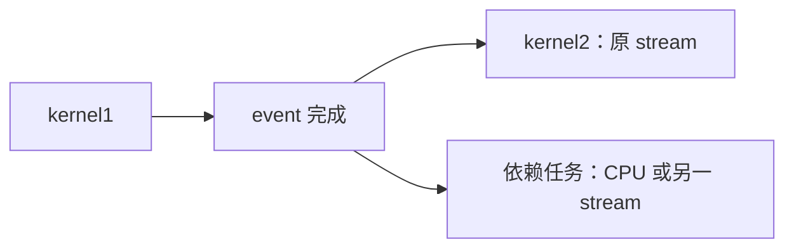

## 2.5. Asynchronous Execution（异步执行）

### 2.5.1. What is Asynchronous Concurrent Execution?（什么是异步并发执行？）

> CUDA allows concurrent, or overlapping, execution of multiple tasks, specifically:

CUDA 允许多个任务并发或重叠执行，具体包括：

- > computation on the host

  Host 上的计算；

- > computation on the device

  Device 上的计算；

- > memory transfers from the host to the device

  从 host 到 device 的内存传输；

- > memory transfers from the device to the host

  从 device 到 host 的内存传输；

- > memory transfers within the memory of a given device

  同一 device 内部的内存传输；

- > memory transfers among devices

  不同 device 之间的内存传输。

> The concurrency is expressed via an asynchronous interface, where a dispatching function call or kernel launch returns immediately. Asynchronous calls usually return before the dispatched operation has completed and may return before the asynchronous operation has started. The application is then free to perform other tasks at the same time as the originally dispatched operation. When the final results of the initially dispatched operation are needed, the application must perform some form of synchronization to ensure that the operation in question has completed. A typical example of a concurrent execution pattern is the overlapping of host and device memory transfers with computation and thus reducing or eliminating their overhead.

这种并发通过异步接口表达：提交工作的函数调用或 kernel 启动会立即返回。异步调用通常在已提交操作完成之前返回，甚至可能在操作开始之前就返回。随后，应用程序可以在原操作进行的同时执行其他任务。当需要最初提交操作的最终结果时，应用程序必须采用某种同步方式，保证该操作已经完成。一种典型并发模式，是让 host 与 device 之间的内存传输与计算重叠，从而减少或消除传输带来的额外开销。

**解读：** 异步描述的是提交方是否等待操作完成；并发描述的是多个操作在时间上是否实际重叠。API 返回不代表 GPU 已开始或已完成工作。重叠可以隐藏传输时间，但不会消除传输本身，仍受硬件资源、数据依赖和调度约束。

> Figure 20 Asynchronous COncurrent Execution with CUDA streams

图 20：使用 CUDA stream 实现异步并发执行。

> In general, asynchronous interfaces typically provide three main ways to synchronize with the dispatched operation

通常，异步接口提供三种主要方式，用于与已提交操作同步：

- > a blocking approach, where the application calls a function that blocks, or waits until the operation has completed

  阻塞方式：应用程序调用一个函数，该函数阻塞并等待操作完成。

- > a non-blocking approach, or polling approach where the application calls a function that returns immediately and supplies information about the status of the operation

  非阻塞方式，也称轮询方式：应用程序调用一个立即返回的函数，由它提供操作的当前状态。

- > a callback approach, where a pre-registered function is executed when the operation has completed.

  回调方式：操作完成时，执行事先注册的函数。

> While the programming interfaces are asynchronous, the actual ability to carry out various operations concurrently will depend on the version of CUDA and the compute capability of the hardware being used – these details will be left to a later section of this guide (see Compute Capabilities).

虽然编程接口是异步的，但实际能否并发执行不同操作，取决于 CUDA 版本和硬件的 compute capability。相关细节将在指南后续章节介绍，参见“Compute Capabilities”。

> In Synchronizing CPU and GPU, the CUDA runtime function `cudaDeviceSynchronize()` was introduced, which is a blocking call which waits for all previously issued work to complete. The reason the `cudaDeviceSynchronize()` call was needed is because the kernel launch is asynchronous and returns immediately. CUDA provides an API for both blocking and non-blocking approaches to synchronization and even supports the use of host-side callback functions.

前面的“Synchronizing CPU and GPU”介绍了 CUDA Runtime 函数 `cudaDeviceSynchronize()`。它是阻塞调用，等待此前提交的所有工作完成。之所以需要它，是因为 kernel 启动是异步的，会立即返回。CUDA 同时提供阻塞与非阻塞同步 API，还支持 host 侧回调函数。

> The core API components for asynchronous execution in CUDA are CUDA Streams and CUDA Events. In the rest of this section we will explain how these elements can be used to express asynchronous execution in CUDA.

CUDA 异步执行的核心 API 组件是 CUDA Stream 和 CUDA Event。本节后续将说明如何通过这些组件表达异步执行。

> A related topic is that of CUDA Graphs, which allow a graph of asynchronous operations to be defined up front, which can then be executed repeatedly with minimal overhead. We cover CUDA Graphs in a very introductory level in section 2.4.9.2 Introduction to CUDA Graphs with Stream Capture, and a more comprehensive discussion is provided in section 4.1 CUDA Graphs.

另一个相关主题是 CUDA Graphs：它允许预先定义由异步操作构成的图，然后以很低的开销反复执行。第 2.4.9.2 节“Introduction to CUDA Graphs with Stream Capture”将提供入门介绍，第 4.1 节“CUDA Graphs”则进行更完整的讨论。

**整理说明：** 本节保留用户提供的正文、图注及代码；图 20 的图片未包含在附件中，重复图片标题与粘贴造成的空格问题已清理。代码未编译或运行，已发现的问题另行说明。原文此处的章节引用与当前目录不一致：stream capture 入门位于本节 **2.5.9.2**，完整 CUDA Graphs 章节为 [4.2 CUDA Graphs](https://docs.nvidia.com/cuda/cuda-programming-guide/04-special-topics/cuda-graphs.html)。

### 2.5.2. CUDA Streams（CUDA stream）

> At the most basic level, a CUDA stream is an abstraction which allows the programmer to express a sequence of operations. A stream operates like a work-queue into which programs can add operations, such as memory copies or kernel launches, to be executed in order. Operations at the front of the queue for a given stream are executed and then dequeued allowing the next queued operation to come to the front and to be considered for execution. The order of execution of operations in a stream is sequential and the operations are executed in the order they are enqueued into the stream.

从最基本的层面看，CUDA stream 是一种表达操作序列的抽象。它类似一个工作队列，程序可以向其中加入内存复制、kernel 启动等操作，让它们依次执行。某个 stream 队首的操作执行后出队，随后排队的操作来到队首，等待执行。因此，stream 中的操作按顺序执行，执行顺序与入队顺序相同。

> An application may use multiple streams simultaneously. In such cases, the runtime will select a task to execute from the streams that have work available depending on the state of the GPU resources. Streams may be assigned a priority which acts as a hint to the runtime to influence the scheduling, but does not guarantee a specific order of execution.

应用程序可以同时使用多个 stream。在这种情况下，runtime 根据 GPU 资源状态，从有待执行工作的 stream 中选择任务。可以为 stream 指定优先级，作为影响 runtime 调度的提示，但它不保证特定执行顺序。

> The API function calls and kernel-launches operating in a stream are asynchronous with respect to the host thread. Applications can synchronize with a stream by waiting for it to be empty of tasks, or they can also synchronize at the device level.

Stream 中的 API 调用和 kernel 启动，相对于 host thread 是异步的。应用程序可以通过等待 stream 中的任务全部完成，与某个 stream 同步，也可以在 device 层面同步。

> CUDA has a default stream, and operations and kernel launches without a specific stream are queued into this default stream. Code examples which do not specify a stream are using this default stream implicitly. The default stream has some specific semantics which are discussed in subsection Blocking and non-blocking streams and the default stream.

CUDA 提供 default stream。没有显式指定 stream 的操作和 kernel 启动，会加入 default stream 队列。未指定 stream 的代码示例都是在隐式使用它。Default stream 具有特殊语义，详见“Blocking and non-blocking streams and the default stream”。

**解读：** Stream 规定操作的先后关系，并不独占一个 SM、一个 GPU 引擎或一组固定线程。不同 stream 只是为独立工作提供并发机会，不能依靠“放进不同 stream”就假定它们必定并行，也不能据此假定存在某种先后关系。

#### 2.5.2.1. Creating and Destroying CUDA Streams（创建与销毁 CUDA stream）

> CUDA streams can be created using the `cudaStreamCreate()` function. The function call initializes the stream handle which can be used to identify the stream in subsequent function calls.

可以使用 `cudaStreamCreate()` 创建 CUDA stream。该调用初始化一个 stream handle，后续函数调用通过这个 handle 标识对应 stream。

```cpp
cudaStream_t stream;        // Stream handle
cudaStreamCreate(&stream);  // Create a new stream

// stream based operations ...

cudaStreamDestroy(stream);  // Destroy the stream
```

> If the device is still doing work in stream stream when the application calls `cudaStreamDestroy()`, the stream will complete all the work in the stream before being destroyed.

如果调用 `cudaStreamDestroy()` 时，device 仍在执行该 stream 中的工作，那么 stream 中的全部工作会先完成，随后 stream 才被销毁。

**解读（语义澄清）：** `cudaStreamDestroy()` 不等价于等待 stream 完成。若仍有工作，函数会先返回，相关资源待工作完成后再释放；不能仅凭销毁函数已经返回，就读取结果或释放仍在使用的数据。参见 [CUDA Runtime stream 管理说明](https://docs.nvidia.com/cuda/cuda-runtime-api/group__CUDART__STREAM.html)。

#### 2.5.2.2. Launching Kernels in CUDA Streams（在 CUDA stream 中启动 kernel）

> The usual triple-chevron syntax for launching a kernel can also be used to launch a kernel into a specific stream. The stream is specified as an extra parameter to the kernel launch. In the following example the kernel named kernel is launched into the stream with handle stream, which is of type `cudaStream_t` and has been assumed to have been created previously:

常见的三尖括号语法也可以将 kernel 启动到指定 stream，只需在启动参数中额外传入 stream。下面的例子将名为 `kernel` 的 kernel 提交到 handle 为 `stream` 的 stream 中；该 handle 类型为 `cudaStream_t`，并假定此前已经创建：

```cpp
kernel<<<grid, block, shared_mem_size, stream>>>(...);
```

> The kernel launch is asynchronous and the function call returns immediately. Assuming that the kernel launch is successful, the kernel will execute in the stream stream and the application is free to perform other tasks on the CPU or in other streams on the GPU while the kernel is executing.

Kernel 启动是异步的，函数调用立即返回。假定启动成功，kernel 将在 `stream` 中执行；与此同时，应用程序可以在 CPU 上，或 GPU 的其他 stream 中执行其他任务。

#### 2.5.2.3. Launching Memory Transfers in CUDA Streams（在 CUDA stream 中启动内存传输）

> To launch a memory transfer into a stream, we can use the function `cudaMemcpyAsync()`. This function is similar to the `cudaMemcpy()` function, but it takes an additional parameter specifying the stream to use for the memory transfer. The function call in the code block below copies size bytes from the host memory pointed to by src to the device memory pointed to by dst in the stream stream.

可以使用 `cudaMemcpyAsync()` 将内存传输提交到 stream。它类似 `cudaMemcpy()`，但多接收一个参数，用于指定传输所在的 stream。下面的调用在 `stream` 中，将 `src` 指向的 host memory 中的 `size` 字节复制到 `dst` 指向的 device memory：

```cpp
// Copy `size` bytes from `src` to `dst` in stream `stream`
cudaMemcpyAsync(dst, src, size, cudaMemcpyHostToDevice, stream);
```

> Like other asynchronous function calls, this function call returns immediately, whereas the `cudaMemcpy()` function blocks until the memory transfer is complete. In order to access the results of the transfer safely, the application must determine that the operation has completed using some form of synchronization.

与其他异步调用一样，该函数立即返回；而 `cudaMemcpy()` 会阻塞，直到内存传输完成。为了安全使用传输结果，应用程序必须通过某种同步方式确认操作已完成。

> Other CUDA memory transfer functions such as `cudaMemcpy2D()` also have asynchronous variants.

`cudaMemcpy2D()` 等其他 CUDA 内存传输函数，也有对应的异步版本。

> Note: In order for memory copies involving CPU memory to be carried out asynchronously, the host buffers must be pinned and page-locked. `cudaMemcpyAsync()` will function correctly if host memory which is not pinned and page-locked is used, but it will revert to a synchronous behavior which will not overlap with other work. This can inhibit the performance benefits of using asynchronous memory transfers. It is recommended programs use `cudaMallocHost()` to allocate buffers which will be used to send or receive data from GPUs.

注意：要让涉及 CPU 内存的复制异步进行，host buffer 必须是 pinned/page-locked memory，即锁页内存。如果 host memory 未锁页，`cudaMemcpyAsync()` 仍能正确工作，但会退化为同步行为，无法与其他工作重叠，削弱异步传输的性能收益。建议使用 `cudaMallocHost()` 分配用于向 GPU 发送数据或接收 GPU 数据的 buffer。

**解读（原文表述限定）：** `Async` 并不保证调用在所有条件下立即返回，`cudaMemcpy` 也并非对所有传输方向都等待设备侧传输完成。官方规则取决于传输方向及 host memory 是否锁页：pageable memory 可能需要暂存并引入阻塞，device-to-device 的同步版复制不执行 host 侧同步。应以具体 API 的保证为准。要稳定利用 host/device 异步传输，使用锁页 buffer，并在传输完成前保持其有效；H2D 源数据不能提前修改，D2H 结果不能提前读取。参见 [API synchronization behavior](https://docs.nvidia.com/cuda/cuda-runtime-api/api-sync-behavior.html)。

#### 2.5.2.4. Stream Synchronization（Stream 同步）

> The simplest way to synchronize with a stream is to wait for the stream to be empty of tasks. This can be done in two ways, using the `cudaStreamSynchronize()` function or the `cudaStreamQuery()` function.

与 stream 同步最简单的方式，是等待其中的任务全部完成。可以使用 `cudaStreamSynchronize()` 或 `cudaStreamQuery()` 两种方式。

> The `cudaStreamSynchronize()` function will block until all the work in the stream has completed.

`cudaStreamSynchronize()` 会阻塞，直到 stream 中的全部工作完成。

```cpp
// Wait for the stream to be empty of tasks
cudaStreamSynchronize(stream);

// At this point the stream is done
// and we can access the results of stream operations safely
```

> If we prefer not to block, but just need a quick check to see if the stream is empty we can use the `cudaStreamQuery()` function.

如果不想阻塞，只想快速检查 stream 是否已没有未完成任务，可以使用 `cudaStreamQuery()`。

```cpp
// Have a peek at the stream
// returns cudaSuccess if the stream is empty
// returns cudaErrorNotReady if the stream is not empty
cudaError_t status = cudaStreamQuery(stream);

switch (status) {
    case cudaSuccess:
        // The stream is empty
        std::cout << "The stream is empty" << std::endl;
        break;
    case cudaErrorNotReady:
        // The stream is not empty
        std::cout << "The stream is not empty" << std::endl;
        break;
    default:
        // An error occurred - we should handle this
        break;
};
```

**解读：** `cudaErrorNotReady` 表示尚未完成，不等于执行失败；其他错误需要处理。“队列为空”是教学类比，真正要判断的是此前提交的工作是否已经完成，包括已离开队首但仍在设备执行的工作。查询成功也不能保证其他 host thread 随后不会继续向该 stream 提交任务。

### 2.5.3. CUDA Events（CUDA event）

> CUDA events are a mechanism for inserting markers into a CUDA stream. They are essentially like tracer particles that can be used to track the progress of tasks in a stream. Imagine launching two kernels into a stream. Without such tracking events, we would only be able to determine whether the stream is empty or not. If a third operation, either on CPU or in a different stream, depends on the output of the first kernel, we could not safely start that operation until we knew the stream was empty. When the stream is empty, both kernels would have completed.

CUDA event 是向 CUDA stream 插入标记的机制，类似于用来跟踪 stream 中任务进度的示踪粒子。假设向同一个 stream 启动两个 kernel：没有这类 event 时，只能判断 stream 是否已空。如果 CPU 或另一个 stream 中的第三个操作依赖第一个 kernel 的输出，就必须等到确认 stream 已空后，才能安全启动该操作。而 stream 已空意味着两个 kernel 都已完成。

> Using CUDA events we can do better. By enqueuing an event into a stream directly after the first kernel, but before the second kernel, we can have either a CPU thread or another stream wait for this event to come to the front of the stream. Then, we can safely start our dependent operation knowing that the first kernel has completed, but before the second kernel has started. Using CUDA events in this way can build up a graph of dependencies between operations and streams. This graph analogy translates directly into the later discussion of CUDA graphs.

使用 CUDA event 可以做得更精细。在第一个 kernel 之后、第二个 kernel 之前将 event 加入 stream，就可以让 CPU thread 或另一个 stream 等待该 event 到达队首。随后便能确认第一个 kernel 已完成，并在第二个 kernel 开始之前安全启动依赖操作。以这种方式使用 event，可以构建操作与 stream 之间的依赖图；这种图的类比也直接引出后面讨论的 CUDA Graphs。

**解读（原文勘误）：** Event 保证的是它之前的 `kernel1` 已完成，不保证依赖任务一定早于 `kernel2` 开始。Event 完成后，原 stream 可以继续执行 `kernel2`，CPU 或另一 stream 中的依赖任务也可以继续，二者之间没有由这个 event 建立先后关系。下面是补充的依赖示意，不是原图 20；箭头表示必须满足的前置关系，不表示实际并发已经发生。



> CUDA events also keep time information which can be used to time kernel launches and memory transfers.

CUDA event 还保存时间信息，可以用于测量 kernel 启动和内存传输的耗时。

#### 2.5.3.1. Creating and Destroying CUDA Events（创建与销毁 CUDA event）

> CUDA Events can be created and destroyed using the `cudaEventCreate()` and `cudaEventDestroy()` functions.

使用 `cudaEventCreate()` 和 `cudaEventDestroy()`，可以创建和销毁 CUDA event。

```cpp
cudaEvent_t event;

// Create the event
cudaEventCreate(&event);

// do some work involving the event

// Once the work is done and the event is no longer needed
// we can destroy the event
cudaEventDestroy(event);
```

> The application is responsible for destroying events when they are no longer needed.

应用程序负责在不再需要 event 时销毁它。

#### 2.5.3.2. Inserting Events into CUDA Streams（将 event 插入 CUDA stream）

> CUDA Events can be inserted into a stream using the `cudaEventRecord()` function.

使用 `cudaEventRecord()` 可以将 CUDA event 插入 stream。

```cpp
cudaEvent_t event;
cudaStream_t stream;

// Create the event
cudaEventCreate(&event);

// Insert the event into the stream
cudaEventRecord(event, stream);
```

**解读（示例遗漏）：** 这段代码只声明了 `cudaStream_t stream`，没有初始化它，不能直接作为独立示例执行。应先成功调用 `cudaStreamCreate(&stream)`，或明确使用一个已存在的有效 stream；event 创建成功并不意味着 stream 也已创建。

#### 2.5.3.3. Timing Operations in CUDA Streams（对 CUDA stream 中的操作计时）

> CUDA events can be used to time the execution of various stream operations including kernels. When an event reaches the front of a stream it records a timestamp. By surrounding a kernel in a stream with two events we can get an accurate timing of the duration of the kernel execution as is shown in the code snippet below:

CUDA event 可以对 stream 中包括 kernel 在内的各种操作计时。当 event 到达 stream 队首时，会记录时间戳。在同一 stream 中，将两个 event 分别放在 kernel 前后，就可以准确测量 kernel 执行的持续时间，如下所示：

```cpp
cudaStream_t stream;
cudaStreamCreate(&stream);

cudaEvent_t start;
cudaEvent_t stop;

// create the events
cudaEventCreate(&start);
cudaEventCreate(&stop);

 // record the start event
cudaEventRecord(start, stream);

// launch the kernel
kernel<<<grid, block, 0, stream>>>(...);

// record the stop event
cudaEventRecord(stop, stream);

// wait for the stream to complete
// both events will have been triggered
cudaStreamSynchronize(stream);

// get the timing
float elapsedTime;
cudaEventElapsedTime(&elapsedTime, start, stop);
std::cout << "Kernel execution time: " << elapsedTime << " ms" << std::endl;

// clean up
cudaEventDestroy(start);
cudaEventDestroy(stop);
cudaStreamDestroy(stream);
```

**解读：** `cudaEventElapsedTime` 返回毫秒，测量的是两个设备侧 event 时间戳之间的间隔，不是 host 发起 kernel 调用所花的时间。其他并发工作可能影响实际测量结果；应确认 event 已完成并检查 API 返回值。只需要等待计时终点时，可以等待 `stop` event，无须等待它后面可能继续加入的工作。参见 [CUDA event 计时与同步 API](https://docs.nvidia.com/cuda/cuda-runtime-api/group__CUDART__EVENT.html)。

#### 2.5.3.4. Checking the Status of CUDA Events（检查 CUDA event 的状态）

> Like in the case of checking the status of streams, we can check the status of events in either a blocking or a non-blocking way.

与检查 stream 状态类似，event 状态也可以通过阻塞或非阻塞方式检查。

> The `cudaEventSynchronize()` function will block until the event has completed. In the code snippet below we launch a kernel into a stream, followed by an event and then by a second kernel. We can use the `cudaEventSynchronize()` function to wait for the event after the first kernel to complete and in principle launch a dependent task immediately, potentially before kernel2 finishes.

`cudaEventSynchronize()` 会阻塞，直到 event 完成。下面的代码先向 stream 启动一个 kernel，再记录 event，然后启动第二个 kernel。通过等待位于第一个 kernel 之后的 event 完成，原则上就能立即启动依赖任务，而此时 `kernel2` 可能尚未结束。

```cpp
cudaEvent_t event;
cudaStream_t stream;

// create the stream
cudaStreamCreate(&stream);

// create the event
cudaEventCreate(&event);

// launch a kernel into the stream
kernel<<<grid, block, 0, stream>>>(...);

// Record the event
cudaEventRecord(event, stream);

// launch a kernel into the stream
kernel2<<<grid, block, 0, stream>>>(...);

// Wait for the event to complete
// Kernel 1 will be  guaranteed to have completed
// and we can launch the dependent task.
cudaEventSynchronize(event);
dependentCPUtask();

// Wait for the stream to be empty
// Kernel 2 is guaranteed to have completed
cudaStreamSynchronize(stream);

// destroy the event
cudaEventDestroy(event);

// destroy the stream
cudaStreamDestroy(stream);
```

> CUDA Events can be checked for completion in a non-blocking way using the `cudaEventQuery()` function. In the example below we launch 2 kernels into a stream. The first kernel, kernel1 generates some data which we would like to copy to the host, however we also have some CPU side work to do. In the code below, we enqueue kernel1 followed by an event (event) and then kernel2 into stream stream1. We then go into a CPU work loop, but occasionally take a peek to see if the event has completed indicating that kernel1 is done. If so, we launch a device to host copy into stream stream2. This approach allows the overlap of the CPU work with the GPU kernel execution and the device to host copy.

使用 `cudaEventQuery()` 可以非阻塞地检查 CUDA event 是否完成。下面向同一个 stream 启动两个 kernel：`kernel1` 生成一份需要复制到 host 的数据，但 CPU 同时还有自己的工作。代码先将 `kernel1`、event 和 `kernel2` 依次加入 `stream1`，然后进入 CPU 工作循环，并不时检查 event 是否完成。如果完成，就说明 `kernel1` 已结束，可以在 `stream2` 中提交一次 device-to-host 复制。这种方式可以让 CPU 工作与 GPU kernel 执行及 device-to-host 复制相互重叠。

```cpp
cudaEvent_t event;
cudaStream_t stream1;
cudaStream_t stream2;

size_t size = LARGE_NUMBER;
float* d_data;
float* h_data;

// Create some data
cudaMalloc(&d_data, size);
cudaMallocHost(&h_data, size);

// create the streams
cudaStreamCreate(&stream1);   // Processing stream
cudaStreamCreate(&stream2);   // Copying stream
bool copyStarted = false;

//  create the event
cudaEventCreate(&event);

// launch kernel1 into the stream
kernel1<<<grid, block, 0, stream1>>>(d_data, size);
// enqueue an event following kernel1
cudaEventRecord(event, stream1);

// launch kernel2 into the stream
kernel2<<<grid, block, 0, stream1>>>();

// while the kernels are running do some work on the CPU
// but check if kernel1 has completed because then we will start
// a device to host copy in stream2
while ( not allCPUWorkDone() || not copyStarted ) {
    doNextChunkOfCPUWork();

    // peek to see if kernel 1 has completed
    // if so enqueue a non-blocking copy into stream2
    if ( not copyStarted ) {
        if( cudaEventQuery(event) == cudaSuccess ) {
            cudaMemcpyAsync(h_data, d_data, size, cudaMemcpyDeviceToHost, stream2);
            copyStarted = true;
        }
    }
}

// wait for both streams to be done
cudaStreamSynchronize(stream1);
cudaStreamSynchronize(stream2);

// destroy the event
cudaEventDestroy(event);

// destroy the streams and free the data
cudaStreamDestroy(stream1);
cudaStreamDestroy(stream2);
cudaFree(d_data);
free(h_data);
```

**解读（代码问题与前提）：** `h_data` 由 `cudaMallocHost()` 分配，末尾的 `free(h_data)` 应改为 `cudaFreeHost(h_data)`，见 [CUDA 锁页内存释放 API](https://docs.nvidia.com/cuda/cuda-runtime-api/group__CUDART__MEMORY.html)。这里的 `size` 以字节计；`kernel1` 未给出实现，因此仍需确认其第二个参数采用相同单位。

轮询代码还把所有非成功返回都当作“尚未完成”，如果 event 查询返回真正错误，`copyStarted` 可能一直为 false；应区分 `cudaErrorNotReady` 与错误，并在复制成功提交后才更新状态。另外，CPU 工作耗尽但复制尚未启动时，循环仍会调用 `doNextChunkOfCPUWork()`，其实现需要避免继续取用不存在的任务。复制期间也必须保证其他操作不会并发改写 `d_data` 的同一数据区域。

### 2.5.4. Callback Functions from Streams（由 stream 调用 host 回调函数）

> CUDA provides a mechanism for launching functions on the host from within a stream. There are currently two functions available for this purpose: `cudaLaunchHostFunc()` and `cudaAddCallback()`. However, `cudaAddCallback()` is slated for deprecation, so applications should use `cudaLaunchHostFunc()`.

CUDA 提供了从 stream 中启动 host 函数的机制。目前有两个相关函数：`cudaLaunchHostFunc()` 和 `cudaAddCallback()`。不过，`cudaAddCallback()` 计划被弃用，因此应用程序应使用 `cudaLaunchHostFunc()`。

**解读（API 名称勘误）：** 原文的 `cudaAddCallback()` 应为 `cudaStreamAddCallback()`，后面的小节和函数签名使用了正确名称。新代码按本节建议采用 `cudaLaunchHostFunc()`。

#### Using `cudaLaunchHostFunc()`（使用 `cudaLaunchHostFunc()`）

> The signature of the `cudaLaunchHostFunc()` function is as follows:

`cudaLaunchHostFunc()` 的函数签名如下：

```cpp
cudaError_t cudaLaunchHostFunc(cudaStream_t stream, void (*func)(void *), void *data);
```

> where

其中：

- > stream: The stream to launch the callback function into.

  `stream`：回调函数要加入的 stream。

- > func: The callback function to launch.

  `func`：要执行的回调函数。

- > data: A pointer to the data to pass to the callback function.

  `data`：传给回调函数的数据指针。

> The host function itself is a simple C function with the signature:

Host function 本身是一个简单的 C 函数，签名如下：

```cpp
void hostFunction(void *data);
```

> with the data parameter pointing to a user defined data structure which the function can interpret. There are some caveats to keep in mind when using callback functions like this. In particular, the host function may not call any CUDA APIs.

`data` 参数指向用户定义的数据结构，函数可以按相应结构解释其中的数据。使用这类回调函数时需要注意一些限制，尤其是 host function 不能调用任何 CUDA API。

> For the purposes of being used with unified memory, the following execution guarantees are provided:

为支持 unified memory，提供以下执行保证：

- > The stream is considered idle for the duration of the function’s execution. Thus, for example, the function may always use memory attached to the stream it was enqueued in.

  函数执行期间，其所在 stream 被视为空闲。因此，函数始终可以访问附加到该 stream 的内存。

- > The start of execution of the function has the same effect as synchronizing an event recorded in the same stream immediately prior to the function. It thus synchronizes streams which have been “joined” prior to the function.

  函数开始执行，具有与同步同一 stream 中紧邻其前记录的 event 相同的效果。因此，在函数之前已经“汇合”的 stream 也会被同步。

- > Adding device work to any stream does not have the effect of making the stream active until all preceding host functions and stream callbacks have executed. Thus, for example, a function might use global attached memory even if work has been added to another stream, if the work has been ordered behind the function call with an event.

  向任意 stream 添加 device 工作，并不会立即使其变为活跃状态；在它之前的 host function 和 stream callback 全部执行完成后，device 工作才会使 stream 活跃。例如，如果通过 event 将其他 stream 的工作安排在这个函数之后，那么即使那些工作已经入队，函数仍可以访问具有 global attachment 的内存。

- > Completion of the function does not cause a stream to become active except as described above. The stream will remain idle if no device work follows the function, and will remain idle across consecutive host functions or stream callbacks without device work in between. Thus, for example, stream synchronization can be done by signaling from a host function at the end of the stream.

  除了上面描述的情况，函数执行完成本身不会使 stream 变为活跃。如果后面没有 device 工作，stream 会保持空闲；若多个 host function 或 stream callback 连续执行，中间没有 device 工作，stream 也会持续空闲。因此，可以通过位于 stream 末尾的 host function 发出信号，实现 stream 同步。

**解读：** Host function 是 stream 顺序中的一个操作：前面的工作完成后它才开始，同一 stream 后续工作要等它返回。这里的“空闲”主要用于解释 unified memory 的访问语义，不表示整个 GPU 空闲，也不表示其他 stream 都被停止。传入的 `data` 及其引用对象必须保持有效，直到回调不再使用它们；不能在回调内部调用 CUDA API 来继续提交 GPU 工作。

#### 2.5.4.1. Using `cudaStreamAddCallback()`（使用 `cudaStreamAddCallback()`）

> Note: The `cudaStreamAddCallback()` function is slated for deprecation and removal and is discussed here for completeness and because it may still appear in existing code. Applications should use or switch to using `cudaLaunchHostFunc()`.

注意：`cudaStreamAddCallback()` 计划弃用并移除。这里为了内容完整，以及便于阅读仍使用该 API 的现有代码而加以介绍。应用程序应使用或迁移到 `cudaLaunchHostFunc()`。

> The signature of the `cudaStreamAddCallback()` function is as follows:

`cudaStreamAddCallback()` 的函数签名如下：

```cpp
cudaError_t cudaStreamAddCallback(cudaStream_t stream, cudaStreamCallback_t callback, void* userData, unsigned int flags);
```

> where

其中：

- > stream: The stream to launch the callback function into.

  `stream`：回调函数要加入的 stream。

- > callback: The callback function to launch.

  `callback`：要执行的回调函数。

- > userData: A pointer to the data to pass to the callback function.

  `userData`：传给回调函数的数据指针。

- > flags: Currently, this parameter must be 0 for future compatibility.

  `flags`：为保证未来兼容性，该参数目前必须设为 0。

> The signature of the callback function is a little different from the case when we used the `cudaLaunchHostFunc()` function. In this case the callback function is a C function with the signature:

这里的回调签名与 `cudaLaunchHostFunc()` 所用的签名略有不同。它是一个具有以下签名的 C 函数：

```cpp
void callbackFunction(cudaStream_t stream, cudaError_t status, void *userData);
```

> where the function is now passed

这一次，函数接收以下参数：

- > stream: The stream handle from which the callback function was launched.

  `stream`：启动该回调函数的 stream handle。

- > status: The status of the stream operation that triggered the callback.

  `status`：触发回调的 stream 操作状态。

- > userData: A pointer to the data that was passed to the callback function.

  `userData`：传给回调函数的数据指针。

> In particular the status parameter will contain the current error status of the stream, which may have been set by previous operations. Similarly to the `cudaLaunchHostFunc()` func case, the stream will not be active and advance to tasks until the host-function has completed, and no CUDA functions may be called from within the callback function.

其中，`status` 包含 stream 当前的错误状态，该状态可能由此前的操作设置。与 `cudaLaunchHostFunc()` 中的 `func` 类似，host function 完成前，stream 不会恢复活跃并继续后续任务；回调内部也不能调用任何 CUDA 函数。

#### 2.5.4.2. Asynchronous Error Handling（异步错误处理）

> In a cuda stream, errors may originate from any operation in the stream, including for kernel launches and memory transfers. These errors may not be propagated back to the user at run-time until the stream is synchronized, for example, by waiting for an event or calling `cudaStreamSynchronize()`. There are two ways to find out about errors which may have occurred in a stream.

CUDA stream 中的任意操作都可能产生错误，包括 kernel 启动和内存传输。这些错误可能直到 stream 同步时才返回给用户，例如等待 event 或调用 `cudaStreamSynchronize()` 时。可以通过以下两种方式获取 stream 中可能发生的错误。

- > Using the function `cudaGetLastError()` - this function returns and clears the last error encountered in any stream in the current context. An immediate second call to `cudaGetLastError()` would return `cudaSuccess` if no other error occurred between the two calls.

  使用 `cudaGetLastError()`：该函数返回并清除当前 context 中任意 stream 遇到的最后一个错误。如果两次调用之间没有发生其他错误，立即再次调用将返回 `cudaSuccess`。

- > Using the function `cudaPeekAtLastError()` - this function returns the last error in the current context, but does not clear it.

  使用 `cudaPeekAtLastError()`：该函数返回当前 context 中的最后一个错误，但不清除它。

**解读（作用域勘误）：** `cudaGetLastError()` 和 `cudaPeekAtLastError()` 查询的是当前 **host thread、同一 CUDA Runtime 实例** 的 last-error 状态，不能理解为整个 context 的统一错误收集器。它们可能返回此前异步操作的错误，但本身不等待 GPU 完成；因此，既要检查启动后的错误状态，也要直接检查同步调用的返回值。参见 [CUDA Runtime error handling](https://docs.nvidia.com/cuda/cuda-runtime-api/group__CUDART__ERROR.html)。

> Both of these functions return the error as a value of type `cudaError_t`. Printable names names of the errors can be generated using the functions `cudaGetErrorName()` and `cudaGetErrorString()`.

这两个函数都以 `cudaError_t` 返回错误值。可以通过 `cudaGetErrorName()` 和 `cudaGetErrorString()` 获取可打印的错误名称和说明。

> An example of using these functions is shown below:

下面展示这些函数的使用方式：

> Listing 1 Example of using `cudaGetLastError()` and `cudaPeekAtLastError()`

代码清单 1：使用 `cudaGetLastError()` 和 `cudaPeekAtLastError()` 的示例。

```cpp
// Some work occurs in streams.
cudaStreamSynchronize(stream);

// Look at the last error but do not clear it
cudaError_t err = cudaPeekAtLastError();
if (err != cudaSuccess) {
    printf("Error with name: %s\n", cudaGetErrorName(err));
    printf("Error description: %s\n", cudaGetErrorString(err));
}

// Look at the last error and clear it
cudaError_t err2 = cudaGetLastError();
if (err2 != cudaSuccess) {
    printf("Error with name: %s\n", cudaGetErrorName(err2));
    printf("Error description: %s\n", cudaGetErrorString(err2));
}

if (err2 != err) {
    printf("As expected, cudaPeekAtLastError() did not clear the error\n");
}

// Check again
cudaError_t err3 = cudaGetLastError();
if (err3 == cudaSuccess) {
    printf("As expected, cudaGetLastError() cleared the error\n");
}
```

**解读（示例逻辑问题）：** 原代码忽略了 `cudaStreamSynchronize(stream)` 的返回值，应直接检查并处理这个返回值，不能只依赖后续 last-error 查询。其次，若想证明 peek 没有清除错误，在没有新错误介入时，应观察 `err2 == err`；原例却用 `err2 != err` 触发相应提示，条件写反了。最后，清除 last-error 记录不等于修复设备故障；某些严重执行错误可能在后续 API 中再次出现，不能据此认定程序已恢复正常。

> Tip: When an error appears at a synchronization, especially in a stream with many operations, it is often difficult to pinpoint exactly where in the stream the error may have occurred. To debug such a situation a useful trick may be to set the environment variable `CUDA_LAUNCH_BLOCKING=1` and then run the application. The effect of this environment variable is to synchronize after every single kernel launch. This can aid in tracking down which kernel, or transfer caused the error. Synchronization can be expensive; applications may run substantially slower when this environment variable is set.

提示：当错误在同步时才出现，尤其是 stream 中有很多操作时，往往很难确定错误究竟发生在哪一步。调试时，可以设置环境变量 `CUDA_LAUNCH_BLOCKING=1` 后运行应用程序，其作用是在每一次 kernel 启动后进行同步，有助于定位导致错误的 kernel 或传输。同步开销可能很大，设置这一变量后，应用程序可能显著变慢。

**解读：** `CUDA_LAUNCH_BLOCKING=1` 适合帮助定位 kernel 错误，不应作为正常程序建立依赖的方式。它改变执行时序并影响性能，也不能替代对内存传输及其他 API 返回值的检查。

### 2.5.5. CUDA Stream Ordering（CUDA stream 的操作顺序）

> Now that we have discussed the basic mechanisms of streams, events and callback functions it is important to consider the ordering semantics of asynchronous operations in a stream. These semantics are to allow application programmers to think about the ordering of operations in a stream in a safe way. There are some special cases where these semantics may be relaxed for purposes of performance optimization such as in the case of a programmatic dependent kernel launch, which allows the overlap of two kernels through the use of special attributes and kernel launch mechanisms, or in the case of batching memory transfers using the asynchronous batched memory copy functions, when the runtime can perform non-overlapping batch copies concurrently.

介绍了 stream、event 和 callback 的基本机制后，还需要理解 stream 中异步操作的顺序语义。这些语义帮助程序员安全地推理操作先后关系。出于性能优化目的，某些特殊情况会放宽这些语义。例如，programmatic dependent kernel launch 通过特殊属性和启动机制，允许两个 kernel 重叠；异步批量内存复制函数则允许 runtime 并发执行批次中互不重叠的复制。

> Most importantly CUDA streams are what are known as in-order streams. This means that the order of execution of the operations in a stream is the same as the order in which those operations were enqueued. An operation in a stream cannot leap-frog other operations. Memory operations (such as copies) are tracked by the runtime and will always complete before the next operation in order to allow dependent kernels safe access to the data being transferred.

最关键的一点是 CUDA stream 属于 in-order stream，即顺序执行的 stream。操作执行顺序与其入队顺序一致，后面的操作不能越过前面的操作。Runtime 跟踪复制等内存操作，并保证它们在后续操作之前完成，让依赖这些数据的 kernel 能安全访问传输结果。

**解读：** 对常规 stream 代码，同一个 stream 内的 H2D copy、kernel、D2H copy 已经按顺序建立依赖，无须在每两步之间让 CPU 等待。只有当 host 要消费结果，或其他 stream 要使用这些结果时，才需要相应的同步或跨 stream 依赖。原文提到的特殊重叠机制需要显式使用相应 API，不能据此放宽普通代码的顺序假设。

### 2.5.6. Blocking and non-blocking streams and the default stream（Blocking stream、non-blocking stream 与 default stream）

> In CUDA there are two types of streams: blocking and non-blocking. The name can be a little misleading as the blocking and non-blocking semantics refer only to how the streams synchronize with the default stream. By default, streams created with `cudaStreamCreate()` are blocking streams. In order to create a non-blocking stream, the `cudaStreamCreateWithFlags()` function must be used with the `cudaStreamNonBlocking` flag:

CUDA 有 blocking 和 non-blocking 两种 stream。名称容易引起误解，因为它们仅描述与 default stream 的同步方式。默认情况下，`cudaStreamCreate()` 创建的是 blocking stream。要创建 non-blocking stream，需要使用 `cudaStreamCreateWithFlags()` 并传入 `cudaStreamNonBlocking`：

```cpp
cudaStream_t stream;
cudaStreamCreateWithFlags(&stream, cudaStreamNonBlocking);
```

> and non-blocking streams can be destroyed in the usual way with `cudaStreamDestroy()`.

Non-blocking stream 同样通过 `cudaStreamDestroy()` 销毁。

**解读：** `cudaStreamNonBlocking` 解除的是与 legacy default stream 的隐式同步关系，不是保证所有 host API 永不阻塞，也不是关闭该 stream 内部的操作顺序。即使 stream 带有这个标志，`cudaStreamSynchronize(stream)` 仍会等待。

#### 2.5.6.1. Legacy Default Stream（Legacy default stream）

> The key difference between the blocking and non-blocking streams is how they synchronize with the default stream. CUDA provides a legacy default stream ( also known as the NULL stream or the stream with stream ID 0) which is used when no stream is specified in kernel launches or in blocking `cudaMemcpy()` calls. This default stream, which was shared amongst all host threads, is a blocking stream. When an operation is launched into this default stream, it will synchronize with all other blocking streams, in other words it will wait for all other blocking streams to complete before it can execute.

Blocking 与 non-blocking stream 的核心区别，是如何与 default stream 同步。CUDA 提供 legacy default stream，也称 NULL stream 或 stream ID 为 0 的 stream；未指定 stream 的 kernel 启动，以及阻塞式 `cudaMemcpy()` 调用，都使用它。这个由所有 host thread 共享的 default stream 是 blocking stream。操作提交到它时，会与其他所有 blocking stream 同步，也就是等待其他 blocking stream 的工作完成后才执行。

```cpp
cudaStream_t stream1, stream2;
cudaStreamCreate(&stream1);
cudaStreamCreate(&stream2);

kernel1<<<grid, block, 0, stream1>>>(...);
kernel2<<<grid, block>>>(...);
kernel3<<<grid, block, 0, stream2>>>(...);

cudaDeviceSynchronize();
```

> The default stream behavior means that in the above code snippet above, kernel2 will wait for kernel1 to complete, and kernel3 will wait for kernel2 to complete, even if in principle all three kernels could execute concurrently. By creating a non-blocking stream we can avoid this synchronization behavior. In the code snippet below we create two non-blocking streams. The default stream will no longer synchronize with these streams and in principle all three kernels could execute concurrently. As such we cannot assume any ordering of execution of the kernels and should perform explicit synchronization ( such as with the rather heavy handed `cudaDeviceSynchronize()` call) in order to ensure that the kernels have completed.

上述 default stream 语义意味着，示例中的 `kernel2` 必须等待 `kernel1` 完成，`kernel3` 必须等待 `kernel2` 完成，即使三个 kernel 原本可能并发执行。创建 non-blocking stream 可以避免这种同步。下面创建两个 non-blocking stream，default stream 不再与它们隐式同步，因此三个 kernel 原则上可以并发。此时不能假设它们的执行顺序，必须进行显式同步，例如使用范围较大的 `cudaDeviceSynchronize()`，才能确认它们全部完成。

```cpp
cudaStream_t stream1, stream2;
cudaStreamCreateWithFlags(&stream1, cudaStreamNonBlocking);
cudaStreamCreateWithFlags(&stream2, cudaStreamNonBlocking);

kernel1<<<grid, block, 0, stream1>>>(...);
kernel2<<<grid, block>>>(...);
kernel3<<<grid, block, 0, stream2>>>(...);

cudaDeviceSynchronize();
```

**解读：** 第二个示例末尾的 `cudaDeviceSynchronize()` 只保证 host 在三项工作结束之后继续，不会为 `kernel1`、`kernel2`、`kernel3` 补建执行顺序。如果它们彼此有数据依赖，需要在执行之前通过同一 stream 或 event 建立依赖，不能等到最后才用一次 device 同步补救。

#### 2.5.6.2. Per-thread Default Stream（每个 host 线程独立的 default stream）

> Starting in CUDA-7, CUDA allows for each host thread to have its own independent default stream, rather than the shared legacy default stream. In order to enable this behavior one must either use the nvcc compiler option `--default-stream per-thread` or define the `CUDA_API_PER_THREAD_DEFAULT_STREAM` preprocessor macro. When this behavior is enabled, each host thread will have its own independent default stream which will not synchronize with other streams in the same way the legacy default stream does. In such a situation the legacy default stream example will now exhibit the same synchronization behavior as the non-blocking stream example.

从 CUDA 7 开始，可以让每个 host thread 拥有独立的 default stream，而不是共享 legacy default stream。启用方式是使用 `nvcc` 编译选项 `--default-stream per-thread`，或定义预处理宏 `CUDA_API_PER_THREAD_DEFAULT_STREAM`。启用后，各 host thread 的 default stream 相互独立，不再像 legacy default stream 那样与其他 stream 同步。此时，前面的 legacy default stream 示例将表现出与 non-blocking stream 示例相同的同步行为。

**解读（配置与适用范围）：** 预处理宏必须在 CUDA 头文件生效前定义；用 `nvcc` 编译时，它会隐式包含 `cuda_runtime.h`，因此可直接使用 `--default-stream per-thread`，或通过编译命令的 `-DCUDA_API_PER_THREAD_DEFAULT_STREAM=1` 定义，不能仅依赖源文件中的晚定义。参见 [Programming Guide 的 default stream 配置说明](https://docs.nvidia.com/cuda/cuda-c-programming-guide/)。Per-thread default stream 也不等于用 `cudaStreamNonBlocking` 创建的 stream：如果同时显式使用 legacy default stream，两者仍可能同步。参见 [Stream synchronization behavior](https://docs.nvidia.com/cuda/cuda-runtime-api/stream-sync-behavior.html)。

### 2.5.7. Explicit Synchronization（显式同步）

> There are various ways to explicitly synchronize streams with each other.

有多种方式可以显式实现 stream 之间的同步。

- > `cudaDeviceSynchronize()` waits until all preceding commands in all streams of all host threads have completed.

  `cudaDeviceSynchronize()` 等待所有 host thread 的所有 stream 中，此前提交的全部命令完成。

- > `cudaStreamSynchronize()` takes a stream as a parameter and waits until all preceding commands in the given stream have completed. It can be used to synchronize the host with a specific stream, allowing other streams to continue executing on the device.

  `cudaStreamSynchronize()` 接收一个 stream 参数，等待其中此前提交的全部命令完成。它可以让 host 与指定 stream 同步，同时允许 device 上其他 stream 继续执行。

- > `cudaStreamWaitEvent()` takes a stream and an event as parameters (see CUDA Events for a description of events) and makes all the commands added to the given stream after the call to `cudaStreamWaitEvent()` delay their execution until the given event has completed.

  `cudaStreamWaitEvent()` 接收 stream 和 event 参数；event 的定义见“CUDA Events”。调用之后加入该 stream 的所有命令，都必须等到该 event 完成后才能执行。

- > `cudaStreamQuery()` provides applications with a way to know if all preceding commands in a stream have completed.

  `cudaStreamQuery()` 让应用程序查询某个 stream 中此前提交的命令是否都已完成。

**解读：** 选择同步方式时，应先明确“谁需要等待、要等到哪里”。`cudaDeviceSynchronize()` 的范围限于当前 device/context 的相关工作，不是自动等待进程中的所有 GPU。几种常见 API 的区别如下：

| API | 等待或检查的目标 | 对 host 调用线程的作用 |
| --- | --- | --- |
| `cudaDeviceSynchronize()` | 当前 device/context 中此前提交的工作 | 等待完成 |
| `cudaStreamSynchronize(stream)` | 指定 stream 中此前提交的工作 | 等待完成 |
| `cudaEventSynchronize(event)` | Event 对应的完成位置 | 等待完成 |
| `cudaStreamWaitEvent(stream, event, 0)` | 让目标 stream 的后续工作依赖 event | 在 stream 中建立等待，不要求 host 先等到 event 完成 |
| `cudaStreamQuery(stream)` / `cudaEventQuery(event)` | Stream 或 event 的完成状态 | 查询状态，不等待目标完成 |

例如，`stream1` 记录数据就绪 event，`stream2` 先等待该 event，再执行复制，就能表达 GPU 侧依赖，无须由 CPU 反复轮询后才提交复制。要先为 event 记录所需的完成位置，再设置等待，避免等待的并非本轮工作。参见 [Stream wait API](https://docs.nvidia.com/cuda/cuda-runtime-api/group__CUDART__STREAM.html)。

### 2.5.8. Implicit Synchronization（隐式同步）

> Two operations from different streams cannot run concurrently if any CUDA operation on the NULL stream is submitted in-between them, unless the streams are non-blocking streams (created with the `cudaStreamNonBlocking` flag).

如果在来自不同 stream 的两个操作之间，向 NULL stream 提交了 CUDA 操作，那么这两个操作就无法并发，除非相关 stream 是通过 `cudaStreamNonBlocking` 标志创建的 non-blocking stream。

**解读（范围限定）：** 这里的 NULL stream 指 legacy default stream。若启用了 per-thread default stream，不能仅看到 handle 为 0 就套用 legacy 的跨 stream 同步规则。

> Applications should follow these guidelines to improve their potential for concurrent kernel execution:

为提高 kernel 并发执行的可能性，应用程序应遵循以下建议：

- > All independent operations should be issued before dependent operations,

  先提交所有独立操作，再提交依赖操作；

- > Synchronization of any kind should be delayed as long as possible.

  尽可能推迟各种同步。

**解读：** “推迟同步”指避免过早让 host 等待，并尽早提交可以独立推进的工作。它不能取消真实的数据依赖，也不能允许提前复用仍在传输或计算中的 buffer。

### 2.5.9. Miscellaneous and Advanced topics（其他与进阶主题）

#### 2.5.9.1. Stream Prioritization（Stream 优先级）

> As mentioned previously, developers can assign priorities to CUDA streams. Prioritized streams need to be created using the `cudaStreamCreateWithPriority()` function. The function takes two parameters: the stream handle and the priority level. The general scheme is that lower numbers correspond to higher priorities. The given priority range for a given device and context can be queried using the `cudaDeviceGetStreamPriorityRange()` function. The default priority of a stream is 0.

如前所述，开发者可以为 CUDA stream 指定优先级。带优先级的 stream 需要通过 `cudaStreamCreateWithPriority()` 创建。该函数接收两个参数：stream handle 和优先级。总体规则是数值越小，优先级越高。可以通过 `cudaDeviceGetStreamPriorityRange()` 查询给定 device 和 context 的优先级范围。Stream 的默认优先级为 0。

**解读（参数数量勘误）：** `cudaStreamCreateWithPriority` 实际有三个参数：输出 stream handle 的指针、`flags`、`priority`。下方代码给出了正确形式；正文的“两个参数”遗漏了 `flags`。优先级数值越小越高，因此示例中 `maxPriority` 表示最高优先级，不表示最大的数值。参见 [Stream priority API](https://docs.nvidia.com/cuda/cuda-runtime-api/group__CUDART__STREAM.html)。

```cpp
int minPriority, maxPriority;

// Query the priority range for the device
cudaDeviceGetStreamPriorityRange(&minPriority, &maxPriority);

// Create two streams with different priorities
// cudaStreamDefault indicates the stream should be created with default flags
// in other words they will be blocking streams with respect to the legacy default stream
// One could also use the option `cudaStreamNonBlocking` here to create a non-blocking streams
cudaStream_t stream1, stream2;
cudaStreamCreateWithPriority(&stream1, cudaStreamDefault, minPriority);  // Lowest priority
cudaStreamCreateWithPriority(&stream2, cudaStreamDefault, maxPriority);  // Highest priority
```

> We should note that a priority of a stream is only a hint to the runtime and generally applies primarily to kernel launches, and may not be respected for memory transfers. Stream priorities will not preempt already executing work, or guarantee any specific execution order.

需要注意，stream 优先级只是对 runtime 的提示，通常主要作用于 kernel 启动，对内存传输可能不生效。Stream 优先级不会抢占已经执行的工作，也不保证特定执行顺序。

#### 2.5.9.2. Introduction to CUDA Graphs with Stream Capture（通过 stream capture 入门 CUDA Graphs）

> CUDA streams allow programs to specify a sequence of operations, kernels or memory copies, in order. Using multiple streams and cross-stream dependencies with `cudaStreamWaitEvent`, an application can specify a full directed acyclic graph (DAG) of operations. Some applications may have a sequence or DAG of operations that needs to be run many times throughout execution.

CUDA stream 可以按顺序指定 kernel、内存复制等一系列操作。使用多个 stream，并通过 `cudaStreamWaitEvent` 建立跨 stream 依赖，应用程序可以描述一个完整的操作有向无环图（DAG）。有些应用程序需要在运行期间多次重复执行同一操作序列或 DAG。

> For this situation, CUDA provides a feature known as CUDA graphs. This section introduces CUDA graphs and one mechanism of creating them called stream capture. A more detailed discussion of CUDA graphs is presented in CUDA Graphs. Capturing or creating a graph can help reduce latency and CPU overhead of repeatedly invoking the same chain of API calls from the host thread. Instead, the APIs to specify the graph operations can be called once, and then the resulting graph executed many times.

为此，CUDA 提供 CUDA Graphs 特性。本节介绍 CUDA Graphs，以及一种名为 stream capture 的图创建机制；更详细的讨论见“CUDA Graphs”。捕获或创建 graph，可以减少 host thread 重复调用同一 API 链时的延迟和 CPU 开销：定义 graph 操作的 API 只需调用一次，随后就可以多次执行该 graph。

> CUDA Graphs work in the following way:

CUDA Graphs 的工作步骤如下：

- > The graph is captured by the application. This step is done once the first time the graph is executed. The graph can also be manually composed using the CUDA graph API.

  由应用程序捕获 graph。这一步在首次执行 graph 时完成一次。也可以使用 CUDA Graph API 手动构建 graph。

- > The graph is instantiated. This step is done one time, after the graph is captured. This step can set up all the various runtime structures needed to execute the graph, in order to make launching its components as fast as possible.

  实例化 graph。这一步在捕获之后执行一次，可以建立执行 graph 所需的各种 runtime 结构，使各组成操作的启动尽可能快。

- > In the remaining steps, the pre-instantiated graph is executed as many times as required. Since all the runtime structures needed to execute the graph operations are already in place, the CPU overheads of the graph execution are minimized.

  在后续步骤中，按需多次执行已经实例化的 graph。由于执行图中操作所需的 runtime 结构已经就绪，CPU 侧执行开销可以尽量降低。

**解读：** Stream capture 期间，相应操作被记录为 graph 节点，并不是先正常执行一次再“记住”它们。捕获建立结构，实例化准备可执行对象，`cudaGraphLaunch()` 才提交执行；这三个阶段应分开理解。图中的依赖仍然存在，Graph 不会自动把有依赖的 kernel 变成并发 kernel。参见 [CUDA Graphs 与 stream capture](https://docs.nvidia.com/cuda/cuda-programming-guide/04-special-topics/cuda-graphs.html)。

> Listing 2 The stages of capturing, instantiating and executing a simple linear graph using CUDA Graphs (from CUDA Developer Technical Blog, A. Gray, 2019)

代码清单 2：使用 CUDA Graphs 捕获、实例化并执行一个简单线性图的各个阶段。示例来自 CUDA Developer Technical Blog，作者 A. Gray，2019 年。

```cpp
#define N 500000 // tuned such that kernel takes a few microseconds

// A very lightweight kernel
__global__ void shortKernel(float * out_d, float * in_d){
    int idx=blockIdx.x*blockDim.x+threadIdx.x;
    if(idx<N) out_d[idx]=1.23*in_d[idx];
}

bool graphCreated=false;
cudaGraph_t graph;
cudaGraphExec_t instance;

// The graph will be executed NSTEP times
for(int istep=0; istep<NSTEP; istep++){
    if(!graphCreated){
        // Capture the graph
        cudaStreamBeginCapture(stream, cudaStreamCaptureModeGlobal);

        // Launch NKERNEL kernels
        for(int ikrnl=0; ikrnl<NKERNEL; ikrnl++){
            shortKernel<<<blocks, threads, 0, stream>>>(out_d, in_d);
        }

        // End the capture
        cudaStreamEndCapture(stream, &graph);

        // Instantiate the graph
        cudaGraphInstantiate(&instance, graph, NULL, NULL, 0);
        graphCreated=true;
    }

    // Launch the graph
    cudaGraphLaunch(instance, stream);

    // Synchronize the stream
    cudaStreamSynchronize(stream);
}
```

**解读（示例边界）：** 原例省略了 stream 创建、内存分配、`NSTEP`、`NKERNEL` 及启动配置，属于流程片段。Capture 应使用支持捕获的 stream，不能使用 legacy NULL stream。循环结束后，在确认执行完成并且不再使用对象时，还需要销毁 graph executable 和 graph，并清理其他资源。

各次 `shortKernel` 都读取同一个 `in_d` 并覆盖同一个 `out_d`，并不是把上一次输出作为下一次输入；它主要展示批量提交许多短 kernel 的启动开销优化。每轮的 stream 同步使外层各轮串行，这不影响它演示“减少每轮 host API 调用数量”的目的，但不能据此推断各轮 graph 会重叠。原文使用的实例化调用形式应结合所用 Toolkit 的 API 签名检查。参见 [CUDA Graphs 官方说明](https://docs.nvidia.com/cuda/cuda-programming-guide/04-special-topics/cuda-graphs.html)。

> Much more detail on CUDA graph is provided in CUDA Graphs.

更多 CUDA Graphs 细节，参见“CUDA Graphs”。

### 2.5.10. Summary of Asynchronous Execution（异步执行小结）

> The key points of this section are:

本节的要点如下：

- > Asynchronous APIs allow us to express concurrent execution of tasks providing the way to express overlapping of various operations. The actual concurrency achieved is dependent on available hardware resources and compute-capabilities.

  异步 API 允许表达任务的并发执行，使各种操作能够重叠。实际实现的并发程度取决于可用硬件资源及 compute capability。

- > The key abstractions in CUDA for asynchronous execution are streams, events and callback functions.

  CUDA 异步执行的核心抽象是 stream、event 和 callback function。

- > Synchronization is possible at the event, stream and device level

  可以在 event、stream 和 device 层面进行同步。

- > The default stream is a blocking stream which synchronizes with all other blocking streams, but does not synchronize with non-blocking streams

  Default stream 是 blocking stream，会与其他所有 blocking stream 同步，但不会与 non-blocking stream 同步。

**解读（小结限定）：** 这一条描述的是 legacy default stream，不能不加区分地应用于前面介绍的 per-thread default stream。

- > The default stream behavior can be avoided using per-thread default streams via the `--default-stream per-thread` compiler option or the `CUDA_API_PER_THREAD_DEFAULT_STREAM` preprocessor macro.

  可以使用 `--default-stream per-thread` 编译选项，或 `CUDA_API_PER_THREAD_DEFAULT_STREAM` 预处理宏，为每个 host thread 启用独立的 default stream，以避免上述默认同步行为。

- > Streams can be created with different priorities, which are hints to the runtime and may not be respected for memory transfers.

  可以为 stream 设置不同优先级，但它们只是 runtime 提示，对内存传输可能不生效。

- > CUDA provides API functions to reduce, or overlap overheads of kernel launches and memory transfers such as CUDA Graphs, Batched Memory Transfers and Programmatic Dependent Kernel Launch.

  CUDA 提供了减少或重叠 kernel 启动和内存传输开销的机制，例如 CUDA Graphs、Batched Memory Transfers，以及 Programmatic Dependent Kernel Launch。

**解读：** 可以把本节的设计方法归纳为：用 stream 保证局部顺序，用 event 表达跨 stream 依赖，在结果真正被消费或 buffer 即将复用时等待；对反复执行的稳定操作序列，再考虑用 CUDA Graphs 降低提交开销。异步接口提供表达并发的能力，实际能重叠多少仍要看数据依赖与硬件执行情况。

