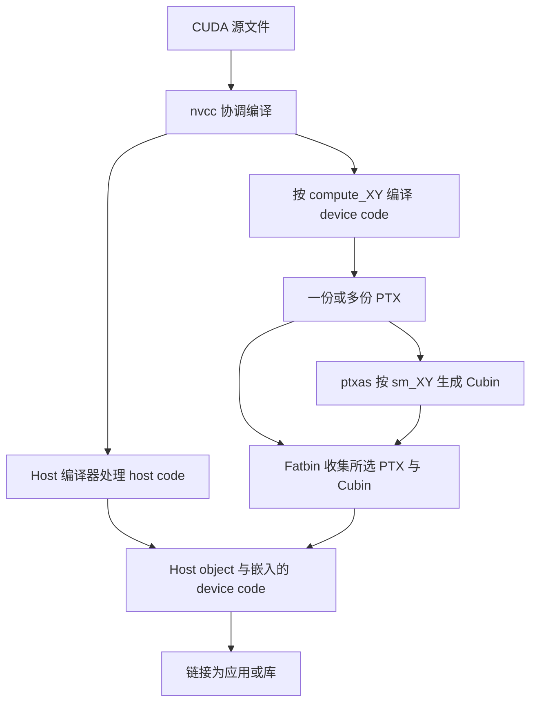

## 2.7. NVCC: The NVIDIA CUDA Compiler（NVCC：NVIDIA CUDA 编译器）

> The NVIDIA CUDA Compiler `nvcc` is a toolchain from NVIDIA for compiling CUDA C/C++ as well as PTX code. The toolchain is part of the CUDA Toolkit and consists of several tools, including the compiler, linker, and the PTX and Cubin assemblers. The top-level `nvcc` tool coordinates the compilation process, invoking the appropriate tool for each stage of compilation.

NVIDIA CUDA Compiler（`nvcc`）是 NVIDIA 提供的工具链，用于编译 CUDA C/C++ 以及 PTX 代码。该工具链属于 CUDA Toolkit，包含编译器、链接器以及 PTX 和 Cubin 汇编器等多个工具。顶层的 `nvcc` 工具负责协调编译过程，在每个编译阶段调用适当的工具。

> `nvcc` drives offline compilation of CUDA code, in contrast to online or Just-in-Time (JIT) compilation driven by the CUDA runtime compiler `nvrtc`.

`nvcc` 驱动 CUDA 代码的离线编译，与 CUDA Runtime Compiler（`nvrtc`）驱动的在线编译或 Just-in-Time（JIT，即时）编译相对应。

> This chapter covers the most common uses and details of `nvcc` needed for building applications. Full coverage of `nvcc` is found in the `nvcc` documentation.

本章介绍构建应用时最常用的 `nvcc` 用法及相关细节。关于 `nvcc` 的完整说明，参见 `nvcc` 文档。

**解读：** `nvcc` 是编译流程的入口，负责调度不同阶段的工具；理解它时，要区分“host 代码由谁编译”“device 代码生成什么格式”以及“最终如何链接”这三个问题。

### 2.7.1. CUDA Source Files and Headers（CUDA 源文件与头文件）

> Source files compiled with `nvcc` may contain a combination of host code, which executes on the CPU, and device code that executes on the GPU. `nvcc` accepts the common C/C++ source file extensions `.c`, `.cpp`, `.cc`, `.cxx` for host-only code and `.cu` for files that contain device code or a mix of host and device code. Headers containing device code typically adopt the `.cuh` extension to distinguish them from host-only code headers `.h`, `.hpp`, `.hh`, `.hxx`, etc.

使用 `nvcc` 编译的源文件可以同时包含在 CPU 上执行的 host code，以及在 GPU 上执行的 device code。对于只包含 host code 的文件，`nvcc` 接受常见的 C/C++ 扩展名 `.c`、`.cpp`、`.cc` 和 `.cxx`；对于包含 device code 或混合 host/device code 的文件，则使用 `.cu`。包含 device code 的头文件通常采用 `.cuh` 扩展名，以便与 `.h`、`.hpp`、`.hh`、`.hxx` 等只包含 host code 的头文件区分。

> | File Extension | Description | Content |
> | --- | --- | --- |
> | `.c` | C source file | Host-only code |
> | `.cpp`, `.cc`, `.cxx` | C++ source file | Host-only code |
> | `.h`, `.hpp`, `.hh`, `.hxx` | C/C++ header file | Device code, host code, mix of host/device code |
> | `.cu` | CUDA source file | Device code, host code, mix of host/device code |
> | `.cuh` | CUDA header file | Device code, host code, mix of host/device code |

| 文件扩展名 | 说明 | 内容 |
| --- | --- | --- |
| `.c` | C 源文件 | 仅 host code |
| `.cpp`, `.cc`, `.cxx` | C++ 源文件 | 仅 host code |
| `.h`, `.hpp`, `.hh`, `.hxx` | C/C++ 头文件 | Device code、host code，或二者混合 |
| `.cu` | CUDA 源文件 | Device code、host code，或二者混合 |
| `.cuh` | CUDA 头文件 | Device code、host code，或二者混合 |

**解读：** `.cuh` 是区分 CUDA 头文件的常用命名约定。原文表格同时允许普通 `.h` 等头文件包含 device code，因此不能仅凭头文件扩展名判断它能否交给普通 C++ 编译器；还要看内容以及包含它的编译单元。

### 2.7.2. NVCC Compilation Workflow（NVCC 编译流程）

> In the initial phase, `nvcc` separates the device code from the host code and dispatches their compilation to the GPU and the host compilers, respectively.

在初始阶段，`nvcc` 将 device code 与 host code 分离，并将它们分别交给 GPU 编译器和 host 编译器进行编译。

- > To compile the host code, the CUDA compiler `nvcc` requires a compatible host compiler to be available. The CUDA Toolkit defines the host compiler support policy for Linux and Windows platforms.

  为了编译 host code，CUDA 编译器 `nvcc` 需要一个兼容的 host 编译器。CUDA Toolkit 规定了 Linux 和 Windows 平台上受支持的 host 编译器策略。

- > Files containing only host code can be built using either `nvcc` or the host compiler directly. The resulting object files can be combined with object files from `nvcc` which contain GPU code at link-time.

  只包含 host code 的文件既可以使用 `nvcc` 构建，也可以直接使用 host 编译器构建。生成的 object file（目标文件）可以在链接阶段与 `nvcc` 生成的、包含 GPU 代码的 object file 合并。

- > The GPU compiler compiles the C/C++ device code to PTX assembly code. The GPU compiler is run for each virtual machine instruction set architecture (e.g. `compute_90`) specified in the compilation command line.

  GPU 编译器将 C/C++ device code 编译为 PTX 汇编代码。对于编译命令行指定的每一种虚拟机指令集架构，例如 `compute_90`，都会运行一次 GPU 编译器。

- > Individual PTX code is then passed to the `ptxas` tool, which generates Cubin for the target hardware ISAs. The hardware ISA is identified by its SM version.

  各份 PTX 代码随后传给 `ptxas` 工具，由它为目标硬件 ISA 生成 Cubin。硬件 ISA 通过其 SM 版本标识。

- > It is possible to embed multiple PTX and Cubin targets into a single binary Fatbin container within an application or library so that a single binary can support multiple virtual and target hardware ISAs.

  可以将多个 PTX 和 Cubin 目标嵌入应用或库中的单个 Fatbin 二进制容器，使同一个二进制文件支持多种虚拟架构和目标硬件 ISA。

> The invocation and coordination of the tools described above are done automatically by `nvcc`. The `-v` option can be used to display the full compilation workflow and tool invocation. The `-keep` option can be used to save the intermediate files generated during the compilation in the current directory or in the directory specified by `--keep-dir` instead.

上述工具的调用与协调由 `nvcc` 自动完成。使用 `-v` 选项可以显示完整编译流程和工具调用。使用 `-keep` 选项可以将编译过程中生成的中间文件保存在当前目录，也可以通过 `--keep-dir` 指定其他目录。

**解读：** `compute_XY` 表示编译 device code 时采用的虚拟架构，`sm_XY` 表示 Cubin 面向的硬件目标。PTX 与 Cubin 可以同时装入 Fatbin，所以一个程序能携带多个架构的 device code。`-v` 用于观察调用过程，`-keep` 用于保留中间结果，两者分别回答“调用了什么工具”和“各阶段生成了什么文件”。

> The following example illustrates the compilation workflow for a CUDA source file `example.cu`:

下面的示例展示了 CUDA 源文件 `example.cu` 的编译流程：

```cpp
// ----- example.cu -----
#include <stdio.h>
__global__ void kernel() {
    printf("Hello from kernel\n");
}

void kernel_launcher() {
    kernel<<<1, 1>>>();
    cudaDeviceSynchronize();
}

int main() {
    kernel_launcher();
    return 0;
}
```

> `nvcc` basic compilation workflow:

`nvcc` 的基本编译流程：

> High-level `nvcc` flow

`nvcc` 高层流程。

> `nvcc` compilation workflow with multiple PTX and Cubin architectures:

面向多个 PTX 和 Cubin 架构的 `nvcc` 编译流程：

> High-level `nvcc` flow multiple architectures

面向多架构的 `nvcc` 高层流程。

**整理说明：** 粘贴文本提供了两幅流程图的说明和标题，未包含图片；上述英文均已保留。下面依据本节文字绘制简化示意，便于理解 host 与 device 编译路径，非原图复原。



> A more detailed description of the `nvcc` compilation workflow can be found in the compiler documentation.

关于 `nvcc` 编译流程的更详细说明，参见编译器文档。

### 2.7.3. NVCC Basic Usage（NVCC 基本用法）

> The basic command to compile a CUDA source file with `nvcc` is:

使用 `nvcc` 编译 CUDA 源文件的基本命令如下：

```bash
nvcc <source_file>.cu -o <output_file>
```

> `nvcc` accepts common compiler flags used for specifying include directories `-I <path>` and library paths `-L <path>`, linking against other libraries `-l<library>`, and defining macros `-D<macro>=<value>`.

`nvcc` 接受常见编译器选项：用 `-I <path>` 指定头文件搜索目录，用 `-L <path>` 指定库搜索路径，用 `-l<library>` 链接其他库，以及用 `-D<macro>=<value>` 定义宏。

```bash
nvcc example.cu -I path_to_include/ -L path_to_library/ -lcublas -o <output_file>
```

#### 2.7.3.1. NVCC PTX and Cubin Generation（使用 NVCC 生成 PTX 与 Cubin）

> By default, `nvcc` generates PTX and Cubin for the earliest GPU architecture (lowest `compute_XY` and `sm_XY` version) supported by the CUDA Toolkit to maximize compatibility.

默认情况下，为了尽可能提高兼容性，`nvcc` 会为 CUDA Toolkit 支持的最早 GPU 架构，即最低的 `compute_XY` 和 `sm_XY` 版本，生成 PTX 与 Cubin。

**解读（版本范围）：** 默认目标和支持列表应以实际安装的 Toolkit 为准。此处保留原文的默认行为说明；若要明确程序面向哪些 GPU，构建命令应显式指定目标，而不是依赖默认值。

> The `-arch` option can be used to generate PTX and Cubin for a specific GPU architecture.

可以使用 `-arch` 选项为特定 GPU 架构生成 PTX 与 Cubin。

> The `-gencode` option can be used to generate PTX and Cubin for multiple GPU architectures.

可以使用 `-gencode` 选项为多个 GPU 架构生成 PTX 与 Cubin。

> The complete list of supported virtual and real GPU architectures can be obtained by passing the `--list-gpu-code` and `--list-gpu-arch` flags respectively, or by referring to the Virtual Architecture List and the GPU Architecture List sections within the `nvcc` documentation.

可以分别传入 `--list-gpu-code` 和 `--list-gpu-arch`，获取支持的虚拟架构与真实 GPU 架构的完整列表；也可以查阅 `nvcc` 文档中的 Virtual Architecture List（虚拟架构列表）和 GPU Architecture List（GPU 架构列表）小节。

**解读（原文勘误）：** 这句话中 virtual 与 real 的对应顺序写反了。下方命令注释给出了正确对应：`--list-gpu-code` 列出 real GPU architecture，`--list-gpu-arch` 列出 virtual GPU architecture。

```bash
nvcc --list-gpu-code # list all supported real GPU architectures
nvcc --list-gpu-arch # list all supported virtual GPU architectures
```

```bash
nvcc example.cu -arch=compute_<XY> # e.g. -arch=compute_80 for NVIDIA Ampere GPUs and later
                                   # PTX-only, GPU forward compatible

nvcc example.cu -arch=sm_<XY>      # e.g. -arch=sm_80 for NVIDIA Ampere GPUs and later
                                   # PTX and Cubin, GPU forward compatible

nvcc example.cu -arch=native       # automatically detects and generates Cubin for the current GPU
                                   # no PTX, no GPU forward compatibility

nvcc example.cu -arch=all          # generate Cubin for all supported GPU architectures
                                   # also includes the latest PTX for GPU forward compatibility

nvcc example.cu -arch=all-major    # generate Cubin for all major supported GPU architectures, e.g. sm_80, sm_90,
                                   # also includes the latest PTX for GPU forward compatibility
```

**解读：** 这里的“PTX-only”指嵌入的 device code 形式，不表示输出一定是独立的 `.ptx` 文件；输出 PTX 文件使用 `-ptx`。PTX 可留给驱动 JIT 生成机器码。参见 [NVCC 编译阶段与代码生成](https://docs.nvidia.com/cuda/cuda-compiler-driver-nvcc/index.html)。

> More advanced usage allows PTX and Cubin targets to be specified individually:

更高级的用法允许分别指定 PTX 与 Cubin 目标：

```bash
# generate PTX for virtual architecture compute_80 and compile it to Cubin for real architecture sm_86, keep compute_80 PTX
nvcc example.cu -arch=compute_80 -gpu-code=sm_86,compute_80 # (PTX and Cubin)

# generate PTX for virtual architecture compute_80 and compile it to Cubin for real architecture sm_86, sm_89
nvcc example.cu -arch=compute_80 -gpu-code=sm_86,sm_89    # (no PTX)
nvcc example.cu -gencode=arch=compute_80,code=sm_86,sm_89 # same as above

# (1) generate PTX for virtual architecture compute_80 and compile it to Cubin for real architecture sm_86, sm_89
# (2) generate PTX for virtual architecture compute_90 and compile it to Cubin for real architecture sm_90
nvcc example.cu -gencode=arch=compute_80,code=sm_86,sm_89 -gencode=arch=compute_90,code=sm_90
```

**解读（命令写法）：** 原命令中的 `-gpu-code` 应按文档写为 `--gpu-code` 或 `-code`；多个 `-gencode` 的 `code` 目标建议明确写成 `code=[sm_86,sm_89]`。以上保留原命令供对照。参见 [NVCC 代码生成选项](https://docs.nvidia.com/cuda/cuda-compiler-driver-nvcc/index.html)。

> The full reference of `nvcc` command-line options for steering GPU code generation can be found in the `nvcc` documentation.

关于控制 GPU 代码生成的 `nvcc` 命令行选项，完整参考说明见 `nvcc` 文档。

#### 2.7.3.2. Host Code Compilation Notes（Host Code 编译说明）

> Compilation units, namely a source file and its headers, that do not contain device code or symbols can be compiled directly with a host compiler. If any compilation unit uses CUDA runtime API functions, the application must be linked with the CUDA runtime library. The CUDA runtime is available as both a static and a shared library, `libcudart_static` and `libcudart`, respectively. By default, `nvcc` links against the static CUDA runtime library. To use the shared library version of the CUDA runtime, pass the flag `--cudart=shared` to `nvcc` on the compile or link command.

不包含 device code 或 device symbol 的 compilation unit（编译单元，即源文件及其包含的头文件），可以直接使用 host 编译器编译。如果任何编译单元使用了 CUDA Runtime API 函数，应用就必须链接 CUDA Runtime library。CUDA Runtime 同时提供静态库和共享库，分别为 `libcudart_static` 和 `libcudart`。默认情况下，`nvcc` 链接静态 CUDA Runtime library。若要使用共享库版本，可以在 `nvcc` 编译或链接命令中传入 `--cudart=shared`。

> `nvcc` allows the host compiler used for host functions to be specified via the `-ccbin <compiler>` argument. The environment variable `NVCC_CCBIN` can also be defined to specify the host compiler used by `nvcc`. The `-Xcompiler` argument to `nvcc` passes through arguments to the host compiler. For example, in the example below, the `-O3` argument is passed to the host compiler by `nvcc`.

`nvcc` 允许通过 `-ccbin <compiler>` 参数指定编译 host function 所用的 host 编译器，也可以定义环境变量 `NVCC_CCBIN` 来指定。`nvcc` 的 `-Xcompiler` 参数会将参数转交给 host 编译器。例如，下面的示例会由 `nvcc` 将 `-O3` 参数传给 host 编译器。

```bash
nvcc example.cu -ccbin=clang++

export NVCC_CCBIN='gcc'
nvcc example.cu -Xcompiler=-O3
```

**解读（环境范围）：** `export NVCC_CCBIN='gcc'` 是 Bash 等 shell 的写法，不能直接当作 PowerShell 命令使用。指定编译器路径也不会自动使该编译器版本与所用 CUDA Toolkit 兼容。本节代码和命令仅做整理与静态检查，未在本机执行。

#### 2.7.3.3. Separate Compilation of GPU Code（GPU 代码的分离编译）

> `nvcc` defaults to whole-program compilation, which expects all GPU code and symbols to be present in the compilation unit that uses them. CUDA device functions may call device functions or access device variables defined in other compilation units, but either the `-rdc=true` or its alias the `-dc` flag must be specified on the `nvcc` command line to enable linking of device code from different compilation units. The ability to link device code and symbols from different compilation units is called separate compilation.

`nvcc` 默认采用 whole-program compilation（整程序编译），要求使用 GPU 代码和符号的编译单元包含它们的全部定义。CUDA device function 可以调用其他编译单元定义的 device function，或访问其中定义的 device variable，但必须在 `nvcc` 命令行中指定 `-rdc=true` 或其别名 `-dc`，以启用来自不同编译单元的 device code 的链接能力。链接不同编译单元中的 device code 和 symbol 的能力，称为 separate compilation（分离编译）。

**解读（选项区别）：** `-dc` 等价于 `-rdc=true -c`，还包含“只编译为 object file”的含义，并非单独 `-rdc=true` 的完全同义选项。参见 [NVCC 的 device compilation 选项](https://docs.nvidia.com/cuda/cuda-compiler-driver-nvcc/index.html)。

> Separate compilation allows more flexible code organization, can improve compile time, and can lead to smaller binaries. Separate compilation may involve some build-time complexity compared to whole-program compilation. Performance can be affected by the use of device code linking, which is why it is not used by default. Link-Time Optimization (LTO) can help reduce the performance overhead of separate compilation.

Separate compilation 允许更灵活地组织代码，可以缩短编译时间，也可能生成更小的二进制文件。与 whole-program compilation 相比，它可能增加构建过程的复杂度。Device code linking 可能影响性能，因此默认并未启用。Link-Time Optimization（LTO，链接时优化）可以帮助降低分离编译带来的性能开销。

> Separate compilation requires the following conditions:

Separate compilation 需要满足以下条件：

- > Non-const device variables defined in one compilation unit must be referred to with the extern keyword in other compilation units.

  在一个编译单元中定义的非 `const` device variable，必须在其他编译单元中通过 `extern` 关键字引用。

- > All const device variables must be defined and referred to with the extern keyword.

  所有 `const` device variable 都必须使用 `extern` 关键字进行定义和引用。

- > All CUDA source files `.cu` must be compiled with the `-dc` or `-rdc=true` flags.

  所有 CUDA 源文件 `.cu` 都必须使用 `-dc` 或 `-rdc=true` 选项编译。

> Host and device functions have external linkage by default and do not require the extern keyword. Note that starting from CUDA 13, `__global__` functions and `__managed__`/`__device__`/`__constant__` variables have internal linkage by default.

Host function 和 device function 默认具有 external linkage（外部链接属性），不需要 `extern` 关键字。注意：从 CUDA 13 开始，`__global__` function 以及 `__managed__`、`__device__`、`__constant__` variable 默认具有 internal linkage（内部链接属性）。

**解读：** Linkage 决定其他编译单元能否引用某个符号，`extern` 不会把 device variable 变成 host variable。原文关于 CUDA 13 的说明影响跨文件引用的正确性，因此必须保留；前面的默认规则也要结合这条例外阅读。后面用 `extern __device__ int device_variable = 5;` 定义变量，用不带初始化器的 `extern` 声明引用它。

> In the following example, `definition.cu` defines a variable and a function, while `example.cu` refers to them. Both files are compiled separately and linked into the final binary.

在下面的示例中，`definition.cu` 定义了一个变量和一个函数，`example.cu` 引用它们。两个文件分别编译，然后链接为最终的二进制文件。

```cpp
// ----- definition.cu -----
extern __device__ int device_variable = 5;
__device__        int device_function() { return 10; }
```

```cpp
// ----- example.cu -----
extern __device__ int  device_variable;
__device__        int device_function();

__global__ void kernel(int* ptr) {
    device_variable = 0;
    *ptr            = device_function();
}
```

```bash
nvcc -dc definition.cu -o definition.o
nvcc -dc example.cu    -o example.o
nvcc definition.o example.o -o program
```

**解读（示例边界）：** 这两个片段没有 `main`，因此仅凭它们和上述命令，无法完成普通可执行程序的链接。它们演示的是跨编译单元的 device 符号引用；要生成并运行程序，还需提供 host 入口、合法的 device 输出地址以及 kernel 启动和同步逻辑。链接成功也不等于 kernel 已经执行。

### 2.7.4. Common Compiler Options（常用编译器选项）

> This section presents the most relevant compiler options that can be used with `nvcc`, covering language features, optimization, debugging, profiling, and build aspects. The full description of all options can be found in the `nvcc` documentation.

本节介绍 `nvcc` 最相关的一些编译器选项，涵盖语言功能、优化、调试、性能分析以及构建。所有选项的完整说明见 `nvcc` 文档。

#### 2.7.4.1. Language Features（语言功能）

> `nvcc` supports the C++ core language features, from C++03 to C++23 Language Features. The `-std` flag can be used to specify the language standard to use:

`nvcc` 支持从 C++03 到 C++23 的 C++ 核心语言功能。可以使用 `-std` 选项指定采用的语言标准：

```text
--std={c++03|c++11|c++14|c++17|c++20|c++23}
```

> In addition, `nvcc` supports the following language extensions:

此外，`nvcc` 还支持以下语言扩展：

- > `-restrict`: Assert that all kernel pointer parameters are restrict pointers.

  `-restrict`：声明所有 kernel 指针参数都是 restrict pointer。

- > `-extended-lambda`: Allow `__host__`, `__device__` annotations in lambda declarations.

  `-extended-lambda`：允许在 lambda 声明中使用 `__host__` 和 `__device__` 标注。

- > `-expt-relaxed-constexpr`: (Experimental flag) Allow host code to invoke `__device__` constexpr functions, and device code to invoke `__host__` constexpr functions.

  `-expt-relaxed-constexpr`：实验性选项，允许 host code 调用 `__device__ constexpr` function，也允许 device code 调用 `__host__ constexpr` function。

> More detail on these features can be found in the extended lambda and constexpr sections.

关于这些功能的更多细节，参见 extended lambda 和 constexpr 小节。

**解读：** `-restrict` 是程序员对指针使用关系作出的承诺，不能为了优化随意启用。两种函数标注扩展则影响哪些调用或 lambda 声明被允许，不意味着任意 host 功能都可以搬到 device 上运行。

#### 2.7.4.2. Debugging Options（调试选项）

> `nvcc` supports the following options to generate debug information:

`nvcc` 支持使用以下选项生成调试信息：

- > `-g`: Generate debug information for host code. gdb/lldb and similar tools rely on such information for host code debugging.

  `-g`：为 host code 生成调试信息。`gdb`、`lldb` 及类似工具依赖这些信息调试 host code。

- > `-G`: Generate debug information for device code. `cuda-gdb` relies on such information for device-code debugging. The flag also defines the `__CUDACC_DEBUG__` macro.

  `-G`：为 device code 生成调试信息。`cuda-gdb` 依赖这些信息调试 device code。该选项还会定义 `__CUDACC_DEBUG__` 宏。

- > `-lineinfo`: Generate line-number information for device code. This option does not affect execution performance and is useful in conjunction with the `compute-sanitizer` tool to trace the kernel execution.

  `-lineinfo`：为 device code 生成行号信息。该选项不影响执行性能，并且可以配合 `compute-sanitizer` 工具追踪 kernel 执行情况。

> `nvcc` uses the highest optimization level `-O3` for GPU code by default. The debug flag `-G` prevents some compiler optimizations, and so debug code is expected to have lower performance than non-debug code. The `-DNDEBUG` flag can be defined to disable runtime assertions, as these can also slow down execution.

`nvcc` 默认对 GPU 代码使用最高的 `-O3` 优化级别。调试选项 `-G` 会阻止部分编译器优化，因此调试代码的性能预计低于非调试代码。还可以指定 `-DNDEBUG` 来禁用运行时断言，因为断言也可能降低执行速度。

**解读（优化层次）：** `nvcc -O` 控制 host 优化，不宜把原文的 GPU 默认优化描述理解为同一个开关。性能测量还应留意 `-G` 对优化的影响。参见 [NVCC 优化选项](https://docs.nvidia.com/cuda/cuda-compiler-driver-nvcc/index.html)。

#### 2.7.4.3. Optimization Options（优化选项）

> `nvcc` provides many options for optimizing performance. This section aims to provide a brief survey of some of the options available that developers may find useful, as well as links to further information. Complete coverage can be found in the `nvcc` documentation.

`nvcc` 提供了许多优化性能的选项。本节简要介绍开发者可能用到的一些选项，并提供进一步信息的链接。完整说明见 `nvcc` 文档。

- > `-Xptxas` passes arguments to the PTX assembler tool `ptxas`. The `nvcc` documentation provides a list of useful arguments for `ptxas`. For example, `-Xptxas=-maxrregcount=N` specifies the maximum number of registers to use, per thread.

  `-Xptxas` 将参数传给 PTX 汇编器 `ptxas`。`nvcc` 文档列出了 `ptxas` 的一些实用参数。例如，`-Xptxas=-maxrregcount=N` 指定每个 thread 最多使用的 register 数量。

- > `-extra-device-vectorization`: Enables more aggressive device code vectorization.

  `-extra-device-vectorization`：启用更积极的 device code 向量化。

- > `--apply-controls=/path/to/file` passes an advanced controls file (ACF) into `nvcc` and `ptxas`. This file changes the default compilation behavior, and makes it more targeted for a specific workload. Using an advanced controls file may cause compilation failure or incorrect runtime execution. Use at your own risk. See the CompileIQ Github page for more information on how to generate advanced controls files.

  `--apply-controls=/path/to/file` 将 advanced controls file（ACF，高级控制文件）传给 `nvcc` 和 `ptxas`。该文件会改变默认编译行为，使编译更有针对性地服务于某种特定 workload。使用 ACF 可能导致编译失败或运行结果不正确，风险由使用者自行承担。关于如何生成 ACF，参见 CompileIQ GitHub 页面。

> Additional flags which provide fine-grained control over floating point behavior are covered in the Floating-Point Computation section and in the `nvcc` documentation.

用于精细控制浮点行为的其他选项，在 Floating-Point Computation（浮点计算）一节和 `nvcc` 文档中介绍。

> The following flags get output from the compiler which can be useful in more advanced code optimization:

以下选项让编译器输出有助于进一步优化代码的信息：

- > `-res-usage`: Print resource usage report after compilation. It includes the number of registers, shared memory, constant memory, and local memory allocated for each kernel function.

  `-res-usage`：编译后打印资源使用报告，包括为每个 kernel function 分配的 register 数量，以及 shared memory、constant memory 和 local memory 的用量。

- > `-opt-info=inline`: Print information about inlined functions.

  `-opt-info=inline`：打印关于函数内联的信息。

- > `-Xptxas=-warn-lmem-usage`: Warn if local memory is used.

  `-Xptxas=-warn-lmem-usage`：使用 local memory 时给出警告。

- > `-Xptxas=-warn-spills`: Warn if registers are spilled to local memory.

  `-Xptxas=-warn-spills`：register spill 到 local memory 时给出警告。

**解读：** 这些选项既包括改变代码生成的控制，也包括帮助观察结果的报告。限制 register 数量后，仍需结合 spill、local memory 使用情况和实际运行时间判断结果；单独看到 register 数量降低，不能证明 kernel 更快。编译器资源报告描述编译结果，不能替代性能测量。

#### 2.7.4.4. Link-Time Optimization (LTO)（链接时优化（LTO））

> Separate compilation can result in lower performance than whole-program compilation due to limited cross-file optimization opportunities. Link-Time Optimization (LTO) addresses this by performing optimizations across separately compiled files at link time, at the cost of increased compilation time. LTO can recover much of the performance of whole-program compilation while maintaining the flexibility of separate compilation.

Separate compilation 的跨文件优化机会有限，因此性能可能低于 whole-program compilation。LTO 在链接时跨越分别编译的文件进行优化，以解决这一问题，代价是编译时间增加。LTO 可以在保留分离编译灵活性的同时，恢复整程序编译所能达到的很大一部分性能。

> `nvcc` requires the `-dlto` flag or `lto_<SM version>` link-time optimization targets to enable LTO:

`nvcc` 需要使用 `-dlto` 选项或 `lto_<SM version>` 链接时优化目标来启用 LTO：

```bash
nvcc -dc -dlto -arch=sm_100 definition.cu -o definition.o
nvcc -dc -dlto -arch=sm_100 example.cu    -o example.o
nvcc -dlto definition.o example.o -o program
```

```bash
nvcc -dc -arch=lto_100 definition.cu -o definition.o
nvcc -dc -arch=lto_100 example.cu    -o example.o
nvcc -dlto definition.o example.o -o program
```

**解读：** 两组命令是两种启用 LTO 的方式。共同点是编译阶段准备可供链接时优化的信息，链接阶段再启用 `-dlto`。本例沿用了前面的文件名，也继承了缺少 `main` 的示例边界；不能把这几条构建命令视为一个完整可运行项目。

#### 2.7.4.5. Profiling Options（性能分析选项）

> It is possible to directly profile a CUDA application using the Nsight Compute and Nsight Systems tools without the need for additional flags during the compilation process. However, additional information which can be generated by `nvcc` can assist profiling by correlating source files with the generated code:

无需在编译过程中加入额外选项，就可以直接使用 Nsight Compute 和 Nsight Systems 分析 CUDA 应用的性能。不过，`nvcc` 生成的额外信息可以建立源文件与生成代码之间的对应关系，从而辅助性能分析：

- > `-lineinfo`: Generate line-number information for device code; this allows viewing the source code in the profiling tools. Profiling tools require the original source code to be available in the same location where the code was compiled.

  `-lineinfo`：为 device code 生成行号信息，使性能分析工具能够显示源代码。这些工具要求原始源代码位于编译代码时所在的相同位置。

- > `-src-in-ptx`: Keep the original source code in the PTX, avoiding the limitations of `-lineinfo` mentioned above. Requires `-lineinfo`.

  `-src-in-ptx`：将原始源代码保留在 PTX 中，避免上面提到的 `-lineinfo` 的限制。该选项需要同时使用 `-lineinfo`。

**解读：** Profiling 关注运行时行为，源码行信息帮助把性能现象对应到源代码；这与为了单步调试而生成 device debug 信息是不同用途。`-src-in-ptx` 保留源码内容，适合进一步查看 PTX 与源代码的对应关系。

#### 2.7.4.6. Fatbin Compression（Fatbin 压缩）

> `nvcc` compresses the fatbins stored in application or library binaries by default. Fatbin compression can be controlled using the following options:

`nvcc` 默认会压缩应用或库的二进制文件中存储的 fatbin。可以使用以下选项控制 fatbin 压缩：

- > `-no-compress`: Disable the compression of the fatbin.

  `-no-compress`：禁用 fatbin 压缩。

- > `--compress-mode={default|size|speed|balance|none}`: Set the compression mode. speed focuses on fast decompression time, while size aims at reducing the fatbin size. balance provides a trade-off between speed and size. The default mode is speed. none disables compression.

  `--compress-mode={default|size|speed|balance|none}`：设置压缩模式。`speed` 注重较快的解压速度，`size` 旨在减小 fatbin 大小，`balance` 在速度和大小之间进行折中。默认模式为 `speed`，`none` 表示禁用压缩。

**解读：** Fatbin 压缩优化的是二进制体积及装载时的解压成本，不是 kernel 的算术执行本身。架构目标较多时，这种体积与解压时间的取舍尤其值得和构建目标一起考虑。

#### 2.7.4.7. Compiler Performance Controls（编译器性能控制）

> `nvcc` provides options to analyze and accelerate the compilation process itself:

`nvcc` 提供了用于分析和加速编译过程本身的选项：

- > `-t <N>`: The number of CPU threads used to parallelize the compilation of a single compilation unit for multiple GPU architectures.

  `-t <N>`：在为多个 GPU 架构编译单个编译单元时，使用的 CPU 并行线程数量。

- > `-split-compile <N>`: The number of CPU threads used to parallelize the optimization phase.

  `-split-compile <N>`：用于并行执行优化阶段的 CPU 线程数量。

- > `-split-compile-extended <N>`: More aggressive form of split compilation. Requires link-time optimization.

  `-split-compile-extended <N>`：更积极的 split compilation 形式，需要启用 LTO。

- > `-Ofc <N>`: Level of device code compilation speed.

  `-Ofc <N>`：device code 的快速编译级别。

**解读（参数取值）：** 原文的 `<N>` 不应理解为任意数字；当前文档列出 `max`、`mid`、`min`、`0`，快速编译会减少部分优化。参见 [NVCC 快速编译级别](https://docs.nvidia.com/cuda/cuda-compiler-driver-nvcc/index.html)。

- > `-time <filename>`: Generate a comma-separated value (CSV) table with the time taken by each compilation phase.

  `-time <filename>`：生成 CSV 表格，记录每个编译阶段耗费的时间。

- > `-fdevice-time-trace`: Generate a time trace for device code compilation.

  `-fdevice-time-trace`：为 device code 编译生成时间跟踪记录。

**解读：** 本小节优化的是编译过程耗时，需要与生成程序的运行性能分别衡量。多架构编译并行、优化阶段并行和减少优化工作量是不同手段；时间报告可以帮助先定位最耗时的编译阶段，再选择相应选项。

