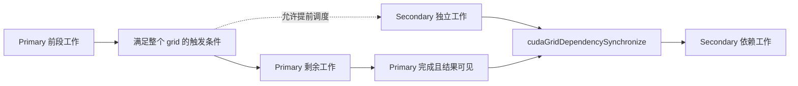

## 3.1. Advanced CUDA APIs and Features（高级 CUDA API 与功能）

> This section will cover use of more advanced CUDA APIs and features. These topics cover techniques or features that do not usually require CUDA kernel modifications, but can still influence, from the host-side, application-level behavior, both in terms of GPU work execution and performance as well as CPU-side performance.

本节介绍更高级的 CUDA API 和功能。这些技术或功能通常不要求修改 CUDA kernel，但仍能从 host 侧影响应用层面的行为，既包括 GPU 工作的执行与性能，也包括 CPU 侧的性能。

### 3.1.1. cudaLaunchKernelEx（可扩展的 Kernel 启动接口）

> When the triple chevron notation was introduced in first versions of, the Kernel Configuration of a kernel had only four programmable parameters:

在早期版本引入 triple chevron notation（三重尖括号启动语法）时，kernel 的 Kernel Configuration（启动配置）只有四个可编程参数：

- > thread block dimensions

  Thread block 的维度。

- > grid dimensions

  Grid 的维度。

- > dynamic shared-memory (optional, 0 if unspecified)

  Dynamic shared memory 的大小，可选；未指定时为 0。

- > stream (default stream used if unspecified)

  Stream；未指定时使用 default stream。

> Some CUDA features can benefit from additional attributes and hints provided with a kernel launch. The `cudaLaunchKernelEx` enables a program to set the above mentioned execution configuration parameters via the `cudaLaunchConfig_t` structure. In addition, the `cudaLaunchConfig_t` structure allows the program to pass in zero or more `cudaLaunchAttributes` to control or suggest other parameters for the kernel launch. For example, the `cudaLaunchAttributePreferredSharedMemoryCarveout` discussed later in this chapter (see Configuring L1/Shared Memory Balance) is specified using `cudaLaunchKernelEx`. The `cudaLaunchAttributeClusterDimension` attribute, discussed later in this chapter, is used to specify the desired cluster size for the kernel launch.

某些 CUDA 功能可以利用 kernel 启动时提供的额外 attribute 和 hint。`cudaLaunchKernelEx` 允许程序通过 `cudaLaunchConfig_t` 结构体设置上述执行配置参数。此外，该结构体还允许程序传入零个或多个 `cudaLaunchAttributes`，以控制 kernel 启动的其他参数，或为它们提供建议。例如，本章后文讨论的 `cudaLaunchAttributePreferredSharedMemoryCarveout`（参见 Configuring L1/Shared Memory Balance，即配置 L1 与 shared memory 的容量平衡）通过 `cudaLaunchKernelEx` 指定。本章后文还会介绍 `cudaLaunchAttributeClusterDimension`，用它指定 kernel 启动时所需的 cluster 大小。

> The complete list of supported attributes and their meaning is captured in the CUDA Runtime API Reference Documentation.

支持的 attribute 完整列表及其含义，见 CUDA Runtime API Reference Documentation。

**解读：** `cudaLaunchKernelEx` 把基本启动配置和扩展属性放入结构体，便于逐次启动时调整参数。属性需要区分“必须满足的配置”和“运行时可选择是否采纳的偏好”。原文中的 `cudaLaunchAttributes` 是泛称，示例实际使用的结构体类型为 `cudaLaunchAttribute`。

### 3.1.2. Launching Clusters（启动 Cluster）

> Thread block clusters, introduced in previous sections, are an optional level of thread block organization available in compute capability 9.0 and higher which enable applications to guarantee that thread blocks of a cluster are simultaneously executed on single GPC. This enables larger groups of threads than those that fit in a single SM to exchange data and synchronize with each other.

前面介绍过的 thread block cluster 是一种可选的 thread block 组织层级，适用于 compute capability 9.0 及更高的设备。它使应用能够保证同一 cluster 的 thread block 在同一个 GPC 上同时执行。因此，比单个 SM 所能容纳的规模更大的线程组，也可以相互交换数据并进行同步。

> Section 2.1.10.1 showed how a kernel which uses clusters can be specified and launched using triple chevron notation. In this section, the `__cluster_dims__` annotation was used to specify the dimensions of the cluster which must be used to launch the kernel. When using triple chevron notation, the size of the clusters is determined implicitly.

第 2.1.10.1 节展示了如何定义使用 cluster 的 kernel，并通过三重尖括号语法启动。在该节中，使用 `__cluster_dims__` 标注指定了启动该 kernel 时必须采用的 cluster 维度。使用三重尖括号语法时，cluster 大小由此隐式确定。

#### 3.1.2.1. Launching with Clusters using cudaLaunchKernelEx（使用 cudaLaunchKernelEx 启动 Cluster）

> Unlike launching kernels using clusters with triple chevron notation, the size of the thread block cluster can be configured on a per-launch basis. The code example below shows how to launch a cluster kernel using `cudaLaunchKernelEx`.

与通过三重尖括号语法启动使用 cluster 的 kernel 不同，这种方式可以针对每次启动配置 thread block cluster 的大小。下面的代码示例展示了如何使用 `cudaLaunchKernelEx` 启动 cluster kernel。

```cpp
// Kernel definition
// No compile time attribute attached to the kernel
__global__ void cluster_kernel(float *input, float* output)
{

}

int main()
{
    float *input, *output;
    dim3 threadsPerBlock(16, 16);
    dim3 numBlocks(N / threadsPerBlock.x, N / threadsPerBlock.y);

    // Kernel invocation with runtime cluster size
    {
        cudaLaunchConfig_t config = {0};
        // The grid dimension is not affected by cluster launch, and is still enumerated
        // using number of blocks.
        // The grid dimension should be a multiple of cluster size.
        config.gridDim = numBlocks;
        config.blockDim = threadsPerBlock;

        cudaLaunchAttribute attribute[1];
        attribute[0].id = cudaLaunchAttributeClusterDimension;
        attribute[0].val.clusterDim.x = 2; // Cluster size in X-dimension
        attribute[0].val.clusterDim.y = 1;
        attribute[0].val.clusterDim.z = 1;
        config.attrs = attribute;
        config.numAttrs = 1;

        cudaLaunchKernelEx(&config, cluster_kernel, input, output);
    }
}
```

**解读（示例边界）：** 这里的 `gridDim` 仍以 block 为单位，cluster 大小为 `(2,1,1)`，所以 grid 的 x 维 block 数必须是 2 的倍数。`N / 16` 使用整数除法；如果它表示对 N×N 数据的完整覆盖，示例隐含了整除要求。原例没有定义 `N`，`input`、`output` 也没有初始化或分配，kernel 本体为空，且未检查启动结果，因此只能作为启动配置示意，不能直接当作完整程序运行。

> There are two `cudaLaunchAttribute` types which are relevant to thread block clusters: `cudaLaunchAttributeClusterDimension` and `cudaLaunchAttributePreferredClusterDimension`.

与 thread block cluster 相关的 `cudaLaunchAttribute` 类型有两个：`cudaLaunchAttributeClusterDimension` 和 `cudaLaunchAttributePreferredClusterDimension`。

> The attribute id `cudaLaunchAttributeClusterDimension` specifies the required dimensions with which to execute the cluster. The value for this attribute, `clusterDim`, is a 3-dimensional value. The corresponding dimensions of the grid (x, y, and z) must be divisible by the respective dimensions of the specified cluster dimension. Setting this is similar to using the `__cluster_dims__` attribute on the kernel definition at compile time as shown in Launching with Clusters in Triple Chevron Notation, but can be changed at runtime for different launches of the same kernel.

Attribute ID `cudaLaunchAttributeClusterDimension` 指定执行 cluster 时必须采用的维度。该属性的值 `clusterDim` 是一个三维值。Grid 的各个对应维度，即 x、y 和 z，必须分别能被所指定 cluster 的对应维度整除。这类似于在编译时通过 kernel 定义中的 `__cluster_dims__` 属性设置 cluster 维度，参见 Launching with Clusters in Triple Chevron Notation；不同之处是这里可以在运行时，为同一个 kernel 的不同启动设置不同的值。

> On GPUs with compute capability of 10.0 and higher, another attribute id `cudaLaunchAttributePreferredClusterDimension` allows the application to additionally specify a preferred dimension for the cluster. The preferred dimension must be an integer multiple of the minimum cluster dimensions specified by the `__cluster_dims__` attribute on the kernel or the `cudaLaunchAttributeClusterDimension` attribute to `cudaLaunchKernelEx`. That is, a minimum cluster dimension must be specified in addition to the preferred cluster dimension. The corresponding dimensions of the grid (x, y, and z) must be divisible by the respective dimension of the specified preferred cluster dimension.

在 compute capability 10.0 及更高的 GPU 上，另一个 attribute ID `cudaLaunchAttributePreferredClusterDimension` 允许应用额外指定 preferred cluster dimension（优选 cluster 维度）。它必须是 kernel 的 `__cluster_dims__` 属性或传给 `cudaLaunchKernelEx` 的 `cudaLaunchAttributeClusterDimension` 属性所指定 minimum cluster dimension（最小 cluster 维度）的整数倍。也就是说，除了 preferred dimension，还必须指定 minimum dimension。Grid 的 x、y、z 各维度，必须分别能被所指定 preferred cluster 的对应维度整除。

> All thread blocks will execute in clusters of at least the minimum cluster dimension. Where possible, clusters of the preferred dimension will be used, but not all clusters are guaranteed to execute with the preferred dimensions. All thread blocks will execute in clusters with either the minimum or preferred cluster dimension. Kernels which use a preferred cluster dimension must be written to operate correctly in either the minimum or the preferred cluster dimension.

所有 thread block 都会在不小于 minimum dimension 的 cluster 中执行。条件允许时，会采用 preferred dimension 的 cluster，但并不保证所有 cluster 都采用 preferred dimension。所有 thread block 所属 cluster 的维度只会是 minimum dimension 或 preferred dimension 两者之一。使用 preferred cluster dimension 的 kernel，必须在这两种 cluster 维度下都能正确运行。

**解读：** Preferred dimension 是性能偏好，minimum dimension 是 kernel 必须支持的基本执行形态。不能把 preferred 当作固定的 cluster 大小，在数据划分或同步逻辑中写死；本段明确要求 kernel 在 minimum 和 preferred 两种大小下都正确。这里的整除关系需要逐维检查，而不是只比较 block 总数。

#### 3.1.2.2. Blocks as Clusters（以 Cluster 为单位指定 Grid）

> When a kernel is defined with the `__cluster_dims__` annotation, the number of clusters in the grid is implicit and can be calculated from the size of the grid divided into the specified cluster size.

使用 `__cluster_dims__` 标注定义 kernel 时，grid 中的 cluster 数量是隐式确定的，可以通过将 grid 大小除以指定的 cluster 大小计算得到。

```cpp
__cluster_dims__((2, 2, 2)) __global__ void foo();

// 8x8x8 clusters each with 2x2x2 thread blocks.
foo<<<dim3(16, 16, 16), dim3(1024, 1, 1)>>>();
```

> In the above example, the kernel is launched as a grid of 16x16x16 thread blocks, which means a grid of 8x8x8 clusters is used.

在上面的示例中，kernel 以包含 16×16×16 个 thread block 的 grid 启动，这意味着采用了一个包含 8×8×8 个 cluster 的 grid。

> A kernel can alternatively use the `__block_size__` annotation, which specifies both the required block size and cluster size at the time the kernel is defined. When this annotation is used, the triple chevron launch becomes the grid dimension in terms of clusters rather than thread blocks, as shown below.

另一种方式是使用 `__block_size__` 标注，在定义 kernel 时同时指定要求的 block 大小和 cluster 大小。使用该标注后，三重尖括号启动语法中的 grid 维度改为以 cluster 为单位，而不是以 thread block 为单位，如下所示。

```cpp
// Implementation detail of how many threads per block and blocks per cluster
// is handled as an attribute of the kernel.
__block_size__((1024, 1, 1), (2, 2, 2)) __global__ void foo();

// 8x8x8 clusters.
foo<<<dim3(8, 8, 8)>>>();
```

> `__block_size__` requires two fields each being a tuple of 3 elements. The first tuple denotes block dimension and second cluster size. The second tuple is assumed to be (1,1,1) if it’s not passed. When specifying a dynamic shared memory size and/or a stream during kernel launch, the second argument in `<<<>>>` must be the placeholder 1. Any other value results in undefined behavior.

`__block_size__` 使用两个字段，每个字段都是包含 3 个元素的 tuple。第一个 tuple 表示 block 维度，第二个表示 cluster 大小。如果未传入第二个 tuple，则默认采用 `(1,1,1)`。在 kernel 启动时指定 dynamic shared memory 大小和／或 stream 的情况下，`<<<>>>` 中的第二个参数必须使用占位值 `1`；任何其他值都会导致 undefined behavior（未定义行为）。

> Note that it is illegal for the second tuple of `__block_size__` and `__cluster_dims__` to be specified at the same time. It’s also illegal to use `__block_size__` with an empty `__cluster_dims__`. When the second tuple of `__block_size__` is specified, it implies the “Blocks as Clusters” being enabled and the compiler would recognize the first argument inside `<<<>>>` as the number of clusters instead of thread blocks.

注意：不能同时指定 `__block_size__` 的第二个 tuple 和 `__cluster_dims__`。也不能将 `__block_size__` 与空的 `__cluster_dims__` 一起使用。指定 `__block_size__` 的第二个 tuple，就意味着启用“Blocks as Clusters”；编译器会将 `<<<>>>` 中的第一个参数理解为 cluster 的数量，而不是 thread block 的数量。

**解读：** 两个示例的实际组织相同：每个 cluster 包含 `2×2×2=8` 个 block，整个 grid 包含 `8×8×8=512` 个 cluster，即 4096 个 block，每个 block 为 1024 个 thread。区别在于启动语法中 grid 参数的计数单位。采用带 cluster tuple 的 `__block_size__` 后，如果还要指定 shared memory 和 stream，形式应为 `foo<<<clusterGrid, 1, sharedBytes, stream>>>()`，其中 `1` 只是占位，block 大小来自定义处的标注。

### 3.1.3. More on Streams and Events（Stream 与 Event 进阶）

> CUDA Streams introduced the basics of CUDA streams. By default, operations submitted on a given CUDA stream are serialized: one cannot start executing until the previous one has completed. The only exception is the recently added Programmatic Dependent Launch and Synchronization feature. Having multiple CUDA streams is a way to enable concurrent execution; another way is using CUDA Graphs. The two approaches can also be combined.

CUDA Streams 一节介绍了 CUDA stream 的基础。默认情况下，提交到同一个 CUDA stream 的操作会串行执行：前一个操作完成后，下一个操作才能开始。唯一的例外是新加入的 Programmatic Dependent Launch and Synchronization 功能。使用多个 CUDA stream 是实现并发执行的一种方式，另一种方式是使用 CUDA Graphs；两者也可以结合使用。

> Work submitted on different CUDA streams may execute concurrently under specific circumstances, e.g., if there are no event dependencies, if there is no implicit synchronization, if there are sufficient resources, etc.

提交到不同 CUDA stream 的工作，在特定条件下可以并发执行，例如不存在 event dependency、不发生 implicit synchronization，并且有足够的执行资源等。

> Independent operations from different CUDA streams cannot run concurrently if any CUDA operation on the NULL stream is submitted in between them, unless the streams are non-blocking CUDA streams. These are streams created with `cudaStreamCreateWithFlags()` runtime API with the `cudaStreamNonBlocking` flag. To improve potential for concurrent GPU work execution, it is recommended that the user creates non-blocking CUDA streams.

如果在不同 CUDA stream 的独立操作之间，向 NULL stream 提交了任何 CUDA 操作，这些独立操作便无法并发执行，除非它们位于 non-blocking CUDA stream 中。Non-blocking stream 是通过 `cudaStreamCreateWithFlags()` Runtime API，并指定 `cudaStreamNonBlocking` flag 创建的 stream。为了增加 GPU 工作并发执行的机会，建议创建 non-blocking CUDA stream。

**解读（默认 Stream 的范围）：** 这里说的是 legacy NULL stream 的隐式同步规则。Per-thread default stream 的语义不同；`cudaStreamNonBlocking` 指的是与 legacy stream 的同步关系，也不保证 stream 中任意 API 对 host 都不阻塞。参见 [Stream synchronization behavior](https://docs.nvidia.com/cuda/cuda-runtime-api/stream-sync-behavior.html)。

> It is also recommended that the user selects the least general synchronization option that is sufficient for their problem. For example, if the requirement is for the CPU to wait (block) for all work on a specific CUDA stream to complete, using `cudaStreamSynchronize()` for that stream would be preferable to `cudaDeviceSynchronize()`, as the latter would unnecessarily wait for GPU work on all CUDA streams of the device to complete. And if the requirement is for the CPU to wait without blocking, then using `cudaStreamQuery()` and checking its return value, in a polling loop, may be preferable.

还建议选择足以满足需求、但范围尽可能小的同步方式。例如，如果需要 CPU 等待并阻塞，直到某个 CUDA stream 上的全部工作完成，那么对该 stream 使用 `cudaStreamSynchronize()` 优于 `cudaDeviceSynchronize()`，因为后者会额外等待该 device 上所有 CUDA stream 的 GPU 工作完成。如果希望 CPU 在等待时不被阻塞，那么在轮询循环中使用 `cudaStreamQuery()` 并检查返回值，可能更合适。

> A similar synchronization effect can also be achieved with CUDA events (CUDA Events), e.g., by recording an event on that stream and calling `cudaEventSynchronize()` to wait, in a blocking manner, for the work captured in that event to complete. Again, this would be preferable and more focused than using `cudaDeviceSynchronize()`. Calling `cudaEventQuery()` and checking its return value, e.g., in a polling loop, would be a non-blocking alternative.

CUDA event 也可以实现类似的同步效果，参见 CUDA Events。例如，在某个 stream 上记录 event，然后调用 `cudaEventSynchronize()`，以阻塞方式等待该 event 捕获的工作完成。同样，这比使用 `cudaDeviceSynchronize()` 更有针对性。另一种非阻塞方式是调用 `cudaEventQuery()` 并检查返回值，例如在轮询循环中进行检查。

> The choice of the explicit synchronization method is particularly important if this operation happens in the application’s critical path. Table 4 provides a high-level summary of various synchronization options with the host.

当同步操作位于应用的 critical path（关键路径）上时，显式同步方式的选择尤其重要。表 4 概括了与 host 同步的各种选项。

> Table 4 Summary of explicit synchronization options with the host

表 4：与 host 进行显式同步的选项汇总。

> |  | Wait for specific stream | Wait for specific event | Wait for everything on the device |
> | --- | --- | --- | --- |
> | Non-blocking (would need a polling loop) | `cudaStreamQuery()` | `cudaEventQuery()` | N/A |
> | Blocking | `cudaStreamSynchronize()` | `cudaEventSynchronize()` | `cudaDeviceSynchronize()` |

| 同步方式 | 等待指定 stream | 等待指定 event | 等待 device 上的全部工作 |
| --- | --- | --- | --- |
| 非阻塞，需要轮询循环 | `cudaStreamQuery()` | `cudaEventQuery()` | 不适用 |
| 阻塞 | `cudaStreamSynchronize()` | `cudaEventSynchronize()` | `cudaDeviceSynchronize()` |

**解读：** 表格比较的是 host 如何得知 GPU 工作完成。Query 立即给出查询结果，轮询本身仍可能占用 CPU；不能把“非阻塞”理解为没有成本。Event 代表记录点之前的工作，不等同于无限期等待该 stream 后续提交的所有工作。

> For synchronization, i.e., to express dependencies, between CUDA streams, use of non-timing CUDA events is recommended, as described in CUDA Events. A user can call `cudaStreamWaitEvent()` to force future submitted operations on a specific stream to wait for the completion of a previously recorded event (e.g., on another stream). Note that for any CUDA API waiting or querying an event, it is the responsibility of the user to ensure the `cudaEventRecord` API has been already called, as a non-recorded event will always return success.

如 CUDA Events 所述，在 CUDA stream 之间进行同步，也就是表达依赖关系时，建议使用不记录时间的 CUDA event。可以调用 `cudaStreamWaitEvent()`，让之后提交到某个 stream 的操作等待此前记录的 event 完成，该 event 可以记录在另一个 stream 上。注意：对于等待或查询 event 的 CUDA API，用户有责任确保此前已经调用了 `cudaEventRecord`，因为尚未记录过的 event 总会返回成功。

> CUDA events carry, by default, timing information, as they can be used in `cudaEventElapsedTime()` API calls. However, a CUDA event that is solely used to express dependencies across streams does not need timing information. For such cases, it is recommended to create events with timing information disabled for improved performance. This is possible using `cudaEventCreateWithFlags()` API with the `cudaEventDisableTiming` flag.

CUDA event 默认携带时间信息，因为它们可以用于 `cudaEventElapsedTime()` 调用。不过，仅用于表达跨 stream 依赖的 event 不需要时间信息。对于这种情况，建议创建禁用计时的 event，以改善性能。可以调用 `cudaEventCreateWithFlags()` 并指定 `cudaEventDisableTiming` flag 来实现。

**解读：** `cudaEventRecord` 先把完成点定义出来，`cudaStreamWaitEvent` 再让另一个 stream 的后续工作等待这个点。它表达的是 GPU 工作之间的依赖，不要求 host 像调用 `cudaEventSynchronize` 那样停下来等待。尚未记录的 event 不会自动等待将来的 record，因此调用顺序属于正确性条件。

#### 3.1.3.1. Stream Priorities（Stream 优先级）

> The relative priorities of streams can be specified at creation time using `cudaStreamCreateWithPriority()`. The range of allowable priorities, ordered as [greatest priority, least priority] can be obtained using the `cudaDeviceGetStreamPriorityRange()` function. At runtime, the GPU scheduler utilizes stream priorities to determine task execution order, but these priorities serve as hints rather than guarantees. When selecting work to launch, pending tasks in higher-priority streams take precedence over those in lower-priority streams. Higher-priority tasks do not preempt already running lower-priority tasks. The GPU does not reassess work queues during task execution, and increasing a stream’s priority will not interrupt ongoing work. Stream priorities influence task execution without enforcing strict ordering, so users can leverage stream priorities to influence task execution without relying on strict ordering guarantees.

可以在创建 stream 时，通过 `cudaStreamCreateWithPriority()` 指定其相对优先级。允许的优先级范围可以使用 `cudaDeviceGetStreamPriorityRange()` 获取，按 `[最高优先级，最低优先级]` 的顺序表示。运行时，GPU scheduler 利用 stream priority 决定任务执行次序，但优先级只是 hint，并非保证。选择待启动的工作时，高优先级 stream 中等待执行的任务会优先于低优先级 stream 中的任务。高优先级任务不会抢占已经运行的低优先级任务。GPU 不会在任务执行过程中重新评估工作队列，提高 stream 优先级也不会中断正在进行的工作。Stream priority 可以影响执行，但不会强制建立严格顺序，因此用户可以借助它影响任务执行，而不应依赖它获得严格的顺序保证。

> The following code sample obtains the allowable range of priorities for the current device, and creates two non-blocking CUDA streams with the highest and lowest available priorities.

下面的代码查询当前 device 允许的优先级范围，并创建两个 non-blocking CUDA stream，分别采用可用的最高和最低优先级。

```cpp
// get the range of stream priorities for this device
int leastPriority, greatestPriority;
cudaDeviceGetStreamPriorityRange(&leastPriority, &greatestPriority);

// create streams with highest and lowest available priorities
cudaStream_t st_high, st_low;
cudaStreamCreateWithPriority(&st_high, cudaStreamNonBlocking, greatestPriority));
cudaStreamCreateWithPriority(&st_low, cudaStreamNonBlocking, leastPriority);
```

**解读（原文代码勘误）：** 创建 `st_high` 的语句末尾多了一个右括号，应为 `cudaStreamCreateWithPriority(&st_high, cudaStreamNonBlocking, greatestPriority);`。查询函数的输出参数顺序是先 `leastPriority`、后 `greatestPriority`，应按 API 参数理解，不能照搬正文中表示范围的书写顺序。实际使用还需检查 API 返回值，并在使用完毕后销毁 stream。优先级也不能替代 event 依赖。

#### 3.1.3.2. Explicit Synchronization（显式同步）

> As previously outlined, there are a number of ways that streams can synchronize with other streams. The following provides common methods at different levels of granularity:

如前所述，stream 与其他 stream 之间可以通过多种方式同步。下面介绍不同粒度下的常用方法：

- > `cudaDeviceSynchronize()` waits until all preceding commands in all streams of all host threads have completed.

  `cudaDeviceSynchronize()` 等待所有 host thread 在所有 stream 中先前提交的命令全部完成。

- > `cudaStreamSynchronize()` takes a stream as a parameter and waits until all preceding commands in the given stream have completed. It can be used to synchronize the host with a specific stream, allowing other streams to continue executing on the device.

  `cudaStreamSynchronize()` 接受一个 stream 参数，等待该 stream 中此前提交的所有命令完成。它可以使 host 与特定 stream 同步，同时允许其他 stream 继续在 device 上执行。

- > `cudaStreamWaitEvent()` takes a stream and an event as parameters (see CUDA Events for a description of events) and makes all the commands added to the given stream after the call to `cudaStreamWaitEvent()` delay their execution until the given event has completed.

  `cudaStreamWaitEvent()` 接受 stream 和 event 两个参数，关于 event 的说明参见 CUDA Events。调用该函数后添加到指定 stream 的所有命令，都会推迟执行，直到给定 event 完成。

- > `cudaStreamQuery()` provides applications with a way to know if all preceding commands in a stream have completed.

  `cudaStreamQuery()` 让应用能够查询某个 stream 中此前提交的所有命令是否已经完成。

**解读（同步范围）：** `cudaDeviceSynchronize()` 的 device 范围是当前 device／context，不是系统里的所有 GPU。`cudaStreamSynchronize()` 和 `cudaStreamQuery()` 面向指定 stream；`cudaStreamWaitEvent()` 则是在 GPU 工作队列之间建立顺序。这几种 API 不能只按“同步函数”笼统互换。

#### 3.1.3.3. Implicit Synchronization（隐式同步）

> Two commands from different streams cannot run concurrently if any one of the following operations is issued in-between them by the host thread:

如果 host thread 在来自不同 stream 的两个命令之间发出了下列任意操作，这两个命令便不能并发执行：

- > a page-locked host memory allocation

  分配 page-locked host memory。

- > a device memory allocation

  分配 device memory。

- > a device memory set

  对 device memory 执行 memory set。

- > a memory copy between two addresses to the same device memory

  在同一 device memory 中的两个地址之间进行 memory copy。

- > any CUDA command to the NULL stream

  向 NULL stream 提交任何 CUDA 命令。

- > a switch between the L1/shared memory configurations

  切换 L1 与 shared memory 的配置。

> Operations that require a dependency check include any other commands within the same stream as the launch being checked and any call to `cudaStreamQuery()` on that stream. Therefore, applications should follow these guidelines to improve their potential for concurrent kernel execution:

需要进行 dependency check 的操作包括：与正在检查的 launch 位于同一 stream 中的其他命令，以及对该 stream 的任何 `cudaStreamQuery()` 调用。因此，为提高 kernel 并发执行的可能性，应用应遵循以下准则：

- > All independent operations should be issued before dependent operations,

  先提交所有独立操作，再提交有依赖的操作。

- > Synchronization of any kind should be delayed as long as possible.

  尽可能推迟各种同步操作。

**解读（适用条件）：** 这份隐式同步列表不能不加区分地套用到所有同类 API。例如，显式指定 stream 的 `cudaMemsetAsync` 允许与其他 stream 的操作重叠；NULL stream 还应结合上面的 legacy/non-blocking 规则理解。参见 [Memory Management](https://docs.nvidia.com/cuda/cuda-runtime-api/cuda_runtime_api/group__CUDART__MEMORY.html)。“推迟同步”以满足数据依赖和资源生命周期为前提，不意味着删除必要的等待；query 也不是 device-wide barrier。

### 3.1.4. Programmatic Dependent Kernel Launch（程序化依赖 Kernel 启动）

> As we have discussed earlier, the semantics of CUDA Streams are such that kernels execute in order. This is so that if we have two successive kernels, where the second kernel depends on results from the first one, the programmer can be safe in the knowledge that by the time the second kernel starts executing the dependent data will be available. However, it may be the case that the first kernel can have the data on which a subsequent kernel depends already written to global memory and it still has more work to do. Likewise the dependent second kernel may have some independent work before it needs the data from the first kernel. In such a situation it is possible to partially overlap the execution of the two kernels (assuming that hardware resources are available). The overlapping can also overlap the launch overheads of the second kernel too. Other than the availability of hardware resources, the degree of overlap which can be achieved is dependent on the specific structure of the kernels, such as

如前所述，CUDA stream 的语义要求 kernel 按顺序执行。因此，如果连续两个 kernel 中的第二个依赖第一个的结果，程序员可以确信：第二个开始执行时，它依赖的数据已经可用。然而，第一个 kernel 可能已经将后续 kernel 所需的数据写入 global memory，但它自己仍有其他工作要做。类似地，依赖它的第二个 kernel，也可能在需要第一个 kernel 的数据之前有一些独立工作。在这种情况下，只要硬件资源允许，就可以让两个 kernel 的执行部分重叠，也可以重叠第二个 kernel 的启动开销。除了可用硬件资源，能够达到的重叠程度还取决于 kernel 的具体结构，例如：

- > when in its execution does the first kernel finish the work on which the second kernel depends?

  第一个 kernel 在执行到什么位置时，完成第二个 kernel 所依赖的工作？

- > when in its execution does the second kernel start working on the data from the first kernel?

  第二个 kernel 在执行到什么位置时，开始处理来自第一个 kernel 的数据？

> since this is very much dependent on the specific kernels in question it is difficult to automate completely and hence CUDA provides a mechanism to allow the application developer to specify the synchronization point between the two kernels. This is done via a technique known as Programmatic Dependent Kernel Launch. The situation is depicted in the figure below.

由于这些问题高度依赖具体 kernel，难以完全自动化处理，因此 CUDA 提供了一种机制，让应用开发者指定两个 kernel 之间的同步点。这种技术称为 Programmatic Dependent Kernel Launch（PDL，程序化依赖 kernel 启动）。下图展示了这种情形。

> Programmatic Dependent Kernel Launch

Programmatic Dependent Kernel Launch（程序化依赖 kernel 启动）。

**整理说明：** 粘贴文本包含 PDL 图的标题，未包含图片；下面在代码解读处提供简化依赖示意，英文标题保留。

> PDL has three main components.

PDL 由三个主要部分组成。

- > The first kernel (the so called primary kernel) needs to call a special function to indicate that it is done with the everything that the subsequent dependent kernels (also called secondary kernel) will need. This is done by calling the function `cudaTriggerProgrammaticLaunchCompletion()`.

  第一个 kernel，也称 primary kernel，需要调用一个特殊函数，表示后续依赖它的 kernel（也称 secondary kernel）所需的工作已经完成。这通过调用 `cudaTriggerProgrammaticLaunchCompletion()` 实现。

- > In turn, the dependent secondary kernel needs to indicate that it has reached the portion of the its work which is independent of the primary kernel and that it is now waiting on the primary kernel to finish the work on which it depends. This is done with the function `cudaGridDependencySynchronize()`.

  相应地，依赖它的 secondary kernel 需要标明：它已经执行完与 primary kernel 无关的那部分工作，现在要等待 primary kernel 完成它所依赖的工作。这通过 `cudaGridDependencySynchronize()` 实现。

- > THe second kernel needs to be launched with a special attribute `cudaLaunchAttributeProgrammaticStreamSerialization` with its `programmaticStreamSerializationAllowed` field set to ‘1’.

  第二个 kernel 必须带有特殊属性 `cudaLaunchAttributeProgrammaticStreamSerialization` 启动，并将该属性的 `programmaticStreamSerializationAllowed` 字段设为 `1`。

**解读（原文语意）：** Secondary kernel 应先完成不依赖 primary 结果的工作，再在读取依赖数据之前调用 `cudaGridDependencySynchronize()`。原文第二项的措辞容易让人误以为是在进入独立工作时等待，代码中的顺序更明确。

> The following code snippet shows an example of how this can be done.

下面的代码片段展示了如何实现。

> Listing 3 Example of Programmatic Dependent Kernel Launch with two Kernels

代码清单 3：使用两个 kernel 的 Programmatic Dependent Kernel Launch 示例。

```cpp
__global__ void primary_kernel() {
    // Initial work that should finish before starting secondary kernel

    // Trigger the secondary kernel
    cudaTriggerProgrammaticLaunchCompletion();

    // Work that can coincide with the secondary kernel
}

__global__ void secondary_kernel()
{
    // Initialization, Independent work, etc.

    // Will block until all primary kernels the secondary kernel is dependent on have
    // completed and flushed results to global memory
    cudaGridDependencySynchronize();

    // Dependent work
}

// Launch the secondary kernel with the special attribute

// Set Up the attribute
cudaLaunchAttribute attribute[1];
attribute[0].id = cudaLaunchAttributeProgrammaticStreamSerialization;
attribute[0].val.programmaticStreamSerializationAllowed = 1;

// Set the attribute in a kernel launch configuration
 cudaLaunchConfig_t config = {0};

// Base launch configuration
config.gridDim = grid_dim;
config.blockDim = block_dim;
config.dynamicSmemBytes= 0;
config.stream = stream;

// Add special attribute for PDL
config.attrs = attribute;
config.numAttrs = 1;

// Launch primary kernel
primary_kernel<<<grid_dim, block_dim, 0, stream>>>();

// Launch secondary (dependent) kernel using the configuration with
// the attribute
cudaLaunchKernelEx(&config, secondary_kernel);
```

**解读：** PDL 可在 compute capability 9.0 及以上设备上提供重叠执行。Trigger 只是允许 secondary 提前调度，不提供结果可见性保证；需要满足整个 primary grid 的触发条件。Secondary 在依赖数据被使用前调用 `cudaGridDependencySynchronize()`，等待所依赖 primary 完成并使结果可见。不能让程序正确性依赖两者必定并发。参见 [PDL 完整说明](https://docs.nvidia.com/cuda/cuda-programming-guide/04-special-topics/programmatic-dependent-launch.html)和 [Trigger 的 API 语义](https://docs.nvidia.com/cuda/cuda-runtime-api/cuda_runtime_api/group__CUDART__EXECUTION.html)。

下面的示意区分“可以开始独立工作”与“可以使用依赖数据”，不表示实际执行时间比例：



原例的 host 提交部分是片段，需要放入函数，并补齐 `grid_dim`、`block_dim`、`stream` 和错误处理。本次没有编译或运行示例。

### 3.1.5. Batched Memory Transfers（批量内存传输）

> A common pattern in CUDA development is to use a technique of batching. By batching we loosely mean that we have several (typically small) tasks grouped together into a single (typically bigger) operation. The components of the batch do not necessarily all have to be identical although they often are. An example of this idea is the batch matrix multiplication operation provided by cuBLAS.

CUDA 开发中的一种常见模式是 batching（批处理）。这里的 batching 大致是指：将多个通常较小的任务组合为一个通常较大的操作。一个 batch 中的各项任务并不一定完全相同，尽管它们往往相同。cuBLAS 提供的 batch matrix multiplication（批量矩阵乘法）就是一个例子。

> Generally as with CUDA Graphs, and PDL, the purpose of batching is to reduce overheads associated with dispatching the individual batch tasks separately. In terms of memory transfers launching a memory transfer can incur some CPU and driver overheads. Further, the regular `cudaMemcpyAsync()` function in its current form does not necessarily provide enough information for the driver to optimize the transfer, for example, in terms of hints about the source and destination. On Tegra platforms one has the choice of using SMs or Copy Engines (CEs)o perform transfers. The choice of which is currently specified by a heuristic in the driver. This can be important because using the SMs may result in a faster transfer, however it ties down some of the available compute power. On the other hand, using the CEs may result in a slower transfer but overall higher application performance, since it leaves the SMs free to perform other work.

与 CUDA Graphs 和 PDL 类似，batching 通常旨在降低分别派发各项任务的开销。对于内存传输，启动一次传输会产生一定的 CPU 和驱动开销。此外，当前形式的普通 `cudaMemcpyAsync()` 不一定能向驱动提供足够的信息来优化传输，例如关于 source 和 destination 的 hint。在 Tegra 平台上，可以选择使用 SM 或 Copy Engine（CE，复制引擎）执行传输，目前由驱动中的启发式策略决定。这一选择可能很重要：使用 SM 可能让单次传输更快，但会占用部分计算能力；使用 CE 则可能让传输较慢，却获得更高的应用整体性能，因为它让 SM 可以执行其他工作。

> These considerations motivated the design of the `cudaMemcpyBatchAsync()` function (and its relative `cudaMemcpyBatch3DAsync()`). These functions allow batched memory transfers to be optimized. Apart from the lists of source and destination pointers, the API uses memory copy attributes to specify expectations of orderings, with hints for source and destination locations, as well as for whether one prefers to overlap the transfer with compute (something that is currently only supported on Tegra platforms with CEs).

这些考虑促成了 `cudaMemcpyBatchAsync()` 及其相关函数 `cudaMemcpyBatch3DAsync()` 的设计，它们允许优化批量内存传输。除了 source 和 destination pointer 列表，这些 API 还通过 memory copy attribute 指定预期的顺序关系，提供 source 和 destination location hint，以及表明是否更希望让传输与计算重叠；最后这一能力目前仅在具有 CE 的 Tegra 平台上受支持。

**解读（API 名称）：** 原文的 `cudaMemcpyBatch3DAsync` 应为 `cudaMemcpy3DBatchAsync`。Batch 整体遵循 stream 顺序，但 batch 内各项 copy 没有顺序保证，不能把相互依赖的 copy 放入同一个 batch。参见 [CUDA Runtime 内存复制接口](https://docs.nvidia.com/cuda/cuda-runtime-api/group__CUDART__MEMORY.html)。

> Let us first consider the simplest case of a simple batch transfer of data from pinned host memory to pinned device memory

先考虑最简单的情况：将数据从 pinned host memory 批量传输到 pinned device memory。

> Listing 4 Example of Homogeneous Batched Memory Transfer from Pinned Host Memory to Pinned Device Memory

代码清单 4：从 pinned host memory 到 pinned device memory 的同类批量传输示例。

**解读（术语）：** 本文用 pinned device memory 指代示例中 `cudaMalloc` 分配的 device memory；它与 `cudaMallocHost` 分配的 pinned host memory 不是同一类分配。实际释放时分别对应 `cudaFree` 和 `cudaFreeHost`。

```cpp
std::vector<void *> srcs(batch_size);
std::vector<void *> dsts(batch_size);
std::vector<size_t> sizes(batch_size);

// Allocate the source and destination buffers
// initialize with the stream number
for (size_t i = 0; i < batch_size; i++) {
    cudaMallocHost(&srcs[i], sizes[i]);
    cudaMalloc(&dsts[i], sizes[i]);
    cudaMemsetAsync(srcs[i], sizes[i], stream);
}

// Setup attributes for this batch of copies
cudaMemcpyAttributes attrs = {};
attrs.srcAccessOrder = cudaMemcpySrcAccessOrderStream;

// All copies in the batch have same copy attributes.
size_t attrsIdxs = 0;  // Index of the attributes

// Launch the batched memory transfer
cudaMemcpyBatchAsync(&dsts[0], &srcs[0], &sizes[0], batch_size,
    &attrs, &attrsIdxs, 1 /*numAttrs*/, nullptr /*failIdx*/, stream);
```

**解读（原文代码问题）：** `std::vector<size_t> sizes(batch_size)` 中的元素初始为 0，原例随后没有设置有效传输大小。必须先填入每项的字节数，再进行分配与复制；使用 `&srcs[0]` 等写法还要求 batch 非空。原例的 `cudaMemsetAsync(srcs[i], sizes[i], stream)` 参数错位且遗漏参数，该 API 的参数顺序为 `(pointer, value, byteCount, stream)`。若初始化普通 host buffer，也可在提交前由 CPU 写入，不能仅凭注释认定示例已经正确填充了源数据。参见 [cudaMemsetAsync 参数说明](https://docs.nvidia.com/cuda/cuda-runtime-api/cuda_runtime_api/group__CUDART__MEMORY.html)。

> The first few parameters to the `cudaMemcpyBatchAsync()` function seem immediately sensible. The are comprised of arrays containing the source and destination pointers, as well as the transfer sizes. Each array has to have `batch_size` elements. The new information comes from the attributes. The function needs a pointer to an array of attributes, and a corresponding array of attribute indices. In principle it is also possible to pass an array of size_t and in this array the indices of an failed transfers can be recorded, however it is safe to pass a nullptr here, in this case the indices of failures will simply not be recorded.

`cudaMemcpyBatchAsync()` 的前几个参数比较直观：它们由 source pointer、destination pointer 和传输大小的数组构成，每个数组都必须包含 `batch_size` 个元素。新的信息来自 attribute。该函数需要一个指向 attribute 数组的指针，以及相应的 attribute index 数组。原则上，还可以传入一个 `size_t` 数组，用于记录传输失败项的索引；也可以安全地在这里传入 `nullptr`，此时不会记录失败项的索引。

**解读（版本与勘误）：** CUDA 12.8.1 的签名含 `failIdx`，它接收单个失败索引，不是失败索引数组。所查 CUDA 13.3.1 签名已无此参数，指针数组类型也有变化。应匹配所用 Toolkit 的头文件，不能直接照抄此调用。参见 [12.8.1 API](https://docs.nvidia.com/cuda/archive/12.8.1/cuda-runtime-api/group__CUDART__MEMORY.html)与 [13.3.1 API](https://docs.nvidia.com/cuda/cuda-runtime-api/group__CUDART__MEMORY.html)。

> Turning to the attributes, in this instance the transfers are homogeneous. So we use only one attribute, which will apply to all the transfers. This is controlled by the `attrIndex` parameter. In principle this can be an array. Element i of the array contains the index of the first transfer to which the i-th element of the attribute array applies. In this case, `attrIndex` is treated as a single element array, with the value ‘0’ meaning that attribute[0] will apply to all transfers with index 0 and up, in other words all the transfers.

来看 attribute：本例中的传输是同类的，因此只使用一个 attribute，并让它应用于所有传输。这通过 `attrIndex` 参数控制。原则上，该参数可以是数组；其中第 i 个元素给出 attribute 数组第 i 个元素开始适用的第一项传输的索引。本例把 `attrIndex` 视为单元素数组，值 `0` 表示 attribute[0] 适用于索引从 0 开始的所有传输，也就是全部传输。

> Finally, we note that we have set the `srcAccessOrder` attribute to `cudaMemcpySrcAccessOrderStream`. This means that the source data will be accessed in regular stream order. In other words, the memcpy will block until previous kernels dealing with the data from any of these source and destination pointers are completed.

最后，本例将 `srcAccessOrder` 属性设为 `cudaMemcpySrcAccessOrderStream`，表示按照正常的 stream 顺序访问 source data。换句话说，memcpy 会等待此前处理这些 source 和 destination pointer 所指数据的 kernel 完成。

**解读（依赖范围）：** Stream ordering 约束的是该 stream 中已建立的顺序，CUDA 不会因为两个 kernel 使用了同一指针就自动推导跨 stream 依赖。若生产 source data 的 kernel 位于其他 stream，仍需先通过 event 等建立依赖。这里的“等待”描述 device 工作的执行次序，也不等同于 host API 必须等复制完成才返回。正文称 `attrIndex`，代码和接口使用的参数名为 `attrsIdxs`。

> In the next example we will consider a more complex case of a heterogeneous batch transfer.

下一个示例考虑更复杂的情况：包含不同类型传输的 heterogeneous batch transfer（异类批量传输）。

> Listing 5 Example of Heterogeneous Batched Memory Transfer using some Ephemeral Host Memory to Pinned Device Memory

代码清单 5：将部分短生命周期 host memory 传输到 pinned device memory 的异类批量传输示例。

```cpp
std::vector<void *> srcs(batch_size);
std::vector<void *> dsts(batch_size);
std::vector<size_t> sizes(batch_size);

// Allocate the src and dst buffers
for (size_t i = 0; i < batch_size - 10; i++) {
    cudaMallocHost(&srcs[i], sizes[i]);
    cudaMalloc(&dsts[i], sizes[i]);
}

int buffer[10];

for (size_t i = batch_size - 10; i < batch_size; i++) {
    srcs[i] = &buffer[10 - (batch_size - i];
    cudaMalloc(&dsts[i], sizes[i]);
}

// Setup attributes for this batch of copies
cudaMemcpyAttributes attrs[2] = {};
attrs[0].srcAccessOrder = cudaMemcpySrcAccessOrderStream;
attrs[1].srcAccessOrder = cudaMemcpySrcAccessOrderDuringApiCall;

size_t attrsIdxs[2];
attrsIdxs[0] = 0;
attrsIdxs[1] = batch_size - 10;

// Launch the batched memory transfer
cudaMemcpyBatchAsync(&dsts[0], &srcs[0], &sizes[0], batch_size,
    &attrs, &attrsIdxs, 2 /*numAttrs*/, nullptr /*failIdx*/, stream);
```

**解读（原文代码问题）：** 该例除了仍未设置 `sizes`，还存在以下问题，原代码保留供核对。

| 位置 | 问题与处理 |
| --- | --- |
| `&buffer[10 - (batch_size - i]` | 缺少右括号；按表达式意图应为 `&buffer[10 - (batch_size - i)]`。 |
| `batch_size - 10` | 使用 `size_t` 时，小于 10 会下溢；若要同时演示两类传输，应让 `batch_size > 10`。 |
| `int buffer[10]` | 原例未初始化数组。若每项传输一个元素，应先初始化，并将最后 10 项的大小设为 `sizeof(int)`，避免越过各自有效范围。 |
| `&attrs`、`&attrsIdxs` | 两者已是数组，取地址后类型变成指向整个数组的指针；此处应传 `attrs`、`attrsIdxs` 或对应 `.data()`，以匹配元素指针参数。 |
| 复制调用 | 同样需要处理上面指出的 API 版本差异、错误检查及资源释放。 |

> Here we have two kinds of transfers: `batch_size`-10 transfer from pinned host memory to pinned device memory, and 10 transfers from a host array to pinned device memory. Further, the buffer array is not only on the host but is only in existence in the current scope – its address is what is known as an ephemeral pointer. This pointer may not be valid after the API call completes (it is asynchronous). To perform the copies with such ephemeral pointers, the `srcAccessOrder` in the attribute must be set to `cudaMemcpySrcAccessOrderDuringApiCall`.

这里有两类传输：`batch_size-10` 项从 pinned host memory 到 pinned device memory 的传输，以及 10 项从 host 数组到 pinned device memory 的传输。此外，buffer 数组不仅位于 host，还只存在于当前作用域中，它的地址属于 ephemeral pointer（短生命周期指针）。由于 API 是异步的，这个指针在 API 调用完成之后可能不再有效。对于这类指针的复制，必须将 attribute 中的 `srcAccessOrder` 设为 `cudaMemcpySrcAccessOrderDuringApiCall`。

**解读（生命周期）：** `DuringApiCall` 要求对 source 的访问在 API 返回前结束，不表示 destination 的异步传输也已完成；它还要求此前没有 stream 操作在访问该 source。Stack 内存并非一调用 API 就失效，关键是其作用域可能先于异步访问结束。参见 [source access order 规则](https://docs.nvidia.com/cuda/cuda-runtime-api/cuda_runtime_api/group__CUDART__MEMORY.html)。

> We now have two attributes, the first one applies to all transfers with indices starting at 0, and less than `batch_size`-10. The second one applies to all transfers with indices starting at `batch_size`-10 and less than `batch_size`.

现在有两个 attribute：第一个适用于索引从 0 开始、小于 `batch_size-10` 的传输；第二个适用于索引从 `batch_size-10` 开始、小于 `batch_size` 的传输。

**解读：** `attrsIdxs` 记录每组属性从哪一项传输开始生效，而不是逐项列出 attribute 编号。本例的两个区间是 `[0, batch_size-10)` 和 `[batch_size-10, batch_size)`，分别对应两种 source lifetime 和访问顺序要求。

> If instead of allocating the buffer array from the stack, we had allocated it from the heap using malloc the data would not be ephemeral any more. It would be valid until the pointer was explicitly freed. In such a case the best option for how to stage the copies would depend on whether the system had hardware managed memory or coherent GPU access to host memory via address translation in which case it would be best to use stream ordering, or whether it did not in which case staging the transfers immediately would make most sense. In this situation, one should use the value `cudaMemcpyAccessOrderAny` for the `srcAccessOrder` of the attribute.

如果不在 stack 上分配 buffer 数组，而是通过 `malloc` 在 heap 上分配，那么它就不再属于这里所说的短生命周期数据，而会一直有效，直到显式释放该指针所指内存。在这种情况下，如何暂存复制数据，取决于系统是否具有 hardware managed memory，或是否能通过地址转换一致地访问 host memory：如果具备这些能力，最好采用 stream ordering；否则，立即暂存传输数据更合理。此时应将属性的 `srcAccessOrder` 设为 `cudaMemcpyAccessOrderAny`。

**解读（名称与条件）：** 正确枚举名是 `cudaMemcpySrcAccessOrderAny`。它允许 source 访问不遵循 stream 顺序，也可能在 API 返回后发生，因此仅改用 `malloc` 并不充分；还需排除前序访问冲突，并保持 source 有效。参见 [source access order 规则](https://docs.nvidia.com/cuda/cuda-runtime-api/cuda_runtime_api/group__CUDART__MEMORY.html)。

> The `cudaMemcpyBatchAsync` function also allows the programmer to provide hints about the source and destination locations. This is done by setting the `srcLocation` and `dstLocation` fields of the `cudaMemcpyAttributes` structure. The `srcLocation` and `dstLocation` fields are both of type `cudaMemLocation` which is a structure that contains the type of the location and the ID of the location. This is the same `cudaMemLocation` structure that can be used to give prefetching hints to the runtime when using `cudaMemPrefetchAsync()`. We illustrate how to set up the hints for a transfer from the device, to a specific NUMA node of the host in the code example below:

`cudaMemcpyBatchAsync` 还允许程序员提供 source 和 destination location hint。这通过设置 `cudaMemcpyAttributes` 结构体的 `srcLocation` 和 `dstLocation` 字段完成。这两个字段的类型都是 `cudaMemLocation`，该结构体包含位置类型和位置 ID；它也是 `cudaMemPrefetchAsync()` 向 Runtime 提供 prefetch hint 时使用的同一个结构体。下面的代码展示了如何为从 device 到 host 上某个指定 NUMA node 的传输设置 hint。

> Listing 6 Example of Setting Source and Destination Location Hints

代码清单 6：设置 source 与 destination location hint 的示例。

```cpp
// Allocate the source and destination buffers
std::vector<void *> srcs(batch_size);
std::vector<void *> dsts(batch_size);
std::vector<size_t> sizes(batch_size);

// cudaMemLocation structures we will use tp provide location hints
// Device device_id
cudaMemLocation srcLoc = {cudaMemLocationTypeDevice, dev_id};

// Host with numa Node numa_id
cudaMemLocation dstLoc = {cudaMemLocationTypeHostNuma, numa_id};

// Allocate the src and dst buffers
for (size_t i = 0; i < batch_size; i++) {
    cudaMallocManaged(&srcs[i], sizes[i]);
    cudaMallocManaged(&dsts[i], sizes[i]);

    cudaMemPrefetchAsync(srcs[i], sizes[i], srcLoc, 0, stream);
    cudaMemPrefetchAsync(dsts[i], sizes[i], dstLoc, 0, stream);
    cudaMemsetAsync(srcs[i], sizes[i], stream);
}

// Setup attributes for this batch of copies
cudaMemcpyAttributes attrs = {};

// These are managed memory pointers so Stream Order is appropriate
attrs.srcAccessOrder = cudaMemcpySrcAccessOrderStream;

// Now we can specify the location hints here.
attrs.srcLocHint = srcLoc;
attrs.dstlocHint = dstLoc;

// All copies in the batch have same copy attributes.
size_t attrsIdxs = 0;

// Launch the batched memory transfer
cudaMemcpyBatchAsync(&dsts[0], &srcs[0], &sizes[0], batch_size,
    &attrs, &attrsIdxs, 1 /*numAttrs*/, nullptr /*failIdx*/, stream);
```

**解读（字段与示例问题）：** 正确字段是 `srcLocHint`、`dstLocHint`，正文的 `srcLocation/dstLocation` 和代码的 `dstlocHint` 不一致。该例仍有 `sizes` 未设置、`cudaMemsetAsync` 参数错误和复制签名版本问题。Prefetch 与 location hint 也不能替代有效分配和数据初始化。字段说明见 [CUDA Runtime Memory Management](https://docs.nvidia.com/cuda/cuda-runtime-api/cuda_runtime_api/group__CUDART__MEMORY.html)。

> THe last thing to cover is the flag for hinting whether we want to use SM’s or CEs for the transfers. The field for this is the `cudaMemcpyAttributesflags::flags` and the possible values are:

最后介绍用于提示传输应采用 SM 还是 CE 的 flag。对应字段为 `cudaMemcpyAttributesflags::flags`，可选值如下：

- > `cudaMemcpyFlagDefault` – default behavior

  `cudaMemcpyFlagDefault`：默认行为。

- > `cudaMemcpyFlagPreferOverlapWithCompute` – this hints that the system should prefer to use CEs for the transfers overlapping the transfer with computations.

  `cudaMemcpyFlagPreferOverlapWithCompute`：提示系统优先使用 CE 传输，从而让传输与计算重叠。

**解读（字段名称）：** 原文的 `cudaMemcpyAttributesflags::flags` 应为 `cudaMemcpyAttributes::flags`。这里表达的是偏好，是否采纳仍由平台和传输条件决定，不能据此保证一定使用 CE 或一定发生重叠。参见 [CUDA 12.8.1 的 copy attribute 说明](https://docs.nvidia.com/cuda/archive/12.8.1/cuda-runtime-api/group__CUDART__MEMORY.html)。

> In summary, the main points regarding “`cudaMemcpyBatchAsync`” are as follows:

总之，关于 `cudaMemcpyBatchAsync`，主要有以下要点：

- > The `cudaMemcpyBatchAsync` function (and its 3D variant) allows the programmer to specify a batch of memory transfers, allowing the amortization of transfer setup overheads.

  `cudaMemcpyBatchAsync` 及其 3D 变体允许程序员指定一批内存传输，以摊薄传输设置开销。

- > Other than the source and destination pointers and the transfer sizes, the function can take one or more memory copy attributes providing information about the kind of memory being transferred and the corresponding stream ordering behavior of the source pointers, hints about the source and destination locations, and hints as to whether to prefer to overlap the transfer with compute (if possible) or whether to use SMs for the transfer.

  除了 source pointer、destination pointer 和传输大小，函数还可以接受一个或多个 memory copy attribute，提供有关内存类型、source pointer 对应的 stream ordering 行为、source 与 destination location hint，以及是否优先让传输与计算重叠（在可能的情况下）、还是使用 SM 进行传输的信息。

- > Given the above information the runtime can attempt to optimize the transfer to the maximum degree possible.

  有了上述信息，Runtime 就可以尝试尽可能优化传输。

**解读：** Batch 的收益来自摊薄提交和设置成本，以及向 Runtime 提供更多优化信息。判断效果时应看整个应用：单次 copy 更快，不一定意味着应用更快。所有异步传输还需保证 buffer 在实际使用完成前有效，并在适当的完成点之后释放资源。

### 3.1.6. Environment Variables（环境变量）

> CUDA provides various environment variables (see Section 5.2), which can affect execution and performance. If they are not explicitly set, CUDA uses reasonable default values for them, but special handling may be required on a per-case basis, e.g., for debugging purposes or to get improved performance.

CUDA 提供了多种环境变量，参见第 5.2 节，它们会影响执行行为和性能。如果没有显式设置，CUDA 会采用合理的默认值；但在某些情况下，例如调试或改善性能时，可能需要针对具体情况进行调整。

> For example, increasing the value of the `CUDA_DEVICE_MAX_CONNECTIONS` environment variable may be necessary to reduce the possibility that independent work from different CUDA streams gets serialized due to false dependencies. Such false dependencies may be introduced when the same underlying resource(s) are used. It is recommended to start by using the default value and only explore the impact of this environment variable in case of performance issues (e.g., unexpected serialization of independent work across CUDA streams that cannot be attributed to other factors like lack of available SM resources). Worth noting that this environment variable has a different (lower) default value in case of MPS.

例如，可能需要增大 `CUDA_DEVICE_MAX_CONNECTIONS` 的值，以降低不同 CUDA stream 的独立工作因 false dependency（伪依赖）而串行执行的可能性。当这些工作使用相同的底层资源时，就可能引入这种伪依赖。建议先使用默认值，只有出现性能问题时再考察该环境变量的影响，例如不同 stream 的独立工作意外串行，并且无法归因于 SM 资源不足等其他因素。还需注意，使用 MPS 时，该环境变量具有不同且更低的默认值。

> Similarly, setting the `CUDA_MODULE_LOADING` environment variable to `EAGER` may be preferable for latency-sensitive applications, in order to move all overhead due to module loading to the application initialization phase and outside its critical phase. The current default mode is lazy module loading. In this default mode, a similar effect to eager module loading could be achieved by adding “warm-up” calls of the various kernels during the application’s initialization phase, to force module loading to happen sooner.

类似地，对于延迟敏感的应用，将 `CUDA_MODULE_LOADING` 设为 `EAGER` 可能更合适，这样可以把模块加载开销移到应用初始化阶段，避免它出现在关键阶段。当前默认模式是 lazy module loading（延迟模块加载）。在这种默认模式下，也可以在应用初始化期间对不同 kernel 执行 warm-up（预热）调用，强制提前加载模块，以获得类似 eager module loading 的效果。

> Please refer to CUDA Environment Variables for more details about the various CUDA environment variables. It is recommended that you set the environment variables to new values before you launch the application; attempting to set them within your application may have no effect.

关于各种 CUDA 环境变量的更多细节，参见 CUDA Environment Variables。建议在启动应用之前设置新的环境变量值；尝试在应用内部设置可能不会生效。

**解读：** 这两个环境变量分别针对工作提交资源和模块加载时机。前者用于排查意外串行，后者用于把首次使用的加载开销提前。调优前应先确认瓶颈，再比较修改前后的应用表现；把开销移到初始化阶段，也意味着初始化时间可能增加。预热 kernel 时还要考虑它对输入、输出和应用状态的实际影响。

