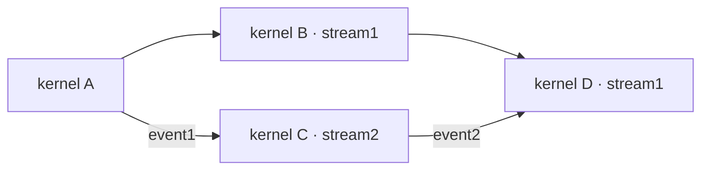

## 4.2. CUDA Graphs（CUDA 计算图）

来源：[CUDA Programming Guide — CUDA Graphs](https://docs.nvidia.com/cuda/cuda-programming-guide/04-special-topics/cuda-graphs.html)

> CUDA Graphs present another model for work submission in CUDA. A graph is a series of operations such as kernel launches, data movement, etc., connected by dependencies. A graph is defined separately from its execution. This allows a graph to be defined once and then launched repeatedly. Separating the definition of a graph from its execution enables a number of optimizations: first, CPU launch costs are reduced compared to streams, because much of the setup is done in advance; second, presenting the whole workflow to CUDA enables optimizations which might not be possible with the piecewise work submission mechanism of streams.

CUDA Graphs 提供另一种 CUDA 工作提交模型。Graph 由 kernel launch、数据移动等操作及其依赖关系组成。Graph 的定义与执行分离，可以定义一次、重复启动。这种分离支持多项优化：首先，大量准备工作可提前完成，相比 stream 逐次提交能降低 CPU launch 成本；其次，把完整工作流交给 CUDA，可以实现逐段提交 stream 工作时难以完成的优化。

> To see the optimizations possible with graphs, consider what happens in a stream: when you place a kernel into a stream, the host driver performs a sequence of operations in preparation for the execution of the kernel on the GPU. These operations, necessary for setting up and launching the kernel, are an overhead cost which must be paid for each kernel that is issued. For a GPU kernel with a short execution time, this overhead cost can be a significant fraction of the overall end-to-end execution time. By creating a CUDA graph that encompasses a workflow that will be launched many times, these overhead costs can be paid once for the entire graph during instantiation, and the graph itself can then be launched repeatedly with very little overhead.

要理解 graphs 的优化，可以先看 stream：每次向 stream 提交 kernel，host driver 都要执行一系列准备操作，使 kernel 能在 GPU 上执行。这些设置与启动成本需要为每次提交支付；对于执行很短的 kernel，它们可能占端到端耗时的很大比例。如果把反复运行的工作流构造成 CUDA graph，就可以在实例化时为整个 graph 完成一次相应准备，之后以很低的开销重复启动。

**解读：** Graph 适合反复执行、结构相对稳定的工作流，尤其是由许多短 kernel 和数据搬运组成的流程。收益主要来自摊薄 CPU 提交与准备成本，以及提前掌握依赖关系；它并不自动减少 kernel 内部的计算量。是否值得使用，应结合构图、实例化、更新成本和重复执行次数判断。

### 4.2.1. Graph Structure（Graph 结构）

> An operation forms a node in a graph. The dependencies between the operations are the edges. These dependencies constrain the execution sequence of the operations.

每个操作构成 graph 中的一个 node；操作间的依赖构成 edge。这些依赖约束操作的执行顺序。

> An operation may be scheduled at any time once the nodes on which it depends are complete. Scheduling is left up to the CUDA system.

当一个操作所依赖的 node 全部完成后，CUDA 可以随时调度它，具体调度由 CUDA 系统决定。

**解读：** Dependency edge 表达必须遵守的先后关系。互不依赖的节点具备并行调度的可能，但是否重叠执行仍取决于 GPU 资源和 CUDA 调度，不能把“没有依赖”理解成“保证同时运行”。

#### 4.2.1.1. Node Types（Node 类型）

> A graph node can be one of:

Graph node 可以属于以下类型：

- > kernel

  Kernel

- > CPU function call

  CPU 函数调用

- > memory copy

  内存复制

- > memset

  Memset（内存填充）

- > empty node

  Empty node（空节点）

- > waiting on a CUDA Event

  等待 CUDA event

- > recording a CUDA Event

  记录 CUDA event

- > signalling an external semaphore

  向 external semaphore 发信号

- > waiting on an external semaphore

  等待 external semaphore

- > conditional node

  Conditional node（条件节点）

- > memory node

  Memory node（内存节点）

- > child graph: To execute a separate nested graph, as shown in the following figure.

  Child graph：执行一个独立的嵌套 graph，如下图所示。

> **Figure 24 Child Graph Example**

**图 24：Child Graph 示例。**

**整理说明：** 本次粘贴文本未包含图 24–41 的图片文件，以下保留全部图注；仅清除重复的图片替代文本和不可用的相对图片路径。后续解读中的示意图为根据代码重绘的辅助图，不是原图。

#### 4.2.1.2. Edge Data（边数据）

> CUDA 12.3 introduced edge data on CUDA Graphs. At this time, the only use for non-default edge data is enabling Programmatic Dependent Launch.

CUDA 12.3 为 CUDA Graphs 引入 edge data。原文所述阶段，非默认 edge data 的用途是启用 Programmatic Dependent Launch（PDL）。

> Generally speaking, edge data modifies a dependency specified by an edge and consists of three parts: an outgoing port, an incoming port, and a type. An outgoing port specifies when an associated edge is triggered. An incoming port specifies what portion of a node is dependent on an associated edge. A type modifies the relation between the endpoints.

一般而言，edge data 修改一条 edge 所表达的依赖，由 outgoing port、incoming port 和 type 三部分组成。Outgoing port 指定该 edge 何时触发，incoming port 指定 node 中哪个部分受该 edge 约束，type 则修改两端之间的关系。

> Port values are specific to node type and direction, and edge types may be restricted to specific node types. In all cases, zero-initialized edge data represents default behavior. Outgoing port 0 waits on an entire task, incoming port 0 blocks an entire task, and edge type 0 is associated with a full dependency with memory synchronizing behavior.

Port 的含义取决于 node 类型与方向，edge type 也可能仅适用于某些 node 类型。全零初始化的 edge data 始终表示默认行为：outgoing port 0 等待整个任务，incoming port 0 阻塞整个任务，edge type 0 表示带有内存同步语义的完整依赖。

> Edge data is optionally specified in various graph APIs via a parallel array to the associated nodes. If it is omitted as an input parameter, zero-initialized data is used. If it is omitted as an output (query) parameter, the API accepts this if the edge data being ignored is all zero-initialized, and returns `cudaErrorLossyQuery` if the call would discard information.

在相关 graph API 中，可以通过与关联 node 对应的并行数组提供 edge data。省略输入参数时，使用全零数据；省略输出或查询参数时，若被忽略的数据全为零，则允许调用，否则因丢失信息而返回 `cudaErrorLossyQuery`。

> Edge data is also available in some stream capture APIs: `cudaStreamBeginCaptureToGraph()`, `cudaStreamGetCaptureInfo()`, and `cudaStreamUpdateCaptureDependencies()`. In these cases, there is not yet a downstream node. The data is associated with a dangling edge (half edge) which will either be connected to a future captured node or discarded at termination of stream capture. Note that some edge types do not wait on full completion of the upstream node. These edges are ignored when considering if a stream capture has been fully rejoined to the origin stream, and cannot be discarded at the end of capture. See Stream Capture.

部分 stream capture API 也支持 edge data，包括 `cudaStreamBeginCaptureToGraph()`、`cudaStreamGetCaptureInfo()` 和 `cudaStreamUpdateCaptureDependencies()`。此时尚无下游 node，数据关联到 dangling edge（悬空边／半边），之后连接到新捕获的 node，或在 capture 结束时丢弃。某些 edge type 不等待上游 node 完全结束；判断 capture 是否已汇合回 origin stream 时，不把这些边作为充分的汇合依据，并且 capture 结束时不能丢弃它们。参见 Stream Capture。

> No node types define additional incoming ports, and only kernel nodes define additional outgoing ports. There is one non-default dependency type, `cudaGraphDependencyTypeProgrammatic`, which is used to enable Programmatic Dependent Launch between two kernel nodes.

没有 node type 定义额外 incoming port，只有 kernel node 定义额外 outgoing port。非默认依赖类型 `cudaGraphDependencyTypeProgrammatic` 用于在两个 kernel node 之间启用 PDL。

**解读：** 默认 edge 同时表达任务完成依赖和相应的内存同步。Programmatic Dependent Launch 的 edge 可以在上游 kernel 整体结束前触发，因此不能把这种 edge 当作普通的完整完成屏障；它需要配合该机制规定的 device 端同步协议。

### 4.2.2. Building and Running Graphs（构建与运行 Graph）

> Work submission using graphs is separated into three distinct stages: definition, instantiation, and execution.

通过 graph 提交工作分为三个阶段：定义、实例化和执行。

- > During the definition or creation phase, a program creates a description of the operations in the graph along with the dependencies between them.

  定义或创建阶段，程序描述 graph 内的操作以及操作之间的依赖。

- > Instantiation takes a snapshot of the graph template, validates it, and performs much of the setup and initialization of work with the aim of minimizing what needs to be done at launch. The resulting instance is known as an executable graph.

  实例化对 graph template 创建快照并验证，提前完成大量工作设置与初始化，尽量减少 launch 阶段的工作。生成的实例称为 executable graph（可执行图）。

- > An executable graph may be launched into a stream, similar to any other CUDA work. It may be launched any number of times without repeating the instantiation.

  Executable graph 可以像其他 CUDA 工作一样提交到 stream，重复启动任意多次而无需重复实例化。

**解读：** `cudaGraph_t` 是描述节点和依赖的模板；`cudaGraphExec_t` 是经过验证与准备、可以反复执行的实例。修改模板不会自动修改已有实例，需要显式 update 或重新实例化。Launch 则只是把某个实例的一次执行提交到 stream。

#### 4.2.2.1. Graph Creation（Graph 创建）

> Graphs can be created via two mechanisms: using the explicit Graph API and via stream capture.

Graph 有两种创建方式：显式 Graph API，以及 stream capture。

##### 4.2.2.1.1. Graph APIs（Graph API）

> The following is an example (omitting declarations and other boilerplate code) of creating the below graph. Note the use of `cudaGraphCreate()` to create the graph and `cudaGraphAddNode()` to add the kernel nodes and their dependencies. The CUDA Runtime API documentation lists all the functions available for adding nodes and dependencies.

下面的示例省略了声明及其他常规代码，展示如何创建图中的 graph。`cudaGraphCreate()` 创建 graph，`cudaGraphAddNode()` 添加 kernel node 与依赖。CUDA Runtime API 文档列出了添加 node 和 dependency 的全部函数。

> **Figure 25 Creating a Graph Using Graph APIs Example**

**图 25：使用 Graph API 创建 Graph 的示例。**

```cpp
// Create the graph - it starts out empty
cudaGraphCreate(&graph, 0);

// Create the nodes and their dependencies
cudaGraphNode_t nodes[4];
cudaGraphNodeParams kParams = { cudaGraphNodeTypeKernel };
kParams.kernel.func         = (void *)kernelName;
kParams.kernel.gridDim.x    = kParams.kernel.gridDim.y  = kParams.kernel.gridDim.z  = 1;
kParams.kernel.blockDim.x   = kParams.kernel.blockDim.y = kParams.kernel.blockDim.z = 1;

cudaGraphAddNode(&nodes[0], graph, NULL, NULL, 0, &kParams);
cudaGraphAddNode(&nodes[1], graph, &nodes[0], NULL, 1, &kParams);
cudaGraphAddNode(&nodes[2], graph, &nodes[0], NULL, 1, &kParams);
cudaGraphAddNode(&nodes[3], graph, &nodes[1], NULL, 2, &kParams);
```

**解读：** 这里 `nodes[0]` 先于 `nodes[1]`、`nodes[2]`，最后 `nodes[3]` 同时依赖后两者。最后一次调用从 `&nodes[1]` 开始读取两个连续数组元素，所以依赖集合实际是 `nodes[1]` 与 `nodes[2]`。

> The example above shows four kernel nodes with dependencies between them to illustrate the creation of a very simple graph. A typical application would also include nodes added for memory operations, such as memcpy and memset. For full reference of all graph API functions to add nodes, see The CUDA Runtime API documentation .

上例通过四个 kernel node 及其依赖展示简单 graph 的创建。实际应用通常还会加入 memcpy、memset 等内存操作节点。添加节点的完整 API 参考见 CUDA Runtime API 文档。

> **Note**

**注意：**

> The CUDA graphs API started with separate API functions for adding each different type of node. For example, `cudaGraphAddKernelNode()` or `cudaGraphAddMemcpyNode()`. These APIs have been replaced by the single, polymorphic `cudaGraphAddNode()`, which uses the .type field of the node parameters to determine what type of node is being added. The non-polymorphic APIs will be deprecated in the future. `cudaGraphAddNode()` is the recommended way of adding nodes to a graph using the CUDA graphs APIs.

CUDA Graphs API 最初为每类 node 提供单独添加函数，例如 `cudaGraphAddKernelNode()`、`cudaGraphAddMemcpyNode()`。原文推荐以统一的多态 `cudaGraphAddNode()` 替代，通过 node parameter 的 .type 字段选择节点类型，并表示旧的非多态 API 未来将被弃用。

##### 4.2.2.1.2. Stream Capture（流捕获）

> Stream capture provides a mechanism to create a graph from existing stream-based APIs. A section of code which launches work into streams, including existing code, can be bracketed with calls to `cudaStreamBeginCapture()` and `cudaStreamEndCapture()`. See below.

Stream capture 可以通过已有的 stream API 创建 graph。将一段向 stream 提交工作的代码，包括现有代码，放在 `cudaStreamBeginCapture()` 与 `cudaStreamEndCapture()` 之间即可，见下例。

```cpp
cudaGraph_t graph;

cudaStreamBeginCapture(stream);

kernel_A<<< ..., stream >>>(...);
kernel_B<<< ..., stream >>>(...);
libraryCall(stream);
kernel_C<<< ..., stream >>>(...);

cudaStreamEndCapture(stream, &graph);
```

> A call to `cudaStreamBeginCapture()` places a stream in capture mode. When a stream is being captured, work launched into the stream is not enqueued for execution. It is instead appended to an internal graph that is progressively being built up. This graph is then returned by calling `cudaStreamEndCapture()`, which also ends capture mode for the stream. A graph which is actively being constructed by stream capture is referred to as a capture graph.

`cudaStreamBeginCapture()` 让 stream 进入 capture mode。此时提交到 stream 的工作不会进入执行队列，而是追加到逐步构建的内部 graph。`cudaStreamEndCapture()` 返回此 graph，并结束 stream 的 capture mode。正在通过 stream capture 构建的 graph 称为 capture graph。

> Stream capture can be used on any CUDA stream except `cudaStreamLegacy` (the “NULL stream”). Note that it can be used on `cudaStreamPerThread`. If a program is using the legacy stream, it may be possible to redefine stream 0 to be the per-thread stream with no functional change. See Blocking and non-blocking streams and the default stream.

除 `cudaStreamLegacy`，也就是 legacy NULL stream 外，其他 CUDA stream 都可用于 capture，包括 `cudaStreamPerThread`。如果程序原本使用 legacy stream，在某些情况下可将 stream 0 改为 per-thread stream 而不改变程序功能；参见 Blocking and non-blocking streams and the default stream。

> Whether a stream is being captured can be queried with `cudaStreamIsCapturing()`.

可通过 `cudaStreamIsCapturing()` 查询 stream 是否处于 capture 状态。

> Work can be captured to an existing graph using `cudaStreamBeginCaptureToGraph()`. Instead of capturing to an internal graph, work is captured to a graph provided by the user.

`cudaStreamBeginCaptureToGraph()` 可以把工作捕获到用户提供的已有 graph 中，而不是新的内部 graph。

**解读：** Capture 记录的是 CUDA 工作及依赖，不是把整个 CPU 函数录制成可重放程序。Capture 期间的普通 C++ 分支、循环和 host 计算会当场执行；之后 graph replay 只重放已记录的节点。若 CPU 分支改变了记录下来的 topology，就需要重新构图或采用 graph 内的 conditional 节点。

###### 4.2.2.1.2.1. Cross-stream Dependencies and Events（跨 Stream 依赖与 Event）

> Stream capture can handle cross-stream dependencies expressed with `cudaEventRecord()` and `cudaStreamWaitEvent()`, provided the event being waited upon was recorded into the same capture graph.

Stream capture 可以处理由 `cudaEventRecord()` 和 `cudaStreamWaitEvent()` 表达的跨 stream 依赖，前提是所等待的 event 记录在同一个 capture graph 中。

> When an event is recorded in a stream that is in capture mode, it results in a captured event. A captured event represents a set of nodes in a capture graph.

在 capture mode 的 stream 中记录 event，会生成 captured event，它代表 capture graph 中的一组 node。

> When a captured event is waited on by a stream, it places the stream in capture mode if it is not already, and the next item in the stream will have additional dependencies on the nodes in the captured event. The two streams are then being captured to the same capture graph.

当某个 stream 等待 captured event 时，若该 stream 尚未进入 capture mode，就会进入；其下一个工作项增加对 event 所代表节点的依赖。此时两个 stream 都捕获到同一个 capture graph。

> When cross-stream dependencies are present in stream capture, `cudaStreamEndCapture()` must still be called in the same stream where `cudaStreamBeginCapture()` was called; this is the origin stream. Any other streams which are being captured to the same capture graph, due to event-based dependencies, must also be joined back to the origin stream. This is illustrated below. All streams being captured to the same capture graph are taken out of capture mode upon `cudaStreamEndCapture()`. Failure to rejoin to the origin stream will result in failure of the overall capture operation.

存在跨 stream 依赖时，`cudaStreamEndCapture()` 仍必须在调用 `cudaStreamBeginCapture()` 的 stream 上执行，该 stream 称为 origin stream。其他因 event 依赖而进入同一 capture graph 的 stream，也必须汇合回 origin stream。结束 capture 时，所有相关 stream 一起退出 capture mode；若未汇合回来，整个 capture 操作会失败。

```cpp
// stream1 is the origin stream
cudaStreamBeginCapture(stream1);

kernel_A<<< ..., stream1 >>>(...);

// Fork into stream2
cudaEventRecord(event1, stream1);
cudaStreamWaitEvent(stream2, event1);

kernel_B<<< ..., stream1 >>>(...);
kernel_C<<< ..., stream2 >>>(...);

// Join stream2 back to origin stream (stream1)
cudaEventRecord(event2, stream2);
cudaStreamWaitEvent(stream1, event2);

kernel_D<<< ..., stream1 >>>(...);

// End capture in the origin stream
cudaStreamEndCapture(stream1, &graph);

// stream1 and stream2 no longer in capture mode
```

> The graph returned by the above code is shown in Figure 25.

上述代码返回的 graph 如图 25 所示。

**解读：** Cross-stream capture 既要 fork，也要 join：`event1` 建立 A 到 C 的依赖，`event2` 把 C 的完成重新接回 origin stream；B 的完成则由 `stream1` 自身顺序保证。最终 D 等待 B 和 C，两条分支都归入同一个 graph。



> **Note**

**注意：**

> When a stream is taken out of capture mode, the next non-captured item in the stream (if any) will still have a dependency on the most recent prior non-captured item, despite intermediate items having been removed.

Stream 退出 capture mode 后，下一个未被捕获的工作项（若存在），仍依赖此前最近的未捕获工作项，即使两者之间的工作已经被抽取为 graph。

###### 4.2.2.1.2.2. Prohibited and Unhandled Operations（禁止与尚不支持的操作）

> It is invalid to synchronize or query the execution status of a stream which is being captured or a captured event, because they do not represent items scheduled for execution. It is also invalid to query the execution status of or synchronize a broader handle which encompasses an active stream capture, such as a device or context handle when any associated stream is in capture mode.

不能同步或查询正在 capture 的 stream、captured event 的执行状态，因为它们不代表已排入执行队列的工作。也不能同步或查询覆盖活跃 capture 的更大范围对象，例如存在相关 stream capture 时的 device 或 context。

> When any stream in the same context is being captured, and it was not created with `cudaStreamNonBlocking`, any attempted use of the legacy stream is invalid. This is because the legacy stream handle at all times encompasses these other streams; enqueueing to the legacy stream would create a dependency on the streams being captured, and querying it or synchronizing it would query or synchronize the streams being captured.

如果同一 context 中有一个非 `cudaStreamNonBlocking` stream 正在 capture，那么使用 legacy stream 是无效的。原因是 legacy stream 的语义覆盖这些其他 stream：向它提交工作会建立与 capture stream 的依赖，而查询或同步它也会涉及 capture stream。

> It is therefore also invalid to call synchronous APIs in this case. One example of a synchronous APIs is `cudaMemcpy()` which enqueues work to the legacy stream and synchronizes on it before returning.

因此，此时同步 API 也不能调用。例如 `cudaMemcpy()` 向 legacy stream 提交工作，并在返回前同步该 stream。

> **Note**

**注意：**

> As a general rule, when a dependency relation would connect something that is captured with something that was not captured and instead enqueued for execution, CUDA prefers to return an error rather than ignore the dependency. An exception is made for placing a stream into or out of capture mode; this severs a dependency relation between items added to the stream immediately before and after the mode transition.

一般来说，如果依赖关系要连接被捕获的工作与未捕获、已提交执行的工作，CUDA 会返回错误，而不会忽略依赖。进入或退出 capture mode 是例外：模式切换会切断紧邻切换点之前与之后所加入工作项之间的那条依赖关系。

> It is invalid to merge two separate capture graphs by waiting on a captured event from a stream which is being captured and is associated with a different capture graph than the event. It is invalid to wait on a non-captured event from a stream which is being captured without specifying the `cudaEventWaitExternal` flag.

正在 capture 的 stream 不能通过等待另一个 capture graph 的 captured event，来合并两个独立 capture graph。Capture stream 若等待未捕获的 event，则必须指定 `cudaEventWaitExternal`，否则无效。

> A small number of APIs that enqueue asynchronous operations into streams are not currently supported in graphs and will return an error if called with a stream which is being captured, such as `cudaStreamAttachMemAsync()`.

少量向 stream 提交异步操作的 API 尚不支持 graphs，例如 `cudaStreamAttachMemAsync()`；在正在 capture 的 stream 上调用它们会返回错误。

###### 4.2.2.1.2.3. Invalidation（Capture 失效）

> When an invalid operation is attempted during stream capture, any associated capture graphs are invalidated. When a capture graph is invalidated, further use of any streams which are being captured or captured events associated with the graph is invalid and will return an error, until stream capture is ended with `cudaStreamEndCapture()`. This call will take the associated streams out of capture mode, but will also return an error value and a NULL graph.

Capture 期间尝试无效操作，会使相关 capture graph 失效。之后继续使用相关 capture stream 或 captured event 都会返回错误，直到调用 `cudaStreamEndCapture()`。该调用使 stream 退出 capture mode，但会返回错误状态和 NULL graph。

**解读：** Capture 失败后仍需调用 `cudaStreamEndCapture()` 结束 capture 状态，并检查错误以及返回的 graph 是否为空。不能在 capture 已失效后继续把后续 API 当作正常入队操作；实际程序应为 capture 错误设置清理路径。

###### 4.2.2.1.2.4. Capture Introspection（检查 Capture 状态）

> Active stream capture operations can be inspected using `cudaStreamGetCaptureInfo()`. This allows the user to obtain the status of the capture, a unique (per-process) ID for the capture, the underlying graph object, and dependencies/edge data for the next node to be captured in the stream. This dependency information can be used to obtain a handle to the node(s) which were last captured in the stream.

`cudaStreamGetCaptureInfo()` 可以查询活跃 capture 的状态、process 内唯一的 capture ID、底层 graph 对象，以及该 stream 下一个待捕获 node 的 dependency/edge data。通过依赖信息，还可获得 stream 中最后捕获的 node handle。

##### 4.2.2.1.3. Putting It All Together（完整示例）

> The example in Figure 25 is a simplistic example intended to show a small graph conceptually. In an application that utilizes CUDA graphs, there is more complexity to using either the graph API or stream capture. The following code snippet shows a side by side comparison of the Graph API and Stream Capture to create a CUDA graph to execute a simple two stage reduction algorithm.

图 25 是用于说明概念的简单 graph；实际应用通过 Graph API 或 stream capture 使用 graphs 时会更复杂。下面并列比较两种方式，创建一个执行简单两阶段归约算法的 CUDA graph。

> Figure 26 is an illustration of this CUDA graph and was generated using the `cudaGraphDebugDotPrint` function applied to the code below, with small adjustments for readability, and then rendered using Graphviz.

图 26 展示该 graph：由 `cudaGraphDebugDotPrint` 对下面代码生成输出，作少量可读性调整后，用 Graphviz 渲染。

> **Figure 26 CUDA graph example using two stage reduction kernel**

**图 26：使用两阶段归约 kernel 的 CUDA Graph 示例。**

> **Graph API**

**Graph API（显式 Graph API）**

```cpp
void cudaGraphsManual(float  *inputVec_h,
                      float  *inputVec_d,
                      double *outputVec_d,
                      double *result_d,
                      size_t  inputSize,
                      size_t  numOfBlocks)
{
    cudaStream_t                 streamForGraph;
    cudaGraph_t                  graph;
    std::vector<cudaGraphNode_t> nodeDependencies;
    cudaGraphNode_t              memcpyNode, kernelNode;
    double                       result_h = 0.0;

    cudaStreamCreate(&streamForGraph);

    // cudaGraphAddNode is the unified node-creation API: one call for every node type,
    // driven by a cudaGraphNodeParams struct (a .type tag + a union of per-type params).
    // It replaces the previously used cudaGraphAddMemcpyNode/cudaGraphAddKernelNode calls. The struct
    // has reserved fields that must be zero, so it is re-zeroed with "= {}" before each node below.
    cudaGraphNodeParams nodeParams   = {};
    cudaMemcpy3DParms   memcpyParams = {0};

    memcpyParams.srcArray = NULL;
    memcpyParams.srcPos   = make_cudaPos(0, 0, 0);
    memcpyParams.srcPtr   = make_cudaPitchedPtr(inputVec_h, sizeof(float) * inputSize, inputSize, 1);
    memcpyParams.dstArray = NULL;
    memcpyParams.dstPos   = make_cudaPos(0, 0, 0);
    memcpyParams.dstPtr   = make_cudaPitchedPtr(inputVec_d, sizeof(float) * inputSize, inputSize, 1);
    memcpyParams.extent   = make_cudaExtent(sizeof(float) * inputSize, 1, 1);
    memcpyParams.kind     = cudaMemcpyHostToDevice;

    // Create an empty graph; nodes and edges will be added below.
    cudaGraphCreate(&graph, 0);

    // Node 1: H2D memcpy — no dependencies (NULL, 0), so it can start immediately.
    // For a memcpy node the cudaMemcpy3DParms goes into nodeParams.memcpy.copyParams
    // (the .memcpy union member is a wrapper struct, so the copy descriptor nests one level deeper).
    nodeParams                   = {};
    nodeParams.type              = cudaGraphNodeTypeMemcpy;
    nodeParams.memcpy.copyParams = memcpyParams;
    cudaGraphAddNode(&memcpyNode, graph, NULL, /*dependencyData=*/NULL, 0, &nodeParams);

    // Make the next node wait for this memcpy to finish before starting.
    nodeDependencies.push_back(memcpyNode);

    void *kernelArgs[4] = {(void *)&inputVec_d, (void *)&outputVec_d, &inputSize, &numOfBlocks};

    // Node 2: first reduction kernel — depends on the H2D memcpy completing.
    // Kernel params are set directly on the .kernel union member.
    nodeParams                       = {};
    nodeParams.type                  = cudaGraphNodeTypeKernel;
    nodeParams.kernel.func           = (void *)reduce;
    nodeParams.kernel.gridDim        = dim3(numOfBlocks, 1, 1);
    nodeParams.kernel.blockDim       = dim3(THREADS_PER_BLOCK, 1, 1);
    nodeParams.kernel.sharedMemBytes = 0;
    nodeParams.kernel.kernelParams   = (void **)kernelArgs;
    nodeParams.kernel.extra          = NULL;
    cudaGraphAddNode(
        &kernelNode, graph, nodeDependencies.data(), /*dependencyData=*/NULL, nodeDependencies.size(), &nodeParams);

    // Move dependency forward: the next node waits for this kernel.
    nodeDependencies.clear();
    nodeDependencies.push_back(kernelNode);

    void *kernelArgs2[3] = {(void *)&outputVec_d, (void *)&result_d, &numOfBlocks};

    // Node 3: final reduction kernel — depends on Node 2.
    nodeParams                       = {};
    nodeParams.type                  = cudaGraphNodeTypeKernel;
    nodeParams.kernel.func           = (void *)reduceFinal;
    nodeParams.kernel.gridDim        = dim3(1, 1, 1);
    nodeParams.kernel.blockDim       = dim3(THREADS_PER_BLOCK, 1, 1);
    nodeParams.kernel.sharedMemBytes = 0;
    nodeParams.kernel.kernelParams   = kernelArgs2;
    nodeParams.kernel.extra          = NULL;
    cudaGraphAddNode(
        &kernelNode, graph, nodeDependencies.data(), /*dependencyData=*/NULL, nodeDependencies.size(), &nodeParams);
    nodeDependencies.clear();
    nodeDependencies.push_back(kernelNode);

    memset(&memcpyParams, 0, sizeof(memcpyParams));

    memcpyParams.srcArray = NULL;
    memcpyParams.srcPos   = make_cudaPos(0, 0, 0);
    memcpyParams.srcPtr   = make_cudaPitchedPtr(result_d, sizeof(double), 1, 1);
    memcpyParams.dstArray = NULL;
    memcpyParams.dstPos   = make_cudaPos(0, 0, 0);
    memcpyParams.dstPtr   = make_cudaPitchedPtr(&result_h, sizeof(double), 1, 1);
    memcpyParams.extent   = make_cudaExtent(sizeof(double), 1, 1);
    memcpyParams.kind     = cudaMemcpyDeviceToHost;

    // Node 4: D2H memcpy — copies the scalar result back to the host.
    // Again the copy descriptor nests in nodeParams.memcpy.copyParams.
    nodeParams                   = {};
    nodeParams.type              = cudaGraphNodeTypeMemcpy;
    nodeParams.memcpy.copyParams = memcpyParams;
    cudaGraphAddNode(&memcpyNode, graph, nodeDependencies.data(), /*dependencyData=*/NULL, nodeDependencies.size(), &nodeParams);
    nodeDependencies.clear();
    nodeDependencies.push_back(memcpyNode);

    cudaGraphNode_t hostNode;
    callBackData_t  hostFnData;
    hostFnData.data    = &result_h;
    hostFnData.fn_name = "cudaGraphsManual";

    // Node 5: host callback — runs on the CPU after the D2H copy completes.
    // The .host member is cudaHostNodeParamsV2 (fn + userData, plus a syncMode field
    // left at 0 by the zero-init above).
    nodeParams               = {};
    nodeParams.type          = cudaGraphNodeTypeHost;
    nodeParams.host.fn       = myHostNodeCallback;
    nodeParams.host.userData = &hostFnData;
    cudaGraphAddNode(&hostNode, graph, nodeDependencies.data(), /*dependencyData=*/NULL, nodeDependencies.size(), &nodeParams);

    size_t numNodes = 0;
    cudaGraphGetNodes(graph, NULL, &numNodes);
    printf("Graph node count: %zu\n", numNodes);

    // Instantiate: compile the graph into an executable form (one-time cost).
    // This is where CUDA optimizes the schedule; repeated launches reuse this.
    cudaGraphExec_t graphExec;
    cudaGraphInstantiate(&graphExec, graph, NULL, NULL, 0);

    // Demonstrates cudaGraphClone — in practice, cloning is useful when multiple CPU
    // threads need to launch the same graph concurrently, each with its own independent graphExec.
    cudaGraph_t     clonedGraph;
    cudaGraphExec_t clonedGraphExec;
    cudaGraphClone(&clonedGraph, graph);
    cudaGraphInstantiate(&clonedGraphExec, clonedGraph, NULL, NULL, 0);

    // Refill the host input before each launch so the graph's H2D copy processes
    // new data every time — one instantiated graph reused for different data.
    // The per-iteration sync ensures that copy finishes before we overwrite the buffer.
    for (int i = 0; i < GRAPH_LAUNCH_ITERATIONS; i++) {
        init_input(inputVec_h, inputSize);
        cudaGraphLaunch(graphExec, streamForGraph);
        cudaStreamSynchronize(streamForGraph);
    }

    printf("\nCloned graph:\n");
    for (int i = 0; i < GRAPH_LAUNCH_ITERATIONS; i++) {
        init_input(inputVec_h, inputSize);
        cudaGraphLaunch(clonedGraphExec, streamForGraph);
        cudaStreamSynchronize(streamForGraph);
    }

    cudaGraphExecDestroy(graphExec);
    cudaGraphExecDestroy(clonedGraphExec);
    cudaGraphDestroy(graph);
    cudaGraphDestroy(clonedGraph);
    cudaStreamDestroy(streamForGraph);
}
```

**解读：** 这个示例把输入复制、初始化、两阶段 reduction、结果回传和 host callback 纳入一个工作流。Graph clone 复制结构，并不自动为指针指向的缓冲区或 callback 数据复制存储；原示例按顺序运行可以复用它们，若让不同实例并发，则必须另行处理共享数据与生命周期。

> **Stream Capture**

**Stream Capture（流捕获）**

**原文缺失说明：** 粘贴内容在这里仅提供了 “Stream Capture” 标签，没有对应代码。上方 Graph API 代码完整保留；不将自行补写的 capture 代码当作原文。

#### 4.2.2.2. Graph Instantiation（Graph 实例化）

> Once a graph has been created, either by the use of the graph API or stream capture, the graph must be instantiated to create an executable graph, which can then be launched. Assuming the `cudaGraph_t` graph has been created successfully, the following code will instantiate the graph and create the executable graph `cudaGraphExec_t` graphExec:

无论通过 Graph API 还是 stream capture 创建 graph，都必须实例化为 executable graph 后才能启动。假设 `cudaGraph_t` graph 已成功创建，以下代码生成 `cudaGraphExec_t` graphExec：

```cpp
cudaGraphExec_t graphExec;
cudaGraphInstantiate(&graphExec, graph, 0);
```

#### 4.2.2.3. Graph Execution（Graph 执行）

> After a graph has been created and instantiated to create an executable graph, it can be launched. Assuming the `cudaGraphExec_t` graphExec has been created successfully, the following code snippet will launch the graph into the specified stream:

Graph 创建并实例化后即可启动。假设 `cudaGraphExec_t` graphExec 已成功创建，以下代码把它提交到指定 stream：

```cpp
cudaGraphLaunch(graphExec, stream);
```

> Pulling it all together and using the stream capture example from Section 4.2.2.1.2, the following code snippet will create a graph, instantiate it, and launch it:

将上述步骤与 4.2.2.1.2 节的 stream capture 示例结合，下面的代码依次创建、实例化并启动 graph：

```cpp
cudaGraph_t graph;

cudaStreamBeginCapture(stream);

kernel_A<<< ..., stream >>>(...);
kernel_B<<< ..., stream >>>(...);
libraryCall(stream);
kernel_C<<< ..., stream >>>(...);

cudaStreamEndCapture(stream, &graph);

cudaGraphExec_t graphExec;
cudaGraphInstantiate(&graphExec, graph, 0);
cudaGraphLaunch(graphExec, stream);
```

### 4.2.3. Updating Instantiated Graphs（更新已实例化的 Graph）

> When a workflow changes, the graph becomes out of date and must be modified. Major changes to graph structure (such as topology or node types) require re-instantiation because topology-related optimizations must be re-applied. However, it is common for only node parameters (such as kernel parameters and memory addresses) to change while the graph topology remains the same. For this case, CUDA provides a lightweight “Graph Update” mechanism that allows certain node parameters to be modified in-place without rebuilding the entire graph, which is much more efficient than re-instantiation.

工作流改变时，graph 也需要修改。Topology 或 node type 等重大结构变化，需要重新实例化，以重新应用相关优化。但常见情况只是 kernel 参数、内存地址等 node parameter 变化，topology 保持不变。CUDA 为此提供轻量的 Graph Update，可原位修改部分参数而不重建整个 graph，比重新实例化高效得多。

> Updates take effect the next time the graph is launched, so they do not impact previous graph launches, even if they are running at the time of the update. A graph may be updated and relaunched repeatedly, so multiple updates/launches can be queued on a stream.

更新从下次 graph launch 生效，不影响此前已发出的 launch，即使它们尚在执行。Graph 可以反复更新并重新启动，因此可以在 stream 上排入多次更新后的 launch。

> CUDA provides two mechanisms for updating instantiated graph parameters, whole graph update and individual node update. Whole graph update allows the user to supply a topologically identical `cudaGraph_t` object whose nodes contain updated parameters. Individual node update allows the user to explicitly update the parameters of individual nodes. Using an updated `cudaGraph_t` is more convenient when a large number of nodes are being updated, or when the graph topology is unknown to the caller (i.e., The graph resulted from stream capture of a library call). Using individual node update is preferred when the number of changes is small and the user has the handles to the nodes requiring updates. Individual node update skips the topology checks and comparisons for unchanged nodes, so it can be more efficient in many cases.

CUDA 提供 whole graph update 与 individual node update 两种参数更新机制。前者接收 topology 相同、node 含新参数的 `cudaGraph_t`；后者显式更新指定 node。需要更新大量 node，或调用者不掌握 topology，例如捕获库调用得到的 graph 时，whole graph update 更方便。变化较少且持有所需 node handle 时，适合 individual node update；它省去不变节点的 topology 检查与比较，往往更高效。

> CUDA also provides a mechanism for enabling and disabling individual nodes without affecting their current parameters.

CUDA 还允许启用或禁用单个 node，而不改变其现有参数。

> The following sections explain each approach in more detail.

以下各节详细介绍这些方式。

#### 4.2.3.1. Whole Graph Update（整体 Graph 更新）

> `cudaGraphExecUpdate()` allows an instantiated graph (the “original graph”) to be updated with the parameters from a topologically identical graph (the “updating” graph). The topology of the updating graph must be identical to the original graph used to instantiate the `cudaGraphExec_t`. In addition, the order in which the dependencies are specified must match. Finally, CUDA needs to consistently order the sink nodes (nodes with no dependencies). CUDA relies on the order of specific API calls to achieve consistent sink node ordering.

`cudaGraphExecUpdate()` 允许使用 topology 相同的 updating graph 中的参数，更新已经实例化的 original graph。Updating graph 的 topology 必须与原来用于实例化 `cudaGraphExec_t` 的 graph 一致，dependency 的指定顺序也必须一致。此外，CUDA 还需要一致地排列 sink node；原文此处括注为“没有依赖的节点”，后文给出更准确的定义。CUDA 通过特定 API 的调用顺序确定 sink node 顺序。

> More explicitly, following the following rules will cause `cudaGraphExecUpdate()` to pair the nodes in the original graph and the updating graph deterministically:

具体而言，遵循以下规则，可使 `cudaGraphExecUpdate()` 确定性地匹配 original graph 与 updating graph 中的 node：

- > For any capturing stream, the API calls operating on that stream must be made in the same order, including event wait and other API calls not directly corresponding to node creation.

  对任一 capture stream，操作它的 API 调用必须保持相同顺序，包括 event wait 以及不直接创建 node 的调用。

- > The API calls which directly manipulate a given graph node’s incoming edges (including captured stream APIs, node add APIs, and edge addition / removal APIs) must be made in the same order. Moreover, when dependencies are specified in arrays to these APIs, the order in which the dependencies are specified inside those arrays must match.

  直接操作某个 node 入边的 API，包括捕获的 stream API、node add API、edge 添加／删除 API，必须以相同顺序调用；若用数组指定 dependency，数组内的顺序也必须一致。

- > Sink nodes must be consistently ordered. Sink nodes are nodes without dependent nodes / outgoing edges in the final graph at the time of the `cudaGraphExecUpdate()` invocation. The following operations affect sink node ordering (if present) and must (as a combined set) be made in the same order:

  Sink node 的顺序必须一致。Sink node 是调用 `cudaGraphExecUpdate()` 时，最终 graph 中没有下游依赖者／没有出边的节点。以下会影响 sink 顺序的操作，作为整体必须以相同顺序发生：

    - > Node add APIs resulting in a sink node.

      添加后产生 sink node 的 node add API。

    - > Edge removal resulting in a node becoming a sink node.

      使某个 node 变成 sink 的 edge removal。

    - > `cudaStreamUpdateCaptureDependencies()`, if it removes a sink node from a capturing stream’s dependency set.

      若 `cudaStreamUpdateCaptureDependencies()` 将 sink node 从 capture stream 的 dependency set 中移除。

    - > `cudaStreamEndCapture()`.

      `cudaStreamEndCapture()`。

**解读（Sink 定义）：** 本节开头将 sink 括注为 “nodes with no dependencies”，与后文定义不一致。这里应以后文的“没有 dependent node / outgoing edge”为准，即没有后继的终点节点；没有前驱的节点是另一种概念。Whole graph update 还依赖确定的节点配对顺序，只有画出来的拓扑看似相同并不充分。

> The following example shows how the API could be used to update an instantiated graph:

下面展示如何使用该 API 更新已实例化的 graph：

```cpp
cudaGraphExec_t graphExec = NULL;

for (int i = 0; i < 10; i++) {
    cudaGraph_t graph;
    cudaGraphExecUpdateResult updateResult;
    cudaGraphNode_t errorNode;

    // In this example we use stream capture to create the graph.
    // You can also use the Graph API to produce a graph.
    cudaStreamBeginCapture(stream, cudaStreamCaptureModeGlobal);

    // Call a user-defined, stream based workload, for example
    do_cuda_work(stream);

    cudaStreamEndCapture(stream, &graph);

    // If we've already instantiated the graph, try to update it directly
    // and avoid the instantiation overhead
    if (graphExec != NULL) {
        // If the graph fails to update, errorNode will be set to the
        // node causing the failure and updateResult will be set to a
        // reason code.
        cudaGraphExecUpdate(graphExec, graph, &errorNode, &updateResult);
    }

    // Instantiate during the first iteration or whenever the update
    // fails for any reason
    if (graphExec == NULL || updateResult != cudaGraphExecUpdateSuccess) {

        // If a previous update failed, destroy the cudaGraphExec_t
        // before re-instantiating it
        if (graphExec != NULL) {
            cudaGraphExecDestroy(graphExec);
        }
        // Instantiate graphExec from graph. The error node and
        // error message parameters are unused here.
        cudaGraphInstantiate(&graphExec, graph, 0);
    }

    cudaGraphDestroy(graph);
    cudaGraphLaunch(graphExec, stream);
    cudaStreamSynchronize(stream);
}
```

**解读（API 版本差异）：** 原代码使用带 `errorNode` 和 `updateResult` 输出参数的旧式 `cudaGraphExecUpdate` 调用。当前 Runtime API 文档使用 `cudaGraphExecUpdateResultInfo*` 汇总更新结果。代码按原文保留，实际编译时应按本机 CUDA 头文件选择对应签名，并同时处理 API 错误与更新结果。参见 [CUDA Runtime Graph API](https://docs.nvidia.com/cuda/cuda-runtime-api/group__CUDART__GRAPH.html)。

> A typical workflow is to create the initial `cudaGraph_t` using either the stream capture or graph API. The `cudaGraph_t` is then instantiated and launched as normal. After the initial launch, a new `cudaGraph_t` is created using the same method as the initial graph and `cudaGraphExecUpdate()` is called. If the graph update is successful, indicated by the updateResult parameter in the above example, the updated `cudaGraphExec_t` is launched. If the update fails for any reason, the `cudaGraphExecDestroy()` and `cudaGraphInstantiate()` are called to destroy the original `cudaGraphExec_t` and instantiate a new one.

典型流程是先用 stream capture 或 Graph API 创建初始 `cudaGraph_t`，再实例化并启动。首次启动后，用相同方法创建新的 `cudaGraph_t`，并调用 `cudaGraphExecUpdate()`。若更新成功，即示例中的 updateResult 表示成功，就启动更新后的 `cudaGraphExec_t`；若失败，则调用 `cudaGraphExecDestroy()` 与 `cudaGraphInstantiate()`，销毁原可执行图并创建新实例。

> It is also possible to update the `cudaGraph_t` nodes directly (i.e., using `cudaGraphKernelNodeSetParams()`) and subsequently update the `cudaGraphExec_t`, however it is more efficient to use the explicit node update APIs covered in the next section.

也可以先直接更新 `cudaGraph_t` 的 node，例如使用 `cudaGraphKernelNodeSetParams()`，再更新 `cudaGraphExec_t`；但通常下一节的显式 node update API 更高效。

> Conditional handle flags and default values are updated as part of the graph update.

Conditional handle 的 flag 与默认值会作为 graph update 的一部分更新。

> Please see the Graph API for more information on usage and current limitations.

具体用法与当前限制见 Graph API。

#### 4.2.3.2. Individual Node Update（单个节点更新）

> Instantiated graph node parameters can be updated directly. This eliminates the overhead of instantiation as well as the overhead of creating a new `cudaGraph_t`. If the number of nodes requiring update is small relative to the total number of nodes in the graph, it is better to update the nodes individually. The following methods are available for updating `cudaGraphExec_t` nodes:

可以直接更新已实例化 graph 的节点参数，从而省去实例化以及创建新 `cudaGraph_t` 的开销。如果需要更新的节点只占 graph 节点总数的一小部分，逐个更新节点更合适。更新 `cudaGraphExec_t` 中节点的方法如下：

> **Table 8 Individual Node Update APIs**

**表 8 单个节点更新 API**

> | API | Node Type |
> | --- | --- |
> | `cudaGraphExecKernelNodeSetParams()` | Kernel node |
> | `cudaGraphExecMemcpyNodeSetParams()` | Memory copy node |
> | `cudaGraphExecMemsetNodeSetParams()` | Memory set node |
> | `cudaGraphExecHostNodeSetParams()` | Host node |
> | `cudaGraphExecChildGraphNodeSetParams()` | Child graph node |
> | `cudaGraphExecEventRecordNodeSetEvent()` | Event record node |
> | `cudaGraphExecEventWaitNodeSetEvent()` | Event wait node |
> | `cudaGraphExecExternalSemaphoresSignalNodeSetParams()` | External semaphore signal node |
> | `cudaGraphExecExternalSemaphoresWaitNodeSetParams()` | External semaphore wait node |

| API | 节点类型 |
| --- | --- |
| `cudaGraphExecKernelNodeSetParams()` | Kernel 节点 |
| `cudaGraphExecMemcpyNodeSetParams()` | 内存复制节点 |
| `cudaGraphExecMemsetNodeSetParams()` | 内存设置节点 |
| `cudaGraphExecHostNodeSetParams()` | Host 节点 |
| `cudaGraphExecChildGraphNodeSetParams()` | Child graph 节点 |
| `cudaGraphExecEventRecordNodeSetEvent()` | Event record 节点 |
| `cudaGraphExecEventWaitNodeSetEvent()` | Event wait 节点 |
| `cudaGraphExecExternalSemaphoresSignalNodeSetParams()` | External semaphore signal 节点 |
| `cudaGraphExecExternalSemaphoresWaitNodeSetParams()` | External semaphore wait 节点 |

> Please see the Graph API for more information on usage and current limitations.

有关用法和当前限制的更多信息，请参阅 Graph API。

#### 4.2.3.3. Individual Node Enable（单个节点的启用与禁用）

> Kernel, memset and memcpy nodes in an instantiated graph can be enabled or disabled using the `cudaGraphNodeSetEnabled()` API. This allows the creation of a graph which contains a superset of the desired functionality which can be customized for each launch. The enable state of a node can be queried using the `cudaGraphNodeGetEnabled()` API.

可通过 `cudaGraphNodeSetEnabled()` 启用或禁用已实例化 graph 中的 kernel、memset 和 memcpy 节点。这允许创建包含所需功能超集的 graph，再针对每次 launch 定制。可使用 `cudaGraphNodeGetEnabled()` 查询节点的启用状态。

> A disabled node is functionally equivalent to an empty node until it is re-enabled. Node parameters are not affected by enabling/disabling a node. Enable state is unaffected by individual node update or whole graph update with `cudaGraphExecUpdate()`. Parameter updates while the node is disabled will take effect when the node is re-enabled.

被禁用的节点在重新启用前，其功能等同于 empty node。启用或禁用不影响节点参数。单个节点更新以及通过 `cudaGraphExecUpdate()` 进行的整个 graph 更新，都不会改变启用状态。在节点被禁用时更新的参数，会在节点重新启用后生效。

**解读：** 禁用节点不会删除该节点及其依赖位置；它相当于在原位置保留一个 empty node。因此，这适合预先构建固定拓扑的功能超集，再开关某些操作。只禁用 producer 而保留依赖其输出的 consumer，仍可能造成应用层的数据错误。

> Refer to the Graph API for more information on usage and current limitations.

有关用法和当前限制的更多信息，请参阅 Graph API。

#### 4.2.3.4. Graph Update Limitations（Graph 更新的限制）

- > Kernel nodes:

  Kernel 节点：

    - > The owning context of the function cannot change.

      函数所属的 context 不能改变。

    - > A node whose function originally did not use CUDA dynamic parallelism cannot be updated to a function which uses CUDA dynamic parallelism.

      如果节点原来的函数不使用 CUDA dynamic parallelism，就不能将其更新为使用 CUDA dynamic parallelism 的函数。

- > `cudaMemset` and `cudaMemcpy` nodes:

  `cudaMemset` 和 `cudaMemcpy` 节点：

    - > The CUDA device(s) to which the operand(s) was allocated/mapped cannot change.

      操作数所分配或映射到的 CUDA device 不能改变。

    - > The source/destination memory must be allocated from the same context as the original source/destination memory.

      源内存和目标内存必须分别由与原源内存和原目标内存相同的 context 分配。

    - > Only 1D `cudaMemset`/`cudaMemcpy` nodes can be changed.

      只能修改一维 `cudaMemset`/`cudaMemcpy` 节点。

- > Additional memcpy node restrictions:

  Memcpy 节点的额外限制：

    - > Changing either the source or destination memory type (i.e., `cudaPitchedPtr`, `cudaArray_t`, etc.), or the type of transfer (i.e., `cudaMemcpyKind`) is not supported.

      不支持改变源或目标内存的类型，例如 `cudaPitchedPtr`、`cudaArray_t` 等，也不支持改变传输类型 `cudaMemcpyKind`。

- > External semaphore wait nodes and record nodes:

  External semaphore wait 节点和 record 节点：

    - > Changing the number of semaphores is not supported.

      不支持改变 semaphore 的数量。

- > Conditional nodes:

  Conditional 节点：

    - > The order of handle creation and assignment must match between the graphs.

      两个 graph 中 handle 的创建顺序与关联顺序必须匹配。

    - > Changing node parameters is not supported (i.e. number of graphs in the conditional, node context, etc).

      不支持改变节点参数，例如 conditional 节点中 graph 的数量、节点的 context 等。

    - > Changing parameters of nodes within the conditional body graph is subject to the rules above.

      更新 conditional body graph 内部节点的参数时，仍须遵守上述规则。

- > Memory nodes:

  Memory 节点：

    - > It is not possible to update a `cudaGraphExec_t` with a `cudaGraph_t` if the `cudaGraph_t` is currently instantiated as a different `cudaGraphExec_t`.

      如果某个 `cudaGraph_t` 当前已经实例化为另一个 `cudaGraphExec_t`，就不能用它来更新目标 `cudaGraphExec_t`。

> There are no restrictions on updates to host nodes, event record nodes, or event wait nodes.

Host 节点、event record 节点和 event wait 节点的更新没有额外限制。

**解读：** “更新参数”不等于可以任意替换节点语义。所属 context、内存类型、copy 维度、conditional body 数量等限制可能使更新失败；需要保留重新实例化的回退路径。最后一句“没有限制”应在本节列举的额外限制范围内理解，API 的参数有效性和生命周期要求仍然适用。

### 4.2.4. Conditional Graph Nodes（Conditional Graph 节点）

> Conditional nodes allow conditional execution and looping of a graph contained within the conditional node. This allows dynamic and iterative workflows to be represented completely within a graph and frees up the host CPU to perform other work in parallel.

Conditional 节点允许对其内部包含的 graph 进行条件执行和循环执行。这样，动态工作流和迭代工作流就可以完全表示在 graph 中，host CPU 因而能够并行执行其他工作。

> Evaluation of the condition value is performed on the device when the dependencies of the conditional node have been met. Conditional nodes can be one of the following types:

当 conditional 节点的依赖满足时，device 会求值条件。Conditional 节点可以是以下类型：

- > Conditional IF nodes execute their body graph once if the condition value is non-zero when the node is executed. An optional second body graph can be provided and this will be executed once if the condition value is zero when the node is executed.

  Conditional IF 节点在执行时若条件值非零，就执行一次 body graph。也可以提供可选的第二个 body graph；在节点执行时若条件值为零，则执行该 graph 一次。

- > Conditional WHILE nodes execute their body graph if the condition value is non-zero when the node is executed and will continue to execute their body graph until the condition value is zero.

  Conditional WHILE 节点在执行时若条件值非零，就执行 body graph，并持续执行，直到条件值变为零。

- > Conditional SWITCH nodes execute the zero-indexed nth body graph once if the condition value is equal to n. If the condition value does not correspond to a body graph, no body graph is launched.

  Conditional SWITCH 节点在条件值等于 n 时，执行一次从零编号的第 n 个 body graph。如果条件值不对应任何 body graph，则不启动任何 body graph。

> A condition value is accessed by a conditional handle , which must be created before the node. The condition value can be set by device code using `cudaGraphSetConditional()`. A default value, applied on each graph launch, can also be specified when the handle is created.

条件值通过 conditional handle 访问，必须先创建 handle，再创建节点。Device 代码可以使用 `cudaGraphSetConditional()` 设置条件值。创建 handle 时也可指定默认值，在每次 graph launch 时应用。

> When the conditional node is created, an empty graph is created and the handle is returned to the user so that the graph can be populated. This conditional body graph can be populated using either the graph APIs or `cudaStreamBeginCaptureToGraph()`.

创建 conditional 节点时，会创建一个空 graph，并将 handle 返回给用户，以便填充 graph。可以通过 graph API 或 `cudaStreamBeginCaptureToGraph()` 填充这个 conditional body graph。

> Conditional nodes can be nested.

Conditional 节点可以嵌套。

#### 4.2.4.1. Conditional Handles（Conditional Handle）

> A condition value is represented by `cudaGraphConditionalHandle` and is created by `cudaGraphConditionalHandleCreate()`.

条件值由 `cudaGraphConditionalHandle` 表示，通过 `cudaGraphConditionalHandleCreate()` 创建。

> The handle must be associated with a single conditional node. Handles cannot be destroyed and as such there is no need to keep track of them.

Handle 必须关联到单个 conditional 节点。Handle 不能单独销毁，因此无须为了销毁而跟踪它们。

> If `cudaGraphCondAssignDefault` is specified when the handle is created, the condition value will be initialized to the specified default at the beginning of each graph execution. If this flag is not provided, the condition value is undefined at the start of each graph execution and code should not assume that the condition value persists across executions.

创建 handle 时若指定 `cudaGraphCondAssignDefault`，则每次 graph 执行开始时，条件值都会初始化为指定的默认值。如果未提供这个 flag，那么每次 graph 执行开始时条件值都是未定义的，代码不能假定条件值会跨执行保留。

> The default value and flags associated with a handle will be updated during whole graph update.

进行整个 graph 更新时，也会更新 handle 关联的默认值和 flags。

**解读：** Conditional handle 存储用于判断的值，body graph 存储被选择或重复执行的工作。若没有 `cudaGraphCondAssignDefault`，每次执行都应由明确的上游工作写入条件值，不能依赖上次执行的残留值。Handle 的默认值更新与 conditional 节点 body 数量变化是两回事。

#### 4.2.4.2. Conditional Node Body Graph Requirements（Conditional 节点 Body Graph 的要求）

- > General requirements:

  一般要求：

    - > The graph’s nodes must all reside on a single device.

      Graph 的所有节点必须位于同一个 device。

    - > The graph can only contain kernel nodes, empty nodes, memcpy nodes, memset nodes, child graph nodes, and conditional nodes.

      Graph 只能包含 kernel 节点、empty 节点、memcpy 节点、memset 节点、child graph 节点和 conditional 节点。

- > Kernel nodes:

  Kernel 节点：

    - > Use of CUDA Dynamic Parallelism or Device Graph Launch by kernels in the graph is not permitted.

      Graph 内的 kernel 不得使用 CUDA Dynamic Parallelism 或 Device Graph Launch。

    - > Cooperative launches are permitted so long as MPS is not in use.

      只要没有使用 MPS，就允许 cooperative launch。

- > Memcpy/Memset nodes:

  Memcpy/Memset 节点：

    - > Only copies/memsets involving device memory and/or pinned device-mapped host memory are permitted.

      只允许涉及 device memory 和/或 pinned、映射到 device 的 host memory 的 copy/memset 操作。

    - > Copies/memsets involving CUDA arrays are not permitted.

      不允许涉及 CUDA array 的 copy/memset 操作。

    - > Both operands must be accessible from the current device at time of instantiation. Note that the copy operation will be performed from the device on which the graph resides, even if it is targeting memory on another device.

      在实例化时，两个操作数都必须能被当前 device 访问。注意，即使目标是另一个 device 上的内存，copy 操作仍由 graph 所在的 device 执行。

#### 4.2.4.3. Conditional IF Nodes（Conditional IF 节点）

> The body graph of an IF node will be executed once if the condition is non-zero when the node is executed. The following diagram depicts a 3 node graph where the middle node, B, is a conditional node:

执行 IF 节点时，若条件非零，就执行 body graph 一次。下图展示了一个包含三个节点的 graph，其中中间节点 B 是 conditional 节点：

> **Figure 27 Conditional IF Node**

**图 27 Conditional IF 节点**

> The following code illustrates the creation of a graph containing an IF conditional node. The default value of the condition is set using an upstream kernel. The body of the conditional is populated using the graph API.

下面的代码演示如何创建包含 IF conditional 节点的 graph。原文所称条件的默认值由上游 kernel 设置。Conditional 的 body 通过 graph API 填充。

```cpp
__global__ void setHandle(cudaGraphConditionalHandle handle, int value)
{
    ...
    // Set the condition value to the value passed to the kernel
    cudaGraphSetConditional(handle, value);
    ...
}

void graphSetup() {
    cudaGraph_t graph;
    cudaGraphExec_t graphExec;
    cudaGraphNode_t node;
    void *kernelArgs[2];
    int value = 1;

    // Create the graph
    cudaGraphCreate(&graph, 0);

    // Create the conditional handle; because no default value is provided, the condition value is undefined at the start of each graph execution
    cudaGraphConditionalHandle handle;
    cudaGraphConditionalHandleCreate(&handle, graph);

    // Use a kernel upstream of the conditional to set the handle value
    cudaGraphNodeParams params = { cudaGraphNodeTypeKernel };
    params.kernel.func = (void *)setHandle;
    params.kernel.gridDim.x = params.kernel.gridDim.y = params.kernel.gridDim.z = 1;
    params.kernel.blockDim.x = params.kernel.blockDim.y = params.kernel.blockDim.z = 1;
    params.kernel.kernelParams = kernelArgs;
    kernelArgs[0] = &handle;
    kernelArgs[1] = &value;
    cudaGraphAddNode(&node, graph, nullptr, nullptr, 0, &params);

    // Create and add the conditional node
    cudaGraphNodeParams cParams = { cudaGraphNodeTypeConditional };
    cParams.conditional.handle = handle;
    cParams.conditional.type   = cudaGraphCondTypeIf;
    cParams.conditional.size   = 1; // There is only an "if" body graph
    cudaGraphAddNode(&node, graph, &node, nullptr, 1, &cParams);

    // Get the body graph of the conditional node
    cudaGraph_t bodyGraph = cParams.conditional.phGraph_out[0];

    // Populate the body graph of the IF conditional node
    ...
    cudaGraphAddNode(&node, bodyGraph, nullptr, nullptr, 0, &params);

    // Instantiate and launch the graph
    cudaGraphInstantiate(&graphExec, graph, 0);
    cudaGraphLaunch(graphExec, 0);
    cudaDeviceSynchronize();

    // Clean up
    cudaGraphExecDestroy(graphExec);
    cudaGraphDestroy(graph);
}
```

**解读：** 示例由上游 kernel 调用 `cudaGraphSetConditional()` 写入本次执行的条件。原文称它为“默认值”，但这与创建 handle 时指定、每次 graph 执行自动赋值的 default 机制不同。下游 IF 通过依赖保证先完成条件写入再判断。

> IF nodes can also have an optional second body graph which is executed once when the node is executed if the condition value is zero.

IF 节点也可以包含可选的第二个 body graph；节点执行时若条件值为零，就执行这个 graph 一次。

```cpp
void graphSetup() {
    cudaGraph_t graph;
    cudaGraphExec_t graphExec;
    cudaGraphNode_t node;
    void *kernelArgs[2];
    int value = 1;

    // Create the graph
    cudaGraphCreate(&graph, 0);

    // Create the conditional handle; because no default value is provided, the condition value is undefined at the start of each graph execution
    cudaGraphConditionalHandle handle;
    cudaGraphConditionalHandleCreate(&handle, graph);

    // Use a kernel upstream of the conditional to set the handle value
    cudaGraphNodeParams params = { cudaGraphNodeTypeKernel };
    params.kernel.func = (void *)setHandle;
    params.kernel.gridDim.x = params.kernel.gridDim.y = params.kernel.gridDim.z = 1;
    params.kernel.blockDim.x = params.kernel.blockDim.y = params.kernel.blockDim.z = 1;
    params.kernel.kernelParams = kernelArgs;
    kernelArgs[0] = &handle;
    kernelArgs[1] = &value;
    cudaGraphAddNode(&node, graph, nullptr, nullptr, 0, &params);

    // Create and add the IF conditional node
    cudaGraphNodeParams cParams = { cudaGraphNodeTypeConditional };
    cParams.conditional.handle = handle;
    cParams.conditional.type   = cudaGraphCondTypeIf;
    cParams.conditional.size   = 2; // There is both an "if" and an "else" body graph
    cudaGraphAddNode(&node, graph, &node, nullptr, 1, &cParams);

    // Get the body graphs of the conditional node
    cudaGraph_t ifBodyGraph = cParams.conditional.phGraph_out[0];
    cudaGraph_t elseBodyGraph = cParams.conditional.phGraph_out[1];

    // Populate the body graphs of the IF conditional node
    ...
    cudaGraphAddNode(&node, ifBodyGraph, nullptr, nullptr, 0, &params);
    ...
    cudaGraphAddNode(&node, elseBodyGraph, nullptr, nullptr, 0, &params);

    // Instantiate and launch the graph
    cudaGraphInstantiate(&graphExec, graph, 0);
    cudaGraphLaunch(graphExec, 0);
    cudaDeviceSynchronize();

    // Clean up
    cudaGraphExecDestroy(graphExec);
    cudaGraphDestroy(graph);
}
```

#### 4.2.4.4. Conditional WHILE Nodes（Conditional WHILE 节点）

> The body graph of a WHILE node will be executed as long as the condition is non-zero. The condition will be evaluated when the node is executed and after completion of the body graph. The following diagram depicts a 3 node graph where the middle node, B, is a conditional node:

只要条件非零，WHILE 节点就会执行其 body graph。条件会在节点执行时以及每次 body graph 完成后求值。下图展示了一个包含三个节点的 graph，其中中间节点 B 是 conditional 节点：

> **Figure 28 Conditional WHILE Node**

**图 28 Conditional WHILE 节点**

> The following code illustrates the creation of a graph containing a WHILE conditional node. The handle is created using `cudaGraphCondAssignDefault` to avoid the need for an upstream kernel. The body of the conditional is populated using the graph API.

下面的代码演示如何创建包含 WHILE conditional 节点的 graph。创建 handle 时使用 `cudaGraphCondAssignDefault`，因此无需上游 kernel。Conditional 的 body 通过 graph API 填充。

```cpp
__global__ void loopKernel(cudaGraphConditionalHandle handle, char *dPtr)
{
   // Decrement the value of dPtr and set the condition value to 0 once dPtr is 0
   if (--(*dPtr) == 0) {
      cudaGraphSetConditional(handle, 0);
   }
}

void graphSetup() {
    cudaGraph_t graph;
    cudaGraphExec_t graphExec;
    cudaGraphNode_t node;
    void *kernelArgs[2];

    // Allocate a byte of device memory to use as input
    char *dPtr;
    cudaMalloc((void **)&dPtr, 1);

    // Create the graph
    cudaGraphCreate(&graph, 0);

    // Create the conditional handle with a default value of 1
    cudaGraphConditionalHandle handle;
    cudaGraphConditionalHandleCreate(&handle, graph, 1, cudaGraphCondAssignDefault);

    // Create and add the WHILE conditional node
    cudaGraphNodeParams cParams = { cudaGraphNodeTypeConditional };
    cParams.conditional.handle = handle;
    cParams.conditional.type   = cudaGraphCondTypeWhile;
    cParams.conditional.size   = 1;
    cudaGraphAddNode(&node, graph, nullptr, nullptr, 0, &cParams);

    // Get the body graph of the conditional node
    cudaGraph_t bodyGraph = cParams.conditional.phGraph_out[0];

    // Populate the body graph of the conditional node
    cudaGraphNodeParams params = { cudaGraphNodeTypeKernel };
    params.kernel.func = (void *)loopKernel;
    params.kernel.gridDim.x = params.kernel.gridDim.y = params.kernel.gridDim.z = 1;
    params.kernel.blockDim.x = params.kernel.blockDim.y = params.kernel.blockDim.z = 1;
    params.kernel.kernelParams = kernelArgs;
    kernelArgs[0] = &handle;
    kernelArgs[1] = &dPtr;
    cudaGraphAddNode(&node, bodyGraph, nullptr, nullptr, 0, &params);

    // Initialize device memory, instantiate, and launch the graph
    cudaMemset(dPtr, 10, 1); // Set dPtr to 10; the loop will run until dPtr is 0
    cudaGraphInstantiate(&graphExec, graph, 0);
    cudaGraphLaunch(graphExec, 0);
    cudaDeviceSynchronize();

    // Clean up
    cudaGraphExecDestroy(graphExec);
    cudaGraphDestroy(graph);
    cudaFree(dPtr);
}
```

**解读：** WHILE 会在进入时以及每次 body 完成后检查条件，因此 body 必须能够把条件推进到退出状态。示例中的条件 default 会在每次 graph 执行时重置，但 `dPtr` 指向的数据不会因这个 flag 自动重置；若反复 launch 并希望每次从相同输入开始，还需要初始化数据。

#### 4.2.4.5. Conditional SWITCH Nodes（Conditional SWITCH 节点）

> The zero-indexed nth body graph of a SWITCH node will be executed once if the condition is equal to n when the node is executed. The following diagram depicts a 3 node graph where the middle node, B, is a conditional node:

执行 SWITCH 节点时，若条件值等于 n，就执行一次从零编号的第 n 个 body graph。下图展示了一个包含三个节点的 graph，其中中间节点 B 是 conditional 节点：

> **Figure 29 Conditional SWITCH Node**

**图 29 Conditional SWITCH 节点**

> The following code illustrates the creation of a graph containing a SWITCH conditional node. The value of the condition is set using an upstream kernel. The bodies of the conditional are populated using the graph API.

下面的代码演示如何创建包含 SWITCH conditional 节点的 graph。条件值由上游 kernel 设置，conditional 的各个 body 通过 graph API 填充。

```cpp
__global__ void setHandle(cudaGraphConditionalHandle handle, int value)
{
    ...
    // Set the condition value to the value passed to the kernel
    cudaGraphSetConditional(handle, value);
    ...
}

void graphSetup() {
    cudaGraph_t graph;
    cudaGraphExec_t graphExec;
    cudaGraphNode_t node;
    void *kernelArgs[2];
    int value = 1;

    // Create the graph
    cudaGraphCreate(&graph, 0);

    // Create the conditional handle; because no default value is provided, the condition value is undefined at the start of each graph execution
    cudaGraphConditionalHandle handle;
    cudaGraphConditionalHandleCreate(&handle, graph);

    // Use a kernel upstream of the conditional to set the handle value
    cudaGraphNodeParams params = { cudaGraphNodeTypeKernel };
    params.kernel.func = (void *)setHandle;
    params.kernel.gridDim.x = params.kernel.gridDim.y = params.kernel.gridDim.z = 1;
    params.kernel.blockDim.x = params.kernel.blockDim.y = params.kernel.blockDim.z = 1;
    params.kernel.kernelParams = kernelArgs;
    kernelArgs[0] = &handle;
    kernelArgs[1] = &value;
    cudaGraphAddNode(&node, graph, nullptr, nullptr, 0, &params);

    // Create and add the conditional SWITCH node
    cudaGraphNodeParams cParams = { cudaGraphNodeTypeConditional };
    cParams.conditional.handle = handle;
    cParams.conditional.type   = cudaGraphCondTypeSwitch;
    cParams.conditional.size   = 5;
    cudaGraphAddNode(&node, graph, &node, nullptr, 1, &cParams);

    // Get the body graphs of the conditional node
    cudaGraph_t *bodyGraphs = cParams.conditional.phGraph_out;

    // Populate the body graphs of the SWITCH conditional node
    ...
    cudaGraphAddNode(&node, bodyGraphs[0], nullptr, nullptr, 0, &params);
    ...
    cudaGraphAddNode(&node, bodyGraphs[4], NULL, 0, &params);

    // Instantiate and launch the graph
    cudaGraphInstantiate(&graphExec, graph, 0);
    cudaGraphLaunch(graphExec, 0);
    cudaDeviceSynchronize();

    // Clean up
    cudaGraphExecDestroy(graphExec);
    cudaGraphDestroy(graph);
}
```

**原文代码勘误：** 填充 `bodyGraphs[4]` 的 `cudaGraphAddNode(&node, bodyGraphs[4], NULL, 0, &params)` 少了 dependency-data 参数。该通用 API 接受六个参数，零依赖形式应同时传入两个空指针后再传 `0` 和参数指针。原代码保持不改；SWITCH 越界条件不执行任何 body，也没有隐含的默认分支。参见 [CUDA Runtime Graph API](https://docs.nvidia.com/cuda/cuda-runtime-api/group__CUDART__GRAPH.html)。

### 4.2.5. Graph Memory Nodes（Graph Memory 节点）

#### 4.2.5.1. Introduction（简介）

> Graph memory nodes allow graphs to create and own memory allocations. Graph memory nodes have GPU ordered lifetime semantics, which dictate when memory is allowed to be accessed on the device. These GPU ordered lifetime semantics enable driver-managed memory reuse, and match those of the stream ordered allocation APIs `cudaMallocAsync` and `cudaFreeAsync`, which may be captured when creating a graph.

Graph memory 节点允许 graph 创建并拥有内存分配。它们具有按 GPU 执行顺序确定的生命周期语义，用来规定何时允许在 device 上访问内存。这种语义使 driver 能够管理内存复用，并且与 stream ordered allocation API `cudaMallocAsync` 和 `cudaFreeAsync` 的语义一致；创建 graph 时可以 capture 这两个 API。

> Graph allocations have fixed addresses over the life of a graph including repeated instantiations and launches. This allows the memory to be directly referenced by other operations within the graph without the need of a graph update, even when CUDA changes the backing physical memory. Within a graph, allocations whose graph ordered lifetimes do not overlap may use the same underlying physical memory.

Graph allocation 的地址在 graph 的整个生命周期内保持固定，包括多次实例化和多次 launch。因此，graph 内的其他操作能够直接引用这块内存，即使 CUDA 改变底层物理内存，也不需要更新 graph。在同一个 graph 内，若不同 allocation 按 graph 顺序确定的生命周期互不重叠，它们可以使用相同的底层物理内存。

> CUDA may reuse the same physical memory for allocations across multiple graphs, aliasing virtual address mappings according to the GPU ordered lifetime semantics. For example when different graphs are launched into the same stream, CUDA may virtually alias the same physical memory to satisfy the needs of allocations which have single-graph lifetimes.

CUDA 可以在多个 graph 的 allocation 之间复用同一块物理内存，依据 GPU ordered 生命周期语义，使不同虚拟地址映射形成别名。例如，将不同 graph 启动到同一个 stream 时，对于生命周期完全位于单个 graph 内的 allocation，CUDA 可以将它们的虚拟地址映射到同一块物理内存。

#### 4.2.5.2. API Fundamentals（API 基础）

> Graph memory nodes are graph nodes representing either memory allocation or free actions. As a shorthand, nodes that allocate memory are called allocation nodes. Likewise, nodes that free memory are called free nodes. Allocations created by allocation nodes are called graph allocations. CUDA assigns virtual addresses for the graph allocation at node creation time. While these virtual addresses are fixed for the lifetime of the allocation node, the allocation contents are not persistent past the freeing operation and may be overwritten by accesses referring to a different allocation.

Graph memory 节点表示内存分配或释放操作。为简便起见，分配内存的节点称为 allocation node，释放内存的节点称为 free node。Allocation node 创建的分配称为 graph allocation。CUDA 在创建节点时为 graph allocation 分配虚拟地址。这些虚拟地址在 allocation node 的生命周期内保持固定，但 allocation 的内容不会在释放操作后继续保留，也可能被访问其他 allocation 的操作覆盖。

> Graph allocations are considered recreated every time a graph runs. A graph allocation’s lifetime, which differs from the node’s lifetime, begins when GPU execution reaches the allocating graph node and ends when one of the following occurs:

每次 graph 运行时，graph allocation 都被视为重新创建。Graph allocation 的生命周期不同于节点的生命周期：它在 GPU 执行到分配节点时开始，在发生以下任一情况时结束：

- > GPU execution reaches the freeing graph node

  GPU 执行到释放该内存的 graph 节点。

- > GPU execution reaches the freeing `cudaFreeAsync()` stream call

  GPU 执行到 stream 中释放该内存的 `cudaFreeAsync()` 调用。

- > immediately upon the freeing call to `cudaFree()`

  调用 `cudaFree()` 释放该内存时立即结束。

> **Note**

**注意：**

> Graph destruction does not automatically free any live graph-allocated memory, even though it ends the lifetime of the allocation node. The allocation must subsequently be freed in another graph, or using `cudaFreeAsync()`/`cudaFree()`.

销毁 graph 虽然会结束 allocation node 的生命周期，却不会自动释放仍然存活的 graph allocation。之后仍须在另一个 graph 中释放，或使用 `cudaFreeAsync()`/`cudaFree()` 释放。

> Just like other graph-structure, graph memory nodes are ordered within a graph by dependency edges. A program must guarantee that operations accessing graph memory:

与其他 graph 结构一样，graph memory 节点通过 dependency edge 确定顺序。程序必须保证，访问 graph memory 的操作：

- > are ordered after the allocation node

  排在 allocation node 之后。

- > are ordered before the operation freeing the memory

  排在释放内存的操作之前。

> Graph allocation lifetimes begin and usually end according to GPU execution (as opposed to API invocation). GPU ordering is the order that work runs on the GPU as opposed to the order that the work is enqueued or described. Thus, graph allocations are considered ‘GPU ordered.’

Graph allocation 的生命周期按照 GPU 执行时序开始，通常也按照 GPU 执行时序结束，而不是按照 API 调用时序。GPU ordering 指工作实际在 GPU 上运行的顺序，而不是入队或描述工作的顺序。因此，graph allocation 被称为“GPU ordered”。

**解读：** 必须区分 allocation node 的存续时间、虚拟地址的稳定性和一次 allocation 的有效期。拿到 `dptr` 不表示 GPU 已经执行了分配节点；地址不变也不表示前一次释放后的数据仍有效。安全访问需要在 GPU 执行顺序中落在 allocation 与 free 之间。

##### 4.2.5.2.1. Graph Node APIs（Graph Node API）

> Graph memory nodes may be explicitly created with the node creation API, `cudaGraphAddNode`. The address allocated when adding a `cudaGraphNodeTypeMemAlloc` node is returned to the user in the alloc::dptr field of the passed `cudaGraphNodeParams` structure. All operations using graph allocations inside the allocating graph must be ordered after the allocating node. Similarly, any free nodes must be ordered after all uses of the allocation within the graph. Free nodes are created using `cudaGraphAddNode` and a node type of `cudaGraphNodeTypeMemFree`.

可以使用节点创建 API `cudaGraphAddNode` 显式创建 graph memory 节点。添加 `cudaGraphNodeTypeMemAlloc` 节点时分配的地址，会通过传入的 `cudaGraphNodeParams` 结构中的 alloc::dptr 字段返回。分配 graph 内使用该 allocation 的所有操作，都必须排在 allocation node 之后。同样，free node 必须排在 graph 内所有使用该 allocation 的操作之后。Free node 使用 `cudaGraphAddNode` 创建，节点类型为 `cudaGraphNodeTypeMemFree`。

> In the following figure, there is an example graph with an alloc and a free node. Kernel nodes a, b, and c are ordered after the allocation node and before the free node such that the kernels can access the allocation. Kernel node e is not ordered after the alloc node and therefore cannot safely access the memory. Kernel node d is not ordered before the free node, therefore it cannot safely access the memory.

下图给出一个包含 alloc 节点和 free 节点的 graph。Kernel 节点 a、b、c 都排在 allocation node 之后、free node 之前，因此可以访问该 allocation。Kernel 节点 e 没有被排序到 alloc 节点之后，所以不能安全访问这块内存。Kernel 节点 d 没有被排序到 free 节点之前，因此也不能安全访问这块内存。

> **Figure 30 Kernel Nodes**

**图 30 Kernel 节点**

> The following code snippet establishes the graph in this figure:

下面的代码片段构建了图中的 graph：

```cpp
// Create the graph - it starts out empty
cudaGraphCreate(&graph, 0);

// parameters for a basic allocation
cudaGraphNodeParams params = { cudaGraphNodeTypeMemAlloc };
params.alloc.poolProps.allocType = cudaMemAllocationTypePinned;
params.alloc.poolProps.location.type = cudaMemLocationTypeDevice;
// specify device 0 as the resident device
params.alloc.poolProps.location.id = 0;
params.alloc.bytesize = size;

cudaGraphAddNode(&allocNode, graph, NULL, NULL, 0, &params);

// create a kernel node that uses the graph allocation
cudaGraphNodeParams nodeParams = { cudaGraphNodeTypeKernel };
nodeParams.kernel.kernelParams[0] = params.alloc.dptr;
// ...set other kernel node parameters...

// add the kernel node to the graph
cudaGraphAddNode(&a, graph, &allocNode, NULL, 1, &nodeParams);
cudaGraphAddNode(&b, graph, &a, NULL, 1, &nodeParams);
cudaGraphAddNode(&c, graph, &a, NULL, 1, &nodeParams);
cudaGraphNode_t dependencies[2];
// kernel nodes b and c are using the graph allocation, so the freeing node must depend on them.  Since the dependency of node b on node a establishes an indirect dependency, the free node does not need to explicitly depend on node a.
dependencies[0] = b;
dependencies[1] = c;
cudaGraphNodeParams freeNodeParams = { cudaGraphNodeTypeMemFree };
freeNodeParams.free.dptr = params.alloc.dptr;
cudaGraphAddNode(&freeNode, graph, dependencies, NULL, 2, freeNodeParams);
// free node does not depend on kernel node d, so it must not access the freed graph allocation.
cudaGraphAddNode(&d, graph, &c, NULL, 1, &nodeParams);

// node e does not depend on the allocation node, so it must not access the allocation.  This would be true even if the freeNode depended on kernel node e.
cudaGraphAddNode(&e, graph, NULL, NULL, 0, &nodeParams);
```

**原文代码勘误：** 这里把零初始化后的 `nodeParams.kernel.kernelParams` 直接当数组写入，却没有提供参数数组存储。实际应提供 host 端参数指针数组，其中元素指向参数值的存储位置；例如指针参数用 `void* args[] = { &dptr };`。另外，添加 free node 的最后一个参数应为 `&freeNodeParams`。节点 d、e 缺少保证内存生命周期的必要依赖，原文也明确说明它们不能安全访问该 allocation；代码沿用同一组参数是在展示不安全关系，不能照搬运行。参见 [CUDA Runtime Graph API](https://docs.nvidia.com/cuda/cuda-runtime-api/group__CUDART__GRAPH.html)。

##### 4.2.5.2.2. Stream Capture（Stream Capture）

> Graph memory nodes can be created by capturing the corresponding stream ordered allocation and free calls `cudaMallocAsync` and `cudaFreeAsync`. In this case, the virtual addresses returned by the captured allocation API can be used by other operations inside the graph. Since the stream ordered dependencies will be captured into the graph, the ordering requirements of the stream ordered allocation APIs guarantee that the graph memory nodes will be properly ordered with respect to the captured stream operations (for correctly written stream code).

可以通过 capture 对应的 stream ordered 分配和释放调用 `cudaMallocAsync`、`cudaFreeAsync` 来创建 graph memory 节点。此时，capture 到的分配 API 返回的虚拟地址，可以供 graph 内的其他操作使用。由于 stream 中的依赖顺序会被 capture 到 graph 中，对于正确编写的 stream 代码，stream ordered allocation API 的顺序要求能够保证 graph memory 节点与其他被 capture 的 stream 操作之间具有正确顺序。

> Ignoring kernel nodes d and e, for clarity, the following code snippet shows how to use stream capture to create the graph from the previous figure:

为便于说明，忽略 kernel 节点 d 和 e 后，下面的代码演示如何通过 stream capture 创建上一幅图中的 graph：

```cpp
cudaMallocAsync(&dptr, size, stream1);
kernel_A<<< ..., stream1 >>>(dptr, ...);

// Fork into stream2
cudaEventRecord(event1, stream1);
cudaStreamWaitEvent(stream2, event1);

kernel_B<<< ..., stream1 >>>(dptr, ...);
// event dependencies translated into graph dependencies, so the kernel node created by the capture of kernel C will depend on the allocation node created by capturing the cudaMallocAsync call.
kernel_C<<< ..., stream2 >>>(dptr, ...);

// Join stream2 back to origin stream (stream1)
cudaEventRecord(event2, stream2);
cudaStreamWaitEvent(stream1, event2);

// Free depends on all work accessing the memory.
cudaFreeAsync(dptr, stream1);

// End capture in the origin stream
cudaStreamEndCapture(stream1, &graph);
```

**原文上下文说明：** 这个片段没有给出 `cudaStreamBeginCapture()`。按本节语境，前面的 capture 初始化和相关声明应由外围代码提供；单独执行该片段不能视为完整的构图程序。

##### 4.2.5.2.3. Accessing and Freeing Graph Memory Outside of the Allocating Graph（在分配 Graph 之外访问和释放 Graph Memory）

> Graph allocations do not have to be freed by the allocating graph. When a graph does not free an allocation, that allocation persists beyond the execution of the graph and can be accessed by subsequent CUDA operations. These allocations may be accessed in another graph or directly using a stream operation as long as the accessing operation is ordered after the allocation through CUDA events and other stream ordering mechanisms. An allocation may subsequently be freed by regular calls to `cudaFree`, `cudaFreeAsync`, or by the launch of another graph with a corresponding free node, or a subsequent launch of the allocating graph (if it was instantiated with the `cudaGraphInstantiateFlagAutoFreeOnLaunch` flag). It is illegal to access memory after it has been freed - the free operation must be ordered after all operations accessing the memory using graph dependencies, CUDA events, and other stream ordering mechanisms.

Graph allocation 不一定要由创建它的 graph 释放。如果 graph 没有释放某个 allocation，它就会在 graph 执行结束后继续存在，并可被后续 CUDA 操作访问。只要通过 CUDA event 和其他 stream ordering 机制，使访问操作排在分配之后，就可以在另一个 graph 中或直接通过 stream 操作访问它。之后可以通过普通 `cudaFree`、`cudaFreeAsync` 调用，启动包含对应 free node 的另一个 graph，或者再次启动分配它的 graph 来释放 allocation；最后一种方式要求实例化时指定 `cudaGraphInstantiateFlagAutoFreeOnLaunch`。释放后访问内存是非法的；必须通过 graph 依赖、CUDA event 和其他 stream ordering 机制，将释放操作排在所有访问操作之后。

> **Note**

**注意：**

> Since graph allocations may share underlying physical memory, free operations must be ordered after all device operations complete. Out-of-band synchronization (such as memory-based synchronization within a compute kernel) is insufficient for ordering between memory writes and free operations. For more information, see the Virtual Aliasing Support rules relating to consistency and coherency.

由于 graph allocation 可能共享底层物理内存，释放操作必须排在所有相关 device 操作完成之后。带外同步，例如 compute kernel 内通过内存进行的同步，不足以建立内存写入与释放操作之间所需的顺序。更多信息请参阅 Virtual Aliasing Support 中有关 consistency 和 coherency 的规则。

> The three following code snippets demonstrate accessing graph allocations outside of the allocating graph with ordering properly established by: using a single stream, using events between streams, and using events baked into the allocating and freeing graph.

下面三个代码片段演示在分配 graph 外访问 graph allocation，并分别通过单个 stream、跨 stream 的 event，以及内置于分配 graph 和释放 graph 的 event 建立正确顺序。

> First, ordering established by using a single stream:

第一种：使用单个 stream 建立顺序。

```cpp
// Contents of allocating graph
void *dptr;
cudaGraphNodeParams params = { cudaGraphNodeTypeMemAlloc };
params.alloc.poolProps.allocType = cudaMemAllocationTypePinned;
params.alloc.poolProps.location.type = cudaMemLocationTypeDevice;
params.alloc.bytesize = size;
cudaGraphAddNode(&allocNode, allocGraph, NULL, NULL, 0, &params);
dptr = params.alloc.dptr;

cudaGraphInstantiate(&allocGraphExec, allocGraph, 0);

cudaGraphLaunch(allocGraphExec, stream);
kernel<<< ..., stream >>>(dptr, ...);
cudaFreeAsync(dptr, stream);
```

**解读：** 在同一 stream 中顺序提交 allocation graph、使用内存的 kernel、free graph，就能建立跨 graph 的生命周期顺序。跨 stream 时必须显式补上 event 等 CUDA 可识别的依赖；仅用 kernel 中的标志位通信，不足以告知内存管理系统哪些 allocation 可以回收或复用。

> Second, ordering established by recording and waiting on CUDA events:

第二种：通过记录和等待 CUDA event 建立顺序。

```cpp
// Contents of allocating graph
void *dptr;

// Contents of allocating graph
cudaGraphAddNode(&allocNode, allocGraph, NULL, NULL, 0, &allocNodeParams);
dptr = allocNodeParams.alloc.dptr;

// contents of consuming/freeing graph
kernelNodeParams.kernel.kernelParams[0] = allocNodeParams.alloc.dptr;
cudaGraphAddNode(&freeNode, freeGraph, NULL, NULL, 1, dptr);

cudaGraphInstantiate(&allocGraphExec, allocGraph, 0);
cudaGraphInstantiate(&freeGraphExec, freeGraph, 0);

cudaGraphLaunch(allocGraphExec, allocStream);

// establish the dependency of stream2 on the allocation node
// note: the dependency could also have been established with a stream synchronize operation
cudaEventRecord(allocEvent, allocStream);
cudaStreamWaitEvent(stream2, allocEvent);

kernel<<< ..., stream2 >>> (dptr, ...);

// establish the dependency between the stream 3 and the allocation use
cudaStreamRecordEvent(streamUseDoneEvent, stream2);
cudaStreamWaitEvent(stream3, streamUseDoneEvent);

// it is now safe to launch the freeing graph, which may also access the memory
cudaGraphLaunch(freeGraphExec, stream3);
```

**原文代码勘误：** `cudaGraphAddNode(&freeNode, freeGraph, NULL, NULL, 1, dptr)` 既没有提供一个与数量 `1` 匹配的依赖数组，也没有传入所需的 `cudaGraphNodeParams*`；free node 应通过类型与 `free.dptr` 字段描述。代码中的 `cudaStreamRecordEvent` 应为 `cudaEventRecord(event, stream)`。Kernel 参数数组同样需要有效的 host 存储及参数地址。这些问题不改变示例要表达的 allocation → 使用 → free 的跨 stream 依赖。参见 [CUDA Runtime Graph API](https://docs.nvidia.com/cuda/cuda-runtime-api/group__CUDART__GRAPH.html) 及 [Event API](https://docs.nvidia.com/cuda/cuda-runtime-api/group__CUDART__EVENT.html)。

> Third, ordering established by using graph external event nodes:

第三种：通过 graph external event 节点建立顺序。

```cpp
// Contents of allocating graph
void *dptr;
cudaEvent_t allocEvent; // event indicating when the allocation will be ready for use.
cudaEvent_t streamUseDoneEvent; // event indicating when the stream operations are done with the allocation.

// Contents of allocating graph with event record node
cudaGraphAddNode(&allocNode, allocGraph, NULL, NULL, 0, &allocNodeParams);
dptr = allocNodeParams.alloc.dptr;
// note: this event record node depends on the alloc node

cudaGraphNodeParams allocEventNodeParams = { cudaGraphNodeTypeEventRecord };
allocEventNodeParams.eventRecord.event = allocEvent;
cudaGraphAddNode(&recordNode, allocGraph, &allocNode, NULL, 1, allocEventNodeParams);
cudaGraphInstantiate(&allocGraphExec, allocGraph, 0);

// contents of consuming/freeing graph with event wait nodes
cudaGraphNodeParams streamWaitEventNodeParams = { cudaGraphNodeTypeEventWait };
streamWaitEventNodeParams.eventWait.event = streamUseDoneEvent;
cudaGraphAddNode(&streamUseDoneEventNode, waitAndFreeGraph, NULL, NULL, 0, streamWaitEventNodeParams);

cudaGraphNodeParams allocWaitEventNodeParams = { cudaGraphNodeTypeEventWait };
allocWaitEventNodeParams.eventWait.event = allocEvent;
cudaGraphAddNode(&allocReadyEventNode, waitAndFreeGraph, NULL, NULL, 0, allocWaitEventNodeParams);

kernelNodeParams->kernelParams[0] = allocNodeParams.alloc.dptr;

// The allocReadyEventNode provides ordering with the alloc node for use in a consuming graph.
cudaGraphAddNode(&kernelNode, waitAndFreeGraph, &allocReadyEventNode, NULL, 1, &kernelNodeParams);

// The free node has to be ordered after both external and internal users.
// Thus the node must depend on both the kernelNode and the streamUseDoneEventNode.
dependencies[0] = kernelNode;
dependencies[1] = streamUseDoneEventNode;

cudaGraphNodeParams freeNodeParams = { cudaGraphNodeTypeMemFree };
freeNodeParams.free.dptr = dptr;
cudaGraphAddNode(&freeNode, waitAndFreeGraph, &dependencies, NULL, 2, freeNodeParams);
cudaGraphInstantiate(&waitAndFreeGraphExec, waitAndFreeGraph, 0);

cudaGraphLaunch(allocGraphExec, allocStream);

// establish the dependency of stream2 on the event node satisfies the ordering requirement
cudaStreamWaitEvent(stream2, allocEvent);
kernel<<< ..., stream2 >>> (dptr, ...);
cudaStreamRecordEvent(streamUseDoneEvent, stream2);

// the event wait node in the waitAndFreeGraphExec establishes the dependency on the "readyForFreeEvent" that is needed to prevent the kernel running in stream two from accessing the allocation after the free node in execution order.
cudaGraphLaunch(waitAndFreeGraphExec, stream3);
```

**原文代码勘误：** 本段多个 `cudaGraphAddNode` 调用将参数结构按值传递，实际需要传结构指针；数组依赖应传 `dependencies`，而非数组整体的地址 `&dependencies`。此外，`kernelNodeParams` 的指针/结构用法前后不一致，`cudaStreamRecordEvent` 也应为 `cudaEventRecord`，最后注释中的 `readyForFreeEvent` 与正文变量名不一致。核心依赖是 free node 同时等待 graph 内部使用者和外部 stream 的完成 event。参见 [CUDA Runtime Graph API](https://docs.nvidia.com/cuda/cuda-runtime-api/group__CUDART__GRAPH.html)。

##### 4.2.5.2.4. cudaGraphInstantiateFlagAutoFreeOnLaunch（`cudaGraphInstantiateFlagAutoFreeOnLaunch`）

> Under normal circumstances, CUDA will prevent a graph from being relaunched if it has unfreed memory allocations because multiple allocations at the same address will leak memory. Instantiating a graph with the `cudaGraphInstantiateFlagAutoFreeOnLaunch` flag allows the graph to be relaunched while it still has unfreed allocations. In this case, the launch automatically inserts an asynchronous free of the unfreed allocations.

通常，如果 graph 仍有未释放的 allocation，CUDA 会阻止再次启动它，因为在相同地址进行多次分配会造成内存泄漏。实例化 graph 时指定 `cudaGraphInstantiateFlagAutoFreeOnLaunch`，可以在仍有未释放 allocation 的情况下再次启动 graph。此时，launch 会自动插入异步释放操作，释放尚未释放的 allocation。

> Auto free on launch is useful for single-producer multiple-consumer algorithms. At each iteration, a producer graph creates several allocations, and, depending on runtime conditions, a varying set of consumers accesses those allocations. This type of variable execution sequence means that consumers cannot free the allocations because a subsequent consumer may require access. Auto free on launch means that the launch loop does not need to track the producer’s allocations - instead, that information remains isolated to the producer’s creation and destruction logic. In general, auto free on launch simplifies an algorithm which would otherwise need to free all the allocations owned by a graph before each relaunch.

Auto free on launch 适合单生产者、多消费者算法。每次迭代中，producer graph 创建多个 allocation，而访问这些 allocation 的 consumer 集合会随运行时条件变化。由于执行序列不固定，consumer 不能直接释放 allocation，因为后续 consumer 可能仍需访问。使用 auto free on launch 后，launch 循环无需跟踪 producer 的 allocation；相关信息可以封装在 producer 的创建和销毁逻辑中。总体而言，如果算法原本必须在每次重新 launch 前释放 graph 拥有的所有 allocation，这个机制可以简化实现。

> **Note**

**注意：**

> The `cudaGraphInstantiateFlagAutoFreeOnLaunch` flag does not change the behavior of graph destruction. The application must explicitly free the unfreed memory in order to avoid memory leaks, even for graphs instantiated with the flag. The following code shows the use of `cudaGraphInstantiateFlagAutoFreeOnLaunch` to simplify a single-producer / multiple-consumer algorithm:

`cudaGraphInstantiateFlagAutoFreeOnLaunch` 不会改变 graph 销毁时的行为。即使 graph 通过这个 flag 实例化，应用仍须显式释放尚未释放的内存，才能避免泄漏。下面的代码演示如何使用该 flag 简化单生产者、多消费者算法：

```cpp
// Create producer graph which allocates memory and populates it with data
cudaStreamBeginCapture(cudaStreamPerThread, cudaStreamCaptureModeGlobal);
cudaMallocAsync(&data1, blocks * threads, cudaStreamPerThread);
cudaMallocAsync(&data2, blocks * threads, cudaStreamPerThread);
produce<<<blocks, threads, 0, cudaStreamPerThread>>>(data1, data2);
...
cudaStreamEndCapture(cudaStreamPerThread, &graph);
cudaGraphInstantiateWithFlags(&producer,
                              graph,
                              cudaGraphInstantiateFlagAutoFreeOnLaunch);
cudaGraphDestroy(graph);

// Create first consumer graph by capturing an asynchronous library call
cudaStreamBeginCapture(cudaStreamPerThread, cudaStreamCaptureModeGlobal);
consumerFromLibrary(data1, cudaStreamPerThread);
cudaStreamEndCapture(cudaStreamPerThread, &graph);
cudaGraphInstantiateWithFlags(&consumer1, graph, 0); //regular instantiation
cudaGraphDestroy(graph);

// Create second consumer graph
cudaStreamBeginCapture(cudaStreamPerThread, cudaStreamCaptureModeGlobal);
consume2<<<blocks, threads, 0, cudaStreamPerThread>>>(data2);
...
cudaStreamEndCapture(cudaStreamPerThread, &graph);
cudaGraphInstantiateWithFlags(&consumer2, graph, 0);
cudaGraphDestroy(graph);

// Launch in a loop
bool launchConsumer2 = false;
do {
    cudaGraphLaunch(producer, myStream);
    cudaGraphLaunch(consumer1, myStream);
    if (launchConsumer2) {
        cudaGraphLaunch(consumer2, myStream);
    }
} while (determineAction(&launchConsumer2));

cudaFreeAsync(data1, myStream);
cudaFreeAsync(data2, myStream);

cudaGraphExecDestroy(producer);
cudaGraphExecDestroy(consumer1);
cudaGraphExecDestroy(consumer2);
```

**解读：** `AutoFreeOnLaunch` 清理的是前次执行遗留、尚未释放的 allocation，然后允许再次执行分配流程。所有 consumer 仍须在释放前完成；这个 flag 不会替应用解决无依赖的跨 stream 访问。循环结束后没有下一次 launch 触发自动释放，因此最后一轮 allocation 仍需显式清理。

##### 4.2.5.2.5. Memory Nodes in Child Graphs（Child Graph 中的 Memory 节点）

> CUDA 12.9 introduces the ability to move child graph ownership to a parent graph. Child graphs which are moved to the parent are allowed to contain memory allocation and free nodes. This allows a child graph containing allocation or free nodes to be independently constructed prior to its addition in a parent graph.

CUDA 12.9 引入了将 child graph 所有权移动给 parent graph 的能力。移动给 parent 的 child graph 可以包含内存分配和释放节点。这使得包含 allocation/free 节点的 child graph 可以先独立构建，再添加到 parent graph 中。

> The following restrictions apply to child graphs after they have been moved:

Child graph 被移动之后，适用以下限制：

- > Cannot be independently instantiated or destroyed.

  不能独立实例化或销毁。

- > Cannot be added as a child graph of a separate parent graph.

  不能再作为另一个 parent graph 的 child graph 添加。

- > Cannot be used as an argument to `cuGraphExecUpdate`.

  不能用作 `cuGraphExecUpdate` 的参数。

- > Cannot have additional memory allocation or free nodes added.

  不能再添加内存分配或释放节点。

```cpp
// Create the child graph
cudaGraphCreate(&child, 0);

// parameters for a basic allocation
cudaGraphNodeParams allocNodeParams = { cudaGraphNodeTypeMemAlloc };
allocNodeParams.alloc.poolProps.allocType = cudaMemAllocationTypePinned;
allocNodeParams.alloc.poolProps.location.type = cudaMemLocationTypeDevice;
// specify device 0 as the resident device
allocNodeParams.alloc.poolProps.location.id = 0;
allocNodeParams.alloc.bytesize = size;

cudaGraphAddNode(&allocNode, child, NULL, NULL, 0, &allocNodeParams);
// Additional nodes using the allocation could be added here
cudaGraphNodeParams freeNodeParams = { cudaGraphNodeTypeMemFree };
freeNodeParams.free.dptr = allocNodeParams.alloc.dptr;
cudaGraphAddNode(&freeNode, child, &allocNode, NULL, 1, freeNodeParams);

// Create the parent graph
cudaGraphCreate(&parent, 0);

// Move the child graph to the parent graph
cudaGraphNodeParams childNodeParams = { cudaGraphNodeTypeGraph };
childNodeParams.graph.graph = child;
childNodeParams.graph.ownership = cudaGraphChildGraphOwnershipMove;
cudaGraphAddNode(&parentNode, parent, NULL, NULL, 0, &childNodeParams);
```

**解读与代码勘误：** Ownership move 让 parent 接管 child，之后不能把 child 当作可独立销毁、实例化或复用到另一个 parent 的对象。示例中添加 free node 的最后一个参数遗漏了取地址符，应传 `&freeNodeParams`。CUDA 12.9 是原文给出的功能引入版本，属于使用条件，因此保留。参见 [CUDA Runtime Graph API](https://docs.nvidia.com/cuda/cuda-runtime-api/group__CUDART__GRAPH.html)。

#### 4.2.5.3. Optimized Memory Reuse（优化内存复用）

> CUDA reuses memory in two ways:

CUDA 以两种方式复用内存：

- > Virtual and physical memory reuse within a graph is based on virtual address assignment, like in the stream ordered allocator.

  同一个 graph 内的虚拟内存和物理内存复用，基于虚拟地址分配实现，与 stream ordered allocator 类似。

- > Physical memory reuse between graphs is done with virtual aliasing: different graphs can map the same physical memory to their unique virtual addresses.

  不同 graph 之间通过 virtual aliasing 复用物理内存：不同 graph 可以将相同物理内存映射到各自不同的虚拟地址。

##### 4.2.5.3.1. Address Reuse within a Graph（同一个 Graph 内的地址复用）

> CUDA may reuse memory within a graph by assigning the same virtual address ranges to different allocations whose lifetimes do not overlap. Since virtual addresses may be reused, pointers to different allocations with disjoint lifetimes are not guaranteed to be unique.

CUDA 可以将相同的虚拟地址范围分配给生命周期不重叠的不同 allocation，从而复用 graph 内的内存。由于虚拟地址可以复用，生命周期互不重叠的不同 allocation，其指针值不保证唯一。

> The following figure shows adding a new allocation node (2) that can reuse the address freed by a dependent node (1).

下图展示添加一个新的 allocation node（2）；它可以复用具有依赖关系的节点（1）释放的地址。

> **Figure 31 Adding New Alloc Node 2**

**图 31 添加新的 Alloc Node 2**

> The following figure shows adding a new alloc node (4). The new alloc node is not dependent on the free node (2) so cannot reuse the address from the associated alloc node (2). If the alloc node (2) used the address freed by free node (1), the new alloc node 3 would need a new address.

下图展示添加一个新的 alloc node（4）。这个新节点不依赖 free node（2），因此不能复用与该 free node 对应的 alloc node（2）的地址。如果 alloc node（2）使用了 free node（1）释放的地址，那么新的 alloc node 3 就需要一个新地址。

> **Figure 32 Adding New Alloc Node 3**

**图 32 添加新的 Alloc Node 3**

**原文编号说明：** 上一段同时使用“新 alloc node（4）”与“new alloc node 3”，图注也是 Node 3，编号存在矛盾；图片未提供，无法可靠还原，故保留原文。能够确定的原则是：只有建立了释放先于新分配的执行依赖，才可能安全复用该地址。

##### 4.2.5.3.2. Physical Memory Management and Sharing（物理内存管理与共享）

> CUDA is responsible for mapping physical memory to the virtual address before the allocating node is reached in GPU order. As an optimization for memory footprint and mapping overhead, multiple graphs may use the same physical memory for distinct allocations if they will not run simultaneously; however, physical pages cannot be reused if they are bound to more than one executing graph at the same time, or to a graph allocation which remains unfreed.

CUDA 负责在 GPU 按执行顺序到达 allocation node 前，将物理内存映射到虚拟地址。为优化内存占用和映射开销，如果多个 graph 不会同时运行，它们的不同 allocation 可以使用相同的物理内存。不过，若物理页同时绑定到多个正在执行的 graph，或者绑定到尚未释放的 graph allocation，就不能被复用。

> CUDA may update physical memory mappings at any time during graph instantiation, launch, or execution. CUDA may also introduce synchronization between future graph launches in order to prevent live graph allocations from referring to the same physical memory. As for any allocate-free-allocate pattern, if a program accesses a pointer outside of an allocation’s lifetime, the erroneous access may silently read or write live data owned by another allocation (even if the virtual address of the allocation is unique). Use of compute sanitizer tools can catch this error.

CUDA 可以在 graph 实例化、launch 或执行期间更新物理内存映射，也可能在未来的 graph launch 之间引入同步，防止仍然存活的 graph allocation 指向相同的物理内存。与任何“分配—释放—再次分配”模式一样，如果程序在 allocation 生命周期之外访问指针，错误访问可能悄无声息地读写另一个 allocation 拥有的有效数据，即使该 allocation 的虚拟地址是唯一的。Compute Sanitizer 工具可以检测这类错误。

> The following figure shows graphs sequentially launched in the same stream. In this example, each graph frees all the memory it allocates. Since the graphs in the same stream never run concurrently, CUDA can and should use the same physical memory to satisfy all the allocations.

下图展示多个 graph 在同一个 stream 中依次启动。例子中，每个 graph 都会释放自己分配的全部内存。由于同一个 stream 中的 graph 不会并发运行，CUDA 可以且应当使用相同的物理内存满足这些 allocation。

> **Figure 33 Sequentially Launched Graphs**

**图 33 顺序启动的 Graph**

#### 4.2.5.4. Performance Considerations（性能考虑）

> When multiple graphs are launched into the same stream, CUDA attempts to allocate the same physical memory to them because the execution of these graphs cannot overlap. Physical mappings for a graph are retained between launches as an optimization to avoid the cost of remapping. If, at a later time, one of the graphs is launched such that its execution may overlap with the others (for example if it is launched into a different stream) then CUDA must perform some remapping because concurrent graphs require distinct memory to avoid data corruption.

将多个 graph 启动到同一个 stream 时，由于这些 graph 的执行不会重叠，CUDA 会尝试为它们分配相同的物理内存。为避免重新映射的成本，graph 的物理映射会在多次 launch 之间保留。如果之后某个 graph 的启动方式使其可能与其他 graph 重叠执行，例如改为在另一个 stream 中启动，CUDA 就必须重新映射部分内存，因为并发 graph 需要不同的内存才能避免数据损坏。

> In general, remapping of graph memory in CUDA is likely caused by these operations:

一般来说，以下操作可能引起 CUDA graph memory 重新映射：

- > Changing the stream into which a graph is launched

  改变 graph 启动到的 stream。

- > A trim operation on the graph memory pool, which explicitly frees unused memory (discussed in Physical Memory Footprint)

  对 graph memory pool 执行 trim，显式释放未使用的内存；后文 Physical Memory Footprint 将介绍这一操作。

- > Relaunching a graph while an unfreed allocation from another graph is mapped to the same memory will cause a remap of memory before relaunch

  当另一个 graph 尚未释放的 allocation 映射到了相同物理内存时，重新启动 graph 会导致 launch 前重新映射内存。

> Remapping must happen in execution order, but after any previous execution of that graph is complete (otherwise memory that is still in use could be unmapped). Due to this ordering dependency, as well as because mapping operations are OS calls, mapping operations can be relatively expensive. Applications can avoid this cost by launching graphs containing allocation memory nodes consistently into the same stream.

重新映射必须遵守执行顺序，并且必须等该 graph 的前一次执行完成后才能进行，否则可能解除仍在使用的内存的映射。由于存在这个顺序依赖，而且映射操作需要 OS 调用，映射成本可能较高。对于包含 allocation memory 节点的 graph，应用可以始终将其启动到同一个 stream，以避免这类成本。

##### 4.2.5.4.1. First Launch / cudaGraphUpload（首次 Launch 与 `cudaGraphUpload`）

> Physical memory cannot be allocated or mapped during graph instantiation because the stream in which the graph will execute is unknown. Mapping is done instead during graph launch. Calling `cudaGraphUpload` can separate out the cost of allocation from the launch by performing all mappings for that graph immediately and associating the graph with the upload stream. If the graph is then launched into the same stream, it will launch without any additional remapping.

在 graph 实例化时，尚不知道 graph 将在哪个 stream 中执行，因此无法分配或映射物理内存；映射改在 graph launch 时完成。调用 `cudaGraphUpload` 可以立即完成 graph 的所有映射，并将 graph 与 upload stream 关联，从而把分配成本从 launch 中分离出来。如果之后在同一个 stream 中启动 graph，就无需额外重新映射。

> Using different streams for graph upload and graph launch behaves similarly to switching streams, likely resulting in remap operations. In addition, unrelated memory pool management is permitted to pull memory from an idle stream, which could negate the impact of the uploads.

Graph upload 和 graph launch 使用不同 stream 时，行为类似于切换 stream，可能触发重新映射。此外，其他 memory pool 管理活动可以从空闲 stream 回收内存，这可能抵消 upload 带来的效果。

**解读：** 固定虚拟地址不意味着每次 launch 都对应同一批物理页。Graph 改换 stream、并发关系改变或 pool 被 trim，都可能使 CUDA 重新分配或映射。Upload 可把一部分准备工作前移，但若之后改变执行条件，就不保证 launch 完全免除映射成本。

#### 4.2.5.5. Physical Memory Footprint（物理内存占用）

> The pool-management behavior of asynchronous allocation means that destroying a graph which contains memory nodes (even if their allocations are free) will not immediately return physical memory to the OS for use by other processes. To explicitly release memory back to the OS, an application should use the `cudaDeviceGraphMemTrim` API.

异步分配采用 memory pool 管理，因此销毁包含 memory 节点的 graph，即使其 allocation 都已释放，也不会立即将物理内存归还给 OS 供其他进程使用。若要显式归还内存，应用应使用 `cudaDeviceGraphMemTrim`。

> `cudaDeviceGraphMemTrim` will unmap and release any physical memory reserved by graph memory nodes that is not actively in use. Allocations that have not been freed and graphs that are scheduled or running are considered to be actively using the physical memory and will not be impacted. Use of the trim API will make physical memory available to other allocation APIs and other applications or processes, but will cause CUDA to reallocate and remap memory when the trimmed graphs are next launched. Note that `cudaDeviceGraphMemTrim` operates on a different pool from `cudaMemPoolTrimTo()`. The graph memory pool is not exposed to the steam ordered memory allocator. CUDA allows applications to query their graph memory footprint through the `cudaDeviceGetGraphMemAttribute` API. Querying the attribute `cudaGraphMemAttrReservedMemCurrent` returns the amount of physical memory reserved by the driver for graph allocations in the current process. Querying `cudaGraphMemAttrUsedMemCurrent` returns the amount of physical memory currently mapped by at least one graph. Either of these attributes can be used to track when new physical memory is acquired by CUDA for the sake of an allocating graph. Both of these attributes are useful for examining how much memory is saved by the sharing mechanism.

`cudaDeviceGraphMemTrim` 会解除映射并释放 graph memory 节点保留、但当前未实际使用的物理内存。尚未释放的 allocation，以及已被调度或正在运行的 graph，都被视为仍在使用物理内存，因此不会受到影响。Trim 会使物理内存可供其他分配 API、应用或进程使用，但被 trim 的 graph 下次启动时，CUDA 需要重新分配并映射内存。注意，`cudaDeviceGraphMemTrim` 操作的 pool 与 `cudaMemPoolTrimTo()` 不同，graph memory pool 不向 stream ordered memory allocator 暴露。应用可以通过 `cudaDeviceGetGraphMemAttribute` 查询 graph 的内存占用。查询 `cudaGraphMemAttrReservedMemCurrent`，得到 driver 为当前进程中的 graph allocation 保留的物理内存量；查询 `cudaGraphMemAttrUsedMemCurrent`，得到当前至少被一个 graph 映射的物理内存量。这两个属性都可用于跟踪 CUDA 何时为需要分配内存的 graph 获取了新的物理内存，也有助于评估共享机制节省了多少内存。

**解读：** Free 结束 allocation 的使用期，trim 尝试把空闲物理内存归还 OS，二者作用不同。`ReservedMemCurrent` 反映保留量，`UsedMemCurrent` 反映仍被 graph 映射的量，不能直接等同于应用当前有效数据字节数。频繁 trim 可能减少缓存占用，也会增加后续分配和映射开销。

#### 4.2.5.6. Peer Access（Peer Access）

> Graph allocations can be configured for access from multiple GPUs, in which case CUDA will map the allocations onto the peer GPUs as required. CUDA allows graph allocations requiring different mappings to reuse the same virtual address. When this occurs, the address range is mapped onto all GPUs required by the different allocations. This means an allocation may sometimes allow more peer access than was requested during its creation; however, relying on these extra mappings is still an error.

Graph allocation 可以配置为允许多个 GPU 访问，CUDA 会按需将 allocation 映射到 peer GPU。CUDA 允许需要不同映射的 graph allocation 复用同一虚拟地址。发生这种情况时，该地址范围会映射到这些 allocation 所需的所有 GPU。因此，某个 allocation 有时可能具有超出创建时请求范围的 peer access；但依赖这些额外映射仍然是错误的。

##### 4.2.5.6.1. Peer Access with Graph Node APIs（通过 Graph Node API 配置 Peer Access）

> The `cudaGraphAddNode` API accepts mapping requests in the accessDescs array field of the alloc node parameters structures. The poolProps.location embedded structure specifies the resident device for the allocation. Access from the allocating GPU is assumed to be needed, thus the application does not need to specify an entry for the resident device in the accessDescs array.

`cudaGraphAddNode` 通过 alloc 节点参数结构中的 accessDescs 数组字段接收映射请求。内嵌的 poolProps.location 结构指定 allocation 的驻留 device。CUDA 默认分配所在 GPU 需要访问，因此应用无需在 accessDescs 数组中为驻留 device 另加一个条目。

```cpp
cudaGraphNodeParams allocNodeParams = { cudaGraphNodeTypeMemAlloc };
allocNodeParams.alloc.poolProps.allocType = cudaMemAllocationTypePinned;
allocNodeParams.alloc.poolProps.location.type = cudaMemLocationTypeDevice;
// specify device 1 as the resident device
allocNodeParams.alloc.poolProps.location.id = 1;
allocNodeParams.alloc.bytesize = size;

// allocate an allocation resident on device 1 accessible from device 1
cudaGraphAddNode(&allocNode, graph, NULL, NULL, 0, &allocNodeParams);

cudaMemAccessDesc accessDescs[2];
// boilerplate for the access descs (only ReadWrite and Device access supported by the add node api)
accessDescs[0].flags = cudaMemAccessFlagsProtReadWrite;
accessDescs[0].location.type = cudaMemLocationTypeDevice;
accessDescs[1].flags = cudaMemAccessFlagsProtReadWrite;
accessDescs[1].location.type = cudaMemLocationTypeDevice;

// access being requested for device 0 & 2.  Device 1 access requirement left implicit.
accessDescs[0].location.id = 0;
accessDescs[1].location.id = 2;

// access request array has 2 entries.
allocNodeParams.accessDescCount = 2;
allocNodeParams.accessDescs = accessDescs;

// allocate an allocation resident on device 1 accessible from devices 0, 1 and 2. (0 & 2 from the descriptors, 1 from it being the resident device).
cudaGraphAddNode(&allocNode, graph, NULL, NULL, 0, &allocNodeParams);
```

**原文代码勘误：** `allocNodeParams` 是 `cudaGraphNodeParams`，因此这里两行字段访问应分别为 `allocNodeParams.alloc.accessDescCount` 和 `allocNodeParams.alloc.accessDescs`。这两个字段属于其 `alloc` 成员的参数结构。参见 [cudaGraphNodeParams](https://docs.nvidia.com/cuda/cuda-runtime-api/structcudaGraphNodeParams.html) 和 [cudaMemAllocNodeParamsV2](https://docs.nvidia.com/cuda/cuda-runtime-api/structcudaMemAllocNodeParamsV2.html)。

##### 4.2.5.6.2. Peer Access with Stream Capture（通过 Stream Capture 配置 Peer Access）

> For stream capture, the allocation node records the peer accessibility of the allocating pool at the time of the capture. Altering the peer accessibility of the allocating pool after a `cudaMallocFromPoolAsync` call is captured does not affect the mappings that the graph will make for the allocation.

进行 stream capture 时，allocation node 会记录分配 pool 在 capture 当时的 peer 可访问性。在 `cudaMallocFromPoolAsync` 调用被 capture 之后，修改该 pool 的 peer 可访问性，不会影响 graph 将为该 allocation 建立的映射。

**解读：** 显式构图通过 access descriptor 描述需要哪些 peer GPU 访问；capture 则记录分配当时 pool 的访问配置。偶然因地址复用得到的额外映射不构成稳定权限保证，应用应明确声明真实需要的访问范围。

```cpp
// boilerplate for the access descs (only ReadWrite and Device access supported by the add node api)
accessDesc.flags = cudaMemAccessFlagsProtReadWrite;
accessDesc.location.type = cudaMemLocationTypeDevice;
accessDesc.location.id = 1;

// let memPool be resident and accessible on device 0

cudaStreamBeginCapture(stream);
cudaMallocFromPoolAsync(&dptr1, size, memPool, stream);
cudaStreamEndCapture(stream, &graph1);

cudaMemPoolSetAccess(memPool, &accessDesc, 1);

cudaStreamBeginCapture(stream);
cudaMallocFromPoolAsync(&dptr2, size, memPool, stream);
cudaStreamEndCapture(stream, &graph2);

//The graph node allocating dptr1 would only have the device 0 accessibility even though memPool now has device 1 accessibility.
//The graph node allocating dptr2 will have device 0 and device 1 accessibility, since that was the pool accessibility at the time of the cudaMallocFromPoolAsync call.
```

### 4.2.6. Device Graph Launch（Device Graph Launch）

> There are many workflows which need to make data-dependent decisions during runtime and execute different operations depending on those decisions. Rather than offloading this decision-making process to the host, which may require a round-trip from the device, users may prefer to perform it on the device. To that end, CUDA provides a mechanism to launch graphs from the device.

许多工作流需要在运行时根据数据作出决策，再依据决策执行不同操作。如果把决策交给 host，可能需要一次 device 与 host 之间的往返，因此用户可能更希望直接在 device 上完成决策。为此，CUDA 提供了从 device 启动 graph 的机制。

> Device graph launch provides a convenient way to perform dynamic control flow from the device, be it something as simple as a loop or as complex as a device-side work scheduler.

Device graph launch 提供了一种方便的 device 端动态控制流实现方式，既可用于简单循环，也可用于复杂的 device 端工作调度器。

> Graphs which can be launched from the device will henceforth be referred to as device graphs, and graphs which cannot be launched from the device will be referred to as host graphs.

下文将能够从 device 启动的 graph 称为 device graph，将不能从 device 启动的 graph 称为 host graph。

> Device graphs can be launched from both the host and device, whereas host graphs can only be launched from the host. Unlike host launches, launching a device graph from the device while a previous launch of the graph is running will result in an error, returning `cudaErrorInvalidValue`; therefore, a device graph cannot be launched twice from the device at the same time. Launching a device graph from the host and device simultaneously will result in undefined behavior.

Device graph 既可以从 host 启动，也可以从 device 启动；host graph 只能从 host 启动。与 host launch 不同，如果前一次 launch 仍在运行，就从 device 再次启动同一个 device graph，会返回 `cudaErrorInvalidValue`。因此，不能同时从 device 启动同一个 device graph 两次。若同时从 host 和 device 启动同一个 device graph，则行为未定义。

**解读：** 本节的 host graph/device graph 分类依据是能否从 device 发起 launch，并不是 kernel 在 CPU 还是 GPU 上运行。Device graph 仍由 host 构建与实例化；GPU 根据运行时数据选择何时启动它。

#### 4.2.6.1. Device Graph Creation（创建 Device Graph）

> In order for a graph to be launched from the device, it must be instantiated explicitly for device launch. This is achieved by passing the `cudaGraphInstantiateFlagDeviceLaunch` flag to the `cudaGraphInstantiate()` call. As is the case for host graphs, device graph structure is fixed at time of instantiation and cannot be updated without re-instantiation, and instantiation can only be performed on the host. In order for a graph to be able to be instantiated for device launch, it must adhere to various requirements.

要从 device 启动 graph，必须在实例化时显式启用 device launch，即向 `cudaGraphInstantiate()` 传入 `cudaGraphInstantiateFlagDeviceLaunch`。与 host graph 一样，device graph 的结构在实例化时固定；若要改变结构，需要重新实例化，而且实例化只能在 host 上进行。能够按 device launch 模式实例化的 graph 还必须满足若干要求。

##### 4.2.6.1.1. Device Graph Requirements（Device Graph 的要求）

- > General requirements:

  一般要求：

    - > The graph’s nodes must all reside on a single device.

      Graph 的所有节点必须位于同一个 device。

    - > The graph can only contain kernel nodes, memcpy nodes, memset nodes, and child graph nodes.

      Graph 只能包含 kernel 节点、memcpy 节点、memset 节点和 child graph 节点。

- > Kernel nodes:

  Kernel 节点：

    - > Use of CUDA Dynamic Parallelism by kernels in the graph is not permitted.

      Graph 中的 kernel 不得使用 CUDA Dynamic Parallelism。

    - > Cooperative launches are permitted so long as MPS is not in use.

      只要没有使用 MPS，就允许 cooperative launch。

- > Memcpy nodes:

  Memcpy 节点：

    - > Only copies involving device memory and/or pinned device-mapped host memory are permitted.

      只允许涉及 device memory 和/或 pinned、映射到 device 的 host memory 的 copy。

    - > Copies involving CUDA arrays are not permitted.

      不允许涉及 CUDA array 的 copy。

    - > Both operands must be accessible from the current device at time of instantiation. Note that the copy operation will be performed from the device on which the graph resides, even if it is targeting memory on another device.

      在实例化时，两个操作数都必须能被当前 device 访问。注意，即使目标是另一个 device 上的内存，copy 操作仍由 graph 所在的 device 执行。

##### 4.2.6.1.2. Device Graph Upload（上传 Device Graph）

> In order to launch a graph on the device, it must first be uploaded to the device to populate the necessary device resources. This can be achieved in one of two ways.

要在 device 上启动 graph，必须先将其上传到 device，准备必要的 device 资源。这可以通过两类方式实现。

- > Firstly, the graph can be uploaded explicitly, either via `cudaGraphUpload()` or by requesting an upload as part of instantiation via `cudaGraphInstantiateWithParams()`.

  第一类是显式上传：调用 `cudaGraphUpload()`，或通过 `cudaGraphInstantiateWithParams()` 请求在实例化过程中执行 upload。

- > Alternatively, the graph can first be launched from the host, which will perform this upload step implicitly as part of the launch.

  另一类是先从 host 启动 graph，这会在 launch 过程中隐式完成 upload。

> Examples of all three methods can be seen below:

下面展示上述三种具体方法：

```cpp
// Explicit upload after instantiation
cudaGraphInstantiate(&deviceGraphExec1, deviceGraph1, cudaGraphInstantiateFlagDeviceLaunch);
cudaGraphUpload(deviceGraphExec1, stream);

// Explicit upload as part of instantiation
cudaGraphInstantiateParams instantiateParams = {0};
instantiateParams.flags = cudaGraphInstantiateFlagDeviceLaunch | cudaGraphInstantiateFlagUpload;
instantiateParams.uploadStream = stream;
cudaGraphInstantiateWithParams(&deviceGraphExec2, deviceGraph2, &instantiateParams);

// Implicit upload via host launch
cudaGraphInstantiate(&deviceGraphExec3, deviceGraph3, cudaGraphInstantiateFlagDeviceLaunch);
cudaGraphLaunch(deviceGraphExec3, stream);
```

##### 4.2.6.1.3. Device Graph Update（更新 Device Graph）

> Device graphs can only be updated from the host, and must be re-uploaded to the device upon executable graph update in order for the changes to take effect. This can be achieved using the same methods outlined in Section Device Graph Upload. Unlike host graphs, launching a device graph from the device while an update is being applied will result in undefined behavior.

Device graph 只能从 host 更新，而且 executable graph 更新后必须重新上传到 device，修改才会生效。上传方式与 Device Graph Upload 一节相同。与 host graph 不同，如果正在应用更新时从 device 启动该 graph，则行为未定义。

**解读：** 从 device 发起 launch 前，upload 必须已经完成，可利用同一 stream 顺序或显式同步建立保证。Host 更新 executable graph 后，需要重新 upload，并避免与正在发生的 device launch 竞争；不能把普通 host graph 的更新流程原样套用到 device graph。

#### 4.2.6.2. Device Launch（从 Device 启动）

> Device graphs can be launched from both the host and the device via `cudaGraphLaunch()`, which has the same signature on the device as on the host. Device graphs are launched via the same handle on the host and the device. Device graphs must be launched from another graph when launched from the device.

可以通过 `cudaGraphLaunch()` 从 host 或 device 启动 device graph，该函数在两端具有相同的签名。Host 和 device 使用同一个 handle 启动 device graph。从 device 发起 launch 时，必须在另一个 graph 中启动 device graph。

> Device-side graph launch is per-thread and multiple launches may occur from different threads at the same time, so the user will need to select a single thread from which to launch a given graph.

Device 端 graph launch 是逐线程执行的，不同线程可能同时发起多个 launch，因此用户需要选定单个线程来启动给定 graph。

> Unlike host launch, device graphs cannot be launched into regular CUDA streams, and can only be launched into distinct named streams, which each denote a specific launch mode. The following table lists the available launch modes.

与 host launch 不同，device graph 不能启动到普通 CUDA stream 中，只能使用特定的命名 stream；每个名称代表一种特定的 launch 模式。下表列出了可用模式。

> **Table 9 Device-only Graph Launch Streams**

**表 9 仅用于 Device 的 Graph Launch Stream**

> | Stream | Launch Mode |
> | --- | --- |
> | `cudaStreamGraphFireAndForget` | Fire and forget launch |
> | `cudaStreamGraphTailLaunch` | Tail launch |
> | `cudaStreamGraphFireAndForgetAsSibling` | Sibling launch |

| Stream | Launch 模式 |
| --- | --- |
| `cudaStreamGraphFireAndForget` | Fire and forget 启动 |
| `cudaStreamGraphTailLaunch` | Tail 启动 |
| `cudaStreamGraphFireAndForgetAsSibling` | Sibling 启动 |

##### 4.2.6.2.1. Fire and Forget Launch（Fire and Forget Launch）

> As the name suggests, a fire and forget launch is submitted to the GPU immediately, and it runs independently of the launching graph. In a fire-and-forget scenario, the launching graph is the parent, and the launched graph is the child.

顾名思义，fire and forget launch 会立即提交给 GPU，并独立于发起它的 graph 运行。在这种情形中，发起 launch 的 graph 是 parent，被启动的 graph 是 child。

> **Figure 34 Fire and forget launch**

**图 34 Fire and forget launch**

> The above diagram can be generated by the sample code below:

下面的示例代码可以产生上图所示的执行关系：

```cpp
__global__ void launchFireAndForgetGraph(cudaGraphExec_t graph) {
    cudaGraphLaunch(graph, cudaStreamGraphFireAndForget);
}

void graphSetup() {
    cudaGraphExec_t gExec1, gExec2;
    cudaGraph_t g1, g2;

    // Create, instantiate, and upload the device graph.
    create_graph(&g2);
    cudaGraphInstantiate(&gExec2, g2, cudaGraphInstantiateFlagDeviceLaunch);
    cudaGraphUpload(gExec2, stream);

    // Create and instantiate the launching graph.
    cudaStreamBeginCapture(stream, cudaStreamCaptureModeGlobal);
    launchFireAndForgetGraph<<<1, 1, 0, stream>>>(gExec2);
    cudaStreamEndCapture(stream, &g1);
    cudaGraphInstantiate(&gExec1, g1, 0);

    // Launch the host graph, which will in turn launch the device graph.
    cudaGraphLaunch(gExec1, stream);
}
```

> A graph can have up to 120 total fire-and-forget graphs during the course of its execution. This total resets between launches of the same parent graph.

一个 graph 在一次执行过程中最多可以产生总计 120 个 fire-and-forget graph。同一个 parent graph 再次启动时，该总数会重置。

**解读：** “立即提交”不保证立即占用 GPU 执行资源。Fire and forget 使 parent 可以继续推进，但 child 工作仍属于 parent 的 execution environment，其完成会影响 environment 的最终完成判定。原文的 120 是单次 parent 执行过程中的总数上限，不是同时运行数量。

###### 4.2.6.2.1.1. Graph Execution Environments（Graph 执行环境）

> In order to fully understand the device-side synchronization model, it is first necessary to understand the concept of an execution environment.

要完整理解 device 端同步模型，首先需要理解 execution environment，即执行环境的概念。

> When a graph is launched from the device, it is launched into its own execution environment. The execution environment of a given graph encapsulates all work in the graph as well as all generated fire and forget work. The graph can be considered complete when it has completed execution and when all generated child work is complete.

从 device 启动 graph 时，它会进入自己的 execution environment。一个 graph 的 execution environment 包含该 graph 中的全部工作，以及它生成的全部 fire and forget 工作。只有 graph 自身执行结束，并且它生成的所有 child 工作都完成，才可以认为该 graph 完成。

> The below diagram shows the environment encapsulation that would be generated by the fire-and-forget sample code in the previous section.

下图展示上一节 fire-and-forget 示例代码对应的 environment 包含关系。

> **Figure 35 Fire and forget launch, with execution environments**

**图 35 带有执行环境的 Fire and forget launch**

> These environments are also hierarchical, so a graph environment can include multiple levels of child-environments from fire and forget launches.

这些 environment 具有层级结构，因此一个 graph environment 可以包含由 fire and forget launch 产生的多层 child environment。

> **Figure 36 Nested fire and forget environments**

**图 36 嵌套的 Fire and forget 执行环境**

> When a graph is launched from the host, there exists a stream environment that parents the execution environment of the launched graph. The stream environment encapsulates all work generated as part of the overall launch. The stream launch is complete (i.e. downstream dependent work may now run) when the overall stream environment is marked as complete.

从 host 启动 graph 时，存在一个 stream environment，作为被启动 graph 的 execution environment 的 parent。这个 stream environment 包含整个 launch 产生的全部工作。只有整个 stream environment 被标记为完成，这次 stream launch 才算完成，此时下游依赖工作才能运行。

> **Figure 37 The stream environment, visualized**

**图 37 Stream 执行环境示意**

**解读：** 判断完成时应沿 environment 层级向下包含全部后代：parent 自己的节点结束，并不代表 parent environment 已完成。最外层 stream 的后续依赖工作，必须等待整个 stream environment 完成。

##### 4.2.6.2.2. Tail Launch（Tail Launch）

> Unlike on the host, it is not possible to synchronize with device graphs from the GPU via traditional methods such as `cudaDeviceSynchronize()` or `cudaStreamSynchronize()`. Rather, in order to enable serial work dependencies, a different launch mode - tail launch - is offered, to provide similar functionality.

与 host 上不同，在 GPU 上不能通过 `cudaDeviceSynchronize()` 或 `cudaStreamSynchronize()` 等传统方法与 device graph 同步。为建立串行工作依赖，CUDA 提供另一种 launch 模式 tail launch，用于实现类似的依赖功能。

> A tail launch executes when a graph’s environment is considered complete - ie, when the graph and all its children are complete. When a graph completes, the environment of the next graph in the tail launch list will replace the completed environment as a child of the parent environment. Like fire-and-forget launches, a graph can have multiple graphs enqueued for tail launch.

Tail launch 会在 graph 的 environment 被视为完成时执行，也就是 graph 自身及其所有 child 都完成之后。当前 graph 完成时，tail launch 列表中下一个 graph 的 environment 将替代已完成的 environment，成为 parent environment 的 child。与 fire-and-forget launch 类似，一个 graph 可以将多个 graph 加入 tail launch 队列。

> **Figure 38 A simple tail launch**

**图 38 简单的 Tail launch**

> The above execution flow can be generated by the code below:

下面的代码可以产生上图所示的执行流程：

```cpp
__global__ void launchTailGraph(cudaGraphExec_t graph) {
    cudaGraphLaunch(graph, cudaStreamGraphTailLaunch);
}

void graphSetup() {
    cudaGraphExec_t gExec1, gExec2;
    cudaGraph_t g1, g2;

    // Create, instantiate, and upload the device graph.
    create_graph(&g2);
    cudaGraphInstantiate(&gExec2, g2, cudaGraphInstantiateFlagDeviceLaunch);
    cudaGraphUpload(gExec2, stream);

    // Create and instantiate the launching graph.
    cudaStreamBeginCapture(stream, cudaStreamCaptureModeGlobal);
    launchTailGraph<<<1, 1, 0, stream>>>(gExec2);
    cudaStreamEndCapture(stream, &g1);
    cudaGraphInstantiate(&gExec1, g1, 0);

    // Launch the host graph, which will in turn launch the device graph.
    cudaGraphLaunch(gExec1, stream);
}
```

> Tail launches enqueued by a given graph will execute one at a time, in order of when they were enqueued. So the first enqueued graph will run first, and then the second, and so on.

同一个 graph 入队的 tail launch 会按照入队顺序逐个执行：最先入队的 graph 最先运行，然后是第二个，依此类推。

> **Figure 39 Tail launch ordering**

**图 39 Tail launch 的顺序**

> Tail launches enqueued by a tail graph will execute before tail launches enqueued by previous graphs in the tail launch list. These new tail launches will execute in the order they are enqueued.

由 tail graph 新加入的 tail launch，会先于 tail launch 列表中更早的 graph 所加入、尚未执行的 tail launch 执行。这些新加入的 tail launch 彼此仍按入队顺序执行。

> **Figure 40 Tail launch ordering when enqueued from multiple graphs**

**图 40 多个 Graph 入队时的 Tail launch 顺序**

> A graph can have up to 255 pending tail launches.

一个 graph 最多可以有 255 个待执行的 tail launch。

**解读：** Tail launch 表示在当前 environment 完成后继续执行，适合把依赖 child 结果的后续处理交给另一个 graph。如果 A 依次提交 tail B、C，而 B 又提交 tail D，则顺序是 A、B、D、C；B 产生的新 tail 会先于 A 尚待执行的 C。这与简单地把所有 graph 放进全局先进先出队列不同。

###### 4.2.6.2.2.1. Tail Self-launch（Tail Self-launch）

> It is possible for a device graph to enqueue itself for a tail launch, although a given graph can only have one self-launch enqueued at a time. In order to query the currently running device graph so that it can be relaunched, a new device-side function is added:

Device graph 可以将自己加入 tail launch 队列，但同一个 graph 同时最多只能有一个已入队的 self-launch。为了查询当前运行的 device graph 并再次启动它，CUDA 增加了以下 device 端函数：

```cpp
cudaGraphExec_t cudaGetCurrentGraphExec();
```

> This function returns the handle of the currently running graph if it is a device graph. If the currently executing kernel is not a node within a device graph, this function will return NULL.

如果当前运行的 graph 是 device graph，这个函数会返回它的 handle。如果当前执行的 kernel 不是 device graph 中的节点，则返回 NULL。

> Below is sample code showing usage of this function for a relaunch loop:

下面的示例演示使用这个函数实现 relaunch 循环：

```cpp
__device__ int relaunchCount = 0;

__global__ void relaunchSelf() {
    int relaunchMax = 100;

    if (threadIdx.x == 0) {
        if (relaunchCount < relaunchMax) {
            cudaGraphLaunch(cudaGetCurrentGraphExec(), cudaStreamGraphTailLaunch);
        }

        relaunchCount++;
    }
}
```

**解读：** 示例中的 `threadIdx.x == 0` 只选出每个 block 的一个线程；若 kernel 有多个 block，仍可能由多个线程启动同一 graph 并竞争 `relaunchCount`。实际应确保整个 grid 只有一个指定线程执行该逻辑。在单 block、计数初始为零的前提下，它安排 100 次 relaunch，加上首次执行共 101 次；device 全局计数也不会在下一次 host launch 时自动重置。

##### 4.2.6.2.3. Sibling Launch（Sibling Launch）

> Sibling launch is a variation of fire-and-forget launch in which the graph is launched not as a child of the launching graph’s execution environment, but rather as a child of the launching graph’s parent environment. Sibling launch is equivalent to a fire-and-forget launch from the launching graph’s parent environment.

Sibling launch 是 fire-and-forget launch 的一种变体：被启动的 graph 作为发起者的 parent environment 的 child，而不是发起者自身 execution environment 的 child。Sibling launch 等效于由发起 graph 的 parent environment 执行一次 fire-and-forget launch。

> **Figure 41 A simple sibling launch**

**图 41 简单的 Sibling launch**

> The above diagram can be generated by the sample code below:

下面的示例代码可以产生上图所示的执行关系：

```cpp
__global__ void launchSiblingGraph(cudaGraphExec_t graph) {
    cudaGraphLaunch(graph, cudaStreamGraphFireAndForgetAsSibling);
}

void graphSetup() {
    cudaGraphExec_t gExec1, gExec2;
    cudaGraph_t g1, g2;

    // Create, instantiate, and upload the device graph.
    create_graph(&g2);
    cudaGraphInstantiate(&gExec2, g2, cudaGraphInstantiateFlagDeviceLaunch);
    cudaGraphUpload(gExec2, stream);

    // Create and instantiate the launching graph.
    cudaStreamBeginCapture(stream, cudaStreamCaptureModeGlobal);
    launchSiblingGraph<<<1, 1, 0, stream>>>(gExec2);
    cudaStreamEndCapture(stream, &g1);
    cudaGraphInstantiate(&gExec1, g1, 0);

    // Launch the host graph, which will in turn launch the device graph.
    cudaGraphLaunch(gExec1, stream);
}
```

> Since sibling launches are not launched into the launching graph’s execution environment, they will not gate tail launches enqueued by the launching graph.

由于 sibling launch 不在发起 graph 自身的 execution environment 中，它不会阻止该 graph 已入队的 tail launch 执行。

**解读：** Sibling 与发起者共享 parent environment，却不属于发起者自己的 environment。因此发起者的 tail 不会自动等待 sibling；若该 tail 需要 sibling 的数据，就不能依赖这种 launch 关系来保证顺序。最外层 parent/stream environment 的完成仍会包含 sibling 工作。

### 4.2.7. Using Graph APIs（使用 Graph API）

> `cudaGraph_t` objects are not thread-safe. It is the responsibility of the user to ensure that multiple threads do not concurrently access the same `cudaGraph_t`.

`cudaGraph_t` 对象不是线程安全的。用户必须保证多个线程不会并发访问同一个 `cudaGraph_t`。

> A `cudaGraphExec_t` cannot run concurrently with itself. A launch of a `cudaGraphExec_t` will be ordered after previous launches of the same executable graph.

同一个 `cudaGraphExec_t` 不能与自身并发运行。一次 `cudaGraphExec_t` launch 会排在同一 executable graph 的先前 launch 之后。

> Graph execution is done in streams for ordering with other asynchronous work. However, the stream is for ordering only; it does not constrain the internal parallelism of the graph, nor does it affect where graph nodes execute.

Graph 在 stream 中执行，是为了与其他异步工作建立顺序。但 stream 仅用于这种排序；它既不限制 graph 内部的并行性，也不影响 graph 节点的执行位置。

**解读：** 本节关于同一个 executable graph 的 launch 排序，应结合前面的 device launch 限制理解：host 重复 launch 会排序，device 重叠 launch 同一实例会报错，host/device 同时 launch 则未定义。Graph 内部并行性来自依赖拓扑；launch stream 负责它与外部异步工作的顺序。

> See Graph API.

参阅 Graph API。

### 4.2.8. CUDA User Objects（CUDA User Object）

> CUDA User Objects can be used to help manage the lifetime of resources used by asynchronous work in CUDA. In particular, this feature is useful for CUDA Graphs and stream capture.

CUDA User Object 可用于管理 CUDA 异步工作所使用资源的生命周期。这项功能尤其适用于 CUDA Graph 和 stream capture。

> Various resource management schemes are not compatible with CUDA graphs. Consider for example an event-based pool or a synchronous-create, asynchronous-destroy scheme.

多种资源管理方案与 CUDA graph 不兼容，例如基于 event 的资源池，或同步创建、异步销毁的方案。

```cpp
// Library API with pool allocation
void libraryWork(cudaStream_t stream) {
    auto &resource = pool.claimTemporaryResource();
    resource.waitOnReadyEventInStream(stream);
    launchWork(stream, resource);
    resource.recordReadyEvent(stream);
}
// Library API with asynchronous resource deletion
void libraryWork(cudaStream_t stream) {
    Resource *resource = new Resource(...);
    launchWork(stream, resource);
    cudaLaunchHostFunc(
        stream,
        [](void *resource) {
            delete static_cast<Resource *>(resource);
        },
        resource,
        0);
    // Error handling considerations not shown
}
```

**原文代码勘误：** 两个同名 `libraryWork` 是两种方案的示例，不能作为同一作用域内的重复定义直接编译。当前 `cudaLaunchHostFunc` 接受 `stream`、`fn`、`userData` 三个参数；原文最后多出的 `0` 不属于该签名。参见 [CUDA Runtime Execution Control](https://docs.nvidia.com/cuda/cuda-runtime-api/group__CUDART__EXECUTION.html)。

> These schemes are difficult with CUDA graphs because of the non-fixed pointer or handle for the resource which requires indirection or graph update, and the synchronous CPU code needed each time the work is submitted. They also do not work with stream capture if these considerations are hidden from the caller of the library, and because of use of disallowed APIs during capture. Various solutions exist such as exposing the resource to the caller. CUDA user objects present another approach.

这些方案难以用于 CUDA graph，因为资源的指针或 handle 不固定，需要间接访问或 graph update，而且每次提交工作都需要同步执行 CPU 代码。如果这些细节被库隐藏，调用方无法感知，或者方案在 capture 期间使用了禁止的 API，就无法与 stream capture 配合。可以通过向调用方暴露资源等方式解决；CUDA user object 提供了另一种方法。

> A CUDA user object associates a user-specified destructor callback with an internal refcount, similar to C++ shared_ptr. References may be owned by user code on the CPU and by CUDA graphs. Note that for user-owned references, unlike C++ smart pointers, there is no object representing the reference; users must track user-owned references manually. A typical use case would be to immediately move the sole user-owned reference to a CUDA graph after the user object is created.

CUDA user object 将用户指定的 destructor callback 与内部引用计数关联起来，类似于 C++ shared_ptr。引用可以由 CPU 上的用户代码或 CUDA graph 持有。需要注意的是，与 C++ 智能指针不同，用户持有的引用没有对应的引用对象，必须由用户手动跟踪。典型用法是在创建 user object 后，立即将用户持有的唯一引用移动给 CUDA graph。

> When a reference is associated to a CUDA graph, CUDA will manage the graph operations automatically. A cloned `cudaGraph_t` retains a copy of every reference owned by the source `cudaGraph_t`, with the same multiplicity. An instantiated `cudaGraphExec_t` retains a copy of every reference in the source `cudaGraph_t`. When a `cudaGraphExec_t` is destroyed without being synchronized, the references are retained until the execution is completed.

引用与 CUDA graph 关联后，CUDA 会自动管理相关 graph 操作。克隆得到的 `cudaGraph_t` 会保留源 `cudaGraph_t` 所持有的每个引用的副本，引用数量也相同。实例化得到的 `cudaGraphExec_t` 会保留源 `cudaGraph_t` 中每个引用的副本。如果未同步就销毁 `cudaGraphExec_t`，这些引用会一直保留到执行完成。

> Here is an example use.

以下是一个使用示例。

```cpp
cudaGraph_t graph;  // Preexisting graph

Object *object = new Object;  // C++ object with possibly nontrivial destructor
cudaUserObject_t cuObject;
cudaUserObjectCreate(
    &cuObject,
    object,  // Here we use a CUDA-provided template wrapper for this API,
             // which supplies a callback to delete the C++ object pointer
    1,  // Initial refcount
    cudaUserObjectNoDestructorSync  // Acknowledge that the callback cannot be
                                    // waited on via CUDA
);
cudaGraphRetainUserObject(
    graph,
    cuObject,
    1,  // Number of references
    cudaGraphUserObjectMove  // Transfer a reference owned by the caller (do
                             // not modify the total reference count)
);
// No more references owned by this thread; no need to call release API
cudaGraphExec_t graphExec;
cudaGraphInstantiate(&graphExec, graph, 0);  // Will retain a
                                                               // new reference
cudaGraphDestroy(graph);  // graphExec still owns a reference
cudaGraphLaunch(graphExec, 0);  // Async launch has access to the user objects
cudaGraphExecDestroy(graphExec);  // Launch is not synchronized; the release
                                  // will be deferred if needed
cudaStreamSynchronize(0);  // After the launch is synchronized, the remaining
                           // reference is released and the destructor will
                           // execute. Note this happens asynchronously.
// If the destructor callback had signaled a synchronization object, it would
// be safe to wait on it at this point.
```

> References owned by graphs in child graph nodes are associated to the child graphs, not the parents. If a child graph is updated or deleted, the references change accordingly. If an executable graph or child graph is updated with `cudaGraphExecUpdate` or `cudaGraphExecChildGraphNodeSetParams`, the references in the new source graph are cloned and replace the references in the target graph. In either case, if previous launches are not synchronized, any references which would be released are held until the launches have finished executing.

Child graph 节点内部 graph 持有的引用属于 child graph，而非 parent。更新或删除 child graph 时，引用会随之变化。若通过 `cudaGraphExecUpdate` 或 `cudaGraphExecChildGraphNodeSetParams` 更新 executable graph 或 child graph，新 source graph 的引用会被复制，并替换 target graph 中的引用。上述两种情况下，如果先前的 launch 尚未同步，本应释放的引用都会继续保留，直到这些 launch 执行完成。

> There is not currently a mechanism to wait on user object destructors via a CUDA API. Users may signal a synchronization object manually from the destructor code. In addition, it is not legal to call CUDA APIs from the destructor, similar to the restriction on `cudaLaunchHostFunc`. This is to avoid blocking a CUDA internal shared thread and preventing forward progress. It is legal to signal another thread to perform an API call, if the dependency is one way and the thread doing the call cannot block forward progress of CUDA work.

目前没有通过 CUDA API 等待 user object destructor 的机制。用户可以在 destructor 代码中手动通知同步对象。此外，与 `cudaLaunchHostFunc` 的限制类似，在 destructor 中调用 CUDA API 是非法的；这是为了避免阻塞 CUDA 内部共享线程，妨碍工作继续推进。如果依赖是单向的，而且执行 API 调用的线程不会阻塞 CUDA 工作继续推进，则可以通知另一个线程执行 API 调用。

> User objects are created with `cudaUserObjectCreate`, which is a good starting point to browse related APIs.

User object 通过 `cudaUserObjectCreate` 创建，可以从该 API 开始查阅相关接口。

**解读：** User object 让 graph 系统参与持有资源引用，从而在异步工作尚未结束时延长资源寿命。`cudaGraphUserObjectMove` 转移已有引用，实例化和 clone 则保留对应引用；销毁 graph handle 不代表正在使用资源的工作已完成，也不代表 destructor 已执行。即使 stream 同步返回，若 CPU 必须确定 destructor 已完成，仍需由 callback 通知单独的同步对象，并避免在 callback 内调用 CUDA API 或等待 CUDA 工作。本章代码仅作整理与静态核对，未编译或运行。

