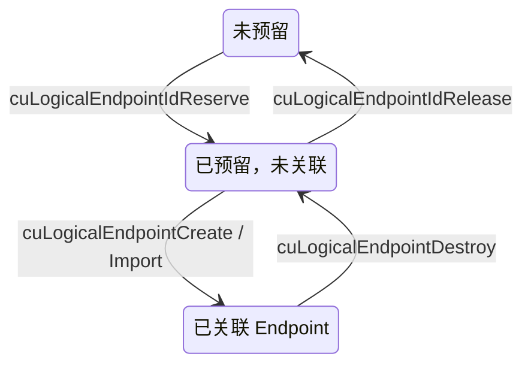

## 4.18. Compute Fabric Transport（Compute Fabric 传输）

来源：[CUDA Programming Guide — Compute Fabric Transport](https://docs.nvidia.com/cuda/cuda-programming-guide/04-special-topics/compute-fabric-transport.html)

> Compute fabric transport provides large-scale GPU-to-GPU communication over the NVLink fabric for communication libraries such as NCCL and NVSHMEM, through the NCCL Device API and NVSHMEM. Most developers should prefer those libraries when they match the needed communication pattern. Compute fabric transport is primarily intended for developers writing such communication libraries, or for applications that need fine-grained control when the pattern is not well captured by those libraries. Authors of custom communication kernels can also combine fabric operations with the NCCL and NVSHMEM device APIs when they need even more direct access than those device APIs alone provide.

Compute fabric transport 通过 NCCL Device API 和 NVSHMEM，为 NCCL、NVSHMEM 等通信库提供基于 NVLink fabric 的大规模 GPU 间通信能力。如果这些库能够满足所需通信模式，大多数开发者应优先使用它们。Compute fabric transport 主要面向通信库开发者，以及通信模式无法被现有库充分表达、需要细粒度控制的应用。自定义通信 kernel 的作者如果需要比这些 device API 更直接的访问方式，也可以将 fabric operation 与 NCCL、NVSHMEM device API 结合使用。

> The Unicast and Multicast memory sharing APIs let an application access GPU memory across the NVLink fabric by mapping remote physical memory into a local virtual address space. Once a peer allocation is mapped and given access rights, kernels access it like local memory using loads and stores (plus multimem instructions for multicast mappings). That model is both address-centric and memory-centric: the unit of sharing is a virtual-to-physical mapping, and every byte a kernel touches on a peer must be reachable through an address that the issuing process has reserved and mapped.

Unicast 和 Multicast memory sharing API 通过将远端物理内存映射到本地虚拟地址空间，使应用能够跨 NVLink fabric 访问 GPU 内存。Peer allocation 完成映射并授予访问权限后，kernel 就能像访问本地内存一样使用 load/store，multicast mapping 还可使用 multimem 指令。这种模型同时以地址和内存为中心：共享单位是虚拟地址到物理内存的映射，kernel 在 peer 上访问的每个字节，都必须能通过发起进程已预留并映射的地址到达。

> On a large NVLink fabric, this model has two limitations, and both affect how an application is written.

在大型 NVLink fabric 上，这种模型有两个限制，都会影响应用的编写方式。

> Virtual addresses provide no error propagation channel. When a kernel issues a load or store to a peer address, the hardware delivers either the data or a memory fault — there is no intermediate result that the issuing thread can inspect to detect and programmatically handle a failure. On large fabric systems, transient errors such as packet loss or link resets are a possibility, and at sufficient scale they become a consideration for resilient application design. A fabric error encountered during a remote access typically faults the access or terminates the process, and a GPU kernel has no way to respond to such a failure: no path to retry or reroute.

虚拟地址不提供错误传播通道。Kernel 对 peer 地址发起 load/store 时，硬件要么返回数据，要么产生 memory fault；发起线程无法检查某个中间结果来发现并以程序方式处理失败。大型 fabric 系统可能出现丢包、链路重置等瞬态错误，规模足够大时，这些错误就成为弹性应用设计必须考虑的问题。远程访问遇到 fabric 错误时，通常会导致访问故障或进程终止，GPU kernel 无法对此作出响应，也没有重试或改道的路径。

> Virtual addresses also name only memory. A mapping is defined in terms of physical memory, so a resource on the fabric that is not memory cannot be reached through a mapping at all.

虚拟地址也只能标识内存。Mapping 以物理内存定义，因此 fabric 上的非内存资源根本无法通过 mapping 访问。

> Compute fabric transport provides a complementary, resource-centric model for GPUs connected by the NVLink fabric. Instead of importing a peer’s memory into a local address space, an application creates a logical endpoint: a named transport object that represents a resource reachable over the fabric. A logical endpoint is identified by a 32-bit integer, a logical endpoint id, and a target within it is named by that id together with a 64-bit offset rather than by a virtual address. Because the id names the resource itself, the model is not tied to memory, though memory is currently the only kind of resource that logical endpoints expose.

Compute fabric transport 为通过 NVLink fabric 连接的 GPU 提供互补的、以资源为中心的模型。应用创建 logical endpoint，而不是将 peer 内存导入本地地址空间。Logical endpoint 是有名称的 transport object，表示 fabric 上可到达的资源。它由 32 位整数 logical endpoint ID 标识；其中的目标位置由该 ID 加上 64 位 offset 标识，而非虚拟地址。由于 ID 标识资源本身，这种模型不局限于内存，尽管目前 logical endpoint 暴露的资源类型仍只有内存。

> An imported endpoint also remains valid when the owner changes the endpoint’s backing memory. A peer imports the endpoint, associates it with one of its own reserved endpoint ids, and does not import the owner’s allocation. The owner can therefore grow, shrink, or replace the buffer behind the endpoint by rebinding it locally, and the peer can keep using its local endpoint id without re-importing the endpoint. The owner and its peers must still synchronize across the rebind so that peers do not access the endpoint while the owner is rebinding it to the new memory. Additionally, issuing an operation that lands outside the currently bound range is undefined behavior. By contrast, a VMM IPC import maps a specific allocation, so resizing that allocation on the owner side requires the peer to import and map the new one.

Owner 改变 endpoint 的 backing memory 时，已导入的 endpoint 仍然有效。Peer 导入 endpoint，并将其关联到自己预留的一个 endpoint ID，而不导入 owner 的 allocation。因此，owner 可以在本地重新绑定，扩大、缩小或替换 endpoint 背后的 buffer；peer 无需重新导入，仍可使用自己的本地 endpoint ID。但 owner 与 peer 必须在 rebind 前后同步，避免 owner 重新绑定新内存时 peer 访问 endpoint。此外，操作落到当前绑定范围之外会导致未定义行为。相比之下，VMM IPC import 映射的是特定 allocation；owner 改变该 allocation 大小时，peer 需要导入并映射新的 allocation。

> Once an endpoint has been created, shared with the peers that need it, and backed by a resource, asynchronous fabric operations — put, get, atomics, and reductions — can be issued against a peer’s logical endpoint id and offset. Unlike a load or store to a mapped peer address, a fabric operation reports an explicit completion status that the issuing code can inspect. On failure, the application can retry, reroute, or take other recovery action instead of faulting the process.

Endpoint 创建完成、与所需 peer 共享并绑定资源后，就可以针对 peer 的 logical endpoint ID 和 offset 发起 put、get、atomic、reduction 等异步 fabric operation。与通过映射的 peer 地址进行 load/store 不同，fabric operation 会报告显式 completion status，供发起代码检查。失败时，应用可以重试、改道或采取其他恢复措施，而不是直接使进程发生故障。

**解读：** Endpoint 提供一层可重绑定的资源标识，使 peer 使用稳定的本地 ID 与 offset，而不必持有 owner allocation 的映射地址。错误报告则为应用留下恢复入口；它不会自动实现重试协议，也不会让越界或错误生命周期操作变为合法。

| 维度 | 映射 Peer 内存 | Logical Endpoint |
| --- | --- | --- |
| 寻址 | 本地预留并映射的虚拟地址 | 本地 endpoint ID 与 offset |
| Peer 持有对象 | 指定 allocation 的映射 | Endpoint 的本地关联 |
| 替换 backing memory | 通常需导入、映射新 allocation | 协调暂停访问后，可由 owner rebind |
| 操作失败 | 指针访问故障路径 | Completion status 供程序检查 |

### 4.18.1. Prerequisites and Scope（先决条件与适用范围）

> Using logical endpoints has the following requirements:

使用 logical endpoint 需要满足以下条件：

- > CUDA driver API. The logical endpoint APIs are part of the low-level CUDA Driver API.

  CUDA Driver API：Logical endpoint API 属于底层 CUDA Driver API。

- > NVLink fabric connectivity and device support. The participating GPUs must be able to reach one another over an NVLink fabric. Whether a device supports logical endpoints depends on its architecture, the driver, and the system configuration, so an application should determine support by querying the device attributes described in Section 4.18.2.2 rather than inferring it from the hardware present.

  NVLink fabric 连通性与 device 支持：参与的 GPU 必须能够通过 NVLink fabric 相互到达。Device 是否支持 logical endpoint，取决于架构、driver 和系统配置，因此应用应查询 4.18.2.2 节所述 device 属性，而不是仅根据安装的硬件推断。

- > IMEX daemon and channels. Sharing an endpoint between processes uses fabric IPC handles, which require the NVIDIA IMEX daemon to be running and IMEX channels to be configured.

  IMEX daemon 与 channel：跨进程共享 endpoint 使用 fabric IPC handle，要求 NVIDIA IMEX daemon 正在运行，并已配置 IMEX channel。

> Endpoints can be shared with processes on the same node or on different nodes within the same NVLink fabric. The fabric IPC handle mechanism is similar to the one used by the VMM APIs. See Virtual Memory Management for details on fabric handles and IMEX channels.

Endpoint 可以与同一节点的进程共享，也可以与同一 NVLink fabric 内其他节点的进程共享。Fabric IPC handle 机制与 VMM API 使用的机制类似，fabric handle 和 IMEX channel 的细节见 Virtual Memory Management。

**解读：** 同一 NVLink fabric、device 功能支持、相应 clique 成员关系，以及 IMEX 的运行与访问配置需要分别满足。设备间存在 NVLink 连接，并不能替代 endpoint 能力与 clique 查询；跨节点也不是指任意网络连接的主机。

### 4.18.2. Preliminaries（基础概念）

> The following definitions establish the key objects and operations used in the rest of this section.

以下定义介绍本节后续使用的关键对象和操作。

#### 4.18.2.1. Definitions（定义）

> **Logical Endpoint Id:** A logical endpoint id (`CUlogicalEndpointId`) is a 32-bit value that names a logical endpoint within a process. Endpoint ids are process-local: each process reserves its own range with `cuLogicalEndpointIdReserve` and chooses which reserved id to associate with a given endpoint. Fabric operations address an endpoint by this id together with an offset. A single endpoint id names one endpoint, but multiple ids may name the same endpoint. An endpoint id is associated with an endpoint through `cuLogicalEndpointCreate` or `cuLogicalEndpointImport`. This association must be removed with `cuLogicalEndpointDestroy` before the endpoint id is released with `cuLogicalEndpointIdRelease`. Releasing an endpoint id while it remains associated with an endpoint is undefined behavior. A later reservation may reuse a released id. Section 4.18.6 describes the lifecycle of a logical endpoint id.

Logical Endpoint ID：`CUlogicalEndpointId` 是在进程内标识 logical endpoint 的 32 位值。Endpoint ID 是进程本地的：每个进程通过 `cuLogicalEndpointIdReserve` 预留自己的 ID 范围，并选择将哪个预留 ID 关联到某个 endpoint。Fabric operation 通过 ID 与 offset 寻址。一个 ID 标识一个 endpoint，但多个 ID 可以标识同一个 endpoint。`cuLogicalEndpointCreate` 或 `cuLogicalEndpointImport` 建立关联；调用 `cuLogicalEndpointIdRelease` 释放 ID 前，必须先用 `cuLogicalEndpointDestroy` 移除关联。释放仍有关联的 ID 会导致未定义行为。后续预留可能复用已释放的 ID。ID 生命周期详见 4.18.6 节。

> **Logical Endpoint:** A logical endpoint is a transport object that represents a resource reachable over the NVLink fabric, exposed as a bounded offset space. Creating the endpoint allocates resources used to route fabric operations addressed to it. The application must then explicitly bind a target resource to one or more ranges of the endpoint’s offset space. Fabric operations name their target using an associated endpoint id together with an offset into that space. An endpoint is associated with a reserved id when the process creates it with `cuLogicalEndpointCreate` or imports a peer endpoint with `cuLogicalEndpointImport`. Destroying an endpoint association before explicitly unbinding its resources unbinds those resources but does not destroy the resources themselves. Destroying the resources before unbinding them from the endpoint is undefined behavior. Section 4.18.3 outlines an endpoint’s lifecycle.

Logical Endpoint：它是表示 NVLink fabric 上可达资源的 transport object，对外暴露一个有界 offset 空间。创建 endpoint 会分配路由 fabric operation 所需的资源。随后，应用必须显式将目标资源绑定到 endpoint offset 空间的一个或多个范围。Fabric operation 用关联的 endpoint ID 和该空间中的 offset 标识目标。通过 `cuLogicalEndpointCreate` 创建，或通过 `cuLogicalEndpointImport` 导入 peer endpoint 时，都会将 endpoint 与预留 ID 关联。如果在显式 unbind 之前销毁 endpoint 关联，会解除其资源绑定，但不会销毁资源本身。在 unbind 前销毁资源会导致未定义行为。Endpoint 生命周期概述见 4.18.3 节。

> **Unicast Logical Endpoint:** A unicast logical endpoint represents a point-to-point transport target. It has a single owner device, specified when the endpoint is created, on which the endpoint’s bound memory resides. Peer devices issue put or get operations against the endpoint id to move data into or out of the owner’s bound memory.

Unicast Logical Endpoint：它表示点对点传输目标，只有一个在创建时指定的 owner device，绑定内存驻留在该 device 上。Peer device 针对 endpoint ID 发起 put/get，将数据移入或移出 owner 的绑定内存。

> **Multicast Logical Endpoint:** A multicast logical endpoint represents a transport target that exposes multiple resources at each offset. Before binding its resource, each participating process must add that resource to the multicast endpoint. The process then binds the resource to the endpoint. Together, these bindings create one replica per team member. Fabric operations targeting the multicast endpoint access the corresponding offset in every replica. A multicast logical endpoint is the compute fabric transport counterpart of the VMM multicast object described in Multicast Memory Sharing.

Multicast Logical Endpoint：它表示在每个 offset 暴露多个资源的传输目标。绑定资源前，每个参与进程必须先将相应资源加入 multicast endpoint，再执行绑定。这些绑定共同为 team 中每个成员形成一个 replica。针对 multicast endpoint 的 fabric operation 会访问各 replica 中对应的 offset。它对应于 Multicast Memory Sharing 中介绍的 VMM multicast object，但采用 compute fabric transport 模型。

> **Compute Fabric Transport Handle:** A compute fabric transport handle is a resource-centric alternative to a traditional pointer. It is the pair of a logical endpoint id and an offset: the logical endpoint id selects a destination on the NVLink fabric — a unicast endpoint’s owner device or a multicast team — and the offset selects a location within that destination’s bound memory. Fabric operations use this handle in place of a peer virtual address.

Compute Fabric Transport Handle：它是传统指针的资源式替代，由 logical endpoint ID 和 offset 组成。ID 选择 NVLink fabric 上的目标，即 unicast endpoint 的 owner device 或 multicast team；offset 选择该目标绑定内存中的位置。Fabric operation 使用这个 handle 代替 peer 虚拟地址。

> **Logical Endpoint Clique:** A logical endpoint clique is a dynamic group of GPUs that are mutually reachable over Compute Fabric Transport operations at a required level of capability. The clique type describes the desired level of capability. There are two logical endpoint clique types: `CU_CLIQUE_TYPE_UNICAST_LOGICAL_ENDPOINT` and `CU_CLIQUE_TYPE_MULTICAST_LOGICAL_ENDPOINT`. The clique id is a 32-bit value naming the dynamic group of GPUs. Attempting to import a logical endpoint onto a device that is not a member of the same clique as the exporter device will fail. Attempting to create a multicast logical endpoint by adding devices that don’t belong to the same clique will fail. A single device can be a member of several cliques. The program may query the cliques a device is part of using `cuDeviceGetCliqueCount` and `cuDeviceGetCliqueInfo`.

Logical Endpoint Clique：它是 GPU 的动态分组，组内 GPU 在所要求的能力级别上能够通过 Compute Fabric Transport 操作相互到达。Clique type 表示所需能力，有 `CU_CLIQUE_TYPE_UNICAST_LOGICAL_ENDPOINT` 和 `CU_CLIQUE_TYPE_MULTICAST_LOGICAL_ENDPOINT` 两种类型。Clique ID 是标识这个动态 GPU 分组的 32 位值。如果 importer device 与 exporter device 不属于同一 clique，导入 logical endpoint 会失败；向 multicast endpoint 添加不属于同一 clique 的 device 也会失败。一个 device 可以属于多个 clique，可通过 `cuDeviceGetCliqueCount` 和 `cuDeviceGetCliqueInfo` 查询。

> **Endpoint Binding:** Endpoint binding is the association between a range in a logical endpoint’s offset space and a physical memory allocation supplied by the application. The application can bind memory using a mapped virtual address with `cuLogicalEndpointBindAddr` or by allocation handle with `cuLogicalEndpointBindMem`. Fabric operations are valid only for endpoint ranges that have been bound, and bindings must satisfy the endpoint’s alignment and size limits. See Section 4.18.8 and Section 4.18.6.1.

Endpoint Binding：它将 logical endpoint offset 空间中的一段范围，与应用提供的物理内存 allocation 关联起来。应用可以通过 `cuLogicalEndpointBindAddr` 使用已映射的虚拟地址绑定，也可以通过 `cuLogicalEndpointBindMem` 使用 allocation handle 绑定。Fabric operation 只对已绑定的 endpoint 范围有效，而且 binding 必须满足 endpoint 的对齐与大小限制。参见 4.18.8 和 4.18.6.1 节。

**解读：** ID、endpoint、backing allocation 是三类不同对象：ID 是进程本地名称，endpoint 是传输资源，allocation 是实际存储。原文在 multicast 定义中说先添加“资源”，后面的具体 API 则是先 `cuLogicalEndpointAddDevice` 加入 device，再为该 device 绑定内存，应按这两个步骤理解。

> All fabric operations are asynchronous: issuing one only initiates the transfer. Their completion and status are reported explicitly through the completion mechanism provided by each operation (see Section 4.18.10).

所有 fabric operation 都是异步的：发起操作只是开始传输。完成情况与状态通过各操作提供的 completion 机制显式报告，见 4.18.10 节。

> **Put and Get Operations:** Put and get are data-movement primitives that compute fabric transport provides. A put operation moves data from the issuing GPU to a target logical endpoint. The multimem variant, `cuda::ptx::fabric_try_put_multimem`, performs a broadcast to a multicast logical endpoint, writing the source data to the corresponding offset in every replica. A get operation moves data from a target logical endpoint to the issuing GPU. In both directions, the remote side is identified by a logical endpoint id and offset rather than by a peer virtual address, and the remote allocation does not need to be mapped into the issuing process’s virtual address space.

Put 与 Get：它们是 compute fabric transport 提供的数据移动原语。Put 将数据从 issuing GPU 移动到目标 logical endpoint。Multimem 变体 `cuda::ptx::fabric_try_put_multimem` 向 multicast endpoint 广播，将源数据写入每个 replica 的对应 offset。Get 将数据从目标 endpoint 移动到 issuing GPU。两个方向都使用 endpoint ID 与 offset 标识远端，而非 peer 虚拟地址；远端 allocation 无需映射到 issuing process 的虚拟地址空间。

> **Reduction and Pull-Reduction Operations:** A reduction operation (red) combines data from the issuing GPU into a target logical endpoint using a reduction operator. A pull-reduction operation (pull_red) reads from a target multicast logical endpoint, combines values across the multicast team’s replicas with a reduction operator, and returns the result to the issuing GPU. It is the fabric counterpart of `multimem.ld_reduce`.

Reduction 与 Pull-Reduction：Reduction（red）使用归约 operator，将 issuing GPU 的数据合并到目标 logical endpoint。Pull-reduction（pull_red）从目标 multicast endpoint 读取数据，使用归约 operator 合并 multicast team 各 replica 的值，并将结果返回 issuing GPU。它是 `multimem.ld_reduce` 在 fabric 模型中的对应操作。

> **Atomic Operations:** An atomic operation (atom) performs an atomic read-modify-write on a target logical endpoint. It reads the original value, overwrites it with a new value, and returns the original value. In contrast, a reduction operation does not return the original value. Operators for computing the new value include add, min, max, bitwise and, or, and xor. An exchange operation stores a user-provided value, and compare-and-swap stores a new value only if the target holds the expected compare value.

Atomic：Atomic（atom）对目标 logical endpoint 执行原子的 read-modify-write，读取旧值、写入新值，并返回旧值；reduction 则不返回旧值。计算新值的 operator 包括 add、min、max 以及按位 and、or、xor。Exchange 直接存入用户提供的值；compare-and-swap 仅在目标值等于预期比较值时写入新值。

> **Counted Operation:** A counted operation is a fabric operation that increments a target counter by the number of bytes written to the destination as data arrives. The receiver waits for the counter to reach an expected byte count before consuming the data. The receiver does not know which bytes have been written until this expected byte count is reached. Once the counter reaches the expected byte count, the receiver can safely consume the data. The counter must be aligned to a 256-byte boundary in endpoint memory. Endpoints must be created with counted operation support enabled (`CU_LOGICAL_ENDPOINT_FLAG_COUNTED_OPS`), and applications must query device support (`CU_DEVICE_ATTRIBUTE_LOGICAL_ENDPOINT_COUNTED_OPS_SUPPORTED`) before using this capability.

Counted Operation：数据到达时，操作按照写入目标的字节数递增目标 counter。Receiver 在消费数据前，等待 counter 达到预期字节数；在此之前，它不知道具体哪些字节已写入。达到预期字节数后，receiver 可以安全消费数据。Counter 在 endpoint memory 中必须按 256 字节边界对齐。创建 endpoint 时必须启用 `CU_LOGICAL_ENDPOINT_FLAG_COUNTED_OPS`，使用前还必须查询 `CU_DEVICE_ATTRIBUTE_LOGICAL_ENDPOINT_COUNTED_OPS_SUPPORTED`。

> **Completion Status and Error Reporting:** A fabric operation is tracked by a completion object, which signals when the operation has completed and records the operation’s status. Waiting on that object indicates whether the tracked operations completed successfully or whether a fabric error occurred. When a failure is reported, the application can query the detailed per-operation error status and then retry, reroute, or otherwise recover instead of faulting the process.

Completion Status 与 Error Reporting：Completion object 跟踪 fabric operation，既通知操作完成，也记录状态。等待该对象后，可以判断所跟踪操作是否成功完成，或是否发生 fabric 错误。失败时，应用可查询详细的操作错误状态，然后重试、改道或以其他方式恢复，而不是使进程直接发生故障。

> Because fabric operation updates are delivered out of order, observing that one destination location has been written — for example, the last byte of the destination region — does not imply that the rest of the transfer has landed. Observing that every destination location has been written does not indicate that the operation completed successfully and that the destination resource can be reused. For example, the producer may receive an error status if the response is dropped, causing it to retry the operation. Therefore, applications must wait for completion and inspect the reported status before treating the operation as complete. See Section 4.18.10.

Fabric operation 的更新乱序到达，因此看到某个目标位置已写入，例如目标区域的最后一个字节，并不表示其他数据已到达。即使观察到所有位置都已写入，也不表示操作成功完成，更不表示目标资源可以复用。例如响应丢失时，producer 可能收到错误状态并重试。因此，应用必须等待 completion 并检查报告状态，才能将操作视为完成。见 4.18.10 节。

**解读：** 接收端 byte counter、发送端 completion object 与应用的数据复用协议承担不同责任。Counter 达标表示相应数据到达条件满足；不能由此推断发送端已得到成功响应，或再无重试会写入。若数据要通过普通指针消费，还需遵守后文的 proxy ordering。

#### 4.18.2.2. Query for Support（查询支持情况）

> Applications should query support before using logical endpoint APIs, because availability depends on the GPU architecture, the driver, and the system configuration. The following device attributes describe the relevant capabilities. The features are independent, so an application should query exactly the ones it intends to use.

使用 logical endpoint API 前应查询支持情况，因为可用性取决于 GPU 架构、driver 与系统配置。下列 device 属性描述相关能力；各项功能相互独立，应用应逐项查询自己实际要使用的能力。

> **Unicast Logical Endpoint Support**

**Unicast Logical Endpoint 支持**

> Query whether a device supports unicast logical endpoints:

查询 device 是否支持 unicast logical endpoint：

```cpp
int unicastSupported = 0;
cuDeviceGetAttribute(&unicastSupported,
                     CU_DEVICE_ATTRIBUTE_LOGICAL_ENDPOINT_UNICAST_SUPPORTED,
                     device);
if (unicastSupported != 0) {
    // `device` supports unicast logical endpoints
}
```

> **Multicast Logical Endpoint Support**

**Multicast Logical Endpoint 支持**

> Query whether a device supports multicast logical endpoints:

查询 device 是否支持 multicast logical endpoint：

```cpp
int multicastSupported = 0;
cuDeviceGetAttribute(&multicastSupported,
                     CU_DEVICE_ATTRIBUTE_LOGICAL_ENDPOINT_MULTICAST_SUPPORTED,
                     device);
if (multicastSupported != 0) {
    // `device` supports multicast logical endpoints
}
```

> **Logical Endpoint IPC Handle Support**

**Logical Endpoint IPC Handle 支持**

> Before exporting or importing an endpoint, query the IPC handle types that the device supports for logical endpoints. The attribute returns a bitmask of `CUlogicalEndpointIpcHandleType` values. The following checks whether the fabric IPC handle type for logical endpoints is supported:

导出或导入 endpoint 前，查询 device 支持的 logical endpoint IPC handle 类型。该属性返回 `CUlogicalEndpointIpcHandleType` 值的位掩码。下面检查是否支持 logical endpoint 的 fabric IPC handle 类型：

```cpp
int supportedHandleTypes = 0;
cuDeviceGetAttribute(
    &supportedHandleTypes,
    CU_DEVICE_ATTRIBUTE_LOGICAL_ENDPOINT_SUPPORTED_HANDLE_TYPES,
    device);
if ((supportedHandleTypes &
     CU_LOGICAL_ENDPOINT_IPC_HANDLE_TYPE_FABRIC) != 0) {
    // `device` supports fabric IPC handles for logical endpoints
}
```

> **Counted Operations Support**

**Counted Operation 支持**

> Counted operations are an optional capability. Query whether a device supports them before requesting `CU_LOGICAL_ENDPOINT_FLAG_COUNTED_OPS` on an endpoint:

Counted operation 是可选能力。在为 endpoint 请求 `CU_LOGICAL_ENDPOINT_FLAG_COUNTED_OPS` 前，应先查询 device 是否支持：

```cpp
int countedOpsSupported = 0;
cuDeviceGetAttribute(&countedOpsSupported,
                     CU_DEVICE_ATTRIBUTE_LOGICAL_ENDPOINT_COUNTED_OPS_SUPPORTED,
                     device);
if (countedOpsSupported != 0) {
    // `device` supports counted operations via logical endpoints
}
```

> **Unicast Access from Owner Device**

**Owner Device 访问 Unicast Endpoint**

> The owner device of a unicast endpoint is specified in the endpoint properties passed to `cuLogicalEndpointCreate`. The `CU_DEVICE_ATTRIBUTE_LOGICAL_ENDPOINT_UNICAST_ACCESS_ON_OWNER_DEVICE_SUPPORTED` device attribute indicates whether this device can access the unicast logical endpoints it owns. If this access is not supported, the device can access the bound memory through pointers, which currently provides the best performance for the owner device. Devices other than the owner can access a unicast endpoint through a logical endpoint id associated with that endpoint.

Unicast endpoint 的 owner device 由传给 `cuLogicalEndpointCreate` 的 endpoint properties 指定。`CU_DEVICE_ATTRIBUTE_LOGICAL_ENDPOINT_UNICAST_ACCESS_ON_OWNER_DEVICE_SUPPORTED` 表示该 device 是否能够通过 unicast endpoint 访问自己拥有的 endpoint。如果不支持，它仍可通过指针访问绑定内存；按原文所述，这也是目前 owner device 性能最好的方式。Owner 之外的 device 可以通过与 endpoint 关联的 logical endpoint ID 访问它。

```cpp
int ownerAccessSupported = 0;
cuDeviceGetAttribute(&ownerAccessSupported,
                     CU_DEVICE_ATTRIBUTE_LOGICAL_ENDPOINT_UNICAST_ACCESS_ON_OWNER_DEVICE_SUPPORTED,
                     device);
if (ownerAccessSupported != 0) {
    // `device` supports unicast logical endpoint access on the owner device
}
```

**解读：** 这些查询返回的是不同能力，不能由 unicast 支持推断 multicast、counted 或 owner 自访问也支持。示例省略了 API 返回状态检查；实际要区分“查询成功但不支持”和“查询本身失败”。Owner 用本地指针访问 backing memory 时，仍须处理与 fabric 操作之间的顺序。

### 4.18.3. API Overview（API 概览）

> The logical endpoint APIs are part of the low-level CUDA Driver API, and working with a logical endpoint follows a well-defined lifecycle. The steps below outline the workflow, and the sections that follow cover each step in detail. They fall into the following phases:

Logical endpoint API 属于底层 CUDA Driver API，使用 endpoint 有明确的生命周期。下面概述工作流程，后续各节再逐步展开。这些步骤可分为以下阶段：

- > Setup phase (Steps 1-11): Verify participating devices are members of the same clique, reserve an id, describe and create the endpoint, share it with peers, confirm that it is ready, then allocate and bind its backing memory before data movement begins.

  Setup 阶段（步骤 1–11）：验证参与 device 属于同一 clique，预留 ID，描述并创建 endpoint，与 peer 共享，确认就绪，然后在数据移动前分配并绑定 backing memory。

- > Use phase (Step 12): Issue fabric operations against the endpoint from the device.

  Use 阶段（步骤 12）：从 device 针对 endpoint 发起 fabric operation。

- > Cleanup phase (Step 13): Unbind and destroy the endpoint, release its ids, and free the backing memory after all uses have completed.

  Cleanup 阶段（步骤 13）：所有使用都完成后，unbind 并销毁 endpoint，释放 ID，再释放 backing memory。

1. > Verify clique membership. Verify that participating devices belong to the same clique with `cuDeviceGetCliqueCount` and `cuDeviceGetCliqueInfo` as described in Section 4.18.4.

   验证 clique 成员关系：通过 `cuDeviceGetCliqueCount` 和 `cuDeviceGetCliqueInfo` 确认所有参与 device 属于同一 clique，见 4.18.4 节。

2. > Reserve ids. Reserve a range of logical endpoint ids with `cuLogicalEndpointIdReserve`. Reservation is per process. The id lifecycle and the rules for reuse and release are described in Section 4.18.6.

   预留 ID：通过 `cuLogicalEndpointIdReserve` 预留一段 logical endpoint ID。预留按进程进行。ID 生命周期及复用、释放规则见 4.18.6 节。

3. > Describe the endpoint. Populate a `CUlogicalEndpointProp` with the endpoint type (unicast or multicast), the owner device for unicast or group size for multicast, the size, the requested IPC handle types (ipcHandleTypes), and any flags — for example, `CU_LOGICAL_ENDPOINT_FLAG_COUNTED_OPS` to request support for counted operations (see Counted Operation).

   描述 endpoint：填充 `CUlogicalEndpointProp`，指定类型（unicast 或 multicast）、unicast 的 owner device 或 multicast 的组大小、endpoint 大小、请求的 IPC handle 类型 ipcHandleTypes，以及 flags，例如请求 counted operation 支持的 `CU_LOGICAL_ENDPOINT_FLAG_COUNTED_OPS`，参见 Counted Operation。

4. > Check alignment and size limits. Call `cuLogicalEndpointGetLimits` for the proposed properties to obtain the required bindAlignment and maxSize. maxSize is the largest endpoint size the configuration permits. The endpoint size and all bindings must satisfy these limits.

   检查对齐和大小限制：用拟采用的 properties 调用 `cuLogicalEndpointGetLimits`，获取 bindAlignment 和 maxSize。maxSize 是该配置允许的最大 endpoint 大小。Endpoint 大小和全部 binding 都必须满足这些限制。

5. > Create the endpoint. Call `cuLogicalEndpointCreate` to associate one of the reserved ids with a newly created endpoint described by the `CUlogicalEndpointProp` populated above.

   创建 endpoint：调用 `cuLogicalEndpointCreate`，将一个预留 ID 与按上述 `CUlogicalEndpointProp` 创建的新 endpoint 关联。

6. > Share the endpoint. Export the endpoint to a fabric IPC handle with `cuLogicalEndpointExport`, transfer the handle through any IPC mechanism to the peer processes that need it, and have each peer process import it with `cuLogicalEndpointImport`. Exporting and importing the endpoint do not require memory to be bound to it.

   共享 endpoint：通过 `cuLogicalEndpointExport` 导出 fabric IPC handle，以任意 IPC 机制传给需要访问的 peer process，再由各 peer 使用 `cuLogicalEndpointImport` 导入。Export/import 时不要求 endpoint 已绑定内存。

7. > Add devices (multicast only). For a multicast endpoint, every participating device must be added to the group with `cuLogicalEndpointAddDevice`. Each process adds its own device after it holds the endpoint locally, so for multicast the endpoint is shared before the devices are added.

   添加 device，仅适用于 multicast：每个参与 device 都必须通过 `cuLogicalEndpointAddDevice` 加入 group。每个进程在本地持有 endpoint 后添加自己的 device，因此 multicast 先共享 endpoint，再添加 device。

8. > Confirm readiness. Both `cuLogicalEndpointCreate` and `cuLogicalEndpointImport` are non-blocking. Use `cuLogicalEndpointQuery` to confirm readiness before use. Confirm a locally created endpoint before binding its memory and an imported endpoint before a kernel issues operations against it.

   确认就绪：`cuLogicalEndpointCreate` 和 `cuLogicalEndpointImport` 均非阻塞。使用前应通过 `cuLogicalEndpointQuery` 确认 readiness。本地创建的 endpoint 必须在 binding 前确认；imported endpoint 必须在 kernel 针对它发起操作前确认。

9. > Allocate backing memory. Allocate backing memory with the Virtual Memory Management APIs (`cuMemCreate`) or via `cudaMallocAsync`. The bound memory must be externally shareable if the endpoint will be shared with another process. The same requirement applies when memory is bound through an imported multicast endpoint. Configure the allocation for external sharing by requesting the fabric handle type (`CU_MEM_HANDLE_TYPE_FABRIC`) when creating it, and size the allocation to satisfy both bindAlignment and the allocation granularity. This step and endpoint creation are independent, but both must complete before binding.

   分配 backing memory：用 VMM API `cuMemCreate` 或 `cudaMallocAsync` 分配。如果 endpoint 要与其他进程共享，绑定内存必须支持外部共享；通过 imported multicast endpoint 绑定内存也有同样要求。创建 allocation 时请求 `CU_MEM_HANDLE_TYPE_FABRIC`，以配置外部共享；其大小同时满足 bindAlignment 和 allocation granularity。该步骤与 endpoint 创建互相独立，但二者都必须在 binding 前完成。

10. > Bind memory. Associate physical memory with the endpoint using `cuLogicalEndpointBindMem` (by allocation handle) or `cuLogicalEndpointBindAddr` (by mapped address). Memory cannot be bound to an imported unicast endpoint, but it can be bound to an imported multicast endpoint. Fabric operations are valid only for ranges that have been bound.

    绑定内存：通过 `cuLogicalEndpointBindMem` 按 allocation handle，或通过 `cuLogicalEndpointBindAddr` 按 mapped address，将物理内存与 endpoint 关联。Imported unicast endpoint 不能绑定内存，imported multicast endpoint 可以。Fabric operation 只对已绑定范围有效。

11. > Synchronize after binding. Before any process issues fabric operations, participating processes must synchronize after binding, as described in Section 4.18.8.

    Binding 后同步：任何进程发起 fabric operation 前，参与进程都必须在 binding 后同步，见 4.18.8 节。

12. > Use the endpoint. Launch kernels that issue fabric operations against peer endpoint ids.

    使用 endpoint：启动 kernel，针对 peer endpoint ID 发起 fabric operation。

13. > Clean up. Unbind memory, destroy the endpoints, release the id range, and free the backing memory.

    清理：Unbind 内存，销毁 endpoint，释放 ID 范围，最后释放 backing memory。

**解读：** Setup 有两条可独立准备的路径：endpoint 的创建、共享与 readiness，以及 backing allocation 的创建。两者在 binding 汇合；binding 后还要与 peer 建立同步，才进入数据传输阶段。Multicast 必须先共享再让各 device 加入，不能在 group 尚不完整时等待 readiness 而阻止其他成员加入。

### 4.18.4. Verify clique membership（验证 Clique 成员关系）

> Before we can issue any compute fabric transport operations, we need to make sure that all participating devices are members of a clique that supports the desired set of compute fabric transport operations, and that they are all members of the same clique for a particular clique type. Otherwise, the devices cannot reach each other over the network with that particular type of operation.

发起任何 compute fabric transport operation 前，必须确认所有参与 device 属于支持所需操作集合的 clique，并且对于指定 clique type，它们属于同一个 clique。否则，这些 device 无法通过该类操作在网络上相互到达。

> First, we query how many cliques this device is a member of:

首先查询本 device 属于多少个 clique：

```cpp
  size_t cliqueCount = 0; // not modified if there are errors
  cuDeviceGetCliqueCount(&cliqueCount, cuDevice);
```

> Then, we query the clique information for all cliques this device is a member of and find the clique id of the clique we will be using. In this example we will be using the clique with type `CU_CLIQUE_TYPE_UNICAST_LOGICAL_ENDPOINT`.

然后查询该 device 所属全部 clique 的信息，找出将要使用的 clique ID。本例选择类型为 `CU_CLIQUE_TYPE_UNICAST_LOGICAL_ENDPOINT` 的 clique。

```cpp
  std::vector<CUcliqueInfo> cliqueInfos(cliqueCount);
  cuDeviceGetCliqueInfo(cliqueInfos.data(), &cliqueCount, cuDevice);
  unsigned int localCliqueId = 0;
  bool found = false;
  for (size_t idx = 0; idx < cliqueCount; ++idx) {
    if (cliqueInfos[idx].type == CU_CLIQUE_TYPE_UNICAST_LOGICAL_ENDPOINT) {
      localCliqueId = cliqueInfos[idx].id;
      found = true;
      break;
    }
  }
```

> Verify that all participating devices have the same clique id for that clique type.

验证所有参与 device 对于该 clique type 具有相同 clique ID。

```cpp
  std::vector<unsigned int> allCliqueIds(numRanks);
  MPI_Allgather(&localCliqueId, sizeof(unsigned int), MPI_BYTE,
                          allCliqueIds.data(), sizeof(unsigned int), MPI_BYTE, MPI_COMM_WORLD);
  for (int i = 0; i < numRanks; i++) {
    if (allCliqueIds[i] != localCliqueId) {
      fprintf(stderr, "Rank %d: Clique id %u does not match expected %u\n", myRank, allCliqueIds[i], localCliqueId);
      return EXIT_FAILURE;
    }
  }
```

**原文示例检查：** 第二段设置了 `found`，后续却没有检查。若所有 rank 都没找到所需 clique，默认 `localCliqueId = 0` 仍可能全部相等，不能据此证明可通信。应先确认每个 rank 的查询成功且确实找到目标类型，再交换并比较 ID。分布式错误路径也应协调退出，避免某个 rank 提前返回、其他 rank 留在 collective 中等待。

### 4.18.5. Creating an Endpoint（创建 Endpoint）

> Creating and importing endpoints begins by determining how many logical endpoint ids the process needs. Then reserve a range of ids with `cuLogicalEndpointIdReserve`, which returns the base id of the range. Choose a count large enough for every endpoint that the process will create or import. The endpoints associated with the range may have different properties. For example, an application may reserve one id per GPU plus one id for a multicast endpoint. The example reserves one id per rank:

创建和导入 endpoint 前，先确定进程需要多少个 logical endpoint ID，再通过 `cuLogicalEndpointIdReserve` 预留范围，并通过输出参数获得标识该范围起点的 base ID。数量必须足以容纳本进程要创建或导入的全部 endpoint；范围内各 ID 关联的 endpoint 可以具有不同 properties。例如应用可为每个 GPU 预留一个 ID，再额外为 multicast endpoint 预留一个。本例按每个 rank 一个 ID 预留：

```cpp
  CUlogicalEndpointId leId = 0;
  cuLogicalEndpointIdReserve(&leId, (uint32_t)numRanks);
```

> After reserving the range, associate its ids as endpoints are created or imported. Use `cuLogicalEndpointCreate` for a locally created endpoint and `cuLogicalEndpointImport` when a remote endpoint’s handle becomes available. For each endpoint that the process creates, describe its properties in a `CUlogicalEndpointProp`. A unicast endpoint names the single owner device that will hold its bound memory. Set the endpoint type, the requested IPC handle types (ipcHandleTypes), and any flags, opting in to counted operations only when requested:

预留范围后，在创建或导入 endpoint 时关联其中的 ID。本地创建使用 `cuLogicalEndpointCreate`，收到远端 endpoint handle 后使用 `cuLogicalEndpointImport`。对每个本地创建的 endpoint，使用 `CUlogicalEndpointProp` 描述属性。Unicast endpoint 指定唯一 owner device，绑定内存将位于该 device。设置 endpoint 类型、请求的 IPC handle 类型 ipcHandleTypes 和 flags，仅在需要时启用 counted operation：

```cpp
  CUlogicalEndpointProp endpointProp {};
  endpointProp.type = CU_LOGICAL_ENDPOINT_TYPE_UNICAST;
  endpointProp.unicast = {.device = cuDevice};
  endpointProp.ipcHandleTypes = CU_LOGICAL_ENDPOINT_IPC_HANDLE_TYPE_FABRIC;
  endpointProp.flags = useCounted ? CU_LOGICAL_ENDPOINT_FLAG_COUNTED_OPS : CU_LOGICAL_ENDPOINT_FLAG_NONE;
```

> The endpoint size is set separately, once its alignment and maximum-size limits are known. See Section 4.18.6.1 for how these are queried and how the size is chosen.

Endpoint 的大小在获知对齐和最大大小限制后单独设置。如何查询限制和选择大小见 4.18.6.1 节。

> Associate a reserved id with the described properties by calling `cuLogicalEndpointCreate`. A process that creates a local endpoint and imports peer endpoints typically reserves one id per participant so that a peer is addressed as the base id plus its rank. Each rank creates its own endpoint at leId + myRank:

调用 `cuLogicalEndpointCreate`，将预留 ID 与上述 properties 所描述的 endpoint 关联。既创建本地 endpoint 又导入 peer endpoint 的进程，通常为每个参与者预留一个 ID，以便用 base ID 加 rank 寻址 peer。每个 rank 在 leId + myRank 处创建自己的 endpoint：

```cpp
  cuLogicalEndpointCreate(leId + myRank, &endpointProp);
```

> `cuLogicalEndpointCreate` is non-blocking, so the endpoint is not usable the moment it returns. Confirm that it is fully constructed with `cuLogicalEndpointQuery` before binding memory to it, as described in Section 4.18.7.1.

`cuLogicalEndpointCreate` 非阻塞，因此返回时 endpoint 并不立即可用。Binding 前必须通过 `cuLogicalEndpointQuery` 确认它已经完整构造，见 4.18.7.1 节。

**原文示例上下文：** `endpointProp.size` 的设置被留到后文说明，但创建 endpoint 前必须完成。这里的 create 片段不能直接接在零初始化 properties 后运行；应先查询 limits、选择满足对齐和 `maxSize` 的大小，并补齐错误处理。

> Multicast endpoint. A multicast endpoint follows the same steps, differing in how it is described and in requiring a group of devices to be added. It is described with type = `CU_LOGICAL_ENDPOINT_TYPE_MULTICAST` and multicast.numDevices set to the number of devices in the multicast group. Once it has been created and shared, every participating device must join the group with `cuLogicalEndpointAddDevice`. A process adds its own device only after it holds the endpoint locally — the creator after `cuLogicalEndpointCreate` and each peer after `cuLogicalEndpointImport`. The endpoint is not ready for use until the multicast group is complete. Membership is permanent for the lifetime of the endpoint.

Multicast endpoint：步骤基本相同，区别在于 properties 以及需要添加 device group。类型设为 `CU_LOGICAL_ENDPOINT_TYPE_MULTICAST`，multicast.numDevices 设为 multicast group 的 device 数量。创建并共享后，每个参与 device 必须通过 `cuLogicalEndpointAddDevice` 加入。进程只能在本地持有 endpoint 后添加自己的 device：creator 在 create 之后，peer 在 import 之后。Multicast group 完整之前，endpoint 不会就绪。成员关系在 endpoint 整个生命周期内不可撤销。

### 4.18.6. Logical Endpoint Ids（Logical Endpoint ID）

> A logical endpoint id is a process-local name whose lifecycle is separate from that of the endpoint it identifies. An endpoint id is always in one of the following states:

Logical endpoint ID 是进程本地名称，其生命周期独立于它标识的 endpoint。ID 始终处于以下状态之一：

- > Not reserved. The id is not owned by the process and cannot be associated with an endpoint. `cuLogicalEndpointIdReserve` reserves it.

  未预留：ID 不属于当前进程，不能关联 endpoint。`cuLogicalEndpointIdReserve` 将其预留。

- > Reserved. The id is owned by the process but names nothing. Calling `cuLogicalEndpointCreate` or `cuLogicalEndpointImport` with a reserved id associates it with an endpoint and moves it to the associated state. `cuLogicalEndpointIdRelease` returns it to the not-reserved state.

  已预留：ID 属于进程，但尚不标识任何对象。对该 ID 调用 `cuLogicalEndpointCreate` 或 `cuLogicalEndpointImport`，会建立 endpoint 关联并进入 associated 状态。`cuLogicalEndpointIdRelease` 则将其返回未预留状态。

- > Associated. The id names an endpoint, and fabric operations that use the id target that endpoint. `cuLogicalEndpointDestroy` removes the association and returns the id to the reserved state.

  已关联：ID 标识一个 endpoint，使用该 ID 的 fabric operation 以此 endpoint 为目标。`cuLogicalEndpointDestroy` 移除关联，使 ID 返回已预留状态。

> `cuLogicalEndpointIdReserve` reserves a range of count endpoint ids and returns its base, baseLeId, so the reserved range is [baseLeId, baseLeId + count). The base is an output: the caller does not choose which ids it receives, and reservation fails if no range of count ids is available, for example because another library in the process holds reservations.

`cuLogicalEndpointIdReserve` 预留 count 个 endpoint ID 并返回基址 baseLeId，范围为 [baseLeId, baseLeId + count)。Base 是输出值，调用方不能选择得到哪些 ID。如果没有 count 个 ID 的可用范围，例如进程内另一个库占有预留范围，预留就会失败。

> An endpoint may be associated with several ids at once. For instance, it can be associated with the owner’s id through `cuLogicalEndpointCreate` and with additional ids through `cuLogicalEndpointImport`. Such ids are aliases for the same endpoint, and an operation issued against any of them reaches the same destination.

一个 endpoint 可以同时关联多个 ID。例如 owner 的 ID 经 `cuLogicalEndpointCreate` 与它关联，其他 ID 经 `cuLogicalEndpointImport` 与它关联。这些 ID 是同一个 endpoint 的 alias；针对任意 alias 发起的操作都到达同一目标。

> `cuLogicalEndpointDestroy` removes the association for one id. That id can then be associated with a different endpoint by a later create or import, without being reserved again. Destroy also unbinds any memory this process bound through the id. The endpoint itself is freed only when the last of its aliases is destroyed.

`cuLogicalEndpointDestroy` 移除一个 ID 的关联。之后该 ID 无需再次预留，就能通过 create/import 关联到其他 endpoint。Destroy 还会解除本进程经该 ID 建立的内存绑定。只有最后一个 alias 被销毁，endpoint 本身才会释放。

> `cuLogicalEndpointIdRelease`(baseLeId, count) releases up to count ids in the range [baseLeId, baseLeId + count). Every id in the range must have been reserved, and every endpoint associated with an id in the range must first have been destroyed.

`cuLogicalEndpointIdRelease`(baseLeId, count) 释放范围 [baseLeId, baseLeId + count) 中至多 count 个 ID。范围内每个 ID 都必须已预留，并且关联到这些 ID 的 endpoint 关联必须先销毁。

> Because reservation is per process, an endpoint need not be imported with the same id in every importing process. A convenient convention is for each process to reserve a range of the same size, one id per participant, and address a given peer’s endpoint as baseLeId + peer locally. Each process has its own reserved baseLeId, which need not match across processes. CUDA does not detect or report a mismatch if the same peer endpoint is imported with different ids in different processes. Maintaining the correct local peer-to-endpoint-id mapping is the application’s responsibility.

预留按进程进行，所以每个 importer 不必使用同一个数值的 ID 导入 endpoint。常见约定是每个进程预留相同大小的范围，每个参与者一个 ID，在本地用 baseLeId + peer 寻址该 peer 的 endpoint。各进程的 baseLeId 可以不同。如果不同进程用不同 ID 导入同一个 peer endpoint，CUDA 不会将其视为不匹配并报告。维护正确的本地 peer 到 endpoint ID 映射是应用的责任。

**解读：** `Destroy` 释放关联，`IdRelease` 归还编号范围；它们不是同一步。下面仅表示 ID 状态，不表示底层内存已释放。



不同进程可以用不同数值的 ID 访问同一个 endpoint；相同数值在不同进程也不保证表示同一个 endpoint。应用应维护本地 peer 映射，而不是直接交换 ID 数值来替代 fabric handle。

#### 4.18.6.1. Limits and Alignment（大小限制与对齐）

> The alignment and maximum-size requirements of an endpoint depend on its properties, so they must be queried for the specific configuration being created rather than assumed. `cuLogicalEndpointGetLimits` returns both values for a given `CUlogicalEndpointProp`:

Endpoint 的对齐和最大大小要求取决于 properties，必须针对将要创建的配置查询，不能自行假定。`cuLogicalEndpointGetLimits` 根据 `CUlogicalEndpointProp` 返回两个值：

```cpp
cuuint64_t bindAlignment = 0;
cuuint64_t maxSize = 0;
cuLogicalEndpointGetLimits(&bindAlignment, &maxSize, &prop);
```

> The endpoint size and every bind offset must be a multiple of the returned bindAlignment. maxSize is the maximum size of the logical endpoint. If maxSize is less than `CUlogicalEndpointProp::size`, the application must adjust the request to that smaller value. To expose the entire requested range, the application may partition it across multiple endpoints, each no larger than maxSize.

Endpoint 大小和每个 bind offset 都必须是 bindAlignment 的整数倍。maxSize 表示 endpoint 的最大大小。如果 maxSize 小于 `CUlogicalEndpointProp::size`，应用必须缩小请求。若要暴露整个请求范围，可将其分散到多个 endpoint，每个不超过 maxSize。

> A single allocation covering the whole endpoint is the simplest arrangement, but it is not a requirement. An endpoint’s offset space may equally be backed by several bindings that map distinct, possibly non-contiguous physical allocations, as long as every bound range is a multiple of bindAlignment.

用单个 allocation 覆盖整个 endpoint 最简单，但并非必须。也可以通过多个 binding，为 offset 空间映射不同、物理上可能不连续的 allocation，只要每个绑定范围的大小都是 bindAlignment 的整数倍。

**解读：** 对齐至少涉及 endpoint 的 `bindAlignment`、backing allocation 的分配粒度，以及具体 fabric 指令的数据对齐，不能混为一项。`maxSize` 限制 endpoint 的 offset 空间上限；该空间中存在 offset，不表示相应范围已经绑定存储。片段中的 `prop` 与前文 `endpointProp` 应在完整代码中保持为正确的同一配置。

### 4.18.7. Sharing an Endpoint（共享 Endpoint）

> Sharing an endpoint with a peer follows an export-transfer-import exchange: the owner exports the endpoint to a fabric IPC handle, transfers that handle to the peers that need it, and each peer imports the endpoint and associates it with one of its own reserved logical endpoint ids that is not already associated with an endpoint. Sharing uses fabric IPC handles, so the endpoint must be bound to externally shareable memory, and the environment must meet the fabric IPC requirements described in Section 4.18.1.

与 peer 共享 endpoint 遵循 export、transfer、import 流程：owner 导出 fabric IPC handle，传给所需 peer，各 peer 导入 endpoint，并关联到自己预留且尚未关联其他 endpoint 的 ID。共享使用 fabric IPC handle，因此 endpoint 所绑定内存必须支持外部共享，环境也必须满足 4.18.1 节的 fabric IPC 要求。

> Export the endpoint with `cuLogicalEndpointExport`, requesting the same IPC handle type that the endpoint was described with (ipcHandleTypes). This produces a `CUlogicalEndpointFabricHandle`, the fabric IPC handle representing the logical endpoint. Transfer it to the peers using an inter-process communication mechanism of the application’s choice, and then have each peer import it with `cuLogicalEndpointImport`. The importing id is chosen locally import it with `cuLogicalEndpointImport`. The importer can chose the logical endpoint id at which to import the endpoint. This id must have been successfully reserved, and must not be assocaited with any other logical endpoint, but it does not have to match the id the owner used to create the endpoint. Every device can import the same endpoint at a different id, and even at multiple different ids (i.e. importing the same endpoint multiple times is allowed).

使用 `cuLogicalEndpointExport` 导出 endpoint，请求与 properties 中 ipcHandleTypes 一致的 IPC handle 类型，得到表示 endpoint 的 `CUlogicalEndpointFabricHandle`。通过应用选择的进程间通信机制传给 peer，再由各 peer 使用 `cuLogicalEndpointImport` 导入。原文随后重复说明：导入所用 ID 在本地选择，并通过 `cuLogicalEndpointImport` 导入。Importer 可以选择导入到哪个 logical endpoint ID；该 ID 必须已成功预留、尚未关联其他 endpoint，但无需等于 owner 创建时使用的 ID。每个 device 都可以在不同 ID 上导入同一个 endpoint，甚至可以导入到多个 ID，即允许重复导入同一个 endpoint。

> The unicast point-to-point example below shares endpoints on a ring. Each rank exports its own endpoint and, with a single `MPI_Sendrecv`, sends the handle to the receive neighbor while collecting the send neighbor’s handle. It imports that handle as leId + sendRank, the id it later uses to issue fabric operations against the imported endpoint’s bound memory:

下面的 unicast 点对点示例在 ring 上共享 endpoint。每个 rank 导出自己的 endpoint，通过一次 `MPI_Sendrecv`，将 handle 发给 receive neighbor，同时接收 send neighbor 的 handle。然后将收到的 handle 导入为 leId + sendRank，后续通过该 ID 对 imported endpoint 的绑定内存发起 fabric operation：

```cpp
  // Export our own endpoint to a fabric IPC handle, hand it to the peers that
  // need it, and import each peer's handle to a locally reserved id.
  CUlogicalEndpointFabricHandle localHandle;
  CUlogicalEndpointFabricHandle sendRankHandle;
  cuLogicalEndpointExport(&localHandle, leId + myRank, CU_LOGICAL_ENDPOINT_IPC_HANDLE_TYPE_FABRIC);
  MPI_Sendrecv(
      &localHandle, sizeof(CUlogicalEndpointFabricHandle), MPI_BYTE, recvRank, 0,
      &sendRankHandle, sizeof(CUlogicalEndpointFabricHandle), MPI_BYTE, sendRank, 0,
      MPI_COMM_WORLD, MPI_STATUS_IGNORE);
  cuLogicalEndpointImport(leId + sendRank, &sendRankHandle, CU_LOGICAL_ENDPOINT_IPC_HANDLE_TYPE_FABRIC);
```

**解读与原文整理说明：** Ring 示例把自己的 handle 发给将向自己写入的 `recvRank`，同时从自己将写入的 `sendRank` 接收目标 handle，控制消息方向与后续数据发送方向不同。上文存在重复短语以及 `chose`、`assocaited` 拼写问题，按保留原文的要求保留。文中“共享 endpoint 必须绑定可共享内存”是 backing memory 的属性要求，并不要求 export/import 前就已完成 binding。

#### 4.18.7.1. Confirming Readiness（确认就绪）

> `cuLogicalEndpointCreate` and `cuLogicalEndpointImport` return as soon as the request is accepted. Using a logical endpoint id with an API that requires a fully constructed endpoint before `cuLogicalEndpointQuery` reports readiness is undefined behavior. `cuLogicalEndpointQuery` is itself non-blocking: it returns 0 if any id in the queried range is not yet ready, and a non-zero value once all ids in the given range are ready, so it is typically called in a polling loop.

`cuLogicalEndpointCreate` 和 `cuLogicalEndpointImport` 在请求被接受后即返回。在 `cuLogicalEndpointQuery` 报告就绪前，用该 ID 调用要求 endpoint 已完整构造的 API，会导致未定义行为。Query 本身也非阻塞：原文称查询范围内任意 ID 未就绪时返回 0，全部就绪时返回非零，因此通常在轮询循环中调用。

**原文 API 表述勘误：** `cuLogicalEndpointQuery` 的函数返回类型是 `CUresult`；就绪的 0／非零结果写入第三个参数 `int* queryStatus`。必须先检查调用返回状态，再检查输出值，不能把 `CUDA_SUCCESS` 的数值当成“未就绪”。参见 [Logical Endpoint Driver API](https://docs.nvidia.com/cuda/cuda-driver-api/group__CUDA__LOGICAL__ENDPOINT.html)。

> Before querying readiness, reserve the logical endpoint id and associate it with an endpoint through `cuLogicalEndpointCreate` or `cuLogicalEndpointImport`. Multicast endpoints do not become ready until all devices are added with `cuLogicalEndpointAddDevice`, requiring multi-process programs to export them (`cuLogicalEndpointExport`) and share them before blocking on their readiness.

查询 readiness 前，先预留 ID，并通过 create/import 建立 endpoint 关联。Multicast endpoint 只有在全部 device 经 `cuLogicalEndpointAddDevice` 加入后才会就绪，所以多进程程序必须先 export 并共享 endpoint，再阻塞等待就绪。

> Before performing any of the following operations on the logical endpoint, call `cuLogicalEndpointQuery` and wait until it reports that the logical endpoint is fully constructed:

对 endpoint 执行下列操作前，必须调用 `cuLogicalEndpointQuery` 并等待完整构造的报告：

- > Bind memory with `cuLogicalEndpointBindAddr` or `cuLogicalEndpointBindMem`.

  使用 `cuLogicalEndpointBindAddr` 或 `cuLogicalEndpointBindMem` 绑定内存。

- > Unbind memory with `cuLogicalEndpointUnbind`.

  使用 `cuLogicalEndpointUnbind` 解除绑定。

- > Issue any `cuda::ptx::fabric_try_*` operation.

  发起任意 `cuda::ptx::fabric_try_*` 操作。

> The following APIs do not require `cuLogicalEndpointQuery` to have reported readiness:

以下 API 不要求 `cuLogicalEndpointQuery` 已经报告就绪：

- > `cuLogicalEndpointExport`

  `cuLogicalEndpointExport`

- > `cuLogicalEndpointDestroy`

  `cuLogicalEndpointDestroy`

- > `cuLogicalEndpointIdRelease`

  `cuLogicalEndpointIdRelease`

> These APIs do not require readiness, but their other lifecycle preconditions still apply.

它们不要求 readiness，但仍必须满足各自其他生命周期前提。

**解读：** “不要求 readiness”不代表没有前置条件。特别是 `cuLogicalEndpointIdRelease` 仍要求范围内的 ID 已预留且关联已销毁；查询未完成不能成为直接 release 已关联 ID 的理由。

### 4.18.8. Binding Memory（绑定内存）

> An endpoint owns no memory. Binding associates a range of the endpoint’s offset space with a physical allocation, and fabric operations are valid only for ranges that have been bound. A binding is established per device, so a unicast binding applies to the owner device, while a multicast binding applies to an individual device in the multicast team.

Endpoint 不拥有内存。Binding 将其 offset 空间中的一个范围与物理 allocation 关联，fabric operation 只对已绑定范围有效。Binding 按 device 建立：unicast 绑定适用于 owner device，multicast 绑定适用于 team 中的某一个 device。

> Memory can be bound in either of two ways, depending on how the application holds the allocation:

根据应用持有 allocation 的方式，可以采用两种 binding：

- > `cuLogicalEndpointBindMem` binds by allocation handle, using the `CUmemGenericAllocationHandle` returned by `cuMemCreate`.

  `cuLogicalEndpointBindMem` 按 allocation handle 绑定，使用 `cuMemCreate` 返回的 `CUmemGenericAllocationHandle`。

- > `cuLogicalEndpointBindAddr` binds by mapped virtual address. Examples include a pointer returned by `cudaMallocAsync` and an address in a range mapped with `cuMemMap`. See the CUDA Memory Management APIs for the currently supported allocation types.

  `cuLogicalEndpointBindAddr` 按 mapped virtual address 绑定，例如 `cudaMallocAsync` 返回的指针，或 `cuMemMap` 映射范围内的地址。当前支持的 allocation 类型见 CUDA Memory Management API。

> **Note**

**注意：**

> Not every CUDA-accessible allocation can be bound to a logical endpoint. See the CUDA Driver API docs for the allocation types currently supported by the binding APIs.

并非所有 CUDA 可访问的 allocation 都能绑定到 logical endpoint。Binding API 当前支持的 allocation 类型见 CUDA Driver API 文档。

> Both take the endpoint id, the device to which the binding applies, an offset into the endpoint’s offset space, the allocation to bind, and the size of the binding. `cuLogicalEndpointBindMem` additionally takes a memOffset into the allocation, letting a sub-range of the handle be bound. The endpoint offset, the size, and (for `cuLogicalEndpointBindMem`) the memOffset must all be multiples of bindAlignment, and the bound range must lie within the endpoint’s size (see Section 4.18.6.1).

两个 API 都接收 endpoint ID、binding 所属 device、endpoint offset、待绑定 allocation 以及 binding 大小。`cuLogicalEndpointBindMem` 额外接收 allocation 内的 memOffset，以绑定 handle 所代表 allocation 的子范围。Endpoint offset、size，以及 BindMem 的 memOffset，都必须是 bindAlignment 的整数倍，且绑定范围必须落在 endpoint 大小之内，见 4.18.6.1 节。

```cpp
  // Bind the whole backing allocation at endpoint offset 0, by allocation handle.
  cuLogicalEndpointBindMem(leId + myRank, cuDevice, 0, exportHandle, 0, exportSize, 0);
  // No rank may issue an operation until every destination has been bound.
  MPI_CHECK(MPI_Barrier(MPI_COMM_WORLD));
```

> After establishing the initial bindings, participating processes must synchronize before any process issues a fabric operation. For a unicast endpoint, each importer must synchronize with the exporting process after the owner binds its backing memory. For a multicast endpoint, all participating processes must wait until every participant has bound its backing memory. The application may use any inter-process synchronization mechanism that establishes this ordering.

初始 binding 建立后，参与进程必须同步，之后才能发起 fabric operation。对于 unicast，owner 绑定 backing memory 后，各 importer 必须与 exporter 同步。对于 multicast，所有参与进程都必须等每个参与者完成 backing memory binding。应用可使用任何能建立该顺序的进程间同步机制。

> Because a peer imports the endpoint rather than the owner’s allocation, the owner can replace the memory behind an endpoint without any peer re-importing it. Unbind the current range with `cuLogicalEndpointUnbind` and bind a new allocation through the same endpoint id to the same range of the endpoint’s offset space. The owner and its peers must synchronize across the rebind so that no peer issues an operation against the endpoint while it is unbound. Issuing an operation that lands outside the currently bound range is undefined behavior.

Peer 导入的是 endpoint 而非 owner allocation，因此 owner 可以替换 endpoint 背后的内存，无需任何 peer 重新导入。先用 `cuLogicalEndpointUnbind` 解除当前范围，再通过同一个 endpoint ID，将新 allocation 绑定到相同 offset 空间范围。Owner 与 peer 必须在 rebind 前后同步，确保无绑定期间没有 peer 发起操作。操作落到当前绑定范围之外会导致未定义行为。

**解读：** Rebind 保留资源名称，改变名称背后的存储。切换前必须让已有访问排空并阻止新访问，切换后再通知 peer 新范围可用；只在 CPU 上先 unbind 再 bind，无法保证远端没有在途操作。Endpoint ready、binding 完成和所有 peer 获知可用，是三个不同状态。

### 4.18.9. Fabric Operations（Fabric Operation）

> Threads access endpoint resources by executing fabric operations that accept a compute fabric transport handle — a logical endpoint id and offset pair. Fabric operations are asynchronous, that is, programs must explicitly wait on their completion to observe their effects. Fabric operations are prefixed with a try_ to indicate that they may fail. That is, after waiting for completion, threads must check the operation’s completion mechanism (see Section 4.18.10) to determine whether the operation succeeded. This distinguishes fabric operations from ordinary pointer operations: failures from pointer-based accesses are reported to the application by destroying either the context or the entire application. Applications that want to handle these errors - for example, to recover from pointer failures - can only do so at the context or process level. Fabric operations allow applications to handle errors at the program thread level.

线程通过 fabric operation 访问 endpoint 资源，参数是由 logical endpoint ID 和 offset 组成的 compute fabric transport handle。Fabric operation 是异步的，程序必须显式等待完成才能观察其效果。名称中的 try_ 表示可能失败：等待完成后，还必须检查 completion 机制，判断操作是否成功，见 4.18.10 节。这不同于普通指针操作，后者通常通过销毁 context 或整个应用报告访问失败；若应用希望处理这类错误，例如从指针访问失败中恢复，只能在 context 或进程层处理。Fabric operation 则允许在线程程序逻辑内处理错误。

> Device code issues fabric operations through the following `cuda::ptx` instructions:

Device 代码通过下列 `cuda::ptx` 指令发起 fabric operation：

> | Instruction | Operation |
> | --- | --- |
> | `cuda::ptx::fabric_try_put` | Write to a compute fabric transport handle. |
> | `cuda::ptx::fabric_try_get` | Read from a compute fabric transport handle. |
> | `cuda::ptx::fabric_try_red` | Reduction into a compute fabric transport handle. |
> | `cuda::ptx::fabric_try_pullred` | Pull-reduction from a compute fabric transport handle. |
> | `cuda::ptx::fabric_try_atom` | Atomic read-modify-write on a compute fabric transport handle. |

| 指令 | 操作 |
| --- | --- |
| `cuda::ptx::fabric_try_put` | 向 compute fabric transport handle 写入数据。 |
| `cuda::ptx::fabric_try_get` | 从 compute fabric transport handle 读取数据。 |
| `cuda::ptx::fabric_try_red` | 向 compute fabric transport handle 执行归约。 |
| `cuda::ptx::fabric_try_pullred` | 从 compute fabric transport handle 执行 pull-reduction。 |
| `cuda::ptx::fabric_try_atom` | 在 compute fabric transport handle 上执行原子的 read-modify-write。 |

> The operations above - with the exception of try_atom - move data in 16-byte units, so both ends of a transfer must be 16-byte aligned: the source pointer and the destination offset into the endpoint must each be a multiple of 16 bytes.

除 try_atom 外，上述操作以 16 字节为单位移动数据，因此传输两端都必须按 16 字节对齐：源指针与 endpoint 中的目标 offset 都必须是 16 字节的整数倍。

> The example issues fabric puts. A put reads data from a shared-memory buffer and writes it to a destination handle. Multiple threads write the input data to shared memory, then use `__syncthreads` to synchronize with the thread that issues the put. The put reads shared memory via the async-proxy, so the issuing thread calls `cuda::ptx::fence_proxy_async`(`cuda::ptx::space_shared`) to synchronize the generic-proxy shared memory writes to the async proxy. The put takes the destination handle, the source buffer base address, a byte count, and the mbarrier that will track completion:

本例执行 fabric put。Put 从 shared-memory buffer 读取数据，写入目标 handle。多个线程将输入写入 shared memory，然后通过 `__syncthreads` 与发起 put 的线程同步。Put 通过 async-proxy 读取 shared memory，因此 issuing thread 调用 `cuda::ptx::fence_proxy_async`(`cuda::ptx::space_shared`)，将 generic-proxy 的 shared memory 写入同步到 async-proxy。Put 接收目标 handle、源 buffer 基址、字节数，以及跟踪完成的 mbarrier：

```cpp
    // Make the staged shared-memory source visible to the async proxy before the put reads it.
    cuda::ptx::fence_proxy_async(cuda::ptx::space_shared);
    cuda::ptx::fabric_try_put(cuda::ptx::space_shared, cuda::ptx::sem_relaxed,
                              cuda::ptx::scope_sys, putLeId, offset, smemBuf,
                              FABRIC_CHUNK_SIZE, &putBar);
```

> The call sets several instruction qualifiers whose full set — the access sizes, memory-ordering modes, and scopes each instruction accepts — is specified by the PTX ISA (see Fabric Instructions). Two aspects of the operation are worth calling out here because they connect it to the rest of the program: how its completion is tracked and how memory ordering is specified.

调用设置了多个指令 qualifier。各指令允许的访问大小、memory-ordering mode 与 scope，完整规定见 PTX ISA 的 Fabric Instructions。这里特别说明两个与程序其余部分直接相关的方面：completion 跟踪和 memory ordering。

> Transaction count. Fabric operations that use an mbarrier for completion follow the same mbarrier transaction-accounting model as the pointer-addressed `cuda::ptx::cp_async_bulk` copies described in Using TMA to transfer data. As the put completes, it decrements its mbarrier’s transaction count by 1 per 16 bytes delivered. The barrier phase completes after all expected arrivals have occurred and the transaction count reaches zero. The put does not set the expected transaction count. A separate `cuda::ptx::mbarrier_arrive_expect_tx`, issued after the operation is submitted, records an arrival and increments the transaction count by the byte count divided by 16, because that is the amount the put will decrement it by. Fetching operations use byte-based transaction accounting instead. `cuda::ptx::fabric_try_get` and `cuda::ptx::fabric_try_pullred` decrement the transaction count by 1 for every byte delivered, so `cuda::ptx::mbarrier_arrive_expect_tx` adds the full byte count. Section 4.18.10 covers the mbarrier layout requirement and how the fabric status is read back.

Transaction count：使用 mbarrier 跟踪完成的 fabric operation，采用与 Using TMA to transfer data 中按指针寻址的 `cuda::ptx::cp_async_bulk` 类似的 transaction 记账模型。Put 每完成 16 字节交付，就将 mbarrier transaction count 减 1。全部预期 arrival 已发生且 transaction count 归零后，barrier phase 才完成。Put 不设置 expected transaction count；操作 submit 后，单独调用 `cuda::ptx::mbarrier_arrive_expect_tx`，记录一次 arrival，并按字节数除以 16 增加 transaction count，与 put 的递减单位一致。取回数据的操作按字节计数：`cuda::ptx::fabric_try_get` 和 `cuda::ptx::fabric_try_pullred` 每交付 1 字节就减 1，因此 arrive_expect_tx 应加入完整字节数。Mbarrier layout 要求及 fabric status 读取见 4.18.10 节。

**解读：** Arrival count 统计参与 barrier phase 的到达次数，transaction count 统计异步操作尚欠的完成量；二者都满足才会完成。下面的单位针对本节明确列出的操作，不能把 put 的除以 16 套到所有 fabric 指令。

| 对象／操作 | 本节的计数单位 | 64 字节传输对应量 |
| --- | --- | --- |
| Put 的 mbarrier transaction | 每 16 字节计 1 | 4 |
| Get / pull-reduction 的 mbarrier transaction | 每字节计 1 | 64 |
| Counted put 的目标 counter | 到达的字节数 | 增加 64 |
| Mbarrier arrival | 约定参与者的到达次数 | 由线程／group 协议决定 |

> A counted put additionally increments a destination-side byte counter as its data arrives, so the receiver can poll on the counter before accessing the local data instead of exchanging a separate completion message. The code below does this with `cuda::ptx::fabric_try_put_counted` — the plain put’s .counted::bytes variant — passing a second destination offset, the endpoint offset of the counter:

Counted put 还会在数据到达时递增目标端字节 counter，因此 receiver 可以轮询该 counter，再访问本地数据，无需额外交换 completion message。下面使用 `cuda::ptx::fabric_try_put_counted`，即普通 put 的 .counted::bytes 变体，并额外传入第二个目标 offset，指定 counter 在 endpoint 内的位置：

```cpp
    // Make the staged shared-memory source visible to the async proxy before the put reads it.
    cuda::ptx::fence_proxy_async(cuda::ptx::space_shared);
    cuda::ptx::fabric_try_put_counted(cuda::ptx::space_shared, cuda::ptx::sem_relaxed,
                                      cuda::ptx::scope_sys, putLeId, offset, counterOffset,
                                      smemBuf, FABRIC_CHUNK_SIZE, &putBar);
```

> Counted operations require an endpoint created with counted-operation support (`CU_LOGICAL_ENDPOINT_FLAG_COUNTED_OPS`, see Section 4.18.2.2), and the target counter must be aligned to a 256-byte boundary in endpoint memory. An application satisfies this when it lays out the endpoint’s backing memory, reserving the counter in a suitably aligned region.

Counted operation 要求创建 endpoint 时启用 `CU_LOGICAL_ENDPOINT_FLAG_COUNTED_OPS`，见 4.18.2.2 节。目标 counter 在 endpoint memory 中必须按 256 字节边界对齐。应用可在规划 backing memory 布局时，在适当对齐的区域预留 counter。

**解读：** 256 字节要求针对 counter 的地址边界，不表示 counter 自身宽度为 256 字节，也不把传输单位改成 256 字节。布局时应将 counter 与 payload 的位置和大小分开规划，并在反复传输时明确计数的初始化与复用协议。

> Although the example issues only puts, the get, reduction, and pull-reduction operations use the same submission, status-reporting, and wait sequence described in Section 4.18.10. Their transaction-counting units are operation-specific, as described above.

虽然本例只执行 put，get、reduction 和 pull-reduction 也采用 4.18.10 节介绍的 submit、status reporting 和 wait 流程。但 transaction 的计数单位因操作而异，如上所述。

> Memory ordering. The example issues its fabric puts with relaxed ordering at sys scope. A fabric put spans several proxies: it accesses the remote data (and, for a counted put, the counter) through the fabric-proxy, reads its .shared::cta source through the async-proxy, and updates the completion mbarrier through the generic-proxy. Because the mbarrier is updated through the generic-proxy, completion is observed just by waiting at the barrier with block-scope operations. However, unlike `cuda::ptx::cp_async_bulk` operations, observing completion of a fabric operation does not order fabric-proxy accesses to the generic-proxy. Before accessing the data through the generic-proxy with a pointer, `cuda::ptx::fence_proxy_generic_fabric_alias` must be used to synchronize the fabric-proxy with the generic-proxy.

Memory ordering：本例在 sys scope 以 relaxed ordering 执行 fabric put。一个 put 跨越多个 proxy：通过 fabric-proxy 访问远端数据和 counted put 的 counter，通过 async-proxy 读取 .shared::cta 源数据，通过 generic-proxy 更新 completion mbarrier。由于 mbarrier 经 generic-proxy 更新，使用 block-scope barrier wait 即可观察完成。不过，与 `cuda::ptx::cp_async_bulk` 不同，观察到 fabric operation 完成，并不会自动建立 fabric-proxy 与 generic-proxy 访问之间的顺序。通过指针经 generic-proxy 访问数据前，必须使用 `cuda::ptx::fence_proxy_generic_fabric_alias` 同步这两个 proxy。

**解读：** 本节先用 async-proxy fence 处理 shared 源数据，再用 completion barrier 跟踪 fabric 操作，最后用 generic/fabric alias fence 处理目标指针读取；这三步解决不同的顺序关系。只完成 barrier wait，不能替代源数据发布或目标 proxy fence。

> An endpoint id alone does not provide pointer access to a remote destination. Importing an endpoint does not map its bound resource into the importer’s virtual address space. The following example therefore uses a unicast endpoint owned by the issuing thread’s device. leId is the endpoint id, and the memory bound at dataOffset is also mapped into the device’s virtual address space. dataPtr points to the same location.

Endpoint ID 本身不提供对远端目标的指针访问。Import endpoint 不会将绑定资源映射到 importer 的虚拟地址空间。因此，下例使用 issuing thread 所在 device 自己拥有的 unicast endpoint。leId 是 endpoint ID，dataOffset 处绑定的内存也映射到了该 device 的虚拟地址空间，dataPtr 指向同一位置。

> After issuing the put, the thread waits for completion. Before reading the destination through the generic-proxy with dataPtr, the thread must issue `cuda::ptx::fence_proxy_generic_fabric_alias` first with `cuda::ptx::sem_release` and then with `cuda::ptx::sem_acquire`. The completion wait alone does not order the fabric-proxy writes before the generic-proxy pointer load. waitForSuccessfulCompletion represents the mbarrier wait and status check described in Section 4.18.10. Initially the destination is 0, and smemSrcData is a 16-byte shared-memory source whose first uint32_t element holds 42.

发出 put 后，线程等待完成。在通过 dataPtr 经 generic-proxy 读取目标前，必须先以 `cuda::ptx::sem_release`，再以 `cuda::ptx::sem_acquire` 调用 `cuda::ptx::fence_proxy_generic_fabric_alias`。仅 completion wait 不会把 fabric-proxy 写入排序到 generic-proxy 的指针 load 之前。waitForSuccessfulCompletion 代表 4.18.10 节所述 mbarrier wait 和状态检查。初始目标值为 0；smemSrcData 是 16 字节 shared-memory 源区域，其第一个 uint32_t 元素为 42。

> **Issuing and loading from same thread (Thread 0)**

**同一线程发起操作并加载结果（Thread 0）**

```cpp
namespace ptx = cuda::ptx;

ptx::fabric_try_put(
    ptx::space_shared,
    ptx::sem_relaxed,
    ptx::scope_sys,
    leId, dataOffset,
    smemSrcData, 16, &mBar);
ptx::fabric_submit();
ptx::mbarrier_arrive_expect_tx(
    ptx::sem_acquire,
    ptx::scope_cta,
    ptx::space_shared,
    &mBar, 1);
waitForSuccessfulCompletion(&mBar);

// Order the subsequent generic-proxy load after the fabric put.
ptx::fence_proxy_generic_fabric_alias(ptx::sem_release);
ptx::fence_proxy_generic_fabric_alias(ptx::sem_acquire);

assert(*dataPtr == 42);
```

> After the mbarrier wait returns, the put has completed, but fabric-proxy writes are still unordered with respect to generic-proxy loads. The release and acquire fences establish that ordering, so the pointer load observes the value 42.

Mbarrier wait 返回后，put 已完成，但 fabric-proxy 写入与 generic-proxy load 之间仍没有所需顺序。Release 和 acquire fence 建立这一顺序，使指针 load 观察到 42。

**解读：** 这个例子特意要求目标也有本地指针映射，所以 `dataPtr` 才合法；导入 endpoint 并不会自动得到该指针。若 owner 要通过自己拥有的 unicast endpoint 发起 put，还应满足前文 owner-access 能力条件。片段省略了 mbarrier 初始化、源 buffer 准备和 helper 定义，须与前后文组合阅读。

> The same release/acquire proxy-fence is also required when one thread publishes data with fabric operations and another thread on the endpoint owner’s device consumes the bound destination through pointers. In the following schematic message-passing example, the sender writes the data and signaling flag with fabric operations through the fabric-proxy. The receiver polls the flag and reads the data through pointers using the generic-proxy. dataPtr and flagPtr address the destination memory bound to the receiver-owned endpoint. Initially, the destination data and flag are both 0. smemSrcData and smemSrcFlag are 16-byte shared-memory sources composed of four uint32_t elements. The first element of smemSrcData holds 42, and the first element of smemSrcFlag holds 1.

当一个线程使用 fabric operation 发布数据，另一个位于 endpoint owner device 的线程通过指针消费绑定目标时，也需要相同的 release/acquire proxy-fence。下面的 message-passing 示意中，sender 经 fabric-proxy 写入数据和 signaling flag；receiver 经 generic-proxy 用指针轮询 flag 并读取数据。dataPtr 与 flagPtr 指向 receiver-owned endpoint 的绑定目标内存，初始数据和 flag 都为 0。smemSrcData、smemSrcFlag 各为包含四个 uint32_t 的 16 字节 shared-memory 源区域，首元素分别为 42 和 1。

> **Sender (Thread 0)**

**发送方（Thread 0）**

```cpp
namespace ptx = cuda::ptx;

ptx::fabric_try_put(
    ptx::space_shared,
    ptx::sem_relaxed,
    ptx::scope_sys,
    leId, dataOffset,
    smemSrcData, 16, &mBar);
ptx::fabric_submit();
ptx::mbarrier_arrive_expect_tx(
    ptx::sem_acquire,
    ptx::scope_cta,
    ptx::space_shared,
    &mBar, 1);
waitForSuccessfulCompletion(&mBar);

ptx::fence_proxy_generic_fabric_alias(
    ptx::sem_release);

ptx::fabric_try_put(
    ptx::space_shared,
    ptx::sem_relaxed,
    ptx::scope_sys,
    leId, flagOffset,
    smemSrcFlag, 16, &mBar);
ptx::fabric_submit();
ptx::mbarrier_arrive_expect_tx(
    ptx::sem_acquire,
    ptx::scope_cta,
    ptx::space_shared,
    &mBar, 1);
waitForSuccessfulCompletion(&mBar);
```

> **Receiver (Thread 1)**

**接收方（Thread 1）**

```cpp
namespace ptx = cuda::ptx;

cuda::atomic_ref<uint32_t,
cuda::thread_scope_system> flag(*flagPtr);

while (flag.load(cuda::memory_order_relaxed) != 1);

// Order the data load after the observed flag update.
ptx::fence_proxy_generic_fabric_alias(
    ptx::sem_acquire);

assert(*dataPtr == 42);
```

> After the data put completes, the sender issues `cuda::ptx::fence_proxy_generic_fabric_alias`(`cuda::ptx::sem_release`) before issuing the flag put. When the receiver’s flag load observes the value 1 written by that put, the receiver knows that the sender has published the data. Before consuming the data, the receiver must issue `cuda::ptx::fence_proxy_generic_fabric_alias`(`cuda::ptx::sem_acquire`). This acquire fence prevents the subsequent pointer load of the data from being ordered before the observed flag update. Together, the sender’s release fence and the receiver’s acquire fence order the sender’s data put before the receiver’s data load. In the absence of any other writes to the data, the load therefore observes the value 42.

Data put 完成后，sender 在发起 flag put 前调用 `cuda::ptx::fence_proxy_generic_fabric_alias`(`cuda::ptx::sem_release`)。Receiver 对 flag 的 load 观察到该 put 写入的 1 时，就知道 sender 已发布数据。消费数据前，receiver 必须调用 `cuda::ptx::fence_proxy_generic_fabric_alias`(`cuda::ptx::sem_acquire`)，防止后续 data pointer load 被排序到观察 flag 更新之前。Sender 的 release fence 与 receiver 的 acquire fence 共同保证 data put 先于 data load；没有其他数据写入时，load 因而观察到 42。

**解读：** Message passing 的发布顺序是：data put 成功完成，sender release fence，然后 flag put；receiver 观察 flag 后执行 acquire fence，再读 data。这个 flag 不能在 data put 成功前被当作“数据已发布”。两段代码分属发送与接收线程，整理时将原来脱离代码的标签分别放回对应代码之前。

#### 4.18.9.1. Per-Thread and Warp-Collective Operations（逐线程操作与 Warp Collective 操作）

> Each fabric instruction defines its execution granularity. `fabric.try_get`, `fabric.try_get.tensor`, `fabric.try_put`, `fabric.try_put.tensor`, and `fabric.try_red` are per-thread: each execution initiates an independent operation for the issuing thread. `fabric.try_pullred` is warp-collective: all 32 lanes of a warp must execute the instruction together. The PTX ISA specifies the required participation for each instruction.

每条 fabric 指令规定自身的执行粒度。`fabric.try_get`、`fabric.try_get.tensor`、`fabric.try_put`、`fabric.try_put.tensor`、`fabric.try_red` 都是 per-thread：每次执行都为 issuing thread 发起独立操作。`fabric.try_pullred` 是 warp-collective，warp 的全部 32 个 lane 必须共同执行。各指令的参与要求以 PTX ISA 为准。

> Execution granularity describes only how threads issue a fabric operation. Completion tracking is independent of that granularity; see Section 4.18.10.1.

执行粒度只描述线程如何发起 fabric operation；completion tracking 与这一粒度是独立问题，见 4.18.10.1 节。

**解读：** 让 warp 中一个 lane 发出 per-thread put，只会产生一个 put；让全部 lane 各自执行，会产生多个独立 put。Warp-collective pull-reduction 则要求全部 32 lane 参与，不能因为 completion 只打算记录一次 arrival，就只让一个 lane 发起该指令。

### 4.18.10. Completion Status and Error Reporting（完成状态与错误报告）

> A fabric operation reports its status through its completion object. The operations described here use a shared-memory mbarrier for completion, so the same mbarrier signals completion and records status. Initialize this mbarrier by calling `cuda::ptx::mbarrier_init` with `cuda::ptx::layout_v1`. This layout extends the object with the field that holds the fabric operation status. The default `cuda::ptx::layout_v0` tracks only arrival and transaction counts and cannot carry that status, so it cannot be used with the reporting mechanism:

Fabric operation 通过 completion object 报告状态。本节操作使用 shared-memory mbarrier 跟踪完成，所以同一个 mbarrier 既通知完成，也记录状态。必须以 `cuda::ptx::layout_v1` 调用 `cuda::ptx::mbarrier_init` 初始化；此 layout 增加了保存 fabric status 的字段。默认 layout_v0 只跟踪 arrival count 和 transaction count，不能携带该状态，因此不能用于这里的 reporting 机制：

```cpp
    cuda::ptx::mbarrier_init(cuda::ptx::layout_v1, &putBar, 1);
```

> `cuda::ptx::fabric_try_put` takes the mbarrier that tracks the operation. As the operation’s data is delivered, the fabric engine completes the corresponding transaction on the barrier and records the operation’s status there. The signal that the transfer has landed therefore comes from the put itself, not from the issuing thread.

`cuda::ptx::fabric_try_put` 接收跟踪操作的 mbarrier。数据交付时，fabric engine 在 barrier 上完成相应 transaction 并记录状态。因此，传输已到达的信号来自 put 操作自身，而非 issuing thread。

> The put delivers its bytes but does not tell the barrier how many to expect. For the per-thread put shown here, the issuing thread supplies that count in a separate step. It first submits the operation with fabric_submit so the fabric engine eventually begins consuming it, then calls `cuda::ptx::mbarrier_arrive_expect_tx` to record an arrival and add the expected transaction count — the number of bytes the operation will deliver, counted in 16-byte units. Each fabric operation must be submitted before the barrier phase that tracks its completion advances. After submitting the operation, the issuing thread either performs a barrier operation required for the phase to advance (for example, `cuda::ptx::mbarrier_arrive_expect_tx` or `cuda::ptx::mbarrier_expect_tx`), or it synchronizes with a different thread that does so. The issuing thread need not wait on the barrier itself. Another thread may perform that wait. Once all expected arrivals have occurred and the transaction count reaches zero, the barrier phase advances and the wait returns. The program must wait for every fabric operation to complete before the grid exits. Leaving an operation outstanding at grid exit is undefined behavior.

Put 交付数据，却不会告诉 barrier 应预期多少数据。对于这里的 per-thread put，issuing thread 在单独步骤中提供计数：先用 fabric_submit 提交，使 fabric engine 最终开始处理，再调用 `cuda::ptx::mbarrier_arrive_expect_tx`，记录 arrival，并加入按 16 字节单位计数的预期传输量。每个 fabric operation 都必须在跟踪其完成的 barrier phase 推进前提交。提交后，issuing thread 要么执行 phase 推进所需的 barrier 操作，例如 arrive_expect_tx 或 mbarrier_expect_tx，要么与执行该操作的其他线程同步。Issuing thread 不必亲自等待 barrier，也可以由另一个线程等待。全部预期 arrival 已发生且 transaction count 归零后，phase 推进，wait 返回。Grid 退出前，程序必须等待所有 fabric operation 完成；带着未完成操作退出属于未定义行为。

> The following sequence submits that put and waits for its completion:

以下序列提交 put 并等待其完成：

```cpp
    cuda::ptx::fabric_submit();
    cuda::ptx::mbarrier_arrive_expect_tx(cuda::ptx::sem_relaxed, cuda::ptx::scope_cta,
                                         cuda::ptx::space_shared, &putBar,
                                         (FABRIC_CHUNK_SIZE / FABRIC_TX_GRANULARITY_BYTES));
    // Spin while the barrier's phase hasn't flipped yet. The report outputs are
    // only valid once the barrier completes, so inspect them after.
    bool isReportSeen = false;
    uint8_t reportValue = 0;
    bool complete = waitWithDebugTimeout(
        [&]() {
          return !cuda::ptx::mbarrier_try_wait_parity(cuda::ptx::mbarrier_phase_primary, cuda::ptx::sem_relaxed,
                                                      cuda::ptx::scope_cta, isReportSeen, reportValue, &putBar,
                                                      /*phaseParity=*/0);
        },
        "cftTryPutKernel: mbarrier try_wait parity");
    if (!complete) { __trap(); }
    if (isReportSeen) {
      reportFabricError(&reportValue, offset);
    }
```

**原文示例上下文：** `waitWithDebugTimeout` 未在粘贴内容中定义，不能仅凭名称判断传入 lambda 应返回“继续等待”还是“已经完成”；原代码对 try-wait 结果取反，必须与 helper 的实际约定一致。`phaseParity = 0` 也是特定 phase 的示意，重复使用 barrier 时不能无条件固定。Report 输出只在对应 phase 完成后才有效。

> The `phase_type::primary` form of `cuda::ptx::mbarrier_try_wait_parity` has report predicate and report value destination operands alongside its completion predicate. If the completion predicate is false, the report predicate and report value contain unspecified values. When the try_wait observes phase completion — that is, when the completion predicate is true — the report predicate and report value together contain additional information about the operations tracked by that barrier phase. If all operations tracked by the barrier phase were fabric operations, a false report predicate indicates that all fabric operations succeeded. Otherwise, if the report predicate is true, the report value may contain more information about the failures, and the program may use `cudaFabricOpErrorStatusCount` and `cudaFabricOpErrorStatusGet` to inspect this information.

`cuda::ptx::mbarrier_try_wait_parity` 的 `phase_type::primary` 形式，除 completion predicate 外，还有 report predicate 和 report value 输出操作数。Completion predicate 为 false 时，report 的两个输出值未指定。Try-wait 观察到 phase 完成，即 completion predicate 为 true 时，report predicate 与 report value 才共同提供该 phase 所跟踪操作的附加信息。若该 phase 跟踪的全是 fabric operation，report predicate 为 false 表示它们全部成功；如果 report predicate 为 true，report value 可能包含失败的更多信息，程序可用 `cudaFabricOpErrorStatusCount` 和 `cudaFabricOpErrorStatusGet` 解码。

```cpp
inline __device__ void reportFabricError(uint8_t *reportValue, uint64_t offset) {
  const unsigned long long off = offset;
  unsigned int errCount = 0;
  if (cudaFabricOpErrorStatusCount(reportValue, cudaFabricOpStatusSourceMbarrierV1, &errCount) != cudaSuccess) {
    printf("cudaFabricOpErrorStatusCount failed at offset %llu\n", off);
    return;
  }
  for (unsigned int i = 0; i < errCount; ++i) {
    cudaFabricOpStatusInfo info = cudaFabricOpStatusInfoSuccess;
    if (cudaFabricOpErrorStatusGet(reportValue, cudaFabricOpStatusSourceMbarrierV1, i, &info) == cudaSuccess) {
      printf("fabric put error[%u/%u] at offset %llu: status=%d\n", i, errCount, off, (int)info);
    } else {
      printf("cudaFabricOpErrorStatusGet failed for error[%u/%u] at offset %llu\n", i, errCount, off);
    }
  }
}
```

> The decoded status identifies why an operation failed, which lets the application recover instead of faulting the process. A transient fabric error such as a dropped packet or a link reset can be retried, rerouted, or handled by an application-specific fallback. The example prints the decoded errors, whereas a communication library would typically act on them to preserve forward progress.

解码后的状态指明失败原因，使应用能够执行恢复，而非让进程直接发生故障。丢包或链路重置等瞬态 fabric 错误，可以通过重试、改道或应用特定 fallback 处理。示例只打印解码错误，通信库通常需要据此采取行动，保证工作继续推进。

**解读：** 错误状态提供恢复信息，不保证失败操作完全没有产生副作用。根据前文“数据已写入但响应丢失”的情形，直接重试 atomic add 或 reduction 可能重复应用更新；恢复协议需要考虑幂等性、重复请求识别及数据何时允许复用。示例仅打印错误，不是完整恢复实现。

#### 4.18.10.1. Configuring Barrier Arrivals and Transaction Counts（配置 Barrier Arrival 与 Transaction Count）

> The completion sequence above records the arrival and expected-transaction contribution from the thread that issued the put. Which thread may record them depends on the operation’s execution granularity. For a per-thread operation, the issuing thread must record them for its own operation. For a warp-collective `fabric.try_pullred`, either a single lane of the participating warp records them on the warp’s behalf or every lane records its own arrival. `cuda::ptx::mbarrier_arrive_expect_tx` is a single fused operation: it counts one arrival and adds to the expected transaction count in the same step, so one thread must perform both. It must run after the operation is submitted with `fabric.submit` and before the wait observes completion. The thread that records the arrival and expected transaction count need not be the thread that waits on the barrier.

前面的 completion 序列由 issuing thread 记录 arrival 与 expected-transaction contribution。哪些线程可以记录，取决于操作执行粒度：per-thread 操作由 issuing thread 为自身操作记录；warp-collective `fabric.try_pullred` 可以由参与 warp 的一个 lane 代表全 warp 记录，也可以由每个 lane 分别记录 arrival。`cuda::ptx::mbarrier_arrive_expect_tx` 是融合操作，同一步既计入一次 arrival，也增加 expected transaction count，因此二者必须由同一个线程执行。它必须在 `fabric.submit` 之后、wait 观察到完成之前运行。记录计数的线程不必与等待 barrier 的线程相同。

> Several independent operations can share one barrier. When a warp-collective `fabric.try_pullred` uses a single arrival, any one lane adds the expected transaction count equal to the number of bytes the warp delivers. When every lane records an arrival instead, the other 31 contribute zero transactions, so the barrier’s initialized arrival count must be the full warp width.

多个独立操作可以共享一个 barrier。Warp-collective `fabric.try_pullred` 采用单次 arrival 时，由任意一个 lane 加入整个 warp 交付字节数对应的 expected transaction count。如果每个 lane 都记录 arrival，则其中另外 31 个 lane 对 transaction 的贡献为零，barrier 的初始 arrival count 必须设为完整 warp 宽度。

> Recording one arrival per thread inflates the barrier’s arrival count when many operations share it. A `layout::v1` mbarrier holds its arrival count in a 9-bit field, so the count is capped at 511; exceeding it overflows the barrier. A block of 512 threads each arriving on one shared barrier would already cross that cap. Prefer one arrival per group where the granularity allows it: synchronize the warp and elect a single lane, or synchronize the block and record one arrival on a block-wide shared barrier.

许多操作共用 barrier 时，每线程记录一次 arrival 会增大 arrival count。Layout::v1 mbarrier 用 9 位字段保存该计数，上限为 511，超过会溢出。一个 512 线程的 block 如果每线程都向同一个 barrier arrive，就已超限。在执行粒度允许时，应优先按 group 记录一次 arrival：同步 warp 后选出一个 lane，或同步 block 后在 block-wide shared barrier 上记录一次 arrival。

**解读：** “一次操作由哪些线程执行”“谁记录 arrival 和 expected transaction”“谁等待”需要分别设计。单 lane 代表 warp 记账时，要由其他参与线程配合建立所需顺序；不能将同一批数据的字节数在 32 个 lane 中重复累加。原文关于按 block 汇总 arrival 的建议带有“执行粒度允许”的前提，不能用它跳过同节对 per-thread 操作的 issuing-thread 记账要求。511 限制针对这里的 layout::v1 arrival 字段。

### 4.18.11. Cleaning Up（清理资源）

> Cleaning up requires synchronization between any process that may issue an operation against an endpoint and any process that has bound a resource to it. For a unicast endpoint, this means that the owner must not unbind or destroy the endpoint, or free its backing resource, while an importer might still issue an operation against it. For a multicast endpoint, each participating process owns its bound replica, so no participant may unbind or free its replica while another process might still issue an operation against the endpoint. What matters is the ordering, not the mechanism that enforces it: any inter-process synchronization that establishes this ordering before bindings are removed is sufficient.

清理需要在可能针对 endpoint 发起操作的进程，以及向 endpoint 绑定资源的进程之间同步。对于 unicast，如果 importer 仍可能发起操作，owner 就不能 unbind、destroy endpoint 或释放 backing resource。对于 multicast，每个参与进程拥有自己绑定的 replica；只要其他进程仍可能发起操作，就不能 unbind 或释放自己的 replica。关键是执行顺序，而非具体同步机制：任何能在解除 binding 前建立该顺序的进程间同步均可。

```cpp
  // ---- Clean up endpoints and free the backing allocation. ----
  // Once every rank's stream has synchronized, all fabric puts
  // have completed and no rank will issue another operation. Making that global
  // with a barrier ensures no peer still targets an endpoint we clean up below.
  MPI_Barrier(MPI_COMM_WORLD);

  // Destroy the imported endpoint (the peer target our puts addressed). An import
  // is only a local reference to the peer's endpoint id and maps no peer memory,
  // so once our puts have drained this just drops that reference.
  cuLogicalEndpointDestroy(leId + sendRank);

  // Unbind and destroy our owned endpoint, then release the reserved id range.
  cuLogicalEndpointUnbind(leId + myRank, cuDevice, 0, exportSize);
  cuLogicalEndpointDestroy(leId + myRank);
  cuLogicalEndpointIdRelease(leId, numRanks);

  // Free the backing allocation in VMM cleanup order: unmap the range, release
  // the physical handle, then free the reserved virtual address range.
  cuMemUnmap(exportPtr, exportSize);
  cuMemRelease(exportHandle);
  cuMemAddressFree(exportPtr, exportSize);
```

**解读：** `MPI_Barrier` 本身不替各 rank 等待 GPU 完成；此片段的前提是各 rank 已同步 stream，且 kernel 内已经等待所有 fabric operation。本次粘贴没有给出这一步同步代码，实际清理时必须实现该前提，并阻止后续再次发起访问。

1. > Wait for fabric operations and all issuers to stop. A completion object that tracks fabric operations must be waited on before that object is deallocated. For fabric operations issued by a grid, a thread in the grid must wait for completion before the grid exits. Exiting without performing that wait is undefined behavior. In the example, each kernel waits for completion before returning, and stream synchronization confirms that those kernels and their waits have completed.

   等待 fabric operation 完成，并使所有发起者停止：跟踪 fabric operation 的 completion object 必须先被等待，之后才能释放。对于 grid 发出的操作，grid 退出前必须由 grid 内某个线程等待完成；未等待就退出属于未定义行为。示例中每个 kernel 在返回前等待 completion，stream 同步则确认这些 kernel 及其等待已完成。

   > Fabric operations issued by another process that target resources bound to the same logical endpoint may still be in flight. Before removing a unicast binding, the owner must therefore wait until every importer has stopped issuing. Before removing any multicast binding, every participant that owns a bound replica must know that all processes have stopped issuing. The example does this with a barrier after all ranks synchronize their CUDA streams. An application may use a narrower synchronization scheme when it preserves the required ordering.

   其他进程针对同一 logical endpoint 绑定资源发出的操作，仍可能在传输中。因此，移除 unicast binding 前，owner 必须等待每个 importer 停止发起；移除 multicast binding 前，每个 replica owner 都必须确认所有进程已停止发起。示例在所有 rank 同步各自 CUDA stream 后，再进行进程 barrier。若保持所需顺序，应用也可采用更小范围的同步方案。

2. > Destroy imported endpoint ids. Each importing process destroys the logical endpoint id associated with its imported endpoint by calling `cuLogicalEndpointDestroy`. This drops only that local alias and unbinds nothing on the owner, so the destroy itself needs no cross-process coordination.

   销毁 imported endpoint ID 关联：各 importing process 调用 `cuLogicalEndpointDestroy`，移除本地 ID 与 imported endpoint 的关联。它仅移除这个本地 alias，不会解除 owner 的绑定，因此 destroy 这一步本身不需要跨进程协调。

3. > Destroy the owner’s endpoint id. Destroying the owner’s logical endpoint id also unbinds any memory this process bound through that id, so calling `cuLogicalEndpointUnbind` first is optional but recommended. The endpoint’s resources are released once every alias — the owner’s id and any imports — has been destroyed.

   销毁 owner 的 endpoint ID 关联：这也会解除本进程通过该 ID 建立的所有内存 binding，所以先调用 `cuLogicalEndpointUnbind` 是可选但推荐的做法。当全部 alias，即 owner ID 和所有 import，都销毁后，endpoint 资源才会释放。

   > The same path applies to unicast and multicast endpoints. Because multicast membership is permanent, changing a multicast group requires destroying the endpoint and creating a new one. A device cannot leave the group while the endpoint exists.

   这条清理路径同时适用于 unicast 和 multicast。由于 multicast membership 在生命周期内固定，改变 group 必须销毁 endpoint 并重新创建。只要 endpoint 存在，device 就不能离开 group。

   **原文范围说明：** “销毁 imported ID 不会解除 owner 绑定”的解释适用于没有通过该 alias 绑定资源的 importer，尤其是 unicast importer。Multicast 参与者可能通过 imported endpoint 绑定自己的 replica，销毁关联时必须同时考虑该本地 binding；本章前文也说明 destroy 会解除本进程建立的绑定。不能将 unicast 的别名清理说明推广为所有 import 均无资源生命周期影响。

4. > Reuse or release the endpoint ids. After an endpoint association is destroyed with `cuLogicalEndpointDestroy`, its id remains reserved but unassociated and can be reused immediately. To return ids to the system, call `cuLogicalEndpointIdRelease` on the range reserved earlier with `cuLogicalEndpointIdReserve`.

   复用或释放 endpoint ID：`cuLogicalEndpointDestroy` 移除关联后，ID 仍处于已预留、未关联状态，可以立即再次使用。要把 ID 归还系统，针对先前 `cuLogicalEndpointIdReserve` 预留的范围调用 `cuLogicalEndpointIdRelease`。

5. > Free the backing allocation. The endpoint does not own its backing memory, so that allocation is freed separately. Use the deallocation mechanism that corresponds to how the memory was allocated. For a VMM allocation, the usual order is `cuMemUnmap` to remove the mapping, `cuMemRelease` to release the physical handle, and `cuMemAddressFree` to return the reserved virtual address range. The program must not free an allocation while it is bound to an endpoint.

   释放 backing allocation：Endpoint 不拥有其 backing memory，所以 allocation 必须单独释放，使用与分配方式对应的释放机制。对于 VMM allocation，通常先 `cuMemUnmap` 移除映射，再 `cuMemRelease` 释放物理 handle，最后 `cuMemAddressFree` 归还预留虚拟地址范围。只要 allocation 仍绑定到 endpoint，就不能释放它。

**解读：** 清理同时结束三种生命周期：先保证操作完成且不再发起，再移除 binding 与 endpoint 关联，最后归还 ID 范围并释放 backing allocation。某个本地 alias 已销毁，不意味着其他进程都停止访问；endpoint 资源已释放，也不替应用释放它提供的 backing memory。本章代码仅作整理与静态核对，未编译或运行。

