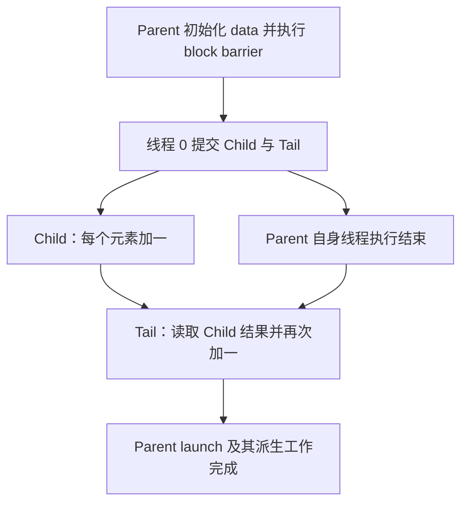

## 4.20. CUDA Dynamic Parallelism（CUDA 动态并行）

来源：[CUDA Programming Guide — CUDA Dynamic Parallelism](https://docs.nvidia.com/cuda/cuda-programming-guide/04-special-topics/dynamic-parallelism.html)

### 4.20.1. Introduction（简介）

#### 4.20.1.1. Overview（概述）

> CUDA dynamic parallelism - often abbreviated CDP - is a feature of the CUDA programming model that enables code running on the GPU to create new GPU work. That is, new work can be added to the GPU in the form of additional kernel launches from device code already running on the GPU. This feature can reduce the need to transfer execution control and data between host and device, as launch configuration decisions can be made at runtime by threads executing on the device.

CUDA dynamic parallelism 通常缩写为 CDP，是 CUDA programming model 的一项功能，使 GPU 上运行的代码能够创建新的 GPU 工作。也就是说，已在 GPU 上执行的 device 代码可以继续发起 kernel launch，为 GPU 添加工作。由于 launch configuration 可以由 device 线程在运行时决定，这项功能能够减少 host 与 device 之间执行控制权和数据的往返传递。

> Data-dependent parallel work can be generated by a kernel at run-time. Before CDP was added to CUDA, some algorithms and programming patterns required modifications to eliminate recursion, irregular loop structure, or other constructs that do not fit a flat, single-level of parallelism. These program structures may be expressed more naturally using CUDA dynamic parallelism.

Kernel 可以在运行时生成依赖数据的并行工作。在 CUDA 引入 CDP 之前，某些算法和编程模式需要改写，以消除递归、不规则循环结构或其他不适合扁平单层并行的结构。借助 CUDA dynamic parallelism，可以更自然地表达这些程序结构。

> **Note**

**注意：**

> This section documents the updated version of CUDA Dynamic Parallelism, sometimes called CDP2, which is the default in CUDA 12.0 and later. CDP2 is the only version of CUDA dynamic parallelism available on devices of CC 9.0 and higher. Developers can still opt in to the legacy CUDA Dynamic Parallelism, CDP1, for devices of CC lower than 9.0 with the compiler argument `-DCUDA_FORCE_CDP1_IF_SUPPORTED`. CDP1 documentation can be found in Legacy versions of the CUDA Programming Guide. CDP1 is slated for removal from a future version of CUDA.

本节介绍更新后的 CUDA Dynamic Parallelism，通常称为 CDP2，它是 CUDA 12.0 及以后版本的默认实现。在 CC 9.0 及以上的 device 上，CDP2 是唯一可用版本。对于 CC 低于 9.0 的 device，开发者仍可通过编译参数 `-DCUDA_FORCE_CDP1_IF_SUPPORTED` 选择旧版 CDP1。CDP1 文档见旧版 CUDA Programming Guide。原文说明，CDP1 计划在未来某个 CUDA 版本中移除。

**解读：** CDP 适合由 GPU 上的数据决定是否继续展开、展开多少工作以及采用多大 launch configuration 的场景。它减少 host 参与调度的需要，但每次 child launch 仍有成本。本节的同步规则以 CDP2 为前提，CUDA 版本、CC 门槛和 CDP1 编译开关直接决定可用语义，因此保留这些信息。

### 4.20.2. Execution Environment（执行环境）

> Dynamic parallelism in CUDA allows GPU threads to configure, launch, and implicitly synchronize new grids. A grid is an instance of a kernel launch, including the specific shape of the thread blocks and the grid of thread blocks. The distinction between a kernel function itself and the specific invocation of that kernel, i.e. a grid, is important to note in the following sections.

CUDA dynamic parallelism 允许 GPU 线程配置、启动新的 grid，并与其进行隐式同步。Grid 是一次 kernel launch 的执行实例，包含 thread block 的具体形状及由这些 block 组成的 grid 形状。阅读下文时，需要区分 kernel 函数本身与它的某次调用实例，即 grid。

#### 4.20.2.1. Parent and Child Grids（Parent Grid 与 Child Grid）

> A device thread that configures and launches a new grid belongs to the parent grid. The new grid that is created by the invocation is called a child grid.

配置并启动新 grid 的 device 线程属于 parent grid。此次调用创建的新 grid 称为 child grid。

> The invocation and completion of child grids is properly nested, meaning that the parent grid is not considered complete until all child grids created by its threads have completed, and the runtime guarantees an implicit synchronization between the parent and child.

Child grid 的调用与完成具有正确的嵌套关系：只有 parent grid 的线程创建的全部 child grid 都已完成，parent grid 才被视为完成。Runtime 保证 parent 与 child 之间存在隐式同步。

> **Figure 57 Parent-Child Launch Nesting**

**图 57 Parent–Child Launch 的嵌套关系**

**解读：** Parent 的线程执行到函数末尾，与整次 parent launch 被视为完成是两个不同层次。后者必须包含其派生 child 工作的完成；这不意味着 parent 中任意一条后续语句都会自动等待 child。

**图片说明：** 粘贴内容没有提供图 57 的图片文件，已保留图注，并去除与图注重复的图片替代文本。

#### 4.20.2.2. Scope of CUDA Primitives（CUDA 原语的作用域）

> CUDA Dynamic Parallelism relies on the CUDA Device Runtime, which enables calling a limited set of APIs which are syntactically similar to the CUDA Runtime API, but available in device code. The behavior of the device runtime APIs are similar to their host counterparts, but there are some differences. These differences are captured in the table in section API Reference.

CUDA Dynamic Parallelism 依赖 CUDA Device Runtime。它提供一组有限的、可在 device 代码中调用的 API，其语法与 CUDA Runtime API 类似。Device runtime API 的行为与 host 对应接口相近，但存在差异；原文引用 API Reference 一节中的表格说明这些差异。

> On both host and device, the CUDA runtime offers an API for launching kernels and for tracking dependencies between launches via streams and events. On the device, launched kernels and CUDA objects are visible to all threads in the invoking grid. This means, for example, that a stream may be created by one thread and used by any other thread in the same grid. However, CUDA objects such as streams and events which were created by device API calls are only valid within the grid where they were created.

无论在 host 还是 device 上，CUDA runtime 都提供启动 kernel，以及通过 stream 和 event 跟踪 launch 依赖的 API。在 device 上，被启动的 kernel 和 CUDA 对象对发起调用的 grid 中全部线程可见。例如，stream 可以由一个线程创建，再由同一 grid 中的任意其他线程使用。但通过 device API 创建的 stream、event 等 CUDA 对象，只在创建它们的 grid 内有效。

#### 4.20.2.3. Streams and Events（Stream 与 Event）

> CUDA Streams and Events allow control over dependencies between kernel launches: kernels launched into the same stream execute in-order, and events may be used to create dependencies between streams. Streams and events created on the device serve this exact same purpose.

CUDA stream 和 event 用于控制 kernel launch 之间的依赖：同一个 stream 中的 kernel 按顺序执行，event 可以建立不同 stream 之间的依赖。Device 上创建的 stream 和 event 具有相同用途。

> Streams and events created within a grid exist within grid scope, but have undefined behavior when used outside of the grid where they were created. As described above, all work launched by a grid is implicitly synchronized when the grid exits; work launched into streams is included in this, with all dependencies resolved appropriately. The behavior of operations on a stream that has been modified outside of grid scope is undefined.

在某个 grid 中创建的 stream 和 event 具有 grid scope；在创建它们的 grid 之外使用，行为未定义。如前所述，grid 退出时会隐式同步它启动的全部工作，其中也包括提交到 stream 的工作，并正确处理所有依赖。如果在 grid scope 之外修改 stream，再对该 stream 执行操作，其行为未定义。

> Streams and events created on the host have undefined behavior when used within any kernel, just as streams and events created by a parent grid have undefined behavior if used within a child grid.

在任何 kernel 内使用 host 创建的 stream 或 event，行为未定义；同样，在 child grid 内使用 parent grid 创建的 stream 或 event，行为也未定义。

**解读：** Stream/event 的 handle 是具有创建作用域的 CUDA 对象，不能因为其数值能通过 global memory 传递，就认为它可以跨 grid 使用。Parent 可以传递合法的 global-memory 数据指针给 child，但不能把自己创建的 stream/event handle 当作 child 的对象。Host handle 同样不能直接用于 device runtime 调用。

#### 4.20.2.4. Ordering and Concurrency（顺序与并发）

> The ordering of kernel launches from the device runtime follows CUDA Stream ordering semantics. Within a grid, all kernel launches into the same stream (with the exception of The Fire-and-Forget Stream) are executed in-order. With multiple threads in the same grid launching into the same stream, the ordering within the stream is dependent on the thread scheduling within the grid, which may be controlled with synchronization primitives such as `__syncthreads()`.

Device runtime 的 kernel launch 顺序遵循 CUDA stream ordering 语义。在同一个 grid 内，提交到同一 stream 的 kernel launch 按顺序执行，但 The Fire-and-Forget Stream 所述 stream 除外。如果同一 grid 的多个线程向同一 stream 发起 launch，stream 内的顺序取决于这些线程的调度，可以使用 `__syncthreads()` 等同步原语控制相关线程的执行顺序。

> Note that while named streams are shared by all threads within a grid, the implicit NULL stream is only shared by all threads within a thread block. If multiple threads in a thread block launch into the implicit stream, then these launches will be executed in-order. If threads in different thread blocks launch into the implicit stream, these launches may be executed concurrently. If concurrency is desired for launches from multiple threads within a thread block, explicit named streams should be used.

Named stream 可由同一 grid 的全部线程共享，而隐式 NULL stream 只由同一个 thread block 的线程共享。同一 block 的多个线程向隐式 stream 发起的 launch 会按顺序执行；不同 block 向各自隐式 stream 发起的 launch 则可能并发执行。如果希望同一 block 中多个线程发起的 launch 有机会并发，应使用显式 named stream。

> The device runtime introduces no new concurrency guarantees within the CUDA execution model. That is, there is no guarantee of concurrent execution between any number of different thread blocks on a device.

Device runtime 不会为 CUDA execution model 增加新的并发保证。也就是说，device 上不同 thread block 之间不保证并发执行。

> The lack of concurrency guarantee extends to a parent grid and their child grids. When a parent grid launches a child grid, the child may start to execute once stream dependencies are satisfied and hardware resources are available, but is not guaranteed to begin execution until the parent grid reaches an implicit synchronization point.

这一限制也适用于 parent grid 与 child grid。Parent 启动 child 后，只要 stream 依赖满足且有可用硬件资源，child 就可能开始执行；但在 parent 到达隐式同步点之前，并不保证 child 已经开始执行。

> Concurrency may vary as a function of device configuration, application workload, and runtime scheduling. It is therefore unsafe to depend on any concurrency between different thread blocks.

实际并发程度会随 device 配置、应用工作负载和 runtime 调度变化，因此依赖不同 thread block 之间一定并发是不安全的。

**解读：** 同一 stream 提供顺序约束，却不规定多个发起线程谁先提交；不同 stream 提供并发可能，也不保证同时执行。`__syncthreads()` 只能协调同一 block 的线程，不能为不同 block 建立全局 launch 顺序。不要让 parent 自旋等待一个必须与它并发运行的 child，也不要依赖不同 child 同时占用 GPU 才能推进算法。

### 4.20.3. Memory Coherence and Consistency（内存 Coherence 与 Consistency）

> Parent and child grids share the same global and constant memory storage, but have distinct local and shared memory. The following table shows which memory spaces allow parent and child to access via the same pointers. Child grids can never access the local or shared memory of parent grids, nor can parent grids access local or shared memory of child grids.

Parent 和 child grid 共享同一份 global memory 和 constant memory 存储，但各自拥有不同的 local memory 和 shared memory。下表列出可以让 parent 与 child 通过相同指针访问的 memory space。Child 不能访问 parent 的 local/shared memory，parent 也不能访问 child 的 local/shared memory。

> **Table 26 Dynamic Parallelism: Memory Scope Accessibility Between Parent and Child Grids**

**表 26 动态并行中 Parent 与 Child Grid 之间的 Memory Scope 可访问性**

> | Memory Space | Parent/Child use same pointers? |
> | --- | --- |
> | Global Memory | Yes |
> | Mapped Memory | Yes |
> | Local Memory | No |
> | Shared Memory | No |
> | Texture Memory | Yes (read-only) |

| Memory Space | Parent / Child 是否可使用相同指针？ |
| --- | --- |
| Global Memory | 是。 |
| Mapped Memory | 是。 |
| Local Memory | 否。 |
| Shared Memory | 否。 |
| Texture Memory | 是，只读。 |

**解读：** 地址空间允许共享，仍不等于访问时序正确。Global pointer 可以作为 parent/child 的共同数据入口，但读写还要符合 launch 依赖与生命周期；local/shared pointer 即使看起来也是普通指针值，也不能绕过其线程或 block 作用域。

#### 4.20.3.1. Global Memory

> Parent and child grids have coherent access to global memory, with weak consistency guarantees between child and parent. There is only one point of time in the execution of a child grid when its view of memory is fully consistent with the parent thread: at the point when the child grid is invoked by the parent.

Parent 和 child grid 对 global memory 的访问具有 coherence，但两者之间的 consistency 保证较弱。在 child grid 的执行过程中，只有一个时间点保证其内存视图与 parent thread 完全一致：parent 调用 child grid 的时刻。

> All global memory operations in the parent thread prior to the child grid’s invocation are visible to the child grid. With the removal of `cudaDeviceSynchronize()`, it is no longer possible to access the modifications made by the threads in the child grid from the parent grid. The only way to access the modifications made by the threads in the child grid before the parent grid exits is via a kernel launched into the `cudaStreamTailLaunch` stream.

Parent thread 在调用 child grid 之前执行的全部 global memory 操作，对 child 可见。随着 device 端 `cudaDeviceSynchronize()` 被移除，parent grid 已无法通过该方式直接取得 child 线程的修改结果。在 parent grid 退出之前，访问这些修改的方式是使用提交到 `cudaStreamTailLaunch` stream 的 kernel。

> In the following example, the child grid executing child_launch is only guaranteed to see the modifications to data made before the child grid was launched. Since thread 0 of the parent is performing the launch, the child will be consistent with the memory seen by thread 0 of the parent. Due to the first `__syncthreads()` call, the child will see data[0]=0, data[1]=1, …, data[255]=255 (without the `__syncthreads()` call, only data[0]=0 would be guaranteed to be seen by the child). The child grid is only guaranteed to return at an implicit synchronization. This means that the modifications made by the threads in the child grid are never guaranteed to become available to the parent grid. To access modifications made by child_launch, a tail_launch kernel is launched into the `cudaStreamTailLaunch` stream.

下例中，执行 child_launch 的 child grid 只保证看到其启动前对 data 的修改。由于 parent 的 thread 0 发起 launch，child 的内存视图与该 thread 0 所见的一致。第一次 `__syncthreads()` 保证 child 能看到 data[0]=0、data[1]=1、…、data[255]=255；没有这次同步时，只保证看到 data[0]=0。Child grid 只保证在隐式同步时完成。因此，不保证 child 线程的修改会对继续执行的 parent grid 可见。为访问 child_launch 的修改，示例将 tail_launch kernel 提交到 `cudaStreamTailLaunch` stream。

```cpp
__global__ void tail_launch(int *data) {
   data[threadIdx.x] = data[threadIdx.x]+1;
}

__global__ void child_launch(int *data) {
   data[threadIdx.x] = data[threadIdx.x]+1;
}

__global__ void parent_launch(int *data) {
   data[threadIdx.x] = threadIdx.x;

   __syncthreads();

   if (threadIdx.x == 0) {
       child_launch<<< 1, 256 >>>(data);
       tail_launch<<< 1, 256, 0, cudaStreamTailLaunch >>>(data);
   }
}

void host_launch(int *data) {
    parent_launch<<< 1, 256 >>>(data);
}
```

**解读：** 此例只启动一个 256 线程 parent block，先写入 `data[i] = i`，再由 block barrier 把所有线程的写入发布给发起 launch 的线程 0。Child 加一，tail kernel 等待 parent 自身工作及相关 child 工作完成后再加一；若分配和 launch 均成功、无其他访问竞争，最终结果应为 `data[i] = i + 2`。这是按代码语义推导，未运行验证。Host 若要读取最终结果，仍需等待整次工作完成。

下图根据代码重绘，表示依赖关系，不表示 parent 与 child 一定并发：



#### 4.20.3.2. Mapped Memory

> Mapped system memory has identical coherence and consistency guarantees to global memory, and follows the semantics detailed above. A kernel may not allocate or free mapped memory, but may use pointers to mapped memory passed in from the host program.

Mapped system memory 的 coherence 和 consistency 保证与 global memory 相同，遵循上述语义。Kernel 不能分配或释放 mapped memory，但可以使用 host 程序传入的 mapped memory 指针。

#### 4.20.3.3. Shared and Local Memory（Shared Memory 与 Local Memory）

> Shared and Local memory is private to a thread block or thread, respectively, and is not visible or coherent between parent and child. Behavior is undefined when an object in one of these locations is referenced outside of the scope within which it belongs, and may cause an error.

Shared memory 和 local memory 分别属于 thread block 和 thread 私有，parent 与 child 之间不共享其可见性或 coherence。在所属作用域之外引用这些位置中的对象，行为未定义，并且可能报错。

> The NVIDIA compiler will attempt to warn if it can detect that a pointer to local or shared memory is being passed as an argument to a kernel launch. At runtime, the programmer may use the `__isGlobal()` intrinsic to determine whether a pointer references global memory and so may safely be passed to a child launch.

如果 NVIDIA 编译器检测到 kernel launch 参数传入了 local/shared memory 指针，会尝试发出警告。运行时，程序员可以使用 `__isGlobal()` 判断指针是否指向 global memory，从而确认它是否属于可以传给 child launch 的地址空间。

> Calls to `cudaMemcpy*Async()` or `cudaMemset*Async()` may invoke new child kernels on the device in order to preserve stream semantics. As such, passing shared or local memory pointers to these APIs is illegal and will return an error.

为保持 stream 语义，device 上的 `cudaMemcpy*Async()` 或 `cudaMemset*Async()` 调用可能启动新的 child kernel。因此，向这些 API 传入 shared/local memory 指针是非法的，会返回错误。

**解读：** `__isGlobal()` 检查的是地址空间，并不证明分配仍然有效、范围足够，或其他线程已经完成写入。上述 Async API 的限制针对这里的 device runtime 调用，不能据此推导所有具有类似名称的 host/device 拷贝接口都具有完全相同的地址空间规则。

#### 4.20.3.4. Local Memory

> Local memory is private storage for an executing thread, and is not visible outside of that thread. It is illegal to pass a pointer to local memory as a launch argument when launching a child kernel. The result of dereferencing such a local memory pointer from a child grid is undefined.

Local memory 是执行线程的私有存储，对其他线程不可见。启动 child kernel 时，不能将 local memory 指针作为 launch 参数传入；child grid 解引用这样的指针，结果未定义。

> For example the following is illegal, with undefined behavior if x_array is accessed by child_launch:

例如，下面的用法是非法的；如果 child_launch 访问 x_array，就会产生未定义行为：

```cpp
int x_array[10];       // Creates x_array in parent's local memory
child_launch<<< 1, 1 >>>(x_array);
```

> It is sometimes difficult for a programmer to be aware of when a variable is placed into local memory by the compiler. As a general rule, all storage passed to a child kernel should be allocated explicitly from the global-memory heap, either with `cudaMalloc()`, new() or by declaring `__device__` storage at global scope. For example:

程序员有时很难判断编译器何时会将变量放入 local memory。原文给出的通用原则是：传给 child kernel 使用的存储，应通过 `cudaMalloc()`、new() 显式分配，或在全局作用域声明 `__device__` 存储，使其位于 global memory。例如：

```cpp
// Correct - "value" is global storage
__device__ int value;
__device__ void x() {
    value = 5;
    child<<< 1, 1 >>>(&value);
}
// Invalid - "value" is local storage
__device__ void y() {
    int value = 5;
    child<<< 1, 1 >>>(&value);
}
```

**解读：** `__device__` 标注函数在哪里执行，不会把函数内普通局部变量自动变成全局存储。例子中 `x()` 使用全局 `__device__` 变量，`y()` 传递局部变量地址，差别在被指向对象的存储位置。全局 `__device__` 变量属于静态 global storage，并不等同于动态 heap 分配；如果多个线程同时改写同一个 `value`，仍需另行处理竞争。传入合法 global pointer 时，指针变量本身可以是局部变量。

##### 4.20.3.4.1. Texture Memory

> Writes to the global memory region over which a texture is mapped are incoherent with respect to texture accesses. Coherence for texture memory is enforced at the invocation of a child grid and when a child grid completes. This means that writes to memory prior to a child kernel launch are reflected in texture memory accesses of the child. Similarly to Global Memory above, writes to memory by a child are never guaranteed to be reflected in the texture memory accesses by a parent. The only way to access the modifications made by the threads in the child grid before the parent grid exits is via a kernel launched into the `cudaStreamTailLaunch` stream. Concurrent accesses by parent and child may result in inconsistent data.

对 texture 映射所覆盖 global memory 区域的写入，与 texture 访问之间不保持即时 coherence。Texture memory 的 coherence 在 child grid 调用和完成时得到保证。因此，child kernel launch 之前的内存写入会反映在 child 的 texture 访问中。与前述 Global Memory 一样，child 的写入不保证能在继续执行的 parent 的 texture 访问中反映出来。在 parent grid 退出之前，要访问 child 的修改，应使用提交到 `cudaStreamTailLaunch` 的 kernel。Parent 与 child 并发访问可能产生不一致数据。

**解读：** Parent 与 child 共用底层 global storage，不代表 texture 访问会即时看到另一方的写入。需要同时遵守 texture 的一致性边界和 CDP 的完成顺序；后续消费 child 输出的阶段应安排到有保证的依赖边界之后。

### 4.20.4. Programming Interface（编程接口）

#### 4.20.4.1. Basics（基础）

> The following example shows a simple Hello World program incorporating dynamic parallelism:

下面的简单 Hello World 程序使用了 dynamic parallelism：

```cpp
#include <stdio.h>

__global__ void childKernel()
{
    printf("Hello ");
}

__global__ void tailKernel()
{
    printf("World!\n");
}

__global__ void parentKernel()
{
    // launch child
    childKernel<<<1,1>>>();
    if (cudaSuccess != cudaGetLastError()) {
        return;
    }

    // launch tail into cudaStreamTailLaunch stream
    // implicitly synchronizes: waits for child to complete
    tailKernel<<<1,1,0,cudaStreamTailLaunch>>>();

}

int main(int argc, char *argv[])
{
    // launch parent
    parentKernel<<<1,1>>>();
    if (cudaSuccess != cudaGetLastError()) {
        return 1;
    }

    // wait for parent to complete
    if (cudaSuccess != cudaDeviceSynchronize()) {
        return 2;
    }

    return 0;
}
```

**解读：** Host 中的 `cudaDeviceSynchronize()` 仍然可用；本节移除的是 CDP2 device 代码中显式等待 child 的同名接口。示例通过 child 打印 `Hello `，再由 tail 打印 `World!`，将顺序关系放进 GPU 工作依赖中。`cudaGetLastError()` 检查 launch 相关错误不等于等待异步工作完成，示例对 tail launch 也没有单独给出错误检查。

> This program may be built in a single step from the command line as follows:

可以通过以下命令一步构建该程序：

```shell
$ nvcc -arch=sm_75 -rdc=true hello_world.cu -o hello -lcudadevrt
```

**解读：** `-rdc=true` 启用 relocatable device code，`-lcudadevrt` 链接 CUDA Device Runtime，`-arch=sm_75` 是原例选择的目标架构。命令行开头的 `$` 是 shell 提示符标记，实际输入命令时应省略。该命令仅作为原文保留，未执行编译。

#### 4.20.4.2. C++ Language Interface for CDP（CDP 的 C++ 语言接口）

> The language interface and API available to CUDA kernels using CUDA C++ for Dynamic Parallelism is called the CUDA Device Runtime.

CUDA C++ kernel 使用 Dynamic Parallelism 时可用的语言接口和 API，称为 CUDA Device Runtime。

> Where possible the syntax and semantics of the CUDA Runtime API have been retained in order to facilitate ease of code reuse for routines that may run in either the host or device environments.

为了便于在 host 和 device 环境之间复用代码，接口尽可能保留 CUDA Runtime API 的语法与语义。

> As with all code in CUDA C++, the APIs and code outlined here is per-thread code. This enables each thread to make unique, dynamic decisions regarding what kernel or operation to execute next. There are no synchronization requirements between threads within a block to execute any of the provided device runtime APIs, which enables the device runtime API functions to be called in arbitrarily divergent kernel code without deadlock.

与所有 CUDA C++ 代码一样，这里的 API 和代码都按线程执行，每个线程可以独立、动态地决定下一步执行哪个 kernel 或操作。调用这些 device runtime API 本身，不要求 block 内线程先进行同步，因此可以在任意分歧的 kernel 代码中调用，而不会仅因这些 API 的参与要求造成死锁。

**解读：** Device launch 是逐线程操作。如果 256 个 parent 线程都执行同一条 child launch 语句，就可能产生 256 次独立 launch；不会自动合并成一次 block 级 launch。前面的例子用 `threadIdx.x == 0` 选出一个发起者；扩展到多个 block 时，该条件仍会在每个 block 中选出一个线程。API 无需全员参与，与共享输入数据是否需要同步，是不同问题。

##### 4.20.4.2.1. Device-Side Kernel Launch（Device 端 Kernel Launch）

> Kernels may be launched from the device using the standard CUDA `<<< >>>` syntax:

可以在 device 上使用标准 CUDA `<<< >>>` 语法启动 kernel：

```cpp
kernel_name<<< Dg, Db, Ns, S >>>([kernel arguments]);
```

- > Dg is of type `dim3` and specifies the dimensions and size of the grid

  Dg 的类型是 `dim3`，用于指定 grid 的维度与大小。

- > Db is of type `dim3` and specifies the dimensions and size of each thread block

  Db 的类型是 `dim3`，用于指定每个 thread block 的维度与大小。

- > Ns is of type `size_t` and specifies the number of bytes of shared memory that is dynamically allocated per thread block for this call in addition to statically allocated memory. Ns is an optional argument that defaults to 0.

  Ns 的类型是 `size_t`，用于指定本次调用中，每个 thread block 在静态分配内存之外额外动态分配的 shared memory 字节数。它是可选参数，默认值为 0。

- > S is of type `cudaStream_t` and specifies the stream associated with this call. The stream must have been allocated in the same grid where the call is being made. S is an optional argument that defaults to the NULL stream.

  S 的类型是 `cudaStream_t`，用于指定本次调用关联的 stream。该 stream 必须创建于发起调用的同一个 grid 中。S 是可选参数，默认使用 NULL stream。

**解读：** 这里的 stream 创建范围要求针对普通显式 stream；`cudaStreamTailLaunch`、`cudaStreamFireAndForget` 是 device runtime 提供的特殊 stream 值，不需要用户先创建。它们也不是 CUDA Graph 的 `cudaStreamGraphTailLaunch` 等 launch mode handle，两个功能应按各自 API 使用。

###### 4.20.4.2.1.1. Launches are Asynchronous（Launch 是异步的）

> Identical to host-side launches, all device-side kernel launches are asynchronous with respect to the launching thread. That is to say, the `<<<>>>` launch command will return immediately and the launching thread will continue to execute until it hits an implicit launch-synchronization point, such as at a kernel launched into the `cudaStreamTailLaunch` stream (The Tail Launch Stream). The child grid may begin execution at any time after launch, but is not guaranteed to begin execution until the launching thread reaches an implicit launch-synchronization point.

与 host 端 launch 一样，device 端 kernel launch 相对于发起线程也是异步的：`<<<>>>` launch 指令会立即返回，发起线程继续执行，直到隐式 launch 同步边界。原文以提交到 `cudaStreamTailLaunch` 的 kernel 为例，指向 The Tail Launch Stream 一节。Child grid 可以在 launch 之后的任意时刻开始执行，但在发起线程到达隐式同步边界之前，不保证它已经开始执行。

> Similar to host-side launch, work launched into separate streams may run concurrently, but actual concurrency is not guaranteed. Programs that depend upon concurrency between child kernels are not supported by the CUDA programming model and will have undefined behavior.

与 host 端 launch 类似，不同 stream 中的工作可能并发，但不保证实际并发。CUDA programming model 不支持依赖 child kernel 必须并发执行的程序，这类程序的行为未定义。

**解读（Tail Launch 的同步边界）：** 提交 tail kernel 本身仍是异步 launch，不会把发起它的 parent 线程停在那里，等待 child 后再恢复。Tail kernel 要等 parent 自身及其 non-tail 派生工作完成后才开始，适合把依赖 child 结果的后续代码搬到单独 kernel 中。即使某些 non-tail 工作在 tail 提交之后才被 parent 发起，tail 仍须等待它们。参见 [Device Runtime：The Tail Launch Stream](https://docs.nvidia.com/cuda/cuda-programming-guide/05-appendices/device-callable-apis.html#the-tail-launch-stream)。

###### 4.20.4.2.1.2. Launch Environment Configuration（Launch 环境配置）

> All global device configuration settings (for example, shared memory and L1 cache size as returned from `cudaDeviceGetCacheConfig()`, and device limits returned from `cudaDeviceGetLimit()`) will be inherited from the parent. Likewise, device limits such as stack size will remain as-configured.

所有 device 全局配置都会从 parent 继承，例如 `cudaDeviceGetCacheConfig()` 返回的 shared memory/L1 cache 配置，以及 `cudaDeviceGetLimit()` 返回的 device limits。Stack size 等限制也保持已配置的值。

> For host-launched kernels, per-kernel configurations set from the host will take precedence over the global setting. These configurations will be used when the kernel is launched from the device as well. It is not possible to reconfigure a kernel’s environment from the device.

对于 host 启动的 kernel，host 设置的 per-kernel 配置优先于全局设置。从 device 启动该 kernel 时，同样使用这些配置。不能在 device 上重新配置 kernel 的执行环境。

**解读：** Device 线程可以决定 child 的 grid/block 形状、动态 shared memory 大小和 stream，却不能据此认为也能在 device 上修改 cache preference、stack limit 等环境配置。这类设置应在 host 侧按相应 API 准备。

##### 4.20.4.2.2. Events（Event）

> Only the inter-stream synchronization capabilities of CUDA events are supported. This means that `cudaStreamWaitEvent()` is supported, but `cudaEventSynchronize()`, `cudaEventElapsedTime()`, and `cudaEventQuery()` are not. As `cudaEventElapsedTime()` is not supported, `cudaEvents` must be created via `cudaEventCreateWithFlags()`, passing the `cudaEventDisableTiming` flag.

CUDA event 在 device 端只支持跨 stream 建立同步依赖。因此支持 `cudaStreamWaitEvent()`，但不支持 `cudaEventSynchronize()`、`cudaEventElapsedTime()` 和 `cudaEventQuery()`。由于不支持计时，event 必须通过 `cudaEventCreateWithFlags()` 创建，并指定 `cudaEventDisableTiming`。

> As with streams, event objects may be shared between all threads within the grid which created them but are local to that grid and may not be passed to other kernels. Event handles are not guaranteed to be unique between grids, so using an event handle within a grid that did not create it will result in undefined behavior.

与 stream 一样，event 对象可以由创建它的 grid 内全部线程共享，但仅在该 grid 内有效，不能传给其他 kernel。Event handle 不保证在不同 grid 之间唯一，因此在没有创建该 event 的 grid 中使用它，行为未定义。

##### 4.20.4.2.3. Synchronization（同步）

> It is up to the program to perform sufficient inter-thread synchronization, for example via a CUDA Event, if the calling thread is intended to synchronize with child grids invoked from other threads.

如果调用线程希望与其他线程启动的 child grid 建立同步关系，程序必须自行进行充分的线程间同步，例如使用 CUDA event。

> As it is not possible to explicitly synchronize child work from a parent thread, there is no way to guarantee that changes occurring in child grids are visible to threads within the parent grid.

由于 parent thread 无法显式等待 child 工作完成，因此无法保证 child grid 的修改对 parent grid 内继续执行的线程可见。

**解读：** `cudaStreamWaitEvent()` 把等待关系提交到 stream，约束之后的 GPU 工作；它不会像 host 端同步调用那样让当前 parent 线程等待 child 完成再继续读结果。因此本节“通过 event 同步”的表述，应理解为建立工作依赖，不能当作在 CDP2 中恢复 device 端 `cudaDeviceSynchronize()`。

##### 4.20.4.2.4. Device Management（Device 管理）

> Only the device on which a kernel is running will be controllable from that kernel. This means that device APIs such as `cudaSetDevice()` are not supported by the device runtime. The active device as seen from the GPU (returned from `cudaGetDevice()`) will have the same device number as seen from the host system. The `cudaDeviceGetAttribute()` call may request information about another device as this API allows specification of a device ID as a parameter of the call. Note that the catch-all `cudaGetDeviceProperties()` API is not offered by the device runtime - properties must be queried individually.

Kernel 只能控制其自身正在运行的 device，因此 device runtime 不支持 `cudaSetDevice()` 等 API。GPU 上看到的 active device 编号，即 `cudaGetDevice()` 返回的编号，与 host 系统所见一致。`cudaDeviceGetAttribute()` 可以查询其他 device 的信息，因为该接口接受 device ID 参数。Device runtime 不提供一次获取全部属性的 `cudaGetDeviceProperties()`，必须逐项查询。

**解读：** 能查询另一个 device 的属性，不代表能从当前 kernel 切换 device 或跨 GPU 启动 child。CDP 的运行控制仍局限在当前执行 kernel 所在的 device。

### 4.20.5. Programming Guidelines（编程指南）

#### 4.20.5.1. Performance（性能）

##### 4.20.5.1.1. Dynamic-parallelism-enabled Kernel Overhead（启用 Dynamic Parallelism 的 Kernel 开销）

> System software which is active when controlling dynamic launches may impose an overhead on any kernel which is running at the time, whether or not it invokes kernel launches of its own. This overhead arises from the device runtime’s execution tracking and management software and may result in decreased performance. This overhead is, in general, incurred for applications that link against the device runtime library.

控制 dynamic launch 的系统软件，可能给当时运行的任何 kernel 带来开销，无论该 kernel 是否自行发起 kernel launch。这些开销来自 device runtime 对执行的跟踪和管理，可能降低性能。通常，链接 device runtime library 的应用会承担这类开销。

**解读：** CDP 的收益需要覆盖 device runtime 管理和 child launch 的成本。把极少量工作拆成大量 child grid，可能让调度开销占主导；评估时应同时观察工作粒度、派生数量以及减少了多少 host 往返，不能仅凭“在 GPU 上决定下一步”推断更快。

#### 4.20.5.2. Implementation Restrictions and Limitations（实现相关的约束与限制）

> Dynamic Parallelism guarantees all semantics described in this document, however, certain hardware and software resources are implementation-dependent and limit the scale, performance and other properties of a program which uses the device runtime.

Dynamic Parallelism 保证本文描述的语义，但某些硬件和软件资源取决于具体实现，会限制使用 device runtime 的程序的规模、性能及其他特性。

##### 4.20.5.2.1. Runtime

###### 4.20.5.2.1.1. Memory Footprint（内存占用）

> The device runtime system software reserves memory for various management purposes, in particular a reservation for tracking pending grid launches. Configuration controls are available to reduce the size of this reservation in exchange for certain launch limitations. See Configuration Options, below, for details.

Device runtime 系统软件会为管理用途预留内存，尤其是跟踪待完成 grid launch 所需的空间。可以通过配置减小预留空间，代价是对 launch 施加一定限制；原文引用 Configuration Options 一节说明细节。

###### 4.20.5.2.1.2. Pending Kernel Launches（待完成的 Kernel Launch）

> When a kernel is launched, all associated configuration and parameter data is tracked until the kernel completes. This data is stored within a system-managed launch pool.

Kernel launch 后，其相关配置和参数数据会一直被跟踪到 kernel 完成。这些数据保存在系统管理的 launch pool 中。

> The size of the fixed-size launch pool is configurable by calling `cudaDeviceSetLimit()` from the host and specifying `cudaLimitDevRuntimePendingLaunchCount`.

可以从 host 调用 `cudaDeviceSetLimit()`，指定 `cudaLimitDevRuntimePendingLaunchCount`，配置固定大小 launch pool 的容量。

**解读：** Pending launch count 统计尚未完成的 device launch，不是此刻正在 SM 上运行的 grid 数量。调高限额可以容纳更多待完成工作，但也会增加 runtime 预留内存；超过限制可能导致 `cudaErrorLaunchPendingCountExceeded`。应在 host 设置后检查返回值，并按实际派生规模控制任务数量。参见 [cudaDeviceSetLimit](https://docs.nvidia.com/cuda/cuda-runtime-api/group__CUDART__DEVICE.html)。

#### 4.20.5.3. Compatibility and Interoperability（兼容性与互操作）

> CDP2 is the default. Functions can be compiled with `-DCUDA_FORCE_CDP1_IF_SUPPORTED` to opt-out of using CDP2 on devices of compute capability less than 9.0.

CDP2 是默认版本。对于 compute capability 低于 9.0 的 device，可以通过 `-DCUDA_FORCE_CDP1_IF_SUPPORTED` 编译函数，以选择不使用 CDP2。

> |  | Function compiled with CUDA 12.0 and newer (default) | Function compiled with pre-CUDA 12.0 or with CUDA 12.0 and newer with `-DCUDA_FORCE_CDP1_IF_SUPPORTED` specified |
> | --- | --- | --- |
> | Compilation | Compile error if device code references `cudaDeviceSynchronize`. | Compile error if code references `cudaStreamTailLaunch` or `cudaStreamFireAndForget`. Compile error if device code references `cudaDeviceSynchronize` and code is compiled for sm_90 or newer. |
> | Compute capability < 9.0 | New interface is used. | Legacy interface is used. |
> | Compute capability 9.0 and higher | New interface is used. | New interface is used. If function references `cudaDeviceSynchronize` in device code, function load returns `cudaErrorSymbolNotFound` (this could happen if the code is compiled for devices of compute capability less than 9.0, but run on devices of compute capability 9.0 or higher using JIT). |

| 条件 | 使用 CUDA 12.0 及以后版本编译（默认） | 使用 CUDA 12.0 之前版本编译，或在 CUDA 12.0 及以后版本中指定 `-DCUDA_FORCE_CDP1_IF_SUPPORTED` |
| --- | --- | --- |
| 编译 | 如果 device 代码引用 `cudaDeviceSynchronize`，则编译报错。 | 如果代码引用 `cudaStreamTailLaunch` 或 `cudaStreamFireAndForget`，则编译报错。如果 device 代码引用 `cudaDeviceSynchronize`，并以 sm_90 或更新架构为编译目标，也会报错。 |
| Compute capability < 9.0 | 使用新接口。 | 使用旧接口。 |
| Compute capability ≥ 9.0 | 使用新接口。 | 使用新接口。如果函数在 device 代码中引用 `cudaDeviceSynchronize`，函数加载时返回 `cudaErrorSymbolNotFound`。例如，代码为 compute capability 低于 9.0 的 device 编译，却通过 JIT 在 9.0 及以上 device 上运行时，可能发生这种情况。 |

> Functions using CDP1 and CDP2 may be loaded and run simultaneously in the same context. The CDP1 functions are able to use CDP1-specific features (e.g. `cudaDeviceSynchronize`) and CDP2 functions are able to use CDP2-specific features (e.g. tail launch and fire-and-forget launch).

使用 CDP1 和 CDP2 的函数可以在同一个 context 中同时加载并运行。CDP1 函数能够使用其专属功能，例如 device 端 `cudaDeviceSynchronize`；CDP2 函数能够使用 tail launch、fire-and-forget launch 等 CDP2 专属功能。

> A function using CDP1 cannot launch a function using CDP2, and vice versa. If a function that would use CDP1 contains in its call graph a function that would use CDP2, or vice versa, `cudaErrorCdpVersionMismatch` would result during function load.

CDP1 函数不能启动 CDP2 函数，反之亦然。如果使用 CDP1 的函数的调用图中包含使用 CDP2 的函数，或者反过来，则在函数加载期间会出现 `cudaErrorCdpVersionMismatch`。

> The behavior of legacy CDP1 is not included in this document. For information on CDP1, refer back to a legacy version of the CUDA Programming Guide

本文不介绍旧版 CDP1 的行为。有关 CDP1，请查阅旧版 CUDA Programming Guide。

**解读：** “可在同一 context 共存”描述两个版本各自可以运行；“不能互相 launch”约束的是函数调用关系。仅改变实际运行 GPU，不能让含 device 端 `cudaDeviceSynchronize()` 的旧代码自动获得 CDP2 同步语义。表中的编译错误、加载错误和 JIT 情况属于不同阶段，均按原文保留。

### 4.20.6. Device-side Launch from PTX（从 PTX 发起 Device 端 Launch）

> The previous sections have discussed using the CUDA Device Runtime to achieve dynamic parallelism. Dynamic parallelism can also be performed from PTX. For the programming language and compiler implementers who target Parallel Thread Execution (PTX) and plan to support Dynamic Parallelism in their language, this section provides the low-level details related to supporting kernel launches at the PTX level.

前面介绍了通过 CUDA Device Runtime 实现 dynamic parallelism。也可以直接从 PTX 实现。对于以 Parallel Thread Execution（PTX）为目标、希望在其语言中支持 Dynamic Parallelism 的语言和编译器实现者，本节提供 PTX 层 kernel launch 的底层细节。

#### 4.20.6.1. Kernel Launch APIs（Kernel Launch API）

> Device-side kernel launches can be implemented using the following two APIs accessible from PTX: `cudaLaunchDevice()` and `cudaGetParameterBuffer()`. `cudaLaunchDevice()` launches the specified kernel with the parameter buffer that is obtained by calling `cudaGetParameterBuffer()` and filled with the parameters to the launched kernel. The parameter buffer can be NULL, i.e., no need to invoke `cudaGetParameterBuffer()`, if the launched kernel does not take any parameters.

可以通过 PTX 可访问的 `cudaLaunchDevice()` 和 `cudaGetParameterBuffer()` 实现 device 端 kernel launch。先调用 `cudaGetParameterBuffer()` 获取 parameter buffer，填入目标 kernel 的参数，再用 `cudaLaunchDevice()` 启动该 kernel。如果目标 kernel 不接收任何参数，parameter buffer 可以为 NULL，无需调用 `cudaGetParameterBuffer()`。

**解读：** 这一层面向语言或编译器实现者：获取参数缓冲区、按目标 kernel 的布局填入参数，再提交 launch。普通 CUDA C++ 程序应使用 `<<<...>>>`，而不是把这里的底层声明当作一般的用户接口直接调用。参见 [CUDA Runtime：Device Launch 接口](https://docs.nvidia.com/cuda/cuda-runtime-api/group__CUDART__EXECUTION.html)。

##### 4.20.6.1.1. `cudaLaunchDevice`

> At the PTX level, `cudaLaunchDevice()` needs to be declared in one of the two forms shown below before it is used.

在 PTX 层使用 `cudaLaunchDevice()` 前，必须先按原文所称的以下两种形式之一进行声明。

```ptx
// PTX-level Declaration of cudaLaunchDevice() when .address_size is 64
.extern .func(.param .b32 func_retval0) cudaLaunchDevice
(
  .param .b64 func,
  .param .b64 parameterBuffer,
  .param .align 4 .b8 gridDimension[12],
  .param .align 4 .b8 blockDimension[12],
  .param .b32 sharedMemSize,
  .param .b64 stream
)
;
```

**原文完整性说明：** 原文称有“两种形式”，但本次提供的内容只包含 `.address_size` 为 64 的 PTX 声明；`cudaGetParameterBuffer` 的段落也有相同情况。本次不自行补写未提供的另一种声明。

> The CUDA-level declaration below is mapped to one of the aforementioned PTX-level declarations and is found in the system header file `cuda_device_runtime_api.h`. The function is defined in the `cudadevrt` system library, which must be linked with a program in order to use device-side kernel launch functionality.

下面的 CUDA 层声明映射到前述 PTX 层声明之一，位于系统头文件 `cuda_device_runtime_api.h`。函数定义在 `cudadevrt` 系统库中；要使用 device 端 kernel launch 功能，程序必须链接该库。

```cpp
// CUDA-level declaration of cudaLaunchDevice()
extern "C" __device__
cudaError_t cudaLaunchDevice(void *func, void *parameterBuffer,
                             dim3 gridDimension, dim3 blockDimension,
                             unsigned int sharedMemSize,
                             cudaStream_t stream);
```

> The first parameter is a pointer to the kernel to be launched, and the second parameter is the parameter buffer that holds the actual parameters to the launched kernel. The layout of the parameter buffer is explained in Parameter Buffer Layout, below. Other parameters specify the launch configuration, i.e., as grid dimension, block dimension, shared memory size, and the stream associated with the launch (please refer to Kernel Configuration for the detailed description of launch configuration.

第一个参数是目标 kernel 的指针，第二个参数是保存目标 kernel 实际参数的 parameter buffer，其布局见后面的 Parameter Buffer Layout。其他参数指定 launch configuration，包括 grid 维度、block 维度、shared memory 大小，以及关联的 stream；具体配置说明参见 Kernel Configuration。

**解读：** `func` 标识目标 kernel，`parameterBuffer` 指向按值打包后的实参存储，另外四项才是执行配置。这里的 `dim3` 在给出的 PTX 声明中以 12 字节、4 字节对齐的参数表示；应匹配目标 ABI，不能按 host 上任意自定义结构的布局猜测。

##### 4.20.6.1.2. `cudaGetParameterBuffer`

> `cudaGetParameterBuffer()` needs to be declared at the PTX level before it’s used. The PTX-level declaration must be in one of the two forms given below, depending on address size:

使用 `cudaGetParameterBuffer()` 前，必须先在 PTX 层声明。原文说明应根据 address size，从下列两种形式中选择一种。

```ptx
// PTX-level Declaration of cudaGetParameterBuffer() when .address_size is 64
.extern .func(.param .b64 func_retval0) cudaGetParameterBuffer
(
  .param .b64 alignment,
  .param .b64 size
)
;
```

> The following CUDA-level declaration of `cudaGetParameterBuffer()` is mapped to the aforementioned PTX-level declaration:

下面的 CUDA 层声明映射到前述 PTX 层声明：

```cpp
// CUDA-level Declaration of cudaGetParameterBuffer()
extern "C" __device__
void *cudaGetParameterBuffer(size_t alignment, size_t size);
```

> The first parameter specifies the alignment requirement of the parameter buffer and the second parameter the size requirement in bytes. In the current implementation, the parameter buffer returned by `cudaGetParameterBuffer()` is always guaranteed to be 64-byte aligned, and the alignment requirement parameter is ignored. However, it is recommended to pass the correct alignment requirement value - which is the largest alignment of any parameter to be placed in the parameter buffer - to `cudaGetParameterBuffer()` to ensure portability in the future.

第一个参数指定 parameter buffer 的对齐要求，第二个参数指定其字节数。按原文所述的当前实现，`cudaGetParameterBuffer()` 返回的 buffer 始终保证 64 字节对齐，并忽略传入的 alignment 要求。不过，为保持未来可移植性，仍建议传入正确的对齐值，即 buffer 中全部参数所需对齐值的最大值。

**解读：** Buffer 起始地址对齐与各参数在 buffer 内的 offset 对齐是两层要求。即使 buffer 起始地址是 64 字节对齐，也不代表可以紧密排列所有不同类型的参数。实现说明中的“忽略 alignment”不应成为传入错误对齐值的理由。

#### 4.20.6.2. Parameter Buffer Layout（Parameter Buffer 布局）

> Parameter reordering in the parameter buffer is prohibited, and each individual parameter placed in the parameter buffer is required to be aligned. That is, each parameter must be placed at the nth byte in the parameter buffer, where n is the smallest multiple of the parameter size that is greater than the offset of the last byte taken by the preceding parameter. The maximum size of the parameter buffer is 4KB.

禁止在 parameter buffer 中重新排列参数，每个参数都必须正确对齐。按原文的描述，参数应放在 buffer 的第 n 个字节处，其中 n 是参数大小的最小整数倍，并且大于前一个参数最后一个字节的 offset。Parameter buffer 最大为 4 KB。

> For a more detailed description of PTX code generated by the CUDA compiler, please refer to the PTX-3.5 specification.

关于 CUDA 编译器生成的 PTX 代码的更详细说明，请参阅 PTX-3.5 specification。

**解读（参数布局的适用范围）：** 普通标量常见的 size 与 alignment 相同，但一般类型不能把两者直接等同；PTX 还允许显式 `.align`，数组总长度也未必等于其对齐要求。实现参数打包时，应按目标参数的实际声明与 ABI 计算 offset，保留必要 padding 和原参数顺序。原文的 4 KB 是这里描述的 device-launch parameter buffer 限制，不能直接推广成所有 CUDA kernel 启动路径的统一参数上限。参见 [PTX：Alignment](https://docs.nvidia.com/cuda/parallel-thread-execution/index.html#alignment)。

**整理说明：** 原文中的 API Reference、The Tail Launch Stream、The Fire-and-Forget Stream、Configuration Options 等是交叉引用，本次粘贴内容没有附带这些被引用章节的完整正文；相关解读与参考链接不代替未提供的原文。本节保留全部提供的正文、表格和代码，仅去除重复图片替代文本并修复少量排版空格。代码、PTX 声明和编译命令均未编译或运行。


