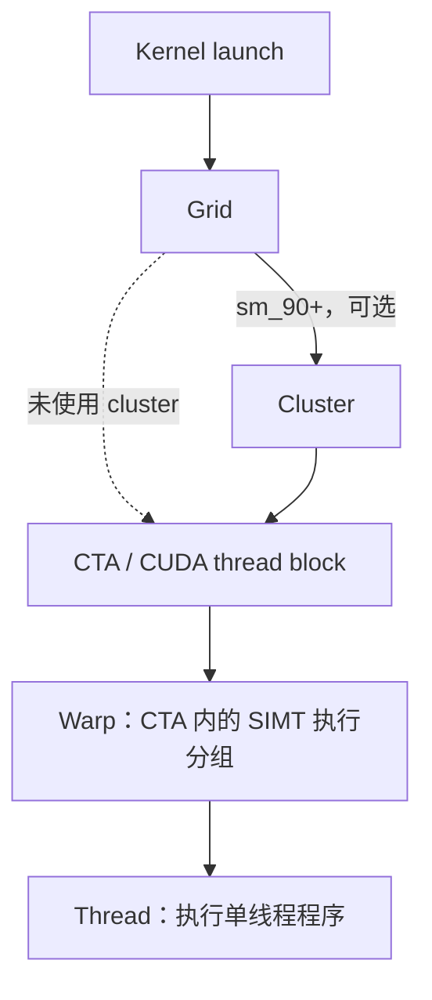

## 2. Programming Model

PTX 编程模型说明 kernel 工作如何组织成大量线程，以及这些线程能够通过哪些状态空间访问和共享数据。线程层次决定协作与同步边界，内存层次决定数据的可见范围、生命周期与一致性约束。

### 2.1 A Highly Multithreaded Coprocessor

#### English Original

> The GPU is a compute device capable of executing a very large number of threads in parallel. It operates as a coprocessor to the main CPU, or host: In other words, data-parallel, compute-intensive portions of applications running on the host are off-loaded onto the device.
>
> More precisely, a portion of an application that is executed many times, but independently on different data, can be isolated into a kernel function that is executed on the GPU as many different threads. To that effect, such a function is compiled to the PTX instruction set and the resulting kernel is translated at install time to the target GPU instruction set.

#### 中文翻译

GPU 是一种能够并行执行大量线程的计算设备。它作为主 CPU（即 host）的协处理器运行。换言之，运行在 host 上的应用程序会把数据并行且计算密集的部分卸载到 device 上执行。

更准确地说，如果应用程序中的某一部分会被执行许多次，但每次作用于不同数据并且相互独立，那么这部分可以被提取为一个 kernel 函数，并由 GPU 上的大量不同线程执行。为此，该函数会被编译成 PTX 指令集，生成的 kernel 再在部署阶段被翻译成目标 GPU 指令集。

#### 重点解读

kernel 定义的是所有线程共同执行的程序，而不是只对应一个线程。一次 kernel 启动创建一批逻辑线程，每个线程再利用自己的标识选择输入、输出和工作范围。GPU 的价值来自把适合并行的部分从 host 卸载到 device，而不是替代 host 执行整个应用程序。

### 2.2 Thread Hierarchy

#### English Original

> The batch of threads that executes a kernel is organized as a grid. A grid consists of either cooperative thread arrays or clusters of cooperative thread arrays as described in this section and illustrated in Figure 1 and Figure 2. Cooperative thread arrays (CTAs) implement CUDA thread blocks and clusters implement CUDA thread block clusters.

#### 中文翻译

执行一个 kernel 的一批线程会被组织成 grid。正如本节以及图 1、图 2 所示，一个 grid 可以由 cooperative thread array 直接构成，也可以由 cooperative thread array 的 cluster 构成。Cooperative thread array（CTA）实现 CUDA thread block，cluster 实现 CUDA thread block cluster。

#### 重点解读

线程组织关系如下。warp 是 CTA 内部的 SIMT 执行分组，不是与 grid、cluster、CTA 并列的 kernel 启动层级。

#### 2.2.1 Cooperative Thread Arrays

##### English Original

> The Parallel Thread Execution (PTX) programming model is explicitly parallel: a PTX program specifies the execution of a given thread of a parallel thread array. A cooperative thread array, or CTA, is an array of threads that execute a kernel concurrently or in parallel.
>
> Threads within a CTA can communicate with each other. To coordinate the communication of the threads within the CTA, one can specify synchronization points where threads wait until all threads in the CTA have arrived.
>
> Each thread has a unique thread identifier within the CTA. Programs use a data parallel decomposition to partition inputs, work, and results across the threads of the CTA. Each CTA thread uses its thread identifier to determine its assigned role, assign specific input and output positions, compute addresses, and select work to perform. The thread identifier is a three-element vector `tid`, (with elements `tid.x`, `tid.y`, and `tid.z`) that specifies the thread’s position within a 1D, 2D, or 3D CTA. Each thread identifier component ranges from zero up to the number of thread ids in that CTA dimension.
>
> Each CTA has a 1D, 2D, or 3D shape specified by a three-element vector `ntid` (with elements `ntid.x`, `ntid.y`, and `ntid.z`). The vector `ntid` specifies the number of threads in each CTA dimension.
>
> Threads within a CTA execute in SIMT (single-instruction, multiple-thread) fashion in groups called warps. A warp is a maximal subset of threads from a single CTA, such that the threads execute the same instructions at the same time. Threads within a warp are sequentially numbered. The warp size is a machine-dependent constant. Typically, a warp has 32 threads. Some applications may be able to maximize performance with knowledge of the warp size, so PTX includes a run-time immediate constant, `WARP_SZ`, which may be used in any instruction where an immediate operand is allowed.

##### 中文翻译

Parallel Thread Execution（PTX）编程模型是显式并行的：一个 PTX 程序规定并行线程数组中某个给定线程的执行行为。Cooperative thread array（CTA）是由一组并发或并行执行同一 kernel 的线程构成的数组。

同一个 CTA 内的线程可以相互通信。为了协调 CTA 内线程之间的通信，可以指定同步点，使线程等待，直到 CTA 中的所有线程都到达该同步点。

每个线程在 CTA 内都有唯一的线程标识。程序采用数据并行分解，把输入、工作和结果划分到 CTA 的各个线程。每个 CTA 线程利用自己的线程标识确定被分配的角色、指定输入和输出位置、计算地址并选择要执行的工作。线程标识是三元素向量 `tid`，由 `tid.x`、`tid.y` 和 `tid.z` 组成，用来表示线程在一维、二维或三维 CTA 中的位置。线程标识的每个分量都从 0 开始，最大值为该 CTA 对应维度的线程数量减一。

每个 CTA 都具有一维、二维或三维形状，由三元素向量 `ntid` 指定。该向量包含 `ntid.x`、`ntid.y` 和 `ntid.z`，分别表示 CTA 在各个维度上的线程数量。

CTA 内的线程以 warp 为分组，按照 SIMT（single-instruction, multiple-thread，单指令多线程）方式执行。一个 warp 是来自同一 CTA 的最大线程子集，这些线程在同一时间执行相同的指令。warp 内的线程按顺序编号。warp 大小是一个与机器相关的常量，通常一个 warp 包含 32 个线程。某些应用如果知道 warp 大小，可能获得更高性能，因此 PTX 提供运行时立即常量 `WARP_SZ`；任何允许使用立即操作数的指令都可以使用它。

##### 重点解读

CTA 是 PTX 中最基本的显式协作边界。CTA 内线程可以通过 shared memory 交换数据，并使用 CTA 级同步点协调执行。`%tid.{x,y,z}` 表示线程在 CTA 内的坐标，`%ntid.{x,y,z}` 表示 CTA 各维度的线程数；要得到整个 grid 范围内的索引，还需要结合 `%ctaid` 和 `%nctaid`。

warp 是执行和性能层面的分组，CTA 才是 shared memory 分配以及常规 block 级同步的编程边界。虽然 NVIDIA GPU 上常见的 warp 大小是 32，但 PTX 把它定义为与机器相关的常量；依赖 warp 宽度的底层代码应明确其适用条件或使用 `WARP_SZ`。

#### 2.2.2 Cluster of Cooperative Thread Arrays

##### English Original

> Cluster is a group of CTAs that run concurrently or in parallel and can synchronize and communicate with each other via shared memory. The executing CTA has to make sure that the shared memory of the peer CTA exists before communicating with it via shared memory and the peer CTA hasn’t exited before completing the shared memory operation.
>
> Threads within the different CTAs in a cluster can synchronize and communicate with each other via shared memory. Cluster-wide barriers can be used to synchronize all the threads within the cluster. Each CTA in a cluster has a unique CTA identifier within its cluster (`cluster_ctaid`). Each cluster of CTAs has 1D, 2D or 3D shape specified by the parameter `cluster_nctaid`. Each CTA in the cluster also has a unique CTA identifier (`cluster_ctarank`) across all dimensions. The total number of CTAs across all the dimensions in the cluster is specified by `cluster_nctarank`. Threads may read and use these values through predefined, read-only special registers `%cluster_ctaid`, `%cluster_nctaid`, `%cluster_ctarank`, `%cluster_nctarank`.
>
> Cluster level is applicable only on target architecture `sm_90` or higher. Specifying cluster level during launch time is optional. If the user specifies the cluster dimensions at launch time then it will be treated as explicit cluster launch, otherwise it will be treated as implicit cluster launch with default dimension 1x1x1. PTX provides read-only special register `%is_explicit_cluster` to differentiate between explicit and implicit cluster launch.

##### 中文翻译

Cluster 是一组并发或并行运行的 CTA，这些 CTA 可以通过 shared memory 相互同步和通信。一个正在执行的 CTA 在通过 shared memory 与 peer CTA 通信之前，必须确保 peer CTA 的 shared memory 已经存在，并且在 shared memory 操作完成之前，该 peer CTA 尚未退出。

同一 cluster 内不同 CTA 的线程可以通过 shared memory 相互同步和通信。Cluster-wide barrier 可以用于同步 cluster 内的所有线程。Cluster 中的每个 CTA 在本 cluster 内都有唯一的 CTA 标识 `cluster_ctaid`。每个 CTA cluster 都具有一维、二维或三维形状，由参数 `cluster_nctaid` 指定。Cluster 内的每个 CTA 还有一个跨所有维度唯一的 CTA 标识 `cluster_ctarank`。Cluster 所有维度上的 CTA 总数由 `cluster_nctarank` 指定。线程可以通过预定义的只读特殊寄存器 `%cluster_ctaid`、`%cluster_nctaid`、`%cluster_ctarank` 和 `%cluster_nctarank` 读取并使用这些值。

Cluster 层级只适用于 `sm_90` 或更高的目标架构。在启动时指定 cluster 层级是可选的。如果用户在启动时指定 cluster 维度，就会被视为 explicit cluster launch；否则会被视为 implicit cluster launch，其默认维度为 `1x1x1`。PTX 提供只读特殊寄存器 `%is_explicit_cluster`，用于区分显式和隐式 cluster launch。

##### 重点解读

Cluster 把协作边界从一个 CTA 扩展到一组 CTA，但这种能力带有明确的架构和生命周期条件：目标必须是 `sm_90+`，peer CTA 必须仍处于活动状态，而且跨 CTA shared memory 访问必须配合正确同步。`%cluster_ctaid` 是三维坐标，`%cluster_ctarank` 是跨维度线性化后的唯一编号，二者不应与 cluster 在整个 grid 中的编号混淆。

#### 2.2.3 Grid of Clusters

##### English Original

> There is a maximum number of threads that a CTA can contain and a maximum number of CTAs that a cluster can contain. However, clusters with CTAs that execute the same kernel can be batched together into a grid of clusters, so that the total number of threads that can be launched in a single kernel invocation is very large. This comes at the expense of reduced thread communication and synchronization, because threads in different clusters cannot communicate and synchronize with each other.
>
> Each cluster has a unique cluster identifier (`clusterid`) within a grid of clusters. Each grid of clusters has a 1D, 2D , or 3D shape specified by the parameter `nclusterid`. Each grid also has a unique temporal grid identifier (`gridid`). Threads may read and use these values through predefined, read-only special registers `%tid`, `%ntid`, `%clusterid`, `%nclusterid`, and `%gridid`.
>
> Each CTA has a unique identifier (`ctaid`) within a grid. Each grid of CTAs has 1D, 2D, or 3D shape specified by the parameter `nctaid`. Thread may use and read these values through predefined, read-only special registers `%ctaid` and `%nctaid`.
>
> Each kernel is executed as a batch of threads organized as a grid of clusters consisting of CTAs where cluster is optional level and is applicable only for target architectures `sm_90` and higher. Figure 1 shows a grid consisting of CTAs and Figure 2 shows a grid consisting of clusters.
>
> Grids may be launched with dependencies between one another - a grid may be a dependent grid and/or a prerequisite grid. To understand how grid dependencies may be defined, refer to the section on CUDA Graphs in the Cuda Programming Guide.
>
> Grid with CTAs
>
> Figure 1 Grid with CTAs
>
> Grid with clusters
>
> Figure 2 Grid with clusters
>
> A cluster is a set of cooperative thread arrays (CTAs) where a CTA is a set of concurrent threads that execute the same kernel program. A grid is a set of clusters consisting of CTAs that execute independently.

##### 中文翻译

一个 CTA 能包含的线程数量存在上限，一个 cluster 能包含的 CTA 数量也存在上限。不过，执行同一 kernel 的多个 CTA cluster 可以进一步组成一个 cluster grid，从而使一次 kernel 调用能够启动非常多的线程。代价是线程通信与同步能力下降，因为不同 cluster 中的线程无法彼此通信和同步。

每个 cluster 在 cluster grid 内都有唯一的 cluster 标识 `clusterid`。每个 cluster grid 具有一维、二维或三维形状，由参数 `nclusterid` 指定。每个 grid 还具有唯一的时间性 grid 标识 `gridid`。线程可以通过预定义的只读特殊寄存器 `%tid`、`%ntid`、`%clusterid`、`%nclusterid` 和 `%gridid` 读取并使用这些值。

每个 CTA 在 grid 内都有唯一标识 `ctaid`。每个 CTA grid 都具有一维、二维或三维形状，由参数 `nctaid` 指定。线程可以通过预定义的只读特殊寄存器 `%ctaid` 和 `%nctaid` 读取并使用这些值。

每个 kernel 都由一批线程执行，这些线程组织成由 CTA 构成的 cluster grid；其中 cluster 是一个可选层级，并且只适用于 `sm_90` 及以上目标架构。图 1 展示由 CTA 构成的 grid，图 2 展示由 cluster 构成的 grid。

不同 grid 可以带有相互依赖关系启动：一个 grid 可以是 dependent grid，也可以是 prerequisite grid，或者同时具有两种角色。关于如何定义 grid 依赖关系，可参阅 CUDA Programming Guide 中有关 CUDA Graphs 的章节。

由 CTA 构成的 grid。图 1：Grid with CTAs。

由 cluster 构成的 grid。图 2：Grid with clusters。

Cluster 是一组 cooperative thread array（CTA），而 CTA 是一组并发执行同一个 kernel 程序的线程。Grid 是由多个 cluster 构成的集合，其中各 CTA 独立执行。

##### 重点解读

线程规模越向上扩展，直接协作能力越弱。CTA 内可以使用 shared memory 和 CTA barrier；同一 cluster 内可以使用 cluster 级同步和跨 CTA shared memory；不同 cluster 之间没有本节模型提供的直接同步边界。所有线程都能访问 global memory，并不意味着不同 cluster 之间自动获得执行顺序、写入可见性或 grid-wide barrier。

Grid 依赖关系描述多个 kernel/grid 的启动先后约束，不等同于一个 grid 内线程之间的 barrier。前者通常由 CUDA Graphs 等上层机制建立，后者属于 kernel 执行期间的线程协作。

### 2.3 Memory Hierarchy

#### English Original

> PTX threads may access data from multiple state spaces during their execution as illustrated by Figure 3 where cluster level is introduced from target architecture `sm_90` onwards. Each thread has a private local memory. Each thread block (CTA) has a shared memory visible to all threads of the block and to all active blocks in the cluster and with the same lifetime as the block. Finally, all threads have access to the same global memory.
>
> There are additional state spaces accessible by all threads: the constant, param, texture, and surface state spaces. Constant and texture memory are read-only; surface memory is readable and writable. The global, constant, param, texture, and surface state spaces are optimized for different memory usages. For example, texture memory offers different addressing modes as well as data filtering for specific data formats. Note that texture and surface memory is cached, and within the same kernel call, the cache is not kept coherent with respect to global memory writes and surface memory writes, so any texture fetch or surface read to an address that has been written to via a global or a surface write in the same kernel call returns undefined data. In other words, a thread can safely read some texture or surface memory location only if this memory location has been updated by a previous kernel call or memory copy, but not if it has been previously updated by the same thread or another thread from the same kernel call.
>
> The global, constant, and texture state spaces are persistent across kernel launches by the same application.
>
> Both the host and the device maintain their own local memory, referred to as host memory and device memory, respectively. The device memory may be mapped and read or written by the host, or, for more efficient transfer, copied from the host memory through optimized API calls that utilize the device’s high-performance Direct Memory Access (DMA) engine.
>
> Memory Hierarchy
>
> Figure 3 Memory Hierarchy

#### 中文翻译

如图 3 所示，PTX 线程在执行期间可以访问多个状态空间；从目标架构 `sm_90` 开始，内存层次中加入了 cluster 层级。每个线程都有私有的 local memory。每个 thread block（CTA）都有一块 shared memory，它对该 block 的所有线程以及 cluster 内所有处于活动状态的 block 可见，并且其生命周期与该 block 相同。最后，所有线程都可以访问同一 global memory。

所有线程还可以访问其他状态空间，包括 constant、param、texture 和 surface。Constant memory 和 texture memory 是只读的，surface memory 可读写。Global、constant、param、texture 和 surface 状态空间分别针对不同的内存使用方式进行了优化。例如，texture memory 为特定数据格式提供不同的寻址模式和数据过滤功能。需要注意，texture memory 和 surface memory 带有缓存；在同一次 kernel 调用中，这些缓存不会相对于 global memory write 和 surface memory write 保持一致。因此，如果某个地址已经在本次 kernel 调用中通过 global write 或 surface write 写入，那么随后对该地址进行 texture fetch 或 surface read，将返回未定义数据。换言之，只有当某个 texture 或 surface memory 位置由之前的 kernel 调用或 memory copy 更新时，线程才能安全读取它；如果该位置先前由当前 kernel 调用中的同一线程或其他线程更新，则不能安全读取。

对于同一个应用程序，global、constant 和 texture 状态空间能够跨多次 kernel 启动持续存在。

Host 和 device 都维护各自的本地内存，分别称为 host memory 和 device memory。Device memory 可以被映射，从而由 host 读取或写入；为了提高传输效率，也可以通过使用 device 高性能 Direct Memory Access（DMA）引擎的优化 API，把数据从 host memory 复制到 device memory。

内存层次。图 3：Memory Hierarchy。

#### 重点解读

分析 PTX 状态空间时，应优先判断作用域、访问权限、生命周期和一致性，而不是只比较速度。

| 状态空间 | 主要可见范围 | 访问属性 | 关键约束 |
| --- | --- | --- | --- |
| local | 单个 thread | 读写 | 逻辑上为线程私有；名称中的 local 表示作用域，不保证数据一定驻留片上。 |
| shared | CTA；cluster 内可由活跃 peer CTA 访问 | 读写 | 与所属 CTA 生命周期相同；跨 CTA 访问需要 cluster 支持、目标存活和正确同步。 |
| global | 所有线程 | 读写 | 可跨 kernel 启动持续存在；地址可见不等于自动建立同步和内存顺序。 |
| constant | 所有线程 | 只读 | 针对只读访问优化，可跨 kernel 启动持续存在。 |
| param | 参数接收方 | 取决于参数语义 | 用于 kernel 或函数参数传递，不能简单等同于普通 global memory。 |
| texture | 所有线程 | 只读 | 支持特殊寻址和过滤，可跨 kernel 启动持续存在；与同一 kernel 内写入存在缓存一致性限制。 |
| surface | 所有线程 | 读写 | 具有缓存一致性限制；同一 kernel 内写后再通过 surface 读取同址可能得到未定义数据。 |

本节最重要的正确性约束是 texture/surface 缓存一致性：在同一次 kernel 调用中，不能假定 global 或 surface 写入会被随后对同一地址的 texture fetch 或 surface read 观察到，即使读写发生在同一个线程中也不成立。安全边界是让写入发生在之前的 kernel 或 memory copy，再由后续 kernel 读取。

此外，最后一段自然语言中的 host/device “local memory”是指双方各自拥有的内存，不应与 PTX 的 `.local` 状态空间混为一谈。Host-device 分配、映射、复制和 kernel 启动通常由 CUDA Driver API 或 Runtime API 管理；PTX 状态空间主要描述 device 侧 kernel 的地址与访问语义。

