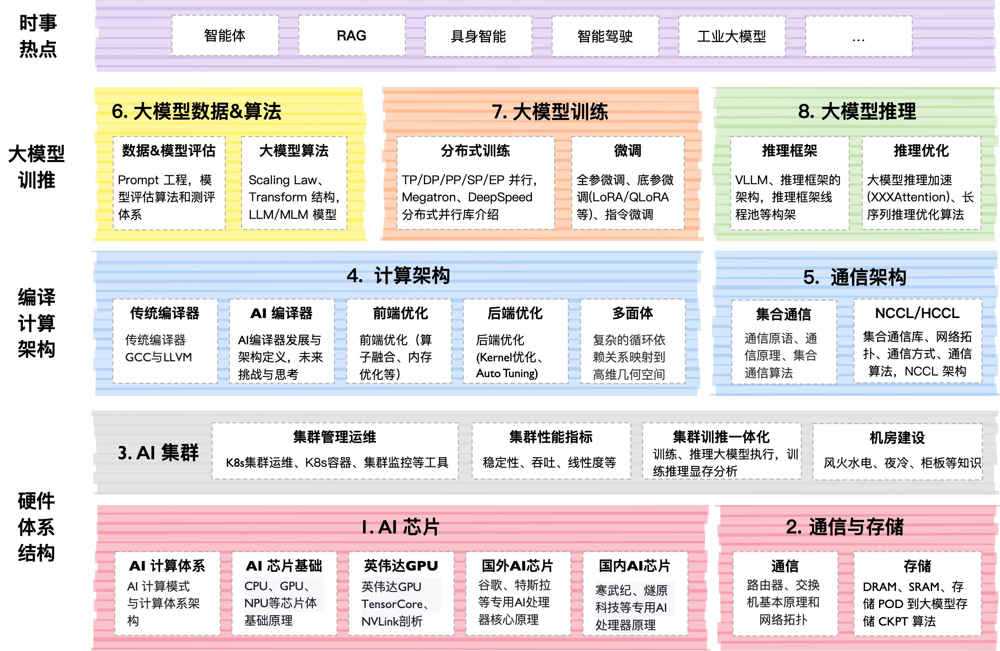

> https://infrasys-ai.github.io/aisystem-docs/
> https://github.com/Infrasys-AI/AISystem

# LLM Infra

大模型是基于 AI 集群的全栈软硬件性能优化，通过最小的每一块 AI 芯片组成的 AI 集群，编译器使能到上层的 AI 框架，训练过程需要分布式并行、集群通信等算法支持，而且在大模型领域最近持续演进如智能体等新技术。

 **AIInfra** 项目主要针对大模型，特别是大模型在分布式集群、分布式架构、分布式训练、大模型算法等相关领域进行深度展开。

## 课程内容大纲

| 教程内容       | 简介                                                                                                                                                         | 地址                                                                                     |
| ---------- | ---------------------------------------------------------------------------------------------------------------------------------------------------------- | -------------------------------------------------------------------------------------- |
| AI 系统全栈概述  | AI 基础知识和 AI 系统的全栈概述的 AI 系统概述，以及深度学习系统的系统性设计和方法论，主要是整体了解 AI 训练和推理全栈的体系结构内容。                                                                                 | [[Slides](https://github.com/Infrasys-AI/AISystem/blob/main/01Introduction/README.md)] |
| AI 芯片与体系架构 | 作为 AI 的硬件体系架构主要是指 AI 芯片，这里就很硬核了，从 CPU、GPU 的芯片基础到 AI 芯片的原理、设计和应用场景范围，AI 芯片的设计不仅仅考虑针对 AI 计算的加速，还需要充分考虑到 AI 的应用算法、AI 框架等中间件，而不是停留在天天喊着吊打英伟达和 CUDA，实际上芯片难以用起来。 | [[Slides](https://github.com/Infrasys-AI/AISystem/blob/main/02Hardware/README.md)]     |
| AI 编程与计算架构 | 进阶篇介绍 AI 编程与计算架构，将站在系统设计的角度，思考在设计现代机器学习系统中需要考虑的编译器问题，特别是中间表达乃至后端优化。                                                                                        | [[Slides](https://github.com/Infrasys-AI/AISystem/blob/main/03Compiler/README.md)]     |
| AI 推理系统与引擎 | 实际应用推理系统与引擎，。                                                                                                                                              | [[Slides](https://github.com/Infrasys-AI/AISystem/blob/main/04Inference/README.md)]    |
| AI 框架核心技术  | 介绍 AI 框架核心技术，首先介绍任何一个 AI 框架都离不开的自动微分，通过自动微分功能后就会产生表示神经网络的图和算子，然后介绍 AI 框架前端的优化，还有最近很火的大模型分布式训练在 AI 框架中的关键技术。                                                | [[Slides](https://github.com/Infrasys-AI/AISystem/blob/main/05Framework/README.md)]    |
第六部分，汇总篇介绍**大模型与 AI 系统**，大模型是基于 AI 集群的全栈软硬件性能优化，通过最小的每一块 AI 芯片组成的 AI 集群，编译器使能到上层的 AI 框架，训练过程需要分布式并行、集群通信等算法支持，而且在大模型领域最近持续演进如智能体等新技术。

| 序列  | 教程内容                                                                                                                                               | 简介                                                                                                                              | 地址                                                                       |
| --- | -------------------------------------------------------------------------------------------------------------------------------------------------- | ------------------------------------------------------------------------------------------------------------------------------- | ------------------------------------------------------------------------ |
| 00  | [大模型系统概述](https://github.com/Infrasys-AI/AIInfra/blob/main/README.md#00-%E5%A4%A7%E6%A8%A1%E5%9E%8B%E7%B3%BB%E7%BB%9F%E6%A6%82%E8%BF%B0)           | 系统梳理了大模型关键技术点，涵盖 Scaling Law 的多场景应用、训练与推理全流程技术栈、AI 系统与大模型系统的差异，以及未来趋势如智能体、多模态、轻量化架构和算力升级。                                       | [Slides](https://github.com/Infrasys-AI/AIInfra/blob/main/00Summary)     |
| 01  | [AI 计算集群](https://github.com/Infrasys-AI/AIInfra/blob/main/README.md#01-ai-%E8%AE%A1%E7%AE%97%E9%9B%86%E7%BE%A4)                                   | 大模型虽然已经慢慢在端测设备开始落地，但是总体对云端的依赖仍然很重很重，AI 集群会介绍集群运维管理、集群性能、训练推理一体化拓扑流程等内容。                                                         | [Slides](https://github.com/Infrasys-AI/AIInfra/blob/main/01AICluster)   |
| 02  | [通信与存储](https://github.com/Infrasys-AI/AIInfra/blob/main/README.md#02-%E9%80%9A%E4%BF%A1%E4%B8%8E%E5%AD%98%E5%82%A8)                               | 大模型训练和推理的过程中都严重依赖于网络通信，因此会重点介绍通信原理、网络拓扑、组网方案、高速互联通信的内容。存储则是会从节点内的存储到存储 POD 进行介绍。                                                | [Slides](https://github.com/Infrasys-AI/AIInfra/blob/main/02StorComm)    |
| 03  | [集群容器与云原生](https://github.com/Infrasys-AI/AIInfra/blob/main/README.md#03-%E9%9B%86%E7%BE%A4%E5%AE%B9%E5%99%A8%E4%B8%8E%E4%BA%91%E5%8E%9F%E7%94%9F) | 讲解容器与 K8S 技术原理及 AI 模型部署实践，涵盖容器基础、Docker 与 K8S 核心概念、集群搭建、AI 应用部署、任务调度、资源管理、可观测性、高可靠设计等云原生与大模型结合的关键技术点。                           | [Slides](https://github.com/Infrasys-AI/AIInfra/blob/main/03DockCloud)   |
| 04  | [分布式训练](https://github.com/Infrasys-AI/AIInfra/blob/main/README.md#04-%E5%A4%A7%E6%A8%A1%E5%9E%8B%E8%AE%AD%E7%BB%83)                               | 大模型训练是通过大量数据和计算资源，利用 Transformer 架构优化模型参数，使其能够理解和生成自然语言、图像等内容，广泛应用于对话系统、文本生成、图像识别等领域。                                           | [Slides](https://github.com/Infrasys-AI/AIInfra/blob/main/04Train)       |
| 05  | [分布式推理](https://github.com/Infrasys-AI/AIInfra/blob/main/README.md#05-%E5%A4%A7%E6%A8%A1%E5%9E%8B%E6%8E%A8%E7%90%86)                               | 大模型推理核心工作是优化模型推理，实现推理加速，其中模型推理最核心的部分是 Transformer Block。本节会重点探讨大模型推理的算法、调度策略和输出采样等相关算法。                                         | [Slides](https://github.com/Infrasys-AI/AIInfra/blob/main/05Infer)       |
| 06  | [大模型算法与数据](https://github.com/Infrasys-AI/AIInfra/blob/main/README.md#06-%E5%A4%A7%E6%A8%A1%E5%9E%8B%E7%AE%97%E6%B3%95%E4%B8%8E%E6%95%B0%E6%8D%AE) | Transformer 起源于 NLP 领域，近期统治了 CV/NLP/多模态的大模型，我们将深入地探讨 Scaling Law 背后的原理。在大模型算法背后数据和算法的评估也是核心的内容之一，如何实现 Prompt 和通过 Prompt 提升模型效果。 | [Slides](https://github.com/Infrasys-AI/AIInfra/blob/main/06AlgoData)    |
| 07  | [大模型应用](https://github.com/Infrasys-AI/AIInfra/blob/main/README.md#07-%E5%A4%A7%E6%A8%A1%E5%9E%8B%E5%BA%94%E7%94%A8)                               | 当前大模型技术已进入快速迭代期。这一时期的显著特点就是技术的更新换代速度极快，新算法、新模型层出不穷。因此本节内容将会紧跟大模型的时事内容，进行深度技术分析。                                                 | [Slides](https://github.com/Infrasys-AI/AIInfra/blob/main/07Application) |

# AI Sys

## AI 系统与 LLM 概述

|编号|名称|具体内容|
|:-:|:--|:--|
|1|[AI 系统](https://github.com/Infrasys-AI/AISystem/blob/main/01Introduction)|算法、框架、体系结构的结合，形成 AI 系统|

大模型系统概述、Scaling Law 解读、训练推理流程、系统区别及未来趋势。

|编号|名称|具体内容|
|:-:|:--|:--|
|1|[Scaling Law 解读](https://github.com/Infrasys-AI/AIInfra/blob/main/00Summary/01ScalingLaw)|Scaling Law 在不同场景下的应用与演进|
|2|[训练推理全流程](https://github.com/Infrasys-AI/AIInfra/blob/main/00Summary/02TrainInfer)|大模型训练与推理全流程及软硬件优化|
|3|[与 AI 系统区别](https://github.com/Infrasys-AI/AIInfra/blob/main/00Summary/03Different)|AI 系统与大模型系统的通用性、资源与软件栈差异|
|3|[大模型系统发展](https://github.com/Infrasys-AI/AIInfra/blob/main/00Summary/04Develop)|大模型系统未来趋势：技术演进、场景应用与算力生态升级|

## AI 芯片体系结构

TODO: TPU

|编号|名称|具体内容|
|:-:|:--|:--|
|1|[AI 计算体系](https://github.com/Infrasys-AI/AISystem/blob/main/02Hardware/01Foundation)|神经网络等 AI 技术的计算模式和计算体系架构|
|2|[AI 芯片基础](https://github.com/Infrasys-AI/AISystem/blob/main/02Hardware/02ChipBase)|CPU、GPU、NPU 等芯片体系架构基础原理|
|3|[图形处理器 GPU](https://github.com/Infrasys-AI/AISystem/blob/main/02Hardware/03GPUBase)|GPU 的基本原理，英伟达 GPU 的架构发展|
|4|[英伟达 GPU 详解](https://github.com/Infrasys-AI/AISystem/blob/main/02Hardware/04NVIDIA)|英伟达 GPU 的 Tensor Core、NVLink 深度剖析|
|5|[国外 AI 处理器](https://github.com/Infrasys-AI/AISystem/blob/main/02Hardware/05Abroad)|谷歌、特斯拉等专用 AI 处理器核心原理|
|6|[国内 AI 处理器](https://github.com/Infrasys-AI/AISystem/blob/main/02Hardware/06Domestic)|寒武纪、燧原科技等专用 AI 处理器核心原理|
|7|[AI 芯片黄金 10 年](https://github.com/Infrasys-AI/AISystem/blob/main/02Hardware/07Thought)|对 AI 芯片的编程模式和发展进行总结|

## 大模型算法与数据

大模型算法与数据全览：Transformer 架构、MoE 创新、多模态模型与数据工程全流程实践。

|编号|名称|具体内容|
|:-:|:--|:--|
|1|[Transformer 架构](https://github.com/Infrasys-AI/AIInfra/blob/main/06AlgoData/01Basic)|Transformer 架构原理深度介绍|
|2|[MoE 架构](https://github.com/Infrasys-AI/AIInfra/blob/main/06AlgoData/02MoE)|MoE(Mixture of Experts) 混合专家模型架构原理与细节实现|
|3|[创新架构](https://github.com/Infrasys-AI/AIInfra/blob/main/06AlgoData/03NewArch)|SSM、MMABA、RWKV、Linear Transformer、JPEA 等新大模型结构|
|4|[图文生成与理解](https://github.com/Infrasys-AI/AIInfra/blob/main/06AlgoData/04ImageTextGenerat)|多模态对齐、生成、理解及统一多模态架构解析|
|5|[视频大模型](https://github.com/Infrasys-AI/AIInfra/blob/main/06AlgoData/05VideoGenerat)|视频多模态理解与生成方法演进及 Flow Matching 应用|
|6|[语音大模型](https://github.com/Infrasys-AI/AIInfra/blob/main/06AlgoData/06AudioGenerat)|语音多模态识别、合成与端到端模型演进及推理应用|
|7|[数据工程](https://github.com/Infrasys-AI/AIInfra/blob/main/06AlgoData/07DataEngineer)|数据工程、Prompt Engine 等相关技术|

## AI 框架核心技术

|编号|名称|具体内容|
|:-:|:--|:--|
|1|[推理系统](https://github.com/Infrasys-AI/AISystem/blob/main/04Inference/01Inference)|推理系统整体介绍，推理引擎架构梳理|
|2|[轻量网络](https://github.com/Infrasys-AI/AISystem/blob/main/04Inference/02Mobilenet)|轻量化主干网络，MobileNet 等 SOTA 模型介绍|
|3|[模型压缩](https://github.com/Infrasys-AI/AISystem/blob/main/04Inference/03Slim)|模型压缩 4 件套，量化、蒸馏、剪枝和二值化|
|4|[转换&优化](https://github.com/Infrasys-AI/AISystem/blob/main/04Inference/04Converter)|AI 框架训练后模型进行转换，并对计算图优化|
|5|[Kernel 优化](https://github.com/Infrasys-AI/AISystem/blob/main/04Inference/05Kernel)|Kernel 层、算子层优化，对算子、内存、调度优化|

|编号|名称|具体内容|
|:-:|:--|:--|
|1|[AI 框架基础](https://github.com/Infrasys-AI/AISystem/blob/main/05Framework/01Foundation)|AI 框架的作用、发展、编程范式|
|2|[自动微分](https://github.com/Infrasys-AI/AISystem/blob/main/05Framework/02AutoDiff)|自动微分的实现方式和原理|
|3|[计算图](https://github.com/Infrasys-AI/AISystem/blob/main/05Framework/03DataFlow)|计算图的概念，图优化、图执行、控制流表达|

## AI 计算集群、容器与云原生

AI 集群架构演进、万卡集群方案、性能建模与优化，GPU/NPU 精度差异及定位方法。

|编号|名称|具体内容|
|:-:|:--|:--|
|1|[计算集群之路](https://github.com/Infrasys-AI/AIInfra/blob/main/01AICluster/01Roadmap)|高性能计算集群发展与万卡 AI 集群建设及机房基础设施挑战|
|2|[集群建设之巅](https://github.com/Infrasys-AI/AIInfra/blob/main/01AICluster/02TypicalRepresent)|超节点计算集群架构演进与昇腾集群组网方案解析|
|3|[集群性能分析](https://github.com/Infrasys-AI/AIInfra/blob/main/01AICluster/03Analysis)|集群性能指标分析、建模与常见问题定位方法解析|

AI 集群云原生篇：容器技术、K8S 编排、AI 云平台与任务调度，提升集群资源管理与应用部署效率。

|编号|名称|具体内容|
|:-:|:--|:--|
|1|[容器时代](https://github.com/Infrasys-AI/AIInfra/blob/main/03DockCloud/01Roadmap)|容器技术基础与云原生架构解析，结合分布式训练应用实践|
|2|[容器初体验](https://github.com/Infrasys-AI/AIInfra/blob/main/03DockCloud/02DockerK8s)|Docker 与 K8S 基础原理及实战，涵盖容器技术与集群管理架构解析|
|3|[深入 K8S](https://github.com/Infrasys-AI/AIInfra/blob/main/03DockCloud/03DiveintoK8s)|K8S 核心机制深度解析：编排、存储、网络、调度与监控实践|
|4|[AI 云平台](https://github.com/Infrasys-AI/AIInfra/blob/main/03DockCloud/04CloudforAI)|AI 云平台演进与云原生架构解析，涵盖持续交付与智能化运维实践|

## 分布式训练

通信与存储篇：AI 集群组网技术、高速互联方案、集合通信原理与优化、存储系统设计及大模型挑战。

|编号|名称|具体内容|
|:-:|:--|:--|
|1|[集群组网之路](https://github.com/Infrasys-AI/AIInfra/blob/main/02StorComm/01Roadmap)|AI 集群组网架构设计与高速互联技术解析|
|2|[网络通信进阶](https://github.com/Infrasys-AI/AIInfra/blob/main/02StorComm/02NetworkComm)|网络通信技术进阶：高速互联、拓扑算法与拥塞控制解析|
|3|[集合通信原理](https://github.com/Infrasys-AI/AIInfra/blob/main/02StorComm/03CollectComm)|通信域、通信算法、集合通信原语|
|4|[集合通信库](https://github.com/Infrasys-AI/AIInfra/blob/main/02StorComm/04CommLibrary)|集合通信库技术解析：MPI、NCCL 与 HCCL 架构及算法原理|
|5|[集群存储之路](https://github.com/Infrasys-AI/AIInfra/blob/main/02StorComm/05StorforAI)|数据存储、CheckPoint 梯度检查点等存储与大模型结合的相关技术|

大模型训练全解析：并行策略、加速算法、微调与评估，覆盖训练到优化的完整流程。

|编号|名称|具体内容|
|:-:|:--|:--|
|1|[分布式并行基础](https://github.com/Infrasys-AI/AIInfra/blob/main/04Train/01ParallelBegin)|分布式并行的策略分类、模型适配与硬件资源优化对比|
|2|[大模型并行进阶](https://github.com/Infrasys-AI/AIInfra/blob/main/04Train/02ParallelAdv)|Megatron、DeepSeed 架构解析、MoE 扩展与高效训练策略|
|3|[大模型训练加速](https://github.com/Infrasys-AI/AIInfra/blob/main/04Train/03TrainAcceler)|大模型训练加速在算法优化、内存管理与通算融合策略解析|
|4|[后训练与强化学习](https://github.com/Infrasys-AI/AIInfra/blob/main/04Train/04PostTrainRL)|后训练与强化学习算法对比、框架解析与工程实践|
|5|[大模型微调 SFT](https://github.com/Infrasys-AI/AIInfra/blob/main/04Train/05FineTune)|大模型微调算法原理、变体优化与多模态实践|
|6|[大模型验证评估](https://github.com/Infrasys-AI/AIInfra/blob/main/04Train/06VerifValid)|大模型评估、基准测试与统一框架解析|

## 分布式推理

大模型推理全解析：加速技术、架构优化、长序列处理与压缩方案，覆盖推理全流程与实战实践。

| 编号  | 名称                                                                                 | 具体内容                                  |
| :-: | :--------------------------------------------------------------------------------- | :------------------------------------ |
|  1  | [基本概念](https://github.com/Infrasys-AI/AIInfra/blob/main/05Infer/01Foundation)      | 大模型推理流程、框架对比与性能指标解析                   |
|  2  | [大模型推理加速](https://github.com/Infrasys-AI/AIInfra/blob/main/05Infer/02InferSpeedUp) | 大模型推理加速中 KV 缓存优化、算子改进与高效引擎解析          |
|  3  | [架构调度加速](https://github.com/Infrasys-AI/AIInfra/blob/main/05Infer/03SchedSpeedUp)  | 架构调度加速中缓存优化、批处理与分布式系统调度解析             |
|  4  | [长序列推理](https://github.com/Infrasys-AI/AIInfra/blob/main/05Infer/04LongInfer)      | 长序列推理算法优化、并行策略与高效生成方法解析               |
|  5  | [输出采样](https://github.com/Infrasys-AI/AIInfra/blob/main/05Infer/05OutputSamp)      | 推理输出采样的基础方法、加速策略与 MOE 推理优化            |
|  6  | [大模型压缩](https://github.com/Infrasys-AI/AIInfra/blob/main/05Infer/06CompDistill)    | 低精度量化、知识蒸馏与高效推理优化解析                   |
|  7  | [推理框架架构](https://github.com/Infrasys-AI/AIInfra/blob/main/05Infer/07Framework)     | 主流推理框架 vLLM、SGLang 等核心技术与部署实践         |
|  8  | [DeepSeek 开源](https://github.com/Infrasys-AI/AIInfra/blob/main/05Infer/08DeepSeek) | DeepSeek 推理 FlashMLA、DeepEP 与高效算子加速解析 |

## AI 编译原理

|编号|名称|具体内容|
|:-:|:--|:--|
|1|[传统编译器](https://github.com/Infrasys-AI/AISystem/blob/main/03Compiler/01Tradition)|传统编译器 GCC 与 LLVM，LLVM 详细架构|
|2|[AI 编译器](https://github.com/Infrasys-AI/AISystem/blob/main/03Compiler/02AICompiler)|AI 编译器发展与架构定义，未来挑战与思考|
|3|[前端优化](https://github.com/Infrasys-AI/AISystem/blob/main/03Compiler/03Frontend)|AI 编译器的前端优化 (算子融合、内存优化等)|
|4|[后端优化](https://github.com/Infrasys-AI/AISystem/blob/main/03Compiler/04Backend)|AI 编译器的后端优化 (Kernel 优化、AutoTuning)|
|5|多面体|待更 ing...|
|6|[PyTorch2.0](https://github.com/Infrasys-AI/AISystem/blob/main/03Compiler/06PyTorch)|PyTorch2.0 最重要的新特性：编译技术栈|

## 大模型应用

大模型应用篇：AI Agent 技术、RAG 检索增强生成与 GraphRAG，推动智能体与知识增强应用落地。

| 编号  | 名称                                                                                     | 具体内容                                    |
| :-: | :------------------------------------------------------------------------------------- | :-------------------------------------- |
| 00  | [大模型热点](https://github.com/Infrasys-AI/AIInfra/blob/main/07Application/00Others)       | OpenAI、WWDC、GTC 等大会技术洞察                 |
| 01  | [Agent 简单概念](https://github.com/Infrasys-AI/AIInfra/blob/main/07Application/01Sample)  | AI Agent 智能体的原理、架构                      |
| 02  | [Agent 核心技术](https://github.com/Infrasys-AI/AIInfra/blob/main/07Application/02AIAgent) | 深入 AI Agent 原理和核心                       |
| 03  | [检索增强生成(RAG)](https://github.com/Infrasys-AI/AIInfra/blob/main/07Application/03RAG)    | 检索增强生成技术的介绍                             |
| 04  | [自动驾驶](https://github.com/Infrasys-AI/AIInfra/blob/main/07Application/04AutoDrive)     | 端到端自动驾驶技术原理解析，萝卜快跑对产业带来的变化              |
| 05  | [具身智能](https://github.com/Infrasys-AI/AIInfra/blob/main/07Application/05Embodied)      | 关于对具身智能的技术原理、具身架构和产业思考                  |
| 06  | [生成推荐](https://github.com/Infrasys-AI/AIInfra/blob/main/07Application/06Remmcon)       | 推荐领域的革命发展历程，大模型迎来了生成式推荐新的增长             |
| 07  | [AI 安全](https://github.com/Infrasys-AI/AIInfra/blob/main/07Application/07Safe)         | 隐私计算发展过程，隐私计算未来发展如何？                    |
| 08  | [AI 历史十年](https://github.com/Infrasys-AI/AIInfra/blob/main/07News/06History)           | 过去十年 AI 大事件回顾，2012 到 2025 从模型、算法、芯片硬件发展 |

# AI 系统全方面知识体系表

# AI 系统与 LLM 概述

| 1   | AI 系统基础          | 算法、框架、体系结构的结合，形成 AI 系统的核心构成与整体概念                                |
| --- | ---------------- | --------------------------------------------------------------- |
| 2   | Scaling Law 解读   | Scaling Law 在不同场景下的应用逻辑、演进历程与实践价值                               |
| 3   | 训练推理全流程          | 大模型从数据输入到模型输出的完整训练链路、推理链路，及软硬件协同优化方案                            |
| 4   | 与 AI 系统区别        | 对比 AI 系统与大模型系统在通用性覆盖范围、资源消耗需求、软件栈架构的核心差异                        |
| 5   | 大模型系统发展趋势        | 大模型系统技术演进方向、场景应用拓展路径与算力生态升级策略                                   |

# 二、AI 芯片体系结构

| 1   | AI 计算体系          | 神经网络等 AI 技术的底层计算模式（如张量计算、稀疏计算）与整体计算体系架构设计                       |
| --- | ---------------- | --------------------------------------------------------------- |
| 2   | AI 芯片基础          | CPU、GPU、NPU 等主流 AI 芯片的体系架构原理、核心功能与适用场景                          |
| 3   | 图形处理器 GPU 基础     | GPU 的基本工作原理、并行计算逻辑，及英伟达 GPU 的架构迭代历程（如 Kepler 到 Hopper）          |
| 4   | 英伟达 GPU 详解       | 深度剖析英伟达 GPU 的 Tensor Core 计算单元、NVLink 互联技术的原理与性能优势              |
| 5   | 国外 AI 处理器        | 谷歌 TPU、特斯拉 D1 等专用 AI 处理器的核心设计原理、架构特点与应用场景                       |
| 6   | 国内 AI 处理器        | 寒武纪思元系列、燧原科技云燧系列等专用 AI 处理器的核心原理与技术特点                            |
| 7   | AI 芯片黄金 10 年     | 总结 AI 芯片的编程模式演进（如 CUDA、ROCm），并展望未来发展方向                          |
| 8   | TPU 技术（待补充）      | TODO：谷歌 TPU 的架构设计、计算能力、应用场景与技术迭代                                |

# 三、大模型算法与数据

| 1   | Transformer 架构   | 深度解析 Transformer 的编码器 / 解码器结构、自注意力机制、残差连接等核心原理                  |
| --- | ---------------- | --------------------------------------------------------------- |
| 2   | MoE 架构           | Mixture of Experts（混合专家模型）的架构原理、专家选择机制与细节实现方案                   |
| 3   | 创新架构             | 介绍 SSM、MMABA、RWKV、Linear Transformer、JPEA 等新型大模型结构的设计思路与优势      |
| 4   | 图文生成与理解          | 多模态数据对齐方法、图文生成技术、图文理解逻辑及统一多模态架构解析                               |
| 5   | 视频大模型            | 视频多模态理解与生成的技术演进、Flow Matching 算法应用及帧间关联处理方案                     |
| 6   | 语音大模型            | 语音多模态识别、语音合成技术、端到端语音模型演进及推理应用实践                                 |
| 7   | 数据工程             | 大模型数据采集、清洗、标注、Prompt Engine（提示工程）等相关技术与实践                       |

# 四、AI 框架核心技术

| 1   | 推理系统基础           | 推理系统的整体架构设计、核心组件（如推理引擎、调度模块）及主流推理引擎对比                           |
| --- | ---------------- | --------------------------------------------------------------- |
| 2   | 轻量网络             | 轻量化主干网络设计思路，MobileNet 等 SOTA（state-of-the-art）轻量模型的原理与应用        |
| 3   | 模型压缩             | 模型压缩 "4 件套 "：量化（如 INT8/FP16）、知识蒸馏、剪枝（结构化 / 非结构化）、二值化的技术细节        |
| 4   | 转换 & 优化          | AI 框架训练后模型的格式转换方法（如 ONNX 转换），及计算图剪枝、算子融合等优化策略                   |
| 5   | Kernel 优化        | 从 Kernel 层、算子层进行优化，包括算子性能调优、内存访问优化、任务调度优化                       |
| 6   | AI 框架基础          | AI 框架的核心作用、发展历程（如 TensorFlow 到 PyTorch）、主流编程范式（命令式 / 声明式）       |
| 7   | 自动微分             | 自动微分的数学原理、正向微分与反向微分实现方式，及在 AI 框架中的工程落地                          |
| 8   | 计算图              | 计算图的概念定义、图优化技术（如常量折叠）、图执行模式、控制流表达方法                             |

# 五、AI 计算集群、容器与云原生

| 1   | 计算集群之路           | 高性能计算集群发展历程、万卡 AI 集群建设方案，及机房基础设施（供电、散热）挑战                       |
| --- | ---------------- | --------------------------------------------------------------- |
| 2   | 集群建设之巅           | 超节点计算集群架构演进逻辑、昇腾集群组网方案解析与性能优化策略                                 |
| 3   | 集群性能分析           | 集群性能核心指标（如吞吐量、延迟）分析方法、性能建模思路与常见问题定位方案                           |
| 4   | 容器时代             | 容器技术基础原理、云原生架构核心思想，及容器在分布式训练中的应用实践                              |
| 5   | 容器初体验            | Docker 容器技术原理、K8S（Kubernetes）基础架构，及容器技术与集群管理实战                  |
| 6   | 深入 K8S           | K8S 核心机制（编排、存储、网络、调度、监控）深度解析与实践配置                               |
| 7   | AI 云平台           | AI 云平台的演进历程、云原生架构设计，及持续交付（CI/CD）与智能化运维实践                        |

# 六、分布式训练

| 1   | 集群组网之路           | AI 集群组网架构设计原则、高速互联技术（如 InfiniBand）解析与选型策略                       |
| --- | ---------------- | --------------------------------------------------------------- |
| 2   | 网络通信进阶           | 高速互联技术细节、网络拓扑算法优化、拥塞控制策略，及通信性能瓶颈解决方案                            |
| 3   | 集合通信原理           | 集合通信域定义、核心通信算法（如 AllReduce、Broadcast）、集合通信原语功能                  |
| 4   | 集合通信库            | MPI、NCCL、HCCL 等集合通信库的架构设计、算法原理与适用场景对比                           |
| 5   | 集群存储之路           | AI 集群数据存储方案、CheckPoint（梯度检查点）技术，及大模型存储挑战应对策略                    |
| 6   | 分布式并行基础          | 分布式并行策略分类（数据并行、模型并行、张量并行）、模型适配方法与硬件资源优化对比                       |
| 7   | 大模型并行进阶          | Megatron、DeepSeed 架构深度解析、MoE 模型并行扩展方案与高效训练策略                    |
| 8   | 大模型训练加速          | 大模型训练加速的算法优化（如混合精度训练）、内存管理（如内存复用）与通算融合策略                        |
| 9   | 后训练与强化学习         | 后训练技术（如 Continual Learning）、强化学习算法（如 RLHF）对比、框架解析与工程实践          |
| 10  | 大模型微调 SFT        | 大模型微调（SFT）算法原理、变体优化（如 LoRA）与多模态微调实践                             |
| 11  | 大模型验证评估          | 大模型评估维度（准确性、鲁棒性）、基准测试（如 GLUE、MMLU）与统一评估框架解析                     |

# 七、分布式推理

| 1   | 基本概念             | 大模型推理完整流程（输入处理→模型计算→输出生成）、推理框架对比与性能指标（延迟、吞吐量）解析                 |
| --- | ---------------- | --------------------------------------------------------------- |
| 2   | 大模型推理加速          | 大模型推理加速的 KV 缓存优化、算子改进（如自定义高效算子）与高效推理引擎解析                        |
| 3   | 架构调度加速           | 推理架构的缓存优化策略、批处理（动态批处理 / 静态批处理）与分布式系统调度逻辑                        |
| 4   | 长序列推理            | 长序列推理的算法优化（如 FlashAttention）、并行策略与高效生成方法（如 Stream Generation）解析 |
| 5   | 输出采样             | 推理输出采样的基础方法（如 Top-K、Temperature）、采样加速策略与 MOE 推理优化               |
| 6   | 大模型压缩            | 低精度量化（如 INT4）、知识蒸馏（如 Teacher-Student）与高效推理优化方案                  |
| 7   | 推理框架架构           | 主流推理框架（vLLM、SGLang）的核心技术（如 PagedAttention）与部署实践步骤               |
| 8   | DeepSeek 开源推理    | DeepSeek 推理框架的 FlashMLA 技术、DeepEP 优化策略与高效算子加速解析                 |

# 八、AI 编译原理

| 1   | 传统编译器            | 传统编译器（GCC、LLVM）的工作流程，LLVM 的模块化架构（前端→优化器→后端）解析               |
| --- | ---------------- | ----------------------------------------------------------- |
| 2   | AI 编译器           | AI 编译器的发展历程、核心架构定义（如 TVM 的 Relay IR）、未来技术挑战与思考              |
| 3   | 前端优化             | AI 编译器前端优化技术：算子融合、内存访问优化、冗余计算消除等具体策略                        |
| 4   | 后端优化             | AI 编译器后端优化技术：Kernel 优化、AutoTuning（自动调优）、硬件适配方法              |
| 5   | 多面体优化（待补充）       | TODO：多面体编译的数学原理、在 AI 编译中的应用场景与优化效果                          |
| 6   | PyTorch2.0 编译技术栈 | PyTorch2.0 的核心新特性：TorchDynamo、AOTAutograd、Inductor 等编译技术栈解析 |

# 九、大模型应用

| 1   | 大模型热点洞察          | OpenAI、WWDC、GTC 等行业大会的技术亮点、趋势判断与落地应用案例                      |
| --- | ---------------- | ----------------------------------------------------------- |
| 2   | Agent 简单概念       | AI Agent（智能体）的基本原理、核心架构（感知→决策→执行）与典型应用场景                    |
| 3   | Agent 核心技术       | 深入解析 AI Agent 的任务规划、记忆机制、工具调用、多智能体协作等核心技术                   |
| 4   | 检索增强生成 (RAG)     | RAG 技术的核心流程（检索→增强→生成）、检索引擎选型、知识更新策略与实践                      |
| 5   | 自动驾驶             | 端到端自动驾驶技术原理解析、萝卜快跑等案例对自动驾驶产业的影响与变革                          |
| 6   | 具身智能             | 具身智能的技术原理（感知 - 动作闭环）、具身架构设计与产业应用思考                          |
| 7   | 生成推荐             | 推荐系统的发展历程、大模型驱动的生成式推荐技术原理与增长潜力                              |
| 8   | AI 安全            | 隐私计算技术（如联邦学习、同态加密）的发展过程、技术瓶颈与未来发展方向                         |
| 9   | AI 历史十年回顾        | 2012-2025 年 AI 领域大事件梳理，涵盖模型、算法、芯片硬件的关键发展节点                  |
