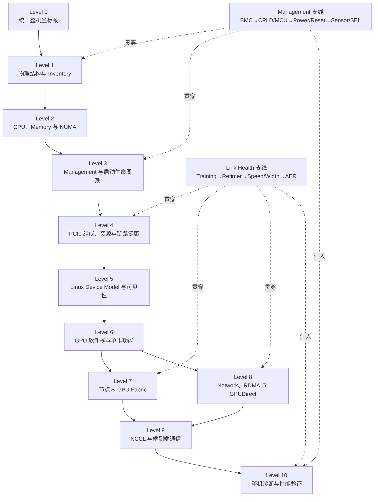

# GPU 服务器：从物理硬件到 Linux 设备系统

本文是一台现代 GPU 服务器的分层学习地图。读者已有 Linux、CUDA 和多 GPU 通信基础，希望系统补齐服务器硬件、PCIe、NUMA、Linux device model、GPU Fabric、RDMA 与 NCCL 的底层关系。全文不再把“系统概念”和“学习路线”分开：Level 0—10 既是知识结构，也是能力依赖；每一级都说明学习路线、核心模型、必须掌握的边界、应形成的产物和进入下一级的标准。

文件编号 01—11 是深入阅读材料，不与 Level 一一对应。Level 7 与 Level 8 在完成 GPU 单卡基础后可以分支学习，并在 Level 9 的 NCCL 端到端通信中汇合。所有 BDF、拓扑和路径图都是教学抽象，不是用户服务器实测，也不替代目标平台的 service manual、block diagram 和版本文档。



每一级都按“建立模型 → 读取只读证据 → 解释一条具体路径 → 形成可复核产物 → 达到通过标准”推进。没有实机时，可以使用厂商框图和明确标注的教学输出练习，但不能把示意地址、链路和性能写成实测。

## Level 0：建立三个世界、三条路径和多套 Fabric 的统一坐标

本级路线是“系统域 → 观察世界 → Fabric → 行为路径 → 设备状态”。目标不是记住名词，而是建立一个能容纳后续全部对象的坐标系：看到 GPU、BMC、KMD、NVSwitch、RDMA 或 NCCL 时，先判断它是什么类型的实体，属于哪个观察边界，与哪些对象通过什么关系连接。

### 五个系统域与三个观察世界

从功能职责看，一台 DGX 类服务器可以分为五个相互依赖的系统域：计算域执行 Host 程序并提供主机内存；I/O 域建立 Host 与 PCIe Device 的连接；加速器域提供 GPU 计算和节点内 scale-up；网络域建立节点间 scale-out；管理域维持供电、复位、散热和带外观察。

| 系统域 | 主要对象 | 核心职责 |
| --- | --- | --- |
| 计算域 | CPU、socket、core、cache、memory controller、DRAM | 运行 Host 软件，提供内存、NUMA 和 IO 根侧能力 |
| I/O 域 | Host Bridge、Root Complex、Root Port、PCIe Switch、Retimer、Endpoint | 发现、配置并连接 GPU、NIC、NVMe 等设备 |
| 加速器域 | GPU、HBM、NVLink、NVSwitch | 执行 GPU workload，提供节点内高速 peer 通信 |
| 网络域 | NIC/HCA、DPU、InfiniBand、RoCE、Ethernet | 承载节点间数据通信和 RDMA |
| 管理域 | BMC、CPLD、MCU、PSU、VRM、fan、sensor、FRU | 提供带外管理、上电时序、遥测、复位和资产信息 |

系统域描述功能分工，Host、Device、Management 三个世界描述谁拥有状态、由谁执行代码、经由什么接口观察。Host 是 CPU、DRAM、主机 firmware、Linux、driver 和用户态程序所在的主计算系统；Device 是 GPU、NIC、DPU、NVMe、PCIe Switch 等设备及其处理器、寄存器、队列和 firmware；Management 以 BMC 为核心，通过 CPLD、MCU 和板级管理接口维持机器。一个 GPU 同时属于加速器域和 Device world，还是 PCIe 与 NVLink 两套 Fabric 的节点，因此这些分类维度不能当作同一棵树的同级标签。

### 三条路径与多套 Fabric

控制路径负责发现能力、建立资源、配置寄存器、创建队列和提交工作；数据路径搬运模型参数、梯度、存储块和网络报文；管理路径负责 power、reset、telemetry、inventory 和 KVM。完成通知属于控制与数据协议的闭环：Device 可能更新 queue/CQ、写回状态或触发 MSI/MSI-X，让 driver 和应用观察到进度。

| Fabric | 主要节点 | 典型承载 | 不能由它单独推出 |
| --- | --- | --- | --- |
| CPU/Memory fabric | CPU、cache、memory controller、DRAM、socket interconnect | CPU load/store、coherence、跨 NUMA 访问 | GPU/NIC 的 PCIe 父路径 |
| PCIe IO fabric | Root Complex、Root Port、Switch port、Endpoint | configuration、MMIO、DMA、P2P、MSI/MSI-X | NVLink 邻接或网络端到端路径 |
| Accelerator fabric | GPU、NVLink、NVSwitch | GPU peer access、copy 和 collective payload | Host 枚举、KMD 和 CUDA 已正常 |
| Network fabric | NIC/HCA、link、switch/router、远端 NIC | Ethernet、InfiniBand 和 RoCE 数据 | 本机 GPU memory 已能被 NIC peer DMA |
| Management fabric | BMC、CPLD/MCU、I2C/SMBus/MCTP/PLDM、管理网 | power、reset、telemetry、inventory、KVM | Host 已枚举或应用可使用设备 |

全程至少维护四张互相映射的图：Physical Topology 记录 board、riser、cable、Retimer、Switch 与共享 power/reset domain；PCIe Logical Topology 记录 Root Port、Bridge、Endpoint、BDF 和 link；NUMA Topology 记录 CPU、Host memory、GPU 与 NIC locality；Accelerator/Network Topology 记录 NVLink、NVSwitch、NIC port 和远端网络。Management 关系叠加到物理图和生命周期中。任何一张图都不能替代另外三张。

### 设备状态不是“正常/异常”二分法

贯穿后续所有 Level 的状态链是 `Present → Enumerated → Driver Bound → Firmware Initialized → Configured → Functional → Healthy → Performance Validated`。这些状态逐级增加证据，但不是简单布尔值：设备 Functional 仍可能因为 PCIe 降宽、ECC、AER、NVLink degrade、thermal throttling 或 power limit 而不 Healthy；单次测试成功也不等于性能已经验证。

本级产物是一张单页总图，至少放入 CPU/DRAM、PCIe Root/Switch、GPU/HBM、NIC、NVLink/NVSwitch、Network、BMC/CPLD/MCU，并为每个对象标注系统域、观察世界、Fabric 和主要路径。通过标准是能解释“BMC 看见 GPU”“`lspci` 看见 GPU”“CUDA 能使用 GPU”和“NCCL 性能正常”为何是四种不同证据。

## Level 1：建立物理结构与 Inventory

本级路线是“机箱与基础设施 → 板级连接 → Host 组件 → Device 板卡 → Management 组件 → 多视角 Inventory”。目标是先回答“机器里应该有什么、当前各观察者分别看见什么”，不急于推断软件根因或通信路径。

### 从物理装配识别故障域

物理服务器由 chassis、motherboard/baseboard、riser、backplane、connector、cable、Retimer、PCIe Switch、CPU/DIMM、GPU、NIC、NVMe、PSU、VRM、fan 和传感器等组成。板卡、芯片、port、PCI function 和用户态 device 不是一一对应关系；物理相邻也不等于 PCIe 或 NUMA 相邻。Inventory 必须保留共享 power、reset、cooling、riser、cable 和 Switch 上行，因为多个 Endpoint 同时消失时，这些共同实体可能形成故障域。

### Host 与 Management 的 Inventory 不能互相替代

Host OS 可以发现 CPU、NUMA node、PCI function、Bridge、GPU、NIC、NVMe、IOMMU group、driver 和 system service；Management 可以通过 BMC、FRU、presence、sensor 和 SEL 观察板卡、PSU、fan 与环境状态。BMC inventory 中存在一张 GPU 板卡，不能证明 PCIe link 已训练或 Linux 已建立 `pci_dev`；Host 枚举到 GPU，也不能证明板级传感器、供电冗余或管理链路健康。

| Inventory 层 | 典型入口 | 能证明什么 | 不能证明什么 |
| --- | --- | --- | --- |
| 物理/BOM | service manual、block diagram、slot/serial、现场检查 | 平台设计和实体部件预期 | 当前链路或软件状态 |
| Management | Redfish/IPMI、BMC Web、FRU、sensor、SEL | 带外可见性、presence、power/thermal 线索 | Host 已完成 PCIe 枚举 |
| Host hardware | `lscpu`、`lspci`、sysfs | 当前内核发现的 CPU/PCI 对象 | driver、runtime 或性能正常 |
| Host function | `/dev`、netdev、RDMA device、`nvidia-smi` | driver 和部分功能接口已经建立 | P2P、GDR、collective 或性能正常 |

本级产物是一份带来源的 Inventory，记录平台预期数量、物理槽位/板卡标识、Host 侧对象、Management 侧对象、采集时间和未知项。通过标准是面对“少一张 GPU”时，能先判断缺失发生在 BOM/physical presence、BMC inventory、PCIe inventory、driver/function inventory 还是用户态 inventory。主笔记是 [[02-AISystem/cluster-and-hardware/01-物理服务器、NUMA与PCIe根层次|01 物理服务器、NUMA 与 PCIe 根层次]] 和 [[02-AISystem/cluster-and-hardware/03-从上电到设备枚举：Firmware与Linux的职责边界|03 从上电到设备枚举]] 的物理与管理部分。

## Level 2：建立 CPU、Memory、NUMA 与 IO Root 的位置模型

本级路线是“socket/core/cache → memory controller/DIMM/DRAM → socket interconnect → Host Bridge/Root Complex → Device locality”。目标是把 Host world 从一个抽象盒子展开为线程、页面和 Device 三种不同的位置。

### 三种位置必须分别观察

线程运行在哪组 CPU，Host page 实际分配在哪个 NUMA node，GPU/NIC 从哪个 IO root 接入，是三种相关但不等价的位置。CPU affinity 不能替代 memory placement；`numa_node` 相同不能证明两个 Device 共享 PCIe Switch；PCI domain、root bus、socket 和 NUMA node 也不是同一编号系统。

```text
CPU socket 0 / NUMA A                         CPU socket 1 / NUMA B
  ├─ cores/cache                                ├─ cores/cache
  ├─ memory controller ─ DRAM A                 ├─ memory controller ─ DRAM B
  └─ Host Bridge / Root Complex                 └─ Host Bridge / Root Complex
       ├─ GPU0 / GPU1                                ├─ GPU2 / GPU3
       └─ NIC0                                      └─ NIC1
                ╰──────── socket interconnect ───────╯
```

分析 Host buffer ↔ GPU 时，要同时问应用线程在哪里、buffer 页面在哪里、GPU 从哪个 IO root 接入；分析 GPU ↔ NIC 时，NUMA locality 只是初筛，还需要 Level 4 的 PCIe 父路径和 Level 8 的 peer-memory/GDR 条件。

本级产物是一张同时标出 CPU 集合、Memory node、Root Complex、GPU 和 NIC 的 NUMA 图。通过标准是能解释“GPU 与 NIC 都显示 node 0”为何不足以证明路径最短或 GDR 可用，并能指出跨 socket data/control/completion 各自可能经过的资源。主笔记是 [[02-AISystem/cluster-and-hardware/01-物理服务器、NUMA与PCIe根层次|01 物理服务器、NUMA 与 PCIe 根层次]]。

## Level 3：理解 Management、Firmware 与启动生命周期

本级路线是“standby power/BMC → CPLD/MCU 的 power、clock、reset 与 presence → BIOS/UEFI 初始化 CPU/Memory/IO → ACPI 等平台描述 → PCIe link training/enumeration → Linux/driver → Device/Fabric/runtime”。目标是把静态部件放回时间轴，确定每个阶段由谁负责、输出什么证据以及下游依赖什么前提。

### Management world 与 Host world 的职责边界

BMC 通常是拥有自身处理器、内存、存储、网络和 firmware 的独立管理计算机，可以在 Host OS 未启动时读取 sensor、记录 SEL、提供 KVM 和执行电源控制。CPLD、MCU、FRU/EEPROM、PSU、VRM 和 fan controller 更接近板级控制，具体职责取决于平台设计。Redfish/IPMI 是管理接口，不代表目标平台实现所有资源。[DMTF Redfish Specification](https://www.dmtf.org/sites/default/files/standards/documents/DSP0266_1.23.0.html)

BIOS/UEFI 属于 Host firmware，负责 CPU、Memory 和平台早期初始化，并通过 ACPI 等机制向 OS 描述 Host Bridge、NUMA affinity、地址窗口和中断信息。Device firmware 属于 GPU/NIC/NVMe 等设备。Fabric Manager 则是在需要它的 NVIDIA NVSwitch 平台上运行于 Host 用户态的管理服务，通过 driver 与 Device 协作；它不是 BMC、KMD 或 Device firmware。[NVIDIA Fabric Manager](https://docs.nvidia.com/datacenter/tesla/fabric-manager-user-guide/)

### 从上电到端到端通信的阶段表

| 阶段 | 主要负责人 | 关键输出 | 下游缺失时的优先边界 |
| --- | --- | --- | --- |
| 物理前提 | BMC、CPLD/MCU、PSU/VRM、board logic | power、clock、reset、cooling、presence | Host 尚不足以判断 PCI function |
| 平台初始化 | BIOS/UEFI、CPU/Memory firmware | CPU/DRAM 可用、ACPI/平台描述、IO 初始条件 | Linux 尚未建立 device object |
| 链路与枚举 | Host firmware/Linux PCI core 与 Device | link、bus number、BDF、BAR/resource | 已进入 PCIe/资源边界，不等于 driver 可用 |
| 驱动接管 | Linux PCI core、GPU/NIC KMD | match/probe、DMA/IRQ、功能接口 | 问题位于 probe 或运行期初始化 |
| Device/Fabric 就绪 | Device firmware、driver、必要服务/FM | GPU/NIC/NVLink/NVSwitch 等工作状态 | 单 Device 正常不等于 peer 可用 |
| 用户态发现 | CUDA/NVML/libibverbs 等 | runtime device、权限和 capability | Host 可见与应用视图可能不一致 |
| 通信执行 | NCCL/MPI 与 GPU/NIC engine | transport、collective、结果与性能 | 才能讨论端到端选路和吞吐 |

本级产物是一条“阶段—负责人—输入—输出—观察入口”的启动时间线。通过标准是能把“整机不上电”“BMC 正常但 Host 不启动”“GPU 不在 `lspci` 中”“BDF 存在但 probe 失败”“单卡正常但 Fabric 未就绪”放到不同阶段，并明确下一项所需证据。主笔记是 [[02-AISystem/cluster-and-hardware/03-从上电到设备枚举：Firmware与Linux的职责边界|03 从上电到设备枚举]]。

## Level 4：掌握 PCIe 组成、资源、传输与链路健康

本级路线是“Host Bridge/Root Complex → Root Port → Switch upstream/downstream port → Retimer/physical link → Endpoint → BDF/bus range → configuration space → BAR/MMIO → DMA/IOMMU → MSI/MSI-X → link state/AER/recovery”。这是主干中机制最密集的一层，目标是把物理部件转换成 Host 可发现、可寻址、可传输并可报告错误的 IO 系统。

### 从机械装配到 PCIe 逻辑树

Root Complex 是主机系统与 PCIe 层次连接的逻辑整体，Root Port 从根侧伸出链路；Switch upstream port 接向 Host，downstream port 扩展分支；GPU、NIC、NVMe 等 Endpoint 位于叶子或设备侧。Root Port 和 Switch port 在配置模型中表现为 Bridge function，而 Retimer、connector 和 cable 通常位于信号路径却不增加一个 PCI Bridge 层级。

```text
Host Bridge / root bus 0000:00
└─ 0000:00:01.0  Root Port
   └─ 0000:01:00.0  Switch upstream port
      ├─ 0000:02:00.0  downstream port ─ 0000:03:00.0 GPU
      └─ 0000:02:01.0  downstream port ─ 0000:04:00.0 NIC
```

`0000:03:00.0` 只标识一个 function 在当前 PCI 地址空间的位置，不是第三张卡、第三个 slot 或 NUMA node 0。Bridge 的 Primary、Secondary、Subordinate bus number 描述下游总线范围；共同上游揭示共享链路和候选故障域。BDF 可能随枚举条件变化，必须与 slot/serial、sysfs realpath 和用户态稳定标识互相映射。

### PCIe 建立四种基础能力

| 能力 | 核心对象 | 解决的问题 | 成立后仍不能证明 |
| --- | --- | --- | --- |
| 发现与身份 | config space、Vendor/Device ID、Class、BDF、capability | Host 如何找到并识别 function | driver 已工作 |
| 寻址与控制 | BAR、MMIO、Bridge window、Above 4G 等资源 | CPU/driver 如何访问 Device 寄存器和窗口 | payload 必须由 CPU 搬运 |
| 数据搬运 | Memory Read/Write、DMA、P2P、IOMMU/IOVA | Device 如何访问 Host memory 或 peer | DMA 必然 zero-copy |
| 完成与错误 | completion、queue state、MSI/MSI-X、AER、link status | 请求何时完成、错误在哪层报告 | 数据语义和端到端功能正确 |

配置空间可读，BAR 仍可能分配失败；BAR 可用，DMA mapping 或 Device firmware 仍可能失败；driver 已绑定，链路仍可能降速、报 AER 或发生 surprise down。`LnkCap` 表示能力，`LnkSta` 表示当前协商状态；ACS 描述访问控制能力，IOMMU group 描述隔离粒度，二者都不能单独证明 P2P/GDR 实际可用。

本级产物是一张带 BDF、Bridge 类型、bus range、link speed/width 和 NUMA 的 PCIe Tree，以及一条 endpoint 的资源/传输说明。通过标准是拿到任意 BDF 后，能说明它是什么 function、经过哪些上游端口、如何被 CPU 控制、如何 DMA、如何报告完成，并能从共同分支或降速证据提出下一步。对应笔记按依赖阅读：[[02-AISystem/cluster-and-hardware/02-PCIe拓扑与BDF：从设备地址追踪上游|02 PCIe 拓扑与 BDF]] → [[02-AISystem/cluster-and-hardware/04-配置空间、BAR与MMIO：从设备身份到地址资源|04 BAR/MMIO]] → [[02-AISystem/cluster-and-hardware/05-DMA与IOMMU：设备如何访问内存|05 DMA/IOMMU]] → [[02-AISystem/cluster-and-hardware/06-MSI与MSI-X：从数据完成到中断通知|06 MSI/MSI-X]] → [[02-AISystem/cluster-and-hardware/07-PCIe链路、AER与错误恢复：从可见设备到运行中稳定性|07 链路/AER/恢复]]。

## Level 5：建立 Linux Device Model 与设备可见性阶梯

本级路线是“PCI core 创建 device → `/sys/devices` 表达父子关系 → bus/device/driver/class 建模 → match/probe/bind → devtmpfs/udev 建立接口 → systemd service 和用户态库继续初始化 → container/namespace/permission 决定应用视图”。目标是把 PCI function 映射成 Linux 对象，再解释为什么 Host 看见设备不等于应用可以使用。

### 身份链与观察入口

```text
physical board / slot / serial
        ↓ current enumeration
PCI BDF
        ↓ Linux hierarchy
/sys/devices/.../<BDF>
        ↓ driver binding
/sys/bus/pci/drivers/<driver>
        ↓ functional interface
/dev node / netdev / RDMA device / GPU UUID / CUDA ordinal
```

`/sys/bus/pci/devices/<BDF>` 是按地址查找的入口，解析后的 `/sys/devices` realpath 表达内核父子层次；`driver` link 表达当前管理关系。`lspci` 观察 PCI configuration，sysfs 表达内核 object/attribute，`/dev` 提供字符或块设备接口，`/proc` 提供进程和运行状态，`dmesg` 读取 kernel ring buffer，journal 可以收集 kernel 与 service log。module 候选、driver binding、设备节点和 runtime 枚举必须分别判断。[Linux PCI sysfs](https://docs.kernel.org/PCI/sysfs-pci.html) [Linux Driver Binding](https://docs.kernel.org/driver-api/driver-model/binding.html)

### 可见性阶梯

```text
Management inventory / physical presence
        ↓
PCI function and BDF
        ↓
Linux pci_dev and sysfs hierarchy
        ↓
driver match / probe / binding
        ↓
device node / netdev / RDMA device
        ↓
CUDA / NVML / verbs visibility
        ↓
P2P / NVLink / RDMA capability
        ↓
NCCL transport and successful data transfer
```

最后一个已有证据成立的台阶，就是当前排障边界。BDF 不存在时不能先研究 CUDA；BDF 存在但没有 `driver` link 时应检查 match/probe；driver 已绑定而 `nvidia-smi` 失败时，范围进入 Device initialization、设备接口、用户态库或权限；宿主机可见而容器不可见时，应检查 namespace、device mapping 和 library environment。

本级产物是一条实体设备的完整身份链和当前可见性状态。通过标准是能够解释“`lspci` 有 GPU 但 `nvidia-smi` 失败”“有 module 但没有 binding”“Host 可见但 container 不可见”分别停在哪一层。主笔记是 [[02-AISystem/cluster-and-hardware/08-Linux设备模型、驱动与sysfs：把BDF映射到内核对象|08 Linux 设备模型、驱动与 sysfs]] → [[02-AISystem/cluster-and-hardware/09-KMD、用户态驱动与设备可见性：从内核绑定到GPU通信|09 KMD 与用户态可见性]]。

## Level 6：理解 GPU 软件栈与单卡 control/data/completion 路径

本级路线是“GPU PCI function → GPU KMD → Device firmware → UMD/CUDA library → context/memory allocation → command submission → copy/compute engine → event/interrupt/completion”。目标是把“CUDA 能否使用 GPU”拆成控制、数据和完成三条路径，并建立单卡功能的最小验证顺序。

### GPU 不是被 CPU 逐字节驱动的被动外设

GPU 有 command processor、copy engine、计算单元、HBM、地址转换和 Device firmware。Host 通过 configuration space 识别 PCI function，通过 BAR/MMIO 和 queue/doorbell 建立控制，通过 DMA mapping/IOMMU 允许 Device 访问 Host memory，再通过 queue state、event、status writeback 或 MSI/MSI-X 观察完成。CPU 参与 context、buffer、mapping 和 command 的建立，不表示 CPU core 搬运每个 payload byte。

```text
Application / CUDA Runtime
        ↓ API
CUDA user-space driver
        ↓ ioctl / system call
GPU KMD ─ memory / DMA / IOMMU / IRQ
        ↓ MMIO / command buffer / doorbell
GPU firmware / command processor
        ↓
copy engine / compute engine / HBM
        ↓ event / status / interrupt / completion
Application observes progress
```

Host↔GPU 数据路径从源 buffer 到目标 buffer，而不是从 API 名称到 API 名称。Host page 的 NUMA placement、DMA address/permission、PCIe path、GPU memory 和 copy engine 都可能影响传输。DMA 表示 Device 可以在 CPU 不逐字节复制的情况下搬运数据，并不自动等于 zero-copy；pin、DMA map、GPU memory export 和同步语义是不同契约。[Linux DMA API](https://docs.kernel.org/core-api/dma-api.html)

### 单卡验证必须区分 Functional、Healthy 与 Performance Validated

单卡验证按“identity/driver → firmware/management state → context 与 allocation → Host↔Device copy → 最小 kernel → error/health → controlled performance”推进。`nvidia-smi` 正常通常只能支持 driver 与部分管理接口成立，不能替代 CUDA allocation、copy、kernel execution 或持续性能验证。反过来，应用失败也不能在没有日志和最小测试时直接归因为硬件。

本级产物是一条 GPU control/data/completion 路径和一组分层单卡验证记录。通过标准是单卡失败时，能判断问题更接近用户态库、KMD、Device firmware、memory/DMA、command queue、completion 还是 hardware health。主笔记是 [[02-AISystem/cluster-and-hardware/09-KMD、用户态驱动与设备可见性：从内核绑定到GPU通信|09 KMD 与用户态可见性]]，并关联 [[02-AISystem/GPU/GPU|GPU 专题]]。

## Level 7：建立节点内 GPU Fabric 与多卡通信模型

本级路线是“GPU PCIe locality → CUDA P2P capability → PCIe P2P → NVLink link → NVSwitch fabric → Fabric Manager/driver 协作 → software topology → NCCL P2P/SHM/NVL transport”。目标是区分 Host IO fabric 与 accelerator fabric，并说明同一对 GPU 为什么存在多条候选数据路径。

### PCIe 与 NVLink/NVSwitch 是叠加关系

PCIe 仍负责 GPU 的 Host 枚举、配置、KMD 接管以及部分 control/data path；NVLink/NVSwitch 提供 GPU 之间的 scale-up fabric。PCIe 可见不等于 NVLink fabric 正常，NVLink 物理存在也不等于 Fabric 已配置、CUDA peer access 可用或 NCCL 实际选择该路径。`nvidia-smi topo -m` 等工具给出软件观察到的关系，不替代平台布线、PCIe 父路径或带宽测试。

```text
候选 A：GPU0 HBM ─ NVLink/NVSwitch ─ GPU1 HBM
候选 B：GPU0 HBM ─ PCIe P2P ─ GPU1 HBM
候选 C：GPU0 HBM ─ Host DRAM staging ─ GPU1 HBM
```

分析 GPU pair 时，需要同时记录两张卡的 PCIe 共同上游、NUMA locality、NVLink/NVSwitch 邻接、P2P capability、IOMMU/ACS 条件和软件 transport。共享同一 PCIe Switch 只说明候选物理路径较近，不证明 P2P 被允许或被选用；跨 socket 也不是必然失败，但会引入不同的资源和成本。

本级产物是一张 GPU pair 路径矩阵，为每类 GPU 对记录 PCIe/NUMA、NVLink/NVSwitch、P2P capability、候选 transport 和未知项。通过标准是能解释单 GPU 正常但多 GPU 失败、NVLink 异常、相同型号 GPU pair 性能不同等现象应从哪套 Fabric 和哪个初始化阶段开始查。主笔记是 [[02-AISystem/cluster-and-hardware/10-NVLink与NVSwitch、RDMA、NUMA和NCCL：从拓扑到通信路径|10 NVLink/NVSwitch、RDMA、NUMA 与 NCCL]]。

## Level 8：建立 Network、RDMA 与 GPUDirect RDMA 路径

本级在 Level 6 后可与 Level 7 并行。本级路线是“NIC PCI function → netdev/RDMA device 与 driver → port/link → PD/MR/QP/CQ 等 verbs 对象 → InfiniBand/RoCE path → GPU peer-memory/register → GPUDirect RDMA → NIC/GPU affinity 与 rail mapping”。目标是把 NIC 的 Host 侧身份、RDMA control plane、DMA data plane 和外部 Network fabric 串成一条路径。

### NIC 同时属于 PCIe 与 Network 两套 Fabric

NIC/HCA 通过 PCIe 接入 Host，可能暴露 PCI function、netdev、RDMA device 和多个 port；它再通过 InfiniBand、RoCE 或 Ethernet 连接 Network。PCIe BDF、interface name、RDMA device、port 和 physical connector 需要显式映射。`rdma link` 或 port active 只说明相应层的接口/链路状态，不能证明 GPU memory 已注册或 GDR 已工作。

普通 RDMA 可以让 NIC DMA Host memory；GPUDirect RDMA 的目标是让 NIC 在受支持条件下直接访问 GPU memory，减少 Host staging。它仍依赖 GPU/NIC driver、memory export/register、peer reachability、IOMMU/PCIe 平台条件、权限和同步语义。[NVIDIA GPUDirect RDMA](https://docs.nvidia.com/cuda/gpudirect-rdma/)

```text
local GPU HBM
   ↓ peer mapping / PCIe path
local NIC DMA engine
   ↓ InfiniBand / RoCE / Ethernet fabric
remote NIC DMA engine
   ↓ peer mapping / PCIe path
remote GPU HBM
```

本级产物是一张 GPU↔NIC↔Network 映射表和一条跨节点数据路径，明确两端 GPU/NIC BDF、NUMA/PCIe 父路径、RDMA device/port、network link、memory registration 和 completion。通过标准是能把“NIC 可见”“RDMA port active”“Host-memory RDMA 成功”“GDR 成功”和“跨节点 GPU 带宽正常”区分为递进证据。主笔记是 [[02-AISystem/cluster-and-hardware/10-NVLink与NVSwitch、RDMA、NUMA和NCCL：从拓扑到通信路径|10 通信路径]]，并关联 [[02-AISystem/Distributed/RDMA/RDMA|RDMA 专题]]。

## Level 9：把 NCCL Collective 自顶向下映射到硬件路径

本级路线是“workload/collective semantics → rank 与参与范围 → topology discovery → algorithm/channel plan → P2P、SHM、NET/IB、NET/Socket 等 transport → GPU/NIC DMA 与 Fabric → completion → bandwidth/latency”。目标是把应用层 collective 还原为 Level 2—8 已建立的具体对象和资源。

### 从 collective 语义向下约束路径

以 AllReduce 为例，先确定参与 rank、message size、同步语义和单机/跨机范围；NCCL 再基于可见拓扑和 capability 选择 algorithm、channel 与 transport；transport 要求 CUDA P2P、shared memory、RDMA 或 socket 等具体能力；这些能力最终落到 buffer、DMA engine、queue、PCIe/NVLink/Network 和共享交换资源。

```text
workload / collective semantics
        ↓ participants, message size, synchronization
algorithm and channel plan
        ↓ ring / tree / pipeline / channels
transport capability
        ↓ P2P / SHM / NET-IB / NET-Socket
local execution path
        ↓ buffer mapping / GPU engine / NIC DMA / CQ
physical fabrics and shared resources
        ↓ PCIe / NVLink-NVSwitch / NUMA / Network
measured function, latency, bandwidth and stability
```

NCCL 是路径发现和编排者，不是 PCIe、NVLink 或 RDMA 的底层管理者。日志显示 `P2P`、`SHM`、`NET` 或 `NVL`，说明软件选择或尝试了某种 transport，不反向证明物理链路按额定速率工作；底层缺失时 NCCL 也可能 fallback，而功能成功会掩盖路径变化。[NCCL Troubleshooting](https://docs.nvidia.com/deeplearning/nccl/user-guide/docs/troubleshooting.html)

### 五类通信在这一层汇合

| 场景 | Control path | Data path 候选 | 完成/观察 | 核心前提 |
| --- | --- | --- | --- | --- |
| CPU 控制 Device | PCI core/config；KMD/BAR/MMIO/queue | 以配置和控制访问为主 | config completion、register、log | enumeration、resource、driver |
| Host buffer ↔ GPU | CUDA/KMD 建立 mapping 和 queue | DRAM ↔ PCIe ↔ GPU HBM | event、queue、IRQ | page placement、DMA/IOMMU、link |
| GPU0 ↔ GPU1 | CUDA/NCCL 建立 peer operation | NVLink/NVSwitch、PCIe P2P、Host staging | GPU event、runtime/NCCL state | accelerator/PCIe topology、capability |
| GPU ↔ NIC | verbs/NCCL、GPU/NIC driver 建立 MR/QP/CQ | GDR 或 Host staging | NIC CQ、GPU sync、IRQ | peer mapping、PCIe path、NIC link |
| local GPU ↔ remote GPU | NCCL/MPI 编排两端与 Network | GPU↔NIC↔Network↔NIC↔GPU | 两端 queue/CQ 与 collective | 两端本地路径、Network、selection |

### 从“能通”推进到“高性能”

功能成功只证明路径闭合。性能还受固定延迟、每段 link/memory/NIC 的串行上限、Switch uplink 和 socket interconnect 的共享、transaction efficiency、DMA engine/queue/channel 并发、NUMA locality、Host staging/bounce/fallback，以及 thermal、power、AER/retry 和长期稳定性影响。

| 性能维度 | 需要观察 | 常见误判 |
| --- | --- | --- |
| 固定延迟 | software submit、doorbell、hop、protocol、completion/sync | hop 少对所有 message size 都更快 |
| 持续带宽 | negotiated speed/width、memory bandwidth、NIC line rate | Endpoint 额定带宽就是端到端带宽 |
| 共享竞争 | Switch uplink、Root Port、socket link、NIC port、Network | 单 pair 快，所以并发 pair 仍各自满速 |
| 事务效率 | payload、read/write、header/credit、alignment | physical line rate 全部成为应用 payload |
| 并发调度 | DMA engine、queue、channel、CQ/IRQ、pipeline | 增加 channel 必然线性提升吞吐 |
| 回退与稳定性 | staging、Socket fallback、降速、AER、thermal/power | 一次成功代表路径和长期性能健康 |

本级产物是一条指定 collective 的端到端路径说明，包含 rank、buffer、algorithm/transport、每一跳 Fabric、共享资源、fallback 和 completion；再用受控结果验证假设。通过标准是能解释“为什么选择 P2P/SHM/NET”“为什么退回 Socket”“为什么功能成功但带宽低”，并提出能区分 topology、capability、configuration 和 performance bottleneck 的验证。主笔记是 [[02-AISystem/cluster-and-hardware/10-NVLink与NVSwitch、RDMA、NUMA和NCCL：从拓扑到通信路径|10 通信路径]]，并关联 [[02-AISystem/Distributed/NCCL/NCCL|NCCL 专题]]。

## Level 10：形成跨世界整机诊断与性能验证闭环

本级路线固定为“Inventory → Topology → Control ownership → Initialization state → Link/Device health → Component function → End-to-End function → Performance”。目标不是记住更多命令，而是从最后一个已经有证据成立的边界出发，连接 Host、Device、Management 的观察结果，并设计最小且可判别的下一步。

### Host 与 BMC 必须交叉验证

| Host OS | Management/BMC | 优先解释方向 |
| --- | --- | --- |
| 看得到 | 看得到 | driver、firmware、configuration、function、health/performance |
| 看得到 | 看不到 | Management inventory、FRU、sensor 或对象映射 |
| 看不到 | 看得到 | power/reset、PCIe link、Retimer、BIOS/enumeration |
| 看不到 | 看不到 | physical connection、board、CPLD/MCU、power domain |
| 基础功能正常 | 状态正常 | actual path、NUMA/affinity、fallback、shared resource、thermal/power |

`dmesg` 只是 Host kernel 的观察窗口，不是整机真相；BMC inventory 也不是 PCIe 枚举结果。两侧证据必须带时间和对象身份对齐，历史记录、容器视图或变化后的 BDF 不能直接混用。

### 统一故障推理顺序

1. Inventory：预期和当前分别有哪些物理、Management、PCI 和功能对象？
2. Topology：对象在 physical、PCIe、NUMA、Accelerator 和 Network 图中如何连接？
3. Control：当前阶段由 BMC/CPLD、firmware、PCI core、KMD、Device firmware、service 还是 runtime 负责？
4. State：最后成立的是 Present、Enumerated、Bound、Initialized、Configured、Functional、Healthy 还是 Performance Validated？
5. Health：link speed/width、AER、ECC、NVLink、RDMA port、temperature、power 和 clock 是否异常？
6. Function：单 GPU、copy/kernel、P2P、NVLink、Host RDMA、GDR 等最小能力是否分别成立？
7. End-to-End：CUDA/RDMA/NCCL 是否使用预期 transport 和 data path？
8. Performance：带宽、延迟、并发与稳定性是否符合当前拓扑和 workload 条件？

| 现象 | 最后成立的证据 | 首要边界 |
| --- | --- | --- |
| BMC 有 GPU，Host 无 BDF | Management presence/inventory | power/reset/link/enumeration |
| 多个相邻 Endpoint 同时消失 | 其余 Host 层次仍可见 | common upstream、riser/cable/Switch/power domain |
| BDF 存在，无 driver | PCI enumeration | match/probe/control path |
| driver 已绑定，应用不可见 | kernel binding | Device init、interface、permission/container、UMD |
| GPU/NIC 可用但 peer/collective 失败 | 单 Device function | P2P/GDR/Fabric/Network/transport |
| collective 成功但性能低 | End-to-End function | actual path、shared resource、locality、fallback、health |

### 第一轮只读证据与最终产物

下列命令只是 Host 侧观察入口，本项目没有在用户服务器执行。实际采集时应记录 machine model、kernel、driver、firmware、container/host boundary 和时间，并使用真实 BDF；不要在观察阶段执行 reset、remove、rescan、unbind、configuration write 或 firmware update。

```bash
uname -r
lscpu
numactl -H
lspci -D -t
lspci -D -nnk

bdf=0000:03:00.0
if [ -d "/sys/bus/pci/devices/$bdf" ]; then
    readlink -f "/sys/bus/pci/devices/$bdf"
    cat "/sys/bus/pci/devices/$bdf/numa_node"
    if [ -L "/sys/bus/pci/devices/$bdf/driver" ]; then
        readlink -f "/sys/bus/pci/devices/$bdf/driver"
    fi
fi

nvidia-smi --query-gpu=index,uuid,pci.bus_id,name --format=csv
nvidia-smi topo -m
rdma link
journalctl -k -b
```

本级产物是一份可复核案例：明确现象、environment 与时间，列出最后成立的状态、缺失证据、candidate hypothesis、最小验证、观察结果和被排除的解释。通过标准是对设备未枚举、probe 失败、GPU/NIC 不可见、NVLink/RDMA/NCCL 失败或性能下降，都能沿同一闭环缩小边界。主笔记是 [[02-AISystem/cluster-and-hardware/11-GPU服务器综合排障：从现象到证据链与最小验证|11 GPU 服务器综合排障]]。

## 附录：参考模型、来源与适用边界

本系列以 NVIDIA DGX H100 作为固定参考平台之一：官方系统包含双 CPU、8 张 H100 GPU、4 颗 NVSwitch，以及 ConnectX 网络设备与 NVMe 存储，并提供整机拓扑入口。它用于展示三个世界和多套 Fabric 如何在真实整机中共存，不表示所有 OEM/HGX、H200、B200 或扩展机箱拥有相同布线、BDF 和软件要求。[NVIDIA DGX H100/H200 系统介绍](https://docs.nvidia.com/dgx/dgxh100-user-guide/introduction-to-dgxh100.html)

本文于 2026-09-13 建立，2026-09-15 以“三个世界、三条路径和多套 Fabric”重组，2026-09-16 形成 Level 0—10 能力路线，并进一步将原概念章节全部拆分、合入相应 Level，使分层本身成为全文结构。用户提供的整机架构材料用于确定问题范围和教学组织；技术事实继续以文内 Linux、DMTF、NVIDIA 官方资料及各专题来源为依据。本文没有连接服务器、读取真实拓扑或执行通信 benchmark，所有示意地址和路径都是教学构造。

| 来源 | 本文使用范围 |
| --- | --- |
| [Linux PCI sysfs](https://docs.kernel.org/PCI/sysfs-pci.html) | PCI device 属性、资源入口和 sysfs 映射 |
| [Linux Driver Binding](https://docs.kernel.org/driver-api/driver-model/binding.html) | device/driver 分离、match、probe 与 binding 边界 |
| [Linux DMA API](https://docs.kernel.org/core-api/dma-api.html) | DMA mapping、方向和生命周期的通用模型 |
| [DMTF Redfish Specification](https://www.dmtf.org/sites/default/files/standards/documents/DSP0266_1.23.0.html) | Management 的标准化外部接口；不代表目标平台实现全部资源 |
| [DGX H100/H200 系统介绍](https://docs.nvidia.com/dgx/dgxh100-user-guide/introduction-to-dgxh100.html) | H100 参考平台组成和拓扑入口；不支持教学 BDF 为实机编号 |
| [NVIDIA Fabric Manager](https://docs.nvidia.com/datacenter/tesla/fabric-manager-user-guide/) | NVSwitch Fabric 管理服务的定位和平台差异 |
| [NVIDIA-SMI](https://docs.nvidia.com/deploy/nvidia-smi/index.html) | GPU identity、PCI 信息和拓扑观察入口 |
| [NVIDIA GPUDirect RDMA](https://docs.nvidia.com/cuda/gpudirect-rdma/) | GPU/NIC peer data path、topology 和平台约束 |
| [NCCL Troubleshooting](https://docs.nvidia.com/deeplearning/nccl/user-guide/docs/troubleshooting.html) | collective 对 topology、shared memory、P2P 和 Network 条件的依赖 |

尚未确认用户实际服务器型号、CPU/GPU/NIC/PCIe Switch 代际、OS/kernel、driver、firmware、Fabric Manager 语义，以及已有《单机拓扑分析》XML 的采集来源。这些未知不妨碍建立 mental model，但会决定任何实机路径和故障结论的适用范围。下一阶段应使用一台真实服务器的 physical diagram、`lspci`/sysfs、NUMA、GPU/NIC 和 NCCL/RDMA 输出，把同一对象与同一次通信完整映射到 Level 0—10 的产物中。

跨轮进度见 [[AI-Workspace/03-Projects/2026-09-GPU-Server-System/README|GPU 服务器系统学习项目]]；目录入口见 [[02-AISystem/cluster-and-hardware/cluster-and-hardware|集群与硬件]]。
