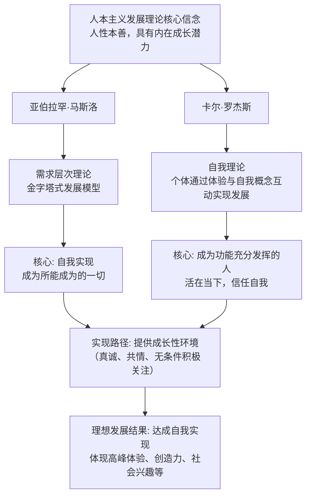

# Wiki
https://www.zgbk.com/ecph/words?SiteID=1&ID=34596&Type=bkzyb&SubID=49192

好的，非常乐意为您详细介绍一下人本主义的发展理论。
## 人本主义概述

人本主义心理学被称为“第三势力”，旨在反抗当时主导心理学界的行为主义（将人视为被环境塑造的机器）和精神分析（强调潜意识冲突和病态）。**人本主义的发展理论的核心是：人天生具有朝向健康、成长和自我实现的内在倾向；发展是一个主动的、主观的过程，其目标是成为一个“功能充分发挥的人”。**

为了更好地理解其全貌，我们首先通过以下图表梳理其核心框架与关键人物理论的联系：

接下来，我们深入解读图表中两位代表人物及其理论细节。

---

### 一、核心哲学基础与假设

在深入具体理论之前，首先要理解人本主义的几个基本假设，这些是所有相关发展理论的共同基石：

1.  **性善论**：人本性是善良的、值得信任的，具有一种内在的、先天的“善端”或成长潜力。破坏性的行为是这种内在天性被不良环境所扭曲的结果。
2.  **主观性与现象场**：每个人的行为都取决于他对自己和世界的主观感知和解释（即其“现象场”或“内心世界”）。要理解一个人，必须从他的主观参考框架出发，而不是从客观的、外部的视角。
3.  **整体人研究**：反对将人分解为刺激-反应或本我-自我-超我。强调研究“完整的个人”，认为人是不可分割的整体。
4.  **主动性与自由意志**：人不是被动地被本能或环境所驱动，而是主动的、有目的的、具有选择能力的个体。我们是自己生活的“建筑师”，而非“受害者”。
5.  **聚焦健康与成长**：研究的重点不是心理疾病或缺陷，而是健康的人、人生的积极面、人的尊严、价值、快乐和幸福感。

---

### 二、主要理论家及其发展理论

#### 1. 亚伯拉罕·马斯洛 (Abraham Maslow) - **需求层次理论**

马斯洛的理论提供了一个关于人类动机和发展的宏观框架，描述了从基本需求到高级心理需求的**渐进发展过程**。

*   **理论核心**：人类的需求像金字塔一样按层级排列，只有较低层次的需求得到**相当程度**的满足后，较高层次的需求才会成为主导动机和行为组织者。
*   **发展层级**（由低到高）：
    1.  **生理需求**：最基本的需求，如食物、水、空气、睡眠。这是婴儿期最主要的需求。
    2.  **安全需求**：对安全、稳定、秩序、免受恐惧和混乱的需要。在儿童身上表现为需要一个可预测、有秩序、公平的环境。
    3.  **归属与爱的需求**：对亲情、友情、爱情、社会归属感的需要。青少年时期开始变得极为突出。
    4.  **尊重需求**：包括自尊（如 competence, mastery）和他人的尊重（如 status, recognition）。此需求的满足带来自信和价值感。
    5.  **自我实现需求**：这是人本主义发展的最高目标。指**实现个人潜能、成为所能成为的一切**的欲望。其特征包括：**接纳现实和自我、高度自主性、高峰体验、深厚的人际关系、创造力、社会兴趣**等。

*   **发展观**：发展就是一个不断满足需求、向更高层次需求迈进的过程。**受阻的发展**源于基本需求的缺失（如缺乏安全或爱），会导致个体固着在低层次需求上，无法追求成长。**理想的发展**则提供了一个坚实的安全基础，让个体能勇敢地去探索、创造和实现自我。

#### 2. 卡尔·罗杰斯 (Carl Rogers) - **人格的自我理论**

罗杰斯的理论更侧重于个体“自我概念”是如何在发展过程中形成，并如何影响一个人的心理健康的。

*   **理论核心**：个体的行为取决于其独特的**现象场**（主观世界）。心理健康与否取决于个体的**自我概念**（即“我是谁”的看法）与他的**真实体验**是否一致。

*   **关键概念与发展过程**：
    *   **实现倾向**：这是一种与生俱来的、推动有机体发展和实现其潜能的**基本动机**。它是所有行为的根本动力。
    *   **自我概念的形成**：随着儿童与环境的互动（尤其是与“重要他人”如父母的互动），他开始从现象场中分化出一部分关于“我”的知觉，形成“自我概念”。
    *   **价值条件的产生**：这是发展的关键点。当父母只在孩子满足其期望（如“你要乖”、“你要考好成绩”）时才给予关爱和接纳时，孩子就会将这些**价值条件**内化。他会觉得“只有我做到XXX，我才是有价值的”。
    *   **自我概念与经验的冲突**：当一个人的体验（如“我感到很愤怒”）与他的自我概念（如“一个好人不应该生气”）不一致时，他就会体验到**焦虑**。为了防御这种焦虑，他可能会**扭曲或否认**自己的真实体验（如“我没有生气，我只是有点难过”）。
    *   **功能充分发挥的人**：这是发展的理想目标。这样的人**自我概念与经验是协调一致**的。他们更加开放地体验生活、信任自己的机体评价、具有高度的自由感和创造性。

*   **发展观**：健康发展的关键在于提供一个**无条件的积极关注**的成长环境。这样，个体就不需要内化价值条件，能够接纳自己的所有体验，自我概念就能不断根据真实体验灵活调整，从而实现真正的自我。

---

### 三、对人本主义发展理论的评价

*   **贡献**：
    1.  **积极的视角**：将心理学关注点从病态和缺陷转向了健康、成长和潜能，恢复了“人”在心理学中的核心地位。
    2.  **广泛的应用**：其理念深刻影响了**以人为中心疗法**、**教育**（学生中心教学）、**管理学**（Y理论）、**育儿观**（强调无条件的爱）等诸多领域。
    3.  **强调主观意义**：肯定了个人主观体验的重要性，这是一个不可或缺的研究视角。

*   **局限/批评**：
    1.  **概念模糊**：诸如“自我实现”、“实现倾向”等概念难以进行客观衡量和实证研究，显得有些抽象和主观。
    2.  **过于乐观**：对人性“本善”和自由意志的强调可能忽略了人的局限性、社会结构的巨大影响力以及潜意识动机的作用。
    3.  **文化局限性**：其强调个人主义、自我实现的观点更符合西方个体主义文化，在强调集体主义的文化中可能适用性不同。

### 总结

人本主义的发展理论为我们提供了一幅关于人类发展的、充满希望和人文关怀的图景。它告诉我们，**理想的发展并非仅仅是没有问题，而是积极地走向繁荣和自我实现**。其核心启示在于：**为个体（无论是孩子还是我们自己）提供一个充满真诚、共情和无条件积极关注的环境，是激发其内在成长潜力、最终走向健康与完满的关键。**