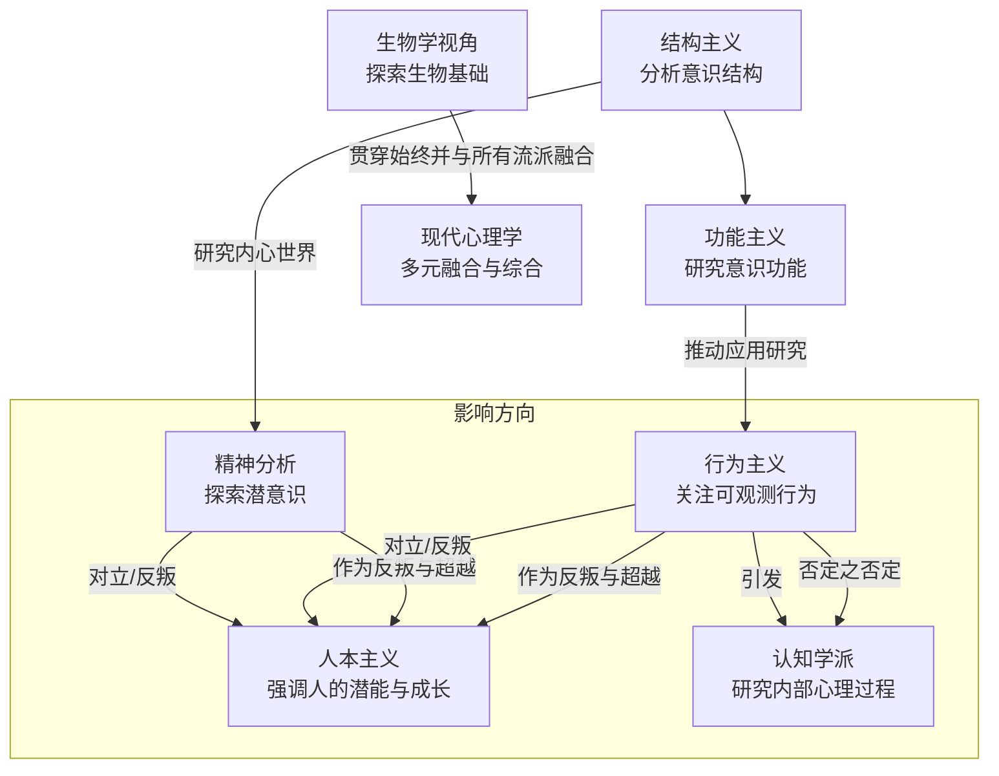
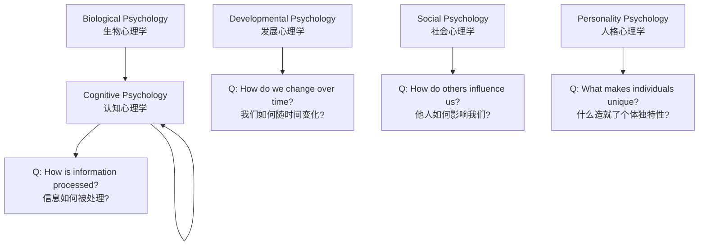
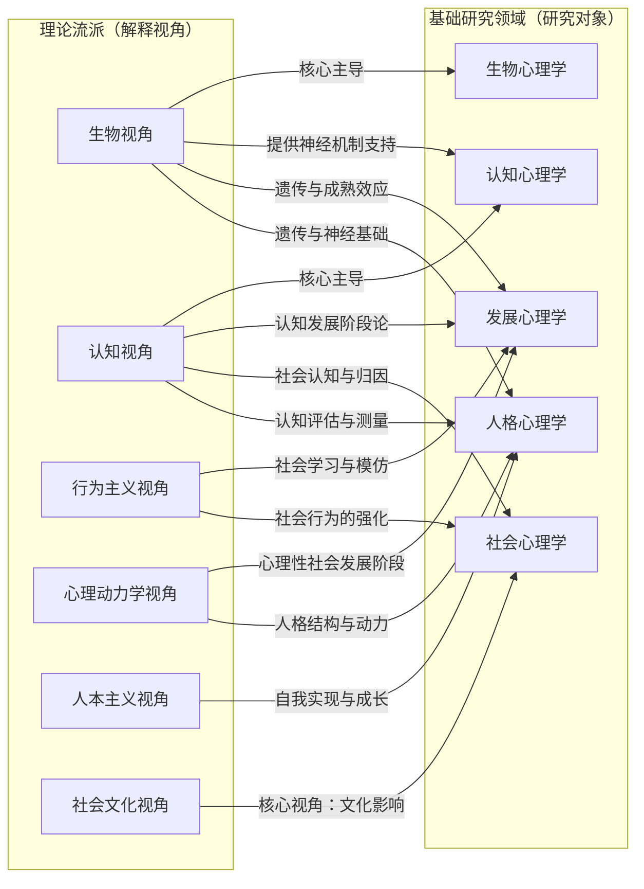

参考：

- 书
	- 经典的《心理学导论》或《普通心理学》教材（如菲利普·津巴多的《心理学与生活》）
	- 《心理学的故事》或《现代心理学史》这类书籍，理解思想是如何演变的。
- 解读
	- <a href="https://www.bilibili.com/read/readlist/rl880997?spm_id_from=333.1369.opus.module_collection.click">B 站一个精神分析专栏</a>

# 心理学图谱

可以将心理学想象成一棵大树：

*   **树根（哲学与生理学基础）**：心理学脱胎于哲学（对心灵、意识的思辨）和生理学（对大脑、神经的研究）。
*   **主干（主要流派）**：大树生长出的几个主要枝干，代表了理解心理和行为的不同视角和范式。
*   **枝叶（细分领域）**：从主干上分生出无数细小的分支，代表了心理学具体的研究和应用领域。

## 主要流派与历史发展

系统性地解释心理学的主要流派是理解这门学科演变和全貌的最佳方式。这些流派代表了心理学家如何理解心智、行为以及如何进行研究的不同视角和范式。

> [!note] 七大核心流派
> 结构主义、功能主义作为起源；精神分析、行为主义、人本主义三大传统势力；认知学派这一现代主流；以及生物心理学这一基础性视角。
> 重点在于各流派的**核心命题**、**代表性人物与方法**、**历史贡献与局限**，尤其是它们之间的**承袭或对抗关系**（例如行为主义如何反对精神分析，认知学派又如何否定行为主义）。

## 心理学主要流派系统解析

心理学作为一门独立学科，以 1879 年**威廉·冯特**（Wilhelm Wundt）在德国莱比锡建立第一个心理学实验室为标志。自此，不同的思想流派相继登场、争论、演变或融合。

---

### 起源

#### 🌱 1. 结构主义（Structuralism）

*   **时期**：约 19 世纪末 - 20 世纪初
*   **核心人物**：**威廉·冯特**、**爱德华·铁钦纳**（Edward Titchener）
*   **核心观点**：
    *   **目标**：通过分析意识体验的基本构成元素来理解心理结构。
    *   **方法**：主要使用**内省法**（Introspection），即训练有素的被试者报告自身在执行特定任务（如看一个苹果）时的直接体验（感觉、图像、情感）。
    *   **比喻**：就像化学家通过分析水得到 H₂O 一样，结构主义者试图通过分析意识得到其“心理元素”。
*   **贡献与局限**：
    *   **贡献**：确立了心理学作为一门独立实验科学的地位。
    *   **局限**：方法主观、不可靠（不同实验室的报告无法一致），且过于关注内部静态结构，忽视了心理的功能和实际应用。
*   **现状**：已消亡。但其强调的科学方法得以延续。

---

#### 🚀 2. 功能主义（Functionalism）

*   **时期**：约 19 世纪末 - 20 世纪初
*   **核心人物**：**威廉·詹姆斯**（William James）、**约翰·杜威**（John Dewey）
*   **核心观点**：
    *   **目标**：研究**意识的功能**——心理过程和行为如何帮助个体适应环境、生存和繁衍。
    *   **灵感**：深受**达尔文进化论**影响。
    *   **关注点**：关注的是“为什么”会思考，而不是“是什么”构成了思考。
*   **贡献与局限**：
    *   **贡献**：将心理学引向更具应用性的领域，如教育心理学、工业心理学。为后来的行为主义和应用心理学奠定了基础。
    *   **局限**：定义过于宽泛，未能形成一个统一、连贯的理论体系。
*   **现状**：作为一个学派已消失，但其思想已完全融入现代心理学的血脉中。

---

## 三大传统势力

### 🐭 3. 行为主义（Behaviorism）

*   **时期**：约 20 世纪初 - 1970 年代（ dominance period ）
*   **核心人物**：**约翰·华生**（John Watson）、**B.F.斯金纳**（B.F. Skinner）
*   **核心观点**：
    *   **目标**：心理学应该只研究**可观察和可测量的行为**，完全放弃对不可观测的“意识”和“内心过程”的研究。
    *   **核心公式**：**刺激（S） - 反应（R）**。行为是对环境刺激所作出的反应。
    *   **学习机制**：通过**经典条件反射**（巴甫洛夫）和**操作性条件反射**（斯金纳）来塑造行为。行为后果（强化和惩罚）决定了行为是否会重复发生。
*   **贡献与局限**：
    *   **贡献**：极大地提高了心理学的科学性和客观性，在行为矫正、教育、动物训练等领域产生了巨大应用价值。
    *   **局限**：过于机械，忽视了内在心理过程（思维、情绪、动机）、生物学因素和自由意志的存在。被称为“黑箱”理论（忽略大脑内部）。
*   **现状**：纯行为主义已过时，但其原理仍是学习理论、认知行为疗法（CBT）和应用行为分析（ABA）的重要组成部分。

---

### 🧠 4. 精神分析/心理动力学（Psychoanalysis/Psychodynamic）

*   **时期**：约 1890 年代 - 至今
*   **核心人物**：**西格蒙德·弗洛伊德**（Sigmund Freud）
*   **核心观点**：
    *   **目标**：探索**潜意识**（unconscious mind）如何支配行为和心理问题。
    *   **核心驱力**：性本能（力比多，Libido）和攻击本能是行为的内在动力。
    *   **关键概念**：**童年经历**、**梦的解析**（通往潜意识的康庄大道）、**防御机制**、**人格结构**（本我、自我、超我）。
*   **贡献与局限**：
    *   **贡献**：首次系统提出潜意识理论，强调童年经验的重要性，开创了谈话疗法。
    *   **局限**：理论基于个案研究，难以进行科学检验（不可证伪）；观点过于悲观，泛性论色彩浓厚。
*   **现状**：经典弗洛伊德理论已很少被直接使用，但演变为更现代的**心理动力学理论**，影响力主要集中在临床实践和文化研究领域。

---

### 🙌 5. 人本主义（Humanistic Psychology）

*   **时期**：约 1950 年代 - 至今
*   **核心人物**：**亚伯拉罕·马斯洛**（Abraham Maslow）、**卡尔·罗杰斯**（Carl Rogers）
*   **核心观点**：
    *   **目标**：关注人的**积极品质**、**成长潜能**和**自我实现**的需求。被称为“第三势力”（对抗行为主义和精神分析）。
    *   **核心概念**：**马斯洛需求层次理论**、**自我实现**、**罗杰斯的“以人为中心疗法”**（强调无条件的积极关注、共情和真诚）。
    *   **视角**：人是积极主动的、具有主观体验的个体，而非被本能驱使或环境塑造的机器。
*   **贡献与局限**：
    *   **贡献**：为心理学注入了积极的视角，开创了现代心理治疗中尊重、共情的治疗关系模式。
    *   **局限**：概念较为抽象和模糊，难以进行科学研究和量化。
*   **现状**：其思想深深影响了当代心理咨询、教育和管理学。

---

## 现代主张和基础视角

### 💻 6. 认知学派（Cognitive Psychology）

*   **时期**：约 1960 年代 - 至今（当前主流）
*   **核心人物**：**乌尔里克·奈瑟**（Ulric Neisser）、**让·皮亚杰**（Jean Piaget）
*   **核心观点**：
    *   **目标**：科学地研究**内部心理过程**，如注意、记忆、思维、语言、决策等。
    *   **核心隐喻**：**心智如同计算机**（信息加工模型）。研究信息如何被输入、编码、存储和输出。
    *   **方法**：采用严格的实验方法来推断内部心理过程。
*   **贡献与局限**：
    *   **贡献**：将“心智”重新带回心理学的合法研究领域，并使其研究科学化。与神经科学结合，诞生了**认知神经科学**。
    *   **局限**：计算机隐喻可能过于简化人脑的复杂性。
*   **现状**：当今心理学的主导力量，与生物学、神经科学、语言学、计算机科学（人工智能）深度融合。

---

### 🧬 7. 生物学视角/神经科学（Biological Perspective / Neuroscience）

*   **时期**：持续发展，近几十年尤为突出
*   **核心观点**：
    *   **目标**：从生物学的角度（**基因、大脑结构、神经化学、内分泌系统**）来理解行为和心理过程。
    *   **核心前提**：所有思想、情感和行为都有其生理基础。
*   **研究方法**：fMRI、PET、EEG 等脑成像技术，双生子研究，基因研究等。
*   **贡献**：为许多心理现象（如情绪、记忆、精神疾病）提供了坚实的生物学解释，是当代心理学不可或缺的基础。

---

## 总结与关系脉络

为了更直观地理解这些流派的关系和演进，我们可以参考下面的图表，它展示了心理学思想从结构主义到现代多元融合的发展主线，以及各流派之间的承袭、对立与融合关系。

现代心理学已不再是某个流派一统天下，而是进入了**整合与折衷**的时代。大多数心理学家采取**折衷主义**，不再严格属于某一学派，而是根据所研究的问题，从不同流派中汲取最合适的观点和方法。例如，一位临床心理学家可能会同时使用：

*   **认知学派**的技术（改变患者的非理性思维）
*   **行为主义**的技术（通过暴露疗法改变行为）
*   **心理动力学**的视角（理解早期关系模式）
*   **生物学**的知识（考虑药物治疗的必要性）

这种多元视角使得现代心理学对人类行为的理解变得更加全面、深刻和有效。

# 心理学的主要“枝叶”（研究与应用领域）

这是心理学最丰富多彩的部分，展现了它与现实世界的紧密联系。

*   **基础研究领域（探索规律）**：
    *   **发展心理学**：研究人从出生到死亡全过程的心理发展（如皮亚杰的认知发展理论）。
    *   **社会心理学**：研究个体在社会群体中的思想、情感和行为（如从众、偏见、人际吸引）。
    *   **认知心理学**：研究基础心理过程（注意、记忆、推理等）。
    *   **人格心理学**：研究构成个体独特性的稳定特质和模式。
    *   **生理心理学/神经科学**：研究行为和心理过程的生物学基础（大脑、神经、基因）。

*   **应用领域（解决问题）**：
    *   **临床与咨询心理学**：**诊断和治疗**心理障碍（如抑郁症、焦虑症），以及帮助人们应对生活挑战（这是精神分析疗法主要应用的领域）。
    *   **教育心理学**：研究如何改进教学和学习过程。
    *   **工业与组织心理学**：应用于职场，研究员工招聘、激励、领导力、团队建设等。
    *   **健康心理学**：研究心理、行为与社会因素如何影响健康和疾病。

# 心理学的科学方法

这是区分现代心理学与早期哲学思辨或弗洛伊德理论的关键。心理学是一门**科学**，其结论建立在**证据**之上。

*   **核心方法**：**实验法**（操纵变量以确定因果关系）、**相关研究**（探明变量间的关系）、**个案研究**（深度分析个体）、**调查法**等。
*   **可证伪性**：科学理论必须能够被证明是错误的。这也是精神分析备受争议的一点，其理论往往难以通过科学实验进行验证或证伪。

 **批判性思维**：始终问自己：这个理论的证据是什么？它的局限性在哪里？有没有其他理论可以解释同样的问题？

# 分类与流派

简单来说，**“分类”和“流派”是两种不同但互补的组织框架**：

*   **分类（领域）** 回答的是 **“我们研究什么？”**，像是地图上的不同国家和地区。
*   **流派（视角）** 回答的是 **“我们如何解释它？”**，像是查看这片土地时使用的不同滤镜（如地形图、气候图、人口分布图）。

---

## 一、 心理学的分类（按研究领域划分）

这是最常用、最直观的分类方式，基于研究的**主题和内容**。通常分为两大块：**基础研究领域**和**应用领域**。

### 1. 基础研究领域（探索普遍规律）

这些领域旨在发现和理解人类心理与行为背后的基本机制和原理。

*   **认知心理学**：研究基本心理过程，如注意、记忆、思维、语言、决策等。
*   **发展心理学**：研究人从出生到死亡一生中心理和行为的发生、发展及变化规律。
*   **社会心理学**：研究个体的思想、情感和行为如何受到他人真实或想象的存在的影响。
*   **人格心理学**：研究构成个体独特性的稳定特质和行为模式。
*   **生物心理学/生理心理学**：研究行为和心理过程的生物学基础，包括大脑、神经系统、内分泌系统和基因。
*   **异常心理学**：研究心理障碍的起源、症状、发展和治疗。

### 2. 应用领域（解决实际问题）

这些领域将心理学的基础知识应用于解决现实世界中的具体问题。

*   **临床与咨询心理学**：**评估、诊断和治疗**心理障碍（临床），并帮助人们应对生活挑战、促进个人发展（咨询）。
*   **教育心理学**：研究如何改进教学、学习和教育评估过程。
*   **工业与组织心理学**：应用于工作场所，研究员工招聘、培训、激励、领导力、组织文化等。
*   **健康心理学**：研究心理、行为和社会因素如何影响身体健康和疾病。
*   **司法/犯罪心理学**：应用于法律体系，研究罪犯心理、证人证词、陪审团决策等。

---

## 二、 心理学的理论流派（按解释视角划分）

流派提供了解释心理和行为现象的**不同视角和理论框架**。同一个现象，不同流派会给出截然不同的解释。

### 主要流派回顾与新增

1.  **生物视角**：从基因、大脑、神经递质等生理层面解释行为。
2.  **行为主义视角**：从环境刺激、强化和惩罚等外部因素解释行为。
3.  **心理动力学视角**：从潜意识动力、童年经历和内心冲突解释行为。
4.  **人本主义视角**：从人的成长潜能、自由意志和自我实现的需求解释行为。
5.  **认知视角**：从信息加工、思维、信念等内部心理过程解释行为。
6.  **进化论视角**：从心理特质和行为模式在进化过程中的适应功能来解释（如：为什么人类普遍恐高？因为这对生存有利）。
7.  **社会文化视角**：从文化、社会规范、家庭背景等宏观环境因素解释行为。

---

## 基础领域

好的，完全理解。我们将暂时抛开理论流派的视角，专注于各个基础研究领域本身的历史脉络、核心内容和核心理念。这将帮助您更清晰地构建起心理学知识体系的骨架。

以下是心理学五大基础研究领域的详细解读。

---

### 1. 生物心理学 (Biological Psychology)

*   **发展简史**：
    * 其哲学根源可追溯至**心身问题**的争论。
    *   19 世纪，**颅相学**（虽然错误）促进了大脑功能定位的思想。
    * 真正的发展始于 20 世纪中叶以后，随着**神经科学**技术的突飞猛进（如脑电图 EEG、计算机断层扫描 CT、磁共振成像 MRI、正电子发射断层扫描 PET），使得科学家能够直接在活体大脑上观察结构与功能的关系。

*   **主要内容**：
    *   **神经系统的结构与功能**：研究神经元、神经递质、突触如何传递信息。
    *   **脑功能定位**：探索大脑不同区域（如布洛卡区、威尔尼克区、海马体、杏仁核、前额叶皮层）与特定行为、认知和情绪的关系。
    *   **内分泌系统**：研究激素（如肾上腺素、皮质醇、性激素）如何影响行为和情绪。
    *   **行为遗传学**：通过双生子和领养研究，探讨遗传基因对心理特质（如智力、人格、精神疾病易感性）的贡献程度。

*   **核心理念**：
    *   **一切心理现象都有其生理基础**。思维、情绪、意识乃至精神疾病，最终都可以在大脑和身体的生理过程中找到对应。
    * 人是一个**生物实体**，其行为和心理过程受到严格的生物学规律制约。

---

### 2. 认知心理学 (Cognitive Psychology)

*   **发展简史**：
    *   20 世纪上半叶，**行为主义**占据主导，拒绝研究内部心理过程。
    *   20 世纪 50 年代，计算机科学的兴起提供了“**信息加工**”这一核心隐喻。
    *   **乔姆斯基**对斯金纳语言习得理论的批判，以及**注意、记忆**等领域的研究发现，都表明单纯的行为主义模型无法解释复杂的人类认知。
    *   1956 年被认为是“认知革命”的元年，1967 年**乌尔里克·奈瑟**的《认知心理学》出版，标志着该领域正式确立。

*   **主要内容**：
    *   **注意**：我们如何选择和处理海量信息中的一部分。
    *   **记忆**：信息的编码、存储和提取（如感觉记忆、工作记忆、长时记忆）。
    *   **知识表征**：信息在头脑中的组织形式（如概念、图式、心理表象）。
    *   **语言**：语言的产生、理解和获得。
    *   **问题解决与决策**：我们如何推理、制定策略并做出判断（常涉及启发式和偏见）。
    *   **元认知**：对自身认知过程的认知和监控。

*   **核心理念**：
    *   **人是一个主动的信息加工者**。心智并非被动地对刺激作出反应，而是主动地选择、解释、存储和利用信息。
    * 可以通过**科学实验**（而非内省）来研究不可直接观察的内部心理过程，并通过构建**模型**来描绘这些过程。

---

### 3. 发展心理学 (Developmental Psychology)

*   **发展简史**：
    *   **达尔文**的进化论强调发展的重要性。
    *   20 世纪初，**格塞尔**提出了成熟势力说。
    *   **皮亚杰**（Jean Piaget）基于对儿童的细致观察，提出了革命性的**认知发展阶段理论**，成为该领域的巨人。
    * 后来者如**维果茨基**强调社会文化的作用，**埃里克森**提出了心理社会发展阶段理论，**鲍尔比**提出了依恋理论，不断丰富和完善该领域。

*   **主要内容**：
    *   **生理发展**：大脑、身体和运动技能的成熟变化。
    *   **认知发展**：思维、推理、问题解决和记忆能力随年龄的增长变化（皮亚杰的感知运动期、前运算期、具体运算期、形式运算期）。
    *   **社会性发展**：理解他人、与他人互动、形成关系的能力发展（如依恋、观点采择、道德推理）。
    *   **情绪发展**：情绪识别、表达和调节能力的发展。
    * 研究贯穿**整个生命周期**，从产前、婴儿、儿童、青少年到成年中期和晚期（老龄化）。

*   **核心理念**：
    *   **人是发展的存在**。从出生到死亡，个体在生理、认知和社会性方面持续经历着有规律的变化。
    * 发展是**遗传（天性）与环境（教养）** 复杂相互作用的结果。
    * 发展既包含**量变**（知识的积累），也包含**质变**（思维阶段的飞跃）。

---

### 4. 社会心理学 (Social Psychology)

*   **发展简史**：
    *   19 世纪末，早期学者如**Triplett**研究了社会促进现象。
    * 二战期间，对法西斯主义、偏见和从众的研究极大地刺激了该领域的发展。
    *   20 世纪 50-70 年代是“黄金时代”，涌现了大量经典实验：**阿希**的从众实验、**米尔格拉姆**的服从实验、**费斯廷格**的认知失调理论、**津巴多**的斯坦福监狱实验等。
    * 近年来，更加关注**社会认知**（如何思考社会世界）和**文化**的影响。

*   **主要内容**：
    *   **社会认知**：我们如何感知、解释和记忆有关他人和社会世界的信息（包括刻板印象、归因）。
    *   **社会影响**：他人如何影响我们的行为、态度和信念（如从众、服从、说服）。
    *   **群体过程**：个体在群体中的行为与单独时有何不同（如社会惰化、去个性化、群体极化）。
    *   **人际关系**：喜欢、爱、攻击性、利他主义、合作与竞争。
    *   **态度**：态度的形成、改变及其与行为的关系。

*   **核心理念**：
    *   **个体的行为深受其社会环境影响**。个人的思想、感受和行为不仅源于其内部特质，更受到他人真实、想象或隐含的存在的影响。
    *   **情境的力量**是巨大且常常被低估的。

---

### 5. 人格心理学 (Personality Psychology)

*   **发展简史**：
    * 早期由**弗洛伊德**的精神分析理论主导，强调潜意识动力。
    *   20 世纪中期，**人本主义**（马斯洛、罗杰斯）作为反叛出现，强调成长与自我实现。
    * 同时期，**特质流派**兴起（**奥尔波特**、**卡特尔**），试图用科学方法寻找人格的基本维度。
    *   20 世纪 80-90 年代，**“大五”人格模型**（OCEAN）得到广泛认可，成为特质流派的集大成者。
    * 近年来，更注重**人格与情境的交互作用**以及**生物基础**。

*   **主要内容**：
    *   **人格结构**：人格由哪些基本单元构成？（如特质、类型、动机）。
    *   **人格动力**：是什么激发了人的行为？是什么导致了内心的冲突？（如潜意识欲望、追求优越、自我实现）。
    *   **人格发展**：人格是如何形成的？是稳定还是变化的？（遗传、环境、童年经验的作用）。
    *   **人格评估**：如何科学地测量人格？（自陈量表、投射测验、行为观察）。

*   **核心理念**：
    *   **个体之间存在稳定且可测量的差异**。这些差异构成了每个人独特的行为模式和思维方式。
    * 旨在揭示**人之所以为人**的完整图景，描述和解释**整个人**（the whole person）的复杂性。

### 总结：五大领域的核心理念图谱

这五大领域共同构建了一个理解人性的完整框架，每一领域都聚焦于一个核心的元问题：

这个图谱表明，要全面理解任何一个人及其行为，都需要综合这五个领域的知识：我们有一套独特的**生物硬件**（生物），它以一种特定的方式**处理信息**（认知），这套系统从出生起就在**持续发展和变化**（发展），无时无刻不**与他人和社会互动**（社会），并最终呈现出**稳定的个人风格和差异**（人格）。

## 三、 归属关系：分类与流派的矩阵模型

**这是最关键的部分**。分类（领域）和流派（视角）并非一一对应，而是形成了一个复杂的**矩阵**。**任何一个研究领域，都可以用多个流派的视角来研究和解释。**

好的，这是一个非常深入且精彩的问题。我们将详细解析心理学的基础研究领域，并重点阐述每个领域的内容是如何被不同理论流派的视角所塑造和解释的。

### 心理学基础研究领域与理论流派的交织

首先，我们必须明确一个核心概念：**一个研究领域（研究什么）和解释它的理论视角（如何解释）是分离的。** 同一个现象，不同流派会提供截然不同但可能互补的解释。现代心理学家的主要工作就是根据问题，选择合适的视角或进行整合。

以下是各个基础研究领域的详细说明及其与理论流派的对应关系。

---

#### 1. 生物心理学 (Biological Psychology) / 生理心理学 (Physiological Psychology)

*   **核心内容**：研究行为和心理过程的生物学基础。关注**大脑结构**、**神经系统**（神经元、神经递质）、**内分泌系统**（激素）和**遗传基因**如何共同作用，产生思想、情绪和行为。
*   **关键课题**：感觉与知觉的神经机制、学习和记忆的脑基础（如海马体）、情绪的生理学（如杏仁核）、动机的生物学（如下丘脑）、精神疾病的神经化学基础等。
*   **对应理论流派的依据**：
    *   **生物视角 (Biological Perspective)**：这是该领域的**核心和主导视角**。其依据是“所有心理现象都有其生理基础”这一基本假设。例如，它用“血清素水平低”来解释抑郁症，用“杏仁核过度活跃”来解释焦虑症，用“镜像神经元系统”来解释共情能力。
    *   **进化心理学 (Evolutionary Perspective)**：这是生物视角的自然延伸。它试图用**自然选择**的原理来解释心理机制和行为模式。其依据是：大脑和心智也是进化的产物，那些能增加我们祖先生存和繁殖机会的行为倾向（如恐高、偏好高热量食物、择偶策略）会被保留下来。例如，用“亲代投资理论”解释两性在择偶上的差异。

---

#### 2. 认知心理学 (Cognitive Psychology)

*   **核心内容**：研究**内部心理过程**，包括注意、记忆、思维、语言、决策、问题解决和创造力。其核心隐喻是“**心智如同信息加工系统**”（类似计算机）。
*   **关键课题**：记忆的三级模型（感觉记忆、短时记忆、长时记忆）、工作记忆、记忆扭曲、启发式与偏见、语言 acquisition、元认知等。
*   **对应理论流派的依据**：
    *   **认知视角 (Cognitive Perspective)**：这是该领域的**创立基础和核心视角**。它兴起于对行为主义的反叛，其依据是：要彻底理解行为，**必须**研究隐藏在其下的内部心理过程。它通过精心设计的实验来推断这些过程。
    *   **计算机科学/人工智能**：虽非严格心理学流派，但提供了至关重要的**方法论依据**和**理论模型**（信息输入、编码、存储、输出）。
    *   **生物视角**：现代认知心理学与神经科学结合，形成了**认知神经科学 (Cognitive Neuroscience)**，利用 fMRI 等技术寻找认知过程的脑区定位，为其提供生物学依据。

---

#### 3. 发展心理学 (Developmental Psychology)

*   **核心内容**：研究个体从**受精卵到死亡**的全过程中，心理和行为随年龄增长而发生的变化规律及其影响因素。关注连续性（量变）和非连续性（阶段性质变）。
*   **关键课题**：皮亚杰的认知发展阶段、依恋理论、道德发展、语言发展、青春期自我认同、成年期及老龄化问题。
*   **对应理论流派的依据**：
    *   **认知视角**：**皮亚杰 (Piaget)** 的理论是典范，将儿童思维发展划分为不同的认知阶段（感觉运动期、前运算期等）。
    *   **行为主义视角**：**班杜拉 (Bandura)** 的**社会学习理论**强调观察和模仿（替代性强化）在发展中的作用，如儿童如何通过观察父母学习性别角色。
    *   **心理动力学视角**：**弗洛伊德**和**埃里克森 (Erikson)** 都提出了心理社会发展阶段理论，强调童年早期经验（如口欲期、信任感）对人格的终生影响。
    *   **生物视角**：关注**遗传**和**成熟**对发展的制约作用（如青春期启动的生物学时间表），以及大脑发育（如前额叶皮层成熟较晚）与认知控制能力发展的关系。

---

#### 4. 社会心理学 (Social Psychology)

*   **核心内容**：研究个体的**思想、情感和行为如何受到他人真实、想象或隐含的存在的影响**。关注个体与社会环境之间的相互作用。
*   **关键课题**：从众、服从、态度与说服、偏见与歧视、人际吸引、亲社会行为、攻击性、群体动力学（社会惰化、去个性化）。
*   **对应理论流派的依据**：
    *   **社会文化视角 (Sociocultural Perspective)**：这是最核心的视角之一。其依据是：人的行为深受其所属的**文化、社会规范、家庭背景和社会身份**的影响。例如，研究集体主义文化 vs. 个人主义文化下自我概念的差异。
    *   **认知视角**：用认知原理解释社会现象。例如，用**图式**（如“刻板印象”）来解释偏见；用**归因理论**来解释我们如何解释自己和他人的行为（内归因 vs. 外归因）。
    *   **行为主义视角**：关注社会行为如何被**奖励和惩罚**所塑造。例如，一个孩子可能因为模仿父母的性别歧视言论得到同伴的认可（强化），从而习得该行为。
    *   **进化视角**：尝试用进化适应来解释某些社会行为。例如，用“互惠利他主义”理论来解释为什么我们愿意帮助无亲缘关系的人。

---

#### 5. 人格心理学 (Personality Psychology)

*   **核心内容**：研究构成个体独特性的、相对稳定的**行为模式、内在倾向（特质）和动力机制**。旨在描述人格结构并揭示其成因。
*   **关键课题**：特质理论（大五人格）、类型论、心理动力学人格理论（本我自我超我）、人本主义理论（自我实现）、人格评估（问卷、投射测验）。
*   **对应理论流派的依据**：
    *   **特质视角 (Trait Perspective)**：关注识别和描述构成人格的基本维度（如大五人格：开放性、尽责性、外倾性、宜人性、神经质）。其依据是**心理测量学**和**因素分析**，试图用科学量表量化人格。
    *   **心理动力学视角**：提供了一种**解释人格动力和结构**的依据，强调潜意识冲突、童年经验和防御机制在塑造人格中的作用。
    *   **人本主义视角**：提供了一种**乐观的、成长导向的**人格观点，认为人格是趋向自我实现的动态过程，强调自由意志和主观体验。
    *   **生物视角**：为人格的稳定性提供了**遗传学和生理学**依据。例如，研究发现外倾性和神经质等特质具有较高的遗传力，并与大脑基线活动水平、神经递质有关。

### 总结与可视化

为了更清晰地展现这五大基础研究领域与六大理论流派之间错综复杂的对应关系，下图提供了一个矩阵式的总结。它可以帮您直观地看到，每个研究领域是如何被多种理论视角共同支撑和解释的。

这个矩阵清晰地表明，心理学不是一个由单一真理构成的学科，而是一个**多元的、整合的科学**。对任何一个心理现象（如攻击行为、记忆遗忘、人格形成）的完整理解，往往需要从**生物、行为、认知、发展、社会文化**等多个层面进行综合分析。这种多视角的碰撞与融合，正是心理学最迷人、最富有生命力的地方。

## 总结关系图

因此，现代心理学家的特点是**折衷主义**：他们不再纯粹属于某一流派，而是根据具体问题，从各个流派中汲取最有效的观点和方法，形成一个全面、多维的理解。
