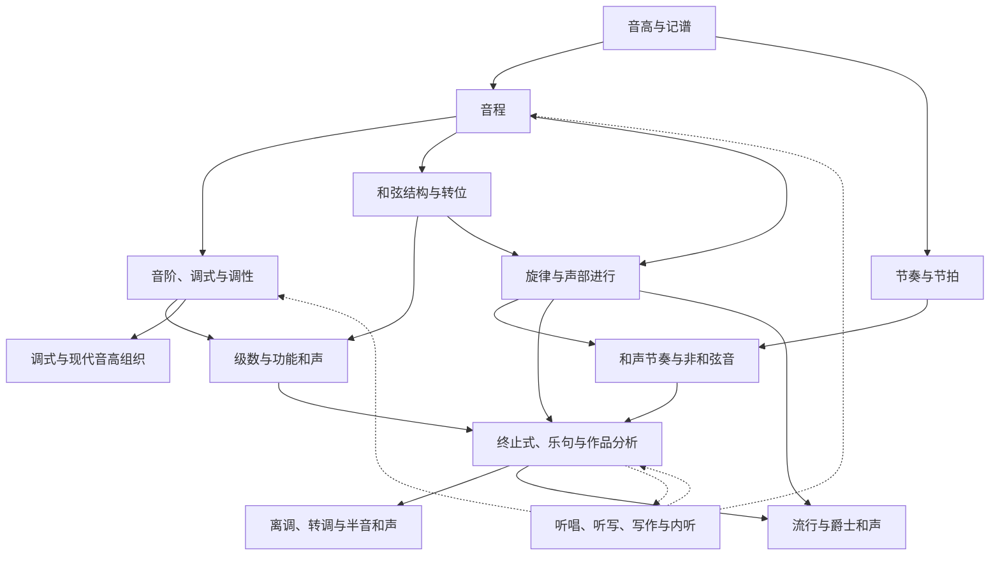

<a href="https://renahah.github.io/%E9%9F%B3%E4%B9%90/%E4%B9%90%E7%90%86/%E4%B9%90%E7%90%86%E7%AC%94%E8%AE%B006-%E9%9F%B3%E7%A8%8B/">renahah 个人笔记 </a>

符号：𝄞 ♯ ♭♮

系统学习入口：[[#乐理与和声知识地图|知识地图与概念关系]] · [[#乐理、和声与视唱练耳学习规划|学习规划与练习安排]]。

# ABC Notation

乐谱使用 ABC 表示

<a href=" https://paulrosen.github.io/abcjs/overview/abc-notation.html">abc-notation 的插件</a>

<a href=" https://abcnotation.com/" >abc notation 官方网站</a>

<a href=" https://abcnotation.com/wiki/abc:standard:v2.1#qtempo">abc standard</a>

## Tutorial

<a href=" https://trillian.mit.edu/~jc/music/abc/doc/ABC.html">MIT tutorial</a>

<a href="http://www.lesession.co.uk/abc/abc_notation.htm">tutorial by S.M.</a>

```music-abc
K: G
M: 4/4
L: 1/4
"C"[CEG], D, E,C | DEFG | ABcd| efga | b
```

## 示例

```music-abc
X:1
T:The Legacy Jig
M:6/8
L:1/8
R:jig
K:G
GFG BAB | gfg gab | GFG BAB | d2A AFD |
GFG BAB | gfg gab | age edB |1 dBA AFD :|2 dBA ABd |:
efe edB | dBA ABd | efe edB | gdB ABd |
efe edB | d2d def | gfe edB |1 dBA ABd :|2 dBA AFD |]
```

```music-abc
X: 1
T: Chorus
V: T1 clef=treble name="Soprano"
V: T2 clef=treble name="Alto"
V: B1 clef=bass name="Tenor"
V: B2 clef=bass name="Bass"
L:1/8
K:G
P:First Part
[V: T1]"C"ed"Am"ed "F"cd"G7"gf |
[V: T2]GGAA- A2BB |
[V: B1]C3D- DF,3 |
[V: B2]C,2A,,2 F,,2G,,2 |
```

`{"instrument": "violin"}`

```music-abc
{
  "tablature": []
}
---
X:1
T: Cooley's
M: 4/4
L: 1/8
R: reel
K: G
|:D2|EB{c}BA B2 EB|~B2 AB dBAG|FDAD BDAD|FDAD dAFD|
```

# 音程

音程，即**音与音的音高距离**，如半音、全音都是音程。

## 度数

两个音，**忽略音名升降号，只看音名的字母**，从低音到高音数有几个字母，就称几度。

如 E4 到 A4 经过了 E4, F4, G4, A4 四个字母，就称 E4 到 A4 有四度；

再如 E4♭到 A4♯，去掉升降号为 E4 与 A4，仍然经过 E4, F4, G4, A4 四个字母，故 E4♭到 A4♯ 也是四度。

## 音数

表示两个音之间有多少个全音与半音。一个全音的音数为 1，一个半音的音数为 0.5，两个音的音数等于其间隔的 $全音数 \times 1+ 半音数 \times0.5$。

换一种说法，音数等于两个音之间的 $键数距离 \times 0.5$，这里的键包括白键与黑键。如 E4 到 A4 间有一个半音 (E4->F4) 与两个全音 (F4->G4,G4->A4)，故 E4 到 A4 的音数为 2.5。也可以数两个键的距离，E4->F4->F4♯->G4->G4♯->A4，显然 E4 到 A4 间是五个半音的距离，音数为 2.5。

### 全音与半音

所有音数为 0.5 的音程（增一度、小二度、倍减三度）都是半音，所有音数为 1 的音程（减三度、大二度、倍增一度）都是全音。

## 音程总结表


注意，**E-F/B-C** 之间是半音。所以，不包含升降号的情况下，根据是否包含二者：二三度，包含一个的为小，不包含为大；四度，包含一个，为纯，都不包含为增；五度，包含一个，为纯，都包含，为减；六七度，包含一个，为大，都包含为小。

超过八度的音程，先确定两个音的度数，再将两个音放在八度以内，判断八度以内的音程，来确定音程度数前面的前缀。

### 等音程

音数相等的音程被称作等音程。如减三度、大二度、倍增一度互为等音程，它们的音数都是 1。

### 三全音

所有音数为 3 的音程（倍增三度、增四度、减五度、倍减六度）都是三全音，倍增与倍减的情况较为罕见，因此三全音通常指的是增四度或减五度。

三全音的听觉感受极不协和。

### 音程名字的简写

主要的音程前缀有——**大 (Major)、小 (minor,m 为小写)、增 (Augmented)、减 (Diminished)、纯 (Perfect 或 Pure)**。（倍增与倍减不常见）

简写时就采用前缀首字母 + 数字的形式，如大三度记为 M3，小七度记为 m7，增五度记为 A5。

亦可用 Major 与 minor 形容调式，如 C 大调记为 C Major，D 小调记为 D minor。

## 其他音程定义

### 根音与冠音

两个音中的低音是根音，高音是冠音。如 E4 与 A4 中的 E4 是根音，A4 是冠音。

### 旋律音程与和声音程

两个音先后弹奏时，称为旋律音程。

两个音同时弹奏时，称为和声音程。

### 自然音程与变化音程

在“自然大小调音阶”里直接存在的音程称为自然音程。**可以由两个白键形成的音程**（不需要两个是白键）称为自然音程。在“自然大小调音阶”里不存在的音程称为变化音程，要通过临时升降音产生变化而形成。自然音程之外的音程称为变化音程。

如 C4♯到 F4♯是纯四度，C4♯与 F4♯形成的是自然音程。再如 C4 到 A4♯是增六度，增六度不是能由两个白键形成的音程，因此 C4 到 A4♯形成的是变化音程。

超过八度的音程，将两个音放在八度以内，判断八度以内的音程从而判断其是自然音程还是变化音程。

### 协和音程与不协和音程

协和音程分为三种：

1. 极完全协和音程——纯一度、纯八度…纯 ($1+7n$) 度（n 为整数且 $n≥0$）
2. 完全协和音程——纯四度、纯五度…纯 ( $4 或 5+7n$) 度（n 为整数且 $n>=0$）
3. 不完全协和音程——大三度、小三度、大六度、小六度…大或小 (3 或 6+7n) 度（n 为整数且 n≥0）

协和音程之外的音程称为不协和音程：

- 大二度、小二度、大七度、小七度…大或小 (2 或 7+7n) 度（n 为整数且 n≥0）
- 所有增音程、减音程、倍增音程、倍减音程。

C4 到 A4♭是小六度，是不完全协和音程，而 C4 到 G4♯是增五度，是不协和音程。虽然 A4 &#x266F ♭与 G4♯ 是等音，小六度与增五度是等音程，C4 到 A4♭与 C4 到 G4♯在弹奏时的音高完全相同，但它们所处的音乐语境不同，即在一段连续的音乐中，通过与其他声音，其他和弦，其他音程的对比，所体现出的协和程度是不一样的。

### 音程转位

音程转位通常通过将低音升高八度，或将高音降低八度，交换两音的上下位置。例如 C4–E4 转为 E4–C5，或转为 E3–C4，大三度变成小六度。讨论复音程时，先化为对应的单音程，再使用八度内的转位关系。

在这种标准的八度内转位中，前后度数之和为 9；性质对应为大↔小、纯↔纯、增↔减、倍增↔倍减。因此纯一度与纯八度互为转位，纯四度与纯五度互为转位，大二度与小七度互为转位。

转位按记谱的字母与升降号关系判断，不能额外要求两个音在十二平均律下必须具有不同的实际音高。例如 D♭4–C♯5 是增七度，转位 C♯5–D♭5 是减二度；后两个音在十二平均律下等音，仍不改变其记谱音程名称。C4–F𝄪4 是倍增四度，转位 F𝄪4–C5 为倍减五度。

协和性还要结合风格及声部位置判断，不能一概说转位后完全不变。例如在传统对位和和声写作中，低音上方的纯四度常按不协和音程处理，其转位纯五度则通常视为协和。[音程转位与协和性](https://viva.pressbooks.pub/openmusictheory/chapter/intervals/)

# 和弦

## 和弦

三个音或者三个以上的音构成的集体称为和弦。在特定风格或条件下，有些和弦会规律性地省略自己内部的一些音，导致这些和弦看上去只有 1 或 2 个音。

## 和声

和声指不同的和弦组合、连接、运用方式、细节处理等。强调不同和弦连接而形成的整体。

## 三和弦

三个不同的音能够按三度叠置组织起来，形成三和弦。在原位三度叠置的排列中，三个音由低到高分别为根音、三音与五音；转位或重新配置后，它们的实际高低顺序可以改变。

### 大三和弦与小三和弦

根音到三音是大三度，三音到五音是小三度，称为大三和弦（大 + 小）。听起来通常感觉明亮、温馨。

根音到三音是小三度，三音到五音是大三度，称为小三和弦（小 + 大）。听起来通常感觉暗淡、忧伤。

大三和弦与小三和弦的根音到五音是纯五度，是协和音程，听起来顺耳。

### 增三和弦与减三和弦

根音到三音是大三度，三音到五音是大三度，称为增三和弦（大 + 大）。

根音到三音是小三度，三音到五音是小三度，称为减三和弦（小 + 小）。

增三和弦与减三和弦的根音到五音是增五度/减五度，是不协和音程，听起来紧张、压抑。

增、减三和弦的连接需要结合调性与各音的声部进行判断。和弦内部某个增、减音程的解决方向，不等于整个和弦有唯一的后续连接；“大六度”等音程名称也不能直接当作下一和弦的名称。

### 三和弦的转位

三和弦的第一转位，指将原位的根音提高八度，三音与五音保持不变。所得和弦低音（三音）与根音的距离是六度，故又称为六和弦。

三和弦的第二转位，指将原位的根音与三音提高八度，五音保持不变。所得和弦低音（五音）与根音的距离是四度，低音（五音）与三音的距离是六度，故又称为四六和弦。

注意转位后音高最低的音（低音）不是根音。

如图为大三和弦的转位，小三和弦、增三和弦、减三和弦同理，其转位后的名称前缀与原位三和弦的前缀相同。

```music-abc
L: 1
"原位"[CEG] "第一转位"[EGc] "第二转位"[Gce]
```

## 七和弦

四个不同的音能够按三度叠置组织起来，形成七和弦。在原位三度叠置的排列中，四个音由低到高分别为根音、三音、五音、七音；根音到七音为七度。转位或重新配置不改变各音相对于根音的身份。

### 七和弦的命名规则

七和弦名字前有两个前缀，第一个前缀与其根音、三音、五音形成的三和弦前缀相同，第二个前缀与其根音与七音形成的音程前缀相同。

如 C4、E4、G4、B4 构成的七和弦，其根三五音为 CEG，是大三和弦；根音与七音是大七度。分别取两者的前缀，得到七和弦的名称为“大大七和弦”（有两个“大”的情况通常会省略一个，称其为“大七和弦”）。

如 B4、D5、F5、A5 构成的七和弦，其根三五音是减三和弦；根音与七音是小七度。分别取两者的前缀，得到七和弦的名称为“减小七和弦”。

### 常用七和弦及其简称

常用的七和弦一共有 7 种，如下表所示：

表 1 常用七和弦及其简称

| 全称    | 简称/别称             | 举例           |
| ----- | ----------------- | ------------ |
| 大大七和弦 | 大七和弦              | C4、E4、G4、B4  |
| 大小七和弦 | 属七和弦              | G4、B4、D5、F5  |
| 小大七和弦 |                   | D4、F4、A4、C5♯ |
| 小小七和弦 | 小七和弦              | E4、G4、B4、D5  |
| 减小七和弦 | 半减七和弦  <br>小七降五和弦 | B3、D4、F4、A4  |
| 减减七和弦 | 减七和弦              | B3、D4、F4、A4♭ |
| 增大七和弦 | 半增七和弦  <br>大七升五和弦 | F4、A4、C5♯、E5 |

这里减小七和弦又称“半减七和弦”，指的是相较于“减减七和弦”，减小七和弦只有一个减。半增七和弦同理。
这里减小七和弦又称“小七降五和弦”，是指将小七和弦的五音降低一个半音，就可以得到减小七和弦。增大七和弦同理，可以将大七和弦的五音升一个半音来得到，故可称为“大七升五和弦”。

# 乐理与和声知识地图

本地图服务于“已有基础概念，希望建立识谱、听辨、写作和分析能力，并继续学习进阶和声”的目标。范围以西方记谱、大小调音乐和常见流行／爵士和声为主。分类回答概念之间如何连接；后面的 [[#乐理、和声与视唱练耳学习规划|学习规划]] 则安排练习节奏。这里的学习先后是根据依赖关系作出的建议，不代表所有风格都必须经过同一套课程。

## 总体结构：材料、组织、表达与能力

理解一段音乐可以同时看四个维度：**材料**说明有哪些音与时值，**组织**说明它们如何构成旋律、和声与乐句，**表达**说明如何记谱、配器和演奏，**能力**说明自己能否听见、唱出、写下和解释这些关系。“七和弦”属于材料与结构，“功能和声”属于组织方式，“SATB”属于声部写作形式，“视唱练耳”属于能力训练，不能把它们当成同一层级的知识类别。

| 知识分区 | 需要定位的主要概念 | 与其他分区的直接联系 |
| --- | --- | --- |
| 音高与记谱 | 音名、八度、谱号、升降号、等音、音高与音级 | 记谱表达音高；音高关系形成音程。ABC Notation 是记谱编码工具。 |
| 时间组织 | 时值、休止、拍点、节拍、拍号、速度、细分、切分 | 节奏组织音的发生时间；和声节奏组织和弦的更换时间。 |
| 音高关系与调性 | 音程、音阶、调式、主音、调号、音阶级数、五度圈 | 音程构成音阶与和弦；调性提供解释级数和功能的参照。 |
| 和弦结构与配置 | 三和弦、七和弦、扩展和弦、根音、低音、转位、voicing | 和弦性质描述内部结构；转位和配置决定具体呈现。 |
| 和声组织 | 级数和弦、Roman Numeral、T／PD／D、进行、延长、模进 | 解释和弦在调性和乐句中的作用，为离调与转调提供基础。 |
| 横向连接 | 旋律、声部进行、共同音、趋向音、非和弦音、对位 | 解释相邻和弦之间每个声部怎样移动，并与纵向和声相互约束。 |
| 乐句与曲式 | 动机、乐句、终止式、段落、重复与对比 | 节奏、旋律与和声共同建立句法；局部终止与整体结构不能分开判断。 |
| 风格与进阶技法 | 古典半音和声、流行循环、爵士替代、调式与现代技法 | 根据作品风格选择解释方法，不把一种风格的写作规则当作普遍定律。 |
| 听唱、写作与分析 | 视唱、听辨、听写、内听、演奏、配和声、作品分析 | 横贯以上各区，把可命名的知识转化为实际音乐能力。 |

下图的实线表示主要知识依赖，虚线表示通过实践相互校验。节奏与音高可同步学习；声部进行、终止式和作品分析也会反复交叉，不必排成一条单向长链。



## 音程与时间：两条基础线

音程需要同时记录**字母跨度形成的度数**和**实际半音距离确定的性质**；例如 C4–F♯4 与 C4–G♭4 都相距六个半音，但分别是增四度与减五度。其他标签属于不同分类维度：旋律／和声音程描述先后或同时发声，单／复音程描述是否超过八度，协和／不协和涉及风格中的稳定性与使用方式。音程转位改变两个音的上下关系，不能与和弦转位混为一谈。[音程定义与转位](https://viva.pressbooks.pub/openmusictheory/chapter/intervals/)

时间线至少要区分“音持续多久”“拍怎样分组”“拍走多快”：它们分别对应时值、节拍和速度。节奏是具体的长短与起音安排；拍号是节拍的记谱信息，和声节奏则是和弦更换的频率与位置。即使旋律每拍都有多个音，和声也可能整小节保持不变，因此不能看到一个新旋律音就另判一个和弦。可从 [[#音程|已有音程笔记]] 进入音高训练，同时练习稳定拍点、细分与节奏听写。

## 音阶、调式与调性：建立参照系

| 概念 | 所描述的对象 | 与相近概念的区别 |
| --- | --- | --- |
| 音阶（scale） | 按音高顺序呈现的一组音 | 给出音材料，但仅列出音名不足以说明音乐的中心和句法。 |
| 调式（mode） | 相对中心音的音级组织，如 major、minor、Dorian | C 大调与 D Dorian 可使用相同七个音，但中心及级数关系不同。 |
| 调性／调（tonality／key） | 音乐围绕某个中心音建立的关系；C major 是具体的调 | 需要结合旋律、和声、重音和终止判断，不能只查调号。 |
| 调号（key signature） | 记谱中预设的升降音 | 一个升号常对应 G 大调或 E 小调，也可能服务于其他调式语境。 |
| 音阶级数（scale degree） | 单个音相对主音的位置，如第 2、5、7 级 | 与和弦级数相关，但单音“第 5 级”不等于完整的 V 和弦。 |
| 关系大小调（relative） | 共享调号的大小调，如 C 大调与 A 小调 | 主音不同；不同于同主音大小调。 |
| 同主音大小调（parallel） | 共享主音的大小调，如 C 大调与 C 小调 | 音材料不同，是理解调式借用的重要桥梁。 |
| 五度圈 | 按五度关系排列调或音的关系图 | 可组织调号及调间关系；它本身不是一条必须照做的和弦进行。 |

小调需要在基础阶段加入。自然小调给出基础音阶，和声小调将其第七级升高，旋律小调的常见古典音阶练习上行升高第六、第七级、下行恢复自然小调。实际小调音乐中的这些音级会随旋律与和声改变，不能把三种音阶机械地看成三套互不相通的调。例如 A 小调中的 E–G♯–B 是 V，G♯ 作为导音趋向 A；看到 G♯ 并不意味着已经转调。[小调体系](https://open.lib.umn.edu/musiccomposition/chapter/common-practice-era-scales-intervals-and-chord-functions/)

## 和弦：构成、低音、配置与功能分别判断

和弦的结构知识可从 [[#三和弦|三和弦]] 和 [[#七和弦|七和弦]] 继续。三和弦先辨大、小、减、增；七和弦把“三和弦性质”与“根音到七音的音程”组合起来辨认。下表中的 1、3、5、7 是相对于和弦根音的大调音阶位置，用于表示结构，并非当前乐曲的调性级数。

| 和弦类别 | 根音参照下的结构 | C 为根音时的拼写与符号 |
| --- | --- | --- |
| 大七 Major 7 | 1–3–5–7 | C–E–G–B，Cmaj7 |
| 属七型 Dominant 7 | 1–3–5–♭7 | C–E–G–B♭，C7 |
| 小七 Minor 7 | 1–♭3–5–♭7 | C–E♭–G–B♭，Cm7 |
| 半减七 Half-diminished 7 | 1–♭3–♭5–♭7 | C–E♭–G♭–B♭，Cm7♭5 或 Cø7 |
| 减七 Diminished 7 | 1–♭3–♭5–𝄫7 | C–E♭–G♭–B𝄫，Cdim7 或 C°7 |
| 小大七 Minor-major 7 | 1–♭3–5–7 | C–E♭–G–B，Cm(maj7) |
| 增大七 Augmented-major 7 | 1–3–♯5–7 | C–E–G♯–B，Cmaj7♯5 |

**根音决定和弦的命名参照，低音决定转位，voicing 决定各音的音区、间距、重复与省略。**因此 C/E 是以 E 为低音的 C 大三和弦，根音仍是 C；只改变上方声部的排列，未必改变转位。三和弦的常用数字低音为 5/3（常省略）、6、6/4，七和弦为 7、6/5、4/3、4/2；这些数字来自低音上方的音程，不能当成相对于根音的音级公式。[转位与低音](https://viva.pressbooks.pub/openmusictheory/chapter/inversion/)

还要区分和弦符号、级数与功能。G7 描述 G–B–D–F 这一和弦结构；在 C 大调中它通常是 V7，在 G 调的 blues 中则可能是主和弦 I7。类似地，Dm 在 C 大调为 ii，在 F 大调为 vi，在 D 小调为 i。判断功能必须先建立调性和上下文，不能把“属七型”直接等同于“正在执行属功能”。

## 功能、声部与乐句：从和弦表进入音乐组织

功能和声把和弦放进调性与时间进程中解释。T 表示主功能，PD 表示前属功能，D 表示属功能；T–PD–D–T 是学习传统调性乐句的常用模型。Subdominant 可指第四级或某种下属功能体系，Predominant 强调通向属功能的句法位置，两套术语有重合但并非所有场合都可直接互换。I、ii／IV、V／vii° 是入门时的典型定位；iii、vi 及各种转位应结合实际连接判断。[和声功能](https://openmusictheory.github.io/harmonicFunctions.html)

从大调音阶逐级叠三度，得到 I–ii–iii–IV–V–vi–vii°；继续叠到七音，则得到 Imaj7–ii7–iii7–IVmaj7–V7–vi7–viiø7。小调既要认识自然小调上的和弦，也要认识升高第七级后出现的 V、V7 与 vii°。罗马数字提供相对调性的标记，功能分析进一步解释这些和弦在当前段落中的作用。

| 分析视角 | 主要概念 | 需要回答的问题 |
| --- | --- | --- |
| 和弦连接 | 根音运动、功能进行、和声节奏 | 和弦在何时更换，朝哪里运动？ |
| 延长与模进 | prolongation、sequence | 多个表面和弦是否延续同一区域？某种音型或进行是否移到另一高度重复？ |
| 声部进行 | 共同音、级进、反向／同向／斜向进行、导音与七音解决 | 和弦之间每条线怎样移动？相同和弦进行能否有不同连接？ |
| 写作形式 | SATB、音域、间距、重复音、声部交叉、平行五八度 | 在选定传统风格中，怎样让四个声部清楚且独立？ |
| 旋律装饰 | 非和弦音、准备、进入与离开方式、节拍位置 | 某个音属于结构和弦，还是连接、装饰或延迟了结构音？ |
| 乐句结构 | 动机、终止式、乐句、重复与对比 | 音乐在哪里形成结束或暂时停顿？局部和声如何支持段落？ |

SATB 是练习声部进行的有效形式，对位则更集中研究多条旋律之间的关系；二者与和声相互关联。学习爵士或流行和声时也需要声部意识，但不必先完成全部古典四部写作才能接触这些风格。

非和弦音可以按运动方式定位：经过音（passing tone）连接两个不同音，辅助音（neighbor tone）离开后回到原音；倚音（appoggiatura）与逃逸音（escape tone）涉及不同的跳进／级进组合；延留音（suspension）和上行解决的 retardation 涉及前一和声中的音被保留到新和声，再解决；先现音（anticipation）则提前出现下一和声的音。这些标签要结合节拍与上下文判断。爵士中的 9、11、13 等扩展音还可能成为稳定配置的一部分，不能把所有三和弦之外的音都视为需要去掉的装饰音。

终止式属于乐句的收束机制。先区分正格终止（authentic，V–I／i）、半终止（half，停在 V）、阻碍终止（deceptive，常见 V–vi／VI）与变格终止（plagal，常见 IV–I）。正格终止内部再分完全与不完全：在这里采用的常见教学定义中，PAC 要求 V–I 均为根位、最后最高声部落在主音；IAC 不满足其中某些条件。只有和弦标签不足以判断终止式，还要看乐句位置、旋律和节奏。[PAC 与 IAC](https://musictheory.pugetsound.edu/mt21c/PerfectAuthenticCadence.html)

## 半音和声与进阶分支

进阶和声有几种不同的发展方向：改变局部功能目标、引入同主音调式材料、通过半音声部运动连接和弦，以及采用更丰富的和弦结构或新的音高组织方式。它们常在作品中重叠，不能只按“和弦包含几个音”判断难度。

| 概念族 | 内部概念与定位 | 与已有知识的连接 |
| --- | --- | --- |
| 局部主音化 | 副属和弦 secondary dominant、副导和弦 secondary leading-tone chord、tonicization | 将属／导音关系应用到主和弦以外的目标；C 大调中的 A7–Dm 为 V7/ii–ii。 |
| 调性中心迁移 | extended tonicization、modulation、共同和弦与等音转调 | 转调要求新的中心获得足够支持；需结合停留、终止与后续组织判断，不能以单个临时升降号判定。 |
| 同主音材料借用 | modal mixture、borrowed chords；流行／爵士中的 modal interchange | 在原中心下引入其他调式材料，如 C 大调中的 Fm 可来自 C 小调；借用本身不必导致转调。 |
| 半音前属和弦 | Neapolitan sixth（那不勒斯六和弦）、Italian／French／German augmented sixth | N6 常写作 ♭II6；增六和弦常围绕 ♭6 与 ♯4 向属音的半音运动组织。它们是不同的和弦家族。 |
| 共同音装饰 | common-tone diminished seventh chord | 通过共同音与邻接运动装饰目标和弦；减七和弦不一定都承担导音和弦功能。 |
| 爵士结构与配置 | 9、11、13、altered dominant、guide tones、voicing | 扩展或变化和弦音，再通过三音、七音等关键声部保持连接；与非和弦音的解释需按风格区分。 |
| 爵士进行与替代 | ii–V–I、applied ii–V、tritone substitution、backdoor dominant | 在功能进行上扩展局部目标，或替换和弦；backdoor 常见形态为 iv7–♭VII7–I。 |
| 即兴与再和声化 | chord-scale theory、reharmonization | 前者组织和弦上的可用音材料，后者重新设计旋律下的和声；二者都依赖听觉、旋律与声部进行。 |
| 古典与现代方向 | 晚期浪漫派半音和声、Debussy 等作品中的调式／全音材料、四度和声、后调性音高组织 | 有些方向继续扩展调性，有些改变组织原则；“20 世纪和声”不是一种单一体系。 |

局部主音化与转调之间可能存在分析上的边界情况，判断应说明证据。[Tonicization 与 modulation](https://musictheory.pugetsound.edu/mt21c/TonicizationVersusModulation.html) 另外，N6 的“六”来自转位数字，增六和弦的“增六”来自特征音程；它们也都不同于 C6 这类加六音和弦。[N6](https://viva.pressbooks.pub/openmusictheory/chapter/bii6/)、[增六和弦](https://viva.pressbooks.pub/openmusictheory/chapter/augmented-sixth-chords/)

三全音替代可由 G7 与 D♭7 的关键音关系理解：G7 的 B、F 与 D♭7 的 C♭、F 在十二平均律下对应相同音高，而根音相距三全音；替换后产生 D♭→C 的半音低音运动。它属于特定语境下的和弦替代，不是任意两个根音相距三全音的和弦都可互换。[Tritone substitution](https://viva.pressbooks.pub/openmusictheory/chapter/substitutions/) Chord-scale theory 则把和弦与音阶关联起来，需与旋律、节奏和声部连接共同使用。[Chord-scale theory 及其边界](https://viva.pressbooks.pub/openmusictheory/chapter/chord-scale-theory/)

## 用同一片段连接各层知识

以自拟的 C 大调片段 Dm7–G7–Cmaj7 为例。它是一组用于说明概念关系的和弦材料，还没有指定实际节奏、声部配置和乐句位置，因此不能单凭三个符号确定完整的音乐效果。

| 观察层 | 能作出的判断 | 尚需补充的信息 |
| --- | --- | --- |
| 和弦结构 | D–F–A–C；G–B–D–F；C–E–G–B | 音区、重复、省略与具体配置。 |
| 调性级数 | 在 C 大调中为 ii7–V7–Imaj7 | 若调性上下文改变，级数分析也要重新判断。 |
| 功能 | 可作为 PD–D–T 的典型例子 | 是否处于延长、模进或局部主音化中。 |
| 低音与转位 | 如果低音依次是 D、G、C，三个和弦均为根位 | 和弦符号未标斜杠时，仍需从实际谱面或录音确认低音。 |
| 声部进行 | 可安排 F–F–E 与 C–B–B 两条内声部线 | 这只是局部配置选择；根位、完整声部和旋律仍需共同安排。 |
| 终止与风格 | 末尾有属到主的进行，常见于爵士语境 | 是否形成乐句终止，须结合节奏、旋律与段落；不能直接称作传统 PAC。 |
| 听唱能力 | 唱低音、唱上述内声部，听出进行的趋向 | 单纯认得符号不能证明已经能听辨或写作。 |

这里最后保留 B 作为 Cmaj7 的七音，说明不同风格会影响声部处理。分析传统 V7–I 三和弦终止时，应另看导音 B→C 与属七音 F→E 等常见解决，不能把一个风格的范例机械套用到另一个风格。

## 学习入口与知识库中的位置

| 推荐推进段 | 必要前提 | 可并行的训练与出口 |
| --- | --- | --- |
| 识谱、节奏与音程 | 音名、八度、时值及基本谱号 | 稳定拍点、节奏听写、音程听唱；已有入口为 [[#音程|音程]]。 |
| 大小调与和弦结构 | 全半音、音程构造 | 把音阶级数与分解和弦唱听绑定；接 [[#三和弦|三和弦]]、[[#七和弦|七和弦]]。 |
| 级数、功能与基础声部连接 | 调性参照、和弦性质与转位 | 同步分析短片段、唱低音与内声部，学习终止式和非和弦音。 |
| 传统调性深化 | 功能、乐句、趋向音与基本声部写作 | 模进、延长、副属／副导、离调、转调及半音和声。 |
| 按风格分支 | 能解释并听唱基本进行 | 古典可深化 SATB 与半音技法；流行／爵士可推进配置、扩展、替代和再和声化。 |

现有笔记已覆盖音程、三和弦、七和弦与 ABC Notation；这张地图补入它们之间的关系及后续分支，但不把尚未展开的概念标成“已掌握”。[[05-PersonalDevelopment/music/book-the-complete-musician|The Complete Musician 教材笔记]] 可承接教材阅读，[[05-PersonalDevelopment/music/pieces|曲目练习]] 可承接作品分析，[[05-PersonalDevelopment/music/sing|演唱练习]] 可承接实际唱听。视唱与声乐发声技术相关，但训练目标不同。

近期入口仍是规划中的调号、音程、三和弦、七和弦和级数和弦，同时补入节奏与小调。每学一个节点，都以“能定位它属于哪一层、解释它依赖什么、给出例子并听唱核对”作为完成证据，再沿地图进入相邻概念。


# 乐理、和声与视唱练耳学习规划

这份规划的目标，是把已经接触过的乐理知识转化为三种可用能力：看到谱面能迅速识别，听到声音能判断音程、和弦与调性关系，自己能唱、写、分析并运用。学习时让符号识别、听辨、视唱与作品分析同步进行；视唱练耳贯穿每个阶段，而不是学完理论后才开始。

建议的主线是：**识谱与节奏 → 音程和调性 → 三和弦与七和弦 → 级数和弦与功能 → 终止式和声部进行 → 真实作品分析 → 半音和声及进阶风格**。其中听觉训练始终与理论并行，逐步从唱音阶、唱音程，推进到听和弦、听功能、听写与内听（audiation）。

## 阶段路线与完成标准

| 阶段 | 学习重点 | 完成时应能做到 |
| --- | --- | --- |
| 1. 基础识别 | 谱面、节奏、调号、五度圈、音程与音阶 | 迅速读出常见调号及其大调、关系小调；识别并唱出常见音程。 |
| 2. 和弦识别 | 四类三和弦、常见七和弦及其转位 | 从音名或谱面辨认和弦性质、根音与低音，听出基本和弦类别。 |
| 3. 调性功能 | 大调级数和弦、罗马数字、T–PD–D–T、常见终止式 | 在给定调性中把和弦标为级数与功能，并听出属到主的解决。 |
| 4. 传统和声 | 四部写作、声部进行、非和弦音、乐曲分析 | 解释趋向音如何解决，并分析短小作品的和弦、终止式与非和弦音。 |
| 5. 中高级调性和声 | 副属和弦、副导和弦、离调、转调、调式借用、那不勒斯六和弦与增六和弦 | 区分局部主音化与真正转调，说明半音和弦在段落中的作用。 |
| 6. 方向拓展 | 古典半音和声、20 世纪技法，或流行与爵士和声 | 依据所选风格分析扩展和弦、替代与再和声化，并能在实际音乐中运用。 |

可以先用 **4–6 周**集中打磨调号、音程、三和弦、七和弦和级数和弦；若每天能稳定练习 **45–60 分钟**，基础强化可暂按 **2–3 个月**、传统和声按后续 **3–6 个月**安排。时间只是计划尺度，是否进入下一阶段以实际识别、听辨和分析能力为准。

## 基础训练怎样推进

**调号与音程。**默写五度圈沿升号方向的调性 C–G–D–A–E–B–F♯–C♯，以及沿降号方向的调性 C–F–B♭–E♭–A♭–D♭–G♭–C♭；同时练习反向说出调号，例如 E♭ 大调有三个降号、B 大调有五个升号。看到调号要先想到对应的大调和关系小调，再结合实际音乐判断调性。音程分三路练：从记谱快速辨认，如 G→B♭ 为小三度、F♯→C 为减五度；听先后出现的旋律音程与同时出现的和声音程；看到短旋律便尝试唱出。由级进、三度、四五度逐渐增加到六七度和复杂跳进，目标是建立看谱时的内听，而不只靠歌曲开头去猜音程。

**三和弦与七和弦。**四类三和弦按相邻三度记忆：大三和弦 M3+m3、小三和弦 m3+M3、减三和弦 m3+m3、增三和弦 M3+M3。练习时同时辨认根位及第一、第二转位，例如 C–E–G、E–G–C、G–C–E 都属于 C 大三和弦。七和弦先练大七、属七、小七、半减七、减七、小大七，再练根位及 6/5、4/3、4/2 转位。例如 C–E–G–B 为 Cmaj7，C–E–G–B♭ 为 C7，D–F–A–C 为 Dm7。每组都做“看谱命名、给出名称写音、弹或唱、听辨”四种操作。

**级数与功能。**大调自然音阶上的三和弦依次为 I、ii、iii、IV、V、vi、vii°，性质为 M–m–m–M–M–m–dim。以 C 大调为例，Dm7–G7–Cmaj7 对应 ii7–V7–Imaj7，功能运动为前属（PD）→属（D）→主（T）。练习时除说出和弦名称，还要指出所在调、罗马数字及功能。再练 I–IV–V–I、I–vi–ii–V–I、ii–V–I、I–V–vi–IV 等进行，听辨重点是功能与解决方向，而非猜绝对音高。

**写作与分析。**进入四部和声后，用 Soprano、Alto、Tenor、Bass（SATB）观察共同音、反向进行、导音与和弦七音的解决，并检查传统写作中的平行五度和八度。以 V7→I 为例，G–B–D–F 走向 C–E–G 时，B→C 与 F→E 是值得单独唱听的趋向音。随后学习正格、半终止、变格、阻碍等终止式，并在旋律中辨别经过音、辅助音、延留音、倚音、先现音等非和弦音；例如 C 和弦上 E–F–G 的 F 可作为经过音理解。分析真实作品时按“调性 → 和弦 → 罗马数字 → 功能 → 终止式与声部进行 → 非和弦音及可能的转调”的顺序记录。示例 C–Am–Dm–G7–C 在 C 大调中为 I–vi–ii–V7–I，可先概括为 T–T–PD–D–T。

完成基础功能和声后，再加入副属和弦、副导和弦、离调、转调、调式借用、那不勒斯六和弦与增六和弦。例如 C 大调中 A7→Dm，可先听出 A7 对 Dm 的属功能，再记作 V7/ii。进阶时可按兴趣选择：古典方向研究半音和声、等音转调、晚期浪漫派及 20 世纪音乐；流行和爵士方向研究 9、11、13 和弦、变化属和弦、三全音替代、调式互换、backdoor dominant、chord-scale theory 与 reharmonization。例如 Dm7–G7–Cmaj7 是 ii7–V7–Imaj7；Dm7–D♭7–Cmaj7 中的 D♭7 可作为 G7 的三全音替代来分析。

## 视唱练耳、日常安排与检验

视唱练耳可分五条线并行推进：① 听辨旋律音程与和声音程，从小二度到八度逐渐扩展；② 以级数唱音阶、三和弦及常见跳进，例如 1–3–5、2–4–6、5–7–2；③ 听辨三和弦、七和弦及其转位；④ 听常见进行的功能，尤其是 D→T；⑤ 听写按节奏、单旋律、低音、两声部、和弦、和弦进行逐步增加难度。每次练习可先独立作答，再用乐器或音频核对，并记录容易混淆的项目。

若每天有 60 分钟，可把调号／音程／和弦快认、音程听辨、视唱、和弦听辨、和声理论与乐曲分析各安排约 10 分钟。每周可轮换重点：周一音程与视唱，周二三和弦与听辨，周三七和弦与和弦进行，周四功能和声，周五四部和声，周六作品分析与听写，周日复习和自测；即使当天的主题不是耳训，也保留少量听辨和视唱。

进度用能力检验而不是章节数判断。初期可把常见调号、音程及基础和弦的辨认时间逐步压到约 **2 秒**；随后检查能否直接辨认 F–A–C–E♭ 为 F7、D–F–A–C 为 Dm7，能否把 Dm7–G7–Cmaj7 标成 ii7–V7–Imaj7，并能听出 V→I 的解决。进一步应能独立分析一首简单流行歌曲或古典小品的调性、级数、终止式与常见非和弦音，遇到转调时说明判断依据。2 秒只是熟练度训练目标，不要求每种罕见拼写都达到这个速度。

# 英文术语

交响乐队的关键名词涵盖乐器组、演奏职位、乐谱术语、舞台相关等核心类别，以下按功能分类整理常用名词及精准英文对应，兼顾专业性与实用性，适配演奏、学习及翻译场景：

## 一、核心乐器组及常用乐器

1. **弦乐组（String Section）**
- 小提琴：Violin
- 中提琴：Viola
- 大提琴：Cello
- 低音提琴：Double Bass / Contrabass
- 竖琴：Harp
2.  **木管组（Woodwind Section）**
- 长笛：Flute
- 短笛：Piccolo
- 单簧管：Clarinet
- 双簧管：Oboe
- 英国管：English Horn / Cor Anglais
- 巴松管：Bassoon
- 低音巴松管：Contrabassoon
3.  **铜管组（Brass Section）**
- 小号：Trumpet
- 圆号：French Horn
- 长号：Trombone
- 大号：Tuba
4.  **打击乐组（Percussion Section）**
- 定音鼓：Timpani
- 小军鼓：Snare Drum
- 大鼓：Bass Drum
- 钹：Cymbals
- 三角铁：Triangle
- 木琴：Xylophone
- 马林巴：Marimba

## 二、乐队职位与指挥相关

- 指挥：Conductor
- 乐队首席：Concertmaster / Leader（小提琴声部首席，乐队副指挥）
- 各声部首席：Principal（如 Principal Viola 中提琴首席）
- 助理首席：Assistant Principal
- 乐手：Musician / Orchestra Player
- 乐团经理：Orchestra Manager
- 指挥台：Podium

## 三、乐谱与演奏术语

1.  **基础术语**
- 总谱：Score
- 分谱：Parts
- 乐章：Movement
- 序曲：Overture
- 协奏曲：Concerto
- 交响曲：Symphony
- 室内乐：Chamber Music
2.  **演奏标记**
- 快板：Allegro
- 慢板：Adagio
- 强音：Forte（缩写 f）
- 弱音：Piano（缩写 p）
- 渐强：Crescendo（缩写 cresc.）
- 渐弱：Diminuendo（缩写 dim.）

## 四、舞台与组织相关

- 交响乐团：Symphony Orchestra / Philharmonic Orchestra
- 音乐厅：Concert Hall
- 彩排：Rehearsal（带观众彩排：Dress Rehearsal）
- 独奏：Solo
- 合奏：Ensemble
- 伴奏：Accompaniment
- 首席指挥：Principal Conductor
- 客座指挥：Guest Conductor
